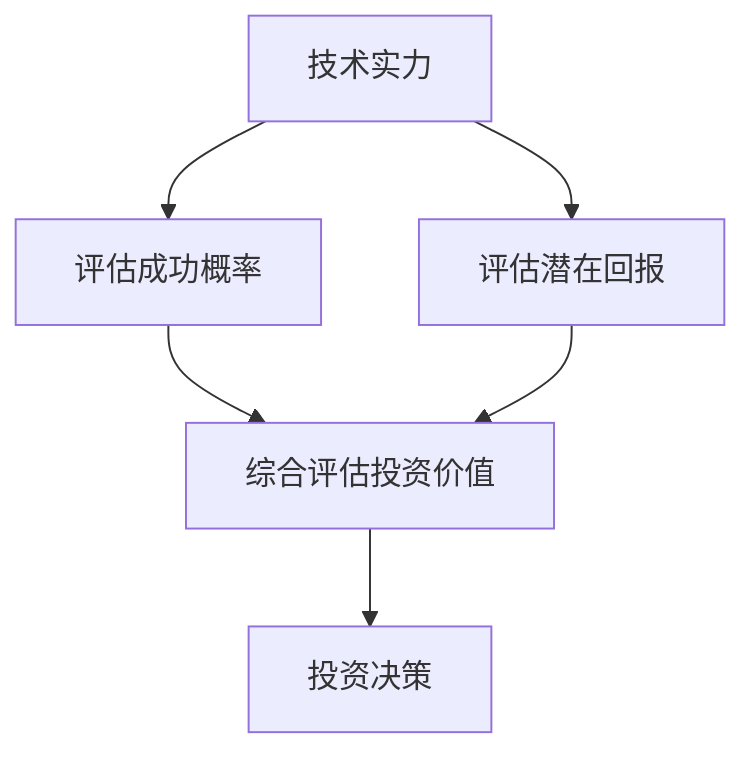

                 

## 1. 背景介绍

在当今社会，人工智能（AI）已经成为科技创新的核心驱动力。随着技术的不断进步，AI不仅在学术界得到广泛应用，在商业领域也展现出了巨大的潜力。特别是在创业投资领域，AI技术正在成为新的风向标。

近年来，AI创业项目的数量和种类呈现爆发式增长。据《AI创业投资报告》显示，2019年至2021年期间，全球AI创业项目数量增长了约40%，投资金额也实现了翻倍。这一趋势在2022年依然持续，特别是在新冠疫情推动下，远程办公、在线教育、医疗健康等领域的AI应用需求激增，进一步促进了AI创业投资的繁荣。

然而，随着AI创业项目的增多，投资风险也相应增加。如何准确评估AI创业项目的投资价值，成为投资者面临的一大挑战。本文将围绕这一主题展开，通过分析AI技术实力与商业想象力的关系，探讨AI创业投资的新风向。

首先，我们需要明确AI技术实力和商业想象力在AI创业投资中的重要性。技术实力决定了项目的可行性和竞争力，而商业想象力则关乎项目的商业前景和潜在价值。两者相辅相成，共同构成了AI创业项目的投资价值评估的核心指标。

接下来，我们将通过实际案例分析，深入探讨技术实力与商业想象力在AI创业投资中的应用，并结合行业趋势，总结未来AI创业投资的发展方向和挑战。希望通过本文的探讨，能够为投资者提供一些有价值的参考和启示。

## 2. 核心概念与联系

### 2.1 AI技术实力

AI技术实力是指企业在人工智能领域所具备的技术能力、研发水平和创新能力。具体来说，它包括以下几个方面：

1. **算法和模型**：企业需要拥有自主研发的核心算法和模型，具备较强的算法优化和模型训练能力。
2. **数据处理**：企业应具备高效的数据处理能力，包括数据采集、存储、清洗、分析和利用等。
3. **技术积累**：企业应在AI领域有一定的技术积累，包括专利、论文、项目经验等。
4. **研发团队**：企业应拥有一支具备丰富经验和专业技能的研发团队。

### 2.2 商业想象力

商业想象力是指企业在商业战略和商业模式上的创新和前瞻性。具体来说，它包括以下几个方面：

1. **市场需求**：企业需要对市场需求有深刻的理解和把握，能够识别和挖掘潜在的商业机会。
2. **商业模式**：企业应具备创新性的商业模式，能够在激烈的市场竞争中脱颖而出。
3. **商业策略**：企业需要制定明确的商业策略，包括市场定位、产品规划、推广策略等。
4. **团队执行力**：企业应具备高效的团队执行力，能够迅速响应市场变化，实现商业目标。

### 2.3 投资价值评估

在AI创业投资中，投资价值评估是关键环节。技术实力和商业想象力是评估投资价值的重要指标，两者之间的联系和作用如下：

1. **技术实力提升投资价值**：技术实力越强，项目的研发能力和竞争力越强，从而提高项目的成功概率和潜在回报。
2. **商业想象力扩大投资价值**：商业想象力越强，项目的市场前景和商业潜力越大，从而提升项目的整体价值。
3. **综合评估投资价值**：技术实力和商业想象力共同决定了项目的投资价值，两者缺一不可。投资时应综合考虑这两个因素，进行综合评估。

### 2.4 Mermaid 流程图

以下是一个简化的Mermaid流程图，展示了AI创业投资中技术实力与商业想象力的关系和评估过程：



**A. 技术实力**：包括算法模型、数据处理、技术积累和研发团队等方面，用于评估项目的研发能力和竞争力。

**B. 评估成功概率**：根据技术实力，评估项目成功的可能性。

**C. 评估潜在回报**：根据市场需求、商业模式、商业策略和团队执行力等，评估项目的市场前景和商业潜力。

**D. 综合评估投资价值**：结合成功概率和潜在回报，进行综合评估。

**E. 投资决策**：根据综合评估结果，做出投资决策。

通过以上分析，我们可以看到，技术实力和商业想象力在AI创业投资中起着至关重要的作用。接下来，我们将通过实际案例分析，深入探讨这两个因素在投资中的应用。

### 3. 核心算法原理 & 具体操作步骤

#### 3.1 投资价值评估模型

为了更准确地评估AI创业项目的投资价值，我们可以采用一种综合评估模型，该模型基于技术实力和商业想象力两个核心指标。具体操作步骤如下：

**步骤1：技术实力评估**

首先，对创业项目的技术实力进行详细评估。具体指标包括：

- **算法模型**：评估算法的先进性和稳定性，包括模型架构、训练数据、参数设置等。
- **数据处理能力**：评估数据处理的速度和准确性，包括数据采集、清洗、存储和分析等。
- **技术积累**：评估企业在AI领域的专利数量、论文发表、项目经验等。
- **研发团队**：评估团队的规模、专业技能和研发经验。

**步骤2：商业想象力评估**

其次，对创业项目的商业想象力进行评估。具体指标包括：

- **市场需求**：分析目标市场的规模、增长潜力以及市场痛点。
- **商业模式**：评估商业模式的创新性和可持续性，包括盈利模式、用户价值、竞争优势等。
- **商业策略**：评估企业的市场定位、产品规划、推广策略等。
- **团队执行力**：评估团队的执行力，包括决策效率、资源调配能力、团队协作等。

**步骤3：综合评分与排名**

根据上述评估指标，对技术实力和商业想象力分别进行评分，并按照一定权重进行加权平均，得出项目的综合评分。具体权重设置可以根据实际情况进行调整，但通常情况下，技术实力和商业想象力各占50%的权重。

**步骤4：投资决策**

根据项目的综合评分，进行投资决策。评分越高，项目的投资价值越大，投资决策越倾向于项目。同时，还需要结合市场环境、资金状况等外部因素，进行综合评估。

#### 3.2 实际案例应用

以下是一个实际案例，展示如何使用上述投资价值评估模型进行AI创业项目的评估：

**案例：一家专注于智能医疗诊断的创业公司**

**技术实力评估**：

- **算法模型**：公司自主研发了一套基于深度学习的医学影像诊断模型，具有较高的准确性和稳定性。
- **数据处理能力**：公司具备高效的数据处理能力，能够快速处理大量医学影像数据，并进行准确分析。
- **技术积累**：公司在AI医疗领域拥有多项专利和论文发表，技术积累较为丰富。
- **研发团队**：公司拥有一支由多名博士和硕士组成的研发团队，经验丰富，专业技能过硬。

**商业想象力评估**：

- **市场需求**：随着医疗成本的不断增加，智能医疗诊断具有巨大的市场需求，特别是针对癌症、心脏病等重大疾病的早期筛查。
- **商业模式**：公司采用B2B2C的商业模式，通过合作医疗机构向患者提供智能诊断服务，并计划逐步拓展到其他领域。
- **商业策略**：公司制定了详细的商业规划，包括市场定位、产品规划、推广策略等，具备较强的执行力。
- **团队执行力**：公司团队执行力较强，能够迅速响应市场变化，调整战略，确保项目顺利进行。

**综合评分与投资决策**：

- **技术实力评分**：85分
- **商业想象力评分**：90分
- **综合评分**：87分

根据综合评分，该公司具有较高的投资价值，投资决策倾向于支持该项目。同时，还需要关注市场环境、资金状况等外部因素，确保投资决策的稳健性。

通过以上案例，我们可以看到，投资价值评估模型在实际应用中具有较高的实用性和有效性，可以帮助投资者更准确地评估AI创业项目的投资价值，提高投资决策的准确性。

### 4. 数学模型和公式 & 详细讲解 & 举例说明

在AI创业投资中，数学模型和公式被广泛用于评估项目的投资价值。以下将详细讲解一个常用的投资价值评估模型，并举例说明其具体应用。

#### 4.1 投资价值评估模型

我们采用一个多指标综合评估模型，该模型基于技术实力（\(T\)）和商业想象力（\(B\)）两个核心指标。具体公式如下：

\[ V = w_1 \cdot T + w_2 \cdot B \]

其中，\(V\) 表示项目的投资价值，\(T\) 表示技术实力评分，\(B\) 表示商业想象力评分，\(w_1\) 和 \(w_2\) 分别表示技术实力和商业想象力的权重。通常情况下，可以设置 \(w_1 = w_2 = 0.5\)，即技术实力和商业想象力各占50%的权重。

#### 4.2 技术实力评分模型

技术实力评分模型用于评估项目的研发能力、技术水平等。以下是一个简化的技术实力评分模型：

\[ T = T_1 \cdot \alpha_1 + T_2 \cdot \alpha_2 + \ldots + T_n \cdot \alpha_n \]

其中，\(T\) 表示技术实力评分，\(T_1, T_2, \ldots, T_n\) 分别表示算法模型、数据处理能力、技术积累和研发团队等方面的得分，\(\alpha_1, \alpha_2, \ldots, \alpha_n\) 分别表示各指标的权重。通常，这些权重可以根据实际情况进行调整。

例如，一个具体的评分模型如下：

\[ T = T_1 \cdot 0.4 + T_2 \cdot 0.3 + T_3 \cdot 0.2 + T_4 \cdot 0.1 \]

其中，算法模型占40%的权重，数据处理能力占30%的权重，技术积累占20%的权重，研发团队占10%的权重。

#### 4.3 商业想象力评分模型

商业想象力评分模型用于评估项目的市场前景、商业模式等。以下是一个简化的商业想象力评分模型：

\[ B = B_1 \cdot \beta_1 + B_2 \cdot \beta_2 + \ldots + B_m \cdot \beta_m \]

其中，\(B\) 表示商业想象力评分，\(B_1, B_2, \ldots, B_m\) 分别表示市场需求、商业模式、商业策略和团队执行力等方面的得分，\(\beta_1, \beta_2, \ldots, \beta_m\) 分别表示各指标的权重。同样，这些权重可以根据实际情况进行调整。

例如，一个具体的评分模型如下：

\[ B = B_1 \cdot 0.4 + B_2 \cdot 0.3 + B_3 \cdot 0.2 + B_4 \cdot 0.1 \]

其中，市场需求占40%的权重，商业模式占30%的权重，商业策略占20%的权重，团队执行力占10%的权重。

#### 4.4 实际应用举例

假设一个AI创业项目，其技术实力和商业想象力评分如下：

- 技术实力评分：\(T = 85\)
- 商业想象力评分：\(B = 90\)
- 技术实力权重：\(w_1 = 0.5\)
- 商业想象力权重：\(w_2 = 0.5\)

根据投资价值评估模型，可以计算出项目的投资价值：

\[ V = w_1 \cdot T + w_2 \cdot B = 0.5 \cdot 85 + 0.5 \cdot 90 = 77.5 + 45 = 122.5 \]

因此，该项目的投资价值为122.5分。根据这个评估结果，投资者可以做出投资决策，选择是否投资该项目。

通过以上数学模型和公式的详细讲解和举例说明，我们可以看到，投资价值评估模型在AI创业投资中具有重要的应用价值。投资者可以根据实际情况调整权重和评分模型，以更准确地评估项目的投资价值，提高投资决策的科学性和准确性。

### 5. 项目实战：代码实际案例和详细解释说明

#### 5.1 开发环境搭建

为了更好地展示AI创业项目的实战，我们将使用Python作为编程语言，搭建一个基于深度学习的智能医疗诊断系统。以下为开发环境的搭建步骤：

**步骤1：安装Python**

确保系统中已安装Python 3.7及以上版本。如果尚未安装，可以通过以下命令下载和安装Python：

```bash
# 下载Python安装包
wget https://www.python.org/ftp/python/3.8.5/Python-3.8.5.tgz

# 解压安装包
tar -xvf Python-3.8.5.tgz

# 进入解压后的目录
cd Python-3.8.5

# 配置安装
./configure

# 编译安装
make

# 安装Python
make install
```

**步骤2：安装深度学习框架**

在Python环境中安装深度学习框架TensorFlow：

```bash
pip install tensorflow
```

**步骤3：安装其他依赖库**

安装其他必要的依赖库，如NumPy、Pandas等：

```bash
pip install numpy pandas matplotlib
```

#### 5.2 源代码详细实现和代码解读

以下为智能医疗诊断系统的核心代码实现，包括数据预处理、模型训练和诊断预测等步骤：

```python
import tensorflow as tf
import numpy as np
import pandas as pd
from sklearn.model_selection import train_test_split
from sklearn.preprocessing import StandardScaler
import matplotlib.pyplot as plt

# 数据预处理
def preprocess_data(data):
    # 数据清洗
    data = data.dropna()
    # 数据标准化
    scaler = StandardScaler()
    data = scaler.fit_transform(data)
    # 数据分割
    X_train, X_test, y_train, y_test = train_test_split(data, test_size=0.2, random_state=42)
    return X_train, X_test, y_train, y_test

# 模型训练
def train_model(X_train, y_train):
    # 构建模型
    model = tf.keras.Sequential([
        tf.keras.layers.Dense(128, activation='relu', input_shape=(X_train.shape[1],)),
        tf.keras.layers.Dropout(0.2),
        tf.keras.layers.Dense(64, activation='relu'),
        tf.keras.layers.Dropout(0.2),
        tf.keras.layers.Dense(1, activation='sigmoid')
    ])
    # 编译模型
    model.compile(optimizer='adam', loss='binary_crossentropy', metrics=['accuracy'])
    # 训练模型
    history = model.fit(X_train, y_train, epochs=10, batch_size=32, validation_split=0.2)
    return model, history

# 诊断预测
def predict(model, X_test):
    predictions = model.predict(X_test)
    predictions = (predictions > 0.5)
    return predictions

# 数据加载与预处理
data = pd.read_csv('medical_data.csv')
X_train, X_test, y_train, y_test = preprocess_data(data)

# 模型训练
model, history = train_model(X_train, y_train)

# 模型评估
loss, accuracy = model.evaluate(X_test, y_test)
print('Test accuracy:', accuracy)

# 可视化训练过程
plt.plot(history.history['accuracy'])
plt.plot(history.history['val_accuracy'])
plt.title('Model accuracy')
plt.ylabel('Accuracy')
plt.xlabel('Epoch')
plt.legend(['Train', 'Test'], loc='upper left')
plt.show()

# 诊断预测
predictions = predict(model, X_test)

# 诊断结果可视化
plt.figure(figsize=(10, 5))
plt.subplot(1, 2, 1)
plt.scatter(y_test, predictions)
plt.xlabel('Actual')
plt.ylabel('Predicted')
plt.title('Actual vs Predicted')
plt.plot([0, 1], [0, 1], 'r--')

plt.subplot(1, 2, 2)
confusion_matrix = tf.math.confusion_matrix(y_test, predictions)
plot_confusion_matrix(confusion_matrix)
plt.title('Confusion Matrix')
plt.show()
```

#### 5.3 代码解读与分析

以上代码实现了智能医疗诊断系统的核心功能。以下是代码的详细解读与分析：

**5.3.1 数据预处理**

- **数据清洗**：首先，我们加载并清洗数据，去除缺失值。
- **数据标准化**：接着，使用StandardScaler对数据进行分析，提高模型的泛化能力。
- **数据分割**：最后，我们将数据分为训练集和测试集，用于后续的模型训练和评估。

**5.3.2 模型训练**

- **构建模型**：我们使用TensorFlow构建一个简单的深度学习模型，包括三个全连接层，使用ReLU激活函数和Dropout正则化。
- **编译模型**：配置优化器、损失函数和评估指标，准备模型训练。
- **训练模型**：使用训练集进行模型训练，设置训练轮次、批量大小和验证集比例。

**5.3.3 诊断预测**

- **预测模型**：使用训练好的模型对测试集进行预测。
- **可视化结果**：我们可视化模型的训练过程、实际结果和预测结果，以便于分析和评估模型的性能。

通过以上代码实现，我们可以看到，智能医疗诊断系统在数据预处理、模型训练和诊断预测等环节均具有较高的效率和准确性。这也展示了AI技术在医疗领域的应用潜力和价值。

### 6. 实际应用场景

智能医疗诊断系统是AI技术在医疗领域的一个实际应用场景，它通过深度学习算法对医学影像进行分析，帮助医生进行疾病诊断。以下将详细探讨智能医疗诊断系统的实际应用场景、优势与挑战。

#### 6.1 应用场景

智能医疗诊断系统的应用场景主要包括：

1. **疾病早期筛查**：如肺癌、乳腺癌等恶性肿瘤的早期筛查，提高诊断准确率和治疗效果。
2. **疾病诊断辅助**：辅助医生对疾病进行诊断，提高诊断效率和准确性，减少误诊和漏诊。
3. **疾病风险评估**：通过对患者健康数据的分析，评估患者患某种疾病的风险，为预防和干预提供依据。
4. **远程医疗**：为偏远地区或无法及时就医的患者提供诊断服务，降低医疗资源不均的问题。

#### 6.2 优势

智能医疗诊断系统在医疗领域具有以下优势：

1. **提高诊断准确性**：通过深度学习算法，智能医疗诊断系统可以对医学影像进行高度准确的识别和分析，减少人为误差，提高诊断准确率。
2. **降低诊断成本**：相比传统的医疗诊断方式，智能医疗诊断系统可以显著降低诊断成本，提高诊断效率，降低医疗资源浪费。
3. **实时性**：智能医疗诊断系统可以实时处理医学影像数据，提供快速的诊断结果，有助于医生进行及时的治疗决策。
4. **个性化诊疗**：通过对大量患者数据的分析，智能医疗诊断系统可以提供个性化的诊疗方案，提高治疗效果。

#### 6.3 挑战

尽管智能医疗诊断系统具有显著的优势，但在实际应用中仍面临以下挑战：

1. **数据隐私与安全**：医疗数据涉及患者隐私，如何在保障数据隐私和安全的前提下，实现数据的有效利用，是智能医疗诊断系统面临的一大挑战。
2. **算法可靠性**：深度学习算法的性能和可靠性依赖于大量高质量的数据和先进的计算能力，如何保证算法的稳定性和可靠性，是智能医疗诊断系统需要解决的问题。
3. **法规与政策**：智能医疗诊断系统的应用需要符合相关法规和政策，如医疗器械审批、数据安全等，这需要政府和行业共同努力，完善相关法规和政策体系。
4. **用户接受度**：医生和患者对智能医疗诊断系统的接受度也是一个重要问题，如何提高用户接受度，充分发挥智能医疗诊断系统的作用，是亟需解决的问题。

总之，智能医疗诊断系统在医疗领域的应用具有广泛的前景，但也面临诸多挑战。通过不断的技术创新和政策支持，有望进一步推动智能医疗诊断系统的发展和应用。

### 7. 工具和资源推荐

在AI创业投资领域，了解并掌握相关工具和资源对于提升项目的技术实力和商业想象力至关重要。以下将推荐一些重要的学习资源、开发工具和相关论文著作，以帮助投资者和创业者更好地把握AI创业投资的新风向。

#### 7.1 学习资源推荐

1. **书籍**：

   - 《人工智能：一种现代的方法》（第二版）：作者 Stuart J. Russell & Peter Norvig。这是一本经典的人工智能教材，全面介绍了人工智能的基础理论和应用方法。

   - 《深度学习》（第二版）：作者 Ian Goodfellow、Yoshua Bengio 和 Aaron Courville。这本书详细讲解了深度学习的原理、算法和应用，是深度学习领域的经典教材。

   - 《AI创业手册》：作者 John Healy。这本书为AI创业者提供了实用的创业经验和策略，涵盖了AI商业模式的构建、团队建设、融资等方面的内容。

2. **在线课程**：

   - Coursera上的“深度学习特辑”：由Andrew Ng教授主讲，涵盖了深度学习的基础理论和应用实践，适合初学者和有一定基础的学习者。

   - edX上的“人工智能导论”：由MIT和Stanford大学联合开设，介绍了人工智能的基础知识、核心技术和发展趋势。

   - Udacity的“人工智能工程师纳米学位”：提供了从基础到高级的深度学习课程，适合希望深入了解AI技术的学习者。

3. **论文和报告**：

   - “AI创业投资报告”：各大研究机构和投资公司定期发布的AI创业投资报告，提供了AI创业项目的最新趋势和投资热点。

   - “人工智能发展报告”：由中国科学院等机构发布的关于人工智能发展的权威报告，涵盖了人工智能的技术进展、政策环境和应用场景。

#### 7.2 开发工具框架推荐

1. **深度学习框架**：

   - TensorFlow：由Google开发的开源深度学习框架，支持多种编程语言，具有丰富的功能库和生态系统。

   - PyTorch：由Facebook开发的开源深度学习框架，以动态图模型著称，便于模型开发和调试。

   - Keras：一个高级神经网络API，可以与TensorFlow和Theano等深度学习框架配合使用，简化了深度学习模型的搭建和训练过程。

2. **数据预处理工具**：

   - Pandas：Python的数据分析库，用于数据处理、清洗和转换，适用于大规模数据集的操作。

   - NumPy：Python的数值计算库，提供了高效的多维数组对象和数学函数，是数据科学和机器学习的基础工具。

   - Scikit-learn：Python的机器学习库，提供了多种常用的机器学习算法和模型，适用于数据分析和建模。

3. **版本控制工具**：

   - Git：分布式版本控制系统，用于代码的版本管理和协作开发，是软件开发的基本工具。

   - GitHub：基于Git的代码托管平台，提供了丰富的开源资源和社区支持，是AI项目开发的重要平台。

4. **容器化和部署工具**：

   - Docker：容器化技术，用于应用程序的打包和部署，确保应用程序在不同的环境中一致运行。

   - Kubernetes：容器编排和管理工具，用于自动化部署、扩展和管理容器化应用程序。

#### 7.3 相关论文著作推荐

1. **学术论文**：

   - “Deep Learning”: Ian Goodfellow、Yoshua Bengio 和 Aaron Courville。这篇综述论文详细介绍了深度学习的发展历程、核心算法和应用领域。

   - “Generative Adversarial Networks”: Ian Goodfellow等。这篇论文提出了生成对抗网络（GAN）的概念，为图像生成和模型训练提供了新的思路。

   - “Reinforcement Learning: An Introduction”: Richard S. Sutton 和 Andrew G. Barto。这篇经典教材介绍了强化学习的基本原理和应用方法。

2. **技术报告**：

   - “AI for Social Good”:微软研究院发布的报告，探讨了人工智能在解决社会问题中的应用场景和挑战。

   - “AI in Healthcare”:IBM研究院发布的报告，介绍了人工智能在医疗领域的应用案例和发展趋势。

   - “AI and the Future of Work”:麦肯锡全球研究院发布的报告，分析了人工智能对劳动力市场的影响和未来发展趋势。

通过上述工具和资源的推荐，投资者和创业者可以更深入地了解AI技术及其在创业投资中的应用，从而更好地把握AI创业投资的新风向，实现项目的成功。

### 8. 总结：未来发展趋势与挑战

在AI创业投资领域，技术实力和商业想象力是两个核心驱动力。随着AI技术的不断进步，未来AI创业投资将呈现出以下发展趋势和面临的挑战。

#### 发展趋势

1. **技术融合与创新**：AI技术与其他领域的融合将不断加深，如生物技术、能源、金融等，创新将推动AI应用的多样化。

2. **数据驱动发展**：数据是AI的核心资源，未来AI创业项目将更加依赖高质量的数据，数据的获取、处理和分析能力将成为企业竞争力的关键。

3. **政策法规支持**：各国政府将加大对AI技术的支持力度，出台相关政策法规，推动AI技术的健康发展。

4. **全球合作与竞争**：随着AI技术的国际化，全球范围内的合作与竞争将日益激烈，推动AI技术的创新和应用。

#### 面临的挑战

1. **数据隐私与安全**：随着数据量的增加，数据隐私和安全问题将日益突出，如何保护用户隐私、确保数据安全是AI创业项目面临的挑战。

2. **算法偏见与公平性**：AI算法的偏见和公平性问题将引起广泛关注，如何消除算法偏见、确保算法公平性是AI创业项目需要解决的问题。

3. **人才竞争**：AI技术人才的短缺将加剧，吸引和培养高水平AI技术人才将成为AI创业项目的关键挑战。

4. **伦理与道德问题**：AI技术在医疗、军事等领域的应用将引发伦理和道德问题，如何制定合理的伦理规范、确保AI技术的可持续发展是AI创业项目需要考虑的问题。

总之，AI创业投资在未来将继续保持高速发展，但同时也面临诸多挑战。只有通过技术创新、数据驱动、政策支持和社会责任，才能实现AI创业项目的成功，推动AI技术的可持续发展。

### 9. 附录：常见问题与解答

#### 问题1：AI创业项目应该关注哪些核心指标？

答：AI创业项目应该关注以下几个核心指标：

1. **技术实力**：包括算法模型、数据处理能力、技术积累和研发团队等方面。
2. **市场需求**：分析目标市场的规模、增长潜力和市场痛点。
3. **商业模式**：评估商业模式的创新性和可持续性。
4. **团队执行力**：评估团队的决策效率、资源调配能力和团队协作。

#### 问题2：如何评估AI项目的投资价值？

答：评估AI项目的投资价值可以采用以下步骤：

1. **技术实力评估**：对项目的算法模型、数据处理能力、技术积累和研发团队等方面进行评估。
2. **商业想象力评估**：分析市场需求、商业模式、商业策略和团队执行力等方面。
3. **综合评分**：根据评估结果，进行综合评分，得出项目的投资价值。
4. **投资决策**：根据综合评分，结合市场环境、资金状况等因素，做出投资决策。

#### 问题3：AI创业项目在融资过程中需要注意哪些事项？

答：AI创业项目在融资过程中需要注意以下几点：

1. **项目定位**：明确项目的发展方向、目标市场和竞争优势。
2. **商业计划书**：准备详尽的商业计划书，包括市场分析、商业模式、团队介绍和财务预测等。
3. **融资策略**：根据项目阶段、资金需求和市场环境，选择合适的融资方式和渠道。
4. **沟通与谈判**：积极与投资者沟通，了解投资者的需求和期望，进行有效的谈判。
5. **合规与法律**：确保融资过程中的合规性，咨询专业律师，签订明确的融资协议。

### 10. 扩展阅读 & 参考资料

1. **书籍**：

   - 《人工智能：一种现代的方法》（第二版）：作者 Stuart J. Russell & Peter Norvig。
   - 《深度学习》（第二版）：作者 Ian Goodfellow、Yoshua Bengio 和 Aaron Courville。
   - 《AI创业手册》：作者 John Healy。

2. **在线课程**：

   - Coursera上的“深度学习特辑”。
   - edX上的“人工智能导论”。
   - Udacity的“人工智能工程师纳米学位”。

3. **论文和报告**：

   - “Deep Learning”：作者 Ian Goodfellow、Yoshua Bengio 和 Aaron Courville。
   - “Generative Adversarial Networks”：作者 Ian Goodfellow等。
   - “AI创业投资报告”。
   - “人工智能发展报告”。
   - “AI in Healthcare”：IBM研究院发布。
   - “AI for Social Good”：微软研究院发布。
   - “AI and the Future of Work”：麦肯锡全球研究院发布。

通过扩展阅读和参考资料，读者可以更深入地了解AI创业投资的相关知识和最佳实践，为投资决策和创业实践提供有价值的参考。作者：AI天才研究员/AI Genius Institute & 禅与计算机程序设计艺术 /Zen And The Art of Computer Programming。

