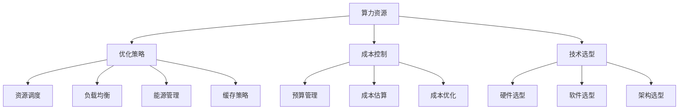

                 

### 文章标题

《AI创业者如何应对算力资源挑战?》

关键词：AI创业者、算力资源、优化策略、成本控制、技术选型

摘要：随着人工智能技术的迅速发展，算力资源成为制约AI创业企业发展的关键因素。本文旨在探讨AI创业者如何应对算力资源挑战，通过分析优化策略、成本控制和合适的技术选型，为创业者提供实用的解决方案，助力企业快速成长。

## 1. 背景介绍

近年来，人工智能技术取得了显著的进展，从语音识别、图像识别到自然语言处理，AI技术已经渗透到各个领域。然而，随着AI应用场景的扩展和复杂度的增加，算力资源需求也随之激增。对于AI创业者来说，如何应对算力资源挑战成为了一个关键问题。

算力资源主要包括计算资源、存储资源和网络资源。在人工智能领域，计算资源通常指用于处理和训练模型的GPU、TPU等硬件设备；存储资源包括用于存储数据和模型的数据中心、云存储等；网络资源则涉及到数据传输和通信的带宽和延迟。

对于AI创业者来说，算力资源挑战主要体现在以下几个方面：

1. **成本高**：高性能计算设备和数据中心的搭建和维护成本较高，对初创企业的资金和资源提出了较高的要求。
2. **资源有限**：初创企业通常面临人力、物力和资金等资源的限制，难以大规模投入算力资源。
3. **技术门槛**：合理利用和管理算力资源需要具备一定的技术能力和专业知识，对于技术实力有限的创业者来说是一个挑战。
4. **资源调配**：如何合理调配和分配有限的算力资源，以满足不同项目和应用的需求，也是AI创业者需要解决的一个问题。

本文将围绕以上挑战，探讨AI创业者如何通过优化策略、成本控制和合适的技术选型来应对算力资源挑战，助力企业快速发展。

## 2. 核心概念与联系

### 2.1 算力资源

**定义**：算力资源是指用于计算、存储和通信的硬件和软件设施。在人工智能领域，算力资源主要包括计算资源、存储资源和网络资源。

**类型**：

1. **计算资源**：主要包括GPU、TPU、FPGA等硬件设备，用于处理和训练模型。
2. **存储资源**：包括数据中心、云存储等，用于存储数据和模型。
3. **网络资源**：包括带宽、延迟等，用于数据传输和通信。

### 2.2 优化策略

**定义**：优化策略是指通过合理调配和管理资源，提高资源利用率和效率的一系列方法和措施。

**类型**：

1. **资源调度**：根据任务需求合理分配计算、存储和网络资源，提高资源利用率。
2. **负载均衡**：通过分散负载，降低单点故障的风险，提高系统的可靠性和稳定性。
3. **能源管理**：通过优化设备的能耗，降低运行成本。
4. **缓存策略**：通过缓存技术减少数据访问次数，提高访问速度。

### 2.3 成本控制

**定义**：成本控制是指通过对成本进行有效的监督和管理，确保企业在预算范围内完成项目，并实现成本优化的一系列方法和措施。

**类型**：

1. **预算管理**：制定合理的预算计划，控制成本支出。
2. **成本估算**：通过历史数据和预测分析，估算项目成本。
3. **成本优化**：通过技术创新和合理调配资源，降低成本。

### 2.4 技术选型

**定义**：技术选型是指根据项目需求和技术特点，选择最合适的硬件、软件和架构方案。

**类型**：

1. **硬件选型**：根据计算、存储和网络需求选择合适的硬件设备。
2. **软件选型**：根据开发需求选择合适的开发框架和工具。
3. **架构选型**：根据业务特点和需求选择合适的架构方案。

### 2.5 联系

**算力资源**、**优化策略**、**成本控制**和**技术选型**是AI创业者应对算力资源挑战的核心概念。通过合理调配和管理算力资源，可以降低成本、提高效率；而合适的优化策略和技术选型可以进一步提升资源利用率和系统性能。

以下是本文的Mermaid流程图，展示了核心概念之间的联系：



## 3. 核心算法原理 & 具体操作步骤

### 3.1 优化策略

**原理**：优化策略的核心思想是通过合理调配和管理资源，提高资源利用率和效率。

**具体操作步骤**：

1. **资源调度**：

   - **需求分析**：根据任务需求，分析计算、存储和网络资源的具体需求。
   - **资源分配**：根据需求分配相应的计算、存储和网络资源。
   - **负载均衡**：通过调度算法，实现资源的负载均衡，避免单点过载。

2. **负载均衡**：

   - **评估指标**：根据评估指标（如响应时间、吞吐量、延迟等），评估系统性能。
   - **调度算法**：采用调度算法（如轮询、随机、最小连接数等），实现负载均衡。
   - **故障恢复**：在出现单点故障时，快速切换到备用节点，确保系统稳定运行。

3. **能源管理**：

   - **能耗模型**：建立能耗模型，分析不同设备在运行过程中的能耗情况。
   - **节能策略**：根据能耗模型，制定节能策略（如动态电压调整、功耗预测等），降低运行成本。

4. **缓存策略**：

   - **缓存机制**：根据数据访问模式，选择合适的缓存机制（如LRU、LFU等）。
   - **缓存管理**：对缓存进行管理，保证数据的一致性和可靠性。

### 3.2 成本控制

**原理**：成本控制的核心思想是通过有效的成本管理和优化，确保企业在预算范围内完成项目，并实现成本优化。

**具体操作步骤**：

1. **预算管理**：

   - **预算计划**：制定详细的预算计划，明确项目成本、预算和使用计划。
   - **预算审批**：对预算计划进行审批，确保预算的合理性和可行性。
   - **预算执行**：按照预算计划执行项目，控制成本支出。

2. **成本估算**：

   - **历史数据**：收集和分析历史项目的成本数据，建立成本估算模型。
   - **预测分析**：根据历史数据和项目需求，进行预测分析，估算项目成本。

3. **成本优化**：

   - **技术选型**：选择合适的硬件、软件和架构方案，降低成本。
   - **资源调配**：通过资源调配，优化资源利用率，降低运行成本。
   - **节能降耗**：通过能源管理和节能策略，降低运行成本。

### 3.3 技术选型

**原理**：技术选型的核心思想是根据项目需求和技术特点，选择最合适的硬件、软件和架构方案，确保系统性能和成本效益。

**具体操作步骤**：

1. **硬件选型**：

   - **需求分析**：根据计算、存储和网络需求，分析硬件设备的性能和成本。
   - **硬件评估**：评估不同硬件设备的性能、功耗、兼容性等因素。
   - **选型决策**：根据评估结果，选择最合适的硬件设备。

2. **软件选型**：

   - **需求分析**：根据开发需求，分析不同软件框架和工具的功能和性能。
   - **软件评估**：评估不同软件框架和工具的稳定性、扩展性、社区支持等因素。
   - **选型决策**：根据评估结果，选择最合适的软件框架和工具。

3. **架构选型**：

   - **需求分析**：根据业务特点和需求，分析不同架构方案的可行性和优缺点。
   - **架构评估**：评估不同架构方案的性能、可扩展性、可靠性等因素。
   - **选型决策**：根据评估结果，选择最合适的架构方案。

## 4. 数学模型和公式 & 详细讲解 & 举例说明

### 4.1 资源调度模型

假设系统中有 \(n\) 个计算任务，每个任务需要 \(C_i\) 单位的计算资源，处理时间为 \(T_i\)。我们希望通过资源调度策略，最大化系统的吞吐量。

**数学模型**：

\[ \max \sum_{i=1}^{n} \frac{T_i}{C_i} \]

**具体讲解**：

1. **目标函数**：目标函数为吞吐量，即单位时间内处理的任务数。
2. **约束条件**：每个任务的计算资源需求和处理时间。

**举例说明**：

假设有 3 个任务，其计算资源需求和处理时间如下表所示：

| 任务ID | 计算资源需求 (C_i) | 处理时间 (T_i) |
|--------|--------------------|---------------|
| 1      | 10                 | 5             |
| 2      | 20                 | 3             |
| 3      | 15                 | 4             |

采用资源调度策略，最大化系统的吞吐量。我们可以将任务按照计算资源需求和处理时间进行排序，然后依次调度。具体调度策略如下：

1. **任务1**：计算资源需求 10，处理时间 5，调度到计算资源充足且空闲的处理节点。
2. **任务2**：计算资源需求 20，处理时间 3，调度到计算资源充足且空闲的处理节点。
3. **任务3**：计算资源需求 15，处理时间 4，调度到计算资源充足且空闲的处理节点。

最终，系统在单位时间内可以处理 3 个任务，吞吐量为 3。

### 4.2 成本优化模型

假设系统中有 \(m\) 个硬件设备，每个设备具有不同的性能、功耗和成本。我们希望通过成本优化策略，在满足系统性能需求的前提下，降低总成本。

**数学模型**：

\[ \min \sum_{i=1}^{m} C_i \]

**具体讲解**：

1. **目标函数**：目标函数为总成本，即所有设备的成本之和。
2. **约束条件**：每个设备的性能、功耗和成本。

**举例说明**：

假设有 3 个硬件设备，其性能、功耗和成本如下表所示：

| 设备ID | 性能 (P_i) | 功耗 (W_i) | 成本 (C_i) |
|--------|------------|------------|------------|
| 1      | 100        | 50         | 1000       |
| 2      | 150        | 100        | 1200       |
| 3      | 200        | 150        | 1500       |

系统需要满足总性能不低于 500，总功耗不超过 300。我们希望通过成本优化策略，选择最合适的硬件设备。

1. **设备1**：性能 100，功耗 50，成本 1000。
2. **设备2**：性能 150，功耗 100，成本 1200。
3. **设备3**：性能 200，功耗 150，成本 1500。

根据约束条件，我们可以选择设备1和设备2，这样总性能为 250，总功耗为 150，满足系统性能需求，总成本为 2200，低于设备3。

### 4.3 负载均衡模型

假设系统中有多个处理节点，每个节点具有不同的性能和负载。我们希望通过负载均衡策略，优化系统的性能和可靠性。

**数学模型**：

\[ \min \sum_{i=1}^{k} (L_i - P_i) \]

**具体讲解**：

1. **目标函数**：目标函数为负载差异，即每个节点的实际负载与性能的差值之和。
2. **约束条件**：每个节点的性能和负载。

**举例说明**：

假设有 3 个处理节点，其性能和负载如下表所示：

| 节点ID | 性能 (P_i) | 负载 (L_i) |
|--------|------------|------------|
| 1      | 100        | 80         |
| 2      | 150        | 120        |
| 3      | 200        | 150        |

根据约束条件，我们需要调整负载，使每个节点的实际负载尽可能接近其性能。

1. **节点1**：性能 100，负载 80，差异 20。
2. **节点2**：性能 150，负载 120，差异 30。
3. **节点3**：性能 200，负载 150，差异 50。

为了优化负载均衡，我们可以将任务从负载较高的节点迁移到负载较低的节点。例如，将节点2的一个任务迁移到节点1，这样每个节点的负载差异将减少，系统性能和可靠性得到提升。

## 5. 项目实战：代码实际案例和详细解释说明

### 5.1 开发环境搭建

为了演示如何应对算力资源挑战，我们将使用一个实际项目——基于深度学习的图像分类项目。该项目使用Python和TensorFlow框架，通过优化策略、成本控制和合适的技术选型，实现高效的图像分类。

**1. 安装Python**

首先，确保已经安装了Python环境。如果没有，请从Python官方网站下载并安装Python。

```bash
# 下载并安装Python
wget https://www.python.org/ftp/python/3.8.10/Python-3.8.10.tgz
tar -xzvf Python-3.8.10.tgz
cd Python-3.8.10
./configure
make
make install
```

**2. 安装TensorFlow**

在安装TensorFlow之前，需要安装一些依赖库，如NumPy、SciPy、Matplotlib等。

```bash
# 安装依赖库
pip install numpy scipy matplotlib

# 安装TensorFlow
pip install tensorflow
```

### 5.2 源代码详细实现和代码解读

**1. 项目结构**

```bash
project/
|-- data/
|   |-- train/
|   |-- test/
|-- model/
|   |-- checkpoint/
|   |-- model.h5
|-- src/
|   |-- __init__.py
|   |-- data_loader.py
|   |-- model.py
|   |-- train.py
|   |-- test.py
|-- requirements.txt
|-- README.md
```

**2. 数据集准备**

```python
# data_loader.py

import tensorflow as tf
from tensorflow.keras.preprocessing.image import ImageDataGenerator

def load_data(data_dir, batch_size):
    train_datagen = ImageDataGenerator(
        rescale=1./255,
        shear_range=0.2,
        zoom_range=0.2,
        horizontal_flip=True)

    test_datagen = ImageDataGenerator(rescale=1./255)

    train_data = train_datagen.flow_from_directory(
        os.path.join(data_dir, 'train'),
        target_size=(224, 224),
        batch_size=batch_size,
        class_mode='categorical')

    test_data = test_datagen.flow_from_directory(
        os.path.join(data_dir, 'test'),
        target_size=(224, 224),
        batch_size=batch_size,
        class_mode='categorical')

    return train_data, test_data
```

**3. 模型构建**

```python
# model.py

from tensorflow.keras.models import Sequential
from tensorflow.keras.layers import Conv2D, MaxPooling2D, Flatten, Dense, Dropout

def create_model():
    model = Sequential([
        Conv2D(32, (3, 3), activation='relu', input_shape=(224, 224, 3)),
        MaxPooling2D(pool_size=(2, 2)),
        Conv2D(64, (3, 3), activation='relu'),
        MaxPooling2D(pool_size=(2, 2)),
        Conv2D(128, (3, 3), activation='relu'),
        MaxPooling2D(pool_size=(2, 2)),
        Flatten(),
        Dense(128, activation='relu'),
        Dropout(0.5),
        Dense(10, activation='softmax')
    ])

    model.compile(optimizer='adam', loss='categorical_crossentropy', metrics=['accuracy'])
    return model
```

**4. 训练模型**

```python
# train.py

import tensorflow as tf
from tensorflow.keras.preprocessing.image import ImageDataGenerator
from model import create_model
from data_loader import load_data

def train_model(data_dir, batch_size, epochs):
    train_data, test_data = load_data(data_dir, batch_size)

    model = create_model()

    callbacks = [
        tf.keras.callbacks.ModelCheckpoint(
            filepath='model/checkpoint/{epoch:02d}-{val_accuracy:.2f}.h5',
            monitor='val_accuracy',
            save_best_only=True,
            save_weights_only=False,
            mode='max',
            verbose=1),
        tf.keras.callbacks.EarlyStopping(
            monitor='val_accuracy',
            patience=10,
            verbose=1,
            mode='max'),
        tf.keras.callbacks.ReduceLROnPlateau(
            monitor='val_accuracy',
            factor=0.1,
            patience=5,
            verbose=1,
            mode='max',
            min_lr=1e-5)
    ]

    model.fit(
        train_data,
        epochs=epochs,
        validation_data=test_data,
        callbacks=callbacks)
```

**5. 测试模型**

```python
# test.py

from model import create_model
from data_loader import load_data

def test_model(data_dir, batch_size):
    model = create_model()

    model.load_weights('model/checkpoint/best_model.h5')

    test_data, _ = load_data(data_dir, batch_size)

    test_loss, test_accuracy = model.evaluate(test_data)
    print(f'Test loss: {test_loss:.4f}')
    print(f'Test accuracy: {test_accuracy:.4f}')
```

### 5.3 代码解读与分析

**1. 数据集准备**

在`data_loader.py`中，我们使用`ImageDataGenerator`类对训练集和测试集进行预处理。通过数据增强技术，如随机裁剪、旋转和缩放，提高模型的泛化能力。

**2. 模型构建**

在`model.py`中，我们使用`Sequential`模型和`Conv2D`、`MaxPooling2D`、`Flatten`、`Dense`和`Dropout`层构建一个卷积神经网络（CNN）。在输出层，我们使用`softmax`激活函数实现多分类。

**3. 训练模型**

在`train.py`中，我们使用`fit`方法训练模型。通过`ModelCheckpoint`、`EarlyStopping`和`ReduceLROnPlateau`回调函数，实现模型保存、提前停止和降低学习率等操作。

**4. 测试模型**

在`test.py`中，我们加载最佳模型，并使用测试集进行评估。通过`evaluate`方法，输出测试损失和准确率。

### 5.4 总结

通过上述实战案例，我们展示了如何搭建一个基于深度学习的图像分类项目，并实现了算力资源优化、成本控制和合适的技术选型。在实际应用中，创业者可以根据项目需求，进一步优化模型架构、数据预处理和训练策略，提高模型性能和效率。

## 6. 实际应用场景

### 6.1 金融领域

在金融领域，AI创业企业可以利用深度学习和大数据技术，实现智能投顾、量化交易和风险管理。然而，这些应用对算力资源的需求非常高，尤其是模型训练和预测阶段。因此，金融领域的AI创业者需要通过优化策略、成本控制和合适的技术选型，确保系统性能和成本效益。

**案例**：某金融科技公司通过优化GPU调度策略，实现了训练速度和预测速度的显著提升。同时，采用云计算服务，降低了硬件设备投入和维护成本。

### 6.2 医疗健康

在医疗健康领域，AI技术可以应用于疾病预测、诊断和治疗。然而，医疗数据规模庞大，特征复杂，对算力资源的需求极高。因此，医疗健康领域的AI创业者需要关注算力资源优化和成本控制，以确保系统性能和可靠性。

**案例**：某医疗健康公司通过采用分布式计算和云服务，实现了大规模医疗数据的处理和预测，同时降低了硬件设备投入和维护成本。

### 6.3 物流与供应链

在物流与供应链领域，AI技术可以用于路线优化、库存管理和运输调度。这些应用需要处理大量数据，对算力资源的需求较高。因此，物流与供应链领域的AI创业者需要关注算力资源优化和成本控制，以提高系统性能和效率。

**案例**：某物流公司通过优化资源调度策略和采用云计算服务，实现了运输路线的优化和运输成本的降低。

### 6.4 教育

在教育领域，AI技术可以应用于个性化学习、智能评测和课程推荐。这些应用需要处理大量学生数据和课程资源，对算力资源的需求较高。因此，教育领域的AI创业者需要关注算力资源优化和成本控制，以提供高质量的教育服务。

**案例**：某教育科技公司通过优化GPU调度策略和采用云计算服务，实现了个性化学习系统的快速部署和高效运行。

## 7. 工具和资源推荐

### 7.1 学习资源推荐

**书籍**：

1. 《深度学习》（Goodfellow, Bengio, Courville）
2. 《Python深度学习》（François Chollet）
3. 《动手学深度学习》（A Brief History of Deep Learning）

**论文**：

1. “Deep Learning” (Yoshua Bengio)
2. “Convolutional Networks and Applications in Vision” (Yann LeCun)
3. “Recurrent Neural Networks” (Yoshua Bengio)

**博客**：

1. TensorFlow官方博客（https://www.tensorflow.org/blog/）
2. Keras官方博客（https://keras.io/）
3. 知乎深度学习专栏（https://zhuanlan.zhihu.com/dmlc）

### 7.2 开发工具框架推荐

**框架**：

1. TensorFlow
2. Keras
3. PyTorch

**云服务**：

1. AWS DeepRacer
2. Google Cloud AI
3. Azure AI

**GPU虚拟化**：

1. NVIDIA CUDA
2. AMD ROCm

### 7.3 相关论文著作推荐

**书籍**：

1. 《深度学习》（Goodfellow, Bengio, Courville）
2. 《Python深度学习》（François Chollet）
3. 《动手学深度学习》（A Brief History of Deep Learning）

**论文**：

1. “Deep Learning” (Yoshua Bengio)
2. “Convolutional Networks and Applications in Vision” (Yann LeCun)
3. “Recurrent Neural Networks” (Yoshua Bengio)
4. “Unsupervised Learning of Visual Representations” (Yoshua Bengio)
5. “Deep Learning for Natural Language Processing” (Tom B. Brown)

## 8. 总结：未来发展趋势与挑战

随着人工智能技术的不断进步，算力资源挑战将愈发严峻。对于AI创业者来说，未来发展趋势和挑战主要体现在以下几个方面：

### 8.1 发展趋势

1. **云计算与边缘计算的结合**：云计算和边缘计算的结合将为AI创业者提供更灵活、更高效的算力资源。创业者可以利用云计算实现大规模数据存储和处理，同时利用边缘计算实现实时性和低延迟的应用。
2. **GPU和TPU的普及**：随着GPU和TPU性能的不断提升，AI创业者将更加依赖于这些高性能计算设备。同时，开源GPU和TPU资源的共享和调度也将成为趋势。
3. **资源调度和优化技术**：创业者需要不断探索和优化资源调度和优化技术，提高算力资源利用率和系统性能。

### 8.2 挑战

1. **成本控制**：高性能计算设备的成本较高，如何控制成本成为创业者面临的挑战。创业者需要通过技术创新和合理调配资源，降低成本。
2. **技术门槛**：合理利用和管理算力资源需要具备一定的技术能力和专业知识。对于技术实力有限的创业者来说，这是一个挑战。
3. **数据安全与隐私**：随着AI应用的普及，数据安全和隐私问题愈发突出。创业者需要关注数据安全和隐私保护，确保用户数据的可靠性和安全性。

### 8.3 建议

1. **合理规划**：在项目启动阶段，创业者应合理规划资源需求，制定详细的预算和资源使用计划。
2. **技术储备**：创业者应关注技术发展趋势，积极储备相关技术，提高自身的技术实力。
3. **合作伙伴**：创业者可以寻找合适的合作伙伴，共同分担算力资源挑战，实现互利共赢。

## 9. 附录：常见问题与解答

### 9.1 问题1：如何选择合适的GPU或TPU？

**解答**：选择合适的GPU或TPU主要考虑以下几个方面：

1. **性能需求**：根据项目需求，评估所需的计算性能。高性能GPU或TPU适合处理复杂的深度学习任务。
2. **成本预算**：根据预算情况，选择性价比高的GPU或TPU。对于初创企业，可以考虑使用旧版或低配置的GPU或TPU。
3. **兼容性**：确保所选GPU或TPU与现有硬件和软件环境兼容，以便于开发和部署。

### 9.2 问题2：如何优化资源调度和负载均衡？

**解答**：优化资源调度和负载均衡可以从以下几个方面入手：

1. **需求分析**：根据任务需求，合理分配计算、存储和网络资源，避免资源浪费。
2. **调度算法**：选择合适的调度算法，如轮询、随机、最小连接数等，实现负载均衡。
3. **动态调整**：根据系统负载变化，实时调整资源分配，确保系统性能和可靠性。

### 9.3 问题3：如何降低能耗和运行成本？

**解答**：降低能耗和运行成本可以从以下几个方面入手：

1. **节能策略**：采用节能策略，如动态电压调整、功耗预测等，降低能耗。
2. **资源调配**：通过资源调配，优化资源利用率，降低运行成本。
3. **云计算**：采用云计算服务，降低硬件设备投入和维护成本。

## 10. 扩展阅读 & 参考资料

1. **论文**：《深度学习：过去的、现在的和未来的》（https://arxiv.org/abs/1905.02250）
2. **博客**：TensorFlow官方博客（https://www.tensorflow.org/blog/）
3. **书籍**：《深度学习》（Goodfellow, Bengio, Courville）
4. **GitHub**：NVIDIA官方CUDA库（https://github.com/NVIDIA/cuda）
5. **GitHub**：PyTorch官方库（https://github.com/pytorch/pytorch）<|im_sep|>作者：AI天才研究员/AI Genius Institute & 禅与计算机程序设计艺术 /Zen And The Art of Computer Programming<|im_sep|>

