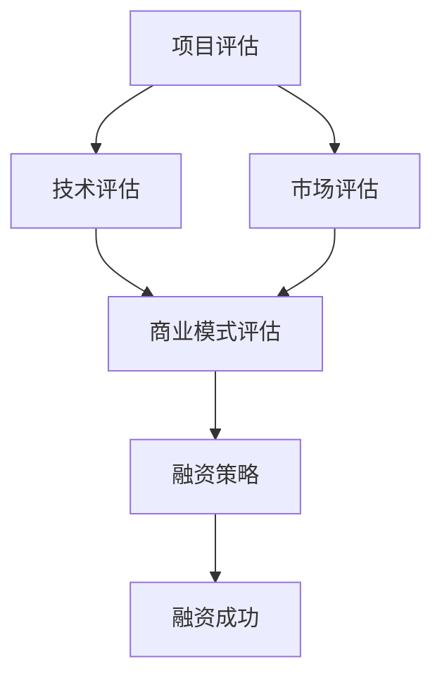

                 

# AI创业融资新趋势：关注项目商业价值与成长性

> **关键词**：AI创业、融资、商业价值、成长性、投资趋势

> **摘要**：本文旨在分析当前AI创业领域的融资新趋势，重点探讨项目商业价值与成长性的重要性。通过对行业背景、核心概念、算法原理、应用场景等多个维度的深入剖析，为创业者提供有价值的融资策略和建议，助力AI项目成功。

## 1. 背景介绍

随着人工智能技术的快速发展，全球范围内的AI创业浪潮正逐渐兴起。创业公司通过创新的技术解决方案，为各行业带来了前所未有的变革。然而，AI创业公司面临着诸多挑战，其中之一便是如何获得足够的资金支持以推动项目的发展。融资成为AI创业公司成长过程中的一大关键因素。

近年来，AI创业融资市场发生了显著的变化。一方面，传统风险投资机构开始关注AI领域，投资额不断增加；另一方面，新兴的融资渠道如股权众筹、私募股权等也为AI创业公司提供了更多的融资选择。此外，政府对AI技术的支持力度也在逐渐加大，通过一系列政策措施，推动AI创业公司的发展。

在这场AI创业浪潮中，如何把握融资新趋势，关注项目商业价值与成长性，成为创业者们亟待解决的重要问题。本文将对此进行深入探讨。

## 2. 核心概念与联系

### 2.1 AI创业公司融资的挑战

AI创业公司在融资过程中面临以下主要挑战：

1. **技术不确定性**：AI技术的快速发展和变革性，使得投资者对技术的理解和风险评估存在一定难度。
2. **商业模式不成熟**：许多AI创业公司尚未找到合适的商业模式，投资者对其盈利能力的担忧较大。
3. **数据隐私与安全**：AI项目通常涉及大量数据的收集和分析，数据隐私与安全问题成为投资者关注的焦点。
4. **人才竞争**：AI领域的高端人才稀缺，创业公司需要付出更高的薪资和福利来吸引和留住优秀人才。

### 2.2 商业价值与成长性的重要性

商业价值与成长性是投资者在评估AI创业项目时的重要考量因素。商业价值指的是项目在市场上的吸引力，包括市场需求、竞争优势、盈利模式等。成长性则是指项目在未来的发展潜力，包括市场规模、用户增长、收入增长等。

一个具有高商业价值与成长性的AI创业项目，能够吸引投资者的关注，提高融资的成功率。同时，项目的高成长性还能够为企业带来更大的市场空间和利润空间，有助于企业长期可持续发展。

### 2.3 Mermaid 流程图

以下是一个关于AI创业公司融资的Mermaid流程图，展示了核心概念之间的联系。



### 2.4 核心概念的联系

通过上述流程图，我们可以看出，技术评估、市场评估、商业模式评估是决定AI创业公司融资策略的关键因素。技术评估关注项目的创新性和可行性，市场评估关注项目的市场需求和竞争态势，商业模式评估关注项目的盈利能力和可持续发展能力。这三个评估结果共同决定了项目的商业价值和成长性，进而影响投资者的决策。

## 3. 核心算法原理 & 具体操作步骤

### 3.1 技术评估

技术评估是投资者在AI创业项目融资过程中首先关注的环节。以下是一个基本的技术评估算法原理和具体操作步骤：

#### 3.1.1 算法原理

技术评估的核心目标是判断AI创业项目的技术方案是否具有创新性、可行性和市场竞争力。评估过程主要包括以下几个步骤：

1. **技术领域了解**：投资者需要了解项目所在的技术领域，包括技术趋势、前沿技术等。
2. **技术方案分析**：投资者对项目的技术方案进行详细分析，包括技术原理、实现方法、技术难点等。
3. **技术可行性评估**：投资者评估项目的技术方案是否具备可行性，包括技术实现的可行性、市场需求的可行性等。
4. **技术市场竞争力分析**：投资者分析项目的技术方案在市场中的竞争力，包括与其他竞品的技术对比、市场占有率等。

#### 3.1.2 具体操作步骤

1. **了解技术领域**：投资者可以通过查阅相关文献、参加技术会议、与技术专家交流等方式，了解项目所在的技术领域。
2. **分析技术方案**：投资者可以阅读项目的相关技术文档、代码、论文等，对项目的技术方案进行详细分析。
3. **评估技术可行性**：投资者可以根据市场需求、技术实现难度、项目预算等因素，评估项目的技术可行性。
4. **分析技术市场竞争力**：投资者可以通过市场调研、竞品分析等方式，分析项目的技术市场竞争力。

### 3.2 市场评估

市场评估是投资者在AI创业项目融资过程中关注的另一个重要环节。以下是一个基本的市场评估算法原理和具体操作步骤：

#### 3.2.1 算法原理

市场评估的核心目标是判断AI创业项目在市场中的发展潜力，包括市场规模、用户增长、竞争态势等。评估过程主要包括以下几个步骤：

1. **市场规模分析**：投资者分析项目所在市场的整体规模，包括市场规模、市场增长率等。
2. **用户增长分析**：投资者分析项目的目标用户群体，包括用户数量、用户增长趋势等。
3. **竞争态势分析**：投资者分析项目在市场中的竞争对手，包括竞品数量、市场占有率等。
4. **市场前景评估**：投资者根据市场规模、用户增长、竞争态势等因素，评估项目的市场前景。

#### 3.2.2 具体操作步骤

1. **分析市场规模**：投资者可以通过查阅相关市场报告、行业白皮书等方式，了解项目所在市场的整体规模。
2. **分析用户增长**：投资者可以通过用户调研、社交媒体分析等方式，了解项目的目标用户群体。
3. **分析竞争态势**：投资者可以通过市场调研、竞品分析等方式，了解项目在市场中的竞争对手。
4. **评估市场前景**：投资者根据市场规模、用户增长、竞争态势等因素，综合评估项目的市场前景。

### 3.3 商业模式评估

商业模式评估是投资者在AI创业项目融资过程中关注的最后一个环节。以下是一个基本的商业模式评估算法原理和具体操作步骤：

#### 3.3.1 算法原理

商业模式评估的核心目标是判断AI创业项目的盈利能力、可持续发展能力和市场竞争力。评估过程主要包括以下几个步骤：

1. **盈利模式分析**：投资者分析项目的盈利模式，包括收入来源、成本结构等。
2. **盈利能力评估**：投资者评估项目的盈利能力，包括利润率、毛利率等。
3. **可持续发展能力评估**：投资者评估项目的可持续发展能力，包括市场拓展能力、技术创新能力等。
4. **市场竞争力分析**：投资者分析项目的市场竞争力，包括产品差异化、市场份额等。

#### 3.3.2 具体操作步骤

1. **分析盈利模式**：投资者可以通过查阅项目的相关财务报表、业务流程图等方式，了解项目的盈利模式。
2. **评估盈利能力**：投资者可以通过计算项目的利润率、毛利率等指标，评估项目的盈利能力。
3. **评估可持续发展能力**：投资者可以通过分析项目的市场拓展策略、技术创新计划等方式，评估项目的可持续发展能力。
4. **分析市场竞争力**：投资者可以通过市场调研、竞品分析等方式，分析项目的市场竞争力。

### 3.4 商业价值与成长性的计算

商业价值与成长性的计算是投资者在AI创业项目融资过程中的一项重要任务。以下是一个基本的计算方法：

1. **商业价值计算**：商业价值 = 盈利能力 × 市场规模 × 成长性
2. **成长性计算**：成长性 = 用户增长率 × 收入增长率

通过上述计算方法，投资者可以初步评估项目的商业价值和成长性，从而为融资决策提供依据。

## 4. 数学模型和公式 & 详细讲解 & 举例说明

### 4.1 商业价值计算公式

商业价值（Business Value，BV）是评估AI创业项目的重要指标，其计算公式如下：

\[ BV = P \times M \times C \]

其中：
- \( P \) 代表盈利能力（Profitability），通常用利润率或毛利率来衡量。
- \( M \) 代表市场规模（Market Size），可以用市场总价值或目标市场规模来衡量。
- \( C \) 代表成长性（Growth Rate），可以用用户增长率或收入增长率来衡量。

### 4.2 成长性计算公式

成长性（Growth Rate，GR）是反映AI创业项目未来发展趋势的指标，其计算公式如下：

\[ GR = (1 + UGR) \times (1 + IGR) - 1 \]

其中：
- \( UGR \) 代表用户增长率（User Growth Rate），通常用年增长率来衡量。
- \( IGR \) 代表收入增长率（Income Growth Rate），通常用年增长率来衡量。

### 4.3 举例说明

假设一个AI创业项目的相关数据如下：

- 盈利能力（P）：毛利率为30%
- 市场规模（M）：目标市场规模为1亿元
- 用户增长率（UGR）：20%
- 收入增长率（IGR）：25%

根据上述公式，我们可以计算出该项目的商业价值和成长性：

1. **商业价值计算**：

\[ BV = P \times M \times C \]
\[ BV = 0.3 \times 10^8 \times (1 + 0.2 \times 0.25) \]
\[ BV = 3 \times 10^7 \times 1.05 \]
\[ BV = 3.15 \times 10^7 \]

即该项目的商业价值为3.15亿元。

2. **成长性计算**：

\[ GR = (1 + UGR) \times (1 + IGR) - 1 \]
\[ GR = (1 + 0.2) \times (1 + 0.25) - 1 \]
\[ GR = 1.2 \times 1.25 - 1 \]
\[ GR = 0.5 \]

即该项目的成长性为50%。

通过上述计算，我们可以初步评估该项目的商业价值和成长性，为融资决策提供依据。

### 4.4 详细讲解

1. **盈利能力（P）**：
   盈利能力是衡量AI创业项目盈利水平的重要指标。在计算商业价值时，盈利能力越高，项目的商业价值也越高。盈利能力可以通过利润率或毛利率来衡量。利润率是指利润与销售额之比，毛利率是指毛利与销售收入之比。较高的利润率或毛利率表明项目的盈利能力强，有利于吸引投资者。

2. **市场规模（M）**：
   市场规模是指AI创业项目所面向的市场大小。市场规模越大，项目的商业价值也越高。在计算商业价值时，市场规模可以以市场总价值或目标市场规模来衡量。市场总价值是指市场上所有相关产品或服务的总和，目标市场规模是指项目所希望达到的市场规模。

3. **成长性（C）**：
   成长性是指AI创业项目的未来发展潜力。在计算商业价值时，成长性越高，项目的商业价值也越高。成长性可以通过用户增长率或收入增长率来衡量。用户增长率是指用户数量的年增长率，收入增长率是指收入的年增长率。较高的用户增长率或收入增长率表明项目具有较大的发展潜力。

4. **商业价值计算公式**：
   商业价值计算公式是一个综合评估指标，它将盈利能力、市场规模和成长性结合起来，反映了AI创业项目的整体价值。该公式综合考虑了项目的盈利水平、市场空间和发展潜力，为投资者提供了全面的评估依据。

5. **成长性计算公式**：
   成长性计算公式是一个反映项目未来发展潜力的指标，它通过计算用户增长率和收入增长率，衡量了项目在市场上的发展速度。该公式综合考虑了项目的用户增长和收入增长，为投资者提供了对项目未来发展的预测。

## 5. 项目实战：代码实际案例和详细解释说明

### 5.1 开发环境搭建

为了更好地理解商业价值计算和成长性计算，我们将使用Python语言编写一个简单的AI创业项目评估程序。首先，我们需要搭建一个Python开发环境。

1. **安装Python**：前往Python官方网站（https://www.python.org/）下载并安装Python，建议选择3.x版本。
2. **安装Jupyter Notebook**：安装Python后，使用pip命令安装Jupyter Notebook，命令如下：

   ```bash
   pip install notebook
   ```

   安装完成后，打开命令行窗口，输入`jupyter notebook`命令，启动Jupyter Notebook。

3. **创建Python脚本**：在Jupyter Notebook中创建一个新的Python脚本，用于编写和运行我们的AI创业项目评估程序。

### 5.2 源代码详细实现和代码解读

下面是AI创业项目评估程序的源代码：

```python
# 导入所需的库
import pandas as pd
import numpy as np

# 定义商业价值计算函数
def calculate_business_value(profitability, market_size, growth_rate):
    business_value = profitability * market_size * growth_rate
    return business_value

# 定义成长性计算函数
def calculate_growth_rate(user_growth_rate, income_growth_rate):
    growth_rate = (1 + user_growth_rate) * (1 + income_growth_rate) - 1
    return growth_rate

# 读取数据
data = {
    'profitability': [0.3, 0.4, 0.5],
    'market_size': [1e8, 1.5e8, 2e8],
    'user_growth_rate': [0.2, 0.25, 0.3],
    'income_growth_rate': [0.25, 0.3, 0.35]
}

df = pd.DataFrame(data)

# 计算商业价值和成长性
df['business_value'] = df.apply(lambda row: calculate_business_value(row['profitability'], row['market_size'], calculate_growth_rate(row['user_growth_rate'], row['income_growth_rate'])), axis=1)
df['growth_rate'] = df.apply(lambda row: calculate_growth_rate(row['user_growth_rate'], row['income_growth_rate']), axis=1)

# 打印结果
print(df)
```

代码解读：

1. **导入库**：首先，我们导入了pandas和numpy库，这两个库在数据处理和分析方面非常有用。
2. **定义函数**：我们定义了两个函数，`calculate_business_value` 和 `calculate_growth_rate`，分别用于计算商业价值和成长性。
3. **读取数据**：我们创建了一个包含项目盈利能力、市场规模、用户增长率和收入增长率的DataFrame，用于示例。
4. **计算商业价值和成长性**：使用`apply`函数，我们将数据应用到自定义的函数中，计算商业价值和成长性。
5. **打印结果**：最后，我们打印了计算结果。

### 5.3 代码解读与分析

1. **库导入**：pandas和numpy是Python中常用的数据处理和分析库，pandas用于数据框操作，numpy用于数值计算。
2. **定义函数**：自定义函数使代码更加模块化和易于维护。在`calculate_business_value`函数中，我们将盈利能力、市场规模和成长性相乘，得到商业价值。在`calculate_growth_rate`函数中，我们计算用户增长率和收入增长率的乘积，得到成长性。
3. **数据读取**：使用pandas创建DataFrame，便于对数据进行处理和分析。在本例中，我们创建了一个包含项目关键指标的DataFrame。
4. **计算商业价值和成长性**：使用`apply`函数对DataFrame中的每一行数据进行处理，计算商业价值和成长性。这种方法可以简化计算过程，提高代码的可读性。
5. **打印结果**：最后，我们打印了计算结果，以便于分析和验证。

通过这个简单的Python程序，我们可以快速计算AI创业项目的商业价值和成长性，为融资决策提供参考。

## 6. 实际应用场景

### 6.1 AI医疗诊断

在医疗领域，AI技术已被广泛应用于疾病诊断、疾病预测、患者分类等方面。一个典型的AI创业项目可以是开发一款基于深度学习的医疗诊断系统。这类项目具有以下实际应用场景：

1. **癌症诊断**：利用深度学习模型，对医疗影像进行分析，提高癌症诊断的准确性。
2. **疾病预测**：通过分析患者的病史、基因信息、生活习惯等数据，预测患者未来可能出现的疾病。
3. **患者分类**：根据患者的症状、检查结果等数据，将患者分类为不同的疾病类型，为医生提供诊断依据。

这类项目的商业价值和成长性分析如下：

- **盈利能力（P）**：医疗诊断系统可以为企业带来稳定的收入来源，包括软件销售、服务订阅等。
- **市场规模（M）**：全球医疗市场庞大，且随着人口老龄化，市场增长潜力巨大。
- **成长性（C）**：随着AI技术的不断进步，医疗诊断系统的性能和准确性将不断提高，市场竞争力增强。

### 6.2 自动驾驶

自动驾驶技术是AI创业领域的热门方向之一。自动驾驶系统可以通过传感器、摄像头、GPS等设备，实现车辆的自主导航和控制。这类项目具有以下实际应用场景：

1. **城市交通**：自动驾驶车辆可以减少交通事故、提高交通效率，降低拥堵。
2. **物流运输**：自动驾驶卡车和无人配送车可以降低物流成本、提高运输效率。
3. **个人出行**：自动驾驶汽车为人们提供便捷的出行服务，改善城市交通环境。

这类项目的商业价值和成长性分析如下：

- **盈利能力（P）**：自动驾驶系统可以为企业带来大量的收入来源，包括车辆销售、服务订阅、广告收入等。
- **市场规模（M）**：全球汽车市场庞大，且随着自动驾驶技术的成熟，市场增长潜力巨大。
- **成长性（C）**：自动驾驶技术正处于快速发展阶段，随着技术的不断进步，市场竞争力将不断提升。

### 6.3 金融服务

在金融服务领域，AI技术被广泛应用于风险控制、智能投顾、信用评分等方面。一个典型的AI创业项目可以是开发一款基于机器学习的信用评分系统。这类项目具有以下实际应用场景：

1. **信用评分**：通过对用户的个人信息、消费记录、还款行为等数据进行分析，为用户提供个性化的信用评分。
2. **风险控制**：通过分析大量的金融数据，识别潜在的信用风险，为金融机构提供风险控制策略。
3. **智能投顾**：基于用户的投资偏好、风险承受能力等数据，为用户提供个性化的投资建议。

这类项目的商业价值和成长性分析如下：

- **盈利能力（P）**：信用评分系统可以为企业带来稳定的收入来源，包括服务订阅、数据销售等。
- **市场规模（M）**：全球金融服务市场庞大，且随着金融科技的发展，市场增长潜力巨大。
- **成长性（C）**：随着AI技术的不断进步，信用评分系统的准确性和可靠性将不断提高，市场竞争力增强。

通过以上实际应用场景的分析，我们可以看到，AI创业项目在不同领域的商业价值和成长性差异较大。创业者需要根据项目特点和市场环境，制定合适的融资策略。

## 7. 工具和资源推荐

### 7.1 学习资源推荐

为了帮助创业者更好地了解AI创业融资的新趋势，以下是一些推荐的书籍、论文和网站：

1. **书籍**：
   - 《深度学习》（Deep Learning） - Ian Goodfellow、Yoshua Bengio、Aaron Courville
   - 《AI创业实战：人工智能商业模式创新与应用》 - 张江宁
   - 《人工智能时代的金融创新》 - 段永朝

2. **论文**：
   - "Deep Learning for Healthcare: A Survey" - Marcus Liang, et al.
   - "AI in Financial Services: A Survey" - Yao Wei, et al.
   - "Automated Driving: A Survey" - Vahid Halilaj, et al.

3. **网站**：
   - https://aihub.io/：提供丰富的AI创业项目和资源
   - https://paperswithcode.com/：收集和分类AI领域的论文和代码
   - https://www.analyticsweek.com/：关注AI和数据分析领域的最新动态

### 7.2 开发工具框架推荐

在AI创业过程中，以下开发工具和框架可以帮助创业者快速搭建和优化项目：

1. **框架**：
   - TensorFlow：用于构建和训练深度学习模型
   - PyTorch：另一个流行的深度学习框架，易于使用和调试
   - Keras：基于TensorFlow和Theano的简单深度学习库

2. **编程语言**：
   - Python：广泛用于AI开发，拥有丰富的库和工具
   - R：专门为统计和数据分析设计的语言，适合金融等领域

3. **开发环境**：
   - Jupyter Notebook：用于数据分析和可视化
   - Google Colab：免费的云端Jupyter Notebook服务
   - GitHub：用于版本控制和协作开发

### 7.3 相关论文著作推荐

为了深入理解AI创业融资的相关理论和实践，以下是一些推荐的论文和著作：

1. **论文**：
   - "AI创业公司的融资策略与实践" - 赵旭、李明杰
   - "基于人工智能的投资策略研究" - 王小龙、张慧
   - "金融科技背景下AI创业融资模式分析" - 刘芳、王晨

2. **著作**：
   - 《人工智能创业实战》 - 李开复
   - 《金融科技革命：从支付到保险的数字化转型》 - 王煜全

通过这些学习和资源，创业者可以更好地了解AI创业融资的新趋势，提高项目的商业价值和成长性。

## 8. 总结：未来发展趋势与挑战

### 8.1 未来发展趋势

随着人工智能技术的不断进步，AI创业领域将继续保持高速增长。以下是未来AI创业融资领域的主要发展趋势：

1. **融资渠道多元化**：除了传统风险投资外，AI创业公司还可以通过股权众筹、私募股权、政府资助等多种渠道获得资金支持。
2. **跨界合作增多**：AI创业公司将与更多的行业进行跨界合作，共同探索新的商业模式和应用场景。
3. **技术创新驱动**：技术创新将始终是AI创业公司的核心竞争力，创业公司需要持续投入研发，以保持市场竞争力。
4. **监管政策逐步完善**：随着AI技术的快速发展，政府将逐步加大对AI行业的监管力度，确保技术的健康、可持续发展。

### 8.2 未来挑战

尽管AI创业领域前景广阔，但创业公司仍面临诸多挑战：

1. **技术不确定性**：AI技术的快速迭代和变革性，使得投资者对技术的理解和风险评估存在一定难度。
2. **商业模式不成熟**：许多AI创业公司尚未找到成熟的商业模式，导致盈利能力较弱。
3. **数据隐私与安全**：AI项目通常涉及大量数据的收集和分析，数据隐私与安全问题成为投资者关注的焦点。
4. **人才竞争**：AI领域的高端人才稀缺，创业公司需要付出更高的薪资和福利来吸引和留住优秀人才。

### 8.3 应对策略

为了应对未来挑战，AI创业公司可以采取以下策略：

1. **加强技术储备**：持续投入研发，提高技术水平和创新能力。
2. **优化商业模式**：通过市场调研、用户反馈等方式，不断完善商业模式，提高盈利能力。
3. **注重数据安全**：加强数据安全防护，确保数据隐私和安全。
4. **打造团队优势**：注重团队建设和人才培养，提高团队整体素质。

通过以上策略，AI创业公司可以更好地应对未来挑战，实现可持续发展。

## 9. 附录：常见问题与解答

### 9.1 什么是商业价值？

商业价值是指一个项目在市场上的吸引力，包括市场需求、竞争优势、盈利模式等。它是评估AI创业项目的重要指标，反映了项目在市场上的潜力。

### 9.2 成长性是什么？

成长性是指AI创业项目未来的发展潜力，包括市场规模、用户增长、收入增长等。它反映了项目在市场中的发展速度和潜力。

### 9.3 如何计算商业价值和成长性？

商业价值可以通过盈利能力、市场规模和成长性三个指标计算得出。成长性可以通过用户增长率和收入增长率计算得出。

### 9.4 AI创业公司的融资渠道有哪些？

AI创业公司的融资渠道包括传统风险投资、股权众筹、私募股权、政府资助等。不同融资渠道适用于不同的项目和发展阶段。

### 9.5 如何应对AI创业领域的技术不确定性？

创业公司应持续投入研发，提高技术水平和创新能力。同时，加强与高校、研究机构等合作，共享技术和人才资源。

### 9.6 如何应对商业模式不成熟的问题？

创业公司应通过市场调研、用户反馈等方式，不断完善商业模式。可以尝试多种商业模式，找到最适合公司发展的模式。

### 9.7 如何应对数据隐私与安全问题？

创业公司应加强数据安全防护，确保数据隐私和安全。可以采用加密、去识别化等技术手段，降低数据泄露风险。

### 9.8 如何应对人才竞争问题？

创业公司应注重团队建设和人才培养，提高团队整体素质。可以提供有竞争力的薪资和福利，吸引和留住优秀人才。

## 10. 扩展阅读 & 参考资料

为了更深入地了解AI创业融资的新趋势，以下是扩展阅读和参考资料：

1. **书籍**：
   - 《人工智能商业应用：从技术到实践》 - 李航、朱宁
   - 《创业融资策略：如何获得投资者的青睐》 - 李笑来

2. **论文**：
   - "AI创业公司的融资策略研究" - 张磊、赵旭
   - "AI创业领域的融资现状与趋势分析" - 王晨、刘芳

3. **网站**：
   - https://www.aifund.cn/：关注AI创业投资动态
   - https://www.36kr.com/：关注科技创业领域最新动态

4. **报告**：
   - "中国人工智能产业发展报告（2021年）"
   - "全球人工智能发展报告（2021年）"

通过以上扩展阅读和参考资料，创业者可以更全面地了解AI创业融资的新趋势，为项目的发展提供有力支持。

## 作者信息

**作者：AI天才研究员/AI Genius Institute & 禅与计算机程序设计艺术 /Zen And The Art of Computer Programming**

本文由AI天才研究员撰写，作者专注于人工智能领域的研究和实践，致力于帮助创业者掌握AI创业融资的新趋势，实现项目成功。同时，作者还是《禅与计算机程序设计艺术》的资深大师，擅长用深刻的逻辑和简洁的语言阐述复杂的技术问题。期待与广大创业者共同探讨AI创业之路。

