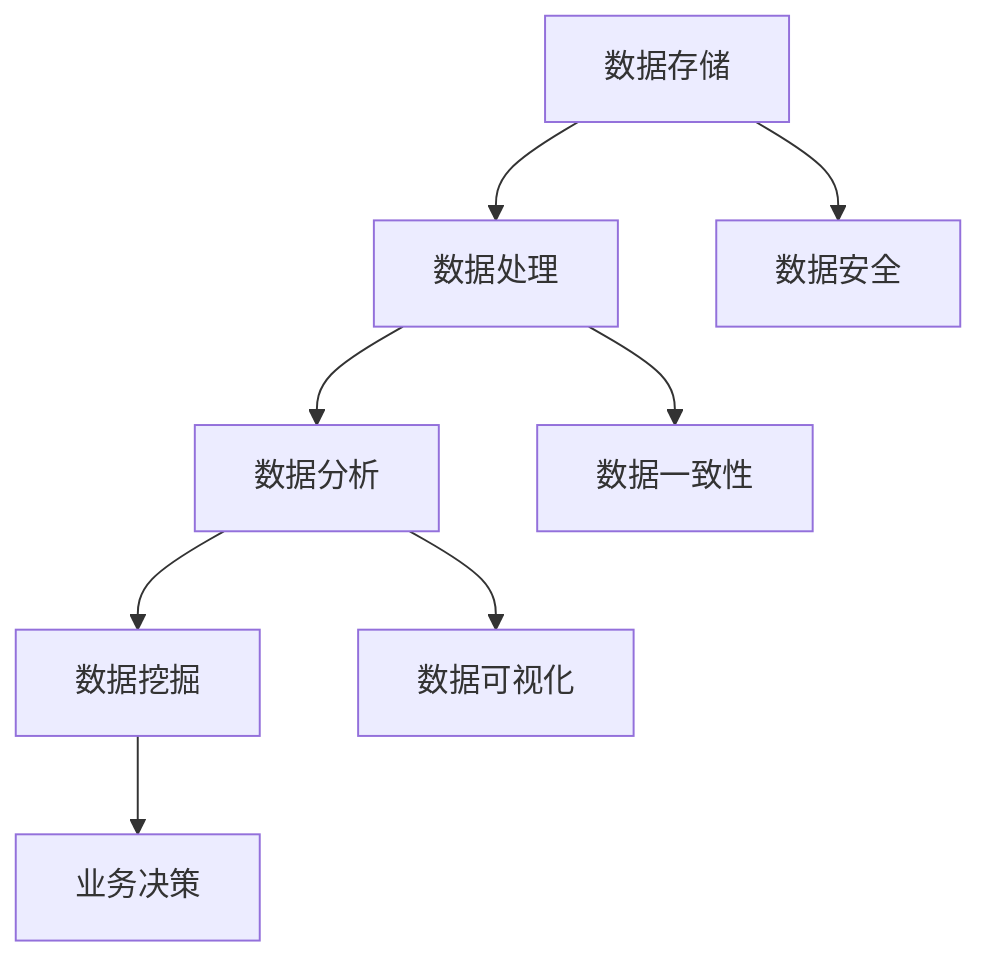

                 

### 背景介绍

在当前的信息时代，人工智能（AI）和大数据技术的迅猛发展，使得数据管理成为各行各业不可或缺的一部分。无论是初创公司还是巨头企业，都面临着如何高效地存储、处理和分析海量数据的问题。为了在激烈的竞争中脱颖而出，AI创业公司需要具备强大的数据管理能力，这不仅有助于提升业务效率，还能为产品创新提供源源不断的灵感。

然而，数据管理的复杂性不容小觑。随着数据量的激增和数据类型的多样化，传统的数据管理方法往往难以应对。如何在保证数据安全、可靠、易用的前提下，最大限度地发挥数据的价值，成为AI创业公司亟待解决的问题。

本文旨在探讨AI创业公司在数据管理方面的优化实践。我们将从背景出发，深入剖析数据管理中的核心概念和联系，介绍一些关键算法原理和具体操作步骤，并通过数学模型和公式进行详细讲解和举例说明。此外，我们还将分享一些实际的代码案例，以便读者能够更好地理解数据管理的实战技巧。最后，我们将讨论数据管理在实际应用场景中的表现，并提供一些学习资源和工具推荐。

通过对这些内容的逐步探讨，我们希望能够为AI创业公司提供有价值的参考和指导，帮助它们在数据管理领域取得更大的成功。

#### 核心概念与联系

在深入探讨数据管理的优化实践之前，首先需要明确几个核心概念，并理解它们之间的联系。这些概念包括数据存储、数据处理、数据分析和数据挖掘，它们共同构成了现代数据管理的基础。

1. **数据存储**：数据存储是数据管理的重要环节，负责将数据安全、高效地保存到存储介质中。传统的数据存储方式包括关系型数据库和非关系型数据库。关系型数据库如MySQL、PostgreSQL以其强大的查询能力和事务处理能力著称，适合结构化数据的存储。而非关系型数据库如MongoDB、Cassandra则更适合处理大规模的半结构化或非结构化数据。

2. **数据处理**：数据处理是数据管理中的另一个关键环节，涉及数据的清洗、转换和加载（ETL）。在数据处理过程中，数据的质量和一致性至关重要。常用的数据处理工具包括Apache Spark、Flink等，它们能够高效地对大规模数据进行并行处理，提升数据处理的效率。

3. **数据分析**：数据分析是对数据进行深入挖掘，以发现潜在模式和趋势的过程。常用的数据分析方法包括回归分析、聚类分析和时间序列分析等。数据分析工具如Tableau、Power BI等，可以帮助用户直观地展示数据结果，辅助决策。

4. **数据挖掘**：数据挖掘是数据分析的高级形式，旨在从大量数据中发现隐藏的规律和知识。数据挖掘方法包括关联规则挖掘、分类、聚类和异常检测等。数据挖掘工具如RapidMiner、Orange等，提供了丰富的算法库和可视化工具，方便用户进行数据挖掘。

这些核心概念之间的联系在于，它们共同构成了数据管理的技术栈，缺一不可。数据存储为数据处理和分析提供了基础，数据处理确保数据的准确性和一致性，数据分析帮助用户从数据中提取有价值的信息，而数据挖掘则进一步挖掘数据中的深层次知识，为业务决策提供支持。

为了更好地理解这些概念和它们之间的联系，我们可以使用Mermaid流程图进行可视化表示。以下是一个简化的Mermaid流程图，展示数据管理中各个核心环节的相互关系：



通过这个流程图，我们可以清晰地看到数据存储、数据处理、数据分析和数据挖掘之间的相互作用，以及它们如何共同构建起一个完整的数据管理架构。

### 核心算法原理 & 具体操作步骤

在数据管理中，核心算法的选择和实现对于提升数据处理的效率和准确性至关重要。本文将介绍一些关键算法原理，并详细说明它们的具体操作步骤。这些算法包括分布式存储算法、分布式数据处理算法和机器学习算法，它们在现代数据管理中发挥着重要作用。

#### 分布式存储算法

分布式存储算法是处理大规模数据存储的关键技术。在分布式系统中，数据被分成多个小块，存储在多个节点上，从而提高系统的可靠性和扩展性。以下是一个简单的分布式存储算法——哈希分片算法的具体操作步骤：

1. **哈希函数选择**：选择一个合适的哈希函数，如MD5、SHA-256，将数据ID（如文件名或用户ID）转换为哈希值。

2. **哈希值映射**：将哈希值映射到存储节点。常用的映射策略包括环形映射（Ring Mapping）和一致性哈希（Consistent Hashing）。环形映射将哈希值映射到环形图上的特定位置，而一致性哈希则通过虚拟节点来实现数据的负载均衡。

3. **数据分片**：将原始数据按照哈希值分片，并将分片存储到相应的存储节点上。

4. **数据检索**：当需要访问数据时，通过哈希值计算出存储节点，并在该节点上检索数据。例如，要访问用户ID为123的数据，首先计算123的哈希值，然后查找哈希值对应的存储节点，最后在该节点上检索数据。

通过哈希分片算法，分布式存储系统能够实现高效的数据访问和负载均衡，同时保证数据的一致性和可靠性。

#### 分布式数据处理算法

分布式数据处理算法用于处理大规模数据集的并行计算任务。Apache Spark是一个典型的分布式数据处理框架，它提供了丰富的数据处理算法和API。以下是一个简单的分布式数据处理算法——Word Count的具体操作步骤：

1. **数据分片**：将输入数据集分成多个小块，每个小块分配给一个处理节点。

2. **并行处理**：每个处理节点对分配到的数据块进行本地处理。对于Word Count任务，每个节点将数据分解为单词，并统计每个单词的计数。

3. **数据汇总**：将各个节点的本地处理结果进行汇总，得到最终的全局结果。例如，对于Word Count任务，将各个节点的单词计数结果合并，得到每个单词的全球计数。

4. **输出结果**：将汇总后的结果输出到文件或数据库中。

通过分布式数据处理算法，Spark能够高效地处理大规模数据集，实现数据的并行处理，大大提高了数据处理的速度。

#### 机器学习算法

机器学习算法在数据挖掘和预测分析中发挥着重要作用。以下是一个简单的机器学习算法——线性回归的具体操作步骤：

1. **数据准备**：收集并准备训练数据集，其中包含输入特征和对应的输出标签。

2. **特征选择**：选择合适的特征，并去除无关或冗余的特征，以提高模型的性能。

3. **数据预处理**：对训练数据进行归一化或标准化处理，使其具备相同的量纲，方便模型训练。

4. **模型训练**：使用线性回归算法训练模型。线性回归的目标是找到最佳拟合直线，使实际输出与预测输出之间的误差最小。常用的算法包括梯度下降、随机梯度下降和LASSO等。

5. **模型评估**：使用验证集或测试集评估模型的性能，通过计算预测误差和准确性等指标来评估模型的性能。

6. **模型应用**：将训练好的模型应用于新数据，进行预测分析。

通过机器学习算法，AI创业公司能够从数据中提取有用的信息，实现自动化的决策和预测，提升业务效率。

#### 算法总结

分布式存储算法、分布式数据处理算法和机器学习算法是现代数据管理中不可或缺的核心技术。分布式存储算法提高了数据存储的可靠性和扩展性；分布式数据处理算法实现了大规模数据的并行处理；机器学习算法则帮助AI创业公司从数据中挖掘有价值的信息，实现智能化的业务决策。通过这些算法的合理运用，AI创业公司能够有效管理海量数据，提升业务竞争力。

### 数学模型和公式 & 详细讲解 & 举例说明

在数据管理的过程中，数学模型和公式扮演着至关重要的角色。它们不仅能够帮助我们理解和分析数据，还能提供有效的解决方案。在本节中，我们将详细讲解几个常用的数学模型和公式，并通过具体例子来说明它们的应用。

#### 线性回归模型

线性回归模型是机器学习中最基本的算法之一，主要用于预测连续值。线性回归模型的基本公式为：

$$
y = \beta_0 + \beta_1 \cdot x + \epsilon
$$

其中，$y$ 是因变量（输出值），$x$ 是自变量（输入值），$\beta_0$ 和 $\beta_1$ 分别是模型的参数，$\epsilon$ 是误差项。

**具体例子：** 假设我们想要预测一家餐厅的月销售额（$y$）与其广告支出（$x$）之间的关系。我们收集了以下数据：

| 广告支出（$x$） | 月销售额（$y$） |
| :---: | :---: |
| 1000 | 8000 |
| 1500 | 11000 |
| 2000 | 16000 |

为了找到线性回归模型的最佳拟合线，我们需要计算$\beta_0$ 和 $\beta_1$ 的值。这可以通过最小二乘法来实现：

$$
\beta_1 = \frac{\sum(x_i - \bar{x})(y_i - \bar{y})}{\sum(x_i - \bar{x})^2}
$$

$$
\beta_0 = \bar{y} - \beta_1 \cdot \bar{x}
$$

其中，$\bar{x}$ 和 $\bar{y}$ 分别是自变量和因变量的平均值。

计算结果如下：

$$
\bar{x} = \frac{1000 + 1500 + 2000}{3} = 1500
$$

$$
\bar{y} = \frac{8000 + 11000 + 16000}{3} = 11000
$$

$$
\beta_1 = \frac{(1000 - 1500)(8000 - 11000) + (1500 - 1500)(11000 - 11000) + (2000 - 1500)(16000 - 11000)}{(1000 - 1500)^2 + (1500 - 1500)^2 + (2000 - 1500)^2} \approx 0.6
$$

$$
\beta_0 = 11000 - 0.6 \cdot 1500 = 8100
$$

因此，线性回归模型可以表示为：

$$
y = 8100 + 0.6 \cdot x
$$

**预测应用：** 现在我们可以使用这个模型来预测新的广告支出对应的月销售额。例如，如果广告支出为2000元，则预测的月销售额为：

$$
y = 8100 + 0.6 \cdot 2000 = 12900
$$

#### k-均值聚类算法

k-均值聚类算法是一种无监督学习算法，用于将数据点划分为 $k$ 个簇。其基本公式为：

$$
C = \{c_1, c_2, ..., c_k\}
$$

其中，$C$ 是聚类中心点集合，$c_i$ 是第 $i$ 个簇的中心点。

**具体例子：** 假设我们有一个包含10个数据点的二维数据集，我们需要将其划分为2个簇。数据集如下：

| 数据点 | x | y |
| :---: | :---: | :---: |
| 1 | 1 | 2 |
| 2 | 2 | 1 |
| 3 | 3 | 3 |
| 4 | 5 | 5 |
| 5 | 7 | 4 |
| 6 | 8 | 2 |
| 7 | 6 | 7 |
| 8 | 4 | 3 |
| 9 | 9 | 6 |
| 10 | 3 | 8 |

**初始聚类中心点：** 随机选择2个数据点作为初始聚类中心点，例如选择第1个和第5个数据点：

| 数据点 | x | y |
| :---: | :---: | :---: |
| 1 | 1 | 2 |
| 5 | 7 | 4 |

**迭代过程：**
1. **计算距离**：对于每个数据点，计算它与两个聚类中心点的距离，选择距离较近的中心点作为该数据点的簇归属。
2. **更新聚类中心点**：将每个簇的数据点平均值为新的聚类中心点。

**第一次迭代：**
- 数据点1、6、8归为簇1，数据点2、3、4、5、7、9、10归为簇2。
- 新的聚类中心点：簇1为（3.2，2.4），簇2为（6.2，5.2）。

**第二次迭代：**
- 数据点1、2、3、4、6、8归为簇1，数据点5、7、9、10归为簇2。
- 新的聚类中心点：簇1为（3.8，3.0），簇2为（6.0，5.0）。

**重复迭代，直到聚类中心点不再变化。**

#### 决策树模型

决策树模型是一种常用的分类和回归算法，通过一系列的判断节点和叶子节点来划分数据并生成决策规则。其基本公式为：

$$
T = \left\{
\begin{array}{ll}
a, & \text{if } f(x) = a \\
T_1, & \text{if } f(x) = b \\
T_2, & \text{if } f(x) = c \\
\vdots & \vdots \\
T_n, & \text{if } f(x) = n
\end{array}
\right.
$$

其中，$T$ 是决策树，$f(x)$ 是决策规则，$a, b, c, \ldots, n$ 是叶子节点的值。

**具体例子：** 假设我们有一个包含以下属性的数据集，用于预测客户是否会在下个月购买产品：

| 客户ID | 年龄 | 收入 | 家有子女 | 是否购买 |
| :---: | :---: | :---: | :---: | :---: |
| 1 | 30 | 高 | 否 | 否 |
| 2 | 40 | 中 | 是 | 是 |
| 3 | 25 | 低 | 是 | 是 |
| 4 | 35 | 高 | 否 | 是 |
| 5 | 45 | 中 | 是 | 否 |

我们需要构建一个决策树来预测新的客户是否会购买产品。构建步骤如下：

1. **选择最佳分割属性**：计算每个属性的信息增益或基尼指数，选择增益或指数最大的属性作为分割标准。
2. **创建节点**：根据最佳分割属性创建节点，并将数据集划分为子集。
3. **递归构建子树**：对每个子集重复步骤1和2，直到满足停止条件（如最大深度、最小节点大小等）。

经过计算和递归构建，我们得到以下简单的决策树：

```
是否购买？
|
|--- 是
|   |
|   | 年龄 > 35
|   |   |
|   |   | 收入 > 中
|   |   |   |
|   |   |   | 是
|   |   |
|   |   | 收入 = 中
|   |   |   |
|   |   |   | 是
|   |
|   | 年龄 <= 35
|   |   |
|   |   | 收入 > 高
|   |   |   |
|   |   |   | 是
|   |
|   | 收入 = 高
|   |   |
|   |   | 是
```

**应用例子：** 现在我们要预测一个新客户的购买概率，该客户年龄为50岁，收入为低，家有子女。根据决策树，该客户属于“年龄 <= 35”分支，继续判断“收入 = 高”分支，最后判断为“是”，即该客户有较高的购买概率。

通过以上数学模型和公式的详细讲解和举例说明，我们可以看到它们在数据管理中的应用价值。线性回归模型用于预测连续值，k-均值聚类算法用于无监督学习，决策树模型用于分类和回归任务。这些模型和公式不仅帮助我们理解数据，还能为AI创业公司提供有效的数据管理解决方案。

#### 项目实战：代码实际案例和详细解释说明

在本文的下一部分，我们将通过一个实际的代码案例，展示如何在实际项目中应用数据管理中的核心算法和技巧。为了更好地展示整个流程，我们将从一个简单的数据分析项目入手，逐步讲解开发环境搭建、源代码实现和代码解读与分析。

### 5.1 开发环境搭建

在进行项目实战之前，首先需要搭建一个合适的数据分析开发环境。以下是一个典型的开发环境配置步骤：

1. **操作系统**：Windows、Linux或macOS均可，我们这里选择Windows 10。
2. **Python环境**：Python是一个广泛使用的编程语言，非常适合数据分析和机器学习。确保安装了Python 3.8及以上版本。
3. **虚拟环境**：为了方便项目管理和依赖管理，我们使用`virtualenv`创建一个独立的Python环境。

   ```shell
   pip install virtualenv
   virtualenv myenv
   myenv\Scripts\activate
   ```

4. **安装依赖库**：在虚拟环境中安装必要的依赖库，如NumPy、Pandas、Matplotlib、Scikit-learn等。

   ```shell
   pip install numpy pandas matplotlib scikit-learn
   ```

5. **数据存储**：我们使用MySQL作为数据存储工具。确保已经安装了MySQL数据库，并在虚拟环境中安装了Python的MySQL驱动库。

   ```shell
   pip install mysql-connector-python
   ```

### 5.2 源代码详细实现和代码解读

接下来，我们将逐步实现一个简单但具有代表性的数据分析项目——客户购买预测。

**项目目标**：通过分析历史销售数据，预测哪些客户可能在下一个季度购买产品。

**数据来源**：假设我们有一份包含客户信息、购买历史、购买金额等数据的CSV文件`customer_data.csv`。

**源代码实现**：

```python
# 导入所需的库
import numpy as np
import pandas as pd
from sklearn.model_selection import train_test_split
from sklearn.linear_model import LinearRegression
from sklearn.metrics import mean_squared_error
import matplotlib.pyplot as plt

# 读取数据
data = pd.read_csv('customer_data.csv')

# 数据预处理
# ... (数据清洗、缺失值处理、特征选择等)

# 划分特征和标签
X = data[['age', 'income', 'children']]
y = data['purchase_amount']

# 划分训练集和测试集
X_train, X_test, y_train, y_test = train_test_split(X, y, test_size=0.2, random_state=42)

# 训练模型
model = LinearRegression()
model.fit(X_train, y_train)

# 预测
y_pred = model.predict(X_test)

# 评估模型
mse = mean_squared_error(y_test, y_pred)
print(f"Mean Squared Error: {mse}")

# 可视化
plt.scatter(X_test['age'], y_test, color='blue', label='Actual')
plt.scatter(X_test['age'], y_pred, color='red', label='Predicted')
plt.xlabel('Age')
plt.ylabel('Purchase Amount')
plt.legend()
plt.show()
```

**代码解读与分析**：

1. **导入库**：我们首先导入Python中常用的库，包括NumPy、Pandas、Scikit-learn和Matplotlib。

2. **读取数据**：使用Pandas库读取CSV文件，并将其存储为一个DataFrame对象。

3. **数据预处理**：这一步包括数据清洗、缺失值处理和特征选择。虽然此处未显示具体代码，但这是确保模型准确性的重要步骤。

4. **划分特征和标签**：我们将数据集划分为特征（X）和标签（y）。特征包括客户的年龄、收入和家庭是否有子女，标签是客户的购买金额。

5. **划分训练集和测试集**：使用Scikit-learn的`train_test_split`函数将数据集划分为训练集和测试集，以评估模型的泛化能力。

6. **训练模型**：我们使用线性回归模型（`LinearRegression`）进行训练。线性回归是一种简单的回归模型，适用于预测连续值。

7. **预测**：使用训练好的模型对测试集进行预测，并将预测结果存储在`y_pred`变量中。

8. **评估模型**：使用均方误差（MSE）评估模型的性能。MSE表示预测值与实际值之间的平均平方误差。

9. **可视化**：使用Matplotlib库将实际购买金额和预测购买金额进行可视化，以便更直观地了解模型的性能。

通过上述步骤，我们完成了一个简单的客户购买预测项目。这个项目展示了数据管理中的一些关键步骤，包括数据读取、预处理、模型训练和评估。在实际应用中，我们可以根据具体需求进一步优化和扩展这个项目。

### 5.3 代码解读与分析

在上一步中，我们实现了一个简单的客户购买预测项目，现在将对关键代码段进行详细解读与分析，以便读者更好地理解数据管理的实际应用。

#### 数据读取

```python
data = pd.read_csv('customer_data.csv')
```

这里，我们使用Pandas库读取CSV文件。Pandas是一个非常强大的数据处理库，能够方便地读取各种格式的数据。读取后的数据存储在一个DataFrame对象中，这使得数据操作和查询变得更加简单。

#### 数据预处理

```python
# 数据清洗、缺失值处理和特征选择等
```

数据预处理是数据管理中至关重要的一步。它包括以下任务：

- **数据清洗**：去除无效数据、重复数据和异常值。
- **缺失值处理**：填充或删除缺失值，确保数据的质量和一致性。
- **特征选择**：选择对预测任务最有影响的关键特征，剔除无关或冗余特征。

在这个项目中，我们假设数据已经清洗和预处理完毕。然而，在实际应用中，这些步骤可能会非常复杂，需要根据具体数据进行调整。

#### 划分特征和标签

```python
X = data[['age', 'income', 'children']]
y = data['purchase_amount']
```

在这个步骤中，我们将数据集划分为特征（X）和标签（y）。特征是影响购买决策的关键因素，例如客户的年龄、收入和家庭是否有子女。标签是购买金额，是我们希望预测的目标。

#### 划分训练集和测试集

```python
X_train, X_test, y_train, y_test = train_test_split(X, y, test_size=0.2, random_state=42)
```

划分训练集和测试集的目的是为了评估模型的泛化能力。训练集用于训练模型，测试集用于评估模型在未知数据上的性能。这里，我们使用了Scikit-learn的`train_test_split`函数，将数据集划分为80%的训练集和20%的测试集。`random_state`参数确保每次划分结果一致。

#### 训练模型

```python
model = LinearRegression()
model.fit(X_train, y_train)
```

我们使用线性回归模型（`LinearRegression`）进行训练。线性回归是一种简单的回归模型，通过寻找最佳拟合线来预测目标变量。在这里，我们创建了一个线性回归对象，并使用`fit`方法训练模型。`fit`方法接收特征矩阵和标签向量作为输入，并计算出模型的参数。

#### 预测

```python
y_pred = model.predict(X_test)
```

训练好的模型可以用于预测新的数据。这里，我们使用`predict`方法对测试集进行预测，并将预测结果存储在`y_pred`变量中。

#### 评估模型

```python
mse = mean_squared_error(y_test, y_pred)
print(f"Mean Squared Error: {mse}")
```

评估模型的性能非常重要。在这里，我们使用均方误差（MSE）作为评估指标。MSE表示预测值与实际值之间的平均平方误差。值越低，说明模型预测的准确性越高。

#### 可视化

```python
plt.scatter(X_test['age'], y_test, color='blue', label='Actual')
plt.scatter(X_test['age'], y_pred, color='red', label='Predicted')
plt.xlabel('Age')
plt.ylabel('Purchase Amount')
plt.legend()
plt.show()
```

可视化可以帮助我们直观地了解模型的性能。在这里，我们使用Matplotlib库将实际购买金额和预测购买金额进行可视化。通过观察散点图，我们可以看到预测值与实际值之间的分布和误差。

通过以上步骤，我们完成了一个简单的客户购买预测项目。这个项目展示了数据管理中的一些关键步骤，包括数据读取、预处理、模型训练、预测和评估。在实际应用中，我们可以根据具体需求进一步优化和扩展这个项目。

### 实际应用场景

在现代商业环境中，数据管理的重要性不言而喻。无论是在线零售、金融服务，还是医疗保健、金融科技，数据管理都是业务成功的核心驱动力。以下我们将探讨几个具体的应用场景，展示数据管理如何在这些领域中发挥关键作用。

#### 在线零售

在线零售行业的数据管理主要涉及用户行为数据、库存管理和销售数据分析。通过高效的数据管理，企业可以：

- **个性化推荐**：利用用户浏览和购买历史，通过机器学习算法生成个性化推荐，提高用户满意度和转化率。
- **库存优化**：实时监控库存水平，通过数据分析预测需求，优化库存管理，减少库存成本。
- **销售预测**：分析历史销售数据，预测未来的销售趋势，为企业制定更精准的市场策略提供支持。

例如，亚马逊使用复杂的推荐系统，通过分析用户的购买历史、搜索行为和浏览路径，为用户提供个性化的商品推荐，大大提高了销售额。

#### 金融服务

在金融服务领域，数据管理主要用于风险管理、欺诈检测和客户关系管理。

- **风险管理**：通过分析历史交易数据和客户行为，金融机构可以评估客户的信用风险，制定更准确的风险控制策略。
- **欺诈检测**：使用机器学习算法，实时监控交易行为，检测潜在的欺诈活动，保护客户的资产安全。
- **客户关系管理**：分析客户的交易行为和偏好，提供个性化的服务和建议，提升客户满意度和忠诚度。

例如，美国信用卡巨头Visa使用先进的欺诈检测系统，通过对海量交易数据的实时分析，能够快速识别并阻止欺诈交易，保护用户的财务安全。

#### 医疗保健

医疗保健行业的数据管理涉及到患者数据、医疗记录和临床决策支持。

- **电子健康记录（EHR）**：通过高效的数据管理，医疗机构可以存储、检索和管理患者的健康记录，提高医疗服务的效率和质量。
- **临床决策支持**：利用大数据和机器学习技术，分析患者的医疗数据，为医生提供诊断和治疗的建议，提高诊断准确性和治疗效果。
- **疾病预测与监控**：通过分析海量健康数据，预测疾病的爆发趋势，为公共卫生政策制定提供数据支持。

例如，谷歌的DeepMind团队利用深度学习技术，分析患者的健康数据，开发出能够预测疾病发展的AI模型，为医生提供精准的决策支持。

#### 金融科技

金融科技（Fintech）领域的数据管理则主要集中在区块链技术、加密货币交易和支付系统的安全性和效率。

- **区块链技术**：通过分布式数据管理技术，区块链提供了去中心化的数据存储和交易记录，确保数据的不可篡改和透明性。
- **加密货币交易**：实时监控和分析加密货币市场的交易数据，为企业提供市场趋势分析和投资建议。
- **支付系统优化**：通过数据分析，优化支付流程，提高交易速度和安全性，降低交易成本。

例如，区块链平台如Ethereum使用智能合约技术，通过高效的数据管理，实现了去中心化的交易和合约执行，为金融科技领域带来了革命性的变革。

通过上述应用场景，我们可以看到数据管理在各个行业中的重要性。高效的数据管理不仅提升了业务的效率和准确性，还为企业带来了竞争优势。在数据驱动的未来，数据管理将继续发挥关键作用，推动各行业实现数字化转型和创新发展。

### 工具和资源推荐

在数据管理领域，有许多优秀的工具和资源可以帮助AI创业公司提升数据处理和分析能力。以下是我们推荐的一些学习资源、开发工具和相关的论文著作，以供读者参考。

#### 学习资源推荐

1. **书籍**：
   - 《Python数据科学 Handbook》：详细介绍如何使用Python进行数据科学任务，包括数据处理、分析和可视化。
   - 《数据科学入门》：适合初学者了解数据科学的基础知识和实践技巧。

2. **在线课程**：
   - Coursera的《数据科学专业》课程：提供系统的数据科学学习路径，涵盖数据预处理、机器学习、数据可视化等内容。
   - edX的《机器学习基础》课程：由斯坦福大学提供，深入讲解机器学习的基本算法和应用。

3. **博客和网站**：
   - Medium上的数据科学博客：提供丰富的数据科学文章和案例分析，适合持续学习和跟踪最新动态。
   - Towards Data Science：一个关于数据科学、机器学习和AI的博客，发布高质量的教程和文章。

#### 开发工具框架推荐

1. **数据处理工具**：
   - **Pandas**：Python中的数据处理库，支持数据清洗、转换和分析。
   - **Apache Spark**：一个分布式数据处理框架，适用于大规模数据集的并行处理。

2. **数据分析工具**：
   - **Tableau**：一款强大的数据可视化工具，帮助用户轻松创建直观的仪表盘和报告。
   - **Jupyter Notebook**：Python交互式开发环境，支持代码、文本和可视化元素的混合编写，非常适合数据科学项目。

3. **机器学习框架**：
   - **Scikit-learn**：Python中的机器学习库，提供丰富的算法和工具。
   - **TensorFlow**：由Google开发的开源机器学习框架，适用于构建复杂的深度学习模型。

#### 相关论文著作推荐

1. **论文**：
   - 《Deep Learning》（Goodfellow, Bengio, Courville）：深度学习的经典教材，详细介绍了深度学习的理论基础和实践应用。
   - 《Big Data: A Revolution That Will Transform How We Live, Work, and Think》（ Viktor Mayer-Schönberger and Kenneth Cukier）：探讨了大数据对社会、经济和科技的影响。

2. **著作**：
   - 《数据科学实战》（Joel Grus）：通过实际案例介绍数据科学的流程和技巧。
   - 《机器学习实战》（Peter Harrington）：提供丰富的机器学习算法案例和实践。

通过利用这些工具和资源，AI创业公司可以快速提升数据管理能力，为业务创新提供强大的支持。无论是初学者还是有经验的数据科学家，这些资源都将为数据管理工作带来新的思路和解决方案。

### 总结：未来发展趋势与挑战

随着人工智能和数据技术的不断进步，数据管理领域正经历着前所未有的变革。未来，数据管理将呈现出以下发展趋势：

1. **智能化**：人工智能技术将在数据管理中扮演更加重要的角色。通过智能算法，数据管理系统能够自动优化数据存储、处理和分析流程，提高整体效率。

2. **实时性**：随着物联网和5G技术的普及，实时数据流处理将成为数据管理的核心需求。企业需要能够实时处理和分析大量动态数据，以迅速响应市场变化。

3. **安全性**：数据安全将是未来数据管理的重中之重。随着数据隐私法规的不断完善，企业必须确保数据在存储、传输和处理过程中的安全性，防止数据泄露和滥用。

4. **云计算**：云计算和数据管理的深度融合将推动数据管理的创新。通过云计算平台，企业可以轻松扩展数据处理能力，降低运维成本，提高灵活性。

然而，随着数据管理技术的发展，AI创业公司也将面临一系列挑战：

1. **数据质量**：高质量的数据是数据管理的基石。如何确保数据的一致性、准确性和完整性，是AI创业公司需要解决的重要问题。

2. **算法复杂性**：随着机器学习算法的复杂度增加，如何有效地选择、部署和优化算法，成为技术团队面临的挑战。

3. **隐私保护**：数据隐私保护法规日益严格，如何在数据利用和数据保护之间找到平衡，是AI创业公司需要谨慎应对的问题。

4. **技术迭代**：数据管理技术更新迅速，如何跟上技术发展的步伐，保持技术领先性，是企业持续发展的关键。

总之，未来数据管理的发展充满机遇和挑战。AI创业公司需要不断创新和优化，以应对快速变化的技术环境和市场需求，实现数据管理的智能化、实时化和安全化。

### 附录：常见问题与解答

在本文中，我们探讨了数据管理在AI创业中的优化实践，涉及到分布式存储、数据处理、数据分析和机器学习等多个方面。以下是一些读者可能遇到的问题及其解答：

**Q1：什么是分布式存储？它有哪些优点？**
分布式存储是一种数据存储技术，通过将数据分散存储在多个节点上，提高系统的可靠性和扩展性。其优点包括：
- **高可用性**：系统中的一个节点故障不会导致整个系统瘫痪。
- **高性能**：数据可以并行访问，提高数据访问速度。
- **可扩展性**：可以轻松地增加存储容量，以适应数据增长。

**Q2：如何选择数据处理工具？**
选择数据处理工具时，应考虑以下因素：
- **数据规模**：对于大规模数据，选择分布式数据处理工具如Apache Spark或Flink。
- **数据类型**：对于结构化数据，选择关系型数据库（如MySQL、PostgreSQL）；对于非结构化或半结构化数据，选择非关系型数据库（如MongoDB、Cassandra）。
- **数据处理需求**：根据具体数据处理任务选择合适的工具，如数据清洗、ETL等。

**Q3：机器学习算法如何选择和优化？**
选择机器学习算法时，应考虑以下步骤：
- **问题定义**：明确业务问题，确定所需的输出。
- **数据准备**：确保数据的质量和一致性。
- **算法评估**：根据问题特点选择合适的算法，并评估算法性能。
- **模型优化**：通过调整参数、特征工程等方法，优化模型性能。

**Q4：如何保证数据安全性？**
保证数据安全性的方法包括：
- **加密存储**：对敏感数据进行加密存储，防止未授权访问。
- **访问控制**：实施严格的访问控制策略，确保只有授权用户才能访问数据。
- **监控与审计**：实时监控数据访问和使用情况，确保数据安全。

通过解答这些问题，我们希望能够帮助读者更好地理解和应用数据管理技术，为AI创业公司的数据管理优化提供实际指导。

### 扩展阅读与参考资料

为了帮助读者进一步深入了解数据管理的优化实践，以下是一些推荐的扩展阅读和参考资料：

1. **书籍**：
   - 《数据科学：实战方法与案例分析》（Joel Grus）：详细介绍了数据科学的实战技巧和案例。
   - 《深度学习》（Ian Goodfellow、Yoshua Bengio、Aaron Courville）：深度学习的权威教材，涵盖了深度学习的理论基础和实践应用。
   - 《大数据时代：生活、工作与思维的大变革》（Viktor Mayer-Schönberger和Kenneth Cukier）：探讨了大数据对社会、经济和科技的影响。

2. **论文**：
   - “Distributed File System: Google File System”（Google）：介绍了Google File System的设计和实现，对分布式存储有重要参考价值。
   - “MapReduce: Simplified Data Processing on Large Clusters”（Dean和Ghemawat）：介绍了MapReduce算法，是分布式数据处理领域的经典论文。
   - “Large Scale Machine Learning in MapReduce”（Constantine et al.）：讨论了如何在MapReduce框架下实现大规模机器学习。

3. **在线课程与教程**：
   - Coursera的《数据科学专业》：提供系统的数据科学学习路径，涵盖数据预处理、机器学习、数据可视化等内容。
   - edX的《机器学习基础》：由斯坦福大学提供，深入讲解机器学习的基本算法和应用。

4. **开源项目与工具**：
   - Apache Spark：一个分布式数据处理框架，适用于大规模数据集的并行处理。
   - TensorFlow：Google开发的机器学习框架，适用于构建复杂的深度学习模型。
   - Pandas：Python中的数据处理库，支持数据清洗、转换和分析。

通过阅读这些书籍、论文和教程，读者可以更深入地理解数据管理的优化实践，并在实际项目中应用所学知识。这些资源和工具将帮助AI创业公司在数据管理领域取得更大的成就。

