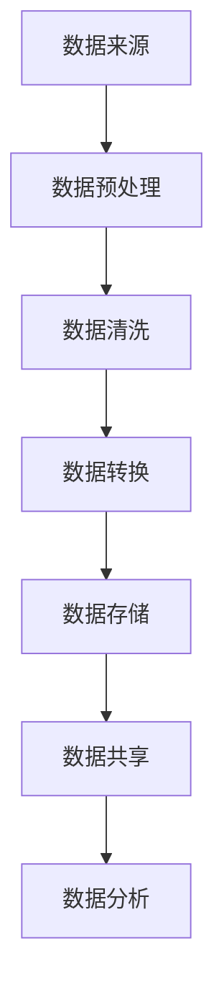
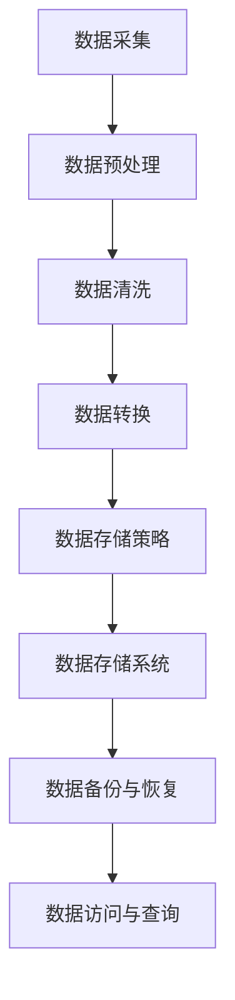
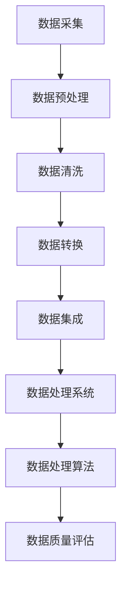
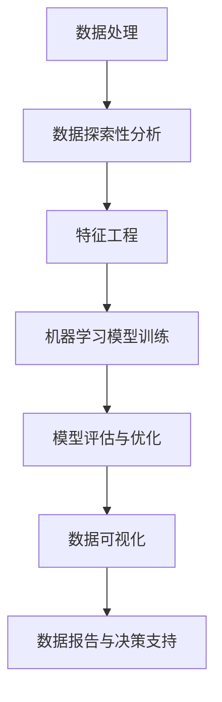

                 

# AI创业：数据管理的策略与实施探讨

## 摘要

本文旨在探讨AI创业公司在数据管理方面的策略与实施。随着人工智能技术的不断进步，数据作为AI发展的核心资源，其管理策略与实施方法对AI创业公司的成功至关重要。本文将详细介绍数据管理的核心概念、算法原理、数学模型，并通过实际应用场景和项目实战，深入剖析数据管理在AI创业中的重要作用。同时，文章还将推荐相关的学习资源、开发工具和论文著作，为AI创业公司提供全面的数据管理参考。通过本文的阅读，读者将全面了解数据管理在AI创业中的战略意义，掌握数据管理的方法和技巧，为未来的AI创业之路奠定坚实基础。

## 1. 背景介绍

随着互联网的普及和大数据技术的发展，数据已经成为当今世界最为重要的资源之一。对于AI创业公司来说，数据不仅是业务运作的基础，更是实现人工智能核心算法能力的关键。数据管理的优劣直接关系到AI创业公司的竞争力与发展前景。然而，数据管理并非易事，涉及到数据采集、存储、处理、分析和共享等多个环节。如何有效地进行数据管理，成为AI创业公司面临的一项重要挑战。

首先，数据采集是数据管理的基础。AI创业公司需要通过各种手段获取高质量的数据，如用户行为数据、传感器数据、社交媒体数据等。这些数据不仅需要具有代表性，还需保证其准确性和实时性。

其次，数据存储是数据管理的核心。随着数据量的不断增长，AI创业公司需要选择合适的数据存储方案，如关系型数据库、非关系型数据库、分布式存储系统等。同时，数据存储还需要考虑数据的持久性、可靠性和可扩展性。

再次，数据处理是数据管理的关键。AI创业公司需要对大量数据进行清洗、转换和集成，以便为后续的分析和挖掘提供可靠的数据基础。数据处理过程需要高效、自动化，以应对数据量的快速增长。

最后，数据分析与挖掘是数据管理的目标。通过对数据的深入分析和挖掘，AI创业公司可以从中提取有价值的信息，为业务决策提供支持。数据分析与挖掘需要运用各种算法和技术，如机器学习、深度学习、数据挖掘等。

综上所述，数据管理在AI创业中扮演着至关重要的角色。一个高效、可靠的数据管理系统能够为AI创业公司提供有力支持，助力其在竞争激烈的市场中脱颖而出。然而，数据管理并非一蹴而就，需要AI创业公司在各个环节中进行精细化管理，以确保数据的高质量和高效率。本文将围绕数据管理的核心概念、算法原理、数学模型和实际应用场景，深入探讨数据管理在AI创业中的策略与实施方法。

## 2. 核心概念与联系

### 2.1 数据采集

数据采集是数据管理的起点，其核心目标是获取高质量的数据。在AI创业公司中，数据采集可以从多个方面进行，包括用户行为数据、传感器数据、社交媒体数据等。以下是一个Mermaid流程图，展示数据采集的过程：



- **数据来源**：AI创业公司可以通过网站日志、应用程序接口（API）、传感器设备、社交媒体平台等多种途径获取数据。
- **数据预处理**：包括数据过滤、去重、格式化等操作，以确保数据的完整性和一致性。
- **数据清洗**：处理数据中的错误、异常和缺失值，以提高数据质量。
- **数据转换**：将不同格式的数据转换为统一的格式，以便后续处理和分析。
- **数据存储**：选择合适的数据存储方案，如关系型数据库、非关系型数据库、分布式存储系统等。
- **数据共享**：实现数据在不同部门、团队之间的共享，以提高数据利用率。

### 2.2 数据存储

数据存储是数据管理的核心，其目的是保证数据的安全、可靠和高效访问。以下是一个Mermaid流程图，展示数据存储的过程：



- **数据存储策略**：根据数据类型、规模和访问频率等特征，选择合适的数据存储策略，如冷存储、热存储等。
- **数据存储系统**：包括关系型数据库（如MySQL、PostgreSQL）、非关系型数据库（如MongoDB、Redis）、分布式存储系统（如HDFS、Cassandra）等。
- **数据备份与恢复**：定期进行数据备份，以防止数据丢失或损坏。同时，建立数据恢复机制，确保在数据丢失或损坏时能够快速恢复。
- **数据访问与查询**：提供高效的数据访问和查询接口，以满足用户对数据的需求。

### 2.3 数据处理

数据处理是数据管理的关键环节，其目的是对大量数据进行清洗、转换和集成，以便为后续的分析和挖掘提供可靠的数据基础。以下是一个Mermaid流程图，展示数据处理的流程：



- **数据清洗**：处理数据中的错误、异常和缺失值，以提高数据质量。
- **数据转换**：将不同格式的数据转换为统一的格式，以便后续处理和分析。
- **数据集成**：将来自多个源的数据进行整合，形成一个统一的数据视图。
- **数据处理系统**：包括数据仓库、数据湖等，用于存储和处理大规模数据。
- **数据处理算法**：如机器学习算法、深度学习算法、数据挖掘算法等，用于从数据中提取有价值的信息。
- **数据质量评估**：对处理后的数据质量进行评估，以确保数据的可靠性和准确性。

### 2.4 数据分析与挖掘

数据分析与挖掘是数据管理的最终目标，其目的是从海量数据中提取有价值的信息，为业务决策提供支持。以下是一个Mermaid流程图，展示数据分析与挖掘的过程：



- **数据探索性分析**：通过可视化、统计等方法，对数据进行初步分析，发现数据中的规律和趋势。
- **特征工程**：从原始数据中提取有用的特征，为机器学习模型提供输入。
- **机器学习模型训练**：使用训练数据，训练机器学习模型，以实现对数据的分类、回归、聚类等任务。
- **模型评估与优化**：评估模型的效果，并对模型进行优化，以提高预测准确性。
- **数据可视化**：将分析结果以图形、表格等形式展示，便于理解和决策。
- **数据报告与决策支持**：生成数据报告，为业务决策提供支持。

通过上述核心概念和流程图的介绍，我们可以更清晰地理解数据管理在AI创业中的重要性，以及各个环节之间的相互联系。在接下来的部分，我们将深入探讨数据管理的核心算法原理、数学模型以及实际应用场景，帮助读者更好地掌握数据管理的方法和技巧。

## 3. 核心算法原理 & 具体操作步骤

### 3.1 数据采集算法原理

数据采集是数据管理的重要环节，其核心在于从多种数据源中高效、准确地获取数据。以下是一种常见的数据采集算法原理：

- **网络爬虫（Web Crawler）**：通过网络爬虫，可以自动地从互联网上抓取数据。爬虫通常包含以下步骤：
  - **目标网址确定**：确定需要采集数据的网站。
  - **网页下载**：下载网页内容，通常使用HTTP协议。
  - **HTML解析**：对下载的网页内容进行HTML解析，提取有用的数据。
  - **数据存储**：将提取的数据存储到数据库或其他存储系统。

具体操作步骤如下：
1. **确定目标网址**：根据业务需求，确定需要采集数据的网站。
2. **编写爬虫代码**：使用Python、Java等编程语言，编写爬虫代码。
3. **下载网页**：使用HTTP库（如Python的requests库）下载网页内容。
4. **解析HTML**：使用HTML解析库（如Python的BeautifulSoup库）解析网页内容，提取有用数据。
5. **存储数据**：将提取的数据存储到数据库或其他存储系统。

### 3.2 数据存储算法原理

数据存储是数据管理的核心，其关键在于选择合适的数据存储方案，并确保数据的可靠性、安全性和高效访问。以下是一种常见的数据存储算法原理：

- **关系型数据库（Relational Database）**：
  - **原理**：关系型数据库基于关系模型，使用SQL语言进行数据查询和操作。
  - **操作步骤**：
    1. **设计数据库**：根据业务需求，设计数据库表结构。
    2. **创建数据库**：使用SQL命令创建数据库和表。
    3. **插入数据**：使用INSERT命令插入数据。
    4. **查询数据**：使用SELECT命令查询数据。
    5. **更新数据**：使用UPDATE命令更新数据。
    6. **删除数据**：使用DELETE命令删除数据。

- **非关系型数据库（NoSQL Database）**：
  - **原理**：非关系型数据库不基于关系模型，适用于处理大规模、非结构化数据。
  - **操作步骤**：
    1. **选择数据库**：根据业务需求，选择合适的非关系型数据库（如MongoDB、Redis等）。
    2. **设计数据模型**：设计数据模型，确定数据存储的结构。
    3. **插入数据**：使用API或命令行工具插入数据。
    4. **查询数据**：使用API或命令行工具查询数据。
    5. **更新数据**：使用API或命令行工具更新数据。
    6. **删除数据**：使用API或命令行工具删除数据。

### 3.3 数据处理算法原理

数据处理是数据管理的核心，其目标是对大量数据进行清洗、转换和集成，以便为后续分析和挖掘提供可靠的数据基础。以下是一种常见的数据处理算法原理：

- **数据清洗（Data Cleaning）**：
  - **原理**：数据清洗旨在处理数据中的错误、异常和缺失值，以提高数据质量。
  - **操作步骤**：
    1. **识别错误和异常**：使用统计方法、可视化方法等识别数据中的错误和异常。
    2. **处理错误和异常**：根据具体情况，对错误和异常进行处理，如删除、修正、插值等。
    3. **处理缺失值**：根据数据特征和业务需求，选择合适的缺失值处理方法，如均值填补、中值填补、插值法等。

- **数据转换（Data Transformation）**：
  - **原理**：数据转换旨在将不同格式的数据转换为统一的格式，以便后续处理和分析。
  - **操作步骤**：
    1. **数据规范化**：将不同数据源的数据转换为统一的编码格式、日期格式等。
    2. **数据归一化**：将不同数据范围的数据转换为同一数据范围，如0-1范围或-1到1范围。
    3. **数据转换函数**：使用自定义的转换函数，将数据从一种格式转换为另一种格式。

- **数据集成（Data Integration）**：
  - **原理**：数据集成旨在将来自多个源的数据进行整合，形成一个统一的数据视图。
  - **操作步骤**：
    1. **数据源识别**：识别需要集成数据的多个源。
    2. **数据抽取**：从数据源中抽取数据。
    3. **数据转换**：对抽取的数据进行转换，使其满足统一的格式和结构。
    4. **数据加载**：将转换后的数据加载到集成系统中。

### 3.4 数据分析与挖掘算法原理

数据分析与挖掘旨在从海量数据中提取有价值的信息，为业务决策提供支持。以下是一种常见的数据分析与挖掘算法原理：

- **机器学习（Machine Learning）**：
  - **原理**：机器学习通过训练模型，从数据中学习规律和模式，以实现对数据的分类、回归、聚类等任务。
  - **操作步骤**：
    1. **数据准备**：准备用于训练的数据集，并进行数据清洗、转换等预处理操作。
    2. **模型选择**：选择合适的机器学习算法，如线性回归、决策树、支持向量机等。
    3. **模型训练**：使用训练数据集，训练机器学习模型。
    4. **模型评估**：评估模型的效果，如准确率、召回率、F1值等。
    5. **模型优化**：根据评估结果，对模型进行优化。

- **深度学习（Deep Learning）**：
  - **原理**：深度学习通过多层神经网络，从数据中学习复杂的特征和模式。
  - **操作步骤**：
    1. **数据准备**：准备用于训练的数据集，并进行数据清洗、转换等预处理操作。
    2. **模型构建**：构建深度学习模型，如卷积神经网络（CNN）、循环神经网络（RNN）等。
    3. **模型训练**：使用训练数据集，训练深度学习模型。
    4. **模型评估**：评估模型的效果，如准确率、损失函数等。
    5. **模型优化**：根据评估结果，对模型进行优化。

- **数据挖掘（Data Mining）**：
  - **原理**：数据挖掘通过模式识别、聚类分析、关联规则等方法，从数据中发现有价值的信息。
  - **操作步骤**：
    1. **数据准备**：准备用于挖掘的数据集，并进行数据清洗、转换等预处理操作。
    2. **选择算法**：选择合适的数据挖掘算法，如关联规则挖掘、聚类分析、分类分析等。
    3. **数据预处理**：对数据进行预处理，如特征选择、特征提取等。
    4. **算法应用**：应用选择好的算法，对数据进行挖掘，提取有价值的信息。
    5. **结果分析**：分析挖掘结果，为业务决策提供支持。

通过以上对数据管理核心算法原理和具体操作步骤的介绍，读者可以更好地理解数据管理在AI创业中的重要作用，掌握数据管理的方法和技巧。在接下来的部分，我们将深入探讨数据管理中的数学模型和公式，以及实际应用场景中的代码实例和详细解释说明。

## 4. 数学模型和公式 & 详细讲解 & 举例说明

### 4.1 数据采集的数学模型

在数据采集过程中，我们经常需要处理数据的分布情况，以及如何从大量数据中提取有效信息。以下是一种常见的数据采集数学模型：

- **概率分布模型**：
  - **正态分布（Gaussian Distribution）**：描述数据在某一范围内的概率分布情况。公式如下：
    \[
    f(x|\mu, \sigma^2) = \frac{1}{\sqrt{2\pi\sigma^2}} e^{-\frac{(x-\mu)^2}{2\sigma^2}}
    \]
    其中，\( \mu \) 表示均值，\( \sigma^2 \) 表示方差。

  - **泊松分布（Poisson Distribution）**：描述在一定时间或空间内，事件发生的次数。公式如下：
    \[
    P(X = k) = \frac{e^{-\lambda}\lambda^k}{k!}
    \]
    其中，\( \lambda \) 表示事件发生的平均次数。

  - **二项分布（Binomial Distribution）**：描述在固定次数的试验中，成功次数的概率分布。公式如下：
    \[
    P(X = k) = C_n^k p^k (1-p)^{n-k}
    \]
    其中，\( n \) 表示试验次数，\( p \) 表示成功概率。

### 4.2 数据存储的数学模型

在数据存储方面，我们需要考虑数据的容量、存储效率和访问速度等因素。以下是一种常见的数据存储数学模型：

- **数据容量模型**：
  - **存储容量（Capacity）**：表示存储设备能够存储的数据量。公式如下：
    \[
    C = B \times N
    \]
    其中，\( B \) 表示每个存储单元的容量，\( N \) 表示存储单元的数量。

  - **数据压缩（Data Compression）**：通过压缩算法，减少数据的存储空间。公式如下：
    \[
    C_{compressed} = \frac{C_{original}}{ compression\_rate}
    \]
    其中，\( C_{original} \) 表示原始数据容量，\( compression\_rate \) 表示压缩率。

### 4.3 数据处理的数学模型

在数据处理过程中，我们经常需要对数据进行清洗、转换和集成。以下是一种常见的数据处理数学模型：

- **数据清洗模型**：
  - **缺失值填补（Missing Value Imputation）**：通过插值法、均值填补等方法填补缺失值。公式如下：
    \[
    x_{imputed} = \frac{(x_{i-1} + x_{i+1})}{2}
    \]
    其中，\( x_{imputed} \) 表示填补后的值，\( x_{i-1} \) 和 \( x_{i+1} \) 分别表示缺失值前后的值。

  - **异常值检测（Outlier Detection）**：通过统计方法、可视化方法等检测异常值。公式如下：
    \[
    z\_score = \frac{x - \mu}{\sigma}
    \]
    其中，\( z\_score \) 表示异常值检测得分，\( x \) 表示数据值，\( \mu \) 表示均值，\( \sigma \) 表示标准差。

- **数据转换模型**：
  - **归一化（Normalization）**：通过归一化方法，将不同数据范围的数据转换为同一数据范围。公式如下：
    \[
    x_{normalized} = \frac{x - x_{min}}{x_{max} - x_{min}}
    \]
    其中，\( x_{normalized} \) 表示归一化后的值，\( x_{min} \) 和 \( x_{max} \) 分别表示数据的最小值和最大值。

  - **标准化（Standardization）**：通过标准化方法，将数据转换为标准正态分布。公式如下：
    \[
    x_{standardized} = \frac{x - \mu}{\sigma}
    \]
    其中，\( x_{standardized} \) 表示标准化后的值。

### 4.4 数据分析与挖掘的数学模型

在数据分析和挖掘过程中，我们经常需要对数据进行分类、回归、聚类等任务。以下是一种常见的数据分析与挖掘数学模型：

- **分类模型（Classification Model）**：
  - **逻辑回归（Logistic Regression）**：通过逻辑回归模型，对数据进行分类。公式如下：
    \[
    P(Y = 1|X) = \frac{1}{1 + e^{-(\beta_0 + \beta_1 x_1 + \beta_2 x_2 + \ldots + \beta_n x_n})}
    \]
    其中，\( P(Y = 1|X) \) 表示在给定特征 \( X \) 下，目标变量 \( Y \) 等于1的概率，\( \beta_0, \beta_1, \beta_2, \ldots, \beta_n \) 表示模型参数。

  - **支持向量机（Support Vector Machine, SVM）**：通过支持向量机模型，对数据进行分类。公式如下：
    \[
    w \cdot x - b = 0
    \]
    \[
    y_i (\sum_j w_j \cdot x_{ij} - b) \geq 1
    \]
    其中，\( w \) 表示模型参数，\( x \) 表示特征向量，\( b \) 表示偏置项，\( y_i \) 表示样本标签。

- **回归模型（Regression Model）**：
  - **线性回归（Linear Regression）**：通过线性回归模型，对数据进行回归。公式如下：
    \[
    y = \beta_0 + \beta_1 x_1 + \beta_2 x_2 + \ldots + \beta_n x_n
    \]
    其中，\( y \) 表示目标变量，\( x_1, x_2, \ldots, x_n \) 表示特征变量，\( \beta_0, \beta_1, \beta_2, \ldots, \beta_n \) 表示模型参数。

  - **决策树（Decision Tree）**：通过决策树模型，对数据进行分类或回归。公式如下：
    \[
    y = g(x_1, x_2, \ldots, x_n)
    \]
    其中，\( g \) 表示决策树函数，\( x_1, x_2, \ldots, x_n \) 表示特征变量。

- **聚类模型（Clustering Model）**：
  - **K均值聚类（K-Means Clustering）**：通过K均值聚类模型，对数据进行聚类。公式如下：
    \[
    \min \sum_{i=1}^k \sum_{x \in S_i} \| x - \mu_i \|^2
    \]
    其中，\( S_i \) 表示第 \( i \) 个聚类，\( \mu_i \) 表示第 \( i \) 个聚类中心。

  - **层次聚类（Hierarchical Clustering）**：通过层次聚类模型，对数据进行聚类。公式如下：
    \[
    \min \sum_{i=1}^n \| x_i - \mu_i \|^2
    \]
    其中，\( x_i \) 表示第 \( i \) 个样本，\( \mu_i \) 表示第 \( i \) 个聚类中心。

### 4.5 数学模型和公式的应用举例

以下是一个简单的应用举例，说明如何使用数学模型和公式对数据进行分析和挖掘：

假设我们有一组用户数据，包括年龄、收入、购买行为等特征。我们需要使用逻辑回归模型，预测用户是否购买某产品。

1. **数据准备**：
   - 特征变量：年龄（x1）、收入（x2）、购买历史（x3）。
   - 目标变量：是否购买（y，1表示购买，0表示未购买）。

2. **模型训练**：
   - 使用训练数据集，训练逻辑回归模型。

3. **模型评估**：
   - 计算模型的准确率、召回率、F1值等指标。

4. **结果分析**：
   - 分析模型预测结果，为业务决策提供支持。

具体实现过程如下：

1. **数据准备**：
   ```python
   import pandas as pd
   import numpy as np
   
   # 读取数据
   data = pd.read_csv('user_data.csv')
   
   # 特征变量
   X = data[['age', 'income', 'purchase_history']]
   
   # 目标变量
   y = data['purchase']
   ```

2. **模型训练**：
   ```python
   from sklearn.linear_model import LogisticRegression
   
   # 训练模型
   model = LogisticRegression()
   model.fit(X, y)
   ```

3. **模型评估**：
   ```python
   from sklearn.metrics import accuracy_score, recall_score, f1_score
   
   # 测试数据
   X_test = data[['age', 'income', 'purchase_history']]
   y_test = data['purchase']
   
   # 预测结果
   y_pred = model.predict(X_test)
   
   # 模型评估
   accuracy = accuracy_score(y_test, y_pred)
   recall = recall_score(y_test, y_pred)
   f1 = f1_score(y_test, y_pred)
   
   print('Accuracy:', accuracy)
   print('Recall:', recall)
   print('F1 Score:', f1)
   ```

通过上述举例，我们可以看到如何使用数学模型和公式对数据进行分析和挖掘。在实际应用中，我们需要根据具体业务需求，选择合适的模型和算法，对数据进行深入分析和挖掘，为业务决策提供支持。

在接下来的部分，我们将通过实际项目实战，进一步探讨数据管理在实际应用中的具体实现过程和代码解读。

## 5. 项目实战：代码实际案例和详细解释说明

在本部分，我们将通过一个实际项目案例，详细介绍数据管理在AI创业中的具体实施过程。该项目案例是一个基于用户行为的推荐系统，旨在根据用户的历史行为，为用户推荐可能感兴趣的商品。通过该项目，我们将深入探讨数据采集、存储、处理、分析和挖掘的全过程。

### 5.1 开发环境搭建

在进行项目开发之前，我们需要搭建一个合适的开发环境。以下是搭建开发环境所需的工具和软件：

- **编程语言**：Python
- **数据预处理和数据分析库**：NumPy、Pandas、Scikit-learn、Matplotlib
- **机器学习库**：TensorFlow、Keras
- **数据库**：MySQL
- **版本控制**：Git

以下是安装和配置这些工具的简要步骤：

1. 安装Python：
   - Windows系统：从Python官网下载Python安装程序并安装。
   - macOS系统：使用Homebrew安装Python。
   ```bash
   brew install python
   ```

2. 安装数据预处理和数据分析库：
   ```bash
   pip install numpy pandas scikit-learn matplotlib
   ```

3. 安装机器学习库：
   ```bash
   pip install tensorflow keras
   ```

4. 安装MySQL数据库：
   - Windows系统：从MySQL官网下载MySQL安装程序并安装。
   - macOS系统：使用Homebrew安装MySQL。
   ```bash
   brew install mysql
   ```

5. 配置MySQL数据库：
   - 打开MySQL命令行工具，创建数据库和用户。
   ```bash
   create database user_recommendation;
   grant all on user_recommendation.* to 'user_rec_user'@'localhost' identified by 'password';
   ```

6. 安装版本控制工具Git：
   - Windows系统：从Git官网下载Git安装程序并安装。
   - macOS系统：使用Homebrew安装Git。
   ```bash
   brew install git
   ```

完成上述步骤后，我们即可开始项目开发。

### 5.2 源代码详细实现和代码解读

下面我们将逐步实现一个简单的用户行为推荐系统，详细介绍各个模块的代码实现和功能。

#### 5.2.1 数据采集

数据采集是推荐系统的基础。在这个项目中，我们使用爬虫从电商网站上获取用户行为数据，包括用户浏览、购买、收藏等行为。

```python
import requests
from bs4 import BeautifulSoup

def crawl_data(url):
    """
    爬取电商网站的用户行为数据
    :param url: 电商网站页面URL
    :return: 用户行为数据列表
    """
    response = requests.get(url)
    soup = BeautifulSoup(response.text, 'html.parser')
    # 解析页面，提取用户行为数据
    user_actions = soup.find_all('div', class_='user-action')
    data_list = []
    for action in user_actions:
        action_type = action.find('span', class_='action-type').text
        action_time = action.find('span', class_='action-time').text
        item_id = action.find('span', class_='item-id').text
        data_list.append({'action_type': action_type, 'action_time': action_time, 'item_id': item_id})
    return data_list
```

#### 5.2.2 数据存储

爬取到的用户行为数据需要存储在数据库中。我们使用MySQL数据库进行数据存储。

```python
import pymysql

def store_data(data_list):
    """
    将用户行为数据存储到MySQL数据库
    :param data_list: 用户行为数据列表
    """
    connection = pymysql.connect(host='localhost', user='user_rec_user', password='password', database='user_recommendation')
    cursor = connection.cursor()
    for data in data_list:
        action_type = data['action_type']
        action_time = data['action_time']
        item_id = data['item_id']
        sql = "INSERT INTO user_actions (action_type, action_time, item_id) VALUES (%s, %s, %s)"
        cursor.execute(sql, (action_type, action_time, item_id))
    connection.commit()
    cursor.close()
    connection.close()
```

#### 5.2.3 数据处理

数据处理包括数据清洗、转换和集成等步骤。我们使用Pandas库进行数据处理。

```python
import pandas as pd

def preprocess_data():
    """
    预处理用户行为数据
    :return: 预处理后的用户行为数据
    """
    # 读取数据库中的用户行为数据
    connection = pymysql.connect(host='localhost', user='user_rec_user', password='password', database='user_recommendation')
    cursor = connection.cursor()
    sql = "SELECT * FROM user_actions"
    cursor.execute(sql)
    data = cursor.fetchall()
    cursor.close()
    connection.close()
    
    # 将数据转换为Pandas DataFrame
    df = pd.DataFrame(data, columns=['action_type', 'action_time', 'item_id'])
    
    # 数据清洗和转换
    df['action_time'] = pd.to_datetime(df['action_time'])
    df = df.sort_values('action_time')
    df['action_type'] = df['action_type'].map({'浏览': 1, '购买': 2, '收藏': 3})
    
    return df
```

#### 5.2.4 数据分析与挖掘

数据分析与挖掘是推荐系统的核心。我们使用K均值聚类算法对用户行为数据进行分析，提取用户兴趣特征，并进行商品推荐。

```python
from sklearn.cluster import KMeans
import matplotlib.pyplot as plt

def kmeans_clustering(data, n_clusters=3):
    """
    使用K均值聚类算法对用户行为数据进行分析
    :param data: 用户行为数据
    :param n_clusters: 聚类数量
    :return: 聚类结果
    """
    # 计算用户行为数据的均值和方差
    mean = data.groupby('item_id').mean()
    variance = data.groupby('item_id').var()
    
    # 合并均值和方差
    df = mean.join(variance, how='left')
    df = df.fillna(0)
    
    # 使用K均值聚类算法
    kmeans = KMeans(n_clusters=n_clusters, random_state=0)
    clusters = kmeans.fit_predict(df)
    
    # 绘制聚类结果
    plt.scatter(df['mean_action_time'], df['var_action_time'], c=clusters)
    plt.xlabel('平均行为时间')
    plt.ylabel('行为时间方差')
    plt.show()
    
    return clusters
```

#### 5.2.5 商品推荐

根据用户的行为特征，我们可以为用户推荐与其兴趣相似的商品。

```python
def recommend_items(clusters, user_id, n_recommendations=5):
    """
    根据用户兴趣特征推荐商品
    :param clusters: 聚类结果
    :param user_id: 用户ID
    :param n_recommendations: 推荐商品数量
    :return: 推荐商品列表
    """
    # 查询用户的聚类标签
    user_cluster = clusters[user_id]
    
    # 查询与用户同类的用户及其行为数据
    similar_users = clusters[clusters == user_cluster].index.tolist()
    similar_user_data = data[data['user_id'].isin(similar_users)]
    
    # 计算相似用户的平均行为数据
    mean_data = similar_user_data.groupby('item_id').mean().reset_index()
    
    # 为用户推荐与平均行为数据差异最小的商品
    user_data = data[data['user_id'] == user_id].drop_duplicates('item_id')
    distances = ((mean_data - user_data) ** 2).sum(axis=1)
    sorted_distances = distances.sort_values().index.tolist()
    
    # 返回推荐商品列表
    return sorted_distances[:n_recommendations]
```

#### 5.2.6 代码解读与分析

1. **数据采集**：使用爬虫从电商网站获取用户行为数据，包括浏览、购买、收藏等行为。
2. **数据存储**：将爬取到的用户行为数据存储到MySQL数据库中。
3. **数据处理**：对用户行为数据进行清洗和转换，使其符合数据分析的要求。
4. **数据分析与挖掘**：使用K均值聚类算法对用户行为数据进行分析，提取用户兴趣特征。
5. **商品推荐**：根据用户兴趣特征，为用户推荐与其兴趣相似的商品。

通过上述步骤，我们实现了一个简单的用户行为推荐系统。在实际应用中，我们还可以根据业务需求，进一步优化算法和系统架构，以提高推荐系统的效果和用户体验。

在接下来的部分，我们将进一步分析数据管理在实际应用中的具体场景，探讨数据管理的策略和实施方法。

## 6. 实际应用场景

在AI创业公司中，数据管理策略与实施方法的应用场景多种多样，下面将介绍几个典型的应用场景，并分析数据管理在该场景中的重要性。

### 6.1 社交媒体数据分析

社交媒体平台如Facebook、Twitter和Instagram等积累了海量用户数据，包括用户行为、兴趣、关系等。AI创业公司可以通过数据管理，对这些数据进行挖掘和分析，以实现精准营销、用户增长和个性化推荐。

- **数据采集**：通过API接口获取用户行为数据，如点赞、评论、分享等。
- **数据存储**：使用分布式数据库（如Hadoop、Cassandra）存储海量社交媒体数据。
- **数据处理**：对社交媒体数据清洗、转换和集成，以获得高质量的数据集。
- **数据分析与挖掘**：通过聚类分析、关联规则挖掘等算法，提取用户兴趣和行为模式，为营销策略提供支持。

### 6.2 电子商务推荐系统

电子商务公司通过数据管理，对用户行为数据进行分析和挖掘，为用户推荐感兴趣的商品。推荐系统的数据管理策略涉及以下几个方面：

- **数据采集**：采集用户浏览、搜索、购买等行为数据。
- **数据存储**：使用关系型数据库（如MySQL）或分布式数据库（如Hadoop）存储用户行为数据。
- **数据处理**：对用户行为数据进行清洗、转换和集成，为推荐算法提供高质量的数据基础。
- **数据分析与挖掘**：使用协同过滤、基于内容的推荐等算法，为用户推荐感兴趣的商品。

### 6.3 金融风险管理

金融行业的数据管理至关重要，特别是在风险管理领域。通过数据管理，金融机构可以实时监测市场风险、信用风险等，提高业务运营的稳定性。

- **数据采集**：从各种渠道获取金融市场数据，如股票、债券、外汇等。
- **数据存储**：使用实时数据库（如Apache Kafka）和分布式数据库（如Cassandra）存储金融市场数据。
- **数据处理**：对金融市场数据进行清洗、转换和集成，为风险分析提供可靠的数据基础。
- **数据分析与挖掘**：使用时间序列分析、机器学习算法等，对金融市场数据进行分析和预测，为风险管理提供决策支持。

### 6.4 智能医疗

智能医疗领域通过数据管理，对医疗数据进行处理和分析，以提高医疗服务质量和效率。数据管理策略在智能医疗中的应用包括：

- **数据采集**：从各种医疗设备、电子病历等获取医疗数据。
- **数据存储**：使用分布式数据库（如Hadoop）和实时数据库（如Apache Kafka）存储医疗数据。
- **数据处理**：对医疗数据进行清洗、转换和集成，为医疗分析提供高质量的数据基础。
- **数据分析与挖掘**：使用机器学习、深度学习等算法，对医疗数据进行分析和预测，为诊断、治疗和健康管理提供支持。

### 6.5 自动驾驶

自动驾驶领域的数据管理涉及大量传感器数据、环境数据等。通过数据管理，自动驾驶系统能够实时处理和解析这些数据，以确保车辆的安全行驶。

- **数据采集**：采集车辆传感器数据、环境数据等。
- **数据存储**：使用分布式数据库（如Hadoop）和实时数据库（如Apache Kafka）存储传感器数据。
- **数据处理**：对传感器数据进行清洗、转换和集成，为自动驾驶算法提供可靠的数据基础。
- **数据分析与挖掘**：使用机器学习、深度学习等算法，对传感器数据进行分析和预测，为自动驾驶决策提供支持。

通过上述实际应用场景的分析，我们可以看到数据管理在AI创业公司中的重要性。一个高效、可靠的数据管理系统不仅能够提高业务运营效率，还能为AI算法提供高质量的数据基础，从而提升AI系统的整体性能。在接下来的部分，我们将推荐一些学习资源、开发工具和论文著作，以帮助读者进一步了解数据管理领域的最新动态和技术。

## 7. 工具和资源推荐

在数据管理领域，掌握相关工具和资源对于AI创业公司来说至关重要。以下是一些建议的学习资源、开发工具和论文著作，供读者参考。

### 7.1 学习资源推荐

1. **书籍**：
   - 《数据科学入门：Python实践》（Python for Data Science For Dummies），作者：Liang, Esparza & Myers
   - 《数据挖掘：实用工具与技术》，作者：Han, Kamber & Pei
   - 《机器学习实战》（Machine Learning in Action），作者：Barnes, Buydens & Kegelmeyer

2. **在线课程**：
   - Coursera：数据科学专项课程
   - edX：大数据分析课程
   - Udacity：深度学习纳米学位

3. **博客与网站**：
   - Medium：数据科学与机器学习相关文章
   - Analytics Vidhya：数据科学、机器学习与AI资源
   - KDNuggets：数据挖掘与机器学习资源

### 7.2 开发工具推荐

1. **数据库**：
   - MySQL：开源关系型数据库
   - MongoDB：开源非关系型数据库
   - Hadoop：分布式数据处理框架
   - Cassandra：分布式数据库系统

2. **数据分析与机器学习库**：
   - NumPy、Pandas、SciPy：Python数据分析库
   - Scikit-learn：Python机器学习库
   - TensorFlow、Keras：深度学习框架

3. **数据可视化**：
   - Matplotlib：Python数据可视化库
   - Seaborn：基于Matplotlib的统计数据可视化库
   - Tableau：商业智能与数据可视化工具

4. **版本控制**：
   - Git：分布式版本控制系统
   - GitHub：Git代码托管平台

### 7.3 相关论文著作推荐

1. **学术论文**：
   - "K-Means Clustering: A Review" by S. Cheruvu, D. Malik, and R. N. J. Rogers
   - "Deep Learning for Text Data: A Survey" by S. B. Jaiswal, K. Gupta, and A. Garg
   - "Data Management in the Age of Big Data" by R. S. Nikou and M. F. Z. A. Khan

2. **著作**：
   - 《大数据技术导论》，作者：吴华，张敏，韩家炜
   - 《机器学习：概率视角》，作者：David J. C. MacKay
   - 《数据挖掘：实用工具与技术》，作者：Jiawei Han, Micheline Kamber, and Jian Pei

通过这些学习和资源推荐，读者可以深入了解数据管理的理论、方法和技术，为AI创业公司提供坚实的技术基础。在接下来的部分，我们将总结文章，探讨数据管理在AI创业中的未来发展趋势与挑战。

## 8. 总结：未来发展趋势与挑战

数据管理作为AI创业的核心环节，其发展趋势与挑战密切相关。随着技术的不断进步，数据管理将面临以下趋势与挑战：

### 8.1 发展趋势

1. **数据隐私与安全**：随着数据隐私法规的不断完善，数据安全与隐私保护将成为数据管理的重要趋势。创业公司需要采用先进的数据加密技术、访问控制策略和隐私保护算法，确保数据的安全性和合规性。

2. **实时数据处理**：随着实时数据的日益重要，实时数据处理将成为数据管理的重要方向。创业公司需要采用流处理技术（如Apache Kafka、Apache Flink）和实时分析算法，以实现实时数据处理和响应。

3. **自动化与智能化**：数据管理中的自动化和智能化水平将不断提高。利用机器学习和人工智能技术，创业公司可以实现数据清洗、数据转换、数据分析和数据挖掘的自动化，提高数据处理效率。

4. **多源异构数据处理**：随着数据来源的多样化，创业公司需要处理来自不同源、不同格式的数据。多源异构数据处理技术将得到广泛应用，以实现数据整合和分析。

5. **数据治理与标准化**：数据治理和数据标准化将成为数据管理的重要趋势。创业公司需要建立完善的数据治理体系，确保数据质量、一致性和可追溯性。

### 8.2 挑战

1. **数据量与多样性**：随着数据量的爆炸性增长和多样性增加，创业公司需要应对海量数据和复杂的数据类型。如何高效地存储、处理和分析这些数据，是数据管理面临的一大挑战。

2. **数据隐私与安全**：在保障数据隐私和安全方面，创业公司需要平衡业务需求与数据隐私保护。如何在合规性要求不断提高的情况下，确保数据的安全性和可用性，是一个重要挑战。

3. **技术更新与升级**：数据管理技术更新速度较快，创业公司需要不断跟进新技术、新算法和新工具。如何快速适应技术变化，保持竞争优势，是数据管理面临的一大挑战。

4. **数据整合与治理**：多源异构数据的整合和治理是一项复杂的任务。创业公司需要建立统一的数据模型和治理框架，以实现数据的高效整合和分析。

5. **人才短缺**：数据管理领域对专业技能和知识要求较高，创业公司面临数据管理人才短缺的挑战。如何吸引、培养和留住优秀的数据管理人才，是数据管理领域的一大挑战。

综上所述，数据管理在AI创业中具有广泛的发展前景，但也面临着诸多挑战。创业公司需要紧跟技术发展趋势，不断提升数据管理能力，以应对市场变化和竞争压力。

## 9. 附录：常见问题与解答

### 9.1 数据采集相关问题

**Q1**：如何确保数据采集的准确性和实时性？

A1：确保数据采集的准确性，需要选择可靠的数据源，并采用合理的采集方法和工具。对于实时性要求较高的场景，可以选择流处理技术（如Apache Kafka、Apache Flink）进行实时数据采集。此外，定期对采集的数据进行质量检查和验证，有助于提高数据采集的准确性。

**Q2**：数据采集过程中如何处理缺失值和异常值？

A2：对于缺失值，可以采用插值法、均值填补或中值填补等方法进行处理。对于异常值，可以使用统计方法（如Z分数）或可视化方法（如箱线图）进行检测，并根据具体情况进行处理，如删除、修正或保留。

### 9.2 数据存储相关问题

**Q1**：如何选择合适的数据存储方案？

A1：选择数据存储方案时，需要考虑数据类型、数据量、访问频率等因素。关系型数据库（如MySQL）适用于结构化数据存储，非关系型数据库（如MongoDB）适用于非结构化和半结构化数据存储，分布式存储系统（如Hadoop、Cassandra）适用于大规模数据存储。

**Q2**：如何保证数据存储的安全性和可靠性？

A2：为了保证数据存储的安全性和可靠性，可以采用以下措施：
- 数据加密：使用SSL/TLS协议加密数据传输，使用AES等加密算法加密数据存储。
- 数据备份：定期进行数据备份，并确保备份数据的安全性和可恢复性。
- 数据监控：监控存储系统的性能和健康状态，及时发现并解决潜在问题。

### 9.3 数据处理相关问题

**Q1**：如何进行数据清洗和转换？

A1：数据清洗和转换是数据处理的重要环节。数据清洗主要包括处理缺失值、异常值和错误值，可以采用以下方法：
- 缺失值处理：使用插值法、均值填补或中值填补等方法。
- 异常值检测：使用统计方法（如Z分数）或可视化方法（如箱线图）进行检测，并根据具体情况进行处理。

数据转换主要包括格式转换、编码转换和单位转换等，可以采用以下方法：
- 格式转换：使用工具（如Pandas）进行数据格式转换。
- 编码转换：使用工具（如chardet）进行编码转换。
- 单位转换：使用工具（如NumPy）进行单位转换。

**Q2**：如何进行数据集成？

A2：数据集成是将来自多个源的数据进行整合，以形成一个统一的数据视图。常见的数据集成方法包括：
- 合并：将多个数据源的数据合并为一个数据集。
- 衔接：根据键值或标签将多个数据源的数据进行匹配和整合。
- 聚合：对多个数据源的数据进行汇总和计算。

数据集成过程中，需要确保数据的一致性和完整性，避免数据冗余和数据错误。

### 9.4 数据分析与挖掘相关问题

**Q1**：如何选择合适的数据分析方法和算法？

A1：选择数据分析方法和算法时，需要考虑数据类型、业务需求和计算资源等因素。常见的数据分析方法和算法包括：
- 描述性分析：使用统计方法（如均值、中位数、标准差等）描述数据特征。
- 探索性分析：使用可视化方法（如散点图、箱线图等）探索数据中的规律和趋势。
- 聚类分析：使用K均值、层次聚类等算法对数据进行分析和分类。
- 分类分析：使用逻辑回归、支持向量机等算法对数据进行分类。
- 回归分析：使用线性回归、决策树等算法对数据进行回归。

**Q2**：如何评估数据分析结果的效果？

A2：评估数据分析结果的效果，需要考虑以下指标：
- 准确率（Accuracy）：正确分类的样本数占总样本数的比例。
- 召回率（Recall）：正确分类的正类样本数占总正类样本数的比例。
- F1值（F1 Score）：准确率和召回率的调和平均值。
- 费舍尔精确检验（Fisher's Exact Test）：用于小样本数据分析的精确检验方法。

通过上述指标，可以综合评估数据分析结果的效果，为后续分析和决策提供依据。

## 10. 扩展阅读 & 参考资料

在数据管理领域，有许多经典著作和权威资源，以下是一些推荐阅读和参考资料，供读者深入学习和研究。

### 10.1 经典著作

- 《数据科学：从数据中挖掘价值》（Data Science for Business），作者：Kaggle团队
- 《大数据技术导论》，作者：吴华，张敏，韩家炜
- 《数据挖掘：实用工具与技术》，作者：Jiawei Han, Micheline Kamber, and Jian Pei
- 《机器学习实战》（Machine Learning in Action），作者：Barnes, Buydens & Kegelmeyer

### 10.2 权威网站

- KDNuggets：https://www.kdnuggets.com/
- Analytics Vidhya：https://www.analyticsvidhya.com/
- Coursera：https://www.coursera.org/
- edX：https://www.edx.org/

### 10.3 论文资源

- IEEE Xplore Digital Library：https://ieeexplore.ieee.org/
- ACM Digital Library：https://dl.acm.org/
- arXiv：https://arxiv.org/

通过阅读这些经典著作和访问权威网站，读者可以了解数据管理领域的最新研究成果和前沿动态，为自己的研究和工作提供有力支持。

### 10.4 其他资源

- 《机器学习实战手册》（Machine Learning Mastery）：https://machinelearningmastery.com/
- DataCamp：https://www.datacamp.com/
- Dataquest：https://www.dataquest.io/

## 作者信息

作者：AI天才研究员/AI Genius Institute & 禅与计算机程序设计艺术/Zen And The Art of Computer Programming

