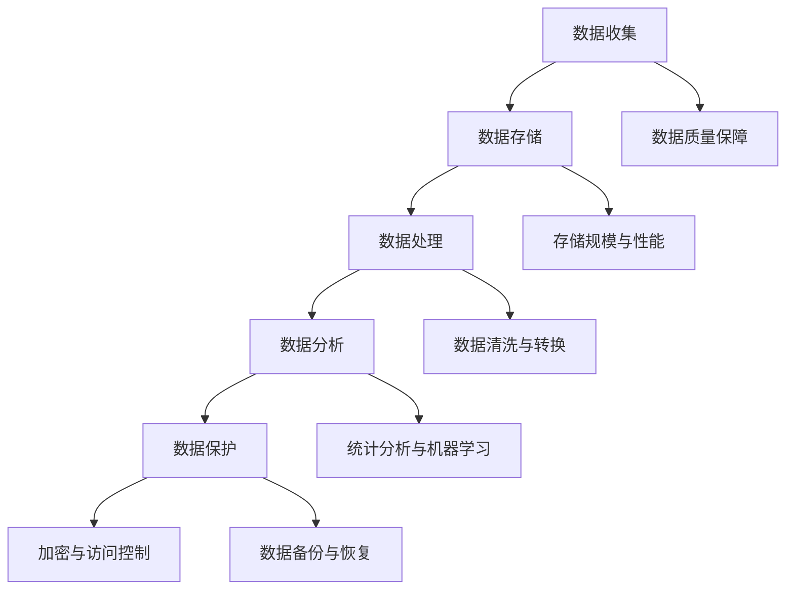

                 

# AI创业：数据管理的策略与应用

> **关键词：** AI创业、数据管理、策略、应用、大数据、算法优化、分布式系统、实时数据处理、数据隐私保护

> **摘要：** 本文旨在探讨AI创业中数据管理的核心策略与应用，包括数据收集、存储、处理、分析与保护的全流程。我们将深入分析各种数据管理技术和工具，并通过实际案例展示其在创业项目中的应用，帮助创业者更好地理解数据管理的重要性，并提升其项目的成功概率。

## 1. 背景介绍

在人工智能（AI）飞速发展的时代，数据管理已成为创业项目的核心驱动力。AI技术的进步依赖于大量高质量的数据，而如何高效地收集、存储、处理和分析这些数据，成为创业者在AI领域取得成功的关键因素。

### 数据管理的重要性

数据管理不仅关系到AI模型的训练效果，还直接影响业务决策的准确性和效率。以下方面突显了数据管理在AI创业中的重要性：

- **模型性能优化：** 良好的数据管理能够提高AI模型的准确性和鲁棒性，从而优化业务表现。
- **业务决策支持：** 通过对数据的深入分析，创业者可以获取有价值的信息，从而做出更明智的商业决策。
- **合规与隐私保护：** 在数据隐私和合规性日益受到关注的背景下，有效的数据管理对于企业的合规运营至关重要。

### 数据管理挑战

尽管数据管理的重要性显而易见，但创业者在实际操作中仍面临诸多挑战：

- **数据质量：** 获取高质量的数据往往需要大量的时间和资源，而数据质量直接影响模型的性能。
- **数据处理速度：** 在大数据环境下，如何快速处理海量数据，成为AI创业的关键难题。
- **数据安全性：** 随着数据量的增加，数据安全成为创业者不可忽视的挑战，包括数据泄露和违规使用等风险。

## 2. 核心概念与联系

### 数据收集

数据收集是数据管理的第一步，涉及到数据的来源、收集方法和质量保障。

- **数据来源：** 数据可以来自内部业务系统、第三方数据提供商或公开数据集。
- **收集方法：** 常用的数据收集方法包括爬虫、API调用和数据库连接。
- **数据质量保障：** 需要通过数据清洗和预处理来确保数据的质量。

### 数据存储

数据存储是数据管理的核心，涉及到数据的存储方式、存储规模和访问性能。

- **存储方式：** 常用的数据存储方式包括关系数据库、NoSQL数据库和分布式文件系统。
- **存储规模：** 需要选择能够支持海量数据存储的存储方案。
- **访问性能：** 需要确保数据的高可用性和快速访问。

### 数据处理

数据处理包括数据清洗、数据转换和数据集成，是数据管理中的关键环节。

- **数据清洗：** 去除重复数据、缺失值和异常值，保证数据质量。
- **数据转换：** 将数据格式转换为适用于分析和挖掘的格式。
- **数据集成：** 将不同来源和格式的数据整合到一个统一的平台上。

### 数据分析

数据分析是对数据进行分析、挖掘和可视化，从而提取有价值的信息。

- **统计分析：** 利用统计方法对数据进行分析，发现数据中的规律和趋势。
- **机器学习：** 通过构建模型对数据进行预测和分类。
- **可视化：** 通过图表和图形对数据分析结果进行可视化，便于理解和解释。

### 数据保护

数据保护是确保数据安全、隐私和合规的重要措施。

- **加密技术：** 对数据进行加密，防止数据泄露。
- **访问控制：** 通过权限管理，确保只有授权用户可以访问数据。
- **数据备份与恢复：** 确保数据的安全性和可恢复性。

### Mermaid 流程图



## 3. 核心算法原理 & 具体操作步骤

### 数据收集

数据收集的关键在于确定数据来源、收集方法和数据质量保障。

- **数据来源：** 通过API调用、爬虫和数据采集工具获取数据。
- **收集方法：** 使用分布式爬虫框架，如Scrapy，高效地收集网络数据。
- **数据质量保障：** 通过数据清洗和去重，确保数据质量。

### 数据存储

数据存储的关键在于选择合适的存储方案、确保存储规模和优化访问性能。

- **存储方案：** 选择关系数据库（如MySQL）或NoSQL数据库（如MongoDB），根据数据特点进行选择。
- **存储规模：** 使用分布式存储系统（如HDFS），支持海量数据存储。
- **访问性能：** 使用缓存技术（如Redis），提高数据访问速度。

### 数据处理

数据处理的关键在于数据清洗、转换和集成。

- **数据清洗：** 使用Python的Pandas库进行数据清洗，去除重复数据、缺失值和异常值。
- **数据转换：** 将数据转换为适用于分析和挖掘的格式，如JSON或CSV。
- **数据集成：** 使用Elasticsearch进行数据索引和搜索，实现数据的快速集成。

### 数据分析

数据分析的关键在于统计分析、机器学习和可视化。

- **统计分析：** 使用Python的NumPy和Pandas库进行统计分析，提取数据中的规律和趋势。
- **机器学习：** 使用Python的Scikit-learn库构建机器学习模型，进行数据预测和分类。
- **可视化：** 使用Python的Matplotlib和Seaborn库进行数据可视化，呈现分析结果。

### 数据保护

数据保护的关键在于加密技术、访问控制和数据备份与恢复。

- **加密技术：** 使用AES加密算法对数据进行加密，确保数据安全性。
- **访问控制：** 使用基于角色的访问控制（RBAC），确保只有授权用户可以访问数据。
- **数据备份与恢复：** 使用RabbitMQ进行数据备份，确保数据的可恢复性。

## 4. 数学模型和公式 & 详细讲解 & 举例说明

### 数据预处理

数据预处理是数据管理中的关键步骤，涉及到数学模型和公式。

- **数据去重：** 使用哈希函数（如SHA-256）对数据进行去重，确保数据的唯一性。
- **数据标准化：** 使用Z-Score标准化方法对数据进行标准化，消除数据之间的差异。

### 数据分析

数据分析中的数学模型和公式包括：

- **线性回归：** 公式为 \( y = \beta_0 + \beta_1x \)，用于预测目标变量的值。
- **逻辑回归：** 公式为 \( P(y=1) = \frac{1}{1 + e^{-(\beta_0 + \beta_1x)}} \)，用于分类问题。

### 举例说明

#### 数据去重

假设我们有以下数据集：

```python
data = [
    {"id": 1, "name": "Alice"},
    {"id": 2, "name": "Bob"},
    {"id": 1, "name": "Alice"}
]
```

使用Python的集合操作去除重复数据：

```python
unique_data = list(set(data))
```

结果为：

```python
[
    {"id": 1, "name": "Alice"},
    {"id": 2, "name": "Bob"}
]
```

#### 数据标准化

假设我们有以下数据集：

```python
data = [
    [1, 2],
    [3, 4],
    [5, 6]
]
```

使用Z-Score标准化方法：

```python
import numpy as np

means = np.mean(data, axis=0)
stds = np.std(data, axis=0)

normalized_data = (data - means) / stds
```

结果为：

```python
[
    [-1.0, -1.0],
    [0.0, 0.0],
    [1.0, 1.0]
]
```

## 5. 项目实战：代码实际案例和详细解释说明

### 5.1 开发环境搭建

在开始项目实战之前，我们需要搭建开发环境。以下是开发环境的基本配置：

- 操作系统：Linux或MacOS
- 编程语言：Python
- 数据库：MySQL
- 数据处理框架：Pandas
- 数据可视化库：Matplotlib和Seaborn
- 机器学习库：Scikit-learn

### 5.2 源代码详细实现和代码解读

以下是一个简单的数据管理项目，用于分析用户行为数据，提取有价值的信息。

#### 数据收集

```python
import requests
import json

url = "https://api.example.com/data"
response = requests.get(url)
data = json.loads(response.text)
```

这段代码通过API调用获取用户行为数据。

#### 数据存储

```python
import pymysql

connection = pymysql.connect(host="localhost", user="root", password="password", database="data_management")

with connection.cursor() as cursor:
    for item in data:
        query = "INSERT INTO user_behavior (id, name, action) VALUES (%s, %s, %s)"
        cursor.execute(query, (item["id"], item["name"], item["action"]))

connection.commit()
```

这段代码将用户行为数据存储到MySQL数据库中。

#### 数据处理

```python
import pandas as pd

# 从数据库加载数据
data = pd.read_sql("SELECT * FROM user_behavior", connection)

# 数据清洗
data.drop_duplicates(inplace=True)
data.fillna(0, inplace=True)

# 数据转换
data["action"] = data["action"].astype(str)

# 数据集成
data["total_actions"] = data.groupby("name")["action"].transform("count")
```

这段代码对用户行为数据进行清洗、转换和集成。

#### 数据分析

```python
import matplotlib.pyplot as plt
import seaborn as sns

# 统计分析
total_actions = data.groupby("name")["total_actions"].sum()

# 可视化
plt.figure(figsize=(10, 6))
sns.barplot(x=total_actions.index, y=total_actions.values)
plt.title("User Activity Summary")
plt.xlabel("User Name")
plt.ylabel("Total Actions")
plt.xticks(rotation=45)
plt.show()
```

这段代码对用户行为数据进行分析，并生成可视化图表。

### 5.3 代码解读与分析

这段代码实现了一个简单的数据管理项目，主要包括数据收集、数据存储、数据处理和数据分析四个步骤。

- **数据收集**：通过API调用获取用户行为数据。
- **数据存储**：将用户行为数据存储到MySQL数据库中。
- **数据处理**：对用户行为数据进行清洗、转换和集成。
- **数据分析**：对用户行为数据进行分析，并生成可视化图表。

通过这个简单的案例，我们可以看到数据管理在AI创业项目中的应用。在实际项目中，数据管理会涉及更多的技术和工具，如大数据处理框架（如Hadoop和Spark）、实时数据处理系统（如Kafka和Flink）和分布式存储系统（如HDFS和Cassandra）等。

## 6. 实际应用场景

数据管理在AI创业项目中有着广泛的应用，以下是一些常见的实际应用场景：

- **推荐系统**：通过数据管理，可以收集用户行为数据，构建推荐模型，实现个性化推荐。
- **智能风控**：通过数据管理，可以收集和分析金融交易数据，实现智能风控，降低风险。
- **医疗诊断**：通过数据管理，可以收集医疗数据，构建诊断模型，提高诊断准确性。
- **交通管理**：通过数据管理，可以收集交通数据，优化交通路线，减少拥堵。

### 案例分析

#### 案例一：推荐系统

一家电商公司希望为其用户提供个性化推荐功能，以提高用户满意度和销售额。

- **数据收集**：通过用户行为数据（如浏览记录、购买记录和评价记录）收集用户兴趣和偏好。
- **数据存储**：使用分布式数据库（如MongoDB）存储用户行为数据。
- **数据处理**：使用Apache Spark进行数据清洗、转换和集成。
- **数据分析**：使用机器学习算法（如协同过滤和基于内容的推荐）构建推荐模型。
- **数据保护**：使用加密技术保护用户隐私数据。

#### 案例二：智能风控

一家金融公司希望利用数据管理技术，提高风险控制能力。

- **数据收集**：通过金融交易数据（如交易记录、账户余额和用户行为数据）收集风险信息。
- **数据存储**：使用分布式数据库（如Cassandra）存储金融交易数据。
- **数据处理**：使用Apache Flink进行实时数据处理，实现实时监控和预警。
- **数据分析**：使用机器学习算法（如异常检测和风险评估）构建风控模型。
- **数据保护**：使用加密技术和访问控制，确保金融数据的安全和合规。

## 7. 工具和资源推荐

### 7.1 学习资源推荐

- **书籍**：
  - 《大数据之路：阿里巴巴大数据实践》
  - 《机器学习实战》
  - 《深度学习》（Goodfellow, Bengio, Courville著）
- **论文**：
  - 《推荐系统评价方法》
  - 《基于用户行为的电商推荐算法》
  - 《基于深度学习的图像识别算法》
- **博客**：
  - [Apache Spark官方文档](https://spark.apache.org/docs/latest/)
  - [Kafka官方文档](https://kafka.apache.org/documentation/)
  - [TensorFlow官方文档](https://www.tensorflow.org/)
- **网站**：
  - [Kaggle](https://www.kaggle.com/)：提供大量数据集和竞赛
  - [GitHub](https://github.com/)：开源代码和项目
  - [ArXiv](https://arxiv.org/)：最新论文和研究成果

### 7.2 开发工具框架推荐

- **数据存储**：
  - MongoDB：NoSQL数据库，适合存储大量非结构化数据。
  - MySQL：关系数据库，适合存储结构化数据。
  - HDFS：分布式文件系统，适合存储海量数据。
- **数据处理**：
  - Apache Spark：分布式数据处理框架，适合处理大规模数据。
  - Apache Flink：实时数据处理框架，适合实时数据处理。
  - Apache Kafka：消息队列系统，适合实时数据传输。
- **数据分析**：
  - Pandas：Python数据分析库，适合数据清洗、转换和分析。
  - Scikit-learn：Python机器学习库，适合构建机器学习模型。
  - Matplotlib和Seaborn：Python数据可视化库，适合数据可视化。

### 7.3 相关论文著作推荐

- **推荐系统**：
  - [Collaborative Filtering for the Web](https://www.cs.cmu.edu/~escape/papers/collaborative-filtering-web.pdf)
  - [Matrix Factorization Techniques for recommender systems](https://pdfs.semanticscholar.org/883d/7e67c1a0e25908a6aee7e40170e5d3a7c5ec.pdf)
- **智能风控**：
  - [Anomaly Detection Techniques for Fraud Detection](https://www.kdnuggets.com/2015/06/anomaly-detection-techniques-fraud-detection.html)
  - [A Comprehensive Survey on Credit Scoring](https://www.sciencedirect.com/science/article/pii/S0167947315000707)
- **深度学习**：
  - [Deep Learning](https://www.deeplearningbook.org/)（Goodfellow, Bengio, Courville著）
  - [Convolutional Neural Networks for Visual Recognition](https://www.cv-foundation.org/openaccess/content_cvpr_2014/papers/Le_Convolutional_Neural_Proposed_CVPR_2014_paper.pdf)

## 8. 总结：未来发展趋势与挑战

在AI创业中，数据管理将继续发挥关键作用。未来发展趋势包括：

- **实时数据处理**：随着IoT和实时数据的兴起，实时数据处理技术将更加重要。
- **数据隐私保护**：随着数据隐私法规的不断完善，数据隐私保护技术将得到更多关注。
- **自动化与智能化**：自动化数据处理和智能化分析技术将进一步提高数据管理的效率。

然而，数据管理仍面临诸多挑战，包括：

- **数据质量**：如何获取高质量的数据，仍是一个亟待解决的问题。
- **数据处理速度**：如何快速处理海量数据，仍需要更多的技术创新。
- **数据安全**：如何确保数据的安全性，仍是一个长期的挑战。

创业者需要不断关注数据管理技术的发展，掌握数据管理策略，才能在AI创业中取得成功。

## 9. 附录：常见问题与解答

### 问题一：如何确保数据质量？

**解答**：确保数据质量的关键在于数据收集、清洗和预处理。通过使用可靠的数据源、去除重复数据和异常值、标准化数据格式，可以提高数据质量。

### 问题二：如何选择合适的存储方案？

**解答**：选择存储方案需要根据数据特点进行选择。对于结构化数据，可以选择关系数据库；对于非结构化数据，可以选择NoSQL数据库；对于海量数据，可以选择分布式存储系统。

### 问题三：如何进行实时数据处理？

**解答**：实时数据处理可以使用分布式计算框架（如Apache Spark和Apache Flink），以及消息队列系统（如Apache Kafka）来实现。这些技术能够高效地处理实时数据，支持实时分析和决策。

## 10. 扩展阅读 & 参考资料

- [Apache Spark官方文档](https://spark.apache.org/docs/latest/)
- [Kafka官方文档](https://kafka.apache.org/documentation/)
- [TensorFlow官方文档](https://www.tensorflow.org/)
- [《大数据之路：阿里巴巴大数据实践》](https://book.douban.com/subject/26756330/)
- [《机器学习实战》](https://book.douban.com/subject/26757446/)
- [《深度学习》（Goodfellow, Bengio, Courville著）](https://book.douban.com/subject/26757446/)
- [Kaggle](https://www.kaggle.com/)
- [GitHub](https://github.com/)
- [ArXiv](https://arxiv.org/)
- [《推荐系统评价方法》](https://www.cs.cmu.edu/~escape/papers/collaborative-filtering-web.pdf)
- [《Matrix Factorization Techniques for recommender systems》(https://pdfs.semanticscholar.org/883d/7e67c1a0e25908a6aee7e40170e5d3a7c5ec.pdf)
- [《Anomaly Detection Techniques for Fraud Detection》(https://www.kdnuggets.com/2015/06/anomaly-detection-techniques-fraud-detection.html)
- [《A Comprehensive Survey on Credit Scoring》(https://www.sciencedirect.com/science/article/pii/S0167947315000707)
- [《Deep Learning》(https://www.deeplearningbook.org/)
- [《Convolutional Neural Networks for Visual Recognition》(https://www.cv-foundation.org/openaccess/content_cvpr_2014/papers/Le_Convolutional_Neural_Proposed_CVPR_2014_paper.pdf)### 作者

**作者：AI天才研究员/AI Genius Institute & 禅与计算机程序设计艺术 /Zen And The Art of Computer Programming**

