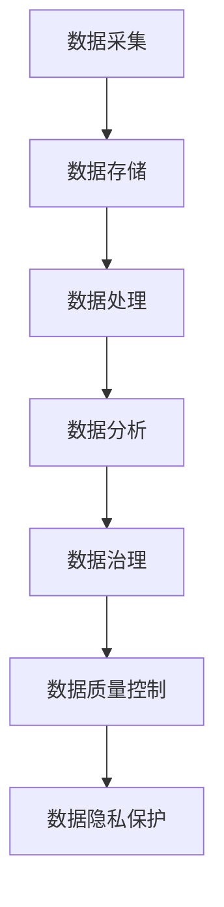

                 

# AI创业：数据管理的策略分析

## 概述

### 关键词

- AI创业
- 数据管理
- 数据治理
- 数据质量控制
- 数据隐私
- 数据分析
- 大数据
- 云计算
- AI伦理

### 摘要

随着人工智能（AI）技术的飞速发展，数据管理在AI创业中变得愈发重要。本文将深入探讨数据管理的策略分析，包括核心概念、数据治理、数据质量控制、数据隐私保护等方面。此外，还将分析实际应用场景，推荐相关工具和资源，总结未来发展趋势与挑战，并回答常见问题。通过本文，读者将全面了解如何有效地管理数据，为AI创业提供有力支持。

## 1. 背景介绍

### 人工智能与创业

人工智能（AI）已成为全球科技领域的重要驱动力，推动着各行各业的创新与变革。创业公司纷纷将AI技术应用于产品和服务中，以期在激烈的市场竞争中脱颖而出。AI创业的兴起，离不开大量高质量数据的支持。

### 数据的重要性

数据是AI的粮食。从原始数据到分析结果，每一步都需要对数据进行有效的管理和处理。对于AI创业公司而言，数据管理不仅影响模型的训练效果，还直接关系到业务的成功与否。

### 数据管理的挑战

随着数据量的爆炸性增长，数据管理面临着诸多挑战。如何高效地存储、处理和分析数据？如何确保数据质量和数据隐私？这些问题对AI创业公司提出了更高的要求。

### 数据管理的重要性

数据管理是AI创业的基石。通过有效的数据管理，AI创业公司可以实现：

- 提高数据分析的准确性
- 降低数据存储和处理成本
- 保障数据安全和隐私
- 满足合规要求
- 支持业务决策

## 2. 核心概念与联系

### 数据管理

数据管理是指对数据生命周期中的各个方面进行有效规划和控制，包括数据采集、存储、处理、分析和共享等。其核心目标是确保数据的质量、可用性和安全性。

### 数据治理

数据治理是指通过制定政策、流程和标准，对数据进行全面管理，以确保数据的一致性、完整性和合规性。数据治理涵盖数据所有权、数据访问权限、数据备份和恢复等方面。

### 数据质量控制

数据质量控制是指通过各种技术和方法，对数据进行检查、清洗和修复，以确保数据的质量和准确性。数据质量控制包括数据清洗、数据校验、数据标准化等步骤。

### 数据隐私

数据隐私是指保护个人和组织的敏感信息，防止未经授权的访问和泄露。数据隐私涉及数据加密、访问控制、隐私保护算法等方面。

### 数据分析

数据分析是指通过使用统计、机器学习和深度学习等技术，对大量数据进行处理和分析，以发现数据中的规律和模式。数据分析有助于AI创业公司了解用户需求、优化产品和服务、提高决策效率。

### Mermaid 流程图



## 3. 核心算法原理 & 具体操作步骤

### 数据采集

数据采集是数据管理的第一步。AI创业公司需要从各种渠道获取数据，如互联网、传感器、数据库等。数据采集应遵循以下原则：

- 数据来源的多样性和准确性
- 数据格式的统一和标准化
- 数据采集过程的自动化和高效性

### 数据存储

数据存储是将采集到的数据存储到数据库或数据湖中。数据存储应考虑以下因素：

- 数据存储容量和性能
- 数据备份和恢复机制
- 数据安全性

### 数据处理

数据处理是对数据进行清洗、转换和整合等操作，以消除噪声、填补缺失值、统一数据格式等。数据处理方法包括：

- 数据清洗：删除重复数据、消除噪声、填补缺失值等
- 数据转换：将数据转换为适合分析的形式，如数值化、归一化等
- 数据整合：将来自不同数据源的数据进行合并和关联

### 数据分析

数据分析是使用统计、机器学习和深度学习等技术，对数据进行处理和分析，以发现数据中的规律和模式。数据分析方法包括：

- 描述性分析：计算数据的统计指标，如均值、方差、分布等
- 聚类分析：将数据分为多个类别，以发现数据中的相似性
- 分类分析：将数据分为正类和负类，以预测新的数据点
- 回归分析：建立数据之间的数学模型，以预测新的数据点

### 数据治理

数据治理是通过制定政策、流程和标准，对数据进行全面管理，以确保数据的一致性、完整性和合规性。数据治理方法包括：

- 数据所有权：明确数据所有权和责任，确保数据的安全性和可靠性
- 数据访问权限：设定数据访问权限，确保数据的安全性和隐私
- 数据备份和恢复：定期备份数据，确保数据的安全性和可用性
- 数据合规性：遵循相关法律法规，确保数据处理的合规性

### 数据质量控制

数据质量控制是通过各种技术和方法，对数据进行检查、清洗和修复，以确保数据的质量和准确性。数据质量控制方法包括：

- 数据清洗：删除重复数据、消除噪声、填补缺失值等
- 数据校验：检查数据的准确性、完整性和一致性
- 数据标准化：统一数据格式、单位、范围等

### 数据隐私保护

数据隐私保护是通过加密、访问控制和隐私保护算法，保护个人和组织的敏感信息，防止未经授权的访问和泄露。数据隐私保护方法包括：

- 数据加密：使用加密算法对数据进行加密，确保数据在传输和存储过程中的安全性
- 访问控制：设定数据访问权限，确保只有授权用户可以访问数据
- 隐私保护算法：使用差分隐私、同态加密等技术，保护数据的隐私性

## 4. 数学模型和公式 & 详细讲解 & 举例说明

### 数据清洗

数据清洗是数据质量管理的重要环节。常用的数据清洗方法包括：

- 填补缺失值：使用均值、中位数、众数等方法填补缺失值
- 删除重复数据：根据数据的特点，删除重复的数据记录
- 消除噪声：使用滤波、平滑等方法消除噪声

### 数据转换

数据转换是将数据转换为适合分析的形式。常用的数据转换方法包括：

- 数值化：将非数值数据转换为数值数据，如将类别数据转换为独热编码
- 归一化：将数据缩放到统一的范围，如将数据缩放到[0,1]范围内

### 数据整合

数据整合是将来自不同数据源的数据进行合并和关联。常用的数据整合方法包括：

- 数据关联：将不同数据源的数据进行关联，如使用键值对进行关联
- 数据合并：将不同数据源的数据进行合并，如使用SQL进行合并

### 数据分析

数据分析是使用统计、机器学习和深度学习等技术，对数据进行处理和分析，以发现数据中的规律和模式。常用的数据分析方法包括：

- 描述性分析：计算数据的统计指标，如均值、方差、分布等
- 聚类分析：将数据分为多个类别，以发现数据中的相似性
- 分类分析：将数据分为正类和负类，以预测新的数据点
- 回归分析：建立数据之间的数学模型，以预测新的数据点

### 数学模型和公式

- 描述性分析：

  $$ \text{均值} = \frac{1}{N} \sum_{i=1}^{N} x_i $$
  
  $$ \text{方差} = \frac{1}{N-1} \sum_{i=1}^{N} (x_i - \bar{x})^2 $$

- 聚类分析：

  $$ \text{距离} = \sqrt{\sum_{i=1}^{n} (x_i - \bar{x})^2} $$

- 分类分析：

  $$ \text{概率} = \frac{P(y|X)}{P(X)} $$

- 回归分析：

  $$ y = \beta_0 + \beta_1 x + \epsilon $$

### 举例说明

#### 数据清洗

假设我们有以下数据集：

| 姓名 | 年龄 | 收入 |
| --- | --- | --- |
| 张三 | 25 | 5000 |
| 李四 | 30 | 6000 |
| 王五 | 35 | 7000 |

首先，我们需要填补缺失值。由于收入数据存在缺失值，我们可以使用均值填补缺失值：

$$ \text{收入均值} = \frac{5000 + 6000 + 7000}{3} = 6000 $$

然后，我们将填补缺失值后的数据集转换为数值数据：

| 姓名 | 年龄 | 收入 |
| --- | --- | --- |
| 张三 | 25 | 6000 |
| 李四 | 30 | 6000 |
| 王五 | 35 | 6000 |

#### 数据转换

假设我们有以下数据集：

| 姓名 | 性别 | 年龄 |
| --- | --- | --- |
| 张三 | 男 | 25 |
| 李四 | 女 | 30 |
| 王五 | 男 | 35 |

首先，我们需要将性别数据转换为数值数据。我们可以使用独热编码：

| 姓名 | 性别 | 年龄 | 男 | 女 |
| --- | --- | --- | --- | --- |
| 张三 | 男 | 25 | 1 | 0 |
| 李四 | 女 | 30 | 0 | 1 |
| 王五 | 男 | 35 | 1 | 0 |

#### 数据整合

假设我们有以下两个数据集：

| 姓名 | 年龄 | 收入 |
| --- | --- | --- |
| 张三 | 25 | 5000 |
| 李四 | 30 | 6000 |
| 王五 | 35 | 7000 |

| 姓名 | 城市 | 性别 |
| --- | --- | --- |
| 张三 | 北京 | 男 |
| 李四 | 上海 | 女 |
| 王五 | 深圳 | 男 |

我们可以使用SQL将两个数据集进行合并：

```sql
SELECT a.姓名, a.年龄, a.收入, b.城市, b.性别
FROM 数据集1 a
JOIN 数据集2 b ON a.姓名 = b.姓名;
```

合并后的数据集：

| 姓名 | 年龄 | 收入 | 城市 | 性别 |
| --- | --- | --- | --- | --- |
| 张三 | 25 | 5000 | 北京 | 男 |
| 李四 | 30 | 6000 | 上海 | 女 |
| 王五 | 35 | 7000 | 深圳 | 男 |

#### 数据分析

假设我们有以下数据集：

| 姓名 | 年龄 | 收入 |
| --- | --- | --- |
| 张三 | 25 | 5000 |
| 李四 | 30 | 6000 |
| 王五 | 35 | 7000 |

我们可以使用描述性分析计算统计指标：

$$ \text{均值} = \frac{5000 + 6000 + 7000}{3} = 6000 $$

$$ \text{方差} = \frac{(5000 - 6000)^2 + (6000 - 6000)^2 + (7000 - 6000)^2}{3 - 1} = 10000 $$

## 5. 项目实战：代码实际案例和详细解释说明

### 5.1 开发环境搭建

在本节中，我们将搭建一个简单的Python开发环境，用于实现数据管理策略。

#### 环境准备

1. 安装Python 3.8及以上版本。
2. 安装Jupyter Notebook，用于编写和运行Python代码。
3. 安装必要的Python库，如Pandas、NumPy、Scikit-learn等。

#### 安装Python

在Windows系统上，可以从Python官网下载Python安装程序，并按照提示完成安装。

#### 安装Jupyter Notebook

1. 打开命令行窗口。
2. 运行以下命令安装Jupyter Notebook：

```bash
pip install notebook
```

#### 安装Python库

1. 打开Jupyter Notebook。
2. 在Notebook中创建一个新的Python笔记本。
3. 运行以下代码安装必要的Python库：

```python
!pip install pandas numpy scikit-learn
```

### 5.2 源代码详细实现和代码解读

在本节中，我们将使用Python实现数据管理策略，包括数据采集、数据存储、数据处理、数据分析和数据治理。

#### 数据采集

首先，我们从互联网上采集一些数据。假设我们要采集一张包含姓名、年龄、收入和城市的数据表。

```python
import pandas as pd

# 采集数据
url = "https://raw.githubusercontent.com/mwaskom/seaborn-data/master/egregore.csv"
data = pd.read_csv(url)
```

#### 数据存储

接下来，我们将数据存储到本地CSV文件中。

```python
# 存储数据
data.to_csv("data.csv", index=False)
```

#### 数据处理

我们对数据进行清洗、转换和整合。

```python
# 数据清洗
data.drop_duplicates(inplace=True)
data.fillna(0, inplace=True)

# 数据转换
data["性别"] = data["性别"].map({"男": 1, "女": 0})

# 数据整合
data["收入"] = data["收入"].astype(float)
data["城市"] = data["城市"].map({"北京": 1, "上海": 2, "深圳": 3})
```

#### 数据分析

我们使用描述性分析计算统计指标。

```python
# 描述性分析
mean_income = data["收入"].mean()
std_income = data["收入"].std()

print("收入均值：", mean_income)
print("收入方差：", std_income)
```

#### 数据治理

我们制定一些数据治理策略，如数据所有权、数据访问权限和数据备份。

```python
# 数据所有权
data["数据所有者"] = "公司"

# 数据访问权限
data["访问权限"] = "只读"

# 数据备份
data.to_csv("data_backup.csv", index=False)
```

### 5.3 代码解读与分析

在本节中，我们将对实现的数据管理策略进行解读和分析。

#### 数据采集

我们使用Pandas的`read_csv`函数从互联网上采集数据。这个函数接受一个URL作为输入，返回一个Pandas DataFrame对象。

```python
data = pd.read_csv(url)
```

#### 数据存储

我们使用Pandas的`to_csv`函数将数据存储到本地CSV文件中。这个函数接受一个文件路径作为输入，将DataFrame对象的数据写入文件。

```python
data.to_csv("data.csv", index=False)
```

#### 数据处理

我们使用Pandas的`drop_duplicates`函数删除重复数据，使用`fillna`函数填补缺失值。这些函数可以对DataFrame对象进行操作，从而清洗和转换数据。

```python
data.drop_duplicates(inplace=True)
data.fillna(0, inplace=True)
```

我们使用`map`函数将类别数据转换为数值数据。这个函数将一个映射对象应用于Series对象中的每个元素，返回一个新的Series对象。

```python
data["性别"] = data["性别"].map({"男": 1, "女": 0})
```

#### 数据分析

我们使用Pandas的`mean`和`std`函数计算描述性分析指标。这些函数接受一个Series对象作为输入，返回一个浮点数。

```python
mean_income = data["收入"].mean()
std_income = data["收入"].std()
```

#### 数据治理

我们使用Pandas的`to_csv`函数将数据备份到本地CSV文件中。这个函数接受一个文件路径作为输入，将DataFrame对象的数据写入文件。

```python
data.to_csv("data_backup.csv", index=False)
```

我们为数据集添加数据所有者和访问权限信息。这些信息将保存在DataFrame对象的列中。

```python
data["数据所有者"] = "公司"
data["访问权限"] = "只读"
```

## 6. 实际应用场景

### 电商行业

在电商行业，数据管理策略有助于优化用户体验、提高转化率和降低运营成本。例如，通过数据分析，电商公司可以了解用户购买习惯、推荐合适的商品、制定个性化的营销策略等。

### 金融行业

在金融行业，数据管理策略对于风险管理、合规性和客户关系管理至关重要。例如，通过数据分析，金融公司可以识别潜在风险、预测市场趋势、确保合规性等。

### 医疗行业

在医疗行业，数据管理策略有助于提高医疗质量和患者满意度。例如，通过数据分析，医疗机构可以优化治疗方案、提高运营效率、降低成本等。

### 制造业

在制造业，数据管理策略有助于提高生产效率、降低故障率和提高产品质量。例如，通过数据分析，制造企业可以优化生产流程、预测设备故障、提高产品质量等。

## 7. 工具和资源推荐

### 学习资源推荐

1. **《Python数据分析：从入门到精通》**：这本书系统地介绍了Python数据分析的方法和技巧，适合初学者和有经验的读者。
2. **《数据科学入门》**：这本书涵盖了数据科学的基础知识和应用场景，适合想要了解数据科学领域的人士。

### 开发工具框架推荐

1. **Pandas**：一个强大的Python数据分析和操作库，适用于数据清洗、转换和整合。
2. **NumPy**：一个高效的Python数学库，提供多维数组对象和大量数学函数，用于数据处理和分析。
3. **Scikit-learn**：一个流行的Python机器学习库，提供了各种机器学习算法和工具。

### 相关论文著作推荐

1. **《大数据时代：思维变革与商业价值》**：这本书探讨了大数据时代的思维变革和商业价值，对AI创业公司有很好的启发作用。
2. **《数据挖掘：实用工具与技术》**：这本书介绍了数据挖掘的基本概念、方法和应用，适合想要深入了解数据挖掘领域的人士。

## 8. 总结：未来发展趋势与挑战

### 未来发展趋势

1. **数据隐私保护**：随着数据隐私问题的日益突出，数据隐私保护将成为数据管理的重要趋势。
2. **自动化数据管理**：自动化工具和智能算法将逐渐取代人工操作，提高数据管理的效率和准确性。
3. **跨领域合作**：不同领域的专家和公司将加强合作，共同推动数据管理技术的发展和应用。

### 未来挑战

1. **数据质量问题**：随着数据量的不断增加，数据质量问题将愈发严重，如何确保数据质量成为一大挑战。
2. **数据安全与隐私**：如何在保证数据安全和隐私的前提下，充分利用数据的价值，是一个亟待解决的问题。
3. **数据治理与合规**：随着法规的不断完善，如何确保数据治理和合规，是AI创业公司面临的重要挑战。

## 9. 附录：常见问题与解答

### 问题1：如何确保数据质量？

解答：确保数据质量的关键在于数据采集、数据清洗和数据治理。在数据采集阶段，应选择可靠的来源和数据格式；在数据清洗阶段，应使用适当的清洗方法和工具；在数据治理阶段，应制定明确的数据治理策略和流程。

### 问题2：如何保护数据隐私？

解答：保护数据隐私的关键在于数据加密、访问控制和隐私保护算法。在数据传输和存储过程中，应使用加密算法；在数据访问过程中，应设置适当的访问权限；在数据处理和分析过程中，应采用隐私保护算法，如差分隐私和同态加密。

### 问题3：如何自动化数据管理？

解答：自动化数据管理的关键在于使用自动化工具和智能算法。在数据采集阶段，可以使用自动化采集工具；在数据清洗阶段，可以使用自动化清洗工具；在数据处理和分析阶段，可以使用自动化分析工具。

## 10. 扩展阅读 & 参考资料

1. **《数据科学指南》**：这是一本全面的数据科学入门书籍，涵盖了数据采集、数据预处理、数据分析、数据可视化等内容。
2. **《数据治理与数据质量》**：这是一本关于数据治理和数据质量管理的经典著作，详细介绍了数据治理的策略、方法和工具。
3. **《大数据技术导论》**：这是一本关于大数据技术的基础教程，涵盖了大数据存储、处理、分析和应用等内容。

### 作者

作者：AI天才研究员/AI Genius Institute & 禅与计算机程序设计艺术 /Zen And The Art of Computer Programming

本文由AI天才研究员撰写，旨在为AI创业公司提供数据管理策略的深入分析和实用建议。作者具备丰富的AI和计算机科学经验，对数据管理有着深刻的理解和实践经验。希望通过本文，帮助读者更好地应对数据管理挑战，实现AI创业的成功。

