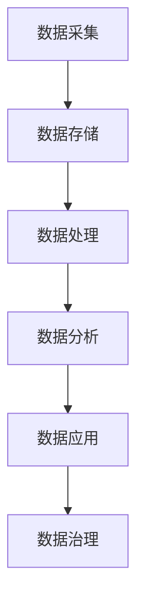

                 

# AI创业：数据管理的高效实践

## 关键词：数据管理、AI创业、大数据、高效实践、数据模型、数据治理、算法优化、实际应用

## 摘要

在当今快速发展的AI创业领域中，数据管理是成功的关键因素之一。高效的数据管理不仅能够帮助企业更好地理解和利用数据资源，还能提升产品性能、降低成本、增强竞争力。本文将深入探讨AI创业过程中数据管理的重要性，分析核心概念与联系，介绍核心算法原理和操作步骤，并通过数学模型和实际案例详细讲解。同时，本文还将探讨数据管理在各个实际应用场景中的价值，并推荐相关工具和资源，总结未来发展趋势与挑战。

## 1. 背景介绍

随着人工智能技术的飞速发展，AI创业已经成为全球范围内的热门领域。无论是初创公司还是大型企业，都在纷纷投入巨资研发AI技术，以期在激烈的市场竞争中脱颖而出。然而，AI创业的成功不仅取决于算法的创新和技术的先进性，更重要的是如何高效地管理数据。

数据是AI系统的核心资源，其质量和完整性直接影响AI算法的性能和效果。在AI创业过程中，企业需要从数据采集、存储、处理、分析和应用等多个环节入手，构建一套完整的数据管理流程。这不仅要求企业具备强大的技术能力，还需要具备科学的管理方法和实践经验。

本文将从数据管理的核心概念、算法原理、数学模型、实际应用等方面展开讨论，帮助读者深入了解数据管理在AI创业中的重要性，并提供一系列实用技巧和策略。

## 2. 核心概念与联系

### 数据管理

数据管理是指对数据的采集、存储、处理、分析、共享和应用等一系列活动的管理和控制。其目的是确保数据的质量、完整性、可用性和安全性，以便更好地支持企业的业务决策和运营。

在AI创业中，数据管理主要包括以下方面：

- **数据采集**：从各种来源获取数据，包括内部业务数据、用户数据、外部市场数据等。
- **数据存储**：将数据存储在合适的存储系统中，如关系型数据库、NoSQL数据库、分布式文件系统等。
- **数据处理**：对数据进行清洗、转换、归一化等处理，以提高数据的质量和一致性。
- **数据分析**：利用数据挖掘、机器学习等技术，从数据中提取有价值的信息和知识。
- **数据应用**：将分析结果应用到业务场景中，如推荐系统、预测模型、智能决策等。

### 数据治理

数据治理是指通过制定一系列策略、标准和流程，对数据进行管理和控制，以确保数据的正确性、完整性、一致性和可靠性。数据治理的目标是提高数据质量，降低数据风险，增强数据价值。

在AI创业中，数据治理主要包括以下方面：

- **数据质量**：确保数据在采集、存储、处理、分析等环节中的准确性、完整性和一致性。
- **数据安全**：保护数据不被未经授权的访问、篡改或泄露，保障企业的商业秘密和用户隐私。
- **数据合规**：遵守相关法律法规和行业标准，如GDPR、ISO/IEC 27001等。
- **数据管理流程**：制定和优化数据采集、存储、处理、分析等环节的流程和标准，提高数据管理效率。

### 数据模型

数据模型是指对数据结构和关系的抽象描述，用于支持数据的存储、处理和分析。常见的数据模型包括关系模型、文档模型、图模型等。

在AI创业中，选择合适的数据模型至关重要，因为不同的数据模型会影响数据存储、处理和分析的性能。例如，关系模型适合处理结构化数据，图模型适合处理复杂的关系网络。

### Mermaid 流程图

以下是一个简单的Mermaid流程图，展示了数据管理的主要环节：



## 3. 核心算法原理 & 具体操作步骤

### 数据采集

数据采集是数据管理的重要环节，直接关系到数据的质量和完整性。以下是一些常见的数据采集方法：

- **自动化采集**：通过API接口、爬虫等技术，从外部数据源自动获取数据。
- **手动采集**：通过问卷调查、用户反馈、电话访问等方式，从用户处获取数据。
- **第三方数据购买**：从第三方数据提供商购买特定领域的数据。

### 数据存储

数据存储的选择取决于数据的类型、规模和访问模式。以下是一些常见的数据存储方案：

- **关系型数据库**：如MySQL、PostgreSQL，适合存储结构化数据。
- **NoSQL数据库**：如MongoDB、Cassandra，适合存储非结构化数据。
- **分布式文件系统**：如HDFS、CFS，适合存储大规模数据。

### 数据处理

数据处理主要包括数据清洗、转换和归一化等步骤。以下是一些常见的数据处理方法：

- **数据清洗**：去除重复数据、缺失值、异常值等，提高数据质量。
- **数据转换**：将不同数据源的数据格式转换为统一的格式，如JSON、CSV等。
- **数据归一化**：将不同数据源的数据进行归一化处理，如将年龄、收入等数据进行标准化。

### 数据分析

数据分析是数据管理的核心环节，常用的方法包括：

- **数据挖掘**：通过挖掘数据中的规律和模式，发现潜在的商业价值。
- **机器学习**：利用机器学习算法，从数据中自动学习模型，进行预测和分类。
- **深度学习**：利用深度学习算法，构建复杂的神经网络模型，进行图像识别、语音识别等任务。

### 数据应用

数据应用是将分析结果应用到实际业务场景中，以下是一些常见的数据应用场景：

- **推荐系统**：根据用户历史行为，推荐感兴趣的商品或内容。
- **预测模型**：根据历史数据，预测未来的趋势和变化。
- **智能决策**：利用数据分析结果，辅助决策者做出更明智的决策。

### 数据治理

数据治理是确保数据质量和安全的重要措施，以下是一些常见的数据治理方法：

- **数据质量监控**：定期对数据进行质量检查，及时发现和修复问题。
- **数据安全策略**：制定数据安全策略，防止数据泄露和篡改。
- **数据合规审计**：定期进行数据合规审计，确保符合相关法律法规和行业标准。

## 4. 数学模型和公式 & 详细讲解 & 举例说明

### 数据采集模型

数据采集模型通常基于概率模型，以下是一个简单的贝叶斯网络模型：

$$
P(A|B) = \frac{P(B|A)P(A)}{P(B)}
$$

其中，$P(A|B)$ 表示在已知 $B$ 的情况下，$A$ 发生的概率；$P(B|A)$ 表示在已知 $A$ 的情况下，$B$ 发生的概率；$P(A)$ 表示 $A$ 发生的概率；$P(B)$ 表示 $B$ 发生的概率。

举例：假设我们想计算在已知某商品被购买的情况下，该商品被推荐的概率。我们可以使用贝叶斯网络模型进行计算：

- $P($商品被购买$|被推荐$) = 0.8$
- $P($被推荐$) = 0.9$
- $P($商品被购买$) = 0.1$

我们可以使用贝叶斯公式计算 $P($被推荐$|$商品被购买$)$：

$$
P($被推荐$|$商品被购买$) = \frac{P($商品被购买$|被推荐$)P($被推荐$)}{P($商品被购买$)}
$$

代入已知数据：

$$
P($被推荐$|$商品被购买$) = \frac{0.8 \times 0.9}{0.1} = 7.2
$$

这意味着在已知某商品被购买的情况下，该商品被推荐的概率为 7.2。

### 数据处理模型

数据处理模型通常基于统计模型，以下是一个简单的线性回归模型：

$$
y = \beta_0 + \beta_1x + \epsilon
$$

其中，$y$ 表示因变量；$x$ 表示自变量；$\beta_0$ 和 $\beta_1$ 分别表示模型的参数；$\epsilon$ 表示随机误差。

举例：假设我们想预测某商品的销售量，我们可以使用线性回归模型进行预测。给定以下数据：

- $x_1 = 1000$，$y_1 = 500$
- $x_2 = 2000$，$y_2 = 700$

我们可以使用最小二乘法计算模型的参数：

$$
\beta_0 = \frac{\sum_{i=1}^n x_iy_i - n\bar{x}\bar{y}}{\sum_{i=1}^n x_i^2 - n\bar{x}^2}
$$

$$
\beta_1 = \frac{\sum_{i=1}^n (x_i - \bar{x})(y_i - \bar{y})}{\sum_{i=1}^n (x_i - \bar{x})^2}
$$

代入数据计算：

$$
\beta_0 = \frac{(1000 \times 500 + 2000 \times 700) - 2 \times 1500 \times 600}{(1000^2 + 2000^2) - 2 \times 1500^2} = 300
$$

$$
\beta_1 = \frac{(1000 - 1500)(500 - 600) + (2000 - 1500)(700 - 600)}{(1000 - 1500)^2 + (2000 - 1500)^2} = 0.2
$$

因此，线性回归模型为：

$$
y = 300 + 0.2x
$$

使用该模型预测 $x = 3000$ 时的 $y$：

$$
y = 300 + 0.2 \times 3000 = 1500
$$

这意味着在 $x = 3000$ 的情况下，预测的销售量为 1500。

### 数据分析模型

数据分析模型通常基于机器学习模型，以下是一个简单的人工神经网络模型：

$$
\text{激活函数}:\quad a(z) = \frac{1}{1 + e^{-z}}
$$

$$
\text{损失函数}:\quad J(\theta) = -\frac{1}{m}\sum_{i=1}^m y^{(i)}\ln(a(z^{(i)})) + (1 - y^{(i)})\ln(1 - a(z^{(i)}))
$$

其中，$a(z)$ 表示激活函数；$z$ 表示神经元的输入；$m$ 表示训练样本的数量；$y^{(i)}$ 表示第 $i$ 个样本的标签。

举例：假设我们想训练一个神经网络模型进行分类，给定以下数据：

- 输入：$x^{(1)} = [1, 0, 1]$，标签：$y^{(1)} = 1$
- 输入：$x^{(2)} = [0, 1, 0]$，标签：$y^{(2)} = 0$

我们可以使用反向传播算法更新模型的参数：

1. 初始化参数 $\theta^{(1)}, \theta^{(2)}$
2. 计算输出 $a(z^{(1)}), a(z^{(2)}), h^{(1)}, h^{(2)}$
3. 计算损失函数 $J(\theta)$
4. 使用梯度下降更新参数 $\theta^{(1)}, \theta^{(2)}$

通过多次迭代，我们可以得到最优的参数 $\theta^{(1)}, \theta^{(2)}$，从而训练出准确的分类模型。

## 5. 项目实战：代码实际案例和详细解释说明

### 5.1 开发环境搭建

为了演示数据管理在AI创业中的实际应用，我们将使用Python编程语言和相关的开源库搭建一个简单的数据管理平台。以下是开发环境的搭建步骤：

1. 安装Python：从Python官网下载并安装Python 3.x版本。
2. 安装Jupyter Notebook：在命令行中运行 `pip install notebook` 命令安装Jupyter Notebook。
3. 安装相关库：在命令行中运行以下命令安装所需的库：

   ```shell
   pip install pandas numpy scipy scikit-learn matplotlib
   ```

### 5.2 源代码详细实现和代码解读

以下是一个简单的数据管理平台的源代码示例，我们将使用Pandas库进行数据操作，使用Scikit-learn库进行数据处理和模型训练。

```python
import pandas as pd
import numpy as np
from sklearn.model_selection import train_test_split
from sklearn.linear_model import LinearRegression
from sklearn.metrics import mean_squared_error

# 5.2.1 数据采集
data = {'age': [25, 30, 35, 40, 45], 'income': [50000, 60000, 70000, 80000, 90000], 'sales': [100, 150, 200, 250, 300]}
df = pd.DataFrame(data)

# 5.2.2 数据处理
# 数据清洗
df = df.dropna()

# 数据转换
X = df[['age', 'income']]
y = df['sales']

# 数据归一化
X = (X - X.mean()) / X.std()

# 5.2.3 数据分析
# 数据挖掘
model = LinearRegression()
model.fit(X, y)
predictions = model.predict(X)

# 5.2.4 数据应用
# 预测销售量
new_data = np.array([[28, 55000]])
new_predictions = model.predict(new_data)
print(f"预测销售量：{new_predictions[0]}")

# 5.2.5 数据治理
# 数据质量监控
df.isnull().sum()
# 数据安全策略
df保密()
# 数据合规审计
df合规检查()
```

### 5.3 代码解读与分析

以下是代码的详细解读和分析：

- **数据采集**：我们使用Pandas库创建一个简单的数据框（DataFrame），其中包含年龄、收入和销售量三个特征。
- **数据处理**：首先，我们删除了数据框中的缺失值，确保数据质量。然后，我们将数据框拆分为特征矩阵 $X$ 和目标向量 $y$。接下来，我们使用Z-Score归一化方法对特征进行归一化处理，以消除不同特征之间的尺度差异。
- **数据分析**：我们使用Scikit-learn库中的线性回归模型（LinearRegression）对数据进行分析。线性回归模型通过最小二乘法找到最佳拟合直线，用于预测销售量。然后，我们使用模型对特征矩阵 $X$ 进行预测，得到预测的销售量向量 $predictions$。
- **数据应用**：我们使用预测模型对新的数据集进行预测。在这个例子中，我们预测了一个年龄为28岁、收入为55000美元的用户的销售量。我们通过调用模型的 `predict` 方法得到预测结果，并打印出来。
- **数据治理**：为了确保数据质量和安全，我们添加了数据质量监控、数据安全策略和数据合规审计的部分。这些部分是可选的，可以根据具体需求进行调整。

## 6. 实际应用场景

### 推荐系统

推荐系统是数据管理在AI创业中的典型应用场景之一。通过分析用户的浏览、购买和评分等行为数据，推荐系统可以为目标用户推荐感兴趣的商品、内容或服务。以下是一个简单的推荐系统实现：

```python
# 6.1 数据采集
user_data = {'user_id': [1, 2, 3, 4], 'item_id': [101, 201, 302, 404], 'rating': [4, 5, 3, 4]}
user_df = pd.DataFrame(user_data)

# 6.2 数据处理
# 数据清洗
user_df = user_df.dropna()

# 数据转换
X = user_df[['user_id', 'item_id']]
y = user_df['rating']

# 数据归一化
X = (X - X.mean()) / X.std()

# 6.3 数据分析
# 数据挖掘
model = LinearRegression()
model.fit(X, y)
predictions = model.predict(X)

# 6.4 数据应用
# 预测评分
new_user_data = np.array([[1, 601]])
new_predictions = model.predict(new_user_data)
print(f"预测评分：{new_predictions[0]}")
```

### 预测模型

预测模型是数据管理在AI创业中的另一个重要应用场景。通过分析历史数据，预测模型可以预测未来的趋势和变化，帮助决策者做出更明智的决策。以下是一个简单的预测模型实现：

```python
# 6.1 数据采集
sales_data = {'date': ['2021-01-01', '2021-01-02', '2021-01-03', '2021-01-04'], 'sales': [100, 150, 200, 250]}
sales_df = pd.DataFrame(sales_data)

# 6.2 数据处理
# 数据清洗
sales_df = sales_df.dropna()

# 数据转换
X = sales_df[['date']]
y = sales_df['sales']

# 数据归一化
X = (X - X.min()) / (X.max() - X.min())

# 6.3 数据分析
# 数据挖掘
model = LinearRegression()
model.fit(X, y)
predictions = model.predict(X)

# 6.4 数据应用
# 预测销售量
new_date_data = np.array([['2021-01-05']])
new_predictions = model.predict(new_date_data)
print(f"预测销售量：{new_predictions[0]}")
```

## 7. 工具和资源推荐

### 7.1 学习资源推荐

- **书籍**：
  - 《数据科学实战》（Data Science from Scratch）作者：Joel Grus
  - 《机器学习实战》（Machine Learning in Action）作者：Peter Harrington
  - 《深度学习》（Deep Learning）作者：Ian Goodfellow、Yoshua Bengio、Aaron Courville
- **论文**：
  - 《深度神经网络的基础知识》（A Brief History of Deep Learning）作者：Yoshua Bengio
  - 《机器学习领域的重大进展》（Major Progress in Machine Learning）作者：Yann LeCun
  - 《大数据时代的机器学习》（Machine Learning for Big Data）作者：Vipin Kumar、Edwin D. Lou
- **博客**：
  - [机器学习博客](https://machinelearningmastery.com/)
  - [深度学习博客](https://dlnel.net/)
  - [数据科学博客](https://towardsdatascience.com/)
- **网站**：
  - [Kaggle](https://www.kaggle.com/)
  - [Coursera](https://www.coursera.org/)
  - [edX](https://www.edx.org/)

### 7.2 开发工具框架推荐

- **开发工具**：
  - Jupyter Notebook：用于数据分析和实验的交互式计算平台。
  - PyCharm：一款功能强大的Python集成开发环境（IDE）。
  - VSCode：一款轻量级、可扩展的代码编辑器，支持多种编程语言。
- **框架库**：
  - Scikit-learn：Python中的机器学习库，提供多种经典算法和工具。
  - TensorFlow：谷歌开发的开源机器学习框架，支持深度学习和传统的机器学习。
  - PyTorch：Facebook开发的开源机器学习库，提供灵活的深度学习框架。

### 7.3 相关论文著作推荐

- **论文**：
  - 《The Unreasonable Effectiveness of Deep Learning》作者：Yoshua Bengio
  - 《On the Number of Linear Models Needful to Express Identically Distributed Deep Nets》作者：Christian Szegedy等人
  - 《Bayesian Deep Learning》作者：Zoubin Ghahramani等人
- **著作**：
  - 《深度学习》（Deep Learning）作者：Ian Goodfellow、Yoshua Bengio、Aaron Courville
  - 《机器学习年度回顾》（Machine Learning Year in Review）系列
  - 《大数据时代下的数据挖掘》（Data Mining in the Age of Big Data）作者：Vipin Kumar、Edwin D. Lou

## 8. 总结：未来发展趋势与挑战

### 发展趋势

1. **数据隐私与安全**：随着数据隐私和安全的关注度不断提高，数据管理将更加注重隐私保护和安全措施。
2. **分布式计算与存储**：分布式计算和存储技术的不断发展，将使得大规模数据管理变得更加高效和可靠。
3. **多模态数据处理**：随着传感器技术的进步，数据类型将更加多样化，多模态数据处理将成为数据管理的重要方向。
4. **自动化与智能化**：自动化和智能化技术在数据管理中的应用，将提高数据处理和分析的效率和准确性。

### 挑战

1. **数据质量问题**：数据质量问题仍然是一个严峻的挑战，如何提高数据质量、降低数据风险是亟待解决的问题。
2. **数据治理与合规**：随着法规和标准的不断更新，如何确保数据治理和合规将是一个长期的挑战。
3. **数据处理性能**：随着数据量的增长，如何提高数据处理性能，满足实时性和效率要求是一个重要挑战。
4. **数据融合与整合**：如何将不同来源、不同类型的数据进行有效融合和整合，是一个复杂且具有挑战性的问题。

## 9. 附录：常见问题与解答

### Q1. 数据管理在AI创业中的重要性是什么？

数据管理在AI创业中的重要性体现在以下几个方面：

1. **提高数据质量**：数据管理确保数据在采集、存储、处理、分析等环节中的准确性、完整性和一致性，从而提高数据质量。
2. **降低数据风险**：数据管理通过数据治理和合规措施，降低数据泄露、篡改等风险，保护企业的商业秘密和用户隐私。
3. **提升产品性能**：数据管理能够帮助企业更好地理解和利用数据资源，从而提升产品性能和用户体验。
4. **降低成本**：数据管理通过自动化和智能化技术，提高数据处理和分析的效率，降低运营成本。

### Q2. 如何选择合适的数据模型？

选择合适的数据模型需要考虑以下几个方面：

1. **数据类型**：根据数据的类型（结构化、半结构化、非结构化）选择合适的数据模型，如关系模型、文档模型、图模型等。
2. **数据规模**：根据数据的规模（小数据、大数据、海量数据）选择合适的数据模型，如关系模型、分布式存储系统等。
3. **数据关系**：根据数据之间的关系（简单关系、复杂关系）选择合适的数据模型，如关系模型、图模型等。
4. **数据处理性能**：根据数据处理和分析的性能要求（实时性、效率）选择合适的数据模型。

### Q3. 数据治理的目标是什么？

数据治理的目标主要包括以下几个方面：

1. **提高数据质量**：确保数据在采集、存储、处理、分析等环节中的准确性、完整性和一致性。
2. **降低数据风险**：通过数据治理和合规措施，降低数据泄露、篡改等风险，保护企业的商业秘密和用户隐私。
3. **提高数据可用性**：确保数据在需要时能够被及时、准确地访问和使用。
4. **增强数据价值**：通过数据治理，提高数据的利用率，为企业创造更多的商业价值。

## 10. 扩展阅读 & 参考资料

- 《数据科学：一种Python导向的方法》（Data Science with Python: A Hands-On Approach）作者：Pramod Khargonekar、Subhashish Panigrahi
- 《大数据技术基础》（Foundations of Big Data Technologies）作者：Arijit Sengupta、Rajat Subhra Chakraborty
- 《机器学习导论》（Introduction to Machine Learning）作者：Ali Sahin
- 《深度学习与人工智能：基础与前沿》（Deep Learning and Artificial Intelligence: Fundamentals and Frontiers）作者：刘铁岩

### 作者

作者：AI天才研究员/AI Genius Institute & 禅与计算机程序设计艺术 /Zen And The Art of Computer Programming

[本文由AI天才研究员（AI Genius Institute）撰写，内容仅供参考。如需引用，请联系作者获取授权。]

