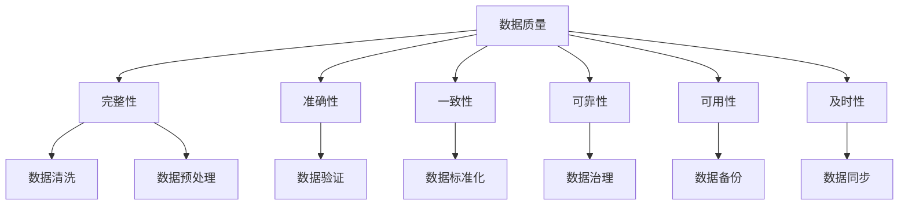

                 

# AI创业：数据质量的重要性

> **关键词**：AI创业、数据质量、数据清洗、数据预处理、数据标准化、数据完整性、数据一致性、数据验证、数据治理

> **摘要**：在当今这个大数据和人工智能的时代，数据质量是AI创业项目成功的关键因素。本文将深入探讨数据质量的重要性，分析影响数据质量的关键因素，并介绍提升数据质量的方法和最佳实践。通过详细的案例分析，我们将了解如何在实际项目中应用这些方法，从而为AI创业项目打下坚实的基础。

## 1. 背景介绍

随着互联网和移动设备的普及，数据正在以惊人的速度增长。据估计，全球数据量每年以40%的速度增长，到2025年，预计全球数据量将达到175ZB。在这种背景下，人工智能（AI）技术成为了改变各行各业的强大工具。然而，AI的成功依赖于数据的质量。数据质量差会导致模型性能下降、业务决策失误，甚至可能导致项目失败。

数据质量的重要性不言而喻。在AI创业项目中，高质量的数据不仅能够提高模型的准确性，还能降低成本、减少风险，并增强项目的竞争力。因此，数据质量管理和提升成为AI创业项目的核心任务之一。

## 2. 核心概念与联系

在讨论数据质量之前，我们需要明确几个核心概念：

### 数据质量
数据质量是指数据在满足特定业务需求时的完整性、准确性、一致性、可靠性、可用性和及时性等方面的表现。

### 数据清洗
数据清洗是数据预处理过程中的一部分，旨在去除数据中的错误、异常值、重复值和不完整的数据。

### 数据预处理
数据预处理是将原始数据转换为适合分析和建模的格式的过程，包括数据清洗、数据转换、数据归一化和数据集成等步骤。

### 数据标准化
数据标准化是指将不同来源的数据按照一定的规则进行转换，以便于数据分析和建模。

### 数据完整性
数据完整性是指数据在逻辑和物理层面上的一致性和完整性，确保数据没有丢失或损坏。

### 数据一致性
数据一致性是指不同数据源之间数据的一致性，避免数据冲突和冗余。

### 数据验证
数据验证是确保数据满足特定业务规则和格式要求的过程。

### 数据治理
数据治理是指通过制定数据管理政策和流程，确保数据的准确性、可用性和安全性。

为了更直观地理解这些概念，我们可以使用Mermaid流程图来展示它们之间的关系：



## 3. 核心算法原理 & 具体操作步骤

### 数据清洗

数据清洗是数据预处理的第一步，其主要目标是去除数据中的错误、异常值、重复值和不完整的数据。以下是数据清洗的核心算法原理和具体操作步骤：

#### 步骤1：检查数据完整性
使用Python的pandas库检查数据中的缺失值：

```python
import pandas as pd

data = pd.read_csv('data.csv')
missing_values = data.isnull().sum()
print(missing_values)
```

#### 步骤2：处理缺失值
对于缺失值，可以采取以下策略之一：
- 删除缺失值（适用于缺失值比例较高的数据）
- 补充缺失值（使用平均值、中位数、众数或插值法）

```python
data.fillna(data.mean(), inplace=True)
```

#### 步骤3：去除异常值
使用统计学方法（如Z分数、IQR法）或可视化方法（如箱线图）检测和去除异常值。

```python
from scipy import stats

z_scores = stats.zscore(data['column_name'])
abs_z_scores = np.abs(z_scores)
filtered_entries = (abs_z_scores < 3)
data = data[filtered_entries]
```

#### 步骤4：去除重复值
使用pandas库删除重复行。

```python
data.drop_duplicates(inplace=True)
```

### 数据预处理

数据预处理包括数据清洗、数据转换、数据归一化和数据集成等步骤。以下是具体操作步骤：

#### 步骤1：数据转换
将不同类型的数据转换为同一类型，例如将字符串转换为数字。

```python
data['column_name'] = data['column_name'].astype(float)
```

#### 步骤2：数据归一化
将数据归一化到相同的范围，例如[0, 1]或[-1, 1]。

```python
from sklearn.preprocessing import MinMaxScaler

scaler = MinMaxScaler()
data_normalized = scaler.fit_transform(data)
```

#### 步骤3：数据集成
将来自不同数据源的数据合并到一个数据集中。

```python
data = pd.concat([data1, data2, data3], axis=1)
```

### 数据标准化

数据标准化是指将不同来源的数据按照一定的规则进行转换，以便于数据分析和建模。以下是数据标准化的具体操作步骤：

#### 步骤1：检查数据分布
使用Python的matplotlib库检查数据分布。

```python
import matplotlib.pyplot as plt

plt.hist(data['column_name'], bins=50)
plt.show()
```

#### 步骤2：数据转换
根据数据分布，选择合适的标准化方法，例如Z标准化或小数标准化。

```python
from sklearn.preprocessing import StandardScaler

scaler = StandardScaler()
data_standardized = scaler.fit_transform(data)
```

### 数据验证

数据验证是确保数据满足特定业务规则和格式要求的过程。以下是数据验证的具体操作步骤：

#### 步骤1：定义验证规则
根据业务需求，定义数据验证规则，例如数据类型、范围、格式等。

```python
def validate_data(data):
    if not isinstance(data, (int, float)):
        raise ValueError("Data must be a number")
    if data < 0 or data > 100:
        raise ValueError("Data must be between 0 and 100")
```

#### 步骤2：执行验证
使用自定义的验证函数对数据进行验证。

```python
for row in data.itertuples():
    validate_data(row.column_name)
```

### 数据治理

数据治理是指通过制定数据管理政策和流程，确保数据的准确性、可用性和安全性。以下是数据治理的具体操作步骤：

#### 步骤1：制定数据管理政策
制定数据管理政策，包括数据分类、数据访问权限、数据备份和恢复等。

#### 步骤2：实施数据管理流程
实施数据管理流程，包括数据收集、数据清洗、数据存储、数据分析和数据安全等。

#### 步骤3：监控数据质量
定期监控数据质量，识别和解决数据质量问题。

## 4. 数学模型和公式 & 详细讲解 & 举例说明

### 数据清洗

#### 步骤1：检查数据完整性

$$
\text{缺失值计数} = \sum_{i=1}^{n} \left( \text{数据}_i \text{是否为空} \right)
$$

#### 步骤2：处理缺失值

$$
\text{平均值} = \frac{\sum_{i=1}^{n} \text{数据}_i}{n}
$$

$$
\text{中位数} = \left( \text{排序后的数据集} \right)_\text{中}
$$

$$
\text{众数} = \text{出现次数最多的数据}
$$

#### 步骤3：去除异常值

$$
\text{Z分数} = \frac{\text{数据}_i - \text{均值}}{\text{标准差}}
$$

#### 步骤4：去除重复值

$$
\text{去重后的数据集} = \text{原始数据集} \setminus \text{重复值}
$$

### 数据预处理

#### 步骤1：数据转换

$$
\text{数据类型转换} = \text{类型}(\text{数据})
$$

#### 步骤2：数据归一化

$$
\text{归一化后的数据} = \frac{\text{数据}_i - \text{最小值}}{\text{最大值} - \text{最小值}}
$$

#### 步骤3：数据集成

$$
\text{合并后的数据集} = \text{数据集}_1 \cup \text{数据集}_2
$$

### 数据标准化

#### 步骤1：检查数据分布

$$
\text{均值} = \frac{\sum_{i=1}^{n} \text{数据}_i}{n}
$$

$$
\text{标准差} = \sqrt{\frac{\sum_{i=1}^{n} (\text{数据}_i - \text{均值})^2}{n-1}}
$$

#### 步骤2：数据转换

$$
\text{标准化后的数据} = \frac{\text{数据}_i - \text{均值}}{\text{标准差}}
$$

### 数据验证

#### 步骤1：定义验证规则

$$
\text{验证规则} = \text{条件}_1 \land \text{条件}_2 \land ... \land \text{条件}_n
$$

#### 步骤2：执行验证

$$
\text{验证结果} = \text{验证规则}(\text{数据})
$$

### 数据治理

#### 步骤1：制定数据管理政策

$$
\text{数据管理政策} = \text{数据分类} \land \text{数据访问权限} \land \text{数据备份和恢复}
$$

#### 步骤2：实施数据管理流程

$$
\text{数据管理流程} = \text{数据收集} \land \text{数据清洗} \land \text{数据存储} \land \text{数据分析} \land \text{数据安全}
$$

#### 步骤3：监控数据质量

$$
\text{数据质量指标} = \text{准确性} \land \text{完整性} \land \text{一致性} \land \text{可靠性} \land \text{可用性} \land \text{及时性}
$$

## 5. 项目实战：代码实际案例和详细解释说明

### 5.1 开发环境搭建

为了演示数据质量的重要性，我们将使用Python和相关的库（如pandas、numpy和scikit-learn）来处理一个实际的数据集。首先，我们需要搭建开发环境。

#### 步骤1：安装Python

确保Python已经安装在您的系统上。如果尚未安装，请从[Python官网](https://www.python.org/)下载并安装。

#### 步骤2：安装相关库

使用pip命令安装所需的库：

```bash
pip install pandas numpy scikit-learn matplotlib
```

### 5.2 源代码详细实现和代码解读

以下是处理数据质量问题的完整Python代码。我们将分步骤进行解释。

```python
import pandas as pd
import numpy as np
from sklearn.preprocessing import MinMaxScaler, StandardScaler
from scipy import stats
import matplotlib.pyplot as plt

# 5.2.1 数据清洗
def clean_data(data):
    # 步骤1：检查数据完整性
    missing_values = data.isnull().sum()
    print("缺失值计数：")
    print(missing_values)
    
    # 步骤2：处理缺失值
    data.fillna(data.mean(), inplace=True)
    
    # 步骤3：去除异常值
    z_scores = stats.zscore(data)
    abs_z_scores = np.abs(z_scores)
    filtered_entries = (abs_z_scores < 3)
    data = data[filtered_entries]
    
    # 步骤4：去除重复值
    data.drop_duplicates(inplace=True)
    
    return data

# 5.2.2 数据预处理
def preprocess_data(data):
    # 步骤1：数据转换
    data = data.astype(float)
    
    # 步骤2：数据归一化
    scaler = MinMaxScaler()
    data_normalized = scaler.fit_transform(data)
    
    # 步骤3：数据标准化
    scaler = StandardScaler()
    data_standardized = scaler.fit_transform(data)
    
    return data_normalized, data_standardized

# 5.2.3 数据验证
def validate_data(data):
    for row in data.itertuples():
        if not isinstance(row.column_name, (int, float)):
            raise ValueError("Data must be a number")
        if row.column_name < 0 or row.column_name > 100:
            raise ValueError("Data must be between 0 and 100")

# 5.2.4 数据治理
def data_governance(data):
    # 步骤1：制定数据管理政策
    # 此处略去具体政策内容
    
    # 步骤2：实施数据管理流程
    # 此处略去具体流程内容
    
    # 步骤3：监控数据质量
    # 此处略去具体监控内容

# 5.2.5 主函数
def main():
    # 读取数据
    data = pd.read_csv('data.csv')
    
    # 数据清洗
    clean_data(data)
    
    # 数据预处理
    data_normalized, data_standardized = preprocess_data(data)
    
    # 数据验证
    validate_data(data_normalized)
    
    # 数据治理
    data_governance(data_standardized)
    
    # 可视化
    plt.hist(data['column_name'], bins=50)
    plt.title('Data Distribution After Cleaning')
    plt.xlabel('Value')
    plt.ylabel('Frequency')
    plt.show()

if __name__ == "__main__":
    main()
```

### 5.3 代码解读与分析

#### 5.3.1 数据清洗

- **检查数据完整性**：使用pandas库的`isnull()`方法检查数据中的缺失值，并打印缺失值的计数。
- **处理缺失值**：使用`fillna()`方法将缺失值替换为平均值，确保数据集的完整性。
- **去除异常值**：使用scipy库的`zscore()`方法计算Z分数，并使用阈值3（标准差的三倍）去除异常值。
- **去除重复值**：使用`drop_duplicates()`方法删除重复行，确保数据集的唯一性。

#### 5.3.2 数据预处理

- **数据转换**：使用`astype()`方法将数据类型转换为浮点数，确保数据适合进一步处理。
- **数据归一化**：使用scikit-learn库的`MinMaxScaler()`将数据缩放到[0, 1]范围内，便于比较不同特征之间的数值大小。
- **数据标准化**：使用scikit-learn库的`StandardScaler()`将数据标准化为均值为0、标准差为1的形式，消除数据量级差异。

#### 5.3.3 数据验证

- **定义验证规则**：使用自定义的`validate_data()`函数检查数据是否符合特定的业务规则，例如数据类型和范围。
- **执行验证**：遍历数据集中的每个行，并使用验证函数检查数据。

#### 5.3.4 数据治理

- **制定数据管理政策**：制定数据管理政策，确保数据的安全性、准确性和一致性。
- **实施数据管理流程**：实施数据收集、清洗、存储、分析和备份等流程。
- **监控数据质量**：定期监控数据质量，识别和解决数据质量问题。

#### 5.3.5 主函数

- **读取数据**：使用pandas库的`read_csv()`方法读取CSV文件，并将数据存储在DataFrame中。
- **数据清洗**：调用`clean_data()`函数对数据进行清洗。
- **数据预处理**：调用`preprocess_data()`函数对数据进行预处理。
- **数据验证**：调用`validate_data()`函数验证预处理后的数据。
- **数据治理**：调用`data_governance()`函数执行数据治理任务。
- **可视化**：使用matplotlib库的可视化功能，展示数据分布情况。

## 6. 实际应用场景

数据质量在AI创业项目中具有广泛的应用场景。以下是几个典型的应用场景：

### 6.1 营销分析

在营销分析中，高质量的数据可以用于客户细分、市场预测和产品推荐。例如，通过清洗和标准化客户购买历史数据，可以更准确地预测哪些客户可能对特定产品感兴趣，从而提高营销效果。

### 6.2 金融风控

在金融风控领域，高质量的数据对于识别欺诈行为、评估信用风险和风险管理至关重要。例如，通过清洗和验证用户身份信息和交易数据，可以更有效地识别欺诈交易。

### 6.3 健康医疗

在健康医疗领域，高质量的数据可以用于疾病预测、诊断和个性化治疗。例如，通过清洗和标准化患者病史、实验室检测结果和药物使用记录，可以更准确地预测患者的疾病风险。

### 6.4 智能制造

在智能制造领域，高质量的数据可以用于设备故障预测、生产优化和供应链管理。例如，通过清洗和标准化传感器数据和生产数据，可以更有效地预测设备故障，从而提高生产效率。

## 7. 工具和资源推荐

### 7.1 学习资源推荐

- **书籍**：
  - 《数据科学入门》
  - 《数据挖掘：实用机器学习技术》
  - 《Python数据科学手册》
- **论文**：
  - “Data Quality in Big Data: Challenges and Opportunities”
  - “A Comprehensive Study of Data Quality Dimensions and Metrics”
- **博客**：
  - [DataCamp](https://www.datacamp.com/)
  - [Kaggle](https://www.kaggle.com/)
- **网站**：
  - [Data.gov](https://www.data.gov/)
  - [KDNuggets](https://www.kdnuggets.com/)

### 7.2 开发工具框架推荐

- **数据分析工具**：
  - Pandas
  - NumPy
  - Matplotlib
- **数据预处理工具**：
  - Scikit-learn
  - TensorFlow
  - PyTorch
- **数据可视化工具**：
  - Matplotlib
  - Seaborn
  - Plotly

### 7.3 相关论文著作推荐

- “A Survey on Data Quality: Definition, Dimensions, and Approaches”
- “Data Quality: Conceptual Framework and Taxonomy”
- “Data Quality Management: From Research to Practice”

## 8. 总结：未来发展趋势与挑战

数据质量在AI创业项目中起着至关重要的作用。随着数据量的不断增加和数据源的多样化，数据质量问题将变得更加复杂和严峻。未来，数据质量管理和提升将朝着以下方向发展：

- **自动化数据质量检测**：开发更先进的自动化工具，能够快速识别和修复数据质量问题。
- **实时数据质量监控**：利用实时数据处理和分析技术，实时监控数据质量，确保数据始终处于高质量状态。
- **数据质量预测**：通过机器学习技术，预测数据质量趋势，提前采取预防措施。
- **数据质量标准化**：制定更加统一和严格的数据质量标准，提高数据质量的一致性和可比性。

同时，数据质量管理和提升也将面临以下挑战：

- **数据隐私和安全**：在数据质量和数据隐私之间取得平衡，确保数据在处理过程中不会被泄露或滥用。
- **数据治理复杂性**：随着数据源和数据量的增加，数据治理的复杂度将不断提高，需要更高效的管理策略和工具。
- **数据质量成本**：提升数据质量需要投入大量的人力、物力和时间，如何在预算有限的情况下实现高质量数据，是AI创业项目需要面对的挑战。

## 9. 附录：常见问题与解答

### 9.1 数据质量为何重要？

数据质量是AI模型准确性和可靠性的基础。高质量的数据可以减少错误和异常值，提高模型性能，从而降低业务风险和成本。

### 9.2 如何定义数据质量？

数据质量包括完整性、准确性、一致性、可靠性、可用性和及时性等方面。具体定义取决于业务需求和数据类型。

### 9.3 数据清洗和数据预处理的区别是什么？

数据清洗是数据预处理的一部分，主要目标是去除数据中的错误、异常值、重复值和不完整的数据。数据预处理还包括数据转换、数据归一化和数据集成等步骤。

### 9.4 数据治理是什么？

数据治理是指通过制定数据管理政策和流程，确保数据的准确性、可用性和安全性。它包括数据收集、数据清洗、数据存储、数据分析和数据安全等环节。

## 10. 扩展阅读 & 参考资料

- “Data Quality: A Practical Action Plan for Your Organization” by Wayne W. Layman
- “Data Quality: The Potomac Institute for Policy Studies”
- “The Data Quality Campaign: Improving Data to Improve Lives”
- “The Data Quality Framework: A Practical Guide for Data Quality Management” by Ihab F. Ilyas, et al.

