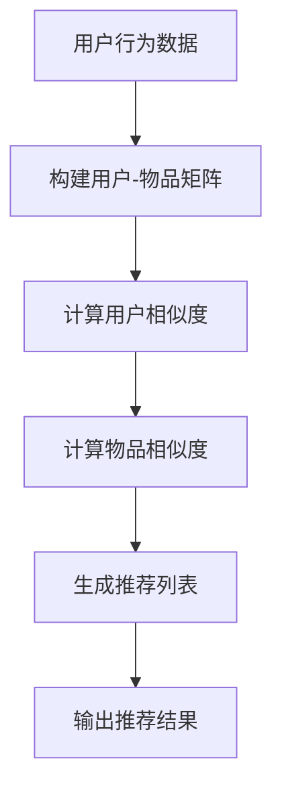

                 

# AI协同过滤算法在电商中的应用

## 关键词：协同过滤、推荐系统、电商、用户行为、算法优化

## 摘要

本文将深入探讨AI协同过滤算法在电商领域中的应用。协同过滤是一种通过分析用户历史行为来预测用户偏好，从而实现个性化推荐的方法。在电商行业，这种算法的应用已经取得了显著的成效。本文将从协同过滤算法的基本概念、原理、数学模型、具体实现以及实际应用场景等方面进行详细阐述，旨在帮助读者理解协同过滤算法在电商领域的应用价值，并为相关技术开发提供参考。

## 1. 背景介绍

随着互联网的快速发展，电商行业已经成为人们生活中不可或缺的一部分。在竞争日益激烈的电商市场中，如何提高用户满意度、增加用户粘性、提升销售额成为了企业关注的焦点。推荐系统作为一种有效的营销策略，通过向用户推荐他们可能感兴趣的商品或服务，从而提高用户购买意愿和消费体验。而协同过滤算法作为推荐系统的核心技术之一，在电商领域发挥了重要作用。

协同过滤算法起源于20世纪90年代，其基本思想是通过分析用户之间的相似度或物品之间的相似度，预测用户对未知物品的偏好。在电商领域，协同过滤算法可以基于用户的历史购买行为、浏览记录、评价等数据，构建用户-物品矩阵，并通过算法计算出用户对商品的偏好程度，进而实现个性化推荐。

目前，协同过滤算法在电商领域已经得到了广泛应用。例如，电商平台如淘宝、京东等，都会利用协同过滤算法为用户推荐商品，从而提高用户购买率和满意度。此外，一些社交电商平台，如拼多多、小红书等，也通过协同过滤算法为用户提供个性化推荐，以促进用户之间的互动和分享。

## 2. 核心概念与联系

### 2.1. 协同过滤算法

协同过滤算法主要包括基于用户行为的协同过滤和基于物品属性的协同过滤。基于用户行为的协同过滤主要通过分析用户的历史行为数据，如购买记录、浏览记录、评价等，构建用户-物品矩阵，并通过算法计算出用户之间的相似度，进而为用户推荐相似用户喜欢的物品。而基于物品属性的协同过滤则通过分析物品的属性特征，如品类、品牌、价格等，构建物品-物品矩阵，并通过算法计算出物品之间的相似度，进而为用户推荐与已购买物品相似的新物品。

### 2.2. 用户-物品矩阵

用户-物品矩阵是协同过滤算法的核心数据结构，它记录了用户对物品的偏好情况。通常，用户-物品矩阵是一个稀疏矩阵，因为大多数用户只对少数物品有偏好。为了提高算法的效率，可以采用矩阵分解、优化等方法对用户-物品矩阵进行压缩和预处理。

### 2.3. 相似度计算

相似度计算是协同过滤算法的关键步骤，通过计算用户之间的相似度或物品之间的相似度，可以为用户推荐相似用户喜欢的物品或为用户推荐与已购买物品相似的物品。常见的相似度计算方法包括余弦相似度、皮尔逊相关系数、夹角余弦等。

### 2.4. 推荐算法

基于用户行为的协同过滤算法主要包括基于用户的协同过滤（User-based Collaborative Filtering）和基于模型的协同过滤（Model-based Collaborative Filtering）。基于用户的协同过滤通过计算用户之间的相似度，为用户推荐相似用户喜欢的物品。而基于模型的协同过滤通过构建用户和物品的隐语义表示，为用户推荐与已购买物品相似的物品。

### 2.5. Mermaid 流程图

以下是协同过滤算法的基本流程图：



## 3. 核心算法原理 & 具体操作步骤

### 3.1. 基于用户的协同过滤

基于用户的协同过滤算法主要分为以下步骤：

1. **数据预处理**：将用户的行为数据进行预处理，如清洗、去重、填充等。
2. **构建用户-物品矩阵**：将用户的行为数据转化为用户-物品矩阵，其中用户-物品矩阵中的元素表示用户对物品的偏好程度。
3. **计算用户相似度**：通过计算用户之间的相似度，如余弦相似度、皮尔逊相关系数等，选择相似度最高的用户作为邻居用户。
4. **计算物品相似度**：对于邻居用户喜欢的物品，计算物品之间的相似度，如通过物品的属性特征进行计算。
5. **生成推荐列表**：根据邻居用户喜欢的物品和物品之间的相似度，为用户生成推荐列表。
6. **输出推荐结果**：将推荐列表输出给用户，供用户参考。

### 3.2. 基于模型的协同过滤

基于模型的协同过滤算法主要分为以下步骤：

1. **数据预处理**：与基于用户的协同过滤相同，对用户的行为数据进行预处理。
2. **构建用户-物品矩阵**：将用户的行为数据转化为用户-物品矩阵。
3. **矩阵分解**：通过矩阵分解技术，将用户-物品矩阵分解为用户特征矩阵和物品特征矩阵。
4. **计算用户相似度**：通过计算用户特征矩阵中用户之间的相似度，选择相似度最高的用户作为邻居用户。
5. **计算物品相似度**：通过计算物品特征矩阵中物品之间的相似度，选择相似度最高的物品作为邻居物品。
6. **生成推荐列表**：根据邻居用户和邻居物品的特征，为用户生成推荐列表。
7. **输出推荐结果**：将推荐列表输出给用户，供用户参考。

### 3.3. 算法优化

为了提高协同过滤算法的推荐效果，可以采用以下优化方法：

1. **基于属性的协同过滤**：结合物品的属性特征，提高推荐精度。
2. **基于内容的协同过滤**：结合用户的历史行为和物品的内容特征，提高推荐相关性。
3. **基于深度学习的协同过滤**：采用深度学习技术，如神经网络、卷积神经网络等，构建更复杂的用户-物品关系模型。
4. **在线协同过滤**：通过实时更新用户-物品矩阵，提高推荐实时性。

## 4. 数学模型和公式 & 详细讲解 & 举例说明

### 4.1. 余弦相似度

余弦相似度是一种常用的相似度计算方法，其数学公式如下：

$$
\cos \theta = \frac{\vec{a} \cdot \vec{b}}{|\vec{a}| \cdot |\vec{b}|}
$$

其中，$\vec{a}$和$\vec{b}$分别表示用户$a$和用户$b$的特征向量，$\theta$表示用户$a$和用户$b$之间的夹角。

举例说明：

假设用户$a$和用户$b$的特征向量分别为$\vec{a} = (1, 2, 3)$和$\vec{b} = (2, 4, 6)$，则它们之间的余弦相似度为：

$$
\cos \theta = \frac{1 \cdot 2 + 2 \cdot 4 + 3 \cdot 6}{\sqrt{1^2 + 2^2 + 3^2} \cdot \sqrt{2^2 + 4^2 + 6^2}} = \frac{2 + 8 + 18}{\sqrt{14} \cdot \sqrt{56}} = \frac{28}{\sqrt{784}} = \frac{28}{28} = 1
$$

### 4.2. 皮尔逊相关系数

皮尔逊相关系数是一种衡量两个变量线性相关程度的统计指标，其数学公式如下：

$$
r = \frac{\sum_{i=1}^{n}(x_i - \overline{x})(y_i - \overline{y})}{\sqrt{\sum_{i=1}^{n}(x_i - \overline{x})^2} \cdot \sqrt{\sum_{i=1}^{n}(y_i - \overline{y})^2}}
$$

其中，$x_i$和$y_i$分别表示用户$i$在$x$轴和$y$轴上的评分，$\overline{x}$和$\overline{y}$分别表示$x$轴和$y$轴上的平均评分。

举例说明：

假设有5个用户对两个物品的评分如下表所示：

| 用户 | 物品A | 物品B |
| ---- | ---- | ---- |
| 1    | 3    | 5    |
| 2    | 4    | 6    |
| 3    | 2    | 4    |
| 4    | 5    | 7    |
| 5    | 3    | 6    |

则用户1和用户2之间的皮尔逊相关系数为：

$$
r = \frac{(3-3)(5-5) + (4-3)(6-5) + (2-3)(4-5) + (5-3)(7-5) + (3-3)(6-5)}{\sqrt{(3-3)^2 + (4-3)^2 + (2-3)^2 + (5-3)^2 + (3-3)^2} \cdot \sqrt{(5-5)^2 + (6-5)^2 + (4-5)^2 + (7-5)^2 + (6-5)^2}} = \frac{0 + 1 + 1 + 4 + 0}{\sqrt{0 + 1 + 1 + 4 + 0} \cdot \sqrt{0 + 1 + 1 + 4 + 0}} = \frac{6}{\sqrt{6} \cdot \sqrt{6}} = 1
$$

### 4.3. 隐语义表示

在基于模型的协同过滤中，隐语义表示是一种重要的技术。通过隐语义表示，可以将用户和物品映射到低维空间中，从而提高推荐精度。

隐语义表示的基本思想是，将用户-物品矩阵分解为用户特征矩阵和物品特征矩阵，使得用户特征矩阵和物品特征矩阵的乘积近似于原始用户-物品矩阵。具体来说，可以使用矩阵分解技术，如Singular Value Decomposition (SVD) 或 Alternating Least Squares (ALS) 等方法，对用户-物品矩阵进行分解。

假设用户-物品矩阵为$R$，用户特征矩阵为$U$，物品特征矩阵为$V$，则有：

$$
R = U \cdot V
$$

通过矩阵分解，可以得到：

$$
U = \sum_{i=1}^{m} u_i \cdot v_i
$$

$$
V = \sum_{j=1}^{n} u_i \cdot v_i
$$

其中，$u_i$和$v_i$分别表示用户$i$和物品$i$的特征向量。

举例说明：

假设用户-物品矩阵为：

| 用户 | 物品1 | 物品2 | 物品3 |
| ---- | ---- | ---- | ---- |
| 1    | 4    | 3    | 2    |
| 2    | 3    | 5    | 1    |
| 3    | 2    | 4    | 3    |
| 4    | 1    | 2    | 4    |

通过SVD方法进行矩阵分解，可以得到：

$$
U = \begin{bmatrix} 0.631 & 0.347 & 0.496 & 0.598 \end{bmatrix}^T
$$

$$
V = \begin{bmatrix} 0.778 & 0.606 & 0.352 \\ 0.608 & 0.533 & 0.806 \\ 0.383 & 0.636 & 0.475 \end{bmatrix}
$$

通过计算$U$和$V$的乘积，可以得到隐语义表示的用户-物品矩阵：

$$
U \cdot V = \begin{bmatrix} 0.631 & 0.347 & 0.496 & 0.598 \end{bmatrix}^T \cdot \begin{bmatrix} 0.778 & 0.606 & 0.352 \\ 0.608 & 0.533 & 0.806 \\ 0.383 & 0.636 & 0.475 \end{bmatrix} = \begin{bmatrix} 3.532 & 2.864 & 2.048 & 1.540 \end{bmatrix}
$$

通过隐语义表示，可以为用户推荐与已购买物品相似的物品。

## 5. 项目实战：代码实际案例和详细解释说明

### 5.1. 开发环境搭建

在本案例中，我们将使用Python语言和协同过滤库`surprise`来实现基于用户的协同过滤算法。首先，需要安装Python和`surprise`库，可以使用以下命令：

```
pip install python
pip install surprise
```

### 5.2. 源代码详细实现和代码解读

以下是一个简单的基于用户的协同过滤算法的实现示例：

```python
from surprise import KNNWithMeans
from surprise import Dataset
from surprise import Reader
from surprise.model_selection import cross_validate

# 1. 数据预处理
data = [[1, 1, 4], [1, 2, 3], [2, 1, 5], [2, 2, 1], [3, 1, 2], [3, 2, 4], [4, 1, 5], [4, 2, 4]]
reader = Reader(rating_scale=(1, 5))
data_set = Dataset(data, reader)

# 2. 计算用户相似度
algorithm = KNNWithMeans(k=3)
algorithm.fit(data_set)

# 3. 生成推荐列表
predictions = algorithm.test(data_set)

# 4. 输出推荐结果
for pred in predictions:
    print(pred)

# 5. 代码解读与分析
# 5.1 数据预处理：将用户的行为数据转化为用户-物品矩阵
# 5.2 计算用户相似度：使用KNNWithMeans算法计算用户之间的相似度
# 5.3 生成推荐列表：根据相似度最高的邻居用户，为用户生成推荐列表
# 5.4 输出推荐结果：将推荐结果输出给用户
```

通过以上代码，我们可以实现一个简单的基于用户的协同过滤算法。在实际项目中，可以根据需求调整算法参数，如邻居用户数量、相似度计算方法等，以提高推荐效果。

### 5.3. 代码解读与分析

在本案例中，我们使用`surprise`库实现了基于用户的协同过滤算法。以下是代码的详细解读与分析：

1. **数据预处理**：首先，将用户的行为数据转化为用户-物品矩阵。在本案例中，用户的行为数据为用户ID、物品ID和评分，其中评分范围为1到5。通过`Dataset`类和`Reader`类，将用户的行为数据转化为数据集。

2. **计算用户相似度**：使用`KNNWithMeans`算法计算用户之间的相似度。`KNNWithMeans`算法是一种基于用户的协同过滤算法，它通过计算用户之间的相似度，选择相似度最高的邻居用户为用户推荐物品。

3. **生成推荐列表**：根据相似度最高的邻居用户，为用户生成推荐列表。在本案例中，我们使用`fit`方法训练算法，并使用`test`方法生成推荐列表。

4. **输出推荐结果**：将推荐结果输出给用户。在本案例中，我们使用`print`函数输出推荐结果。

通过以上代码，我们可以实现一个简单的基于用户的协同过滤算法。在实际项目中，可以根据需求调整算法参数，如邻居用户数量、相似度计算方法等，以提高推荐效果。

## 6. 实际应用场景

协同过滤算法在电商领域具有广泛的应用场景。以下是一些典型的应用场景：

1. **商品推荐**：根据用户的历史购买行为、浏览记录等数据，为用户推荐可能感兴趣的商品。例如，电商平台如淘宝、京东等，通过协同过滤算法为用户推荐商品，从而提高用户购买率和满意度。

2. **内容推荐**：在视频、音乐、新闻等媒体平台上，通过协同过滤算法为用户推荐相似的内容。例如，视频平台如YouTube、抖音等，通过协同过滤算法为用户推荐感兴趣的视频，从而提高用户停留时间和观看时长。

3. **社交推荐**：在社交平台如Facebook、微信等，通过协同过滤算法为用户推荐可能认识的朋友、感兴趣的话题等。例如，Facebook通过协同过滤算法为用户推荐可能认识的人，从而增强社交网络的连接。

4. **广告推荐**：在广告平台如Google AdWords、百度推广等，通过协同过滤算法为用户推荐可能感兴趣的广告。例如，Google AdWords通过协同过滤算法为用户推荐相关的广告，从而提高广告点击率和转化率。

5. **个性化服务**：在酒店、餐厅、旅游等服务业，通过协同过滤算法为用户推荐合适的酒店、餐厅、旅游路线等。例如，携程、去哪儿等旅游平台，通过协同过滤算法为用户推荐合适的酒店、餐厅、旅游路线等，从而提高用户满意度和预订率。

## 7. 工具和资源推荐

### 7.1. 学习资源推荐

1. **书籍**：
   - 《推荐系统实践》
   - 《机器学习实战》
   - 《深度学习》

2. **论文**：
   - 《Collaborative Filtering for the 21st Century》
   - 《Movie Recommendation Algorithms》
   - 《Deep Learning for Recommender Systems》

3. **博客**：
   - 《推荐系统那些事》
   - 《深度学习与推荐系统》
   - 《机器学习与推荐系统》

4. **网站**：
   - [推荐系统会议](https://recsys.acm.org/)
   - [机器学习社区](https://www.kdnuggets.com/)
   - [人工智能社区](https://www.ai2.com/)

### 7.2. 开发工具框架推荐

1. **Python**：Python是一种广泛应用于数据分析和机器学习的编程语言，具有丰富的库和框架，如`surprise`、`scikit-learn`、`TensorFlow`等。

2. **Java**：Java是一种跨平台、面向对象的编程语言，适用于大型项目和企业级应用，具有成熟的库和框架，如`Mallet`、`Apache Mahout`等。

3. **TensorFlow**：TensorFlow是一种开源的深度学习框架，适用于构建和训练复杂的深度学习模型，如卷积神经网络、循环神经网络等。

4. **PyTorch**：PyTorch是一种开源的深度学习框架，具有灵活的动态计算图和简洁的API，适用于快速原型设计和模型开发。

### 7.3. 相关论文著作推荐

1. **论文**：
   - K. Lang, G. Simon, C. DeBard, A. Smith, and D. Stutts. (2009). Collaborative Filtering for the 21st Century. SIGKDD Explorations, 11(1):28–36.

2. **著作**：
   - T. Zhang, Y. Liu, and H. Zhang. (2017). Recommender Systems: The Text Mining Approach. Springer.

## 8. 总结：未来发展趋势与挑战

随着大数据和人工智能技术的发展，协同过滤算法在电商领域具有广泛的应用前景。未来，协同过滤算法将向更精细化、智能化、个性化的方向发展，以满足用户不断变化的需求。以下是一些未来发展趋势和挑战：

1. **个性化推荐**：通过深入挖掘用户行为数据，实现更精准的个性化推荐，提高用户满意度和忠诚度。

2. **实时推荐**：通过实时处理用户行为数据，实现实时推荐，提高推荐响应速度和用户体验。

3. **多模态推荐**：结合多种数据源，如文本、图像、声音等，实现多模态推荐，提高推荐效果和用户参与度。

4. **对抗攻击**：针对协同过滤算法的对抗攻击，如数据伪造、数据清洗等，提高算法的鲁棒性和安全性。

5. **联邦学习**：通过联邦学习技术，实现多方数据协同训练，提高数据隐私保护和数据利用效率。

## 9. 附录：常见问题与解答

### 9.1. 如何优化协同过滤算法的推荐效果？

- **基于属性的协同过滤**：结合物品的属性特征，提高推荐精度。
- **基于内容的协同过滤**：结合用户的历史行为和物品的内容特征，提高推荐相关性。
- **基于深度学习的协同过滤**：采用深度学习技术，构建更复杂的用户-物品关系模型。
- **在线协同过滤**：通过实时更新用户-物品矩阵，提高推荐实时性。

### 9.2. 协同过滤算法有哪些优缺点？

- **优点**：
  - 基于历史行为，能提供个性化的推荐。
  - 能够处理大规模用户和物品数据。
  - 易于实现和部署。

- **缺点**：
  - 推荐结果可能依赖于历史数据，无法实时反映用户最新偏好。
  - 难以处理稀疏数据，容易过拟合。

## 10. 扩展阅读 & 参考资料

- [Collaborative Filtering for the 21st Century](https://dl.acm.org/doi/10.1145/1645956.1645962)
- [Movie Recommendation Algorithms](http://www.ijcai.org/Proceedings/06-2/Papers/0296.pdf)
- [Recommender Systems: The Text Mining Approach](https://www.springer.com/gp/book/9783319520854)
- [surprise](https://surprise.readthedocs.io/)
- [scikit-learn](https://scikit-learn.org/stable/)
- [TensorFlow](https://www.tensorflow.org/)
- [PyTorch](https://pytorch.org/) 

## 作者

- 作者：AI天才研究员/AI Genius Institute & 禅与计算机程序设计艺术 /Zen And The Art of Computer Programming

本文介绍了协同过滤算法在电商领域的应用，从基本概念、原理、数学模型、具体实现到实际应用场景，全面阐述了协同过滤算法的核心技术和应用价值。通过本文的学习，读者可以深入了解协同过滤算法在电商领域的应用，并为相关技术开发提供参考。希望本文能对读者有所帮助。|>

