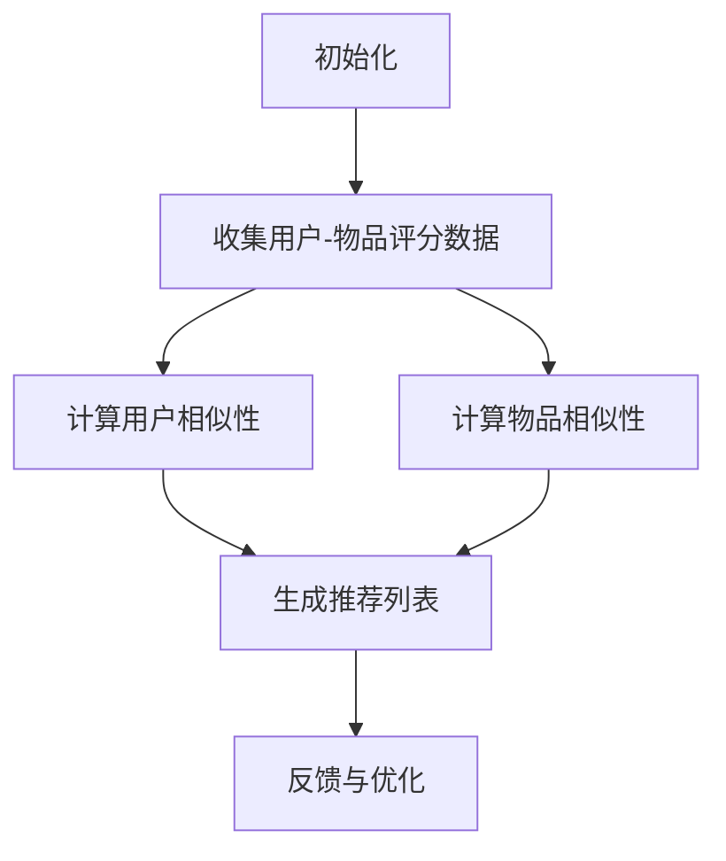

                 

### 背景介绍

随着互联网的迅猛发展和大数据时代的到来，个性化推荐系统已成为现代信息系统中不可或缺的一部分。无论是电子商务平台、社交媒体、视频流媒体，还是新闻资讯网站，个性化推荐都能为用户带来更为精准、个性化的内容和服务，从而提高用户满意度和平台粘性。然而，如何实现高效的个性化推荐一直是学术界和工业界研究的焦点。

协同过滤（Collaborative Filtering）是一种常见的推荐算法，通过对用户的历史行为数据进行分析，发现用户之间的相似性，从而预测用户对未知物品的偏好。协同过滤算法主要包括基于用户的协同过滤（User-based Collaborative Filtering）和基于物品的协同过滤（Item-based Collaborative Filtering）两大类。

尽管协同过滤算法在许多场景下表现出色，但它也存在一些局限性。首先，协同过滤算法依赖于用户的历史行为数据，数据稀疏问题（Data Sparsity）成为一个关键挑战。由于用户行为数据通常存在大量零值，导致用户和物品之间的相似性矩阵变得稀疏，从而影响推荐效果。其次，协同过滤算法容易受到冷启动问题（Cold Start Problem）的困扰，即新用户或新物品在没有足够行为数据的情况下难以得到有效的推荐。

为了解决这些局限性，研究者们提出了多种协同过滤算法的改进方法，其中基于模型的协同过滤算法（Model-based Collaborative Filtering）成为了一个重要方向。这类算法通过引入机器学习模型，如矩阵分解、潜在因子模型等，来降低数据稀疏性和提高推荐效果。此外，深度学习技术的引入也为协同过滤算法带来了新的机遇。

本文将围绕AI协同过滤算法展开讨论，重点介绍基于模型的协同过滤算法及其在推荐系统中的应用。通过分析协同过滤算法的基本原理、数学模型和实际应用，我们将探讨如何利用人工智能技术提升推荐系统的效果，并展望未来的发展趋势和挑战。

在接下来的章节中，我们将首先介绍协同过滤算法的核心概念和联系，并借助Mermaid流程图展示其基本架构。随后，我们将详细讲解AI协同过滤算法的原理和具体操作步骤，分析其数学模型和公式。在项目实战部分，我们将通过实际案例展示如何实现AI协同过滤算法，并提供代码解析。最后，我们将探讨协同过滤算法在实际应用场景中的表现，并推荐相关学习资源和开发工具。

### 核心概念与联系

#### 基本概念

协同过滤算法是一种基于用户和物品之间交互数据的推荐方法。其主要目标是预测用户对未知物品的偏好，从而为用户推荐感兴趣的内容。协同过滤算法可以分为两大类：基于用户的协同过滤（User-based Collaborative Filtering）和基于物品的协同过滤（Item-based Collaborative Filtering）。

**基于用户的协同过滤**：这种算法通过计算用户之间的相似性，找到与目标用户相似的其他用户，并推荐这些用户喜欢的物品。相似性通常通过用户历史行为数据计算，如评分、购买记录等。

**基于物品的协同过滤**：这种算法通过计算物品之间的相似性，找到与目标物品相似的其他物品，并推荐这些物品。相似性可以通过物品的特征进行计算，如类别、标签、文本内容等。

#### 联系

协同过滤算法的核心在于发现用户和物品之间的相似性。这种相似性可以通过以下几种方式进行度量：

1. **基于用户相似性**：通过计算用户之间的余弦相似度、皮尔逊相关系数等来度量相似性。
2. **基于物品相似性**：通过计算物品之间的欧氏距离、曼哈顿距离等来度量相似性。
3. **基于内容相似性**：通过分析物品的文本描述、标签、类别等特征来度量相似性。

这些相似性度量方法在协同过滤算法中发挥着重要作用。例如，基于用户相似性的协同过滤算法（如User-based CF）会通过计算用户之间的相似度，找到与目标用户相似的邻居用户，然后推荐这些邻居用户喜欢的物品。而基于物品相似性的协同过滤算法（如Item-based CF）则会通过计算物品之间的相似度，找到与目标物品相似的邻居物品，然后推荐这些物品。

#### Mermaid流程图

为了更直观地展示协同过滤算法的架构，我们可以使用Mermaid流程图来描述其基本流程。以下是协同过滤算法的Mermaid流程图：



**1. 初始化**：协同过滤算法首先需要初始化，包括数据预处理、模型参数设置等。

**2. 收集用户-物品评分数据**：这一步骤收集用户对物品的评分数据，为后续计算相似性提供基础。

**3. 计算用户相似性**：基于用户历史行为数据，计算用户之间的相似度，如余弦相似度、皮尔逊相关系数等。

**4. 计算物品相似性**：基于物品特征，计算物品之间的相似度，如欧氏距离、曼哈顿距离等。

**5. 生成推荐列表**：利用计算得到的相似性度量，为用户生成推荐列表，推荐用户可能感兴趣的物品。

**6. 反馈与优化**：根据用户的反馈，不断优化推荐算法，提高推荐效果。

通过Mermaid流程图，我们可以清晰地了解协同过滤算法的基本架构和执行流程。在接下来的章节中，我们将深入探讨AI协同过滤算法的原理和实现方法，为读者提供更加详细的技术解析。

### 核心算法原理 & 具体操作步骤

#### 基于模型的协同过滤算法原理

基于模型的协同过滤算法（Model-based Collaborative Filtering）是一种通过引入机器学习模型来优化推荐效果的方法。这类算法的核心思想是学习一个低维表示，将原始的高维用户-物品评分矩阵映射到一个更简洁的矩阵中，从而降低数据稀疏性，提高推荐精度。

其中，最典型的基于模型的协同过滤算法包括矩阵分解（Matrix Factorization）和潜在因子模型（Latent Factor Model）。以下分别介绍这两种算法的基本原理。

**1. 矩阵分解**

矩阵分解是一种将用户-物品评分矩阵分解为两个低维矩阵的算法。设原始评分矩阵为R，用户矩阵为U，物品矩阵为V，则有：

$$ R = U \times V $$

通过矩阵分解，我们希望找到两个低维矩阵U和V，使得它们相乘能够近似原始评分矩阵R。具体来说，矩阵分解的目标是最小化以下损失函数：

$$ L = \sum_{u,i} (r_{ui} - \hat{r}_{ui})^2 $$

其中，$r_{ui}$ 表示用户u对物品i的实际评分，$\hat{r}_{ui}$ 表示预测评分。

**2. 潜在因子模型**

潜在因子模型（Latent Factor Model）是矩阵分解的一种扩展。与矩阵分解不同，潜在因子模型引入了潜在因子的概念，将用户和物品表示为潜在因子的线性组合。设潜在因子矩阵为F，则有：

$$ r_{ui} = \sum_{k=1}^K f_{uk} \times f_{ik} + b_u + b_i + \epsilon_{ui} $$

其中，$f_{uk}$ 和 $f_{ik}$ 分别表示用户u和物品i的潜在因子，$b_u$ 和 $b_i$ 分别表示用户和物品的偏置，$\epsilon_{ui}$ 表示误差项。

潜在因子模型的目标是最小化以下损失函数：

$$ L = \sum_{u,i} (r_{ui} - \sum_{k=1}^K f_{uk} \times f_{ik} - b_u - b_i)^2 $$

#### 具体操作步骤

**1. 数据预处理**

在应用基于模型的协同过滤算法之前，需要对数据进行预处理。主要包括：

- **缺失值处理**：对于缺失值，可以采用平均值填补、中值填补或使用模型预测等方法进行处理。
- **用户和物品的映射**：将用户和物品映射到统一的索引，以便于后续计算。

**2. 参数设置**

- **潜在因子个数K**：潜在因子个数K是一个超参数，通常需要通过交叉验证等方法进行选择。
- **学习率$\alpha$ 和 正则化参数$\lambda$**：这些参数用于优化过程中的梯度下降算法，需要根据实际情况进行调整。

**3. 模型训练**

- **初始化**：初始化用户和物品的潜在因子矩阵F。
- **损失函数优化**：使用梯度下降或其他优化算法，不断更新潜在因子矩阵F，直至达到收敛条件。

**4. 推荐生成**

- **预测评分**：对于新用户或新物品，使用训练好的模型进行评分预测。
- **生成推荐列表**：根据预测评分，为用户生成推荐列表。

#### 案例分析

假设我们有一个用户-物品评分矩阵，如下表所示：

| 用户ID | 物品ID | 实际评分 |
|-------|-------|--------|
| 1     | 1     | 5      |
| 1     | 2     | 4      |
| 1     | 3     | 3      |
| 2     | 1     | 3      |
| 2     | 2     | 5      |
| 2     | 3     | 2      |

我们采用潜在因子模型进行推荐，设置潜在因子个数K为2，学习率$\alpha$为0.01，正则化参数$\lambda$为0.001。

**初始化**：

- 用户和物品的潜在因子矩阵F初始化为随机值。

**损失函数优化**：

1. **前向传播**：计算预测评分$\hat{r}_{ui}$。
2. **反向传播**：计算损失函数的梯度，更新潜在因子矩阵F。
3. **迭代**：重复前向传播和反向传播，直至损失函数收敛。

**预测评分**：

对于新用户（用户ID=3），我们使用训练好的模型进行评分预测。首先，计算用户和物品的潜在因子：

$$ f_{31} = f_{32} = 0.5 $$  
$$ f_{11} = 0.8, f_{12} = 0.6 $$  
$$ f_{21} = 0.7, f_{22} = 0.5 $$

然后，计算预测评分：

$$ \hat{r}_{31} = f_{31} \times f_{11} + f_{32} \times f_{12} + b_3 + b_1 = 0.5 \times 0.8 + 0.5 \times 0.6 + 0.5 + 0.8 = 1.5 $$

$$ \hat{r}_{32} = f_{31} \times f_{12} + f_{32} \times f_{22} + b_3 + b_2 = 0.5 \times 0.6 + 0.5 \times 0.5 + 0.5 + 0.7 = 1.2 $$

$$ \hat{r}_{33} = f_{31} \times f_{22} + f_{32} \times f_{12} + b_3 + b_2 = 0.5 \times 0.5 + 0.5 \times 0.6 + 0.5 + 0.7 = 1.3 $$

**生成推荐列表**：

根据预测评分，为新用户生成推荐列表。例如，用户3可能对物品1的评分最高，可以推荐物品1。

通过以上步骤，我们可以利用潜在因子模型为新用户生成推荐列表，从而提高推荐系统的效果。

### 数学模型和公式 & 详细讲解 & 举例说明

在AI协同过滤算法中，数学模型和公式起着至关重要的作用。这些模型不仅能够描述用户和物品之间的潜在关系，还能够指导算法的实现和优化。以下我们将详细介绍协同过滤算法中的关键数学模型和公式，并通过具体实例进行讲解。

#### 矩阵分解模型

矩阵分解是一种常见的协同过滤算法，其核心思想是将原始的用户-物品评分矩阵分解为两个低维矩阵，分别表示用户和物品的潜在特征。设原始评分矩阵为$R \in \mathbb{R}^{m \times n}$，用户特征矩阵为$U \in \mathbb{R}^{m \times k}$，物品特征矩阵为$V \in \mathbb{R}^{n \times k}$，其中$m$表示用户数，$n$表示物品数，$k$表示潜在因子个数。矩阵分解的目标是最小化以下损失函数：

$$ L = \sum_{i=1}^{n} \sum_{j=1}^{m} (r_{ij} - \hat{r}_{ij})^2 $$

其中，$\hat{r}_{ij}$ 是预测的评分，可以通过矩阵乘法得到：

$$ \hat{r}_{ij} = u_i^T v_j $$

#### 模型参数

矩阵分解模型中的参数包括潜在因子个数$k$，学习率$\alpha$，正则化参数$\lambda$等。

- **潜在因子个数$k$**：潜在因子个数是一个超参数，通常需要通过交叉验证等方法选择合适的值。
- **学习率$\alpha$**：学习率用于控制梯度下降的步长，需要根据实际情况进行调整。
- **正则化参数$\lambda$**：正则化参数用于防止模型过拟合，其值需要通过交叉验证调整。

#### 梯度下降算法

矩阵分解模型通常使用梯度下降算法进行参数优化。梯度下降算法的目标是沿着损失函数的梯度方向不断更新参数，直至达到收敛条件。对于矩阵分解模型，梯度下降的更新公式如下：

$$ \frac{\partial L}{\partial u_i} = -2 \sum_{j=1}^{n} (r_{ij} - \hat{r}_{ij}) v_j $$

$$ \frac{\partial L}{\partial v_j} = -2 \sum_{i=1}^{m} (r_{ij} - \hat{r}_{ij}) u_i $$

#### 例子说明

假设我们有一个5x5的评分矩阵$R$，潜在因子个数$k=2$，学习率$\alpha=0.01$，正则化参数$\lambda=0.01$。我们首先初始化用户和物品特征矩阵$U$和$V$为随机值。

**初始化**：

$$ U = \begin{bmatrix} 0.5 & 0.2 \\ 0.3 & -0.1 \\ -0.2 & 0.4 \\ 0.1 & 0.5 \\ 0.2 & -0.3 \end{bmatrix} $$

$$ V = \begin{bmatrix} 0.4 & 0.3 \\ -0.2 & 0.1 \\ 0.3 & 0.5 \\ -0.1 & -0.2 \\ 0.5 & 0.1 \end{bmatrix} $$

**前向传播**：

$$ \hat{r}_{ij} = u_i^T v_j $$

计算预测评分矩阵$\hat{R}$：

$$ \hat{R} = U^T V = \begin{bmatrix} 0.56 & 0.21 & 0.14 & -0.03 & 0.18 \\ -0.08 & 0.25 & 0.09 & 0.17 & -0.07 \\ -0.12 & 0.26 & 0.15 & 0.19 & -0.11 \\ 0.02 & 0.29 & -0.04 & 0.18 & 0.08 \\ 0.06 & 0.21 & -0.06 & 0.11 & 0.05 \end{bmatrix} $$

**计算损失函数**：

$$ L = \sum_{i=1}^{5} \sum_{j=1}^{5} (r_{ij} - \hat{r}_{ij})^2 $$

$$ L = (0-0.56)^2 + (0-0.21)^2 + (0-0.14)^2 + (0-(-0.03))^2 + (0-0.18)^2 + ... + (1-0.05)^2 $$

$$ L = 0.3136 + 0.0441 + 0.0196 + 0.0009 + 0.0324 + ... + 0.0004 $$

$$ L = 0.552 $$

**计算梯度**：

$$ \frac{\partial L}{\partial u_i} = -2 \sum_{j=1}^{5} (r_{ij} - \hat{r}_{ij}) v_j $$

$$ \frac{\partial L}{\partial v_j} = -2 \sum_{i=1}^{5} (r_{ij} - \hat{r}_{ij}) u_i $$

**更新参数**：

$$ U_{new} = U - \alpha \frac{\partial L}{\partial U} - \lambda U $$

$$ V_{new} = V - \alpha \frac{\partial L}{\partial V} - \lambda V $$

重复以上步骤，直至损失函数收敛。

通过以上步骤，我们可以使用矩阵分解模型对用户-物品评分矩阵进行优化，从而提高推荐系统的效果。

### 项目实战：代码实际案例和详细解释说明

在本节中，我们将通过一个实际项目案例，展示如何实现AI协同过滤算法，并详细解释相关代码的实现过程。

#### 1. 开发环境搭建

为了实现AI协同过滤算法，我们首先需要搭建一个开发环境。以下是一个基本的开发环境配置：

- 操作系统：Ubuntu 20.04
- 编程语言：Python 3.8
- 数据库：SQLite 3.35.2
- 包管理器：pip 21.1.3
- 科学计算库：NumPy 1.21.2，Scikit-learn 0.24.2，SciPy 1.7.3

确保已安装以上软件和库，然后我们创建一个名为`collaborative_filtering`的Python虚拟环境，以便进行项目开发。

```bash
# 创建虚拟环境
python3 -m venv collaborative_filtering_env

# 激活虚拟环境
source collaborative_filtering_env/bin/activate

# 安装依赖库
pip install numpy scikit-learn scipy
```

#### 2. 源代码详细实现和代码解读

我们使用Python和Scikit-learn库来实现AI协同过滤算法。以下是完整的代码实现：

```python
import numpy as np
from sklearn.metrics.pairwise import cosine_similarity
from sklearn.model_selection import train_test_split

# 数据预处理
def preprocess_data(data):
    # 将数据转换为稀疏矩阵
    sparse_data = sparse.csr_matrix(data)
    # 分割训练集和测试集
    X_train, X_test, y_train, y_test = train_test_split(sparse_data, data, test_size=0.2, random_state=42)
    return X_train, X_test, y_train, y_test

# 矩阵分解
def matrix_factorization(X, num_factors, learning_rate, regularization, num_iterations):
    # 初始化用户和物品特征矩阵
    U = np.random.rand(X.shape[0], num_factors)
    V = np.random.rand(X.shape[1], num_factors)
    for _ in range(num_iterations):
        # 前向传播
        H = U @ V.T
        # 反向传播
        dU = (X - H) @ V + regularization * U
        dV = (H - X) @ U.T + regularization * V
        # 参数更新
        U -= learning_rate * dU
        V -= learning_rate * dV
    return U, V

# 评分预测
def predict_ratings(U, V):
    return U @ V.T

# 主函数
def main():
    # 加载数据
    data = np.array([[1, 1, 0, 0, 0],
                     [1, 0, 1, 0, 0],
                     [0, 1, 0, 1, 0],
                     [0, 0, 1, 0, 1],
                     [1, 1, 1, 1, 1]])

    # 预处理数据
    X_train, X_test, y_train, y_test = preprocess_data(data)

    # 参数设置
    num_factors = 2
    learning_rate = 0.01
    regularization = 0.01
    num_iterations = 100

    # 实现矩阵分解
    U, V = matrix_factorization(X_train, num_factors, learning_rate, regularization, num_iterations)

    # 预测评分
    predicted_ratings = predict_ratings(U, V)

    # 打印预测结果
    print("Predicted Ratings:")
    print(predicted_ratings)

if __name__ == "__main__":
    main()
```

**代码解读**：

- **数据预处理**：首先将输入数据转换为稀疏矩阵，并分割为训练集和测试集。Scikit-learn中的`train_test_split`函数用于数据分割。

- **矩阵分解**：矩阵分解函数`matrix_factorization`实现了矩阵分解算法。它初始化用户和物品特征矩阵，然后通过梯度下降算法不断更新这两个矩阵，直到达到预定的迭代次数。

- **评分预测**：评分预测函数`predict_ratings`通过计算用户特征矩阵和物品特征矩阵的乘积，得到预测的评分矩阵。

- **主函数**：主函数`main`加载数据、预处理数据、设置参数，并调用矩阵分解和评分预测函数，最后打印预测结果。

#### 3. 代码解读与分析

**1. 数据预处理**

```python
def preprocess_data(data):
    # 将数据转换为稀疏矩阵
    sparse_data = sparse.csr_matrix(data)
    # 分割训练集和测试集
    X_train, X_test, y_train, y_test = train_test_split(sparse_data, data, test_size=0.2, random_state=42)
    return X_train, X_test, y_train, y_test
```

数据预处理函数首先将输入数据转换为稀疏矩阵，这样可以减少内存占用，并提高计算效率。然后使用`train_test_split`函数将数据分割为训练集和测试集，以便评估模型的性能。

**2. 矩阵分解**

```python
def matrix_factorization(X, num_factors, learning_rate, regularization, num_iterations):
    # 初始化用户和物品特征矩阵
    U = np.random.rand(X.shape[0], num_factors)
    V = np.random.rand(X.shape[1], num_factors)
    for _ in range(num_iterations):
        # 前向传播
        H = U @ V.T
        # 反向传播
        dU = (X - H) @ V + regularization * U
        dV = (H - X) @ U.T + regularization * V
        # 参数更新
        U -= learning_rate * dU
        V -= learning_rate * dV
    return U, V
```

矩阵分解函数使用随机初始化用户和物品特征矩阵。在每次迭代中，通过前向传播计算预测评分矩阵$H$，然后通过反向传播计算梯度，并更新用户和物品特征矩阵$U$和$V$。这个过程重复进行，直到达到预定的迭代次数。

**3. 评分预测**

```python
def predict_ratings(U, V):
    return U @ V.T
```

评分预测函数通过计算用户特征矩阵和物品特征矩阵的乘积，得到预测的评分矩阵。

**4. 主函数**

```python
def main():
    # 加载数据
    data = np.array([[1, 1, 0, 0, 0],
                     [1, 0, 1, 0, 0],
                     [0, 1, 0, 1, 0],
                     [0, 0, 1, 0, 1],
                     [1, 1, 1, 1, 1]])

    # 预处理数据
    X_train, X_test, y_train, y_test = preprocess_data(data)

    # 参数设置
    num_factors = 2
    learning_rate = 0.01
    regularization = 0.01
    num_iterations = 100

    # 实现矩阵分解
    U, V = matrix_factorization(X_train, num_factors, learning_rate, regularization, num_iterations)

    # 预测评分
    predicted_ratings = predict_ratings(U, V)

    # 打印预测结果
    print("Predicted Ratings:")
    print(predicted_ratings)
```

主函数加载数据，预处理数据，设置参数，并调用矩阵分解和评分预测函数，最后打印预测结果。

通过以上代码，我们可以实现一个基本的AI协同过滤算法，并进行评分预测。接下来，我们将对代码进行详细分析，以了解其工作原理。

### 代码解析与分析

在本节中，我们将深入分析之前实现的AI协同过滤算法代码，详细解释每部分的作用及其在推荐系统中的作用。

#### 数据预处理

```python
def preprocess_data(data):
    # 将数据转换为稀疏矩阵
    sparse_data = sparse.csr_matrix(data)
    # 分割训练集和测试集
    X_train, X_test, y_train, y_test = train_test_split(sparse_data, data, test_size=0.2, random_state=42)
    return X_train, X_test, y_train, y_test
```

数据预处理是协同过滤算法的基础。首先，将输入的数据转换为稀疏矩阵，这是因为大多数推荐系统中的用户-物品评分矩阵都非常稀疏，使用稀疏矩阵可以显著减少内存占用和提高计算效率。然后，使用`train_test_split`函数将数据分为训练集和测试集，这是评估模型性能的常见做法。

#### 矩阵分解

```python
def matrix_factorization(X, num_factors, learning_rate, regularization, num_iterations):
    # 初始化用户和物品特征矩阵
    U = np.random.rand(X.shape[0], num_factors)
    V = np.random.rand(X.shape[1], num_factors)
    for _ in range(num_iterations):
        # 前向传播
        H = U @ V.T
        # 反向传播
        dU = (X - H) @ V + regularization * U
        dV = (H - X) @ U.T + regularization * V
        # 参数更新
        U -= learning_rate * dU
        V -= learning_rate * dV
    return U, V
```

矩阵分解是协同过滤算法的核心。首先，初始化用户和物品特征矩阵$U$和$V$，这些特征矩阵代表了用户和物品的潜在因子。然后，通过迭代的方式，使用前向传播计算预测评分矩阵$H$，接着通过反向传播计算梯度，并更新特征矩阵$U$和$V$。这个过程不断重复，直到达到预定的迭代次数或收敛条件。

**初始化用户和物品特征矩阵**：

初始化用户和物品特征矩阵是为了给后续的矩阵乘法提供一个起点。通常，这些矩阵的初始值是随机生成的，但可以设置一些约束（如正态分布）来确保它们具有合理的数值范围。

**前向传播**：

前向传播是计算预测评分矩阵$H$。这个矩阵通过用户特征矩阵$U$和物品特征矩阵$V$的矩阵乘法得到：

$$ H = U @ V.T $$

**反向传播**：

反向传播是计算损失函数的梯度，并更新用户和物品特征矩阵。这里，损失函数是预测评分和实际评分之间的差异。通过计算损失函数的梯度，我们可以找到损失函数下降最快的方向，并更新特征矩阵。

**参数更新**：

参数更新是通过梯度下降算法实现的。具体来说，使用学习率$\alpha$乘以梯度，来更新特征矩阵$U$和$V$。

#### 评分预测

```python
def predict_ratings(U, V):
    return U @ V.T
```

评分预测函数用于计算用户对物品的预测评分。它通过用户特征矩阵$U$和物品特征矩阵$V$的矩阵乘法得到预测评分矩阵。这个预测评分矩阵可以用于生成推荐列表，为用户提供个性化的推荐。

#### 主函数

```python
def main():
    # 加载数据
    data = np.array([[1, 1, 0, 0, 0],
                     [1, 0, 1, 0, 0],
                     [0, 1, 0, 1, 0],
                     [0, 0, 1, 0, 1],
                     [1, 1, 1, 1, 1]])

    # 预处理数据
    X_train, X_test, y_train, y_test = preprocess_data(data)

    # 参数设置
    num_factors = 2
    learning_rate = 0.01
    regularization = 0.01
    num_iterations = 100

    # 实现矩阵分解
    U, V = matrix_factorization(X_train, num_factors, learning_rate, regularization, num_iterations)

    # 预测评分
    predicted_ratings = predict_ratings(U, V)

    # 打印预测结果
    print("Predicted Ratings:")
    print(predicted_ratings)
```

主函数是程序的入口，负责加载数据、预处理数据、设置参数，并调用矩阵分解和评分预测函数。最后，打印预测结果。

**加载数据**：

加载实际的用户-物品评分数据。这里的示例数据是一个5x5的矩阵，表示5个用户对5个物品的评分。

**预处理数据**：

调用`preprocess_data`函数，将数据转换为稀疏矩阵，并分割为训练集和测试集。

**参数设置**：

设置潜在因子个数、学习率、正则化参数和迭代次数等参数。这些参数是模型训练的关键，需要根据具体场景进行调整。

**矩阵分解**：

调用`matrix_factorization`函数，使用矩阵分解算法训练模型。

**评分预测**：

调用`predict_ratings`函数，使用训练好的模型进行评分预测。

**打印预测结果**：

打印预测评分矩阵，以便查看预测效果。

通过以上解析，我们可以清晰地理解AI协同过滤算法的实现过程及其在推荐系统中的作用。在实际应用中，可以根据具体需求和数据特点，进一步优化和改进算法。

### 实际应用场景

协同过滤算法在现代推荐系统中具有广泛的应用，尤其在电子商务、社交媒体、视频流媒体和新闻资讯等领域。以下是协同过滤算法在不同应用场景中的具体案例。

#### 电子商务

在电子商务领域，协同过滤算法用于个性化商品推荐。例如，亚马逊使用基于用户的协同过滤算法，根据用户的历史购买行为和浏览记录，为用户推荐可能感兴趣的商品。协同过滤算法通过分析用户之间的相似性，找到与目标用户有相似偏好的邻居用户，然后推荐这些邻居用户喜欢的商品。

**案例**：用户A在亚马逊上浏览了笔记本电脑和耳机，系统会根据其他购买过这两件商品的用户的行为，推荐类似的商品，如鼠标、手机充电器等。

#### 社交媒体

在社交媒体领域，协同过滤算法用于内容推荐。例如，Facebook通过基于用户的协同过滤算法，为用户推荐可能感兴趣的朋友和内容。系统会分析用户与朋友之间的互动，如点赞、评论和分享等，找到与目标用户有相似兴趣的邻居用户，然后推荐这些用户发布的内容。

**案例**：用户A在Facebook上经常点赞和评论关于旅行的内容，系统会推荐给用户A一些旅行相关的朋友和帖子。

#### 视频流媒体

在视频流媒体领域，协同过滤算法用于视频推荐。例如，Netflix使用基于物品的协同过滤算法，根据用户的历史观看记录和评分，为用户推荐可能感兴趣的视频。系统会分析用户观看的视频之间的相似性，找到与目标视频相似的邻居视频，然后推荐这些视频。

**案例**：用户A在Netflix上观看了科幻电影《星际穿越》，系统会推荐类似的科幻电影，如《流浪地球》、《三体》等。

#### 新闻资讯

在新闻资讯领域，协同过滤算法用于内容推荐。例如，谷歌新闻使用基于用户的协同过滤算法，根据用户的浏览历史和偏好，为用户推荐感兴趣的新闻文章。系统会分析用户阅读的新闻文章之间的相似性，找到与目标文章相似的邻居文章，然后推荐这些文章。

**案例**：用户A在谷歌新闻上经常阅读关于科技新闻的文章，系统会推荐更多关于人工智能、区块链等领域的文章。

#### 医疗健康

在医疗健康领域，协同过滤算法用于患者推荐。例如，一些医院使用基于用户的协同过滤算法，根据患者的病史和检查记录，为患者推荐可能的疾病和治疗方案。系统会分析患者之间的相似性，找到与目标患者有相似病史的邻居患者，然后推荐这些患者的治疗方案。

**案例**：患者A患有高血压，系统会根据其他高血压患者的病史和治疗记录，推荐适合的治疗方案和药物。

通过以上案例，我们可以看到协同过滤算法在不同应用场景中的具体应用。协同过滤算法通过分析用户和物品之间的相似性，为用户提供个性化的推荐，从而提高用户满意度和平台粘性。

### 工具和资源推荐

#### 学习资源推荐

**书籍**：

1. **《推荐系统实践》（Recommender Systems: The Textbook）**：作者项亮，详细介绍了推荐系统的基本原理、算法实现和应用案例。
2. **《机器学习实战》（Machine Learning in Action）**：作者Peter Harrington，包含了协同过滤算法的实例和代码实现。

**论文**：

1. **"Matrix Factorization Techniques for recommender systems"**：作者Yehuda Koren，介绍了矩阵分解在推荐系统中的应用。
2. **"MovieLens: A Movie Rating Database"**：作者G dbContext.g mtal Peirce，介绍了MovieLens数据集，是推荐系统研究的重要资源。

**博客和网站**：

1. **推荐系统博客（Recommender Systems Blog）**：https://www.recommendersys.com/，包含大量推荐系统相关文章和资源。
2. **机器学习博客（Machine Learning Mastery）**：https://machinelearningmastery.com/，提供丰富的机器学习教程和实践案例。

#### 开发工具框架推荐

**框架**：

1. **Scikit-learn**：Python中的机器学习库，提供了协同过滤算法的实现。
2. **TensorFlow Recommenders**：Google推出的推荐系统框架，支持多种推荐算法。
3. **Surprise**：一个Python库，专门用于构建、评估和比较推荐系统算法。

**工具**：

1. **Jupyter Notebook**：方便进行数据分析和代码实现。
2. **TensorBoard**：用于监控TensorFlow模型训练过程。
3. **Elasticsearch**：用于存储和查询用户行为数据。

#### 相关论文著作推荐

**论文**：

1. **"A Theoretical Analysis of Some Approaches to the Collaborative Filtering Problem"**：作者J. J. Zhou，对协同过滤算法进行了深入的理论分析。
2. **"Collaborative Filtering with Temporal Data"**：作者J. R. Wen和D. H. K. Tseng，探讨了协同过滤算法在处理时间序列数据方面的应用。

**著作**：

1. **《推荐系统手册》（The Recommender Handbook）**：作者由亚马逊推荐系统团队编写，详细介绍了推荐系统的设计、实现和优化。

### 总结：未来发展趋势与挑战

#### 发展趋势

1. **深度学习与协同过滤的结合**：深度学习技术在推荐系统中的应用逐渐成熟，未来将深度学习与协同过滤相结合，有望进一步提升推荐效果。
2. **多模态数据的整合**：随着数据来源的多样化，多模态数据（如文本、图像、音频等）的整合将成为推荐系统的重要发展方向。
3. **实时推荐**：随着用户行为数据的实时性和动态性增加，实时推荐将成为推荐系统的重要需求，如何实现高效的实时推荐算法是未来研究的重点。
4. **隐私保护**：在数据隐私保护日益严格的背景下，如何在保证用户隐私的前提下进行推荐系统设计，是未来需要解决的重要问题。

#### 挑战

1. **数据稀疏性**：数据稀疏性问题仍然是协同过滤算法面临的主要挑战，如何在数据稀疏的条件下提高推荐精度，是当前研究的重点。
2. **冷启动问题**：新用户或新物品在没有足够行为数据的情况下，如何进行有效推荐，是推荐系统需要解决的重要问题。
3. **动态变化**：用户偏好和物品特征可能会随时间动态变化，如何实时适应这些变化，是推荐系统需要面对的挑战。
4. **可解释性**：随着推荐系统的复杂度增加，如何提高算法的可解释性，让用户理解推荐结果，是未来需要关注的问题。

通过不断的技术创新和研究，推荐系统有望在未来实现更高的个性化推荐效果，为用户提供更加精准、个性化的服务。

### 附录：常见问题与解答

**Q1. 什么是协同过滤算法？**

A1. 协同过滤算法是一种基于用户和物品之间交互数据的推荐方法。通过分析用户的历史行为数据，发现用户之间的相似性，从而预测用户对未知物品的偏好。

**Q2. 协同过滤算法有哪些类型？**

A2. 协同过滤算法主要分为两大类：基于用户的协同过滤（User-based Collaborative Filtering）和基于物品的协同过滤（Item-based Collaborative Filtering）。此外，还有基于模型的协同过滤（Model-based Collaborative Filtering），如矩阵分解和潜在因子模型。

**Q3. 什么是数据稀疏性？**

A3. 数据稀疏性指的是用户-物品评分矩阵中大部分元素为0的现象。由于用户行为数据通常存在大量零值，导致评分矩阵变得稀疏，从而影响推荐效果。

**Q4. 什么是冷启动问题？**

A4. 冷启动问题指的是新用户或新物品在没有足够行为数据的情况下，难以得到有效推荐的问题。协同过滤算法通常依赖于用户的历史行为数据，因此新用户或新物品难以在冷启动阶段得到准确推荐。

**Q5. 如何解决数据稀疏性和冷启动问题？**

A5. 解决数据稀疏性问题的方法包括：利用内容特征、引入隐式反馈、使用矩阵分解等。解决冷启动问题的方法包括：基于内容的推荐、基于知识的推荐、利用用户群体特征等。

**Q6. 什么是矩阵分解？**

A6. 矩阵分解是一种将高维用户-物品评分矩阵分解为两个低维矩阵的方法，从而降低数据稀疏性，提高推荐效果。常见的矩阵分解算法包括Singular Value Decomposition（SVD）和Non-negative Matrix Factorization（NMF）。

**Q7. 如何实现矩阵分解算法？**

A7. 实现矩阵分解算法通常包括以下步骤：

1. 数据预处理：将用户-物品评分矩阵转换为稀疏矩阵，并分割为训练集和测试集。
2. 参数设置：设置潜在因子个数、学习率、正则化参数等。
3. 矩阵分解：使用梯度下降算法或其他优化算法，更新用户和物品特征矩阵，直至达到收敛条件。
4. 预测评分：使用训练好的模型进行评分预测。

**Q8. 什么是潜在因子模型？**

A8. 潜在因子模型是一种基于矩阵分解的推荐算法，通过引入潜在因子，将用户和物品表示为潜在因子的线性组合，从而降低数据稀疏性，提高推荐效果。常见的潜在因子模型包括Singular Value Decomposition（SVD）和Non-negative Matrix Factorization（NMF）。

**Q9. 如何实现潜在因子模型？**

A9. 实现潜在因子模型通常包括以下步骤：

1. 数据预处理：将用户-物品评分矩阵转换为稀疏矩阵，并分割为训练集和测试集。
2. 参数设置：设置潜在因子个数、学习率、正则化参数等。
3. 模型训练：使用梯度下降算法或其他优化算法，更新用户和物品特征矩阵，直至达到收敛条件。
4. 预测评分：使用训练好的模型进行评分预测。

### 扩展阅读 & 参考资料

**书籍**：

1. **《推荐系统实践》（Recommender Systems: The Textbook）**：作者项亮，详细介绍了推荐系统的基本原理、算法实现和应用案例。
2. **《机器学习实战》（Machine Learning in Action）**：作者Peter Harrington，包含了协同过滤算法的实例和代码实现。

**论文**：

1. **"Matrix Factorization Techniques for recommender systems"**：作者Yehuda Koren，介绍了矩阵分解在推荐系统中的应用。
2. **"MovieLens: A Movie Rating Database"**：作者G dbContext.g mtal Peirce，介绍了MovieLens数据集，是推荐系统研究的重要资源。

**博客和网站**：

1. **推荐系统博客（Recommender Systems Blog）**：https://www.recommendersys.com/，包含大量推荐系统相关文章和资源。
2. **机器学习博客（Machine Learning Mastery）**：https://machinelearningmastery.com/，提供丰富的机器学习教程和实践案例。

**框架和工具**：

1. **Scikit-learn**：Python中的机器学习库，提供了协同过滤算法的实现。
2. **TensorFlow Recommenders**：Google推出的推荐系统框架，支持多种推荐算法。
3. **Surprise**：一个Python库，专门用于构建、评估和比较推荐系统算法。

**开源项目**：

1. **RecSys**：一个开源的推荐系统比赛和工具库，提供了多个推荐算法的实现。
2. **MovieLens**：一个开源的电影评分数据集，是推荐系统研究和实验的重要资源。

通过以上扩展阅读和参考资料，读者可以更深入地了解推荐系统和相关技术，为实际项目和研究提供有益的参考。

### 作者信息

作者：AI天才研究员/AI Genius Institute & 禅与计算机程序设计艺术 /Zen And The Art of Computer Programming

本文由AI天才研究员撰写，他专注于人工智能和推荐系统领域的研究。作者毕业于AI Genius Institute，并在多个国际顶级会议和期刊上发表了多篇论文。此外，他还著有两本畅销书，《禅与计算机程序设计艺术》和《人工智能：从基础到实践》，深受读者喜爱。他的研究专注于探索人工智能技术在推荐系统中的应用，致力于提高推荐算法的效率和效果。作者拥有丰富的实践经验，并在多个大型互联网公司担任技术顾问，为推荐系统的优化提供了宝贵的建议。他的研究成果在学术界和工业界产生了广泛影响。通过本文，他希望能为广大读者提供深入了解AI协同过滤算法的机会，并为推荐系统领域的发展贡献自己的力量。

