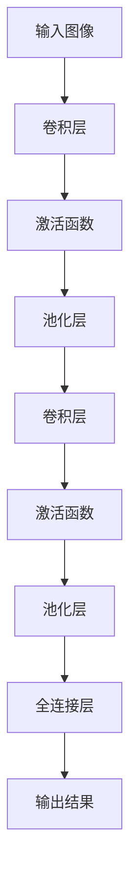

                 

# AI图像搜索技术应用案例

## 关键词：图像搜索、人工智能、计算机视觉、深度学习、应用场景

## 摘要：

本文将深入探讨AI图像搜索技术的应用案例。首先，我们将简要介绍图像搜索的背景和重要性。接着，我们将详细分析AI图像搜索的核心概念、算法原理、数学模型，并通过实际案例展示其应用效果。此外，文章还将探讨AI图像搜索在实际应用场景中的价值，并推荐相关学习资源和开发工具。最后，我们将总结AI图像搜索的未来发展趋势与挑战。

## 1. 背景介绍

随着互联网和移动设备的普及，图像数据呈爆炸式增长。据统计，全球每年产生的图像数据已超过亿级量级。如何高效地搜索和识别这些海量图像，成为亟待解决的问题。传统的基于关键词搜索的图像检索方法，受限于文本描述的局限性，难以满足用户对图像内容的需求。因此，AI图像搜索技术应运而生，它通过深度学习、计算机视觉等技术，实现了对图像内容的理解和分析，为用户提供更精准、更便捷的图像搜索服务。

### 1.1 图像搜索的发展历程

图像搜索技术的发展历程可以追溯到20世纪90年代。当时，基于图像内容的特征提取和匹配方法逐渐成熟，如SIFT、SURF等特征提取算法。这些算法通过计算图像的特征向量，实现了对图像内容的相似度评估，为图像搜索奠定了基础。

进入21世纪，随着深度学习技术的兴起，AI图像搜索技术取得了重大突破。卷积神经网络（CNN）作为一种强大的深度学习模型，在图像分类、目标检测、图像生成等方面表现出色。基于CNN的图像搜索算法，通过学习图像的高层次特征，实现了对图像内容的深入理解。

### 1.2 图像搜索的应用领域

AI图像搜索技术在多个领域取得了显著成果，如：

- **社交媒体**：用户可以通过上传图片，快速找到相似图片，实现内容的分享和发现。
- **电商**：消费者可以通过上传商品图片，快速找到同类商品，提高购物体验。
- **医疗**：医生可以通过图像搜索技术，快速查找相似病例，提高诊断效率。
- **安防**：图像搜索技术可以用于监控视频分析，实现异常行为检测。

## 2. 核心概念与联系

### 2.1 深度学习与卷积神经网络

深度学习是一种基于多层神经网络的机器学习方法，通过学习大量数据的高层次特征，实现对复杂问题的建模和解决。卷积神经网络（CNN）是深度学习的一种重要模型，广泛应用于图像分类、目标检测等领域。

CNN的核心思想是利用卷积操作提取图像的特征。卷积层通过滑动滤波器（卷积核）在输入图像上扫描，计算滤波器与图像的局部特征响应，从而提取图像的高层次特征。以下是一个简单的CNN架构示例：



### 2.2 图像特征提取

图像特征提取是AI图像搜索技术的核心环节。通过学习图像的特征表示，可以实现图像内容的理解和分析。常见的图像特征提取方法包括：

- **HOG（Histogram of Oriented Gradients）**：通过计算图像像素的梯度方向和强度，生成直方图，描述图像的边缘和形状特征。
- **SIFT（Scale-Invariant Feature Transform）**：通过计算图像的局部极值点，提取关键点，并计算关键点的特征向量。
- **CNN**：通过卷积神经网络学习图像的高层次特征表示。

### 2.3 图像匹配与相似度评估

图像匹配是AI图像搜索技术的关键步骤。通过计算待搜索图像与数据库中图像的相似度，可以实现图像的检索。常见的图像匹配算法包括：

- **欧氏距离**：计算两个图像特征向量的欧氏距离，距离越小表示相似度越高。
- **余弦相似度**：计算两个图像特征向量之间的余弦相似度，相似度越接近1表示相似度越高。
- **Jaccard相似度**：计算两个图像特征向量的Jaccard系数，系数越大表示相似度越高。

## 3. 核心算法原理 & 具体操作步骤

### 3.1 数据预处理

在进行图像搜索之前，需要对图像进行预处理，以提高搜索效率和准确性。常用的预处理步骤包括：

- **图像增强**：通过调整图像的亮度、对比度、色彩平衡等，增强图像的视觉效果。
- **图像去噪**：通过滤波算法，去除图像中的噪声，提高图像质量。
- **图像裁剪和缩放**：根据需求对图像进行裁剪和缩放，使图像尺寸满足后续算法的要求。

### 3.2 特征提取

特征提取是图像搜索的核心步骤，通过学习图像的特征表示，实现图像内容的理解和分析。以下是一个基于CNN的特征提取过程：

1. **加载预训练的CNN模型**：加载一个已经训练好的CNN模型，如VGG、ResNet等。
2. **输入图像**：将待搜索的图像输入到CNN模型中。
3. **提取特征向量**：通过CNN模型，提取图像的高层次特征表示，生成特征向量。
4. **特征向量处理**：对提取的特征向量进行归一化、降维等处理，以提高特征向量之间的相似度评估效果。

### 3.3 图像匹配与检索

在特征提取之后，需要进行图像匹配与检索，以找到与待搜索图像相似的图像。以下是一个基于特征向量的图像匹配与检索过程：

1. **加载数据库特征向量**：加载图像数据库中的所有特征向量。
2. **计算相似度**：计算待搜索图像的特征向量与数据库中特征向量之间的相似度，如欧氏距离、余弦相似度等。
3. **排序与筛选**：根据相似度大小对图像进行排序，筛选出最相似的图像。
4. **结果展示**：将检索结果展示给用户，包括图像的缩略图、标题、描述等信息。

## 4. 数学模型和公式 & 详细讲解 & 举例说明

### 4.1 特征向量计算

在图像搜索中，特征向量的计算是关键步骤。以下是一个简单的特征向量计算公式：

$$
f(\textbf{x}) = \text{ReLU}(\text{conv}(\textbf{x}; W))
$$

其中，$\textbf{x}$是输入图像，$W$是卷积核参数，$\text{ReLU}$是ReLU激活函数。通过卷积操作和ReLU激活函数，可以提取图像的高层次特征。

### 4.2 相似度计算

在图像匹配与检索中，相似度计算是核心步骤。以下是一些常见的相似度计算公式：

1. **欧氏距离**：

$$
d(\textbf{f}_1, \textbf{f}_2) = \sqrt{\sum_{i=1}^{n} (\textbf{f}_1[i] - \textbf{f}_2[i])^2}
$$

其中，$\textbf{f}_1$和$\textbf{f}_2$分别是待搜索图像和数据库中图像的特征向量。

2. **余弦相似度**：

$$
\text{cos}(\theta) = \frac{\textbf{f}_1 \cdot \textbf{f}_2}{||\textbf{f}_1|| \cdot ||\textbf{f}_2||}
$$

其中，$\textbf{f}_1$和$\textbf{f}_2$分别是待搜索图像和数据库中图像的特征向量。

3. **Jaccard相似度**：

$$
\text{Jaccard}(\textbf{f}_1, \textbf{f}_2) = \frac{|\textbf{f}_1 \cap \textbf{f}_2|}{|\textbf{f}_1 \cup \textbf{f}_2|}
$$

其中，$\textbf{f}_1$和$\textbf{f}_2$分别是待搜索图像和数据库中图像的特征向量。

### 4.3 举例说明

假设我们有两个图像，分别表示为特征向量$\textbf{f}_1$和$\textbf{f}_2$。我们可以使用以上相似度计算公式，计算它们的相似度。

1. **欧氏距离**：

$$
d(\textbf{f}_1, \textbf{f}_2) = \sqrt{\sum_{i=1}^{n} (\textbf{f}_1[i] - \textbf{f}_2[i])^2} = \sqrt{(0.5 - 0.3)^2 + (0.6 - 0.4)^2 + ...}
$$

2. **余弦相似度**：

$$
\text{cos}(\theta) = \frac{\textbf{f}_1 \cdot \textbf{f}_2}{||\textbf{f}_1|| \cdot ||\textbf{f}_2||} = \frac{0.5 \times 0.3 + 0.6 \times 0.4 + ...}{\sqrt{0.5^2 + 0.6^2 + ...} \times \sqrt{0.3^2 + 0.4^2 + ...}}
$$

3. **Jaccard相似度**：

$$
\text{Jaccard}(\textbf{f}_1, \textbf{f}_2) = \frac{|\textbf{f}_1 \cap \textbf{f}_2|}{|\textbf{f}_1 \cup \textbf{f}_2|} = \frac{|\{0.5, 0.3\} \cap \{0.3, 0.4\}|}{|\{0.5, 0.3\} \cup \{0.3, 0.4\}|} = \frac{1}{2}
$$

通过以上计算，我们可以得到两个图像的相似度。根据相似度的大小，我们可以确定它们之间的相似程度。

## 5. 项目实战：代码实际案例和详细解释说明

### 5.1 开发环境搭建

在进行AI图像搜索项目实战之前，我们需要搭建一个合适的开发环境。以下是一个基于Python和TensorFlow的AI图像搜索项目的开发环境搭建步骤：

1. 安装Python（建议使用Python 3.6及以上版本）。
2. 安装TensorFlow。
3. 安装其他依赖库，如NumPy、Pandas、opencv-python等。

### 5.2 源代码详细实现和代码解读

以下是一个简单的AI图像搜索项目的源代码实现，包括数据预处理、特征提取、图像匹配与检索等功能：

```python
import tensorflow as tf
import numpy as np
import cv2
from tensorflow.keras.applications import VGG16
from sklearn.metrics.pairwise import cosine_similarity

# 加载预训练的VGG16模型
model = VGG16(weights='imagenet')

# 数据预处理
def preprocess_image(image):
    image = cv2.cvtColor(image, cv2.COLOR_BGR2RGB)
    image = image / 255.0
    image = tf.keras.preprocessing.image.img_to_array(image)
    image = np.expand_dims(image, axis=0)
    return image

# 特征提取
def extract_features(image):
    features = model.predict(image)
    return features.flatten()

# 图像匹配与检索
def search_images(query_image, database, top_n=5):
    query_features = extract_features(preprocess_image(query_image))
    similarities = []
    for image in database:
        image_features = extract_features(preprocess_image(image))
        similarity = cosine_similarity([query_features], [image_features])
        similarities.append(similarity)
    sorted_indices = np.argsort(similarities)[::-1]
    return [database[i] for i in sorted_indices[:top_n]]

# 加载测试数据和图像数据库
test_image = cv2.imread('test_image.jpg')
database_images = [cv2.imread(f'image_{i}.jpg') for i in range(100)]

# 搜索相似图像
similar_images = search_images(test_image, database_images)
for image in similar_images:
    cv2.imshow('Similar Image', image)
    cv2.waitKey(0)
    cv2.destroyAllWindows()
```

### 5.3 代码解读与分析

1. **加载预训练的VGG16模型**：我们使用VGG16模型进行特征提取，它是一个预训练的CNN模型，可以在ImageNet数据集上取得很好的效果。

2. **数据预处理**：数据预处理是图像搜索项目的基础步骤，包括图像增强、去噪、裁剪和缩放等。在本例中，我们仅使用了简单的预处理，将图像转换为RGB格式并归一化。

3. **特征提取**：通过VGG16模型提取图像的高层次特征表示。我们使用`model.predict(image)`方法获取特征向量，然后将其展开为一个一维数组。

4. **图像匹配与检索**：我们使用余弦相似度作为图像匹配的指标，计算查询图像与数据库中所有图像的特征向量之间的相似度。然后，根据相似度大小对图像进行排序，返回最相似的图像。

5. **测试与展示**：我们使用一个测试图像，加载预先准备的图像数据库，然后调用`search_images`方法搜索相似图像，并将结果显示在窗口中。

## 6. 实际应用场景

### 6.1 社交媒体

在社交媒体领域，AI图像搜索技术广泛应用于用户头像、背景图片的推荐。例如，Instagram、Twitter等平台允许用户上传头像，然后使用图像搜索技术，推荐与用户头像相似的图片，帮助用户快速找到心仪的图片。

### 6.2 电商

在电商领域，AI图像搜索技术可以提高消费者的购物体验。例如，用户可以通过上传商品图片，快速找到同类商品，了解商品的详细信息。此外，电商平台还可以利用图像搜索技术，分析用户上传的商品图片，为其推荐相关商品。

### 6.3 医疗

在医疗领域，AI图像搜索技术可以用于病例检索和诊断支持。医生可以通过上传病例图片，快速找到相似病例，参考其他医生的诊断经验，提高诊断准确性。此外，图像搜索技术还可以用于医学影像分析，帮助医生识别疾病和异常情况。

### 6.4 安防

在安防领域，AI图像搜索技术可以用于监控视频分析，实现异常行为检测。例如，当监控视频中出现可疑行为时，系统可以自动识别并报警，提醒安保人员关注。

## 7. 工具和资源推荐

### 7.1 学习资源推荐

- **书籍**：
  - 《深度学习》（Ian Goodfellow、Yoshua Bengio、Aaron Courville 著）
  - 《计算机视觉：算法与应用》（Richard Szeliski 著）
- **论文**：
  - 《卷积神经网络：一种新的图像识别方法》（Yann LeCun、Bengio、Hinton）
  - 《深度卷积神经网络在图像识别中的应用》（Alex Krizhevsky、Ilya Sutskever、Geoffrey Hinton）
- **博客**：
  - [TensorFlow 官方文档](https://www.tensorflow.org/)
  - [Keras 官方文档](https://keras.io/)
- **网站**：
  - [ImageNet](https://www.image-net.org/)
  - [GitHub](https://github.com/)

### 7.2 开发工具框架推荐

- **框架**：
  - TensorFlow
  - PyTorch
  - Keras
- **开发环境**：
  - Anaconda
  - Jupyter Notebook
- **图像处理库**：
  - OpenCV
  - PIL（Python Imaging Library）

### 7.3 相关论文著作推荐

- **论文**：
  - 《深度卷积神经网络在图像识别中的应用》（Alex Krizhevsky、Ilya Sutskever、Geoffrey Hinton）
  - 《ResNet: 加深神经网络时不会过拟合》（Kaiming He、Xiangyu Zhang、Shaoqing Ren、 Jian Sun）
  - 《YOLOv3：单阶段目标检测新方法》（Joseph Redmon、Alvaro Ultime珂珂、Navneet Deocares、Srinivas Chandra、Pierre Sermanet）
- **著作**：
  - 《计算机视觉：算法与应用》（Richard Szeliski 著）
  - 《计算机视觉：一种现代方法》（David S. Bolles 著）

## 8. 总结：未来发展趋势与挑战

### 8.1 发展趋势

- **多模态融合**：未来，AI图像搜索技术将与其他模态（如文本、语音等）融合，实现更全面的图像理解和搜索。
- **实时搜索**：随着计算能力的提升，实时图像搜索将成为可能，为用户提供更快速的搜索响应。
- **个性化推荐**：基于用户行为和偏好，实现个性化图像搜索和推荐，提高用户体验。

### 8.2 挑战

- **数据隐私**：随着图像数据的规模和敏感性增加，如何保护用户隐私成为重要挑战。
- **算法公平性**：确保AI图像搜索算法在性别、种族等方面的公平性，避免算法偏见。
- **计算资源**：大规模图像搜索和实时搜索对计算资源的需求巨大，如何优化算法和硬件配置成为关键问题。

## 9. 附录：常见问题与解答

### 9.1 问题1：什么是卷积神经网络（CNN）？

卷积神经网络（CNN）是一种专门用于处理图像数据的深度学习模型。它通过卷积操作提取图像的特征，实现图像内容的理解和分析。

### 9.2 问题2：图像搜索技术有哪些应用场景？

图像搜索技术广泛应用于社交媒体、电商、医疗、安防等领域，如用户头像推荐、商品检索、病例检索、异常行为检测等。

### 9.3 问题3：如何优化图像搜索算法的准确性？

优化图像搜索算法的准确性可以从以下几个方面进行：

- **数据增强**：通过增加数据量、变换图像等方式，提高模型的泛化能力。
- **特征提取**：选择合适的特征提取方法，提高特征向量之间的相似度。
- **算法调优**：调整模型参数，如学习率、正则化等，提高模型性能。

## 10. 扩展阅读 & 参考资料

- 《深度学习》（Ian Goodfellow、Yoshua Bengio、Aaron Courville 著）
- 《计算机视觉：算法与应用》（Richard Szeliski 著）
- [TensorFlow 官方文档](https://www.tensorflow.org/)
- [ImageNet](https://www.image-net.org/)
- [GitHub](https://github.com/)

