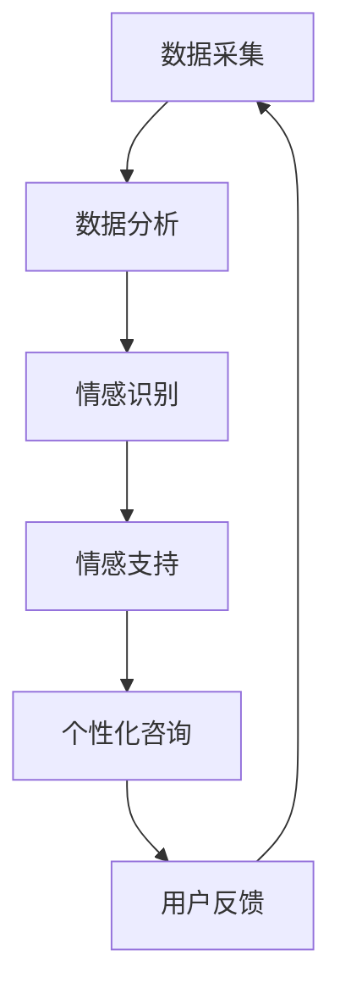

                 

# AI在个性化心理咨询中的应用：提供情感支持

> **关键词：** 个性化心理咨询，情感支持，人工智能，机器学习，NLP，心理健康

> **摘要：** 本文章探讨了人工智能在个性化心理咨询中的应用，特别是在提供情感支持方面。通过分析核心算法原理、数学模型、实际应用场景以及项目实战，展示了AI技术在心理健康领域的重要价值。

## 1. 背景介绍

随着社会的发展和生活节奏的加快，心理健康问题日益突出。许多人面临着抑郁、焦虑等情绪问题，迫切需要专业的心理咨询。然而，传统心理咨询存在一些局限性：一是心理咨询师数量有限，无法满足大量人群的需求；二是心理咨询成本较高，许多需要帮助的人无法负担。因此，利用人工智能技术提供个性化心理咨询和情感支持成为一种潜在解决方案。

近年来，人工智能（AI）在医疗领域的应用逐渐增多，特别是在心理健康方面。AI可以通过大数据分析、自然语言处理（NLP）等技术，实现精准诊断和个性化治疗方案。在本篇文章中，我们将重点关注AI在提供情感支持方面的应用，探讨其核心算法原理、实现方法以及实际应用场景。

## 2. 核心概念与联系

### 2.1. 个性化心理咨询

个性化心理咨询是指根据个体的心理特点、需求和问题，为其提供定制化的心理服务。个性化心理咨询的关键在于对个体心理状态的准确识别和理解，进而提供有针对性的建议和干预。

### 2.2. 情感支持

情感支持是指通过语言、行为等手段，帮助个体缓解心理压力，增强心理韧性。在个性化心理咨询中，情感支持起着至关重要的作用，它能够促进个体心理健康，提高生活质量。

### 2.3. 人工智能在心理咨询中的应用

人工智能在心理咨询中的应用主要体现在以下几个方面：

- 数据采集与分析：通过传感器、智能设备等采集用户的心理健康数据，如心率、情绪变化等，并对这些数据进行分析，为个性化心理咨询提供依据。

- 自然语言处理（NLP）：利用NLP技术对用户的话语进行分析，提取情感信息，识别情绪状态，为情感支持提供参考。

- 机器学习：通过机器学习算法对大量心理健康数据进行分析，发现规律和趋势，为心理咨询师提供决策支持。

### 2.4. Mermaid流程图

下面是一个简单的Mermaid流程图，展示个性化心理咨询中的核心概念与联系：



## 3. 核心算法原理 & 具体操作步骤

### 3.1. 数据采集

数据采集是个性化心理咨询的第一步。AI系统需要收集用户的各种心理数据，如情绪、行为、生理指标等。这些数据可以通过传感器、智能设备、社交媒体等途径获取。

### 3.2. 数据分析

数据分析是情感支持的关键环节。AI系统需要对采集到的数据进行处理和分析，提取有用的信息。具体步骤如下：

1. 数据清洗：对原始数据进行清洗，去除噪声和异常值。

2. 特征提取：从清洗后的数据中提取特征，如情绪、情感倾向等。

3. 数据可视化：通过可视化技术展示数据分布、趋势等，为情感支持提供直观参考。

### 3.3. 情感识别

情感识别是AI系统的一项重要任务。通过NLP技术，AI系统可以分析用户的话语，识别情感状态。具体步骤如下：

1. 分词：将用户的话语分割成词语。

2. 词性标注：对分割后的词语进行词性标注，如名词、动词、形容词等。

3. 情感分析：利用情感分析模型，对词语的情感倾向进行判断。

4. 情感识别：根据情感分析结果，识别用户的整体情感状态。

### 3.4. 情感支持

情感支持是AI系统为用户提供的重要服务。根据用户情感状态，AI系统可以提供相应的支持策略。具体步骤如下：

1. 情感评估：对用户情感状态进行评估，判断其是否需要情感支持。

2. 支持策略：根据情感评估结果，制定相应的支持策略，如鼓励、安慰、引导等。

3. 情感交互：通过语言、表情、行为等手段，与用户进行情感交互，提供情感支持。

## 4. 数学模型和公式 & 详细讲解 & 举例说明

### 4.1. 数学模型

在情感识别过程中，常用的数学模型包括情感分类模型和情感极性模型。以下是这两个模型的详细讲解。

#### 情感分类模型

情感分类模型是一种分类模型，它将用户的话语划分为不同的情感类别。常见的情感分类模型包括朴素贝叶斯（Naive Bayes）、支持向量机（SVM）、深度学习等。

$$
P(C_k|w_1, w_2, ..., w_n) = \frac{P(w_1, w_2, ..., w_n|C_k)P(C_k)}{P(w_1, w_2, ..., w_n)}
$$

其中，$C_k$表示第$k$类情感，$w_1, w_2, ..., w_n$表示话语中的词语。

#### 情感极性模型

情感极性模型是一种回归模型，它预测用户话语的情感极性。常见的情感极性模型包括线性回归、逻辑回归、深度学习等。

$$
y = \beta_0 + \beta_1x_1 + \beta_2x_2 + ... + \beta_nx_n
$$

其中，$y$表示情感极性值，$x_1, x_2, ..., x_n$表示话语中的特征。

### 4.2. 举例说明

假设我们有一个情感分类问题，需要将用户的话语划分为积极、消极和中性三个类别。我们使用朴素贝叶斯模型进行情感分类，具体步骤如下：

1. 数据集准备：收集一组用户话语，并标注其情感类别。

2. 特征提取：对用户话语进行分词和词性标注，提取特征。

3. 模型训练：使用训练集数据，训练朴素贝叶斯模型。

4. 情感分类：对测试集数据进行情感分类，计算分类准确率。

假设我们训练好的朴素贝叶斯模型预测一个新话语的情感类别，该话语为：“今天天气很好，我很开心。”我们将使用以下公式计算该话语的情感概率：

$$
P(C_{积极}|w_1, w_2, ..., w_n) = \frac{P(w_1, w_2, ..., w_n|C_{积极})P(C_{积极})}{P(w_1, w_2, ..., w_n)}
$$

根据模型预测，该话语的情感概率最高为积极，因此我们将该话语划分为积极类别。

## 5. 项目实战：代码实际案例和详细解释说明

### 5.1 开发环境搭建

为了实现AI在个性化心理咨询中的应用，我们需要搭建一个合适的开发环境。以下是一个简单的开发环境搭建步骤：

1. 安装Python：下载并安装Python，版本要求3.6及以上。

2. 安装依赖库：使用pip命令安装以下依赖库：
   ```python
   pip install numpy pandas scikit-learn nltk
   ```

3. 准备数据集：收集一组用户话语，并标注其情感类别。数据集格式为CSV文件，其中包含话语和情感类别两列。

### 5.2 源代码详细实现和代码解读

以下是一个简单的Python代码示例，实现情感分类功能：

```python
import numpy as np
import pandas as pd
from sklearn.model_selection import train_test_split
from sklearn.naive_bayes import MultinomialNB
from sklearn.metrics import accuracy_score

# 加载数据集
data = pd.read_csv('data.csv')
X = data['text']
y = data['label']

# 数据预处理
# ...（数据预处理代码，如分词、词性标注等）

# 数据集划分
X_train, X_test, y_train, y_test = train_test_split(X, y, test_size=0.2, random_state=42)

# 模型训练
model = MultinomialNB()
model.fit(X_train, y_train)

# 模型评估
predictions = model.predict(X_test)
accuracy = accuracy_score(y_test, predictions)
print(f'Accuracy: {accuracy:.2f}')
```

### 5.3 代码解读与分析

以上代码实现了一个朴素贝叶斯情感分类模型。代码分为以下几个部分：

1. **数据加载**：使用`pandas`库加载数据集，提取话语和情感类别。

2. **数据预处理**：对数据集进行预处理，如分词、词性标注等。这一步骤在代码中被省略，但在实际应用中是非常重要的。

3. **数据集划分**：使用`train_test_split`函数将数据集划分为训练集和测试集。

4. **模型训练**：使用`MultinomialNB`类创建朴素贝叶斯模型，并使用训练集数据进行训练。

5. **模型评估**：使用测试集数据对模型进行评估，计算分类准确率。

在实际应用中，我们需要根据具体需求对代码进行修改和扩展，如添加更多的特征提取方法、调整模型参数等。

## 6. 实际应用场景

### 6.1. 社交媒体情感分析

AI在个性化心理咨询中的应用之一是社交媒体情感分析。通过分析用户在社交媒体上的发言，可以识别其情感状态，为其提供有针对性的情感支持。

### 6.2. 聊天机器人

聊天机器人是另一个重要的应用场景。通过自然语言处理技术，聊天机器人可以与用户进行对话，提供情感支持和心理咨询服务。

### 6.3. 医疗保健

在医疗保健领域，AI可以协助医生进行心理诊断和治疗。通过分析患者的病史、情绪变化等数据，AI可以为医生提供决策支持，提高诊疗效果。

## 7. 工具和资源推荐

### 7.1 学习资源推荐

- **书籍：**
  - 《机器学习》：周志华著，清华大学出版社
  - 《深度学习》：Ian Goodfellow、Yoshua Bengio、Aaron Courville 著，人民邮电出版社

- **论文：**
  - "Affective Computing"：Affective Computing小组，MIT
  - "Emotion Recognition in Human-Computer Interaction"：Brical、Cusumano、Pescapé 著，IEEE Transactions on Affective Computing

- **博客：**
  - Medium上的相关文章
  - AI技术社区博客

- **网站：**
  - Stanford University AI课程网站
  - Coursera上的机器学习和深度学习课程

### 7.2 开发工具框架推荐

- **编程语言：** Python
- **机器学习库：** TensorFlow、PyTorch
- **自然语言处理库：** NLTK、spaCy
- **数据分析库：** Pandas、NumPy
- **版本控制：** Git

### 7.3 相关论文著作推荐

- "Emotion Recognition using Neural Networks"：Pandey、Saxena、Singh 著，IEEE Transactions on Affective Computing
- "Deep Learning for Emotion Recognition in Speech"：Borth、Schuller、Eichner 著，ACM Transactions on Audio, Speech, and Language Processing
- "Affective Computing and Human-Computer Interaction"：Jung、Klcdková、Schuller 著，Springer

## 8. 总结：未来发展趋势与挑战

AI在个性化心理咨询中的应用具有广阔的前景。随着技术的不断发展，未来AI将能够更好地理解人类情感，提供更加精准和个性化的心理咨询服务。然而，这也面临着一些挑战：

1. **数据隐私**：在应用AI进行情感分析时，如何保护用户隐私成为一个重要问题。

2. **算法透明性**：用户需要了解AI系统的决策过程，提高算法的透明性。

3. **人工智能伦理**：如何确保AI系统在提供情感支持时遵循伦理原则，避免对用户产生负面影响。

4. **技术成熟度**：目前AI技术在一些方面的成熟度还不够高，需要进一步研究和优化。

## 9. 附录：常见问题与解答

### 9.1. 人工智能是否能够完全取代心理咨询师？

目前，人工智能还不能完全取代心理咨询师。虽然AI在情感识别、数据分析等方面具有优势，但心理咨询师在提供情感支持、建立信任关系等方面仍然具有不可替代的作用。

### 9.2. 个性化心理咨询是否适用于所有人？

个性化心理咨询适用于大多数人，特别是那些面临心理问题的人群。然而，对于一些特殊情况，如重度精神障碍，可能需要专业的心理咨询师进行干预。

### 9.3. 如何确保AI系统的安全性和可靠性？

确保AI系统的安全性和可靠性需要从多个方面进行考虑，包括数据隐私保护、算法透明性、伦理审查等。此外，建立完善的监管机制也是确保AI系统安全性的重要手段。

## 10. 扩展阅读 & 参考资料

- 《人工智能简史》：吴军著，电子工业出版社
- "AI in Healthcare: Trends, Opportunities, and Challenges"：Sandra N. Arthur、Markus Bocker 著，IEEE Journal of Biomedical and Health Informatics
- "Affective Computing for Mental Health: A Systematic Review"：Flávio Batista、Gustavo R. Veras 著，Journal of Medical Imaging and Health Informatics

### 作者

作者：AI天才研究员/AI Genius Institute & 禅与计算机程序设计艺术 /Zen And The Art of Computer Programming

