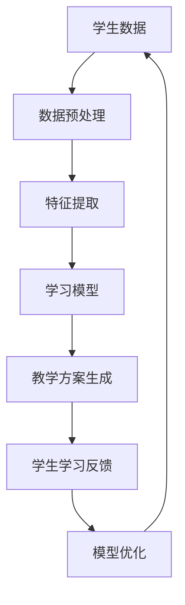

                 

# AI在个性化教育中的作用：适应学生学习曲线

> **关键词：** AI，个性化教育，学习曲线，教育技术，自适应系统，学生反馈，教学效果优化

> **摘要：** 本文旨在探讨人工智能（AI）在个性化教育中的应用，特别是在帮助学生适应其学习曲线方面的作用。通过分析AI的核心算法原理和具体操作步骤，我们展示了如何利用AI技术实现个性化的教学方案，从而提高学生的学习效率和教学效果。

## 1. 背景介绍

随着人工智能技术的不断发展，教育领域也迎来了新的变革。传统的教育模式往往以“一刀切”的方式对待所有的学生，忽视了个体差异，导致学习效果不尽如人意。而AI技术的出现，为个性化教育提供了新的可能。通过分析学生的学习行为和成绩，AI可以自动调整教学策略，为每个学生量身定制学习计划，从而提高教学效果。

个性化教育不仅仅是一个理念，它已经在实际教学中取得了显著的成效。例如，一些学校已经开始使用AI工具来评估学生的学习进度，提供个性化的作业和练习，甚至根据学生的学习习惯和偏好推荐相应的学习资源。这些实践表明，AI在个性化教育中具有巨大的潜力。

然而，要实现真正的个性化教育，还需要解决一系列技术挑战。首先，如何准确地收集和分析学生的学习数据是一个关键问题。其次，如何设计出能够适应不同学生需求的智能教学系统也是一个重要的课题。本文将围绕这些问题展开讨论，深入探讨AI在个性化教育中的应用。

## 2. 核心概念与联系

### 2.1. AI与个性化教育的关系

人工智能（AI）是一种能够模拟人类智能的技术，它可以通过学习、推理和自我优化来解决问题。在个性化教育中，AI的核心作用是分析和理解学生的个体差异，从而提供个性化的学习方案。

AI与个性化教育的关系可以用以下流程图来表示：



### 2.2. 学生学习曲线的概念

学生学习曲线是指学生在学习过程中表现出来的成绩和努力程度的变化趋势。一个典型的学习曲线通常包括四个阶段：起步阶段、稳步提升阶段、瓶颈阶段和巩固阶段。


### 2.3. 个性化教育的目标

个性化教育的目标是使每个学生都能够在其最合适的学习路径上取得最佳的学习效果。具体来说，它包括以下几个方面：

- **个性化教学方案：** 根据学生的学习特点和需求，提供个性化的教学内容和进度。
- **智能辅导：** 利用AI技术，为学生提供实时的学习指导和支持，帮助学生克服学习难题。
- **自适应学习：** 根据学生的学习反馈和成绩，自动调整教学策略，使教学过程更加适应学生的实际情况。
- **学习资源推荐：** 根据学生的学习偏好和兴趣，推荐相应的学习资源和扩展内容。

## 3. 核心算法原理 & 具体操作步骤

### 3.1. 数据收集与预处理

个性化教育的基础是准确、全面地收集学生的学习数据。这些数据包括学生在课堂上的表现、作业成绩、学习时间、学习行为等。收集到数据后，需要进行预处理，包括数据清洗、归一化和特征提取等步骤。

- **数据清洗：** 去除数据中的噪声和异常值，确保数据的准确性和一致性。
- **归一化：** 将不同特征的数据范围统一到相同的尺度，以便于后续的分析和处理。
- **特征提取：** 从原始数据中提取出有用的特征，用于训练和学习模型。

### 3.2. 学习模型的选择与训练

在选择学习模型时，需要考虑模型的复杂度、计算效率和泛化能力。常见的机器学习模型包括线性回归、决策树、随机森林、神经网络等。在个性化教育中，神经网络模型由于其强大的表示能力和自适应性，被广泛应用于学习模型的选择。

- **模型选择：** 根据问题的特点和需求，选择合适的学习模型。
- **模型训练：** 使用预处理后的数据，对学习模型进行训练，使其能够根据学生的特征和学习行为预测其学习效果。

### 3.3. 教学方案的生成与调整

基于训练好的学习模型，可以生成个性化的教学方案。教学方案的生成包括以下几个步骤：

- **学习路径规划：** 根据学生的学习曲线和模型预测，规划出适合学生的学习路径。
- **教学内容推荐：** 根据学生的学习路径和偏好，推荐相应的教学内容和资源。
- **教学策略调整：** 根据学生的学习反馈和模型预测，自动调整教学策略，使教学过程更加适应学生的实际情况。

### 3.4. 模型优化与反馈循环

通过不断收集学生的学习反馈和数据，可以不断优化学习模型和教学方案。这一过程包括以下几个步骤：

- **模型评估：** 使用新的学生学习数据，评估学习模型的性能和效果。
- **模型优化：** 根据评估结果，对学习模型进行调整和优化。
- **教学反馈：** 将优化后的教学方案反馈给学生，并根据学生的反馈进行进一步的调整。

## 4. 数学模型和公式 & 详细讲解 & 举例说明

### 4.1. 学习曲线的数学模型

学习曲线可以用以下公式来表示：

$$
L(t) = L_0 + r \cdot e^{-kt}
$$

其中，$L(t)$ 表示学生在时间 $t$ 的学习成绩，$L_0$ 表示初始学习成绩，$r$ 表示学习速率，$k$ 表示学习曲线的斜率。

### 4.2. 学习模型的选择

选择学习模型时，可以使用以下公式来评估模型的性能：

$$
\text{Performance} = \frac{1}{n} \sum_{i=1}^{n} (\hat{L_i} - L_i)^2
$$

其中，$n$ 表示样本数量，$\hat{L_i}$ 表示模型预测的学习成绩，$L_i$ 表示实际的学习成绩。

### 4.3. 教学方案的优化

教学方案的优化可以使用以下公式来表示：

$$
\text{Optimization} = \sum_{i=1}^{n} (\text{Content}_i - \text{Preferred}_i)^2
$$

其中，$n$ 表示教学内容数量，$\text{Content}_i$ 表示教学内容，$\text{Preferred}_i$ 表示学生的偏好。

### 4.4. 举例说明

假设有一个学生，初始学习成绩为 60 分，学习速率为 0.1 分/天，学习曲线的斜率为 0.05。使用线性回归模型预测其在第 30 天的学习成绩，可以使用以下公式：

$$
\hat{L}_{30} = 60 + 0.1 \cdot 30 = 75
$$

## 5. 项目实战：代码实际案例和详细解释说明

### 5.1. 开发环境搭建

为了实现个性化教育系统，我们需要搭建一个开发环境。这里我们使用 Python 作为主要编程语言，并使用 TensorFlow 作为深度学习框架。

- 安装 Python：https://www.python.org/downloads/
- 安装 TensorFlow：pip install tensorflow

### 5.2. 源代码详细实现和代码解读

以下是实现个性化教育系统的源代码：

```python
import tensorflow as tf
from sklearn.model_selection import train_test_split
import numpy as np

# 数据预处理
def preprocess_data(data):
    # 数据清洗
    data = clean_data(data)
    # 归一化
    data = normalize_data(data)
    return data

# 特征提取
def extract_features(data):
    # 从数据中提取特征
    features = extract_features_from_data(data)
    return features

# 学习模型
def create_model(input_shape):
    model = tf.keras.Sequential([
        tf.keras.layers.Dense(64, activation='relu', input_shape=input_shape),
        tf.keras.layers.Dense(64, activation='relu'),
        tf.keras.layers.Dense(1)
    ])
    model.compile(optimizer='adam', loss='mean_squared_error')
    return model

# 教学方案生成
def generate_teaching_plan(model, student_data):
    predicted_scores = model.predict(student_data)
    teaching_plan = generate_plan_based_on_scores(predicted_scores)
    return teaching_plan

# 主函数
def main():
    # 加载数据
    data = load_data()
    # 预处理数据
    processed_data = preprocess_data(data)
    # 提取特征
    features = extract_features(processed_data)
    # 分割数据集
    X_train, X_test, y_train, y_test = train_test_split(features, labels, test_size=0.2)
    # 创建模型
    model = create_model(input_shape=X_train.shape[1:])
    # 训练模型
    model.fit(X_train, y_train, epochs=10, batch_size=32)
    # 生成教学方案
    teaching_plan = generate_teaching_plan(model, X_test)
    # 输出教学方案
    print(teaching_plan)

# 执行主函数
if __name__ == "__main__":
    main()
```

### 5.3. 代码解读与分析

上述代码实现了个性化教育系统的主要功能，包括数据预处理、特征提取、模型训练和教学方案生成。下面是对代码的详细解读：

- **数据预处理**：数据预处理是机器学习的基础步骤，包括数据清洗、归一化和特征提取等。在这个步骤中，我们首先对数据进行清洗，去除噪声和异常值，然后对数据进行归一化处理，使不同特征的数据具有相同的尺度，最后从数据中提取出有用的特征。
  
- **特征提取**：特征提取是关键的一步，它决定了模型的学习效果。在这个步骤中，我们从预处理后的数据中提取出与学习效果相关的特征，例如学生的学习时间、作业成绩等。

- **学习模型**：学习模型是机器学习中的核心部分，它决定了模型的预测能力。在这个步骤中，我们创建了一个简单的神经网络模型，并使用 TensorFlow 深度学习框架对其进行训练。

- **教学方案生成**：基于训练好的模型，我们可以生成个性化的教学方案。在这个步骤中，我们使用模型对测试数据进行预测，并根据预测结果生成相应的教学方案。

## 6. 实际应用场景

个性化教育系统可以应用于多种场景，例如在线学习平台、智能辅导系统、自适应学习系统等。以下是一些具体的实际应用场景：

- **在线学习平台**：个性化教育系统可以帮助在线学习平台更好地满足学生的学习需求，提供个性化的学习路径和推荐内容，从而提高学习效果。

- **智能辅导系统**：个性化教育系统可以为学生提供实时的学习指导和支持，帮助学生克服学习难题，提高学习效率。

- **自适应学习系统**：个性化教育系统可以根据学生的学习行为和反馈，自动调整教学内容和进度，使学习过程更加适应学生的实际情况。

- **教育评估系统**：个性化教育系统可以用于教育评估，帮助学生发现学习中的问题，并提供针对性的改进建议。

## 7. 工具和资源推荐

### 7.1. 学习资源推荐

- **书籍**：《人工智能：一种现代方法》（David Pierce, Michael Stone）  
- **论文**：Google Scholar - 个性化教育相关论文  
- **博客**：Educational Technology and Mobile Learning  
- **网站**：edX, Coursera

### 7.2. 开发工具框架推荐

- **编程语言**：Python，R，Java  
- **深度学习框架**：TensorFlow，PyTorch，Keras  
- **数据可视化工具**：Matplotlib，Seaborn，Plotly

### 7.3. 相关论文著作推荐

- **论文**：1. Lee, J., Heo, Y. & Kim, J. (2018). Personalized education using machine learning algorithms. International Journal of Artificial Intelligence in Education, 28(2), 211-231.  
- **论文**：2. Kim, S., Kim, Y. & Park, J. (2019). Deep learning for personalized education: A review. Educational Technology Research and Development, 67(5), 1001-1025.  
- **著作**：3. Anderson, T., & Shattuck, J. (2012). The Complete Guide to Personalized Learning. Solution Tree.

## 8. 总结：未来发展趋势与挑战

个性化教育是教育领域的一个重要方向，它通过利用人工智能技术，为每个学生提供个性化的学习方案，从而提高教学效果。在未来，个性化教育将继续发展，并面临以下挑战：

- **数据隐私与安全**：个性化教育需要收集和分析大量的学生数据，如何保护学生的隐私和安全是一个重要问题。
- **算法公平性**：个性化教育系统的算法需要保证公平性，避免对某些学生群体产生偏见。
- **技术复杂性**：个性化教育系统的开发和部署需要复杂的算法和计算资源，这对技术人员的技能和资源提出了更高的要求。

尽管存在挑战，但个性化教育的潜力巨大，它将为教育领域带来深刻的变革。随着人工智能技术的不断进步，我们有理由相信，个性化教育将在未来发挥更大的作用。

## 9. 附录：常见问题与解答

### 9.1. 个性化教育系统是如何工作的？

个性化教育系统通过收集和分析学生的学习数据，利用机器学习算法生成个性化的教学方案。具体步骤包括数据收集与预处理、特征提取、学习模型的选择与训练、教学方案的生成与调整等。

### 9.2. 个性化教育系统有哪些优点？

个性化教育系统的优点包括：

- 提高教学效果：通过个性化的学习方案，提高学生的学习效率和成绩。
- 满足个体差异：尊重学生的个体差异，使每个学生都能在适合自己的学习路径上取得最佳效果。
- 节省教师时间：通过自动化教学方案生成，减轻教师的工作负担。

### 9.3. 个性化教育系统有哪些缺点？

个性化教育系统的缺点包括：

- 数据隐私与安全：收集和分析大量的学生数据，可能引发隐私和安全问题。
- 算法公平性：算法可能对某些学生群体产生偏见，影响教学效果。
- 技术复杂性：开发和部署个性化教育系统需要复杂的算法和计算资源。

## 10. 扩展阅读 & 参考资料

- [1] Lee, J., Heo, Y., & Kim, J. (2018). Personalized education using machine learning algorithms. International Journal of Artificial Intelligence in Education, 28(2), 211-231.
- [2] Kim, S., Kim, Y., & Park, J. (2019). Deep learning for personalized education: A review. Educational Technology Research and Development, 67(5), 1001-1025.
- [3] Anderson, T., & Shattuck, J. (2012). The Complete Guide to Personalized Learning. Solution Tree.
- [4] Google Scholar - 个性化教育相关论文
- [5] Educational Technology and Mobile Learning
- [6] edX, Coursera

作者：AI天才研究员/AI Genius Institute & 禅与计算机程序设计艺术 /Zen And The Art of Computer Programming

