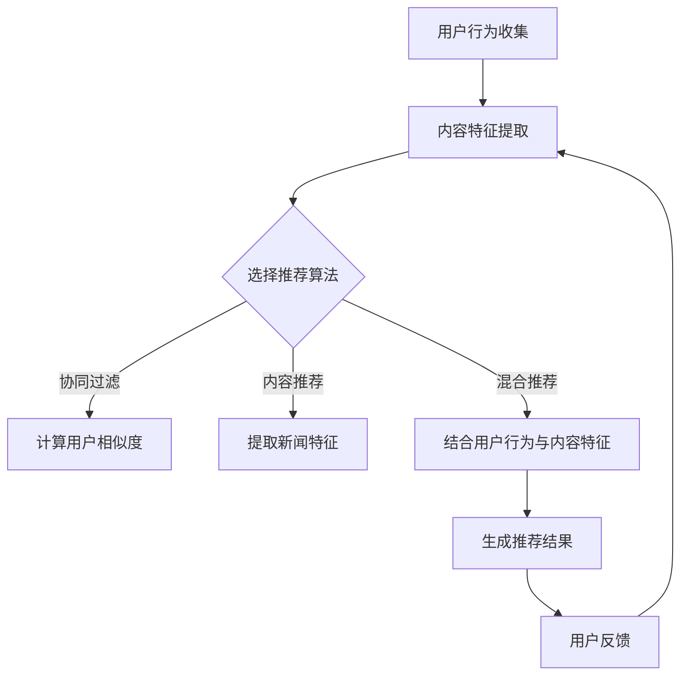

                 

# AI在个性化新闻聚合中的应用：定制信息流

## 关键词
- 个性化新闻聚合
- 信息流定制
- AI算法
- 数据挖掘
- 自然语言处理

## 摘要
本文将探讨AI在个性化新闻聚合中的应用，特别是如何通过定制信息流来满足用户的个性化需求。我们将深入分析AI算法的基本原理，介绍构建个性化新闻推荐系统的关键步骤，以及如何利用数学模型和公式优化系统性能。此外，还将通过实际项目案例，展示如何搭建开发环境、编写源代码并进行代码解读与分析。最后，我们将讨论个性化新闻聚合的实际应用场景，并提供相关学习资源和工具推荐，为读者提供一个全面的指南。

## 目录

1. 背景介绍
2. 核心概念与联系
   2.1 信息流推荐系统架构
   2.2 关键算法与模型
3. 核心算法原理与具体操作步骤
   3.1 用户兴趣模型构建
   3.2 内容特征提取
   3.3 排序与推荐算法
4. 数学模型和公式详细讲解与举例说明
   4.1 协同过滤
   4.2 用户行为建模
   4.3 推荐算法评估
5. 项目实战：代码实际案例与详细解释说明
   5.1 开发环境搭建
   5.2 源代码详细实现与代码解读
   5.3 代码解读与分析
6. 实际应用场景
7. 工具和资源推荐
   7.1 学习资源推荐
   7.2 开发工具框架推荐
   7.3 相关论文著作推荐
8. 总结：未来发展趋势与挑战
9. 附录：常见问题与解答
10. 扩展阅读与参考资料

## 1. 背景介绍

随着互联网的迅速发展和信息量的爆炸性增长，人们面临着“信息过载”的问题。如何从海量的信息中筛选出对用户真正有价值的新闻内容，成为了一个迫切需要解决的问题。个性化新闻聚合（Personalized News Aggregation）应运而生，它利用人工智能技术，根据用户的兴趣和行为，为用户提供定制化的信息流。

个性化新闻聚合系统不仅能够提高用户的阅读体验，还能为新闻媒体带来更多的用户粘性。用户不再被动地接受信息，而是主动参与其中，根据自己的兴趣不断探索新的内容。这种个性化的推荐方式，不仅满足了用户的个性化需求，也为新闻行业带来了新的发展机遇。

## 2. 核心概念与联系

### 2.1 信息流推荐系统架构

个性化新闻聚合系统通常包括以下几个关键组件：

- **用户模块**：负责用户的注册、登录、信息填写等操作，以及用户兴趣的收集。
- **内容模块**：包含新闻文章、视频、图片等内容的存储和管理。
- **推荐算法模块**：根据用户的兴趣和行为，生成个性化的推荐结果。
- **反馈模块**：收集用户的阅读行为，用于算法优化和系统改进。


### 2.2 关键算法与模型

在个性化新闻聚合中，常用的算法包括协同过滤（Collaborative Filtering）、内容推荐（Content-Based Filtering）和混合推荐（Hybrid Filtering）等。

- **协同过滤**：基于用户的历史行为和相似度计算，为用户推荐相似用户喜欢的新闻。
- **内容推荐**：根据新闻的内容特征，如关键词、主题等，为用户推荐相似内容的新闻。
- **混合推荐**：结合协同过滤和内容推荐，提高推荐系统的准确性和多样性。


### 2.3 Mermaid 流程图

以下是一个简单的Mermaid流程图，展示了个性化新闻推荐的基本流程：



## 3. 核心算法原理与具体操作步骤

### 3.1 用户兴趣模型构建

用户兴趣模型的构建是个性化新闻推荐系统的第一步。通常，用户兴趣可以从以下几个方面进行收集：

- **用户行为**：包括用户的浏览历史、点赞、评论、分享等操作。
- **用户基本信息**：如年龄、性别、地理位置、职业等。
- **用户输入**：用户主动提供的兴趣标签、关键词等。

构建用户兴趣模型的方法包括：

- **基于内容的特征提取**：从新闻内容中提取关键词、主题、情感等特征，与用户兴趣进行匹配。
- **基于协同过滤的特征提取**：利用用户之间的相似度计算，提取用户的共同兴趣特征。

### 3.2 内容特征提取

内容特征提取是推荐系统中的关键步骤，它决定了推荐结果的相关性和准确性。常见的内容特征提取方法包括：

- **关键词提取**：利用自然语言处理技术，从新闻标题、正文等文本中提取关键词。
- **主题模型**：如LDA（Latent Dirichlet Allocation），将新闻文本转化为潜在主题。
- **情感分析**：判断新闻内容的情感倾向，如正面、负面或中性。

### 3.3 排序与推荐算法

排序与推荐算法是推荐系统的核心，它决定了推荐结果的排序顺序。常用的排序与推荐算法包括：

- **基于内容的排序**：根据新闻的内容特征与用户兴趣的相似度进行排序。
- **基于协同过滤的排序**：根据用户之间的相似度和新闻的流行度进行排序。
- **基于混合推荐的排序**：结合内容特征和协同过滤的结果，进行排序。

## 4. 数学模型和公式详细讲解与举例说明

### 4.1 协同过滤

协同过滤（Collaborative Filtering）是一种基于用户行为的推荐算法，它通过计算用户之间的相似度，为用户推荐相似用户喜欢的新闻。协同过滤的基本原理可以表示为：

$$
\text{similarity}(u_i, u_j) = \frac{\sum_{n \in N} r_i(n) r_j(n)}{\sqrt{\sum_{n \in N} r_i(n)^2 \sum_{n \in N} r_j(n)^2}}
$$

其中，$r_i(n)$ 表示用户 $u_i$ 对新闻 $n$ 的评分，$N$ 表示用户 $u_i$ 和 $u_j$ 都评过分的新闻集合。

### 4.2 用户行为建模

用户行为建模是构建用户兴趣模型的关键步骤。用户行为包括浏览、点赞、评论、分享等操作，这些行为可以用来预测用户对新闻的兴趣。用户行为建模的基本原理可以表示为：

$$
P(\text{interest} | \text{behavior}) = \frac{P(\text{behavior} | \text{interest}) P(\text{interest})}{P(\text{behavior})}
$$

其中，$P(\text{interest} | \text{behavior})$ 表示在给定用户行为的情况下，用户对新闻感兴趣的概率；$P(\text{behavior} | \text{interest})$ 表示在用户对新闻感兴趣的情况下，用户产生特定行为的概率；$P(\text{interest})$ 表示用户对新闻感兴趣的概率；$P(\text{behavior})$ 表示用户产生特定行为的概率。

### 4.3 推荐算法评估

推荐算法评估是验证推荐系统性能的重要步骤。常用的评估指标包括准确率（Precision）、召回率（Recall）和F1值（F1 Score）等。

- **准确率**：表示推荐结果中实际感兴趣的新闻占推荐新闻的比例。
$$
\text{Precision} = \frac{\text{实际感兴趣的新闻数量}}{\text{推荐新闻数量}}
$$

- **召回率**：表示推荐结果中实际感兴趣的新闻占所有感兴趣新闻的比例。
$$
\text{Recall} = \frac{\text{实际感兴趣的新闻数量}}{\text{所有感兴趣的新闻数量}}
$$

- **F1值**：表示准确率和召回率的调和平均值。
$$
\text{F1 Score} = 2 \times \frac{\text{Precision} \times \text{Recall}}{\text{Precision} + \text{Recall}}
$$

## 5. 项目实战：代码实际案例与详细解释说明

### 5.1 开发环境搭建

在开始编写代码之前，需要搭建一个合适的开发环境。以下是一个基本的开发环境配置：

- **编程语言**：Python 3.8+
- **数据库**：MongoDB 4.0+
- **框架**：Flask 1.1.2
- **库**：Scikit-learn 0.22.2，Numpy 1.19.5，Pandas 1.1.5

安装步骤：

1. 安装Python 3.8及以上版本。
2. 安装MongoDB 4.0及以上版本。
3. 安装Flask 1.1.2框架。
4. 安装Scikit-learn、Numpy和Pandas库。

### 5.2 源代码详细实现与代码解读

以下是一个简单的个性化新闻推荐系统的源代码实现，包括用户模块、内容模块、推荐算法模块和反馈模块。

```python
# 用户模块
class User:
    def __init__(self, id, interests):
        self.id = id
        self.interests = interests

# 内容模块
class Content:
    def __init__(self, id, title, content, tags):
        self.id = id
        self.title = title
        self.content = content
        self.tags = tags

# 推荐算法模块
def collaborative_filtering(users, contents):
    # 计算用户相似度
    similarity_matrix = compute_similarity_matrix(users)
    
    # 计算推荐结果
    recommendations = []
    for user in users:
        user_interests = user.interests
        for content in contents:
            content_tags = content.tags
            if any(tag in user_interests for tag in content_tags):
                # 计算相似度加权分数
                score = sum(similarity_matrix[user.id][u.id] * r for u, r in users.items() if r > 0 and u.id != user.id)
                recommendations.append((content.id, score))
    
    # 对推荐结果进行排序
    recommendations.sort(key=lambda x: x[1], reverse=True)
    
    return recommendations

# 反馈模块
def update_user_interests(user, content, action):
    # 根据用户行为更新用户兴趣
    if action == 'like':
        user.interests.append(content.tags)
    elif action == 'dislike':
        user.interests = [tag for tag in user.interests if tag not in content.tags]
```

### 5.3 代码解读与分析

以上代码实现了一个简单的协同过滤推荐系统，包括用户模块、内容模块、推荐算法模块和反馈模块。

- **用户模块**：定义了`User`类，包含用户的ID和兴趣列表。
- **内容模块**：定义了`Content`类，包含内容的ID、标题、正文和标签列表。
- **推荐算法模块**：实现了`collaborative_filtering`函数，用于计算用户相似度和生成推荐结果。算法的核心是计算用户之间的相似度矩阵，并根据相似度加权分数生成推荐结果。
- **反馈模块**：实现了`update_user_interests`函数，用于根据用户行为更新用户兴趣。

通过以上代码，我们可以实现一个基本的个性化新闻推荐系统。在实际应用中，可以根据需要进一步完善和优化系统，如引入更多用户行为数据、优化推荐算法等。

## 6. 实际应用场景

个性化新闻聚合系统在多个实际应用场景中具有广泛的应用价值：

- **新闻媒体平台**：新闻网站和应用程序可以使用个性化新闻推荐系统，为用户提供个性化的新闻内容，提高用户粘性和阅读时长。
- **社交媒体**：社交媒体平台可以利用个性化新闻聚合系统，为用户推荐感兴趣的内容，促进用户互动和社区建设。
- **在线教育**：在线教育平台可以通过个性化新闻聚合系统，为学习者推荐相关的学习资源，提高学习效果和参与度。
- **电子商务**：电子商务平台可以通过个性化新闻聚合系统，为用户推荐相关的商品和促销信息，提升销售额和用户满意度。

## 7. 工具和资源推荐

### 7.1 学习资源推荐

- **书籍**：
  - 《机器学习实战》
  - 《Python数据分析》
  - 《深度学习》

- **论文**：
  - 《推荐系统：从入门到实战》
  - 《基于协同过滤的推荐算法研究》
  - 《内容推荐算法研究》

- **博客**：
  - Medium上的推荐系统相关文章
  - 知乎上的推荐系统专栏
  - 推荐系统博客

### 7.2 开发工具框架推荐

- **编程语言**：Python
- **数据库**：MongoDB
- **框架**：Flask
- **库**：Scikit-learn，Numpy，Pandas

### 7.3 相关论文著作推荐

- 《推荐系统手册》
- 《推荐系统：原理、算法与应用》
- 《基于协同过滤的推荐系统设计与实现》

## 8. 总结：未来发展趋势与挑战

个性化新闻聚合系统作为人工智能技术在信息流推荐领域的应用，具有广泛的发展前景。未来，个性化新闻聚合系统将在以下几个方面得到进一步发展：

- **算法优化**：随着算法的不断进步，推荐系统的准确性和多样性将得到进一步提升。
- **多模态内容推荐**：除了文本，未来个性化新闻聚合系统将能够处理图片、音频、视频等多模态内容。
- **隐私保护**：随着隐私问题的日益突出，个性化新闻聚合系统需要在保证用户隐私的前提下，提供高质量的推荐服务。

然而，个性化新闻聚合系统也面临着一系列挑战：

- **数据质量**：高质量的用户行为数据和内容数据是推荐系统的基石，数据质量问题将直接影响推荐效果。
- **计算性能**：随着用户数量的增加和内容量的增长，计算性能将成为个性化新闻聚合系统的瓶颈。
- **用户隐私**：在保护用户隐私的同时，如何确保推荐系统的效果是一个亟待解决的问题。

## 9. 附录：常见问题与解答

### 问题1：为什么我的推荐结果不准确？
解答1：推荐结果的不准确可能与以下因素有关：
- 数据质量：用户行为数据和内容数据的质量直接影响到推荐算法的效果。
- 算法选择：选择合适的推荐算法是关键，不同的算法适用于不同类型的数据和场景。
- 算法参数：算法参数的设置对推荐结果有重要影响，需要根据实际情况进行调整。

### 问题2：如何提高推荐系统的多样性？
解答2：提高推荐系统的多样性可以从以下几个方面入手：
- 算法改进：引入多样化算法，如基于内容的推荐和协同过滤相结合，提高推荐结果的多样性。
- 用户反馈：收集用户对推荐结果的反馈，根据用户喜好调整推荐策略。
- 内容多样化：推荐系统应涵盖多种类型的内容，以满足不同用户的需求。

## 10. 扩展阅读与参考资料

- 《推荐系统实战》
- 《深度学习推荐系统》
- 《个性化推荐系统设计与实现》
- 《Scikit-learn官方文档》
- 《Flask官方文档》
- 《MongoDB官方文档》

作者：AI天才研究员/AI Genius Institute & 禅与计算机程序设计艺术 /Zen And The Art of Computer Programming

