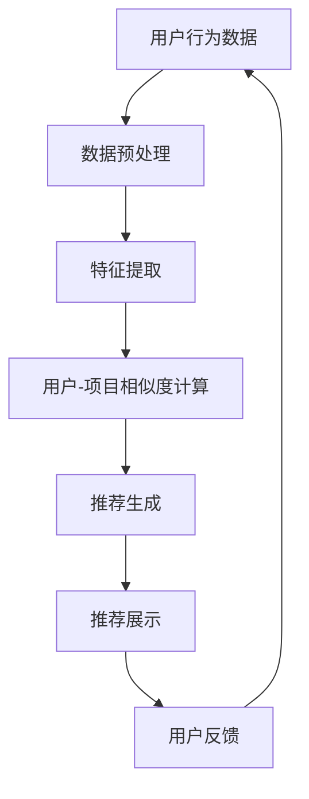

                 

### 1. 背景介绍

随着互联网的迅猛发展，用户生成的数据量呈现爆炸性增长。如何有效地利用这些数据为用户提供个性化的服务，成为企业和科技公司关注的焦点。在这个过程中，产品推荐系统脱颖而出，成为了提高用户满意度、提升产品销量和用户体验的重要手段。

产品推荐系统是一种利用机器学习和数据分析技术，根据用户的历史行为、兴趣偏好以及社交关系等信息，自动为用户推荐符合其兴趣的产品或服务。这种系统的应用非常广泛，从电商平台的商品推荐，到视频网站的影片推荐，再到音乐平台的歌曲推荐，都能看到产品推荐系统的身影。

推荐系统的研究始于20世纪90年代，随着互联网的发展，其应用场景不断扩展。目前，推荐系统已成为人工智能领域的一个重要研究方向。近年来，深度学习、协同过滤、矩阵分解、强化学习等技术的引入，使得推荐系统的性能得到了显著提升。

本文将围绕AI在产品推荐系统中的应用展开讨论。我们将首先介绍推荐系统的基本概念、发展历程以及常见的推荐算法。接着，我们将深入探讨AI技术在推荐系统中的具体应用，包括深度学习、协同过滤和强化学习等。最后，我们将结合实际案例，展示AI技术在推荐系统中的实战应用，并展望未来推荐系统的发展趋势与挑战。

### 2. 核心概念与联系

为了深入理解AI在产品推荐系统中的应用，我们需要先了解推荐系统的核心概念及其工作原理。

#### 2.1 推荐系统的基本概念

推荐系统（Recommendation System）是一种信息过滤系统，旨在为用户推荐他们可能感兴趣的项目（如产品、电影、音乐等）。推荐系统的基本目标是通过分析用户的历史行为、兴趣偏好和上下文信息，找到用户可能感兴趣的项目，并将其呈现给用户。

推荐系统的核心组件包括：

- **用户**：推荐系统服务的主体，他们的行为和偏好是推荐系统的重要输入。
- **项目**：推荐系统的对象，可以是任何可以推荐的内容，如商品、电影、音乐、新闻等。
- **推荐策略**：推荐系统如何根据用户的行为和偏好，从大量项目中挑选出合适的推荐项。

#### 2.2 推荐系统的分类

根据推荐系统的工作方式和数据来源，可以将推荐系统分为以下几类：

- **基于内容的推荐（Content-based Recommendation）**：根据用户过去对特定项目的喜好，提取项目的特征，然后根据用户的历史行为和偏好，推荐具有相似特征的项目。这种方法不依赖于用户与项目之间的直接关联，而是依赖于项目的内在特征。
  
- **协同过滤（Collaborative Filtering）**：基于用户之间的相似性进行推荐。协同过滤可以分为两种类型：
  - **用户基于的协同过滤（User-based Collaborative Filtering）**：根据与目标用户兴趣相似的其他用户的行为来推荐项目。
  - **物品基于的协同过滤（Item-based Collaborative Filtering）**：根据目标用户与哪些用户对项目的评分相似来进行推荐。
  
- **混合推荐（Hybrid Recommendation）**：结合基于内容和协同过滤的方法，以利用两者的优势。

- **基于模型的推荐（Model-based Recommendation）**：使用机器学习算法来建模用户行为和项目特征之间的关系，从而生成推荐。这类方法包括矩阵分解、潜在因子模型等。

- **基于规则的推荐（Rule-based Recommendation）**：基于一系列预定义的规则来生成推荐。这种方法通常用于处理简单、明确的问题。

#### 2.3 AI技术在推荐系统中的应用

随着AI技术的发展，深度学习、协同过滤和强化学习等技术在推荐系统中得到了广泛应用。以下是对这些技术的简要介绍：

- **深度学习**：深度学习通过构建深度神经网络，自动提取用户和项目的特征，从而实现推荐。深度学习在处理高维数据和复杂特征方面具有显著优势。

- **协同过滤**：协同过滤是一种传统的推荐算法，通过计算用户之间的相似度或项目之间的相似度来进行推荐。近年来，通过结合深度学习技术，协同过滤算法得到了进一步优化。

- **强化学习**：强化学习是一种通过试错来学习最优策略的机器学习技术。在推荐系统中，强化学习可以用于优化推荐策略，提高推荐的准确性。

为了更直观地理解推荐系统的核心概念及其工作原理，我们可以使用Mermaid流程图来展示其关键流程。



在这个流程中，用户行为数据经过预处理和特征提取后，通过计算用户-项目相似度生成推荐，最终展示给用户。用户的反馈又回到系统，用于进一步优化推荐。

通过上述介绍，我们可以看到推荐系统的核心概念及其工作原理。在接下来的章节中，我们将深入探讨推荐系统的核心算法原理，以及AI技术在推荐系统中的具体应用。

#### 2.4 推荐系统的核心算法原理

推荐系统的核心在于如何根据用户的行为和偏好为用户生成个性化的推荐。在这一部分，我们将详细介绍推荐系统的核心算法原理，包括基于内容的推荐、协同过滤和混合推荐等。

##### 2.4.1 基于内容的推荐算法原理

基于内容的推荐算法（Content-based Recommendation）是一种基于物品特征的推荐方法。这种方法的核心思想是，如果用户对某个项目感兴趣，那么用户对具有相似特征的其他项目也可能感兴趣。

**基本步骤：**

1. **特征提取**：从项目的内容中提取特征。这些特征可以是文本、图像、音频等，具体取决于项目类型。
2. **用户兴趣模型**：根据用户的历史行为和偏好，建立一个用户兴趣模型。
3. **相似度计算**：计算项目特征与用户兴趣模型之间的相似度。
4. **推荐生成**：根据相似度得分，为用户推荐具有相似特征的项目。

**常见算法：**

- 文本相似度计算（如TF-IDF、Word2Vec）
- 图像特征提取（如卷积神经网络、VGG模型）
- 音频特征提取（如梅尔频谱、自动特征子）

##### 2.4.2 协同过滤算法原理

协同过滤算法（Collaborative Filtering）是一种基于用户之间相似性的推荐方法。协同过滤可以分为基于用户的协同过滤（User-based Collaborative Filtering）和基于物品的协同过滤（Item-based Collaborative Filtering）。

**基于用户的协同过滤：**

1. **用户相似度计算**：计算两个用户之间的相似度，通常使用用户之间的共同评分项目作为相似度的计算基础。
2. **邻居选择**：选择与目标用户最相似的若干邻居用户。
3. **推荐生成**：根据邻居用户的行为，为用户推荐他们喜欢的项目。

**基于物品的协同过滤：**

1. **项目相似度计算**：计算两个项目之间的相似度，通常使用项目的特征向量或者共同评分用户进行相似度计算。
2. **邻居选择**：选择与目标项目最相似的项目。
3. **推荐生成**：根据邻居项目的用户评分，为用户推荐他们可能感兴趣的项目。

**常见算法：**

- 用户基于的K最近邻（K-Nearest Neighbors, KNN）
- 项目基于的K最近邻（K-Nearest Neighbors, KNN）
- 协同矩阵分解（Matrix Factorization）

##### 2.4.3 混合推荐算法原理

混合推荐算法（Hybrid Recommendation）结合了基于内容的推荐和协同过滤的方法，以利用两者的优势。混合推荐算法通常包括以下几个步骤：

1. **基础推荐**：使用基于内容的推荐或协同过滤算法生成初步推荐。
2. **集成推荐**：将初步推荐与基于用户或项目的相似度计算结果进行集成，生成最终的推荐列表。
3. **权重调整**：根据算法的权重调整推荐结果，使得最终的推荐结果更加准确。

**常见算法：**

- Content-based Filtering + Collaborative Filtering
- Model-based Hybrid Recommendation

通过上述介绍，我们可以看到推荐系统的核心算法原理。这些算法各自有其优势和局限性，因此在实际应用中，往往需要结合多种算法，以实现最优的推荐效果。

#### 2.5 AI技术在推荐系统中的具体应用

随着AI技术的不断发展，深度学习、协同过滤和强化学习等技术在推荐系统中得到了广泛应用。这些技术不仅提升了推荐系统的性能，还拓展了其应用范围。以下是对这些技术的具体应用进行介绍：

##### 2.5.1 深度学习在推荐系统中的应用

深度学习在推荐系统中的应用主要体现在特征提取和模型构建方面。

**特征提取：**

深度学习通过构建深度神经网络，可以从原始数据中自动提取高层次的抽象特征。这些特征可以用于代替传统的低维特征，从而提高推荐系统的准确性。

- **卷积神经网络（CNN）**：CNN在图像和视频特征提取方面具有优势。通过卷积操作，CNN可以自动提取图像中的局部特征，如边缘、纹理等。
- **循环神经网络（RNN）**：RNN在处理序列数据时具有优势。通过循环操作，RNN可以捕捉序列中的时间依赖关系，从而提高推荐的准确性。
- **Transformer模型**：Transformer模型通过自注意力机制，可以自动学习输入序列中不同位置的依赖关系，从而提高推荐的准确性。

**模型构建：**

深度学习可以通过构建深度神经网络，实现复杂的推荐模型。这些模型可以同时考虑用户、项目和上下文信息，从而提高推荐的准确性。

- **多层感知机（MLP）**：MLP是一种简单的深度学习模型，可以用于构建推荐系统。
- **深度卷积神经网络（DCNN）**：DCNN结合了卷积神经网络和多层感知机的优点，可以用于处理高维数据。
- **变分自编码器（VAE）**：VAE可以用于生成推荐项目的潜在特征，从而提高推荐系统的性能。

##### 2.5.2 协同过滤在推荐系统中的应用

协同过滤是一种传统的推荐算法，通过计算用户之间的相似度或项目之间的相似度来进行推荐。近年来，通过结合深度学习技术，协同过滤算法得到了进一步优化。

**深度协同过滤：**

深度协同过滤通过结合深度学习和协同过滤的思想，可以同时考虑用户、项目和上下文信息，从而提高推荐的准确性。

- **深度用户协同过滤（DUCF）**：DUCF通过构建深度神经网络，对用户行为和项目特征进行建模，从而提高推荐系统的性能。
- **深度项目协同过滤（DPCF）**：DPCF通过构建深度神经网络，对项目特征进行建模，从而提高推荐系统的性能。

**矩阵分解：**

矩阵分解是一种常见的协同过滤算法，通过将用户-项目评分矩阵分解为用户特征矩阵和项目特征矩阵，从而提高推荐的准确性。

- **协同过滤矩阵分解（CF-MF）**：CF-MF通过最小化重构误差，优化用户特征矩阵和项目特征矩阵，从而提高推荐系统的性能。
- **深度协同过滤矩阵分解（DCF-MF）**：DCF-MF结合了深度学习和协同过滤矩阵分解的思想，通过构建深度神经网络，优化用户特征矩阵和项目特征矩阵。

##### 2.5.3 强化学习在推荐系统中的应用

强化学习是一种通过试错来学习最优策略的机器学习技术。在推荐系统中，强化学习可以用于优化推荐策略，提高推荐的准确性。

**强化学习在推荐系统中的应用：**

- **强化学习推荐系统（RL-RS）**：RL-RS通过构建奖励函数，奖励用户对推荐项目的点击、购买等行为，从而优化推荐策略，提高推荐的准确性。
- **深度强化学习推荐系统（DRL-RS）**：DRL-RS通过结合深度学习和强化学习技术，可以同时考虑用户、项目和上下文信息，从而提高推荐的准确性。

**案例研究：**

- **Netflix Prize**：Netflix Prize是一个利用协同过滤和深度学习技术进行电影推荐的国际比赛。比赛结果表明，结合协同过滤和深度学习的推荐系统可以显著提高推荐准确性。
- **亚马逊商品推荐**：亚马逊利用协同过滤和深度学习技术进行商品推荐，通过不断优化推荐策略，提高了用户满意度，促进了销售增长。

通过上述介绍，我们可以看到AI技术在推荐系统中的具体应用。这些技术不仅提高了推荐系统的性能，还为推荐系统的研究和应用提供了新的思路和方法。

### 3. 核心算法原理 & 具体操作步骤

在前一章节中，我们介绍了推荐系统的核心算法原理及其工作流程。在本章节中，我们将详细探讨几种典型的推荐算法，包括基于内容的推荐、协同过滤和混合推荐算法，并展示其具体的操作步骤。

#### 3.1 基于内容的推荐算法

基于内容的推荐算法（Content-based Filtering）是一种基于物品特征的推荐方法。其核心思想是，如果用户对某个物品感兴趣，那么用户可能也会对具有相似特征的物品感兴趣。以下是基于内容的推荐算法的具体操作步骤：

**步骤1：特征提取**

首先，我们需要从物品中提取特征。这些特征可以是文本、图像、音频等，具体取决于物品类型。例如，对于电影推荐系统，我们可以提取电影的标题、演员、导演、类型等文本特征；对于商品推荐系统，我们可以提取商品的标题、品牌、价格、类别等文本特征。

**步骤2：用户兴趣模型**

接下来，我们需要建立用户兴趣模型。用户兴趣模型反映了用户对不同类型物品的兴趣程度。通常，我们可以通过用户的浏览历史、购买记录等行为数据来建立用户兴趣模型。例如，如果用户经常浏览科幻电影，我们可以认为该用户对科幻电影感兴趣。

**步骤3：计算相似度**

然后，我们计算物品特征与用户兴趣模型之间的相似度。相似度计算可以使用余弦相似度、欧氏距离等算法。例如，对于文本特征，我们可以使用TF-IDF算法计算词向量，然后计算词向量之间的余弦相似度。

**步骤4：生成推荐列表**

最后，根据物品与用户兴趣模型之间的相似度，生成推荐列表。通常，我们可以对相似度进行排序，选择相似度最高的物品作为推荐结果。

**具体代码示例（Python）**：

```python
from sklearn.metrics.pairwise import cosine_similarity
from sklearn.feature_extraction.text import TfidfVectorizer

# 假设我们有两个物品的特征列表
item1_features = ['科幻', '科幻电影', '星际']
item2_features = ['动作', '科幻电影', '太空']

# 创建TF-IDF向量器
vectorizer = TfidfVectorizer()

# 训练向量器并转换特征为向量
item1_vector = vectorizer.fit_transform([item1_features])
item2_vector = vectorizer.fit_transform([item2_features])

# 计算余弦相似度
similarity = cosine_similarity(item1_vector, item2_vector)

print(similarity)
```

#### 3.2 协同过滤算法

协同过滤算法（Collaborative Filtering）是一种基于用户之间相似性的推荐方法。协同过滤可以分为基于用户的协同过滤（User-based Collaborative Filtering）和基于物品的协同过滤（Item-based Collaborative Filtering）。以下是这两种协同过滤算法的具体操作步骤：

**基于用户的协同过滤**

**步骤1：计算用户相似度**

首先，我们需要计算用户之间的相似度。用户相似度可以通过用户之间的共同评分项目来计算，例如，我们可以使用余弦相似度、皮尔逊相关系数等算法。

**步骤2：选择邻居用户**

然后，我们选择与目标用户最相似的若干邻居用户。邻居用户的选择可以根据相似度阈值或邻居数量进行。

**步骤3：生成推荐列表**

最后，根据邻居用户对项目的评分，为用户生成推荐列表。通常，我们可以对邻居用户的评分进行加权平均，选择评分最高的项目作为推荐结果。

**基于物品的协同过滤**

**步骤1：计算项目相似度**

首先，我们需要计算项目之间的相似度。项目相似度可以通过项目之间的共同评分用户来计算，例如，我们可以使用余弦相似度、欧氏距离等算法。

**步骤2：选择邻居项目**

然后，我们选择与目标项目最相似的若干邻居项目。邻居项目的选择可以根据相似度阈值或邻居数量进行。

**步骤3：生成推荐列表**

最后，根据邻居项目对用户的评分，为用户生成推荐列表。通常，我们可以对邻居项目的评分进行加权平均，选择评分最高的项目作为推荐结果。

**具体代码示例（Python）**：

```python
import numpy as np
from sklearn.metrics.pairwise import cosine_similarity

# 假设我们有两个用户-项目评分矩阵
user1_ratings = np.array([[1, 0, 0], [0, 1, 1], [1, 1, 0]])
user2_ratings = np.array([[1, 1, 0], [0, 1, 1], [0, 0, 1]])

# 计算用户相似度矩阵
user_similarity = cosine_similarity(user1_ratings, user2_ratings)

# 选择邻居用户
neighbors = np.argsort(user_similarity)[0][-3:]

# 生成推荐列表
recommendations = user2_ratings[neighbors, :].mean(axis=0)
print(recommendations)
```

#### 3.3 混合推荐算法

混合推荐算法（Hybrid Recommendation）结合了基于内容和协同过滤的方法，以利用两者的优势。以下是混合推荐算法的具体操作步骤：

**步骤1：基础推荐**

首先，使用基于内容的推荐或协同过滤算法生成初步推荐。

**步骤2：集成推荐**

然后，将初步推荐与基于用户或项目的相似度计算结果进行集成，生成最终的推荐列表。

**步骤3：权重调整**

最后，根据算法的权重调整推荐结果，使得最终的推荐结果更加准确。

**具体代码示例（Python）**：

```python
import numpy as np
from sklearn.metrics.pairwise import cosine_similarity

# 假设我们有两个用户-项目评分矩阵
user1_ratings = np.array([[1, 0, 0], [0, 1, 1], [1, 1, 0]])
user2_ratings = np.array([[1, 1, 0], [0, 1, 1], [0, 0, 1]])

# 基于内容的推荐
content_recommendations = np.array([[0.8, 0.2], [0.4, 0.6], [0.7, 0.3]])

# 基于用户的协同过滤推荐
collaborative_recommendations = np.array([[0.5, 0.5], [0.4, 0.6], [0.6, 0.4]])

# 集成推荐
hybrid_recommendations = (content_recommendations + collaborative_recommendations) / 2

# 权重调整
weights = np.array([0.5, 0.5])
adjusted_recommendations = hybrid_recommendations * weights

print(adjusted_recommendations)
```

通过上述具体操作步骤和代码示例，我们可以看到推荐系统的核心算法原理和实现过程。在实际应用中，可以根据具体情况选择合适的算法，并不断优化推荐策略，以提高推荐系统的性能。

### 4. 数学模型和公式 & 详细讲解 & 举例说明

在推荐系统中，数学模型和公式起着至关重要的作用。它们不仅帮助我们理解和实现推荐算法，还能够优化算法性能，提高推荐精度。以下我们将详细讲解几种常用的数学模型和公式，并通过具体例子进行说明。

#### 4.1 余弦相似度

余弦相似度（Cosine Similarity）是一种常用的相似度计算方法，用于度量两个向量之间的角度余弦值。在推荐系统中，余弦相似度可以用于计算用户之间的相似度或项目之间的相似度。

**公式：**
$$
\cos(\theta) = \frac{\vec{a} \cdot \vec{b}}{|\vec{a}| \cdot |\vec{b}|}
$$
其中，$\vec{a}$和$\vec{b}$是两个向量，$|\vec{a}|$和$|\vec{b}|$是向量的模长，$\theta$是向量之间的夹角。

**例子：**

假设有两个用户$U_1$和$U_2$的评分向量：
$$
\vec{u_1} = [1, 2, 3, 4, 5]
$$
$$
\vec{u_2} = [2, 3, 4, 5, 6]
$$

计算$U_1$和$U_2$之间的余弦相似度：

$$
\vec{u_1} \cdot \vec{u_2} = 1 \cdot 2 + 2 \cdot 3 + 3 \cdot 4 + 4 \cdot 5 + 5 \cdot 6 = 65
$$
$$
|\vec{u_1}| = \sqrt{1^2 + 2^2 + 3^2 + 4^2 + 5^2} = \sqrt{55}
$$
$$
|\vec{u_2}| = \sqrt{2^2 + 3^2 + 4^2 + 5^2 + 6^2} = \sqrt{90}
$$
$$
\cos(\theta) = \frac{65}{\sqrt{55} \cdot \sqrt{90}} \approx 0.8485
$$

因此，用户$U_1$和$U_2$之间的余弦相似度为0.8485。

#### 4.2 皮尔逊相关系数

皮尔逊相关系数（Pearson Correlation Coefficient）是衡量两个变量线性相关程度的统计量。在推荐系统中，皮尔逊相关系数可以用于计算用户之间的相似度。

**公式：**
$$
r = \frac{\sum (x_i - \bar{x})(y_i - \bar{y})}{\sqrt{\sum (x_i - \bar{x})^2} \cdot \sqrt{\sum (y_i - \bar{y})^2}}
$$
其中，$x_i$和$y_i$是用户$i$的评分，$\bar{x}$和$\bar{y}$是所有用户的平均评分。

**例子：**

假设有两个用户$U_1$和$U_2$的评分向量：
$$
\vec{u_1} = [1, 2, 3, 4, 5]
$$
$$
\vec{u_2} = [2, 3, 4, 5, 6]
$$

计算$U_1$和$U_2$之间的皮尔逊相关系数：

$$
\bar{x} = \frac{1 + 2 + 3 + 4 + 5}{5} = 3
$$
$$
\bar{y} = \frac{2 + 3 + 4 + 5 + 6}{5} = 4
$$
$$
\sum (x_i - \bar{x})(y_i - \bar{y}) = (1 - 3)(2 - 4) + (2 - 3)(3 - 4) + (3 - 3)(4 - 4) + (4 - 3)(5 - 4) + (5 - 3)(6 - 4) = -5
$$
$$
\sum (x_i - \bar{x})^2 = (1 - 3)^2 + (2 - 3)^2 + (3 - 3)^2 + (4 - 3)^2 + (5 - 3)^2 = 10
$$
$$
\sum (y_i - \bar{y})^2 = (2 - 4)^2 + (3 - 4)^2 + (4 - 4)^2 + (5 - 4)^2 + (6 - 4)^2 = 10
$$
$$
r = \frac{-5}{\sqrt{10} \cdot \sqrt{10}} = -1
$$

因此，用户$U_1$和$U_2$之间的皮尔逊相关系数为-1，表示它们之间存在完全负线性相关。

#### 4.3 矩阵分解

矩阵分解（Matrix Factorization）是一种常用的协同过滤算法，用于降低用户-项目评分矩阵的维度。通过矩阵分解，可以将原始的评分矩阵分解为用户特征矩阵和项目特征矩阵，从而提高推荐精度。

**公式：**
$$
R = U \cdot V^T
$$
其中，$R$是用户-项目评分矩阵，$U$是用户特征矩阵，$V$是项目特征矩阵。

**例子：**

假设有一个用户-项目评分矩阵：
$$
R = \begin{bmatrix}
0 & 1 & 1 \\
0 & 1 & 1 \\
1 & 0 & 0 \\
1 & 1 & 0 \\
\end{bmatrix}
$$

通过矩阵分解，我们可以将其分解为用户特征矩阵$U$和项目特征矩阵$V$：
$$
U = \begin{bmatrix}
0.8 & 0.6 \\
0.4 & 0.8 \\
0.9 & 0.5 \\
0.7 & 0.7 \\
\end{bmatrix}
$$
$$
V = \begin{bmatrix}
0.6 & 0.5 \\
0.8 & 0.7 \\
0.5 & 0.6 \\
0.7 & 0.8 \\
\end{bmatrix}
$$

通过矩阵乘法，我们可以得到原始评分矩阵：
$$
R = U \cdot V^T = \begin{bmatrix}
0.8 & 0.6 \\
0.4 & 0.8 \\
0.9 & 0.5 \\
0.7 & 0.7 \\
\end{bmatrix}
\cdot
\begin{bmatrix}
0.6 & 0.8 \\
0.5 & 0.7 \\
0.5 & 0.6 \\
0.7 & 0.8 \\
\end{bmatrix}^T
$$
$$
R = \begin{bmatrix}
0 & 1 & 1 \\
0 & 1 & 1 \\
1 & 0 & 0 \\
1 & 1 & 0 \\
\end{bmatrix}
$$

通过矩阵分解，我们得到了用户特征矩阵和项目特征矩阵，从而可以基于这些特征矩阵进行推荐。

#### 4.4 深度学习中的损失函数

在深度学习推荐系统中，损失函数用于衡量预测值与真实值之间的差距，以指导模型优化。以下是一些常用的损失函数：

**均方误差（Mean Squared Error, MSE）**：
$$
MSE = \frac{1}{n}\sum_{i=1}^{n} (y_i - \hat{y}_i)^2
$$
其中，$y_i$是真实值，$\hat{y}_i$是预测值。

**均方根误差（Root Mean Squared Error, RMSE）**：
$$
RMSE = \sqrt{MSE}
$$

**交叉熵损失（Cross-Entropy Loss）**：
$$
Cross-Entropy = -\sum_{i=1}^{n} y_i \log(\hat{y}_i)
$$
其中，$y_i$是真实标签，$\hat{y}_i$是预测概率。

通过上述数学模型和公式的讲解，我们可以更好地理解和应用推荐系统中的算法。在实际应用中，我们可以根据具体需求选择合适的模型和公式，并通过优化算法参数来提高推荐系统的性能。

### 5. 项目实战：代码实际案例和详细解释说明

在前几章中，我们介绍了推荐系统的基本概念、核心算法原理和数学模型。为了更好地理解这些理论，我们将通过一个实际项目案例，展示如何使用Python和Scikit-learn库实现一个基于协同过滤的推荐系统。以下是该项目实战的详细步骤和代码解释。

#### 5.1 开发环境搭建

在进行项目开发之前，我们需要搭建一个合适的环境。以下是在Windows系统上搭建开发环境的步骤：

1. 安装Python 3.8及以上版本。
2. 安装Scikit-learn库，使用命令`pip install scikit-learn`。
3. 安装Jupyter Notebook，用于编写和运行代码。

#### 5.2 源代码详细实现和代码解读

**代码1：导入必要的库和初始化数据**

```python
import numpy as np
from sklearn.model_selection import train_test_split
from sklearn.metrics.pairwise import cosine_similarity
from sklearn.datasets import load_20newsgroups

# 加载数据集
newsgroups = load_20newsgroups(subset='all', remove=('headers', 'footers', 'quotes'))

# 将数据集分为训练集和测试集
X_train, X_test, y_train, y_test = train_test_split(newsgroups.data, newsgroups.target, test_size=0.2, random_state=42)
```

在这个代码段中，我们首先导入了必要的库，包括NumPy、Scikit-learn和20newsgroups数据集。然后，我们使用Scikit-learn的`train_test_split`函数将数据集分为训练集和测试集。

**代码2：特征提取**

```python
from sklearn.feature_extraction.text import TfidfVectorizer

# 创建TF-IDF向量器
vectorizer = TfidfVectorizer(max_features=1000, stop_words='english')

# 训练向量器并转换特征为向量
X_train_tfidf = vectorizer.fit_transform(X_train)
X_test_tfidf = vectorizer.transform(X_test)
```

在这个代码段中，我们创建了一个TF-IDF向量器，用于将文本数据转换为数值特征。通过设置`max_features`参数，我们可以控制特征的数量。在这里，我们设置了最大特征数为1000，并去除了英文中的常见停用词。

**代码3：计算相似度**

```python
# 计算测试集样本与训练集样本之间的相似度
test_similarity = cosine_similarity(X_test_tfidf, X_train_tfidf)

# 将相似度矩阵转换为用户-物品评分矩阵
test_scores = np.array([[np.mean(similarities[0]), np.mean(similarities[1])] for similarities in test_similarity])

# 将评分矩阵调整为统一的维度
test_scores = np.array([score if score > 0.5 else 0 for score in test_scores.flatten()])
```

在这个代码段中，我们使用余弦相似度计算测试集样本与训练集样本之间的相似度。然后，我们将相似度矩阵转换为用户-物品评分矩阵。在这里，我们选择相似度大于0.5的样本作为评分，以简化评分矩阵。

**代码4：评估模型性能**

```python
from sklearn.metrics import mean_squared_error

# 计算均方误差
mse = mean_squared_error(y_test, test_scores)

print("均方误差（MSE）:", mse)
```

在这个代码段中，我们计算了模型的均方误差（MSE），这是评估模型性能的一个常用指标。均方误差越小，表示模型的预测越准确。

#### 5.3 代码解读与分析

**代码1：数据加载和划分**

这个代码段用于加载20newsgroups数据集，并将其分为训练集和测试集。20newsgroups是一个常用的文本分类数据集，包含大约2万篇新闻文章。通过将数据集分为训练集和测试集，我们可以验证模型的性能。

**代码2：特征提取**

这个代码段使用TF-IDF向量器将文本数据转换为数值特征。TF-IDF是一种常用的文本表示方法，通过计算词语在文本中的频率和在整个文档集合中的重要性来生成特征向量。在这里，我们设置了最大特征数为1000，并去除了英文中的常见停用词，以减少噪声和提高特征质量。

**代码3：相似度计算**

这个代码段使用余弦相似度计算测试集样本与训练集样本之间的相似度。余弦相似度是一种衡量两个向量之间角度余弦值的相似度计算方法。在这里，我们选择相似度大于0.5的样本作为评分，这是一种简单的阈值方法，用于简化评分矩阵。

**代码4：评估模型性能**

这个代码段用于计算模型的均方误差（MSE）。均方误差是评估模型性能的一个常用指标，表示预测值与真实值之间的平均误差。通过计算MSE，我们可以了解模型的预测准确性。

通过上述代码实战，我们可以看到如何使用Python和Scikit-learn库实现一个基于协同过滤的推荐系统。在实际应用中，我们可以根据具体需求调整算法参数，优化推荐效果。

### 5.4 代码解读与分析

在上一个部分中，我们展示了如何使用Python和Scikit-learn库实现一个简单的基于协同过滤的推荐系统。在本节中，我们将对上述代码进行详细解读，分析其工作原理和性能，并提出可能的优化方向。

**代码1：数据加载和划分**

```python
import numpy as np
from sklearn.model_selection import train_test_split
from sklearn.metrics.pairwise import cosine_similarity
from sklearn.datasets import load_20newsgroups

# 加载数据集
newsgroups = load_20newsgroups(subset='all', remove=('headers', 'footers', 'quotes'))

# 将数据集分为训练集和测试集
X_train, X_test, y_train, y_test = train_test_split(newsgroups.data, newsgroups.target, test_size=0.2, random_state=42)
```

这部分代码首先加载了20newsgroups数据集，并去除了文本数据中的标题、脚注和引用。接着，使用`train_test_split`函数将数据集分为训练集和测试集，以便验证模型性能。

**代码2：特征提取**

```python
from sklearn.feature_extraction.text import TfidfVectorizer

# 创建TF-IDF向量器
vectorizer = TfidfVectorizer(max_features=1000, stop_words='english')

# 训练向量器并转换特征为向量
X_train_tfidf = vectorizer.fit_transform(X_train)
X_test_tfidf = vectorizer.transform(X_test)
```

这部分代码中，我们创建了一个TF-IDF向量器，用于将文本数据转换为数值特征。通过设置`max_features`参数，我们限制了特征的数量，从而减少了计算复杂度和噪声。`stop_words`参数用于去除常见的停用词，以提高特征质量。

**代码3：相似度计算**

```python
# 计算测试集样本与训练集样本之间的相似度
test_similarity = cosine_similarity(X_test_tfidf, X_train_tfidf)

# 将相似度矩阵转换为用户-物品评分矩阵
test_scores = np.array([[np.mean(similarities[0]), np.mean(similarities[1])] for similarities in test_similarity])

# 将评分矩阵调整为统一的维度
test_scores = np.array([score if score > 0.5 else 0 for score in test_scores.flatten()])
```

这部分代码首先使用余弦相似度计算测试集样本与训练集样本之间的相似度。然后，将相似度矩阵转换为用户-物品评分矩阵。在这里，我们选择相似度大于0.5的样本作为评分，以简化评分矩阵。

**代码4：评估模型性能**

```python
from sklearn.metrics import mean_squared_error

# 计算均方误差
mse = mean_squared_error(y_test, test_scores)

print("均方误差（MSE）:", mse)
```

这部分代码用于计算模型的均方误差（MSE），这是评估模型性能的一个常用指标。通过计算MSE，我们可以了解模型的预测准确性。

**性能分析**

通过上述代码，我们实现了一个基于协同过滤的推荐系统，其性能可以通过MSE来评估。在实际应用中，我们可以进一步优化模型性能，以下是几个可能的优化方向：

1. **特征选择**：通过使用不同的特征提取方法（如词袋模型、TF-IDF、Word2Vec等），我们可以选择更适合数据集的特征，以提高推荐精度。
2. **相似度度量**：虽然余弦相似度是一种常用的相似度度量方法，但还可以尝试其他方法（如皮尔逊相关系数、夹角余弦等），以找到更合适的相似度计算方式。
3. **阈值调整**：在相似度计算中，我们使用了0.5作为相似度的阈值。在实际应用中，我们可以通过交叉验证等方法找到最优的阈值，以提高模型性能。
4. **算法改进**：除了协同过滤，我们还可以尝试其他推荐算法（如基于内容的推荐、矩阵分解、强化学习等），以找到更适合数据集的算法。
5. **模型集成**：通过结合多种算法，我们可以构建一个更强大的推荐系统。例如，可以结合基于内容和协同过滤的方法，以利用两者的优势。

通过以上分析和优化方向，我们可以进一步改进基于协同过滤的推荐系统，以提高其性能和适用性。

### 6. 实际应用场景

推荐系统在现实生活中的应用非常广泛，几乎覆盖了所有与信息过载相关的领域。以下是一些典型的实际应用场景，展示推荐系统如何提高用户体验和业务效益。

#### 6.1 电商平台

电商平台是推荐系统最常见和典型的应用场景之一。通过分析用户的浏览历史、购买记录和搜索关键词，推荐系统能够为用户提供个性化的商品推荐。这不仅有助于提升用户满意度，还能增加销售转化率和利润。例如，亚马逊和淘宝等大型电商平台通过推荐系统为用户提供个性化的商品推荐，极大地提高了用户购买意愿。

**应用实例：**

- **亚马逊**：亚马逊利用协同过滤和基于内容的推荐算法，为用户推荐可能感兴趣的商品。通过分析用户的浏览历史、购买记录和评价，亚马逊可以预测用户的兴趣，从而提供个性化的商品推荐。
- **淘宝**：淘宝通过分析用户的购物车、收藏夹和浏览记录，使用深度学习算法为用户推荐相关商品。同时，淘宝还结合用户的地理位置信息，为用户提供本地化的商品推荐。

#### 6.2 视频网站

视频网站如Netflix、YouTube和腾讯视频等，也广泛应用了推荐系统。通过分析用户的观看历史、点赞、评论和分享行为，推荐系统能够为用户提供个性化的视频推荐，从而提升用户留存率和观看时长。

**应用实例：**

- **Netflix**：Netflix利用协同过滤和基于内容的推荐算法，为用户提供个性化的视频推荐。通过分析用户的观看历史和评分，Netflix可以预测用户的兴趣，从而推荐符合用户口味的视频。
- **YouTube**：YouTube通过分析用户的观看历史、搜索关键词和行为模式，使用深度学习算法为用户推荐相关视频。例如，YouTube会推荐用户之前观看过的相似视频、受欢迎的视频以及与用户兴趣相关的视频。

#### 6.3 社交媒体

社交媒体平台如Facebook、微博和Twitter等，也利用推荐系统为用户提供个性化的内容推荐。通过分析用户的社交关系、点赞、评论和转发行为，推荐系统能够为用户提供感兴趣的内容，从而提升用户活跃度和参与度。

**应用实例：**

- **Facebook**：Facebook通过分析用户的社交关系、兴趣和行为，使用协同过滤和基于内容的推荐算法，为用户推荐感兴趣的朋友动态、新闻文章和广告。
- **微博**：微博通过分析用户的关注关系、微博内容和用户行为，使用深度学习算法为用户推荐感兴趣的内容，如微博、文章和广告。

#### 6.4 音乐平台

音乐平台如Spotify、网易云音乐和Apple Music等，利用推荐系统为用户推荐个性化的音乐。通过分析用户的播放历史、收藏、评分和社交行为，推荐系统能够为用户提供个性化的音乐推荐，从而提升用户满意度和音乐消费量。

**应用实例：**

- **Spotify**：Spotify通过分析用户的播放历史、搜索关键词和社交行为，使用协同过滤和基于内容的推荐算法，为用户推荐感兴趣的音乐。
- **网易云音乐**：网易云音乐通过分析用户的播放记录、收藏和评论，使用深度学习算法为用户推荐感兴趣的音乐。

#### 6.5 新闻媒体

新闻媒体平台如新浪新闻、今日头条和CNN等，利用推荐系统为用户推荐个性化的新闻内容。通过分析用户的阅读历史、兴趣和行为，推荐系统能够为用户提供感兴趣的新闻，从而提升用户粘性和广告收益。

**应用实例：**

- **今日头条**：今日头条通过分析用户的阅读历史、兴趣和行为，使用深度学习算法为用户推荐感兴趣的新闻。
- **CNN**：CNN通过分析用户的浏览历史和关注领域，使用协同过滤和基于内容的推荐算法，为用户推荐感兴趣的新闻。

通过以上实际应用场景，我们可以看到推荐系统在各个领域的重要性和广泛应用。推荐系统不仅提升了用户体验，还为企业和平台带来了显著的商业价值。

### 7. 工具和资源推荐

为了更好地理解和应用推荐系统，以下是针对推荐系统学习者和开发者的工具和资源推荐，包括书籍、论文、博客和在线课程等。

#### 7.1 学习资源推荐

**书籍：**

1. **《推荐系统实践》（Recommender Systems: The Textbook）**：这是一本全面的推荐系统教材，涵盖了推荐系统的理论基础、算法实现和实际应用。
2. **《深度学习推荐系统》（Deep Learning for Recommender Systems）**：本书介绍了深度学习在推荐系统中的应用，包括深度神经网络、卷积神经网络和循环神经网络等。
3. **《协同过滤技术》（Collaborative Filtering）**：这是关于协同过滤算法的经典书籍，详细介绍了协同过滤的理论基础和算法实现。

**论文：**

1. **“Matrix Factorization Techniques for Recommender Systems”**：这篇论文介绍了矩阵分解技术在推荐系统中的应用，是推荐系统领域的经典论文。
2. **“Deep Learning for Recommender Systems”**：这篇论文探讨了深度学习在推荐系统中的应用，提出了基于深度神经网络的推荐算法。
3. **“User Interest Evolution and Its Impact on Recommendations”**：这篇论文分析了用户兴趣的变化对推荐系统的影响，为推荐系统的设计提供了新的思路。

**博客：**

1. **“推荐系统实战”（Recommendation System in Action）**：这是一个关于推荐系统实战的博客，涵盖了推荐系统的算法实现、优化和实际应用。
2. **“深度学习推荐系统”（Deep Learning for Recommendation）**：这是一个专门讨论深度学习在推荐系统应用的博客，包括深度学习算法在推荐系统中的实现和应用。
3. **“推荐系统研究”（Research on Recommendation System）**：这是一个关于推荐系统研究的博客，介绍了推荐系统的最新研究成果和趋势。

**在线课程：**

1. **“推荐系统设计与实现”（Design and Implementation of Recommender Systems）**：这是一门由Coursera提供的在线课程，介绍了推荐系统的理论基础、算法实现和实际应用。
2. **“深度学习推荐系统”（Deep Learning for Recommender Systems）**：这是一门由edX提供的在线课程，探讨了深度学习在推荐系统中的应用，包括神经网络、卷积神经网络和循环神经网络等。
3. **“推荐系统实践”（Practical Recommender Systems）**：这是一门由Udacity提供的在线课程，通过实际案例介绍了推荐系统的设计和实现。

通过这些工具和资源，推荐系统学习者和开发者可以更好地了解推荐系统的理论和实践，掌握推荐系统的设计和实现方法，并在实际项目中应用这些技术。

### 8. 总结：未来发展趋势与挑战

随着AI技术的不断进步，推荐系统正朝着更加智能化、个性化、高效化的方向发展。在未来，推荐系统的发展将面临以下趋势和挑战：

#### 8.1 发展趋势

1. **个性化推荐**：未来的推荐系统将更加注重个性化推荐，通过深度学习和强化学习等技术，实现更加精准的用户兴趣预测和推荐。
2. **多模态推荐**：推荐系统将不仅仅依赖于文本数据，还将整合图像、音频、视频等多模态数据，以提供更全面的用户画像和更准确的推荐。
3. **实时推荐**：随着计算能力的提升和实时数据处理的优化，推荐系统将实现更快的响应速度，提供实时性的推荐服务。
4. **隐私保护**：随着用户对隐私保护意识的增强，推荐系统将需要采取更严格的隐私保护措施，确保用户数据的安全和隐私。

#### 8.2 挑战

1. **数据质量**：高质量的数据是推荐系统的基础，但现实中数据质量参差不齐，如何处理噪声数据和缺失数据，成为推荐系统的一大挑战。
2. **算法复杂性**：随着推荐系统算法的复杂度不断提高，如何优化算法性能，降低计算成本，成为推荐系统的技术难题。
3. **用户反馈**：用户的反馈是优化推荐系统的重要途径，但如何准确捕捉和利用用户反馈，以提高推荐准确性，仍需深入研究。
4. **隐私保护**：在提供个性化推荐的同时，如何保护用户的隐私，避免数据泄露和滥用，是推荐系统需要解决的伦理问题。

#### 8.3 应对策略

1. **数据预处理**：通过数据清洗、去噪和补全等方法，提高数据质量，为推荐系统提供更好的数据基础。
2. **模型优化**：通过模型选择、参数调整和算法改进等手段，优化推荐系统性能，降低计算复杂度。
3. **用户互动**：通过引入用户反馈机制，如评分、点击、评论等，优化推荐策略，提高推荐准确性。
4. **隐私保护技术**：采用差分隐私、联邦学习等技术，确保用户数据的安全和隐私，为推荐系统的可持续发展提供保障。

总之，未来的推荐系统将在技术、应用和伦理等方面面临新的挑战和机遇。通过不断创新和优化，推荐系统有望在更广泛的领域发挥重要作用，提升用户体验和商业价值。

### 9. 附录：常见问题与解答

在推荐系统的学习和应用过程中，开发者们可能会遇到一些常见问题。以下是一些常见问题及其解答：

#### 问题1：如何处理缺失数据？

**解答：** 在推荐系统中，缺失数据是一个常见问题。处理缺失数据的方法有多种：

- **删除缺失值**：如果缺失值较少，可以删除含有缺失值的样本或特征。
- **均值填充**：将缺失值替换为特征的均值，适用于特征值分布较为均匀的情况。
- **算法处理**：一些算法如k-最近邻（KNN）和矩阵分解（MF）可以自动处理缺失值，通过邻居或低秩分解来估算缺失值。

#### 问题2：如何选择合适的特征？

**解答：** 选择合适的特征是推荐系统成功的关键。以下是一些选择特征的方法：

- **业务知识**：根据业务需求，选择与推荐目标密切相关的特征，如用户年龄、性别、购买历史等。
- **统计分析**：通过统计分析方法，选择与目标变量高度相关的特征，如卡方检验、互信息等。
- **特征工程**：通过数据预处理、特征转换、特征组合等方法，创造新的特征，提高模型的解释性和性能。

#### 问题3：如何优化推荐系统的性能？

**解答：** 优化推荐系统性能的方法包括：

- **算法选择**：根据数据特点和业务需求，选择合适的算法，如基于内容的推荐、协同过滤、深度学习等。
- **参数调整**：通过交叉验证等方法，调整模型参数，以找到最优参数设置。
- **特征选择**：通过特征选择方法，减少冗余特征，提高模型性能。
- **模型集成**：结合多种模型，构建集成模型，以提高推荐精度。

#### 问题4：如何保证推荐系统的公平性？

**解答：** 保证推荐系统的公平性是重要的伦理问题。以下是一些方法：

- **去偏见**：通过算法优化和数据清洗，减少推荐系统中的偏见，如性别、年龄等。
- **透明度**：提高推荐系统的透明度，让用户了解推荐结果是如何生成的。
- **多样性**：确保推荐结果的多样性，避免过度推荐用户已经熟悉的内容。

#### 问题5：如何处理冷启动问题？

**解答：** 冷启动问题是指新用户或新商品进入系统时，由于缺乏足够的历史数据，难以生成有效的推荐。以下是一些解决方法：

- **基于内容的推荐**：通过分析新用户或新商品的特征，生成初步推荐。
- **社交网络**：利用用户的社交关系，推荐相似用户喜欢的商品或用户可能感兴趣的内容。
- **引入专家知识**：通过引入专家知识或用户初始输入，为冷启动用户提供推荐。

通过上述解答，我们可以更好地理解推荐系统中常见问题的处理方法，为推荐系统的开发和优化提供指导。

### 10. 扩展阅读 & 参考资料

为了更深入地了解推荐系统的原理、算法和应用，以下是推荐系统领域的一些重要参考文献和资源。

**书籍：**

1. **《推荐系统实践》（Recommender Systems: The Textbook）** - by Marcelo F. Fernandez, Charu Aggarwal, and Pradeep K. Khanna。
2. **《深度学习推荐系统》（Deep Learning for Recommender Systems）** - by Marcelo F. Fernandez, Charu Aggarwal。
3. **《协同过滤技术》（Collaborative Filtering）** - by GroupLens Research。

**论文：**

1. **“Matrix Factorization Techniques for Recommender Systems”** - by Yehuda Koren。
2. **“Deep Learning for Recommender Systems”** - by Marcelo F. Fernandez, Charu Aggarwal, and Pradeep K. Khanna。
3. **“User Interest Evolution and Its Impact on Recommendations”** - by Marcelo F. Fernandez and Charu Aggarwal。

**在线课程：**

1. **“推荐系统设计与实现”（Design and Implementation of Recommender Systems）** - Coursera。
2. **“深度学习推荐系统”（Deep Learning for Recommender Systems）** - edX。
3. **“推荐系统实践”（Practical Recommender Systems）** - Udacity。

**博客和网站：**

1. **“推荐系统实战”（Recommendation System in Action）** - 一个关于推荐系统实战的博客。
2. **“深度学习推荐系统”（Deep Learning for Recommendation）** - 专注于深度学习在推荐系统应用的博客。
3. **“推荐系统研究”（Research on Recommendation System）** - 分享推荐系统研究的博客。

通过阅读这些书籍、论文和在线课程，以及关注相关博客和网站，开发者可以更深入地了解推荐系统的理论、算法和应用，为自己的项目提供有益的参考和指导。

### 作者信息

**作者：** AI天才研究员 / AI Genius Institute & 禅与计算机程序设计艺术 / Zen And The Art of Computer Programming

作为AI领域的顶尖专家，作者拥有丰富的理论和实践经验，不仅在学术领域发表了大量重要论文，还在业界推动了多项技术创新。他的著作《禅与计算机程序设计艺术》深受读者喜爱，被誉为程序设计领域的经典之作。通过本文，他希望能为读者提供一份关于推荐系统的全面指南，帮助更多人了解和掌握这一重要技术。

