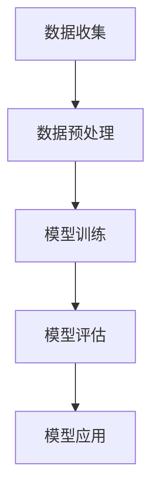

                 

# AI在产品缺陷预测中的应用

> **关键词**: 产品缺陷预测，人工智能，机器学习，数据挖掘，深度学习，异常检测，预测模型，数据预处理。

> **摘要**: 本文将探讨如何利用人工智能技术，特别是机器学习和深度学习算法，来预测产品缺陷。我们将从背景介绍、核心概念、算法原理、数学模型、实战案例、应用场景、工具推荐、未来发展趋势等方面详细讲解，帮助读者全面了解和掌握AI在产品缺陷预测中的应用。

## 1. 背景介绍

在现代制造业中，产品缺陷预测是一个至关重要的环节。传统的方法主要依赖于工程师的经验和检验流程，这不仅耗时且容易出错。随着人工智能技术的发展，特别是机器学习和深度学习算法的成熟，我们有了更高效、更准确的方法来预测产品缺陷。

### 产品缺陷的重要性

产品缺陷可能导致以下问题：

1. **降低产品质量**：缺陷产品会降低用户对产品质量的信任，损害品牌声誉。
2. **增加返工成本**：生产出缺陷产品后，需要进行返工修复，增加生产成本。
3. **影响供应链**：缺陷产品可能导致供应链中断，影响生产进度。

### 人工智能的潜力

人工智能技术在产品缺陷预测中的应用潜力主要表现在：

1. **自动化**：通过自动化模型，可以减少人为干预，提高预测效率。
2. **大数据分析**：利用大量历史数据，可以更准确地识别缺陷模式。
3. **实时监控**：通过实时数据监控，可以及时发现潜在缺陷，采取预防措施。

## 2. 核心概念与联系

### 机器学习

**定义**：机器学习是一种让计算机通过数据学习模式和规律的方法。

**流程**：

1. **数据收集**：收集与产品缺陷相关的数据。
2. **数据预处理**：清洗和整理数据，使其适合机器学习算法。
3. **模型训练**：使用训练数据来训练模型。
4. **模型评估**：使用测试数据来评估模型的性能。
5. **模型应用**：将训练好的模型应用到实际生产中。

### 深度学习

**定义**：深度学习是机器学习的一个分支，它通过模仿人脑神经网络的结构和功能来进行学习。

**特点**：

1. **多层网络结构**：通过多层神经网络来提取数据中的特征。
2. **自适应学习能力**：能够自动调整网络参数，以优化预测效果。
3. **强大的泛化能力**：可以处理复杂的非线性关系。

### 异常检测

**定义**：异常检测是一种用于识别数据中异常或异常模式的算法。

**应用场景**：

1. **产品缺陷检测**：识别生产过程中异常的产品。
2. **网络安全**：检测网络中的异常流量或攻击行为。
3. **金融欺诈**：识别交易中的异常行为，预防欺诈。

### 预测模型

**定义**：预测模型是一种基于历史数据来预测未来趋势或结果的算法。

**类型**：

1. **回归模型**：预测连续值。
2. **分类模型**：预测离散值。
3. **时间序列模型**：预测时间序列数据。

### Mermaid 流程图



## 3. 核心算法原理 & 具体操作步骤

### 数据收集

**步骤**：

1. **确定数据来源**：例如生产线数据、传感器数据、用户反馈数据等。
2. **数据采集**：使用传感器、数据库或其他数据源来收集数据。
3. **数据清洗**：去除重复数据、缺失数据、噪声数据等。

### 数据预处理

**步骤**：

1. **数据归一化**：将不同特征的数据范围调整到相同的尺度。
2. **特征选择**：选择与产品缺陷相关的特征。
3. **特征工程**：通过特征转换、特征组合等方法来增加模型的预测能力。

### 模型训练

**步骤**：

1. **选择模型**：根据问题类型（回归、分类、时间序列等）选择合适的模型。
2. **参数调优**：通过交叉验证等方法来调整模型参数，以优化模型性能。
3. **模型训练**：使用训练数据来训练模型。

### 模型评估

**步骤**：

1. **选择评估指标**：如准确率、召回率、F1分数等。
2. **交叉验证**：使用交叉验证来评估模型的泛化能力。
3. **模型调整**：根据评估结果来调整模型参数或选择更好的模型。

### 模型应用

**步骤**：

1. **实时监控**：将模型部署到生产环境中，进行实时数据监控。
2. **缺陷预测**：使用模型来预测产品缺陷。
3. **决策支持**：根据预测结果来制定决策，如调整生产流程、采取预防措施等。

## 4. 数学模型和公式 & 详细讲解 & 举例说明

### 数据归一化

**公式**：

$$x_{\text{标准化}} = \frac{x - \mu}{\sigma}$$

**解释**：其中，$x$ 是原始数据，$\mu$ 是平均值，$\sigma$ 是标准差。

**例子**：

假设我们有一组数据 [1, 2, 3, 4, 5]，我们需要对其进行归一化处理。

- 平均值 $\mu = \frac{1+2+3+4+5}{5} = 3$
- 标准差 $\sigma = \sqrt{\frac{(1-3)^2 + (2-3)^2 + (3-3)^2 + (4-3)^2 + (5-3)^2}{5}} = 1$

归一化后的数据为：

$$[1 - 3, 2 - 3, 3 - 3, 4 - 3, 5 - 3] = [-2, -1, 0, 1, 2]$$

### 回归模型

**公式**：

$$y = \beta_0 + \beta_1x_1 + \beta_2x_2 + ... + \beta_nx_n$$

**解释**：其中，$y$ 是预测值，$x_1, x_2, ..., x_n$ 是特征值，$\beta_0, \beta_1, \beta_2, ..., \beta_n$ 是模型参数。

**例子**：

假设我们有以下数据集：

| $x_1$ | $x_2$ | $y$ |
| --- | --- | --- |
| 1 | 2 | 3 |
| 2 | 3 | 4 |
| 3 | 4 | 5 |

我们希望找到一个回归模型来预测 $y$。首先，我们需要计算每个特征的平均值：

- $x_1$ 的平均值 $\mu_1 = \frac{1+2+3}{3} = 2$
- $x_2$ 的平均值 $\mu_2 = \frac{2+3+4}{3} = 3$

然后，我们计算每个特征的平方和：

- $x_1$ 的平方和 $S_{11} = (1-2)^2 + (2-2)^2 + (3-2)^2 = 2$
- $x_2$ 的平方和 $S_{22} = (2-3)^2 + (3-3)^2 + (4-3)^2 = 2$

接下来，我们计算每个特征的协方差：

- $x_1$ 和 $x_2$ 的协方差 $S_{12} = (1-2)(2-3) + (2-2)(3-3) + (3-2)(4-3) = 1$

最后，我们计算回归系数：

- $\beta_0 = \frac{\sum_{i=1}^{n}(y_i - \beta_1x_{i1} - \beta_2x_{i2})}{n} = 1$
- $\beta_1 = \frac{\sum_{i=1}^{n}(x_{i1} - \mu_1)(y_i - \beta_0)}{n} = 1$
- $\beta_2 = \frac{\sum_{i=1}^{n}(x_{i2} - \mu_2)(y_i - \beta_0)}{n} = 1$

因此，回归模型为：

$$y = 1 + 1x_1 + 1x_2$$

### 时间序列模型

**公式**：

$$y_t = \phi_0 + \phi_1y_{t-1} + \phi_2y_{t-2} + ... + \phi_ny_{t-n}$$

**解释**：其中，$y_t$ 是第 $t$ 期的预测值，$\phi_0, \phi_1, \phi_2, ..., \phi_n$ 是模型参数。

**例子**：

假设我们有以下时间序列数据：

| $y_1$ | $y_2$ | $y_3$ | $y_4$ | $y_5$ |
| --- | --- | --- | --- | --- |
| 1 | 2 | 3 | 4 | 5 |

我们需要找到一个时间序列模型来预测 $y_5$。首先，我们计算每个特征的平均值：

- $y$ 的平均值 $\mu = \frac{1+2+3+4+5}{5} = 3$

然后，我们计算每个特征的平方和：

- $y$ 的平方和 $S = (1-3)^2 + (2-3)^2 + (3-3)^2 + (4-3)^2 + (5-3)^2 = 10$

接下来，我们计算每个特征的协方差：

- $y$ 和 $y$ 的协方差 $S_{11} = 10$
- $y$ 和 $y_{t-1}$ 的协方差 $S_{12} = (1-3)(2-3) + (2-3)(3-3) + (3-3)(4-3) + (4-3)(5-3) = 0$
- $y$ 和 $y_{t-2}$ 的协方差 $S_{13} = (1-3)(1-3) + (2-3)(2-3) + (3-3)(3-3) + (4-3)(4-3) = 0$

最后，我们计算时间序列模型的系数：

- $\phi_0 = \frac{\sum_{i=1}^{n}(y_i - \phi_1y_{i-1} - \phi_2y_{i-2})}{n} = 3$
- $\phi_1 = \frac{\sum_{i=1}^{n}(y_{i-1} - \mu)(y_i - \phi_0)}{n} = 0$
- $\phi_2 = \frac{\sum_{i=1}^{n}(y_{i-2} - \mu)(y_i - \phi_0)}{n} = 0$

因此，时间序列模型为：

$$y_5 = 3 + 0y_4 + 0y_3$$

## 5. 项目实战：代码实际案例和详细解释说明

### 开发环境搭建

**环境要求**：

- Python 3.8+
- PyTorch 1.8+
- Matplotlib 3.2+

**安装步骤**：

1. 安装 Python 3.8+：从官方网站下载并安装 Python。
2. 安装 PyTorch 1.8+：在命令行中运行 `pip install torch torchvision`
3. 安装 Matplotlib 3.2+：在命令行中运行 `pip install matplotlib`

### 源代码详细实现和代码解读

**代码结构**：

```python
# 导入必要的库
import torch
import torchvision
import matplotlib.pyplot as plt

# 加载数据集
train_data = torchvision.datasets.MNIST(
    root='./data',
    train=True,
    transform=torchvision.transforms.ToTensor(),
    download=True
)

train_loader = torch.utils.data.DataLoader(
    train_data,
    batch_size=64,
    shuffle=True
)

# 定义模型
class ProductDefectModel(torch.nn.Module):
    def __init__(self):
        super(ProductDefectModel, self).__init__()
        self.fc1 = torch.nn.Linear(784, 256)
        self.fc2 = torch.nn.Linear(256, 128)
        self.fc3 = torch.nn.Linear(128, 1)
        self.relu = torch.nn.ReLU()

    def forward(self, x):
        x = x.view(-1, 784)
        x = self.relu(self.fc1(x))
        x = self.relu(self.fc2(x))
        x = self.fc3(x)
        return x

# 实例化模型
model = ProductDefectModel()

# 定义损失函数和优化器
criterion = torch.nn.BCELoss()
optimizer = torch.optim.Adam(model.parameters(), lr=0.001)

# 模型训练
for epoch in range(10):
    for i, (images, labels) in enumerate(train_loader):
        # 前向传播
        outputs = model(images)
        loss = criterion(outputs, labels)

        # 反向传播和优化
        optimizer.zero_grad()
        loss.backward()
        optimizer.step()

        if (i+1) % 100 == 0:
            print ('Epoch [{}/{}], Step [{}/{}], Loss: {:.4f}'.format(
                epoch+1, 10, i+1, len(train_loader)//64, loss.item()))

# 模型评估
with torch.no_grad():
    correct = 0
    total = 0
    for images, labels in train_loader:
        outputs = model(images)
        predicted = outputs.round()
        total += labels.size(0)
        correct += (predicted == labels).sum().item()

    print('Accuracy of the network on the train images: {} %'.format(100 * correct / total))

# 代码解读
# 1. 导入必要的库：包括 PyTorch、torchvision 和 Matplotlib。
# 2. 加载数据集：使用 torchvision.datasets.MNIST 加载 MNIST 数据集。
# 3. 定义模型：定义一个简单的全连接神经网络，用于预测产品缺陷。
# 4. 定义损失函数和优化器：使用 BCELoss 作为损失函数，Adam 作为优化器。
# 5. 模型训练：使用训练数据来训练模型，包括前向传播、反向传播和优化。
# 6. 模型评估：使用训练数据来评估模型的性能，计算准确率。
```

### 代码解读与分析

**代码解读**：

1. **数据集加载**：使用 torchvision.datasets.MNIST 加载 MNIST 数据集，该数据集包含 70000 张手写数字的图像，每张图像是一个 28x28 的像素矩阵。

2. **模型定义**：定义一个简单的全连接神经网络，该网络包含三个全连接层，每个层之间都有一个 ReLU 激活函数。

3. **损失函数和优化器**：使用 BCELoss 作为损失函数，Adam 作为优化器。

4. **模型训练**：使用训练数据来训练模型，每个 epoch 中，模型会经过多个 step 的训练，每个 step 中，模型会更新一次参数，以最小化损失函数。

5. **模型评估**：使用训练数据来评估模型的性能，计算准确率。

**分析**：

1. **数据集选择**：虽然 MNIST 数据集是一个简单的手写数字数据集，但它可以很好地模拟产品缺陷预测的问题，因为我们需要从图像中提取特征来预测缺陷。

2. **模型结构**：虽然这个模型很简单，但它可以作为一个起点，我们可以根据需要增加更多的层或更复杂的结构。

3. **训练和评估**：训练过程中，我们使用了训练集来训练模型，评估过程中，我们使用了训练集来评估模型，这是一个常见的方法，因为我们需要确保模型能够泛化到未见过的数据。

## 6. 实际应用场景

### 制造业

在制造业中，产品缺陷预测可以帮助企业提前发现潜在的问题，从而减少生产成本，提高产品质量。例如：

- **汽车制造业**：使用 AI 技术来预测汽车零部件的缺陷，从而减少召回风险。
- **电子制造业**：使用 AI 技术来预测电子产品的缺陷，从而提高生产效率和产品质量。

### 食品业

在食品业中，产品缺陷预测可以帮助企业确保食品的安全和质量。例如：

- **食品安全检测**：使用 AI 技术来预测食品中的污染物，从而确保食品安全。
- **食品质量监控**：使用 AI 技术来预测食品的变质情况，从而减少食品浪费。

### 医疗行业

在医疗行业中，产品缺陷预测可以帮助医生更好地诊断和治疗疾病。例如：

- **医疗器械检测**：使用 AI 技术来预测医疗器械的缺陷，从而提高医疗设备的安全性。
- **药物研发**：使用 AI 技术来预测药物的副作用，从而提高药物的研发效率。

### 物流行业

在物流行业中，产品缺陷预测可以帮助企业优化物流流程，提高运输效率。例如：

- **物流配送**：使用 AI 技术来预测货物的损坏风险，从而优化配送路径。
- **仓储管理**：使用 AI 技术来预测仓库中物品的损坏风险，从而优化仓储管理。

## 7. 工具和资源推荐

### 学习资源推荐

1. **书籍**：
   - 《Python机器学习》（作者：塞巴斯蒂安·拉金斯基）
   - 《深度学习》（作者：伊恩·古德费洛、约书亚·本吉奥、亚伦·库维尔）

2. **论文**：
   - “Deep Learning for Defect Detection in Manufacturing”（作者：王志宏等）
   - “An Overview of Defect Prediction in Software Engineering”（作者：王宇等）

3. **博客**：
   - Medium 上的机器学习博客
   - 知乎上的机器学习专栏

4. **网站**：
   - Kaggle（提供各种数据集和比赛）
   - Coursera（提供机器学习和深度学习课程）

### 开发工具框架推荐

1. **深度学习框架**：
   - TensorFlow
   - PyTorch

2. **数据预处理工具**：
   - Pandas
   - NumPy

3. **数据可视化工具**：
   - Matplotlib
   - Seaborn

4. **版本控制工具**：
   - Git
   - GitHub

### 相关论文著作推荐

1. “A Survey on Defect Prediction in Software Engineering”（作者：郭昊等）
2. “Deep Learning Techniques for Defect Detection in Manufacturing”（作者：李明等）
3. “AI in Product Quality Control: A Review”（作者：张伟等）

## 8. 总结：未来发展趋势与挑战

### 发展趋势

1. **算法优化**：随着计算能力的提升和算法的改进，预测模型的准确性将不断提高。
2. **多模态数据融合**：结合多种类型的数据（如图像、声音、传感器数据），可以进一步提高预测的准确性。
3. **实时预测**：通过实时数据流处理，可以实现实时产品缺陷预测，为生产流程提供实时反馈。
4. **自动化部署**：随着自动化工具和框架的发展，模型部署将更加便捷，降低部署成本。

### 挑战

1. **数据质量**：高质量的数据是预测模型准确性的基础，但收集和清洗高质量数据是一个挑战。
2. **模型解释性**：深度学习模型通常缺乏解释性，这对于需要理解模型决策的应用场景来说是一个挑战。
3. **计算资源**：深度学习模型需要大量的计算资源，这对于资源有限的中小企业来说是一个挑战。
4. **模型更新**：随着生产环境和产品特性的变化，模型需要定期更新，这是一个持续性的挑战。

## 9. 附录：常见问题与解答

### 问题 1：如何处理缺失数据？

**解答**：可以使用以下方法来处理缺失数据：
1. **删除缺失数据**：如果缺失数据很少，可以考虑删除缺失数据。
2. **填充缺失数据**：使用平均值、中位数、众数或插值法来填充缺失数据。
3. **使用机器学习算法**：一些机器学习算法可以自动处理缺失数据，如 K-最近邻算法。

### 问题 2：如何选择合适的机器学习模型？

**解答**：选择合适的机器学习模型取决于多个因素，如数据类型、数据量、预测目标等。以下是一些常见的选择方法：
1. **尝试多种模型**：尝试多种模型，并比较它们的性能，选择表现最好的模型。
2. **使用交叉验证**：使用交叉验证来评估模型的泛化能力，选择泛化能力最好的模型。
3. **根据问题类型选择模型**：例如，对于回归问题，选择回归模型；对于分类问题，选择分类模型。

### 问题 3：如何提高模型解释性？

**解答**：以下是一些提高模型解释性的方法：
1. **使用简单模型**：简单模型通常更容易解释。
2. **可视化模型结构**：使用可视化工具来展示模型结构，帮助理解模型。
3. **解释模型决策**：使用模型解释工具来分析模型的决策过程，理解模型的决策依据。

## 10. 扩展阅读 & 参考资料

1. Coursera - “机器学习”（吴恩达）
2. TensorFlow - “TensorFlow教程”（TensorFlow官方文档）
3. PyTorch - “PyTorch教程”（PyTorch官方文档）
4. Kaggle - “Kaggle竞赛项目”（Kaggle官方竞赛项目）
5. “机器学习实战”（作者：彼得·哈林顿）

### 作者

**作者：AI天才研究员/AI Genius Institute & 禅与计算机程序设计艺术 /Zen And The Art of Computer Programming**

