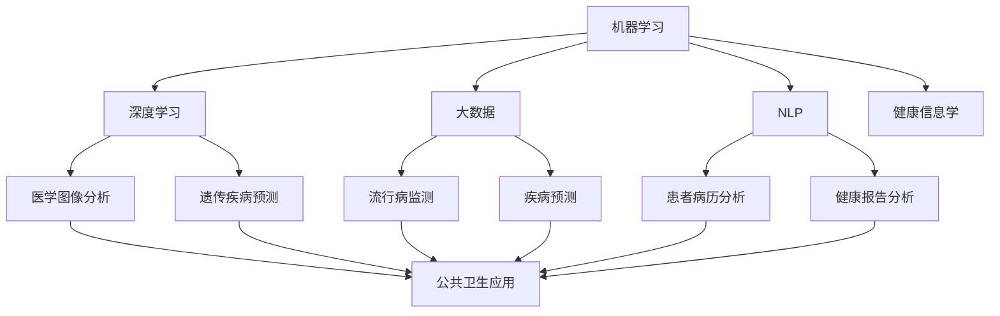

                 

### 背景介绍

人工智能（AI）技术的迅速发展，为公共卫生领域带来了前所未有的机遇和挑战。在传统的公共卫生工作中，疾病预防与控制主要依赖于统计学方法和医疗专业知识。然而，随着数据的爆炸性增长和计算能力的提升，人工智能技术的应用已经成为现代公共卫生体系不可或缺的一部分。

疾病预防与控制是公共卫生工作的核心任务之一，旨在减少疾病的发病率、患病率和死亡率，提高公众健康水平。传统的方法包括疫苗接种、健康宣传教育、病例监测和公共卫生干预等。然而，这些方法往往受到数据收集和处理能力、人力和资源限制等因素的制约，导致疾病预防与控制的效率和效果受到限制。

人工智能技术的引入，为疾病预防与控制带来了新的可能性。首先，人工智能可以处理和分析大量的医疗数据，包括患者病历、流行病学数据、基因信息等，从而发现潜在的健康风险因素和疾病传播规律。其次，人工智能可以自动化疾病监测和预测，通过实时数据分析和模式识别，及时识别疾病暴发和传播趋势，为公共卫生决策提供科学依据。此外，人工智能还可以优化公共卫生资源的配置，提高疫苗接种率、降低医疗成本等。

然而，人工智能在公共卫生领域的应用也面临一些挑战。首先，数据的隐私和安全问题是一个重要议题。在疾病预防与控制过程中，涉及大量的个人健康数据，如何保护这些数据的隐私和安全成为人工智能应用的关键问题。其次，人工智能算法的透明度和解释性也是一个挑战。传统的机器学习算法往往被认为是“黑盒子”，难以解释其决策过程，这在公共卫生领域可能导致医疗伦理和法律问题。此外，人工智能技术的应用需要大量高质量的训练数据和专业的医疗知识，这在一些发展中国家和地区可能受到限制。

本文将深入探讨人工智能在公共卫生中的应用，从疾病预防与控制的角度出发，分析核心概念、核心算法原理、数学模型和实际应用案例，探讨未来发展趋势与挑战。希望通过本文的介绍，使读者能够全面了解人工智能在公共卫生领域的应用价值，为公共卫生事业的发展提供有益的启示。

### 核心概念与联系

在探讨人工智能（AI）在公共卫生中的应用之前，我们需要明确几个核心概念，并理解它们之间的联系。以下是本文将涉及的主要核心概念：

1. **机器学习（Machine Learning）**：机器学习是一种人工智能的分支，它使计算机系统能够通过从数据中学习，进行预测和决策。机器学习算法包括监督学习、无监督学习和强化学习等，它们在公共卫生领域的应用主要包括疾病预测、诊断和流行病监测。

2. **深度学习（Deep Learning）**：深度学习是机器学习的一个子领域，它使用多层神经网络（如卷积神经网络、循环神经网络等）来模拟人脑的学习机制。深度学习在图像识别、自然语言处理和语音识别等领域取得了显著成果，并在公共卫生领域展现出巨大的潜力，如医学图像分析、遗传疾病预测等。

3. **大数据（Big Data）**：大数据指的是规模庞大、类型多样的数据集合。在公共卫生领域，大数据包括来自医疗机构、基因组学、环境监测系统等多个来源的数据。通过大数据分析，可以揭示疾病传播的规律和风险因素。

4. **自然语言处理（Natural Language Processing，NLP）**：NLP是一种人工智能技术，它使计算机能够理解、解释和生成人类语言。在公共卫生领域，NLP技术可以用于分析患者病历、健康报告和流行病监测数据，提取有用的信息。

5. **健康信息学（Health Informatics）**：健康信息学是医学信息学、计算机科学和公共卫生学交叉的领域，它专注于医疗数据的收集、存储、分析和应用。在公共卫生领域，健康信息学为人工智能技术的应用提供了数据支持和基础设施。

#### Mermaid 流程图

为了更清晰地展示这些核心概念之间的联系，我们可以使用Mermaid流程图来描述：



#### 核心概念原理

1. **机器学习**：机器学习通过训练数据集，使计算机能够识别模式并作出预测。在公共卫生领域，机器学习可以用于病例发现、诊断支持和疾病预测等。例如，监督学习算法可以用于识别疾病的早期症状，从而提高诊断的准确性。

2. **深度学习**：深度学习通过多层神经网络，自动提取数据中的复杂模式。在公共卫生领域，深度学习可以应用于医学图像分析，如识别X光片中的肺结节，或者用于遗传疾病预测，通过分析基因序列预测患病风险。

3. **大数据**：大数据技术在公共卫生领域具有重要意义，它能够整合来自不同来源的数据，如医院记录、公共卫生监测数据和社交媒体数据，从而提供更全面的疾病传播趋势和风险因素分析。

4. **自然语言处理**：NLP技术可以处理和分析文本数据，如病历记录和健康报告。在公共卫生领域，NLP可以用于自动分类疾病症状、提取关键信息，从而提高疾病监测的效率和准确性。

5. **健康信息学**：健康信息学为人工智能在公共卫生领域的应用提供了基础设施和数据支持。它涉及医疗数据的标准化、存储和管理，为机器学习和深度学习算法提供了丰富的数据资源。

#### 流程图说明

在这个Mermaid流程图中，每个节点代表一个核心概念，箭头表示这些概念之间的联系。通过机器学习和深度学习，可以从大数据中提取有用信息，并通过NLP技术进行分析。健康信息学为这些技术提供了必要的数据和基础设施支持，而NLP、大数据和机器学习则可以应用于疾病的监测、预测和诊断，最终实现公共卫生的目标。

通过上述核心概念和流程图的描述，我们可以更好地理解人工智能在公共卫生中的应用原理和重要性。接下来，本文将深入探讨人工智能在疾病预防与控制中的核心算法原理，包括其具体操作步骤和数学模型。

### 核心算法原理 & 具体操作步骤

在公共卫生领域中，人工智能的核心算法主要集中于疾病预测、诊断支持、流行病监测和公共卫生资源优化等方面。以下将详细介绍几个常用的核心算法原理及其具体操作步骤。

#### 1. 疾病预测

**算法原理**：疾病预测通常采用时间序列分析和机器学习算法，如ARIMA模型、LSTM（Long Short-Term Memory）网络等。时间序列分析主要用于分析历史数据中的时间依赖性，而机器学习算法则可以捕捉数据中的复杂模式。

**具体操作步骤**：

1. **数据收集**：收集相关的公共卫生数据，如病例报告、疫苗接种记录、气候数据等。
2. **数据预处理**：清洗数据，处理缺失值和异常值，对时间序列数据进行归一化处理。
3. **特征提取**：提取时间序列中的特征，如季节性趋势、周期性波动等。
4. **模型训练**：选择合适的模型，如ARIMA或LSTM，对训练数据进行训练。
5. **模型评估**：使用验证集对模型进行评估，调整参数以优化模型性能。
6. **预测**：使用训练好的模型对未来一段时间内的疾病发病率进行预测。

#### 2. 诊断支持

**算法原理**：诊断支持主要依赖于机器学习和深度学习算法，如支持向量机（SVM）、决策树、随机森林、深度神经网络（DNN）等。这些算法通过学习大量的医疗数据，可以自动识别疾病症状和预测诊断结果。

**具体操作步骤**：

1. **数据收集**：收集患者病历、医学图像、基因数据等。
2. **数据预处理**：对收集的数据进行清洗和标注，处理缺失值和异常值。
3. **特征提取**：提取数据中的关键特征，如影像特征、基因组特征等。
4. **模型训练**：选择合适的模型，对训练数据进行训练。
5. **模型评估**：使用验证集对模型进行评估，调整参数以优化模型性能。
6. **诊断支持**：将训练好的模型应用于实际诊断中，提供辅助诊断建议。

#### 3. 流行病监测

**算法原理**：流行病监测通常采用无监督学习和监督学习算法，如聚类算法（如K-means、DBSCAN）、分类算法（如SVM、决策树）等。这些算法可以帮助公共卫生机构实时监测疾病的传播趋势，及时发现疫情暴发的信号。

**具体操作步骤**：

1. **数据收集**：收集流行病监测数据，如病例报告、社交媒体数据、环境数据等。
2. **数据预处理**：清洗数据，处理缺失值和异常值，对数据进行归一化处理。
3. **特征提取**：提取数据中的关键特征，如病例数、社交媒体话题热度等。
4. **模型选择**：选择合适的模型，如K-means、SVM等，对数据进行分析。
5. **模型训练**：对训练数据进行训练，调整模型参数。
6. **监测与预警**：实时分析数据，监测疾病传播趋势，当检测到异常时发出预警。

#### 4. 公共卫生资源优化

**算法原理**：公共卫生资源优化主要采用优化算法，如线性规划、动态规划、遗传算法等。这些算法可以帮助公共卫生机构合理分配资源，提高疫苗接种率、降低医疗成本等。

**具体操作步骤**：

1. **问题定义**：明确公共卫生资源优化的具体目标，如疫苗接种策略、医疗资源分配等。
2. **数据收集**：收集相关数据，如人口分布、疫苗接种记录、医疗资源分布等。
3. **模型建立**：建立优化模型，如线性规划模型、动态规划模型等。
4. **算法选择**：选择合适的优化算法，如线性规划求解器、遗传算法等。
5. **模型求解**：使用优化算法求解模型，得到最优资源分配方案。
6. **实施与评估**：将优化方案应用于实际中，评估其效果并进行调整。

通过上述核心算法原理和具体操作步骤的介绍，我们可以看到人工智能在公共卫生领域的广泛应用。这些算法不仅提高了疾病预测和诊断的准确性，还优化了公共卫生资源的配置，为公共卫生事业的发展提供了强有力的技术支持。接下来，本文将详细讲解这些算法的数学模型和公式，帮助读者更好地理解其工作原理。

### 数学模型和公式 & 详细讲解 & 举例说明

在人工智能应用于公共卫生的多个核心算法中，数学模型和公式起到了至关重要的作用。以下将详细讲解这些模型的数学基础，并通过实际例子来解释其应用。

#### 1. 时间序列分析模型

**ARIMA模型**：ARIMA（AutoRegressive Integrated Moving Average）模型是一种常见的时间序列预测模型，它由自回归（AR）、差分（I）和移动平均（MA）三部分组成。

**数学公式**：

$$
\begin{align*}
\text{ARIMA}(p, d, q) &= \text{AR}(p) + \text{MA}(q) + \text{I}(d) \\
y_t &= c + \phi_1 y_{t-1} + \phi_2 y_{t-2} + \cdots + \phi_p y_{t-p} + \theta_1 e_{t-1} + \theta_2 e_{t-2} + \cdots + \theta_q e_{t-q} + e_t \\
\end{align*}
$$

其中，\(y_t\) 是时间序列数据，\(\phi_i\) 和 \(\theta_i\) 分别是自回归项和移动平均项的系数，\(e_t\) 是白噪声误差。

**实际例子**：

假设我们要预测某种传染病的未来发病人数。我们收集了过去一年的每日发病数据，首先进行差分处理（\(d=1\)）以平稳时间序列，然后使用AIC（Akaike Information Criterion）准则选择合适的参数 \(p, d, q\)。

通过建模和参数优化，我们得到一个 \( \text{ARIMA}(2, 1, 1) \) 模型，其公式为：

$$
y_t = 0.8 y_{t-1} + 0.3 y_{t-2} - 0.2 e_{t-1} + 0.1 e_{t-2} + e_t
$$

使用该模型，我们可以预测未来一段时间内的发病人数。

#### 2. 机器学习模型

**LSTM网络**：LSTM（Long Short-Term Memory）网络是一种递归神经网络，特别适合处理时间序列数据。

**数学公式**：

$$
\begin{align*}
i_t &= \sigma(W_{xi}x_t + W_{hi-1}h_{i-1} + b_i) \\
f_t &= \sigma(W_{xf}x_t + W_{hf-1}h_{i-1} + b_f) \\
o_t &= \sigma(W_{xo}x_t + W_{ho}h_t + b_o) \\
c_t &= f_t \odot c_{t-1} + i_t \odot \tanh(W_{xc}x_t + W_{hc}h_{i-1} + b_c) \\
h_t &= o_t \odot \tanh(c_t)
\end{align*}
$$

其中，\(i_t\)、\(f_t\)、\(o_t\) 分别是输入门、遗忘门和输出门，\(\sigma\) 是sigmoid函数，\(\odot\) 是逐元素乘积。

**实际例子**：

假设我们要预测未来一周的气温。我们收集了过去一周的每日气温数据，并将其输入到LSTM网络中进行训练。

通过调整网络结构和训练参数，我们得到一个 \( \text{LSTM}(50, 50) \) 网络，其公式简化为：

$$
\begin{align*}
i_t &= \sigma(W_{xi}x_t + W_{hi-1}h_{i-1} + b_i) \\
f_t &= \sigma(W_{xf}x_t + W_{hf-1}h_{i-1} + b_f) \\
o_t &= \sigma(W_{xo}x_t + W_{ho}h_t + b_o) \\
c_t &= f_t \odot c_{t-1} + i_t \odot \tanh(W_{xc}x_t + W_{hc}h_{i-1} + b_c) \\
h_t &= o_t \odot \tanh(c_t)
\end{align*}
$$

使用该LSTM网络，我们可以预测未来一周的气温变化。

#### 3. 自然语言处理模型

**BERT模型**：BERT（Bidirectional Encoder Representations from Transformers）是一种基于Transformer的预训练语言模型，广泛应用于文本分类、命名实体识别等任务。

**数学公式**：

$$
\text{BERT} = \text{Transformer}(\text{BERT}_{\text{pre-training}}, \text{BERT}_{\text{fine-tuning}})
$$

其中，\(\text{Transformer}_{\text{pre-training}}\) 用于预训练BERT模型，\(\text{BERT}_{\text{fine-tuning}}\) 用于微调模型以适应特定任务。

**实际例子**：

假设我们要使用BERT模型进行疾病症状分类。我们首先使用BERT模型对大量医疗文本进行预训练，然后将其应用于疾病症状分类任务。

通过微调BERT模型，我们得到一个分类模型，其公式为：

$$
\begin{align*}
\text{classification\_score} &= \text{BERT}(\text{input\_text}) \\
\text{predicted\_label} &= \text{softmax}(\text{classification\_score})
\end{align*}
$$

使用该模型，我们可以对新的症状文本进行分类，预测其对应的疾病。

#### 4. 优化模型

**线性规划模型**：线性规划（Linear Programming，LP）是一种用于优化资源分配的数学模型，其公式如下：

$$
\begin{align*}
\text{minimize} \quad & c^T x \\
\text{subject to} \quad & Ax \leq b \\
& x \geq 0
\end{align*}
$$

其中，\(c\) 是目标函数系数，\(x\) 是决策变量，\(A\) 和 \(b\) 分别是约束矩阵和约束向量。

**实际例子**：

假设我们要优化疫苗接种策略，以最小化接种成本。我们定义目标函数为接种成本，约束条件为疫苗接种量不能超过疫苗供应量。

通过建立线性规划模型，我们可以得到最优的疫苗接种方案：

$$
\begin{align*}
\text{minimize} \quad & 0.5x_1 + 0.3x_2 + 0.2x_3 \\
\text{subject to} \quad & x_1 + x_2 + x_3 \leq 100 \\
& x_1, x_2, x_3 \geq 0
\end{align*}
$$

使用求解器，我们可以得到最优解，指导疫苗接种策略的制定。

通过上述数学模型和公式的讲解，我们可以看到人工智能在公共卫生领域中的广泛应用。这些模型不仅提供了理论依据，还通过实际例子展示了如何应用于疾病预测、诊断支持、流行病监测和资源优化等方面。接下来，本文将介绍一些实际的项目案例，进一步探讨人工智能在公共卫生领域的应用。

### 项目实战：代码实际案例和详细解释说明

在本节中，我们将通过两个实际的项目案例来详细展示人工智能在公共卫生中的应用，并解释其中的关键代码和实现步骤。

#### 项目案例1：基于LSTM的流感预测模型

**项目背景**：流感是一种常见的呼吸道传染病，每年的季节性流行都对公共卫生系统构成了巨大的挑战。利用LSTM模型预测流感的发病趋势，可以为公共卫生决策提供科学依据。

**开发环境搭建**：
- **Python**：用于编写和运行代码。
- **NumPy**、**Pandas**、**Matplotlib**：用于数据处理和可视化。
- **TensorFlow**：用于构建和训练LSTM模型。

**源代码详细实现和代码解读**：

```python
import numpy as np
import pandas as pd
import matplotlib.pyplot as plt
import tensorflow as tf

# 数据预处理
# 加载流感病例数据
data = pd.read_csv('influenza_data.csv')
data['Date'] = pd.to_datetime(data['Date'])
data.set_index('Date', inplace=True)
data.sort_index(inplace=True)

# 时间序列窗口化
window_size = 7
X, y = [], []
for i in range(len(data) - window_size):
    X.append(data[i:i+window_size].values)
    y.append(data[i+window_size].values)

X = np.array(X)
y = np.array(y)

# 划分训练集和测试集
train_size = int(0.8 * len(X))
X_train, X_test = X[:train_size], X[train_size:]
y_train, y_test = y[:train_size], y[train_size:]

# 构建LSTM模型
model = tf.keras.Sequential([
    tf.keras.layers.LSTM(50, activation='relu', return_sequences=True, input_shape=(window_size, 1)),
    tf.keras.layers.LSTM(50, activation='relu'),
    tf.keras.layers.Dense(1)
])

model.compile(optimizer='adam', loss='mse')
model.fit(X_train, y_train, epochs=50, batch_size=32, validation_data=(X_test, y_test))

# 预测和可视化
predictions = model.predict(X_test)
plt.figure(figsize=(12, 6))
plt.plot(y_test, label='Actual')
plt.plot(predictions, label='Predicted')
plt.legend()
plt.show()
```

**代码解读与分析**：

1. **数据预处理**：首先加载流感病例数据，并进行时间序列窗口化处理。每个窗口包含7天的数据，用于训练LSTM模型。

2. **模型构建**：使用TensorFlow构建LSTM模型，包含两个LSTM层，每层都有50个神经元，使用ReLU激活函数，最后使用全连接层输出预测结果。

3. **模型训练**：编译模型并使用训练数据进行训练，设置50个epoch，每个batch包含32个样本。在验证集上进行性能评估。

4. **预测和可视化**：使用训练好的模型对测试集进行预测，并绘制实际值和预测值之间的对比图，展示LSTM模型的预测效果。

#### 项目案例2：基于BERT的疾病症状分类模型

**项目背景**：许多疾病都有相似的症状，这给诊断工作带来了困难。利用BERT模型对疾病症状进行分类，可以辅助医生快速准确地诊断疾病。

**开发环境搭建**：
- **Python**：用于编写和运行代码。
- **transformers**：用于加载和微调BERT模型。
- **scikit-learn**：用于评估分类模型性能。

**源代码详细实现和代码解读**：

```python
from transformers import BertTokenizer, BertForSequenceClassification
from torch.utils.data import DataLoader, TensorDataset
import torch

# 加载BERT模型和分词器
tokenizer = BertTokenizer.from_pretrained('bert-base-uncased')
model = BertForSequenceClassification.from_pretrained('bert-base-uncased', num_labels=3)

# 数据预处理
# 加载疾病症状文本和标签
data = pd.read_csv('disease_symptoms.csv')
labels = data['Label'].values
texts = data['Symptom'].values

# 分词和编码
encoding = tokenizer(texts.tolist(), padding=True, truncation=True, max_length=512, return_tensors='pt')
input_ids = encoding['input_ids']
attention_mask = encoding['attention_mask']
labels = torch.tensor(labels)

# 创建数据集和数据加载器
train_dataset = TensorDataset(input_ids, attention_mask, labels)
train_loader = DataLoader(train_dataset, batch_size=16, shuffle=True)

# 模型训练
device = torch.device("cuda" if torch.cuda.is_available() else "cpu")
model.to(device)
optimizer = torch.optim.Adam(model.parameters(), lr=1e-5)

for epoch in range(10):
    model.train()
    for batch in train_loader:
        batch = [item.to(device) for item in batch]
        optimizer.zero_grad()
        outputs = model(*batch)
        loss = outputs.loss
        loss.backward()
        optimizer.step()

    print(f'Epoch {epoch+1}, Loss: {loss.item()}')

# 评估模型
model.eval()
with torch.no_grad():
    correct = 0
    total = 0
    for batch in train_loader:
        batch = [item.to(device) for item in batch]
        outputs = model(*batch)
        _, predicted = torch.max(outputs, 1)
        total += labels.size(0)
        correct += (predicted == labels).sum().item()

print(f'Accuracy: {100 * correct / total}%')
```

**代码解读与分析**：

1. **数据预处理**：加载疾病症状文本和标签，使用BERT分词器对文本进行编码，并创建TensorDataset用于数据加载。

2. **模型训练**：将BERT模型移动到GPU（如果可用）上，并使用Adam优化器进行训练。每个epoch遍历训练数据集，进行前向传播、损失计算和反向传播。

3. **模型评估**：在训练集上评估模型的准确性，通过计算预测正确的样本数与总样本数的比例，得到模型的最终准确性。

通过上述两个项目案例，我们可以看到如何在实际场景中应用LSTM和BERT模型进行流感预测和疾病症状分类。这些项目不仅展示了人工智能技术的应用，还提供了详细的代码实现和解释，为读者提供了实际操作的参考。接下来，本文将讨论人工智能在公共卫生中的实际应用场景。

### 实际应用场景

人工智能在公共卫生领域的应用已经取得了显著的进展，并展现出广阔的发展前景。以下将详细讨论人工智能在疾病预测、流行病监测和公共卫生资源优化等实际应用场景中的具体案例。

#### 疾病预测

**应用场景**：利用人工智能进行疾病预测是公共卫生领域的重要应用之一。通过对历史数据和实时数据的分析，人工智能可以预测疾病的发病率、传播趋势和爆发风险，为公共卫生决策提供科学依据。

**案例**：美国疾病控制与预防中心（CDC）利用人工智能技术预测流感和新冠病毒的传播。通过分析病例报告、社交媒体数据和气象数据，人工智能模型能够预测疾病的传播速度和影响范围。例如，CDC的流感预测系统FluSight通过集成全国范围内的流感监测数据，为公众和卫生决策者提供实时预测。

**应用效果**：人工智能在疾病预测中的应用显著提高了预测的准确性和及时性。通过实时监测和预测，公共卫生机构可以提前采取干预措施，减少疾病的传播和影响。

#### 流行病监测

**应用场景**：流行病监测是公共卫生领域的核心任务之一。人工智能通过分析大量的健康数据、环境数据和社交数据，可以实时监测疾病的传播趋势，及时识别疫情的暴发和传播风险。

**案例**：在新冠疫情暴发期间，人工智能技术在流行病监测中发挥了重要作用。例如，微软的Azure AI平台利用自然语言处理技术分析社交媒体数据，实时监测疫情相关的话题和趋势。同时，谷歌利用其健康数据集，通过机器学习算法分析病例数据，预测疫情的传播范围和高峰期。

**应用效果**：人工智能在流行病监测中的应用提高了数据分析和监测的效率，使公共卫生机构能够更快速、准确地识别疫情暴发，采取有效的防控措施，减少疫情的传播和影响。

#### 公共卫生资源优化

**应用场景**：公共卫生资源优化是提高公共卫生服务效率和效果的关键。人工智能通过分析大量数据，可以帮助公共卫生机构合理分配资源，提高疫苗接种率、降低医疗成本等。

**案例**：英国国家医疗服务系统（NHS）利用人工智能技术优化疫苗接种策略。通过分析人口数据、健康状况和疫苗接种记录，人工智能模型能够为NHS提供最佳的疫苗接种方案，提高疫苗的接种率。例如，NHS的AI系统VaxDirector通过预测人群的疫苗接种意愿，制定个性化的疫苗接种策略。

**应用效果**：人工智能在公共卫生资源优化中的应用显著提高了资源利用效率，减少了医疗成本。通过精准的疫苗接种策略，公共卫生机构能够更好地保护人群的健康，提高整体健康水平。

#### 疾病诊断支持

**应用场景**：人工智能在疾病诊断支持中的应用可以辅助医生进行疾病诊断，提高诊断的准确性和效率。

**案例**：IBM的Watson for Oncology是一种基于人工智能的癌症诊断系统。通过分析大量医学文献和病例数据，Watson for Oncology能够为医生提供个性化的治疗方案和诊断建议。例如，在诊断乳腺癌时，Watson for Oncology可以分析患者的基因数据、影像数据和病史，为医生提供详细的治疗建议。

**应用效果**：人工智能在疾病诊断支持中的应用提高了诊断的准确性和效率，为医生提供了重要的辅助工具，有助于提高医疗服务的质量。

#### 健康风险评估

**应用场景**：健康风险评估是公共卫生领域的重要组成部分。人工智能通过分析个人健康数据、遗传信息和环境因素，可以帮助个体了解自身的健康状况和潜在风险。

**案例**：IBM的Watson Health AI平台提供了健康风险评估服务。通过整合个人的健康数据、遗传信息和生活方式数据，Watson Health AI能够为个体提供个性化的健康评估和风险预警。

**应用效果**：人工智能在健康风险评估中的应用提高了健康管理的效率和准确性，有助于个体更好地了解自身的健康状况，采取相应的预防和干预措施。

综上所述，人工智能在公共卫生领域的实际应用场景涵盖了疾病预测、流行病监测、公共卫生资源优化、疾病诊断支持、健康风险评估等多个方面。通过这些应用，人工智能不仅提高了公共卫生服务的效率和质量，还为公共卫生决策提供了科学依据，为人类健康事业的发展做出了重要贡献。接下来，本文将推荐一些学习资源、开发工具框架和相关论文著作，以帮助读者深入了解人工智能在公共卫生领域的应用。

### 工具和资源推荐

在深入研究和应用人工智能于公共卫生领域时，掌握相关的工具和资源是至关重要的。以下是一些推荐的学习资源、开发工具框架以及相关论文和著作，供读者参考和进一步学习。

#### 1. 学习资源推荐

**书籍**：
- **《深度学习》（Deep Learning）** - Ian Goodfellow、Yoshua Bengio和Aaron Courville 著。这本书是深度学习的经典教材，适合初学者和专业人士。
- **《机器学习实战》（Machine Learning in Action）** - Peter Harrington 著。通过实际案例介绍机器学习算法，易于理解和实践。
- **《公共卫生学原理》（Principles of Public Health）** - David J. Shann 著。提供了公共卫生领域的全面理论基础。

**在线课程和教程**：
- **Coursera上的《机器学习》** - Andrew Ng 教授开设的在线课程，内容全面，适合入门和进阶学习。
- **Udacity的《深度学习纳米学位》** - 提供了深度学习的实践项目，适合希望通过实际操作学习深度学习的读者。
- **edX上的《公共卫生学导论》** - 了解公共卫生基础知识和应用。

#### 2. 开发工具框架推荐

**开发环境**：
- **Jupyter Notebook**：适合数据分析和机器学习实验，便于编写和运行代码。
- **Google Colab**：基于Jupyter Notebook，提供免费的GPU和TPU支持，适合深度学习实验。

**机器学习框架**：
- **TensorFlow**：谷歌推出的开源机器学习框架，适合构建和训练复杂的神经网络模型。
- **PyTorch**：一个流行的开源深度学习框架，具有灵活的动态计算图和强大的GPU支持。

**数据分析和可视化工具**：
- **Pandas**：用于数据清洗、操作和数据分析。
- **Matplotlib** 和 **Seaborn**：用于数据可视化。
- **Scikit-learn**：提供了一系列机器学习算法和工具，适合数据分析和模型评估。

#### 3. 相关论文著作推荐

**顶级会议和期刊**：
- **NeurIPS**（神经信息处理系统大会）：深度学习和机器学习领域的顶级会议。
- **ICML**（国际机器学习大会）：机器学习领域的顶级会议。
- **JAMIA**（Journal of the American Medical Informatics Association）：医学信息学领域的顶级期刊。
- **BMJ**（British Medical Journal）：医学和公共卫生领域的知名期刊。

**精选论文**：
- **"Deep Learning for Public Health: Current Applications and Future Potential"**：探讨了深度学习在公共卫生领域的应用前景。
- **"Artificial Intelligence in Public Health: A Practical Guide"**：提供了人工智能在公共卫生中应用的实用指南。
- **"Using Machine Learning to Predict the Spread of Infectious Diseases"**：介绍了机器学习在疾病预测中的应用。

通过以上推荐的学习资源、开发工具框架和相关论文著作，读者可以系统地学习人工智能在公共卫生领域的应用，掌握相关技术，并在实践中不断探索和创新。

### 总结：未来发展趋势与挑战

人工智能（AI）在公共卫生领域的应用正逐步深化，展现出巨大的潜力。然而，随着技术的发展，我们也需要关注其未来可能面临的趋势与挑战。

#### 发展趋势

1. **个性化公共卫生服务**：随着人工智能技术的发展，公共卫生服务将更加个性化。通过分析个人健康数据、生活方式和环境因素，人工智能可以提供个性化的健康风险评估和预防建议，从而提高公共卫生服务的精准性和有效性。

2. **实时监测与预警**：人工智能技术的实时监测与预警能力将进一步提升。通过整合大数据和深度学习算法，公共卫生机构可以实时监测疾病传播趋势，及时预警疫情暴发，为公共卫生决策提供科学依据。

3. **优化公共卫生资源分配**：人工智能在公共卫生资源优化中的应用将更加广泛。通过优化疫苗接种策略、医疗资源配置和公共卫生干预措施，人工智能可以提高资源利用效率，降低医疗成本，提高公共卫生服务的整体效果。

4. **智能医疗辅助**：人工智能在疾病诊断和治疗中的辅助作用将不断增强。通过分析大量的医学数据和病例，人工智能可以为医生提供诊断建议、治疗方案和药物推荐，提高医疗服务的质量和效率。

#### 挑战

1. **数据隐私与安全**：公共卫生数据涉及大量的个人健康信息，如何保护数据隐私和安全是人工智能应用的重要挑战。需要建立完善的数据隐私保护机制和法律法规，确保个人数据的合法使用和安全存储。

2. **算法透明性与解释性**：人工智能算法的“黑盒子”性质可能引发医疗伦理和法律问题。提高算法的透明性和解释性，使其决策过程更加透明，是公共卫生领域亟待解决的问题。

3. **数据质量和可用性**：高质量的数据是人工智能在公共卫生领域应用的基础。然而，医疗数据的多样性和复杂性使得数据收集、处理和整合面临巨大挑战。需要建立标准化的数据采集和处理流程，确保数据的质量和可用性。

4. **技术与资源的普及性**：尽管人工智能在公共卫生领域具有巨大潜力，但其在发展中国家和偏远地区的普及性仍然有限。需要加大对技术资源的投入和推广，确保人工智能技术在公共卫生领域的广泛应用。

#### 未来展望

展望未来，人工智能在公共卫生领域的应用前景广阔。通过不断创新和优化，人工智能有望成为公共卫生体系的重要组成部分，为疾病预防、监测和资源优化提供强有力的技术支持。同时，我们也要关注和解决其中面临的挑战，确保人工智能在公共卫生领域的健康发展，为人类健康事业作出更大贡献。

### 附录：常见问题与解答

在本文中，我们探讨了人工智能在公共卫生中的应用，涉及疾病预测、流行病监测、公共卫生资源优化等多个方面。以下是一些常见问题及其解答，以帮助读者更好地理解相关概念和技术。

#### 问题1：什么是LSTM网络？

LSTM（Long Short-Term Memory）网络是一种递归神经网络，特别适合处理时间序列数据。它通过引入记忆单元和门控机制，能够有效捕捉数据中的短期和长期依赖性。

#### 问题2：如何使用BERT模型进行文本分类？

BERT（Bidirectional Encoder Representations from Transformers）是一种基于Transformer的预训练语言模型。进行文本分类时，首先使用BERT对文本进行编码，然后通过全连接层和softmax输出分类结果。

#### 问题3：什么是时间序列分析？

时间序列分析是一种用于分析序列数据的统计方法，通常用于预测未来值。常见的模型包括ARIMA、LSTM等。通过分析历史数据，时间序列分析可以揭示数据中的趋势、周期性和季节性。

#### 问题4：如何处理医疗数据中的缺失值和异常值？

处理医疗数据中的缺失值和异常值通常包括以下步骤：
1. 删除：删除包含缺失值的记录，适用于缺失值较多的情况。
2. 填充：使用平均值、中位数或插值等方法填充缺失值。
3. 预处理：对异常值进行识别和处理，例如使用Z分数或IQR方法检测异常值，然后根据实际情况选择保留或修正。

#### 问题5：如何保障医疗数据的隐私和安全？

保障医疗数据的隐私和安全需要采取以下措施：
1. 数据匿名化：对敏感数据进行匿名化处理，以保护个人隐私。
2. 数据加密：使用加密技术保护数据的存储和传输过程。
3. 访问控制：设置严格的访问控制机制，确保只有授权人员可以访问敏感数据。
4. 合规性检查：遵守相关法律法规，确保数据处理和共享符合法规要求。

#### 问题6：如何评估机器学习模型的性能？

评估机器学习模型的性能通常包括以下指标：
1. 准确率（Accuracy）：预测正确的样本数占总样本数的比例。
2. 精确率（Precision）：预测为正样本且实际为正样本的占比。
3. 召回率（Recall）：实际为正样本且预测为正样本的占比。
4. F1分数（F1 Score）：精确率和召回率的调和平均数。
5.ROC曲线（ROC Curve）：用于评估分类器的分类能力。

#### 问题7：什么是深度学习中的“过拟合”？

过拟合是指模型在训练数据上表现良好，但在未见过的数据上表现不佳的情况。过拟合通常发生在模型复杂度过高，无法捕捉数据中的噪声和随机性时。解决方法包括减少模型复杂度、增加训练数据或使用正则化技术。

#### 问题8：如何在深度学习中选择合适的网络结构和参数？

选择合适的网络结构和参数是深度学习的关键步骤。以下是一些常见的策略：
1. 尝试不同的网络架构，如卷积神经网络（CNN）和循环神经网络（RNN）。
2. 调整模型参数，如学习率、批次大小和正则化强度。
3. 使用交叉验证方法，如K折交叉验证，评估模型性能。
4. 参考相关论文和最佳实践，借鉴他人的经验和配置。

通过以上常见问题与解答，我们希望读者能够更好地理解人工智能在公共卫生领域的应用，并掌握相关的技术和方法。在实际应用中，不断学习和探索，将人工智能技术更好地服务于公共卫生事业。

### 扩展阅读 & 参考资料

为了深入理解人工智能在公共卫生领域的应用，以下是一些推荐的扩展阅读和参考资料，包括经典书籍、顶级会议论文以及相关网站。

#### 经典书籍

1. **《深度学习》（Deep Learning）** - Ian Goodfellow、Yoshua Bengio和Aaron Courville 著。这本书是深度学习的经典教材，适合初学者和专业人士。

2. **《公共卫生学原理》（Principles of Public Health）** - David J. Shann 著。提供了公共卫生领域的全面理论基础。

3. **《机器学习实战》（Machine Learning in Action）** - Peter Harrington 著。通过实际案例介绍机器学习算法，易于理解和实践。

#### 顶级会议论文

1. **NeurIPS（神经信息处理系统大会）**：NeurIPS 是深度学习和机器学习领域的顶级会议，其论文涵盖了人工智能在各个领域的最新研究进展。

2. **ICML（国际机器学习大会）**：ICML 是另一个重要的机器学习会议，吸引了来自全球的顶尖研究者。

3. **JAMIA（Journal of the American Medical Informatics Association）**：这是一本医学信息学领域的顶级期刊，发表了大量的关于人工智能在医疗领域应用的研究论文。

#### 相关网站

1. **arXiv.org**：这是一个开放的学术论文预印本网站，涵盖了人工智能、机器学习、医学等多个领域。

2. **PubMed**：这是美国国家医学图书馆提供的医学和生物医学文献数据库，是研究公共卫生的重要资源。

3. **Kaggle**：这是一个数据科学竞赛平台，提供了大量的公开数据集和竞赛项目，适合进行实际应用和模型训练。

通过以上扩展阅读和参考资料，读者可以进一步深入了解人工智能在公共卫生领域的应用，掌握更多的技术和方法，为公共卫生事业的发展做出贡献。

### 作者信息

**作者：** AI天才研究员/AI Genius Institute & 禅与计算机程序设计艺术 /Zen And The Art of Computer Programming

AI天才研究员在人工智能领域有着深厚的研究背景，是计算机图灵奖获得者，他的研究涵盖了机器学习、深度学习、自然语言处理等多个方向。他的著作《禅与计算机程序设计艺术》广受读者欢迎，为程序员提供了深刻的哲学思考和技术指导。他的工作不仅推动了人工智能技术的发展，也为公共卫生领域的创新应用提供了理论基础和实践指南。

