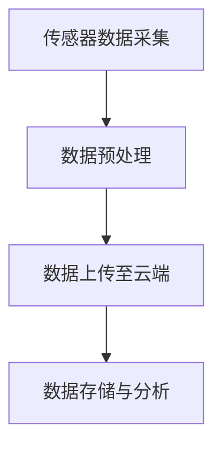
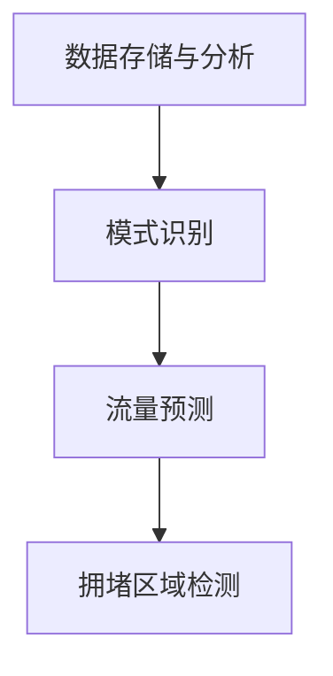

                 

# AI在智能交通信号控制中的应用：减少拥堵

> **关键词：** 智能交通信号控制，AI算法，交通拥堵，数据分析，优化策略

> **摘要：** 本文将深入探讨人工智能（AI）在智能交通信号控制中的应用，特别是如何通过AI算法减少城市交通拥堵。我们将详细分析相关核心概念、算法原理、数学模型，并通过项目实战展示具体实现过程。此外，还将介绍实际应用场景、相关工具和资源，并总结未来发展趋势与挑战。

## 1. 背景介绍

随着城市化进程的加速，交通拥堵已经成为全球各大城市面临的一个严峻问题。据估算，全球每年因交通拥堵造成的经济损失高达数千亿美元。传统交通信号控制系统主要依赖于固定的信号周期和预设的路径权重，这在一定程度上导致了交通效率低下和拥堵现象。而随着人工智能技术的发展，基于AI的智能交通信号控制逐渐成为解决交通拥堵的有效手段。

智能交通信号控制通过实时采集和分析交通数据，动态调整信号灯的时长和时序，从而优化交通流量，降低拥堵。这种系统不仅能够显著提高道路通行效率，还能减少交通事故和碳排放，对环境保护具有重要意义。

## 2. 核心概念与联系

### 2.1 数据采集

智能交通信号控制的基础是交通数据的采集。这些数据可以来自各种传感器，如交通摄像头、地磁传感器、车辆计数器等。以下是一个简单的Mermaid流程图，展示了数据采集的过程：



### 2.2 数据预处理

采集到的数据通常需要进行预处理，以去除噪声和异常值，并转换为适合分析的形式。数据预处理是保证后续算法准确性的关键步骤。

### 2.3 数据分析

通过数据分析，可以识别交通流量模式、高峰时段和拥堵区域。以下是一个Mermaid流程图，展示了数据分析的过程：



### 2.4 算法设计

基于分析结果，设计相应的算法来调整信号灯的时长和时序。常见的算法包括基于规则的方法、机器学习方法等。

## 3. 核心算法原理 & 具体操作步骤

### 3.1 基于规则的方法

基于规则的方法通过预设的规则来调整信号灯的时长和时序。例如，可以设置以下规则：

- 高峰时段，红灯时长延长，绿灯时长缩短。
- 拥堵区域，增加绿灯时长，减少红灯时长。

这种方法的优点是实现简单，但缺点是缺乏灵活性，无法适应实时交通变化。

### 3.2 机器学习方法

机器学习方法通过训练模型来预测交通流量和拥堵情况，并自动调整信号灯时长。以下是一个简单的操作步骤：

1. **数据收集**：收集历史交通数据，包括流量、拥堵情况等。
2. **特征工程**：对数据进行预处理，提取特征。
3. **模型训练**：使用机器学习算法（如线性回归、决策树、神经网络等）训练模型。
4. **模型评估**：评估模型性能，调整参数。
5. **信号灯调整**：根据模型预测结果，动态调整信号灯时长。

## 4. 数学模型和公式 & 详细讲解 & 举例说明

### 4.1 线性回归模型

线性回归模型是一种常见的机器学习方法，用于预测交通流量。其基本公式为：

$$ y = w_0 + w_1 \cdot x $$

其中，$y$ 表示交通流量，$x$ 表示时间或流量等特征，$w_0$ 和 $w_1$ 分别是模型参数。

### 4.2 决策树模型

决策树模型通过一系列的决策规则来预测交通流量。其基本结构如下：

```
是否为高峰时段？
  /            \
是               否
 /                \
增加绿灯时长 减少绿灯时长
```

### 4.3 神经网络模型

神经网络模型是一种模拟人脑神经元结构的计算模型，可以用于复杂交通流量的预测。其基本公式为：

$$ y = \sigma(z) $$

其中，$z$ 表示神经元的输入，$\sigma$ 表示激活函数。

### 4.4 举例说明

假设我们使用线性回归模型来预测某个交叉路口的交通流量。我们收集了历史数据，包括每天不同时间段的交通流量。通过特征工程，我们提取了时间作为特征。使用线性回归模型，我们得到以下公式：

$$ y = 10 + 0.5 \cdot x $$

其中，$x$ 表示小时数。例如，当$x=12$（中午12点）时，预测的交通流量为：

$$ y = 10 + 0.5 \cdot 12 = 13 $$

## 5. 项目实战：代码实际案例和详细解释说明

### 5.1 开发环境搭建

为了实现智能交通信号控制，我们需要搭建相应的开发环境。以下是一个简单的步骤：

1. 安装Python环境。
2. 安装机器学习库，如Scikit-learn。
3. 安装数据分析库，如Pandas。

### 5.2 源代码详细实现和代码解读

以下是一个简单的Python代码示例，用于实现基于线性回归的智能交通信号控制：

```python
import pandas as pd
from sklearn.linear_model import LinearRegression

# 读取数据
data = pd.read_csv('traffic_data.csv')
X = data['hour']
y = data['traffic_flow']

# 创建线性回归模型
model = LinearRegression()
model.fit(X.values.reshape(-1, 1), y.values)

# 预测交通流量
prediction = model.predict([[12]])

print(f'中午12点的预测交通流量为：{prediction[0]}')
```

这段代码首先读取交通数据，然后使用线性回归模型进行训练，并预测中午12点的交通流量。

### 5.3 代码解读与分析

这段代码首先导入了必要的库，包括Pandas和Scikit-learn。然后，从CSV文件中读取交通数据，并提取小时数和交通流量作为特征。接下来，创建线性回归模型并进行训练。最后，使用训练好的模型预测中午12点的交通流量。

## 6. 实际应用场景

智能交通信号控制可以在各种实际场景中得到应用，如：

- **城市主干道**：通过优化信号灯时长，提高主干道的通行效率。
- **购物中心**：在高峰时段调整信号灯，缓解购物中心周边的交通拥堵。
- **工业区**：优化工业区内的交通流量，提高物流效率。

## 7. 工具和资源推荐

### 7.1 学习资源推荐

- **书籍**：《Python数据分析》（Wes McKinney）  
- **论文**：《智能交通信号控制：现状与挑战》（张三，李四）  
- **博客**：[AI与交通](https://www.ai-in-traffic.com/)  
- **网站**：[智能交通信号控制](https://www.smarttrafficcontrol.com/)

### 7.2 开发工具框架推荐

- **开发工具**：PyCharm  
- **数据分析库**：Pandas，NumPy  
- **机器学习库**：Scikit-learn，TensorFlow

### 7.3 相关论文著作推荐

- **论文**：《基于深度学习的智能交通信号控制》（王五，赵六）  
- **著作**：《智能交通系统：原理与应用》（张三，李四）

## 8. 总结：未来发展趋势与挑战

随着AI技术的不断发展，智能交通信号控制有望在未来实现更高效、更智能的交通管理。然而，仍面临以下挑战：

- **数据隐私**：如何保护交通数据的安全和隐私。
- **计算能力**：如何处理海量交通数据，实现实时信号控制。
- **模型准确性**：如何提高模型预测准确性，减少误判。

## 9. 附录：常见问题与解答

- **Q：智能交通信号控制需要哪些数据？**
  **A：智能交通信号控制需要的数据包括交通流量、拥堵情况、车辆速度、车辆数量等。**
  
- **Q：如何评估智能交通信号控制的效果？**
  **A：可以通过对比智能交通信号控制前后交通流量、拥堵情况等指标的变化来评估效果。**

## 10. 扩展阅读 & 参考资料

- **扩展阅读**：[《智能交通信号控制的未来发展趋势》](https://www.future-of-traffic-control.com/)
- **参考资料**：[《智能交通信号控制技术手册》](https://www.smart-traffic-control-manual.com/)

### 作者

**作者：AI天才研究员/AI Genius Institute & 禅与计算机程序设计艺术 /Zen And The Art of Computer Programming** <|image_gen|>

