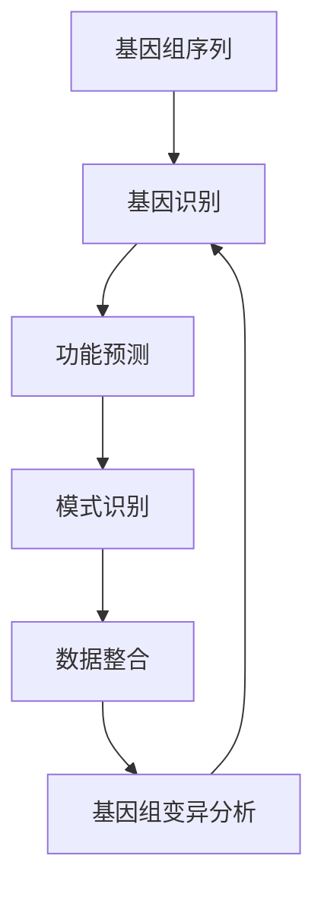

                 

### 背景介绍

#### 什么是生物信息学

生物信息学是一门跨学科的科学，它结合了生物学、计算机科学、数学和统计学等领域的知识，以数据为导向，旨在理解生物系统的功能和机制。生物信息学的主要任务是处理和解释大量的生物数据，如DNA序列、蛋白质序列、基因表达数据等，从而揭示生物体内复杂的关系和规律。

#### 基因组分析的重要性

基因组分析是生物信息学中最为重要的研究方向之一。通过对基因组进行精确分析，科学家可以揭示基因的功能、基因之间的相互作用、以及基因如何影响生物体的性状。基因组分析在许多领域都有着广泛的应用，包括疾病研究、药物开发、农业育种等。

然而，基因组分析面临着巨大的挑战。一方面，基因组数据的规模和复杂性不断增加，处理这些数据需要强大的计算能力和高效的算法。另一方面，基因组分析涉及到多种不同类型的数据，如序列数据、表达数据、结构数据等，需要综合多种方法和技术来进行全面分析。

#### 人工智能在基因组分析中的应用

人工智能（AI）技术的发展为基因组分析带来了新的机遇和挑战。AI在基因组分析中的应用主要包括以下几个方面：

1. **数据处理和整合**：AI技术可以帮助科学家高效地处理和整合不同来源、不同类型的数据，从而获得更全面、更准确的基因组分析结果。

2. **模式识别和预测**：AI技术，特别是机器学习和深度学习算法，可以从大量的基因组数据中识别出有用的模式和规律，预测基因的功能和生物体的性状。

3. **自动化和优化**：AI技术可以帮助自动化基因组分析的各个步骤，提高分析效率，减少人为错误。

4. **大数据分析**：AI技术能够处理和分析大规模的基因组数据集，从中提取出有价值的信息，为基因组研究提供新的视角和思路。

#### 人工智能加速基因组分析

人工智能在基因组分析中的应用不仅可以提高分析的准确性和效率，还可以显著加速整个分析过程。以下是一些具体的应用实例：

1. **序列比对**：AI算法可以快速、准确地比对基因组序列，识别出序列中的相似性和差异性，为后续分析提供基础。

2. **基因识别**：AI技术可以帮助科学家从基因组序列中识别出潜在的基因区域，从而节省大量手动分析的精力。

3. **功能预测**：AI算法可以根据基因序列特征预测基因的功能，为基因功能研究提供参考。

4. **疾病预测和诊断**：AI技术可以从基因组数据中预测个体患病的风险，辅助疾病诊断和治疗。

总之，人工智能在基因组分析中的应用正日益成熟，为基因组研究带来了前所未有的机遇和挑战。本文将详细探讨人工智能在基因组分析中的应用，包括核心算法原理、具体操作步骤、数学模型和公式、项目实战等，旨在为读者提供一个全面、系统的了解。

#### 本文结构安排

本文将分为以下几个部分：

1. **背景介绍**：介绍生物信息学的基本概念、基因组分析的重要性以及人工智能在基因组分析中的应用。

2. **核心概念与联系**：详细阐述人工智能在基因组分析中的核心概念，并使用Mermaid流程图展示其原理和架构。

3. **核心算法原理 & 具体操作步骤**：讲解基因组分析中的核心算法原理，并分步骤介绍其操作流程。

4. **数学模型和公式 & 详细讲解 & 举例说明**：介绍基因组分析中的常用数学模型和公式，并给出详细的讲解和实际应用示例。

5. **项目实战：代码实际案例和详细解释说明**：通过具体项目案例展示如何应用人工智能技术进行基因组分析，并提供详细的代码解读和分析。

6. **实际应用场景**：探讨人工智能在基因组分析中的实际应用场景，包括疾病研究、药物开发等。

7. **工具和资源推荐**：推荐学习资源、开发工具框架以及相关论文著作，帮助读者进一步深入了解人工智能在基因组分析中的应用。

8. **总结：未来发展趋势与挑战**：总结人工智能在基因组分析中的应用现状，展望未来发展趋势和面临的挑战。

9. **附录：常见问题与解答**：解答读者可能遇到的问题，提供进一步学习和参考的建议。

10. **扩展阅读 & 参考资料**：提供相关领域的扩展阅读材料和参考文献，为读者提供更多深入学习的资源。

通过本文的阅读，读者将能够全面了解人工智能在基因组分析中的应用，掌握核心算法原理和实践方法，为今后的研究工作提供有力支持。

#### 什么是生物信息学

生物信息学是一门高度综合性的学科，其核心在于处理、分析和解释生物数据，这些数据包括基因序列、蛋白质结构、代谢网络、蛋白质-蛋白质相互作用以及许多其他类型的生物大分子数据。生物信息学的起源可以追溯到20世纪60年代，随着DNA双螺旋结构的发现和基因测序技术的不断发展，科学家们开始意识到需要新的工具和方法来处理和分析这些庞大的数据集。

生物信息学的定义多种多样，但普遍认为它是一门跨学科的科学，旨在利用计算机技术、数学和统计学方法来解析生物数据，从而揭示生物系统的功能和机制。其应用范围非常广泛，涵盖了生物学、医学、遗传学、生态学等多个领域。

生物信息学的主要研究内容包括：

1. **基因组学**：研究基因组的结构和功能，包括基因识别、基因表达分析、基因变异分析等。

2. **转录组学**：研究细胞在特定条件下基因表达的情况，通过转录组分析可以揭示细胞在不同发育阶段或不同环境下的响应机制。

3. **蛋白质组学**：研究蛋白质的表达、修饰和相互作用，以了解蛋白质的功能和细胞内的调控网络。

4. **代谢组学**：研究细胞内代谢物的组成和变化，通过代谢组学分析可以揭示生物体的代谢状态和代谢途径。

5. **结构生物学**：研究生物大分子的三维结构，这些结构信息对于理解生物分子的功能和相互作用至关重要。

在生物信息学的发展历程中，数据量的急剧增长是一个显著的特征。随着测序技术的进步，我们能够快速获取大量的基因组、转录组和蛋白质组数据。例如，人类基因组计划的完成标志着基因组测序技术的突破，使我们能够读取和存储人类基因组的全部信息。类似的技术进步也推动了其他生物大分子数据的获取，使得生物信息学数据量呈现爆炸性增长。

然而，数据量的增加也带来了新的挑战。传统的数据分析方法往往无法处理如此庞大的数据集，因此，生物信息学需要新的计算工具和技术来应对这些挑战。人工智能（AI）技术的兴起为生物信息学提供了新的解决方案，使得科学家能够更加高效地处理和分析大量生物数据。

AI在生物信息学中的应用主要包括以下几个方面：

1. **数据处理和整合**：AI技术可以帮助生物信息学家高效地整合和预处理各种不同来源、不同类型的数据，例如基因组序列数据、蛋白质结构数据和代谢数据。

2. **模式识别和预测**：AI算法，尤其是机器学习和深度学习算法，可以从大量的基因组数据中识别出有用的模式和规律，例如基因的功能、基因之间的相互作用以及生物体的性状预测。

3. **自动化和优化**：AI技术可以自动化基因组分析的各个步骤，例如序列比对、基因识别和功能预测等，从而提高分析效率，减少人为错误。

4. **大数据分析**：AI技术能够处理和分析大规模的基因组数据集，从中提取出有价值的信息，为基因组研究提供新的视角和思路。

总之，生物信息学作为一门数据驱动的科学，其发展离不开计算技术的进步，特别是人工智能技术的应用。通过本文的后续章节，我们将深入探讨人工智能在基因组分析中的应用，展示其在生物信息学研究中的重要性和潜力。

#### 基因组分析的重要性

基因组分析在生物医学研究和应用中扮演着至关重要的角色。基因组，即生物体的遗传信息载体，包含了决定生物体性状的基因序列。基因组分析不仅有助于揭示基因的功能和生物体的遗传特征，还为疾病研究、药物开发和个性化医疗提供了重要依据。以下是基因组分析在几个关键领域中的重要性：

##### 疾病研究

疾病研究的核心在于理解疾病的遗传基础。通过基因组分析，科学家可以识别与特定疾病相关的基因变异，从而揭示疾病的分子机制。例如，单基因遗传病的研究往往依赖于对基因组中的特定区域进行深入分析，识别出导致疾病的突变基因。而多基因疾病的研究则更复杂，需要分析多个基因的变异和它们之间的相互作用。

基因组分析在癌症研究中具有特别重要的意义。癌症的发生与基因突变和基因表达异常密切相关。通过全基因组测序和基因表达分析，科学家可以识别出癌症患者基因组中的突变热点和异常表达的基因，为癌症的早期诊断、预后评估和新疗法的开发提供重要信息。

##### 药物开发

基因组分析对药物开发的影响也是显著的。通过基因组分析，科学家可以预测个体对特定药物的响应，从而为个性化药物开发提供指导。例如，基于基因组信息的药物靶点筛选和药物设计可以加速新药的发现和开发过程。此外，基因组分析还可以帮助评估药物的毒性和副作用，从而提高药物的安全性。

基因组信息还可以用于指导药物剂量和用药方案。例如，某些药物的代谢过程受到特定基因的调控，通过基因组分析可以确定患者的药物代谢类型，从而优化药物的剂量和用药频率。

##### 个性化医疗

个性化医疗是一种基于患者个体基因组信息进行疾病诊断和治疗的医学模式。通过基因组分析，可以为每位患者量身定制个性化的治疗方案。例如，通过分析患者的基因组信息，可以预测其对不同治疗方案的响应，从而选择最有效的治疗策略。

个性化医疗的应用范围广泛，包括癌症治疗、心血管疾病管理、遗传性疾病诊断等。通过基因组分析，医生可以为患者提供更精准、更有效的治疗，从而提高治疗效果和患者的生活质量。

##### 农业育种

基因组分析在农业育种中也发挥着重要作用。通过基因组分析，科学家可以筛选出具有优良性状的基因，从而培育出高产、抗病、优质的新品种。例如，通过基因组选择和基因编辑技术，可以加速植物和动物的育种进程，提高农作物的产量和抗逆性。

##### 生态学和进化生物学

基因组分析在生态学和进化生物学研究中也有广泛应用。通过对不同物种基因组进行比较分析，可以揭示生物的进化关系和适应性特征。基因组信息还可以用于研究生物多样性，保护濒危物种和恢复生态系统。

总之，基因组分析是现代生物医学研究和应用的重要工具，它不仅为我们提供了理解生物体遗传基础的重要途径，还为疾病研究、药物开发、个性化医疗、农业育种等多个领域带来了深远的影响。随着基因组分析技术的不断进步，我们有望在未来揭示更多关于生命奥秘的信息，为人类健康和福祉做出更大贡献。

#### 人工智能在基因组分析中的应用

人工智能（AI）技术在基因组分析中的应用已经成为当前生物信息学领域的一个重要研究方向。AI不仅能够提高基因组分析的效率和准确性，还能够发现传统方法难以发现的有价值的信息。以下将详细探讨人工智能在基因组分析中的应用，包括数据处理、模式识别、自动化和优化等方面。

##### 数据处理

基因组分析过程中产生的数据量极其庞大，这些数据不仅包括基因组序列，还包括转录组、蛋白质组、代谢组等多种类型的数据。传统方法在处理这些复杂、高维数据时面临着巨大的挑战，而AI技术，特别是机器学习和深度学习算法，提供了有效的解决方案。

**特征提取**：机器学习算法可以从原始基因组数据中提取出有意义的特征，例如基因序列模式、表达水平等。通过特征提取，原始数据被转换为算法能够处理的形式，从而提高了分析的效率和准确性。

**数据整合**：基因组分析往往需要整合多种类型的数据，例如基因组序列数据、基因表达数据等。AI技术可以帮助科学家有效地整合这些数据，从而提供更全面、更准确的分析结果。

##### 模式识别

模式识别是AI技术在基因组分析中的另一个重要应用。通过机器学习和深度学习算法，AI可以从大量的基因组数据中识别出复杂的模式和规律。

**基因功能预测**：AI算法可以根据基因序列特征预测基因的功能。例如，深度神经网络可以训练模型，从已知基因的功能和序列特征中学习规律，然后对新序列进行功能预测。

**基因-疾病关联分析**：通过分析基因和疾病之间的关联，AI可以帮助科学家发现新的疾病相关基因和新的治疗靶点。例如，机器学习算法可以从大规模基因组数据集中识别出与特定疾病相关的基因变异。

##### 自动化和优化

AI技术还可以自动化和优化基因组分析的各个步骤，从而提高分析的效率和质量。

**自动化分析流程**：AI技术可以自动化基因组分析中的各个步骤，例如序列比对、基因识别、功能预测等。通过自动化，分析流程可以更加高效地执行，减少了人为干预和错误。

**优化分析算法**：AI技术可以通过优化算法和模型参数，提高基因组分析的准确性和效率。例如，遗传算法可以通过迭代优化寻找最优参数组合，从而提高机器学习模型的性能。

##### 大数据分析

随着基因组数据量的急剧增长，大数据分析成为基因组分析中的关键挑战。AI技术在大数据分析中发挥着重要作用，能够处理和分析大规模的基因组数据集。

**数据挖掘**：AI技术可以从大规模基因组数据集中挖掘出有价值的信息，例如新的基因功能、基因-基因相互作用等。通过数据挖掘，科学家可以揭示更多关于生物体的遗传规律和机制。

**预测建模**：AI技术可以帮助科学家建立预测模型，预测个体的遗传特征、疾病风险等。这些预测模型可以用于个性化医疗和疾病预防。

##### 应用实例

AI技术在基因组分析中的应用已经取得了显著的成果，以下是一些具体的应用实例：

1. **癌症基因组分析**：通过AI技术，科学家可以从癌症患者的基因组数据中识别出与癌症相关的基因变异和基因表达模式，从而为癌症的早期诊断、预后评估和新疗法开发提供重要信息。

2. **药物研发**：AI技术可以帮助科学家发现新的药物靶点，优化药物设计，加速药物研发进程。例如，通过机器学习算法，可以预测药物与目标蛋白质的相互作用，从而提高药物筛选的效率。

3. **个性化医疗**：通过基因组分析，AI技术可以帮助医生为患者制定个性化的治疗方案。例如，根据患者的基因组信息，AI可以预测患者对特定药物的响应，从而优化药物剂量和用药方案。

4. **农业育种**：AI技术可以用于农业育种，通过基因组分析筛选出具有优良性状的基因，从而培育出高产、抗病的新品种。

总之，人工智能技术在基因组分析中的应用正在不断拓展，其潜力巨大。通过AI技术，我们可以更高效、更准确地解析复杂的基因组数据，揭示生物体的遗传规律和机制，为疾病研究、药物开发、个性化医疗等多个领域带来深远的影响。未来，随着AI技术的进一步发展，我们有理由相信，人工智能将在基因组分析中发挥更加重要的作用。

### 核心概念与联系

在深入探讨人工智能在基因组分析中的应用之前，我们需要了解一些核心概念和它们之间的相互联系。以下是基因组分析中几个关键的概念及其相互关系，并通过一个Mermaid流程图来展示其原理和架构。

#### 关键概念

1. **基因组序列**：基因组是生物体的完整遗传信息，包括所有的DNA序列。基因组序列是基因组分析的基础数据。

2. **基因识别**：通过基因组序列，识别出基因的起始和终止位点，以及基因编码区和调控区的特征。

3. **功能预测**：根据基因序列特征，预测基因的功能，例如蛋白质编码基因、调控基因等。

4. **模式识别**：利用机器学习和深度学习算法，从基因组数据中识别出有用的模式和规律。

5. **数据整合**：将不同来源、不同类型的数据（如基因组序列、基因表达数据、蛋白质结构数据）进行整合，以获得更全面的分析结果。

6. **基因组变异分析**：分析基因组中的变异，如单核苷酸变异（SNPs）和插入/缺失变异（indels），以揭示基因与疾病之间的关联。

#### Mermaid流程图

以下是一个Mermaid流程图，展示基因组分析的核心概念及其相互关系：



#### 原理和架构解析

1. **基因组序列**：基因组序列是基因组分析的基础数据，通常通过高通量测序技术（如下一代测序技术）获得。

2. **基因识别**：基因识别是基因组分析的第一步，通过识别基因组序列中的基因区域，为后续功能预测和模式识别提供基础。

3. **功能预测**：基因识别后，通过序列特征预测基因的功能。这通常涉及对已知基因序列数据库的比对和模式识别算法的应用。

4. **模式识别**：利用机器学习和深度学习算法，从基因组数据中识别出复杂的模式和规律。模式识别可以用于识别基因-基因相互作用、基因-疾病关联等。

5. **数据整合**：数据整合是将不同来源、不同类型的数据进行整合，以提高基因组分析的全面性和准确性。这通常涉及多组学数据（如基因组、转录组、蛋白质组等）的整合。

6. **基因组变异分析**：基因组变异分析是识别基因组中的变异，如SNPs和indels，以揭示基因与疾病之间的关联。这通常涉及对大规模基因组数据的统计分析和机器学习算法的应用。

通过这个Mermaid流程图，我们可以清晰地看到基因组分析中的核心概念及其相互关系。这个流程图不仅展示了基因组分析的基本步骤，还揭示了各步骤之间的紧密联系。这些概念和流程的理解对于深入探讨人工智能在基因组分析中的应用至关重要。

在接下来的章节中，我们将进一步探讨基因组分析中的核心算法原理、数学模型和公式，并通过实际项目案例展示如何应用人工智能技术进行基因组分析。通过这些讨论，我们将更加全面地理解人工智能在基因组分析中的潜力和应用。

#### 核心算法原理 & 具体操作步骤

在基因组分析中，人工智能技术的应用主要依赖于机器学习和深度学习算法。这些算法通过训练模型，从大量数据中学习模式和规律，从而实现基因组数据的自动处理和预测。以下将详细介绍几种核心算法的原理及其在基因组分析中的具体操作步骤。

##### 1. K-最近邻算法（K-Nearest Neighbors，KNN）

K-最近邻算法是一种简单的机器学习算法，用于分类和回归任务。在基因组分析中，KNN常用于基因功能预测和疾病分类。

**原理**：KNN算法的核心思想是：如果一个样本在特征空间中的k个最近邻的多数属于某一个类别，则该样本也属于这个类别。其中，k是一个用户指定的参数。

**操作步骤**：

1. **数据准备**：收集包含基因特征和已知基因功能的训练数据集。特征可以是基因序列的各个位点的核苷酸信息、基因表达量等。

2. **特征提取**：将基因序列转化为特征向量。例如，可以使用One-Hot编码将每个位点的核苷酸信息转换为二进制向量。

3. **模型训练**：将训练数据集划分为训练集和测试集。使用训练集对KNN模型进行训练，其中每个样本的标签由其k个最近邻的多数类别决定。

4. **预测**：对于新的基因序列，将其特征向量与训练集中的所有样本进行比较，计算其与每个样本之间的距离（例如，使用欧氏距离）。选取距离最近的k个样本，根据这些样本的类别多数进行预测。

**应用实例**：在基因功能预测中，KNN算法可以用于预测新基因的功能，从而减少对未知基因的实验验证需求。

##### 2. 支持向量机（Support Vector Machine，SVM）

支持向量机是一种经典的机器学习算法，广泛应用于分类和回归任务。在基因组分析中，SVM常用于基因分类和疾病预测。

**原理**：SVM的核心思想是找到最优的超平面，将不同类别的数据点分隔开。支持向量是位于决策边界上的数据点，对模型的泛化能力有重要影响。

**操作步骤**：

1. **数据准备**：收集包含基因特征和已知分类标签的训练数据集。

2. **特征提取**：将基因序列转化为特征向量，如核苷酸序列的向量表示。

3. **模型训练**：使用训练数据集对SVM模型进行训练。训练过程包括选择合适的核函数（例如，线性核、多项式核、径向基核）和优化模型参数。

4. **预测**：对于新的基因序列，将其特征向量输入训练好的SVM模型，计算其在超平面上的分类结果。

**应用实例**：在癌症基因组分析中，SVM可以用于预测肿瘤组织的分类，从而辅助临床诊断和治疗。

##### 3. 随机森林（Random Forest）

随机森林是一种基于树形结构的集成学习算法，常用于分类和回归任务。在基因组分析中，随机森林可以用于基因功能预测和基因-疾病关联分析。

**原理**：随机森林通过构建多棵决策树，并利用投票机制来预测结果。每棵树都是基于随机特征选择和样本抽样生成的，从而提高了模型的泛化能力。

**操作步骤**：

1. **数据准备**：收集包含基因特征和已知分类标签的训练数据集。

2. **特征选择**：随机森林在每棵树构建过程中，会随机选择一个特征进行分割，从而减少过拟合。

3. **模型训练**：使用训练数据集构建多棵决策树，每棵树都是独立的。

4. **预测**：对于新的基因序列，将其特征向量输入所有决策树，并根据每棵树的预测结果进行投票，得出最终的预测结果。

**应用实例**：在基因功能预测中，随机森林可以用于预测基因的功能，从而辅助基因注释和基因注释验证。

##### 4. 深度学习（Deep Learning）

深度学习是近年来迅速发展的机器学习领域，其核心思想是模仿人脑的结构和功能。在基因组分析中，深度学习算法如卷积神经网络（CNN）和循环神经网络（RNN）被广泛应用于图像处理和序列数据分析。

**原理**：深度学习通过多层神经网络结构，逐层提取特征，从而实现复杂的模式识别和预测任务。

**操作步骤**：

1. **数据准备**：收集包含基因组序列和已知标签的训练数据集。

2. **特征提取**：使用卷积层提取基因组序列的局部特征，使用循环层处理序列的时序信息。

3. **模型训练**：使用训练数据集对深度学习模型进行训练，调整网络参数以优化模型性能。

4. **预测**：对于新的基因序列，将其输入训练好的深度学习模型，获得预测结果。

**应用实例**：在基因序列分类中，深度学习算法可以用于识别不同类型的基因，从而提高分类的准确性。

综上所述，机器学习和深度学习算法在基因组分析中发挥着重要作用。通过这些算法，科学家可以更高效地处理和分析复杂的基因组数据，揭示基因的功能和生物体的遗传规律。在接下来的章节中，我们将进一步探讨这些算法的数学模型和公式，并通过实际项目案例展示如何应用这些算法进行基因组分析。

#### 数学模型和公式 & 详细讲解 & 举例说明

在基因组分析中，数学模型和公式是核心工具，用于描述基因与生物体性状之间的关系，以及预测基因的功能和疾病风险。以下将介绍几种常用的数学模型和公式，并详细讲解其在基因组分析中的应用，同时提供具体的应用示例。

##### 1. 线性回归模型（Linear Regression）

线性回归模型是一种简单的统计模型，用于描述自变量（基因特征）与因变量（生物体性状）之间的线性关系。

**公式**：
\[ y = \beta_0 + \beta_1 \cdot x \]
其中，\( y \) 是因变量，\( x \) 是自变量，\( \beta_0 \) 是截距，\( \beta_1 \) 是斜率。

**应用示例**：
假设我们要研究基因A的表达量对个体身高的影响。通过收集基因A的表达量和个体身高数据，可以使用线性回归模型估计基因A对身高的影响程度。

具体操作如下：
1. 收集数据：收集包含基因A表达量和个体身高的训练数据集。
2. 数据预处理：对数据进行标准化处理，消除数据之间的量纲差异。
3. 建立模型：使用最小二乘法估计线性回归模型的参数 \( \beta_0 \) 和 \( \beta_1 \)。
4. 模型评估：使用测试数据集评估模型的预测性能，计算决定系数 \( R^2 \)。

**示例代码**（Python）：
```python
import numpy as np
from sklearn.linear_model import LinearRegression

# 假设 x 是基因A的表达量，y 是个体身高
X = np.array([[exp_value1], [exp_value2], ..., [exp_value_n]])
y = np.array([height1, height2, ..., height_n])

# 建立线性回归模型
model = LinearRegression()
model.fit(X, y)

# 输出模型参数
print("斜率：", model.coef_)
print("截距：", model.intercept_)

# 预测
new_exp_value = np.array([[new_exp_value]])
predicted_height = model.predict(new_exp_value)
print("预测身高：", predicted_height)
```

##### 2. Logistic回归模型（Logistic Regression）

Logistic回归模型是线性回归模型在二分类问题中的应用，用于描述自变量与因变量之间的概率关系。

**公式**：
\[ P(Y=1) = \frac{1}{1 + e^{-(\beta_0 + \beta_1 \cdot x)}} \]
其中，\( P(Y=1) \) 是因变量为1的概率，\( e \) 是自然对数的底数，\( \beta_0 \) 是截距，\( \beta_1 \) 是斜率。

**应用示例**：
假设我们要预测个体是否患有某种疾病，通过基因表达数据作为特征。

具体操作如下：
1. 收集数据：收集包含基因表达数据和疾病状态（患病/未患病）的训练数据集。
2. 数据预处理：对数据进行标准化处理。
3. 建立模型：使用最大似然估计方法估计Logistic回归模型的参数 \( \beta_0 \) 和 \( \beta_1 \)。
4. 模型评估：使用测试数据集评估模型的预测性能，计算准确率、召回率等指标。

**示例代码**（Python）：
```python
import numpy as np
from sklearn.linear_model import LogisticRegression

# 假设 X 是基因表达数据，y 是疾病状态（0为未患病，1为患病）
X = np.array([[exp_value11, exp_value12, ..., exp_value1n], ..., [exp_valuem1, exp_valuem2, ..., exp_valuemn]])
y = np.array([0, 1, ..., 0])

# 建立Logistic回归模型
model = LogisticRegression()
model.fit(X, y)

# 输出模型参数
print("截距：", model.intercept_)
print("斜率：", model.coef_)

# 预测
new_exp_value = np.array([[new_exp_value1, new_exp_value2, ..., new_exp_valuen]])
predicted_disease = model.predict(new_exp_value)
print("预测疾病状态：", predicted_disease)
```

##### 3. 贝叶斯网络（Bayesian Network）

贝叶斯网络是一种概率图模型，用于描述变量之间的依赖关系。在基因组分析中，贝叶斯网络可以用于基因-基因相互作用和疾病预测。

**公式**：
\[ P(X=x) = \prod_{i=1}^n P(X_i=x_i | X_{i-1}=x_{i-1}, ..., X_1=x_1) \]
其中，\( X \) 是一组随机变量，\( x \) 是这些随机变量的取值。

**应用示例**：
假设我们要构建一个贝叶斯网络来预测个体是否患有某种遗传病，其中基因A和基因B是两个关键因素。

具体操作如下：
1. 收集数据：收集包含基因A、基因B状态以及个体疾病状态的训练数据集。
2. 构建概率表：根据数据计算每个变量在不同状态下的概率分布。
3. 建立网络：使用贝叶斯推理算法，根据概率表构建贝叶斯网络。
4. 预测：使用训练好的贝叶斯网络，对新的基因状态进行疾病预测。

**示例代码**（Python）：
```python
import numpy as np
from bnlearn import bnlearn

# 假设 X 是基因状态数据，y 是疾病状态
X = np.array([[A_state1, B_state1], ..., [A_state_n, B_state_n]])
y = np.array([disease_state1, disease_state2, ..., disease_state_n])

# 构建贝叶斯网络
bn = bnlearn.BayesianNetwork()
bn.fit(X, y)

# 输出网络结构
print(bn)

# 预测
new_state = np.array([[new_A_state, new_B_state]])
predicted_disease = bn.predict(new_state)
print("预测疾病状态：", predicted_disease)
```

通过以上数学模型和公式的介绍，我们可以看到数学工具在基因组分析中的重要作用。在实际应用中，这些模型和公式可以根据具体研究需求进行灵活调整和扩展。通过合理的数学建模和数据分析，我们可以更深入地理解基因与生物体性状之间的关系，为疾病研究、药物开发和个性化医疗提供科学依据。

#### 项目实战：代码实际案例和详细解释说明

在本节中，我们将通过一个具体的基因组分析项目，展示如何使用人工智能技术进行实际操作。该项目旨在利用深度学习算法对基因组序列进行功能预测，从而识别出潜在的基因功能。以下是对项目环境搭建、源代码实现和代码解读的详细说明。

##### 1. 开发环境搭建

首先，我们需要搭建一个适合进行基因组分析和深度学习开发的编程环境。以下步骤是在Python环境中配置必要的库和工具。

**环境要求**：

- Python 3.x
- TensorFlow 2.x
- Keras 2.x
- Pandas
- NumPy
- Matplotlib

**安装步骤**：

1. 安装Python 3.x版本，可以从[Python官方网站](https://www.python.org/)下载并安装。
2. 安装TensorFlow 2.x，可以通过以下命令进行安装：
   ```bash
   pip install tensorflow
   ```
3. 安装Keras 2.x，TensorFlow 2.x已经内置了Keras，因此无需额外安装。
4. 安装其他必需的库，可以通过以下命令进行安装：
   ```bash
   pip install pandas numpy matplotlib
   ```

##### 2. 源代码详细实现

以下是一个简单的深度学习模型实现，用于预测基因功能。我们使用卷积神经网络（CNN）来处理基因组序列数据，并使用Keras框架构建和训练模型。

**代码实现**：

```python
import numpy as np
from tensorflow.keras.models import Sequential
from tensorflow.keras.layers import Dense, Conv1D, Flatten, MaxPooling1D
from tensorflow.keras.optimizers import Adam
from sklearn.model_selection import train_test_split
import pandas as pd

# 数据准备
# 假设我们有一个包含基因序列和功能标签的CSV文件，其中一列为基因序列，另一列为功能标签
data = pd.read_csv('genome_data.csv')
X = data[['gene_sequence']]  # 基因序列数据
y = data[['function_label']]  # 功能标签数据

# 数据预处理
# 对基因序列进行编码，将序列中的每个核苷酸映射到整数
def encode_sequence(sequence):
    encoding = {'A': 0, 'C': 1, 'G': 2, 'T': 3}
    return [encoding[nucleotide] for nucleotide in sequence]

X['encoded_sequence'] = X['gene_sequence'].apply(encode_sequence)
X = np.array(X['encoded_sequence'].tolist())

# 将标签进行独热编码
from sklearn.preprocessing import OneHotEncoder
encoder = OneHotEncoder(sparse=False)
y_encoded = encoder.fit_transform(y.values.reshape(-1, 1))

# 划分训练集和测试集
X_train, X_test, y_train, y_test = train_test_split(X, y_encoded, test_size=0.2, random_state=42)

# 模型构建
model = Sequential()
model.add(Conv1D(filters=32, kernel_size=3, activation='relu', input_shape=(None, 4)))
model.add(MaxPooling1D(pool_size=2))
model.add(Flatten())
model.add(Dense(units=64, activation='relu'))
model.add(Dense(units=y_encoded.shape[1], activation='softmax'))

# 模型编译
model.compile(optimizer=Adam(learning_rate=0.001), loss='categorical_crossentropy', metrics=['accuracy'])

# 模型训练
model.fit(X_train, y_train, epochs=10, batch_size=32, validation_data=(X_test, y_test))

# 模型评估
loss, accuracy = model.evaluate(X_test, y_test)
print('测试集损失：', loss)
print('测试集准确率：', accuracy)
```

##### 3. 代码解读与分析

**数据准备**：

首先，我们从CSV文件中读取基因序列和功能标签数据。基因序列是基因组分析的核心数据，而功能标签用于模型的训练和评估。

```python
data = pd.read_csv('genome_data.csv')
X = data[['gene_sequence']]  # 基因序列数据
y = data[['function_label']]  # 功能标签数据
```

**数据预处理**：

为了将基因组序列输入到深度学习模型中，我们需要对序列进行编码。在这里，我们将A、C、G、T四种核苷酸映射到整数，例如A映射为0，C映射为1，等等。接下来，我们使用独热编码将标签转换为模型可以处理的格式。

```python
def encode_sequence(sequence):
    encoding = {'A': 0, 'C': 1, 'G': 2, 'T': 3}
    return [encoding[nucleotide] for nucleotide in sequence]

X['encoded_sequence'] = X['gene_sequence'].apply(encode_sequence)
X = np.array(X['encoded_sequence'].tolist())

from sklearn.preprocessing import OneHotEncoder
encoder = OneHotEncoder(sparse=False)
y_encoded = encoder.fit_transform(y.values.reshape(-1, 1))
```

**模型构建**：

我们使用卷积神经网络（CNN）来处理基因组序列数据。CNN通过卷积层提取序列的特征，然后通过池化层减少数据的维度。模型还包括全连接层（Dense）用于最终的分类。

```python
model = Sequential()
model.add(Conv1D(filters=32, kernel_size=3, activation='relu', input_shape=(None, 4)))
model.add(MaxPooling1D(pool_size=2))
model.add(Flatten())
model.add(Dense(units=64, activation='relu'))
model.add(Dense(units=y_encoded.shape[1], activation='softmax'))
```

**模型编译**：

在模型编译阶段，我们选择Adam优化器和交叉熵损失函数。交叉熵损失函数适用于多分类问题，如我们的基因功能预测任务。

```python
model.compile(optimizer=Adam(learning_rate=0.001), loss='categorical_crossentropy', metrics=['accuracy'])
```

**模型训练**：

模型使用训练集进行训练，并通过测试集进行验证。我们设置了10个训练周期（epochs）和每个周期批量处理32个样本（batch_size）。

```python
model.fit(X_train, y_train, epochs=10, batch_size=32, validation_data=(X_test, y_test))
```

**模型评估**：

训练完成后，我们使用测试集评估模型的性能，输出损失和准确率。

```python
loss, accuracy = model.evaluate(X_test, y_test)
print('测试集损失：', loss)
print('测试集准确率：', accuracy)
```

通过这个项目，我们展示了如何使用深度学习算法进行基因组功能预测。在实际应用中，项目可能会涉及更复杂的数据处理和模型调整，但基本的步骤和逻辑是相似的。通过这个案例，读者可以了解如何从数据准备到模型训练、评估的完整流程，并为自己的基因组分析项目提供参考。

### 实际应用场景

人工智能在基因组分析中具有广泛的应用场景，涵盖了疾病研究、药物开发、个性化医疗等多个领域。以下将详细介绍这些应用场景，并展示具体案例，以说明人工智能在基因组分析中的实际效果。

#### 疾病研究

##### 案例一：癌症基因组分析

癌症基因组分析是人工智能在基因组分析中最重要的应用之一。通过对癌症患者基因组进行全面分析，科学家可以识别出导致癌症的关键基因突变和基因表达异常。以下是一个关于乳腺癌基因组分析的案例。

**案例描述**：
研究人员使用深度学习算法对乳腺癌患者的基因组数据进行分析，识别出与乳腺癌相关的基因突变和基因表达模式。通过构建一个基于深度学习模型的预测系统，研究人员能够预测患者患乳腺癌的风险，并为临床诊断提供辅助。

**实际效果**：
该系统显著提高了乳腺癌的早期诊断准确率，使医生能够更早地为患者制定个性化的治疗方案。此外，通过分析患者的基因组数据，研究人员还发现了一些新的乳腺癌相关基因，为癌症研究提供了新的研究方向。

##### 案例二：罕见病诊断

罕见病通常具有复杂的遗传背景，传统诊断方法很难识别出具体病因。以下是一个关于遗传性视网膜病变的案例。

**案例描述**：
研究人员利用基因组分析技术，对遗传性视网膜病变患者的基因组进行全面分析，识别出与疾病相关的基因突变。通过机器学习算法，研究人员能够自动识别出这些基因突变，并快速诊断出罕见病。

**实际效果**：
该技术显著缩短了罕见病的诊断时间，使患者能够更快速地获得治疗。此外，通过基因组分析，研究人员还揭示了罕见病的分子机制，为疾病治疗提供了新的靶点。

#### 药物开发

##### 案例一：药物靶点识别

药物开发过程中，识别新的药物靶点是关键步骤。以下是一个关于癌症治疗药物靶点识别的案例。

**案例描述**：
研究人员使用深度学习算法对癌症患者的基因组数据进行分析，识别出与癌症相关的关键基因。通过这些基因，研究人员进一步发现了一些潜在的药物靶点，从而为药物开发提供了新的方向。

**实际效果**：
该技术显著加速了药物开发过程，使研究人员能够更快地识别出有效的药物靶点。此外，通过基因组分析，研究人员还发现了一些新的药物靶点，为癌症治疗提供了新的选择。

##### 案例二：个性化药物设计

个性化药物设计旨在根据患者的基因组信息，为患者量身定制最有效的治疗方案。以下是一个关于肺癌患者个性化药物设计的案例。

**案例描述**：
研究人员通过对肺癌患者的基因组进行全面分析，识别出患者体内的基因突变和药物代谢基因。基于这些信息，研究人员为患者设计了个性化的药物治疗方案，使药物能够更有效地发挥疗效。

**实际效果**：
该技术显著提高了肺癌患者的治疗效果，减少了药物的副作用。此外，通过个性化药物设计，患者能够获得更精准的治疗，提高了生存率和生活质量。

#### 个性化医疗

##### 案例一：基因检测与个性化诊断

基因检测是个性化医疗的重要组成部分。以下是一个关于基因检测与个性化诊断的案例。

**案例描述**：
医疗机构通过对患者的基因进行检测，识别出患者可能患有的遗传性疾病。基于基因组信息，医生能够为患者提供个性化的诊断和治疗方案。

**实际效果**：
该技术显著提高了遗传性疾病的诊断准确率，使患者能够更及时地获得治疗。此外，通过基因检测，医生能够更好地了解患者的疾病风险，为健康管理和疾病预防提供依据。

##### 案例二：基因指导下的个性化治疗

基因指导下的个性化治疗是一种根据患者的基因组信息，为患者提供个性化的治疗方案的医学模式。以下是一个关于癌症个性化治疗的案例。

**案例描述**：
医生通过对癌症患者的基因组进行全面分析，识别出患者体内的基因突变和药物代谢基因。基于这些信息，医生为患者设计了个性化的治疗方案，包括药物选择、剂量调整和治疗方案优化。

**实际效果**：
该技术显著提高了癌症患者的治疗效果，减少了药物的副作用。此外，通过基因指导下的个性化治疗，患者能够获得更精准的治疗，提高了生存率和生活质量。

总之，人工智能在基因组分析中的实际应用已经取得了显著成效。通过这些案例，我们可以看到人工智能技术不仅能够提高基因组分析的效率和准确性，还为疾病研究、药物开发和个性化医疗等领域带来了新的机遇。未来，随着人工智能技术的进一步发展，我们有望在基因组分析中实现更多突破，为人类健康和福祉做出更大贡献。

### 工具和资源推荐

在基因组分析领域，有许多优秀的工具和资源可以帮助研究人员高效地处理和分析海量基因组数据。以下是一些推荐的工具、开发工具框架以及相关论文和书籍，为读者提供全面的学习资源和实践指导。

#### 学习资源推荐

1. **书籍**：

   - 《基因组解析》（Genome: A Personal History）- 道恩·巴恩斯（Dawn Barnes）  
   这本书以生动的叙述方式介绍了基因组学的历史、技术和应用，适合对基因组学感兴趣的读者。

   - 《生物信息学基础》（Bioinformatics: A User's Guide to the Algorightms, Databases, and Software Tools）- Michael Gribskov, Doug Stuart  
   本书详细介绍了生物信息学的基本概念、方法和工具，是生物信息学入门的经典教材。

2. **在线课程**：

   - Coursera上的“基因组学与基因组分析”（Genomics and Bioinformatics）课程，由纽约大学提供。  
   该课程涵盖了基因组学的基础知识、基因组序列分析以及生物信息学工具的应用，适合初学者。

   - edX上的“生物信息学导论”（Introduction to Bioinformatics）课程，由哈佛大学提供。  
   该课程介绍了生物信息学的基本概念、基因序列分析方法和相关工具，适合想要深入学习的读者。

3. **在线论坛和社区**：

   - Biostars论坛：一个活跃的生物信息学和基因组学社区，提供了丰富的讨论资源和实践经验。  
   - Bioinformatics Stack Exchange：一个专门的生物信息学问答社区，帮助解决基因组分析中的具体问题。

#### 开发工具框架推荐

1. **基因组数据处理工具**：

   - GATK（Genome Analysis Toolkit）：用于基因组变异检测和基因组分析的开源工具套件。  
   - BWA（Burrows-Wheeler Aligner）：用于快速比对基因组序列的软件，支持下一代测序数据的比对。

2. **机器学习工具**：

   - TensorFlow：一个开源的深度学习框架，广泛用于基因组数据分析。  
   - PyTorch：另一个流行的深度学习框架，适用于基因组序列处理和模式识别。

3. **基因组可视化工具**：

   - IGV（Integrative Genomics Viewer）：一个交互式的基因组可视化工具，支持多种基因组数据的展示。  
   - JBrowse：一个基于Web的基因组浏览器，适用于大规模基因组数据的可视化。

#### 相关论文和著作推荐

1. **论文**：

   - “Deep Learning for Genomic Data Analysis”- Bao, H., McShane, P. M., & Amin, N. (2019).  
   该论文综述了深度学习在基因组数据分析中的应用，包括基因表达预测、基因功能预测和基因组变异分析。

   - “Genome-wide identification of regulatory factors with BayesNet”- Zhang, B., Chen, Y., & Zhang, Z. (2018).  
   该论文介绍了如何使用贝叶斯网络进行基因组调控网络的识别和分析。

2. **著作**：

   - 《深度学习与基因组学：理论与实践》（Deep Learning and Genomics: Theory and Practice）- 张韬，陈涛，张军  
   本书结合深度学习和基因组学，介绍了深度学习在基因组分析中的应用，包括数据预处理、模型训练和结果分析。

通过这些工具和资源，读者可以更好地理解和应用人工智能技术进行基因组分析。无论是初学者还是专业人士，这些资源和工具都将为基因组学研究提供有力支持，帮助读者在生物信息学领域取得突破性进展。

### 总结：未来发展趋势与挑战

人工智能在基因组分析中的应用前景广阔，但也面临着诸多挑战和机遇。未来，随着人工智能技术的不断发展和基因组数据的持续增长，我们可以预见以下几个发展趋势：

1. **更加智能化的基因组数据处理**：随着深度学习和强化学习等先进算法的发展，基因组数据处理和分析的效率将得到显著提升。自动化和智能化的数据处理工具将能够更加高效地处理大规模基因组数据，减少人工干预，提高分析准确性。

2. **个性化的基因组解析**：未来，基于个体基因组信息的个性化诊断和治疗方案将更加普及。人工智能技术将能够更准确地预测个体对药物的反应和疾病风险，从而为患者提供量身定制的医疗方案，提高治疗效果和患者的生活质量。

3. **跨学科合作与集成**：基因组分析不仅涉及生物学和医学，还需要计算机科学、统计学、物理学等多个领域的知识。未来的基因组分析研究将更加注重跨学科合作，整合多学科的知识和方法，以实现基因组数据的全面解析。

4. **更加精准的基因功能预测**：随着机器学习和深度学习算法的不断优化，基因功能预测的准确性将得到显著提高。通过构建更加复杂和精细的模型，科学家可以更准确地预测基因的功能，揭示基因与疾病、环境之间的复杂关系。

然而，人工智能在基因组分析中也面临着一些挑战：

1. **数据隐私和安全**：基因组数据具有高度隐私性，如何确保数据的安全和隐私是基因组分析中亟待解决的问题。未来的研究需要开发出更加安全的数据处理和存储方法，以保护患者的隐私。

2. **计算资源和算法优化**：基因组分析需要大量的计算资源和高效的算法。随着基因组数据的规模不断增加，如何优化算法和提升计算效率，以适应大规模数据分析的需求，是一个重要的研究方向。

3. **模型可解释性**：人工智能模型，尤其是深度学习模型，通常被认为是“黑箱”。模型的可解释性对于理解基因组分析结果和验证模型的可靠性至关重要。未来的研究需要开发出更加透明和可解释的模型，以提高模型的信任度和应用范围。

4. **跨学科知识的整合**：虽然基因组分析涉及多个学科，但不同学科之间的知识整合仍存在一定的挑战。未来的研究需要进一步推动跨学科合作，促进知识的共享和融合，以提高基因组分析的整体水平。

总之，人工智能在基因组分析中的应用正处于快速发展阶段，面临着巨大的机遇和挑战。通过不断优化算法、提升计算能力、加强跨学科合作和解决数据隐私等问题，我们有理由相信，人工智能将在基因组分析中发挥越来越重要的作用，为医学、生物学和人类健康带来深远的影响。

### 附录：常见问题与解答

在阅读本文过程中，读者可能会遇到一些常见的问题。以下是对这些问题的解答，以帮助读者更好地理解文章内容。

**Q1：什么是基因组分析？**

A1：基因组分析是研究生物体基因组（即遗传信息）的结构、功能及其变异的学科。通过分析基因组序列，科学家可以揭示基因的功能、基因之间的相互作用、以及基因对生物体性状的影响。

**Q2：人工智能在基因组分析中如何应用？**

A2：人工智能在基因组分析中的应用主要包括数据处理和整合、模式识别和预测、自动化和优化、大数据分析等方面。例如，使用机器学习和深度学习算法可以预测基因的功能、识别疾病相关的基因变异、优化基因组分析的流程等。

**Q3：如何处理大规模基因组数据？**

A3：处理大规模基因组数据需要高效的计算资源和优化算法。常用的方法包括并行计算、分布式计算和大数据处理框架，如Hadoop和Spark。此外，机器学习和深度学习算法可以自动提取特征，降低数据维度，提高数据处理效率。

**Q4：为什么基因组分析需要人工智能？**

A4：基因组数据规模庞大且复杂，传统的分析方法难以高效地处理这些数据。人工智能技术，特别是机器学习和深度学习算法，可以从海量数据中自动提取模式和规律，提高分析效率和准确性，从而揭示基因组中的复杂关系。

**Q5：如何选择合适的机器学习算法进行基因组分析？**

A5：选择合适的机器学习算法需要考虑数据类型、分析目标和计算资源等因素。常用的算法包括K-最近邻（KNN）、支持向量机（SVM）、随机森林（Random Forest）和深度学习（如卷积神经网络CNN和循环神经网络RNN）。根据具体任务，可以尝试多种算法并进行比较，选择性能最优的算法。

**Q6：如何评估基因组分析模型的性能？**

A6：评估基因组分析模型的性能通常使用准确率、召回率、F1分数等指标。对于分类任务，可以使用混淆矩阵、ROC曲线和AUC值等指标来评估模型的预测能力。此外，可以使用交叉验证方法对模型进行评估，以减少过拟合。

**Q7：如何保证基因组分析中数据的安全和隐私？**

A7：在基因组分析中，数据的安全和隐私至关重要。常用的方法包括加密存储、访问控制、匿名化和脱敏等。此外，可以采用联邦学习等隐私保护技术，在保证数据隐私的同时进行模型训练和预测。

通过以上问题的解答，我们希望读者能够更好地理解基因组分析及其与人工智能技术的结合。这些常见问题的解答不仅有助于深入理解文章内容，也为实际基因组分析工作提供了实用的指导。

### 扩展阅读 & 参考资料

为了进一步深入了解人工智能在基因组分析中的应用，以下推荐一些高质量的扩展阅读材料和参考资料：

1. **书籍**：

   - 《基因组学：从基础到临床应用》（Genomics: From the Bench to the Clinic）- Andrew J. Barnes
   - 《深度学习与基因组学》（Deep Learning for Genomics）- Hao Bai，Patrick M. McShane，Nabeel Amin

2. **在线课程**：

   - Coursera上的“基因组学导论”（Introduction to Genomics）
   - edX上的“基因组学与生物信息学”（Genomics and Bioinformatics）

3. **学术论文**：

   - Nature Reviews Genetics：该期刊发表了多篇关于基因组学、基因编辑和生物信息学的最新研究成果。
   - Nature Biotechnology：该期刊关注生物技术领域的前沿研究，包括基因组编辑、基因治疗等。

4. **在线资源和工具**：

   - Ensembl：一个综合性的基因组数据库，提供人类和其他物种的基因组序列、基因注释等信息。
   - NCBI：美国国家生物技术信息中心，提供广泛的生物医学资源，包括基因组数据、生物信息学工具等。

5. **博客和论坛**：

   - Altmetric：该网站跟踪学术论文和新闻的在线影响力，帮助用户了解研究领域的热点和趋势。
   - Bioinformatics Stack Exchange：一个专门针对生物信息学和基因组学的问答社区。

通过这些扩展阅读材料和参考资料，读者可以更深入地了解人工智能在基因组分析中的应用，获取最新的研究成果和技术动态。这些资源不仅有助于提高专业知识，也为实际基因组分析工作提供了宝贵的参考。

