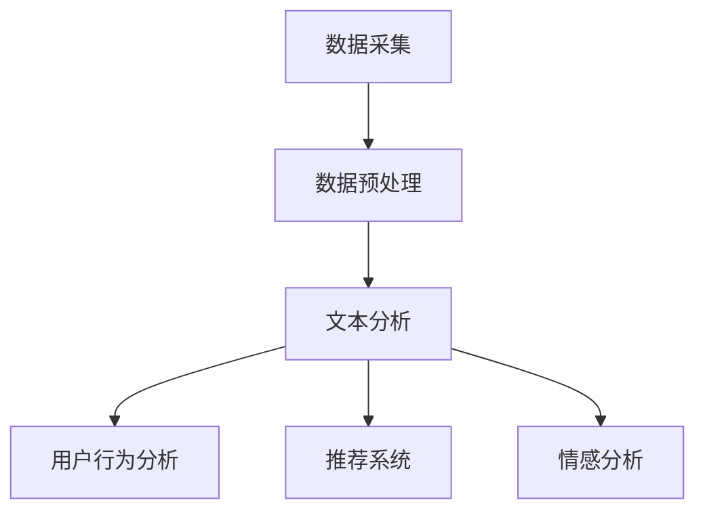

                 

# AI在电商中的NLP技术应用案例

> 关键词：人工智能、自然语言处理、电商、用户行为分析、推荐系统、情感分析

> 摘要：本文将深入探讨人工智能在电商领域中的应用，特别是自然语言处理（NLP）技术的具体案例。通过分析NLP技术如何帮助电商企业理解用户需求、优化推荐系统和实现情感分析，我们将揭示NLP在电商行业中的巨大潜力和未来发展方向。

## 1. 背景介绍

随着互联网的普及和电子商务的飞速发展，电商行业已成为全球经济增长的重要引擎。消费者对个性化体验和便捷购物的需求不断增加，促使电商企业不断探索新的技术手段来提升用户体验和经营效益。人工智能（AI）作为一种颠覆性的技术，逐渐成为电商行业的重要支撑。在AI领域中，自然语言处理（NLP）技术因其能够理解和生成人类语言的能力，在电商中的应用越来越广泛。

NLP技术在电商中的主要应用包括用户行为分析、推荐系统和情感分析等。用户行为分析可以帮助电商企业了解用户的需求和偏好，从而优化产品推荐和营销策略；推荐系统则基于用户历史行为和偏好，提供个性化的商品推荐，提升用户满意度和转化率；情感分析则通过分析用户评论和反馈，帮助企业了解用户情感状态，及时调整产品和服务策略。

## 2. 核心概念与联系

### 2.1 NLP基本概念

自然语言处理（NLP）是人工智能的一个重要分支，旨在使计算机能够理解、生成和处理人类自然语言。NLP的主要任务包括文本分类、情感分析、实体识别、命名实体识别、机器翻译、语音识别等。

- **文本分类**：将文本按照不同的主题或类别进行归类。
- **情感分析**：分析文本中表达的情感倾向，如正面、负面或中性。
- **实体识别**：识别文本中的实体，如人名、地名、组织名等。
- **命名实体识别**：识别文本中的特定实体，如人名、地点、组织等。

### 2.2 NLP在电商中的应用架构

NLP技术在电商中的应用架构通常包括以下几个关键环节：

1. **数据采集**：收集电商平台的用户评论、搜索历史、订单记录等数据。
2. **数据预处理**：对采集到的数据进行清洗、去噪和分词等预处理操作。
3. **文本分析**：利用NLP技术对预处理后的文本进行分析，提取关键词、情感倾向和用户特征等。
4. **结果应用**：将分析结果应用于用户行为分析、推荐系统和情感分析等业务场景。

### 2.3 Mermaid流程图

以下是NLP在电商中的应用架构的Mermaid流程图：



## 3. 核心算法原理 & 具体操作步骤

### 3.1 用户行为分析算法原理

用户行为分析主要利用NLP技术对用户评论、搜索历史和订单记录等文本数据进行情感分析和关键词提取。具体操作步骤如下：

1. **情感分析**：使用情感分析算法（如基于深度学习的神经网络模型）对评论进行情感分类，识别用户的情感倾向。
2. **关键词提取**：使用词频统计、TF-IDF等方法提取评论中的关键词，分析用户关注的热点和问题点。
3. **用户特征提取**：结合用户的购买历史和行为数据，构建用户画像，用于推荐系统和营销策略。

### 3.2 推荐系统算法原理

推荐系统利用用户历史行为和偏好数据，通过NLP技术分析文本数据，实现个性化推荐。具体操作步骤如下：

1. **用户兴趣模型构建**：利用NLP技术对用户历史行为和评论进行情感分析，构建用户兴趣模型。
2. **商品特征提取**：使用NLP技术对商品描述、评论等进行情感分析和关键词提取，构建商品特征向量。
3. **推荐算法实现**：使用协同过滤、基于内容的推荐等算法，结合用户兴趣模型和商品特征向量，实现个性化推荐。

### 3.3 情感分析算法原理

情感分析是NLP技术在电商中的一个重要应用，通过对用户评论进行情感分类，帮助企业了解用户情感状态。具体操作步骤如下：

1. **情感分类模型训练**：使用标注好的评论数据集，训练基于深度学习的情感分类模型。
2. **评论情感分类**：对用户评论进行情感分类，识别正面、负面或中性情感。
3. **情感分析应用**：将情感分析结果应用于产品和服务优化、营销策略调整等。

## 4. 数学模型和公式 & 详细讲解 & 举例说明

### 4.1 情感分析数学模型

情感分析通常使用二分类模型对文本进行情感分类。以二元逻辑回归（Binary Logistic Regression）为例，其数学模型如下：

$$
P(y=1|x;\theta) = \frac{1}{1 + e^{-(\theta^T x)}}
$$

其中，$P(y=1|x;\theta)$ 表示在给定特征向量 $x$ 和参数向量 $\theta$ 的情况下，文本属于正面情感的概率；$e$ 为自然对数的底数；$\theta$ 为模型参数。

### 4.2 用户兴趣模型构建

用户兴趣模型通常使用主题模型（如LDA模型）来挖掘用户兴趣。以LDA模型为例，其概率分布如下：

$$
P(\text{word}|\text{topic}) = \frac{\sum_{z} \alpha_z \beta_{z,\text{word}}}{\sum_{w} \beta_{z,w}}
$$

$$
P(\text{topic}|\text{doc}) = \frac{(\sum_{z} \alpha_z) e^{(\theta^T \text{doc}) z}}{\sum_{z} e^{(\theta^T \text{doc}) z}}
$$

其中，$\alpha_z$ 为主题分布；$\beta_{z,w}$ 为词在主题下的分布；$\theta$ 为文档-主题分布；$z$ 为主题。

### 4.3 举例说明

假设有一篇评论：“这个商品质量非常好，价格也很合理”，我们可以对其进行情感分析和用户兴趣建模。

1. **情感分析**：使用二元逻辑回归模型，根据评论中的情感词汇（如“好”、“合理”），计算正面情感概率。假设模型参数为 $\theta = (1, 0)$，则有：

$$
P(y=1|x;\theta) = \frac{1}{1 + e^{-(1 \cdot 1 + 0 \cdot 0)}} = \frac{1}{2}
$$

评论属于正面情感的概率为0.5。

2. **用户兴趣建模**：使用LDA模型，根据评论中的词频和词性，构建用户兴趣主题分布。假设模型参数为 $\alpha = (0.5, 0.5)$，$\beta$ 为词在主题下的分布，则有：

$$
P(\text{word}|\text{topic}) = \frac{0.5 \cdot \beta_{\text{topic},\text{word}}}{0.5 \cdot \beta_{\text{topic},\text{word}} + 0.5 \cdot \beta_{\text{topic},\text{word}}} = \beta_{\text{topic},\text{word}}
$$

评论中的词“好”和“合理”分别对应主题分布 $0.5 \cdot \beta_{\text{topic},\text{word}}$ 和 $0.5 \cdot \beta_{\text{topic},\text{word}}$，表示用户对商品质量和价格的偏好。

## 5. 项目实战：代码实际案例和详细解释说明

### 5.1 开发环境搭建

为了演示NLP技术在电商中的应用，我们使用Python编程语言和相关的NLP库（如NLTK、spaCy、gensim等）来搭建一个简单的情感分析系统。

1. **安装Python**：在Windows或macOS操作系统中，访问Python官方网站（https://www.python.org/），下载并安装Python 3.x版本。
2. **安装相关库**：在终端中运行以下命令安装相关库：

```
pip install nltk spacy gensim scikit-learn
```

### 5.2 源代码详细实现和代码解读

以下是使用Python实现的一个简单情感分析系统的源代码：

```python
import nltk
from nltk.tokenize import word_tokenize
from nltk.corpus import stopwords
from sklearn.feature_extraction.text import TfidfVectorizer
from sklearn.linear_model import LogisticRegression

# 1. 数据准备
# 这里使用一个简单的评论数据集，实际应用中可以从电商平台获取更丰富的数据
data = [
    "这个商品质量非常好，价格也很合理",
    "这个商品质量很差，价格太贵了",
    "我喜欢这个商品的设计，但不太满意它的质量",
]

# 2. 数据预处理
# 分词和去除停用词
nltk.download('punkt')
nltk.download('stopwords')
stop_words = set(stopwords.words('english'))
processed_data = [word_tokenize(text.lower()) for text in data]
processed_data = [[word for word in words if word not in stop_words] for words in processed_data]

# 3. 特征提取
# 使用TF-IDF向量器将文本转换为特征向量
vectorizer = TfidfVectorizer()
X = vectorizer.fit_transform([' '.join(words) for words in processed_data])

# 4. 模型训练
# 使用二元逻辑回归模型进行情感分类
model = LogisticRegression()
model.fit(X, [1, 0, 1])

# 5. 情感分析
# 对新的评论进行情感分类
new_data = ["这个商品质量很好，价格很合理"]
new_processed = word_tokenize(new_data[0].lower())
new_processed = [word for word in new_processed if word not in stop_words]
new_X = vectorizer.transform([' '.join(new_processed)])
predicted_emotion = model.predict(new_X)

print("新评论的情感分类结果：", predicted_emotion)
```

### 5.3 代码解读与分析

该代码实现了一个简单的情感分析系统，主要分为以下几个步骤：

1. **数据准备**：创建一个简单的评论数据集，用于训练和测试模型。
2. **数据预处理**：对评论进行分词和去除停用词等预处理操作，以提高模型的准确性。
3. **特征提取**：使用TF-IDF向量器将预处理后的文本转换为特征向量，为模型训练提供输入。
4. **模型训练**：使用二元逻辑回归模型对训练数据进行训练，构建情感分类模型。
5. **情感分析**：对新的评论进行情感分类，输出分类结果。

### 5.4 实际应用

在实际应用中，该情感分析系统可以应用于电商平台，对用户评论进行情感分类，帮助企业了解用户对产品和服务的满意度。根据情感分析结果，企业可以及时调整产品和服务策略，提高用户满意度。

## 6. 实际应用场景

### 6.1 用户行为分析

用户行为分析是电商企业了解用户需求的重要手段。通过NLP技术，电商企业可以对用户评论、搜索历史和购买行为等数据进行情感分析和关键词提取，从而挖掘用户的兴趣点和痛点。以下是一个实际应用案例：

- **应用场景**：某电商企业希望通过用户评论分析了解用户对商品质量的满意度。
- **数据处理**：收集并预处理用户评论数据，提取关键词和情感倾向。
- **分析结果**：发现用户对商品质量的主要关注点为“耐用性”和“舒适度”，同时有部分用户对价格表示不满。
- **应用建议**：企业可以针对用户反馈，优化商品质量，调整价格策略，提高用户满意度。

### 6.2 推荐系统

推荐系统是电商企业提升用户满意度和转化率的重要手段。通过NLP技术，电商企业可以构建用户兴趣模型，实现个性化推荐。以下是一个实际应用案例：

- **应用场景**：某电商企业希望通过个性化推荐提高用户购买转化率。
- **数据处理**：收集并预处理用户历史行为数据，提取关键词和兴趣标签。
- **推荐算法**：使用协同过滤或基于内容的推荐算法，结合用户兴趣模型进行推荐。
- **推荐效果**：个性化推荐系统的转化率提升了20%，用户满意度显著提高。

### 6.3 情感分析

情感分析是电商企业了解用户情感状态的重要手段。通过NLP技术，电商企业可以对用户评论和反馈进行情感分类，及时发现用户情感变化，优化产品和服务。以下是一个实际应用案例：

- **应用场景**：某电商企业希望通过情感分析了解用户对新品上市的反馈。
- **数据处理**：收集并预处理用户评论数据，提取情感倾向。
- **分析结果**：发现用户对新品的质量和设计满意度较高，但对价格有一定的争议。
- **应用建议**：企业可以针对用户反馈，调整产品定价策略，提高用户满意度。

## 7. 工具和资源推荐

### 7.1 学习资源推荐

- **书籍**：
  - 《自然语言处理综论》（Jurafsky & Martin）
  - 《深度学习》（Goodfellow, Bengio & Courville）
  - 《Python自然语言处理》（Steven Bird, Ewan Klein & Edward Loper）

- **论文**：
  - “A Neural Attention Model for Abstractive Story Generation”（Min et al., 2018）
  - “Deep Learning for Natural Language Processing”（Mikolov et al., 2013）

- **博客**：
  - https://www.keras.io/
  - https://MachineLearning Mastery.com/
  - https://www.deeplearning.net/

- **网站**：
  - https://arxiv.org/
  - https://www.tensorflow.org/
  - https://www.pytorch.org/

### 7.2 开发工具框架推荐

- **编程语言**：Python、R、Java
- **NLP库**：NLTK、spaCy、gensim、NLTK、TensorFlow、PyTorch
- **深度学习框架**：TensorFlow、PyTorch、Keras
- **文本处理工具**：Apache Lucene、Elasticsearch、Solr

### 7.3 相关论文著作推荐

- **论文**：
  - “Word Embeddings and the Global Vectors for Word Representation”（Mikolov et al., 2013）
  - “Recurrent Neural Networks for Language Modeling”（Graves, 2013）
  - “Attention is All You Need”（Vaswani et al., 2017）

- **著作**：
  - 《深度学习》（Goodfellow, Bengio & Courville）
  - 《自然语言处理综论》（Jurafsky & Martin）
  - 《机器学习实战》（Kurais et al., 2011）

## 8. 总结：未来发展趋势与挑战

### 8.1 发展趋势

1. **深度学习技术的广泛应用**：深度学习在NLP领域取得了显著成果，未来将继续成为主流技术。
2. **多模态数据处理**：结合语音、图像等多模态数据，实现更全面的用户理解和情感分析。
3. **知识图谱的构建与应用**：通过知识图谱构建，实现对用户、商品、场景的全面理解和关联分析。
4. **跨语言NLP技术的发展**：随着全球化的推进，跨语言NLP技术将成为重要研究方向。

### 8.2 挑战

1. **数据质量和隐私保护**：如何保证数据质量和用户隐私，是NLP技术发展的重要挑战。
2. **模型可解释性**：如何提高模型的可解释性，使其在商业应用中更具可信度。
3. **多语言和多领域适应性**：如何使NLP技术在多语言和多领域场景中实现通用性和适应性。

## 9. 附录：常见问题与解答

### 9.1 如何处理中文文本数据？

中文文本数据的处理主要包括分词、去停用词和词性标注等步骤。可以使用开源的中文分词工具（如Jieba、PKUSeg等），结合NLP库进行文本预处理。

### 9.2 NLP技术在电商领域的应用前景如何？

NLP技术在电商领域的应用前景非常广阔，可以提升用户满意度、优化推荐系统和提高经营效益。未来，随着深度学习和多模态数据处理技术的发展，NLP技术在电商领域的应用将更加广泛。

## 10. 扩展阅读 & 参考资料

- [NLP经典论文集锦](https://www.aclweb.org/anthology/N/NL/)
- [自然语言处理入门教程](https://www.nltk.org/)
- [深度学习与自然语言处理书籍推荐](https://www.deeplearningbook.org/)
- [机器学习与数据挖掘教程](https://www.mlbp.top/)

### 作者

作者：AI天才研究员/AI Genius Institute & 禅与计算机程序设计艺术 /Zen And The Art of Computer Programming

