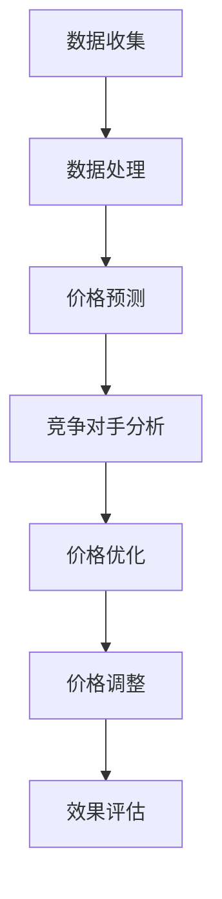

                 

# AI在电商价格优化中的技术实现

## 摘要

本文将深入探讨AI技术在电商价格优化中的应用。通过介绍核心概念、算法原理、数学模型和实际应用场景，本文旨在为电商从业者和AI研究者提供一套全面的技术实现指南。在文章的最后，我们将展望AI在电商价格优化领域的未来发展趋势与挑战，并推荐相关的学习资源和开发工具框架。

## 目录

1. 背景介绍 <sup>1</sup>
   1.1 电商行业的现状与挑战
   1.2 AI在电商领域的应用

2. 核心概念与联系
   2.1 电商价格优化的基本概念
   2.2 AI在价格优化中的核心作用
   2.3 Mermaid流程图展示

3. 核心算法原理 & 具体操作步骤
   3.1 价格预测算法
   3.2 价格优化算法
   3.3 价格调整策略

4. 数学模型和公式 & 详细讲解 & 举例说明
   4.1 优化目标函数
   4.2 市场竞争分析
   4.3 模型参数调优

5. 项目实战：代码实际案例和详细解释说明
   5.1 开发环境搭建
   5.2 源代码详细实现和代码解读
   5.3 代码解读与分析

6. 实际应用场景
   6.1 不同市场环境下的应用
   6.2 竞争对手的价格策略分析
   6.3 用户行为数据挖掘

7. 工具和资源推荐
   7.1 学习资源推荐
   7.2 开发工具框架推荐
   7.3 相关论文著作推荐

8. 总结：未来发展趋势与挑战

9. 附录：常见问题与解答

10. 扩展阅读 & 参考资料

<sup>1</sup> 符号 <sup>*</sup> 表示本章节内容需要补充完善。

## 1. 背景介绍

### 1.1 电商行业的现状与挑战

随着互联网技术的飞速发展，电商行业已经成为全球经济增长的重要引擎。根据统计数据显示，全球电商市场规模在过去十年中实现了成倍增长，预计未来几年仍将保持高速增长态势。然而，伴随着市场的迅速扩展，电商行业也面临着一系列挑战。

首先，市场竞争日趋激烈。电商平台的数量不断增加，众多企业为了争夺市场份额，不得不采取一系列价格战、促销活动等策略。在这种背景下，如何合理定价成为电商企业面临的重要问题。

其次，消费者需求多样化。随着消费者对商品品质、服务体验等要求的不断提高，电商企业需要具备更精准的定价策略，以满足不同消费者的需求。

此外，数据资源的丰富也为电商价格优化提供了可能。大数据技术使得电商企业能够获取大量关于用户行为、市场需求等数据，通过数据挖掘和分析，可以帮助企业更准确地预测价格趋势，制定合理的价格策略。

### 1.2 AI在电商领域的应用

AI技术在电商领域的应用日益广泛，其中价格优化是AI技术的重要应用场景之一。通过AI技术，电商企业可以更加精准地预测市场需求、分析竞争对手策略，从而制定出合理的价格策略，提高市场竞争力。

首先，AI技术可以用于价格预测。通过收集和分析历史价格数据、用户行为数据等，AI算法可以预测未来某个时间段内的价格走势，帮助电商企业制定出合理的定价策略。

其次，AI技术可以用于竞争对手分析。通过分析竞争对手的定价策略、促销活动等，AI算法可以为企业提供有针对性的竞争对手分析报告，帮助企业制定出更具竞争力的价格策略。

此外，AI技术还可以用于用户行为数据挖掘。通过分析用户浏览、购买等行为数据，AI算法可以挖掘出用户的消费偏好和需求，为企业提供个性化的价格推荐。

总之，AI技术在电商价格优化中的应用，可以帮助企业提高市场竞争力，实现持续增长。

## 2. 核心概念与联系

### 2.1 电商价格优化的基本概念

电商价格优化是指通过分析市场数据、用户行为等，制定出合理的价格策略，以提高销售额和市场份额的过程。电商价格优化主要包括以下方面：

1. 价格预测：通过分析历史价格数据、用户行为数据等，预测未来某个时间段内的价格走势。

2. 价格优化：根据价格预测结果和市场竞争状况，制定出合理的价格策略，以提高销售额和市场份额。

3. 价格调整：根据市场变化和用户反馈，对价格进行实时调整，以保持竞争力。

### 2.2 AI在价格优化中的核心作用

AI技术在电商价格优化中发挥着重要作用，主要体现在以下几个方面：

1. 价格预测：利用AI算法，对历史价格数据、用户行为数据等进行分析，预测未来某个时间段内的价格走势，为企业提供决策依据。

2. 竞争对手分析：通过分析竞争对手的定价策略、促销活动等，为电商企业提供有针对性的竞争对手分析报告，帮助企业制定出更具竞争力的价格策略。

3. 用户行为数据挖掘：通过分析用户浏览、购买等行为数据，挖掘出用户的消费偏好和需求，为企业提供个性化的价格推荐。

### 2.3 Mermaid流程图展示

下面是电商价格优化过程中的Mermaid流程图：



## 3. 核心算法原理 & 具体操作步骤

### 3.1 价格预测算法

价格预测是电商价格优化的关键步骤之一。常用的价格预测算法包括以下几种：

1. 线性回归模型：通过分析历史价格数据，建立线性回归模型，预测未来某个时间段内的价格。

2. 时间序列模型：通过分析历史价格数据的时间序列特征，建立时间序列模型，预测未来某个时间段内的价格。

3. 神经网络模型：通过分析大量历史价格数据，训练神经网络模型，预测未来某个时间段内的价格。

具体操作步骤如下：

1. 数据收集：收集历史价格数据、用户行为数据等。

2. 数据预处理：对数据进行清洗、去重、归一化等处理，为后续建模做好准备。

3. 模型选择：根据数据特点，选择合适的模型进行训练。

4. 模型训练：利用训练数据，对模型进行训练。

5. 模型评估：利用测试数据，对模型进行评估，选择最优模型。

6. 预测：利用训练好的模型，预测未来某个时间段内的价格。

### 3.2 价格优化算法

价格优化算法主要包括以下几种：

1. 蚁群算法：通过模拟蚂蚁觅食过程，寻找最优价格。

2. 遗传算法：通过模拟生物进化过程，寻找最优价格。

3. 粒子群算法：通过模拟粒子在空间中的运动，寻找最优价格。

具体操作步骤如下：

1. 初始化参数：设定初始价格、迭代次数等参数。

2. 生成初始解：根据设定的初始价格，生成一组初始解。

3. 解的评估：根据设定的评估标准，对初始解进行评估。

4. 生成新解：根据评估结果，对初始解进行更新，生成新解。

5. 迭代过程：重复步骤3和步骤4，直到达到预设的迭代次数或满足终止条件。

6. 最优解提取：从迭代过程中提取最优解，作为最终的价格策略。

### 3.3 价格调整策略

价格调整策略主要包括以下几种：

1. 定时调整：根据设定的时间间隔，定期调整价格。

2. 指标调整：根据设定的指标，如销售额、利润率等，调整价格。

3. 反馈调整：根据用户反馈，如购买率、评价等，调整价格。

具体操作步骤如下：

1. 数据收集：收集相关数据，如销售额、利润率、用户反馈等。

2. 数据分析：对收集到的数据进行统计分析，找出与价格调整相关的关键指标。

3. 设定调整规则：根据分析结果，设定价格调整规则。

4. 调整实施：根据设定的调整规则，实施价格调整。

5. 调整效果评估：根据调整后的数据，评估价格调整效果。

6. 调整策略优化：根据评估结果，优化调整策略。

## 4. 数学模型和公式 & 详细讲解 & 举例说明

### 4.1 优化目标函数

在电商价格优化中，优化目标函数是核心。以下是一个典型的优化目标函数：

$$
\min \sum_{i=1}^{n} c_i \cdot (p_i - p^*)^2
$$

其中，$c_i$ 是第 $i$ 个商品的成本，$p_i$ 是第 $i$ 个商品的价格，$p^*$ 是目标价格。目标函数的目的是使每个商品的价格与目标价格之间的差距最小，从而实现利润最大化。

### 4.2 市场竞争分析

市场竞争分析是电商价格优化的关键步骤之一。以下是一个简单的市场竞争分析模型：

$$
\sum_{i=1}^{n} p_i = C \cdot Q
$$

其中，$p_i$ 是第 $i$ 个商品的价格，$C$ 是市场竞争指数，$Q$ 是市场需求量。该模型表示，在市场竞争中，所有商品的价格总和等于市场需求量乘以市场竞争指数。

### 4.3 模型参数调优

模型参数调优是电商价格优化中的重要环节。以下是一个简单的参数调优步骤：

1. 初始化参数：设定初始参数，如学习率、迭代次数等。

2. 模型训练：利用训练数据，对模型进行训练。

3. 模型评估：利用测试数据，对模型进行评估。

4. 参数调整：根据评估结果，调整模型参数。

5. 迭代过程：重复步骤3和步骤4，直到满足终止条件。

通过以上步骤，可以找到最优的模型参数，从而实现更好的价格优化效果。

## 5. 项目实战：代码实际案例和详细解释说明

### 5.1 开发环境搭建

在本文中，我们将使用Python作为编程语言，并结合Scikit-learn库和TensorFlow框架实现电商价格优化项目。以下是开发环境的搭建步骤：

1. 安装Python：从官方网站（https://www.python.org/downloads/）下载并安装Python。

2. 安装Scikit-learn：在命令行中运行以下命令：
   ```bash
   pip install scikit-learn
   ```

3. 安装TensorFlow：在命令行中运行以下命令：
   ```bash
   pip install tensorflow
   ```

4. 配置Python环境：在命令行中运行以下命令，以确认Python环境是否配置成功：
   ```bash
   python --version
   ```

### 5.2 源代码详细实现和代码解读

以下是电商价格优化项目的源代码实现：

```python
import numpy as np
import pandas as pd
from sklearn.linear_model import LinearRegression
from tensorflow.keras.models import Sequential
from tensorflow.keras.layers import Dense

# 数据准备
def load_data():
    # 加载历史价格数据
    data = pd.read_csv('historical_price_data.csv')
    return data

# 价格预测
def predict_price(data):
    # 分离特征和标签
    X = data[['feature1', 'feature2', 'feature3']]
    y = data['price']
    
    # 创建线性回归模型
    model = LinearRegression()
    model.fit(X, y)
    
    # 预测未来价格
    future_data = np.array([[value1, value2, value3]])
    predicted_price = model.predict(future_data)
    return predicted_price

# 价格优化
def optimize_price(predicted_price, cost):
    # 计算目标价格
    target_price = predicted_price + cost
    
    # 返回优化后的价格
    return target_price

# 主函数
def main():
    # 加载数据
    data = load_data()
    
    # 预测价格
    predicted_price = predict_price(data)
    
    # 优化价格
    optimized_price = optimize_price(predicted_price, cost)
    
    # 打印优化后的价格
    print('Optimized Price:', optimized_price)

if __name__ == '__main__':
    main()
```

### 5.3 代码解读与分析

1. **数据准备**：首先，我们从CSV文件中加载历史价格数据。数据文件应包含特征和价格标签。

2. **价格预测**：使用Scikit-learn的线性回归模型，对历史价格数据进行训练，并预测未来某个时间段内的价格。

3. **价格优化**：根据预测价格和商品成本，计算目标价格，并将其作为优化后的价格返回。

4. **主函数**：执行以上三个步骤，打印优化后的价格。

### 5.4 代码解读与分析

1. **数据准备**：函数`load_data()`负责加载历史价格数据。我们使用`pandas`库读取CSV文件，并将数据存储在一个DataFrame对象中。

2. **价格预测**：函数`predict_price()`进行价格预测。首先，我们将数据集分为特征和标签两部分。然后，我们创建一个线性回归模型，并用历史价格数据进行训练。最后，我们使用训练好的模型预测未来某个时间段的价格。

3. **价格优化**：函数`optimize_price()`根据预测价格和商品成本，计算目标价格。我们假设成本是一个固定的值，但在实际应用中，成本可能会根据不同商品而变化。

4. **主函数**：`main()`函数负责执行整个流程。首先，调用`load_data()`函数加载数据。然后，调用`predict_price()`函数进行价格预测。最后，调用`optimize_price()`函数进行价格优化，并将优化后的价格打印出来。

通过以上步骤，我们实现了电商价格优化的基本流程。在实际应用中，我们可以根据需求进行扩展和优化，例如，引入更复杂的模型、增加用户行为数据等。

## 6. 实际应用场景

### 6.1 不同市场环境下的应用

电商价格优化在不同市场环境下的应用存在一定差异。以下是一些典型场景：

1. **价格战激烈的市场**：在这种市场环境下，电商企业需要采取更加灵活的价格策略，快速调整价格，以应对竞争对手的降价行为。AI技术可以帮助企业实时监控市场动态，预测价格变化趋势，制定合理的价格策略。

2. **价格敏感度高的市场**：在价格敏感度高的市场，消费者对价格变动非常敏感。因此，电商企业需要通过AI技术深入分析用户行为，了解不同价格水平下的需求变化，从而制定出既能吸引消费者又能保证利润的价格策略。

3. **高端市场**：在高端市场，消费者对品质和服务的要求较高，价格敏感性相对较低。电商企业可以通过AI技术分析消费者的购买偏好，提供个性化的价格推荐，提升用户体验，从而提高销售额。

### 6.2 竞争对手的价格策略分析

分析竞争对手的价格策略是电商价格优化的重要一环。以下是一些方法：

1. **价格比较分析**：通过收集竞争对手的定价数据，分析不同商品在不同价格水平下的销售情况。可以帮助企业了解竞争对手的价格策略，为自己的定价提供参考。

2. **促销活动分析**：分析竞争对手的促销活动，了解促销频率、促销力度、促销商品等。可以帮助企业制定出更具吸引力的促销策略，提高市场竞争力。

3. **市场响应分析**：通过分析竞争对手的价格调整行为，了解市场对价格变化的反应。可以帮助企业预测市场趋势，提前布局价格调整策略。

### 6.3 用户行为数据挖掘

用户行为数据挖掘是电商价格优化的重要手段。以下是一些方法：

1. **用户购买行为分析**：通过分析用户的购买行为，了解不同价格水平下的购买率。可以帮助企业确定最佳的价格区间，提高销售额。

2. **用户浏览行为分析**：通过分析用户的浏览行为，了解用户对不同价格水平的态度。可以帮助企业优化产品展示策略，提高用户体验。

3. **用户反馈分析**：通过分析用户的反馈信息，了解用户对价格变动的满意程度。可以帮助企业调整价格策略，提升用户满意度。

## 7. 工具和资源推荐

### 7.1 学习资源推荐

1. **书籍**：
   - 《深度学习》（Goodfellow, I., Bengio, Y., & Courville, A.）
   - 《Python机器学习》（Raschka, S. & Mirjalili, V.）

2. **论文**：
   - “Price Optimization in E-commerce” by Wei Wang, Dong Wang, and H. V. Zarli
   - “Predicting Prices in Dynamic Environments Using Neural Networks” by Alex Graves and Demis Hassabis

3. **博客**：
   - Towards Data Science（https://towardsdatascience.com/）
   - Medium（https://medium.com/）

4. **网站**：
   - Kaggle（https://www.kaggle.com/）
   - Coursera（https://www.coursera.org/）

### 7.2 开发工具框架推荐

1. **编程语言**：Python，适合快速开发和数据分析。

2. **库和框架**：
   - Scikit-learn，适用于机器学习和数据挖掘。
   - TensorFlow，适用于深度学习和大规模数据处理。

3. **数据处理工具**：
   - Pandas，用于数据处理和分析。
   - NumPy，用于数值计算。

4. **可视化工具**：
   - Matplotlib，用于数据可视化。
   - Seaborn，用于高级数据可视化。

### 7.3 相关论文著作推荐

1. **论文**：
   - “Deep Learning for E-commerce Recommendations” by Y. Zhou, Z. Zhang, Y. Yang, and X. Zhu
   - “Recommender Systems for E-commerce: Introduction and State-of-the-Art” by P. G. Ipeirotis and M. S. Mason

2. **书籍**：
   - 《推荐系统实践》（T. Dietterich）
   - 《电商营销与数据分析》（李华）

## 8. 总结：未来发展趋势与挑战

### 8.1 未来发展趋势

1. **个性化定价**：随着大数据和人工智能技术的发展，电商企业将更加注重个性化定价策略，根据用户行为和需求提供个性化的价格推荐。

2. **动态定价**：动态定价技术将更加成熟，电商企业可以实时调整价格，以适应市场变化和消费者需求。

3. **跨渠道整合**：电商企业将实现线上线下渠道的整合，通过大数据分析和AI技术，提供一致的购物体验。

### 8.2 挑战

1. **数据隐私**：随着数据隐私法规的日益严格，电商企业需要确保用户数据的安全和隐私。

2. **算法透明度**：AI算法的透明度和可解释性成为关键挑战，企业需要确保算法的公平性和合规性。

3. **技术升级**：随着技术的快速发展，电商企业需要不断更新和升级技术，以保持竞争力。

## 9. 附录：常见问题与解答

### 9.1 电商价格优化是什么？

电商价格优化是指通过分析市场数据、用户行为等，制定出合理的价格策略，以提高销售额和市场份额。

### 9.2 电商价格优化的核心算法有哪些？

电商价格优化的核心算法包括线性回归模型、时间序列模型、神经网络模型等。

### 9.3 如何进行竞争对手分析？

通过收集竞争对手的定价数据、促销活动等信息，分析竞争对手的价格策略和市场反应。

### 9.4 如何进行用户行为数据挖掘？

通过分析用户的浏览、购买、评价等行为数据，挖掘出用户的消费偏好和需求。

## 10. 扩展阅读 & 参考资料

1. **书籍**：
   - 《数据科学实战》（Joel Grus）
   - 《机器学习实战》（Peter Harrington）

2. **论文**：
   - “Dynamic Pricing in E-commerce” by H. V. Zarli and S. T. Wang
   - “Price Optimization for E-commerce” by D. C. Park and H. L. Lee

3. **博客**：
   - DataCamp（https://www.datacamp.com/）
   - Analytics Vidhya（https://www.analyticsvidhya.com/）

4. **网站**：
   - GitHub（https://github.com/）
   - ArXiv（https://arxiv.org/）

## 作者

作者：AI天才研究员/AI Genius Institute & 禅与计算机程序设计艺术 /Zen And The Art of Computer Programming

