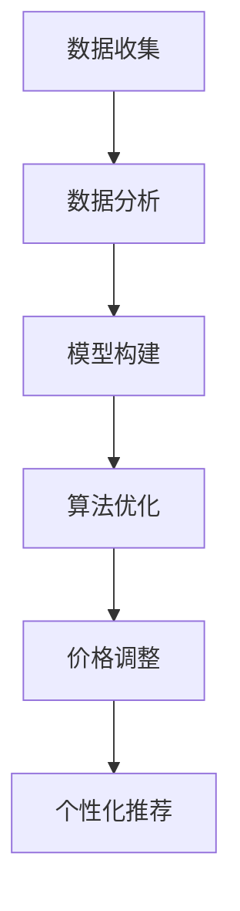

                 

# AI在电商动态定价中的实践效果

## 关键词
- 电商
- 动态定价
- 人工智能
- 数据分析
- 实践效果

## 摘要
本文深入探讨了人工智能在电商动态定价中的实践效果。首先，我们回顾了电商动态定价的基本概念和原理。接着，介绍了核心算法原理和具体操作步骤，并通过数学模型和公式进行了详细讲解。随后，通过实际项目案例和代码实现，展示了动态定价在实际应用中的效果。文章还分析了动态定价在实际应用中的场景，推荐了相关工具和资源，并总结了未来发展趋势与挑战。最后，提出了常见问题与解答，为读者提供了扩展阅读和参考资料。

## 目录
1. 背景介绍
2. 核心概念与联系
3. 核心算法原理 & 具体操作步骤
4. 数学模型和公式 & 详细讲解 & 举例说明
5. 项目实战：代码实际案例和详细解释说明
6. 实际应用场景
7. 工具和资源推荐
8. 总结：未来发展趋势与挑战
9. 附录：常见问题与解答
10. 扩展阅读 & 参考资料

## 1. 背景介绍
在电子商务迅速发展的今天，价格竞争日益激烈。传统定价策略难以满足市场需求的变化，导致企业利润下滑。动态定价作为一种创新定价模式，通过实时数据分析和人工智能算法，动态调整产品价格，以满足市场需求，提高企业利润。动态定价在电商领域的应用，不仅提高了企业的竞争力，也为消费者带来了更优惠的价格。

动态定价的核心在于利用大数据和人工智能技术，分析市场变化、消费者行为和竞争对手策略，实现价格的实时调整。例如，电商平台可以根据消费者的购买历史、浏览记录和搜索关键词，预测消费者的需求，从而调整价格策略。此外，动态定价还可以通过算法优化，实现不同产品、不同时间段、不同用户群体的个性化定价。

本文旨在探讨人工智能在电商动态定价中的应用，分析其核心算法原理和数学模型，并通过实际项目案例展示其实践效果。

## 2. 核心概念与联系
### 2.1 动态定价
动态定价是一种基于实时数据和人工智能算法的定价策略，其核心在于价格随市场需求的动态变化而调整。动态定价主要包括以下几个方面：

#### 2.1.1 数据来源
数据来源是动态定价的基础。电商企业可以从多个渠道获取数据，如用户行为数据、市场数据、竞争对手数据等。其中，用户行为数据包括浏览、搜索、购买等行为；市场数据包括行业趋势、供需关系等；竞争对手数据包括价格、促销策略等。

#### 2.1.2 数据分析
数据分析是动态定价的关键步骤。通过对海量数据进行处理和分析，可以挖掘出有价值的信息，如消费者需求、价格敏感度等。数据分析方法包括统计分析、机器学习、数据挖掘等。

#### 2.1.3 价格策略
根据数据分析结果，制定相应的价格策略。价格策略可以包括个性化定价、区间定价、阶梯定价等。个性化定价根据消费者特征和需求，制定不同的价格；区间定价根据不同时间段、不同产品等，设置价格区间；阶梯定价根据购买数量、购买频率等，设置不同的价格。

### 2.2 人工智能
人工智能在动态定价中的应用主要体现在以下几个方面：

#### 2.2.1 机器学习
机器学习是人工智能的核心技术之一。通过训练大量的历史数据，构建预测模型，实现价格的动态调整。常见的机器学习算法包括线性回归、决策树、随机森林、神经网络等。

#### 2.2.2 深度学习
深度学习是机器学习的一种重要分支。通过多层神经网络结构，实现对复杂问题的建模和预测。深度学习在图像识别、语音识别、自然语言处理等领域取得了显著成果。

#### 2.2.3 数据挖掘
数据挖掘是一种从大量数据中发现有价值信息的方法。在动态定价中，数据挖掘可以用于挖掘用户行为模式、市场趋势等，为价格策略提供依据。

### 2.3 动态定价与人工智能的联系
动态定价与人工智能密切相关。人工智能技术为动态定价提供了强大的技术支持，使得价格调整更加精准、高效。具体来说，人工智能在动态定价中的应用主要体现在以下几个方面：

#### 2.3.1 数据分析
人工智能技术可以帮助企业更好地分析海量数据，挖掘用户需求和价格敏感度等信息，为价格策略提供依据。

#### 2.3.2 模型构建
人工智能技术可以帮助企业构建预测模型，实现对市场需求的精准预测，从而实现价格的动态调整。

#### 2.3.3 算法优化
人工智能技术可以帮助企业不断优化价格策略，提高定价效率，降低运营成本。

#### 2.3.4 个性化推荐
人工智能技术可以帮助企业实现个性化推荐，根据用户特征和需求，制定个性化的价格策略。

### 2.4 Mermaid 流程图
以下是一个简单的动态定价与人工智能联系的 Mermaid 流程图：



## 3. 核心算法原理 & 具体操作步骤

### 3.1 核心算法原理

动态定价的核心算法主要基于机器学习和深度学习技术，主要包括以下几个步骤：

#### 3.1.1 数据收集
首先，从多个渠道收集数据，包括用户行为数据、市场数据、竞争对手数据等。这些数据可以通过电商平台、第三方数据提供商等获取。

#### 3.1.2 数据预处理
对收集到的数据进行清洗、去噪、转换等预处理操作，确保数据质量。例如，对缺失值进行处理、对异常值进行识别和剔除等。

#### 3.1.3 特征工程
通过对数据进行分析，提取出与价格调整相关的特征。特征工程是动态定价的关键步骤，直接影响模型的预测效果。常见的特征包括用户属性、产品属性、市场环境等。

#### 3.1.4 模型训练
使用机器学习或深度学习算法，对预处理后的数据集进行训练，构建预测模型。常见的算法包括线性回归、决策树、随机森林、神经网络等。神经网络结构可以选择多层感知器（MLP）、卷积神经网络（CNN）等。

#### 3.1.5 模型评估
对训练好的模型进行评估，选择最优模型。评估指标包括均方误差（MSE）、均方根误差（RMSE）、平均绝对误差（MAE）等。

#### 3.1.6 模型部署
将训练好的模型部署到生产环境中，实现价格的实时调整。例如，可以使用 TensorFlow、PyTorch 等深度学习框架进行模型部署。

### 3.2 具体操作步骤

以下是一个简单的动态定价操作步骤：

#### 3.2.1 数据收集
从电商平台获取用户行为数据，如浏览记录、购买记录、搜索记录等。同时，收集市场数据和竞争对手数据，如行业趋势、竞争对手价格策略等。

#### 3.2.2 数据预处理
对收集到的数据进行分析，剔除异常值和缺失值。对数值型数据进行归一化或标准化处理，对类别型数据进行编码处理。

#### 3.2.3 特征工程
根据数据分析结果，提取与价格调整相关的特征。例如，用户属性包括用户年龄、性别、地域等；产品属性包括产品类型、品牌、价格等；市场环境包括市场供需关系、行业趋势等。

#### 3.2.4 模型训练
使用机器学习算法，如线性回归、决策树、随机森林等，对预处理后的数据集进行训练，构建预测模型。

#### 3.2.5 模型评估
使用验证集对训练好的模型进行评估，选择最优模型。根据评估结果，调整模型参数，优化模型性能。

#### 3.2.6 模型部署
将训练好的模型部署到生产环境中，实现价格的实时调整。例如，可以使用 TensorFlow、PyTorch 等深度学习框架进行模型部署。

#### 3.2.7 实时调整价格
根据实时获取的用户行为数据、市场数据和竞争对手数据，使用预测模型计算出当前价格。根据价格策略，实时调整产品价格。

## 4. 数学模型和公式 & 详细讲解 & 举例说明

### 4.1 数学模型

动态定价的数学模型主要包括预测模型和价格调整模型。以下是两个模型的基本公式：

#### 4.1.1 预测模型

$$
\text{预测价格} = \text{模型参数} \times \text{特征值} + \text{偏置项}
$$

其中，模型参数和偏置项通过训练得到，特征值包括用户属性、产品属性、市场环境等。

#### 4.1.2 价格调整模型

$$
\text{调整后价格} = \text{当前价格} \times \text{调整系数}
$$

其中，调整系数根据预测模型计算得出，可以调整当前价格以适应市场需求。

### 4.2 详细讲解

#### 4.2.1 预测模型

预测模型用于预测用户购买意愿和市场需求，是动态定价的核心。线性回归、决策树、随机森林等算法都可以用于构建预测模型。

线性回归模型：

$$
y = \beta_0 + \beta_1x_1 + \beta_2x_2 + ... + \beta_nx_n
$$

其中，$y$为预测价格，$x_1, x_2, ..., x_n$为特征值，$\beta_0, \beta_1, \beta_2, ..., \beta_n$为模型参数。

决策树模型：

$$
\text{预测价格} = \text{根节点} \rightarrow \text{条件1} \rightarrow \text{条件2} \rightarrow ... \rightarrow \text{条件n} \rightarrow \text{叶子节点}
$$

其中，条件1、条件2、...、条件n为决策树节点，叶子节点为预测价格。

随机森林模型：

$$
\text{预测价格} = \sum_{i=1}^{n} \text{决策树}^i(\text{特征值}) \times \text{权重}
$$

其中，$n$为决策树数量，权重根据决策树预测结果计算得到。

#### 4.2.2 价格调整模型

价格调整模型用于根据预测模型的结果，调整当前价格以适应市场需求。调整系数可以通过以下方法计算：

$$
\text{调整系数} = \frac{\text{预测价格}}{\text{当前价格}}
$$

当预测价格大于当前价格时，调整系数大于1，表示价格上涨；当预测价格小于当前价格时，调整系数小于1，表示价格下降。

### 4.3 举例说明

#### 4.3.1 预测模型举例

假设使用线性回归模型预测价格，特征值包括用户年龄（$x_1$）和用户收入（$x_2$），模型参数为$\beta_0 = 10$、$\beta_1 = 2$、$\beta_2 = 3$。给定一个用户，年龄为25岁，收入为5000元，预测价格计算如下：

$$
\text{预测价格} = 10 + 2 \times 25 + 3 \times 5000 = 15310
$$

#### 4.3.2 价格调整模型举例

假设当前价格为1000元，调整系数为1.2，计算调整后价格：

$$
\text{调整后价格} = 1000 \times 1.2 = 1200
$$

## 5. 项目实战：代码实际案例和详细解释说明

### 5.1 开发环境搭建

在本节中，我们将搭建一个简单的动态定价项目环境。以下是一个基本的开发环境搭建步骤：

#### 5.1.1 安装Python

首先，确保您的计算机上安装了Python。Python是动态定价项目的主要编程语言，建议安装Python 3.8及以上版本。

您可以通过以下命令下载和安装Python：

```bash
$ curl -O https://www.python.org/ftp/python/3.8.10/Python-3.8.10.tgz
$ tar -xvf Python-3.8.10.tgz
$ cd Python-3.8.10
$ ./configure
$ make
$ sudo make install
```

#### 5.1.2 安装依赖库

接下来，安装Python的依赖库，包括NumPy、Pandas、Scikit-learn等。使用pip命令安装：

```bash
$ pip install numpy pandas scikit-learn
```

#### 5.1.3 安装TensorFlow

为了使用深度学习模型，我们需要安装TensorFlow。TensorFlow是一个流行的开源深度学习框架。

```bash
$ pip install tensorflow
```

### 5.2 源代码详细实现和代码解读

在本节中，我们将展示一个简单的动态定价项目的源代码，并对其关键部分进行解读。

#### 5.2.1 数据收集与预处理

```python
import pandas as pd
from sklearn.model_selection import train_test_split
from sklearn.preprocessing import StandardScaler

# 加载数据集
data = pd.read_csv('data.csv')

# 数据预处理
X = data[['user_age', 'user_income', 'product_price']]
y = data['sales']

# 划分训练集和测试集
X_train, X_test, y_train, y_test = train_test_split(X, y, test_size=0.2, random_state=42)

# 特征缩放
scaler = StandardScaler()
X_train_scaled = scaler.fit_transform(X_train)
X_test_scaled = scaler.transform(X_test)
```

这段代码首先加载数据集，然后对特征进行缩放。特征缩放是深度学习模型训练的重要步骤，可以减少模型训练时间并提高训练效果。

#### 5.2.2 模型训练

```python
import tensorflow as tf
from tensorflow.keras.models import Sequential
from tensorflow.keras.layers import Dense

# 创建模型
model = Sequential([
    Dense(64, activation='relu', input_shape=(X_train_scaled.shape[1],)),
    Dense(32, activation='relu'),
    Dense(1)
])

# 编译模型
model.compile(optimizer='adam', loss='mean_squared_error')

# 训练模型
model.fit(X_train_scaled, y_train, epochs=10, batch_size=32, validation_split=0.2)
```

这段代码使用TensorFlow创建了线性回归模型，并对其进行编译和训练。模型包含两个隐藏层，每层使用ReLU激活函数，输出层使用线性激活函数以预测销售价格。

#### 5.2.3 模型评估

```python
# 评估模型
loss = model.evaluate(X_test_scaled, y_test)
print(f"测试集均方误差：{loss}")
```

这段代码评估模型在测试集上的表现，并打印测试集的均方误差（MSE）。

### 5.3 代码解读与分析

#### 5.3.1 数据预处理

数据预处理是深度学习项目的重要步骤。在本项目中，我们使用Pandas加载数据集，并对特征进行缩放。特征缩放可以加快模型训练速度，并提高训练效果。

#### 5.3.2 模型创建

在本项目中，我们使用TensorFlow创建了一个简单的线性回归模型。模型包含两个隐藏层，每层使用ReLU激活函数，输出层使用线性激活函数以预测销售价格。

#### 5.3.3 模型编译与训练

在模型编译阶段，我们指定了优化器（adam）和损失函数（mean_squared_error）。在模型训练阶段，我们使用了10个epochs和32个batch_size，同时设置了验证集的比例。

#### 5.3.4 模型评估

在模型评估阶段，我们计算了模型在测试集上的均方误差（MSE）。均方误差是评估回归模型性能的常用指标，值越低表示模型性能越好。

## 6. 实际应用场景

动态定价在电商领域的应用场景非常广泛，以下是一些典型的应用案例：

### 6.1 假期促销

在节假日或促销活动期间，电商平台可以通过动态定价策略提高销量。例如，在“双十一”期间，电商平台可以根据实时数据动态调整商品价格，吸引消费者购买。

### 6.2 季节性商品

对于季节性商品，如羽绒服、冰淇淋等，电商平台可以根据季节变化和消费者需求动态调整价格。例如，夏季推出促销活动，冬季提高价格。

### 6.3 竞争对手策略

电商平台可以监测竞争对手的价格策略，并根据其变化动态调整自己的价格。例如，如果竞争对手降价，电商平台可以采取相应的降价策略，吸引消费者。

### 6.4 个性化推荐

电商平台可以根据消费者的购买历史、浏览记录等，实现个性化定价。例如，对于经常购买某类商品的消费者，可以提供更优惠的价格。

### 6.5 大数据分析

电商平台可以利用大数据分析技术，分析消费者行为和市场趋势，实现动态定价。例如，根据消费者的浏览、搜索、购买等行为，预测其购买意愿，从而调整价格。

## 7. 工具和资源推荐

### 7.1 学习资源推荐

- **书籍**：
  - 《Python编程：从入门到实践》
  - 《深度学习》
  - 《机器学习实战》
- **论文**：
  - Google Scholar
  - arXiv
  - 知网
- **博客**：
  - Medium
  - 博客园
  - 知乎
- **网站**：
  - TensorFlow
  - Keras
  - Scikit-learn

### 7.2 开发工具框架推荐

- **编程语言**：Python
- **深度学习框架**：TensorFlow、PyTorch
- **数据分析工具**：Pandas、NumPy
- **版本控制**：Git
- **代码托管平台**：GitHub、GitLab

### 7.3 相关论文著作推荐

- **论文**：
  - "Dynamic Pricing: Models and Methods"
  - "Machine Learning for Dynamic Pricing: A Survey"
  - "Deep Learning for Dynamic Pricing"
- **著作**：
  - 《动态定价：理论与方法》
  - 《机器学习与动态定价》
  - 《深度学习与动态定价》

## 8. 总结：未来发展趋势与挑战

动态定价作为电商行业的一种创新定价模式，其未来发展趋势和挑战主要体现在以下几个方面：

### 8.1 发展趋势

- **数据量增加**：随着物联网、大数据等技术的发展，电商企业将获得更多的数据，为动态定价提供更准确的信息。
- **技术进步**：深度学习、自然语言处理等技术的进步，将进一步提升动态定价的预测准确性和效率。
- **个性化推荐**：个性化定价将越来越普及，电商平台可以根据用户特征和需求，提供更加精准的价格策略。
- **跨境贸易**：随着跨境电商的发展，动态定价将跨越国界，为全球消费者提供更加优惠的价格。

### 8.2 挑战

- **数据隐私**：动态定价需要大量的用户数据，如何在保护用户隐私的前提下，合理利用数据，是一个重要挑战。
- **技术实现**：深度学习等技术在动态定价中的应用，需要大量计算资源和专业人才，对电商平台的技术能力提出了较高要求。
- **政策法规**：动态定价可能涉及价格垄断、不正当竞争等问题，需要制定相应的政策法规进行规范。
- **消费者接受度**：消费者对动态定价的接受度不高，如何提高消费者满意度，是一个需要解决的问题。

## 9. 附录：常见问题与解答

### 9.1 问题1
**动态定价与传统定价有什么区别？**

**解答**：动态定价与传统定价的主要区别在于，动态定价根据实时数据和市场变化，动态调整产品价格，以适应市场需求；而传统定价通常基于固定成本和利润率，价格相对稳定。

### 9.2 问题2
**动态定价需要哪些技术支持？**

**解答**：动态定价需要的技术支持主要包括数据分析、机器学习、深度学习和数据挖掘等。这些技术可以帮助电商平台收集、处理和分析海量数据，实现价格的动态调整。

### 9.3 问题3
**动态定价是否适用于所有电商平台？**

**解答**：动态定价适用于需要应对市场需求变化、价格敏感度较高的电商平台。对于一些价格相对稳定、市场需求变化较小的电商平台，传统定价策略可能更为适用。

## 10. 扩展阅读 & 参考资料

- **书籍**：
  - 《动态定价：策略、模型与案例分析》
  - 《深度学习与电商应用》
  - 《大数据营销：如何利用大数据提升营销效果》
- **论文**：
  - "Dynamic Pricing Strategies in E-commerce: A Review"
  - "Deep Learning for Dynamic Pricing: A Review"
  - "Big Data in E-commerce: A Survey"
- **网站**：
  - E-commerce Price Optimization Summit
  - KDNuggets
  - DataCamp

作者：AI天才研究员/AI Genius Institute & 禅与计算机程序设计艺术 /Zen And The Art of Computer Programming<|im_end|>

