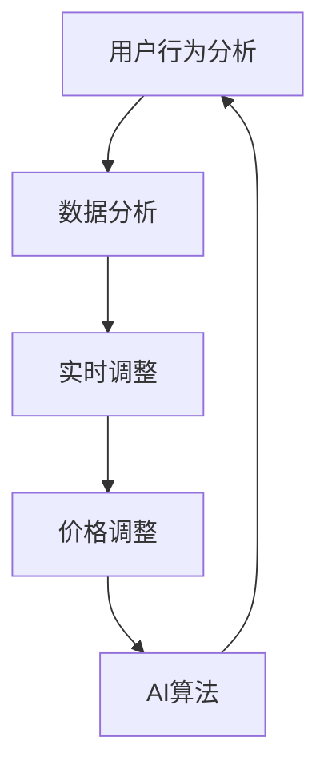

                 

# AI在电商动态定价中的实践效果

## 关键词
- 电商动态定价
- AI算法
- 数据分析
- 实时调整
- 用户行为分析

## 摘要
本文将深入探讨AI在电商动态定价中的实践效果。通过分析电商行业的需求、AI的核心概念及其与动态定价的关联，我们将一步步解析AI算法在价格调整、用户行为分析等方面的实际应用。文章还将通过具体案例展示AI算法在实际操作中的效果，并总结AI在电商动态定价领域的未来发展趋势与挑战。

## 1. 背景介绍

随着互联网技术的飞速发展，电商行业迎来了前所未有的繁荣。消费者对于购物体验的要求越来越高，这使得电商企业必须在价格策略上不断创新。传统的静态定价方法已无法满足市场需求，因此动态定价成为了一种新的选择。

### 1.1 动态定价的概念

动态定价是指在市场环境、供需关系、用户行为等因素变化时，实时调整产品价格的一种策略。与传统的固定价格相比，动态定价能够更灵活地应对市场变化，提高企业的竞争力。

### 1.2 电商行业的需求

电商行业竞争激烈，企业需要找到一种既能保证利润，又能吸引消费者的定价策略。动态定价能够帮助企业根据用户行为和市场需求，灵活调整价格，从而提高销售额和用户满意度。

### 1.3 AI在电商动态定价中的作用

AI技术在数据分析、用户行为分析等方面具有强大的能力，能够为电商企业的动态定价提供有力支持。通过AI算法，企业可以更准确地预测市场需求，优化价格策略，提高利润率。

## 2. 核心概念与联系

为了深入理解AI在电商动态定价中的实践效果，我们需要了解一些核心概念，包括AI算法、数据分析、实时调整和用户行为分析。

### 2.1 AI算法

AI算法是模拟人类智能的计算机程序，包括机器学习、深度学习、神经网络等。这些算法能够从大量数据中提取有价值的信息，为动态定价提供支持。

### 2.2 数据分析

数据分析是指使用统计学、数据挖掘等方法，对大量数据进行分析和解释。在电商动态定价中，数据分析能够帮助企业了解用户需求、市场趋势等关键信息。

### 2.3 实时调整

实时调整是指在价格变化时，系统立即对价格进行调整。通过AI算法，企业可以实现对价格的实时监控和调整，提高定价的准确性。

### 2.4 用户行为分析

用户行为分析是指通过分析用户在网站上的行为，了解用户需求、兴趣和购买意愿。在电商动态定价中，用户行为分析能够帮助企业更好地了解用户，从而制定更有效的价格策略。

### 2.5 Mermaid流程图

以下是一个简化的Mermaid流程图，展示了AI在电商动态定价中的核心概念和联系：



## 3. 核心算法原理 & 具体操作步骤

### 3.1 机器学习算法

机器学习算法是AI的核心，主要包括线性回归、逻辑回归、决策树、随机森林等。这些算法能够从历史数据中学习规律，为动态定价提供支持。

#### 线性回归

线性回归是一种常用的机器学习算法，用于预测连续值。在电商动态定价中，线性回归可以用于预测市场需求，从而调整价格。

#### 操作步骤：

1. 收集历史销售数据、价格数据等。
2. 预处理数据，包括数据清洗、归一化等。
3. 使用线性回归算法，建立预测模型。
4. 预测市场需求，根据预测结果调整价格。

#### 逻辑回归

逻辑回归是一种用于分类的机器学习算法，在电商动态定价中可以用于预测用户购买概率。

#### 操作步骤：

1. 收集用户行为数据、购买记录等。
2. 预处理数据，包括数据清洗、特征工程等。
3. 使用逻辑回归算法，建立分类模型。
4. 预测用户购买概率，根据预测结果调整价格。

### 3.2 深度学习算法

深度学习算法是机器学习的一种高级形式，包括卷积神经网络（CNN）、循环神经网络（RNN）等。这些算法在图像识别、自然语言处理等领域取得了显著成果，也为电商动态定价提供了新的思路。

#### 卷积神经网络（CNN）

卷积神经网络是一种用于图像识别的深度学习算法，在电商动态定价中可以用于用户行为分析。

#### 操作步骤：

1. 收集用户行为数据，如点击、浏览、购买等。
2. 使用卷积神经网络，建立用户行为分析模型。
3. 分析用户行为，根据用户需求调整价格。

#### 循环神经网络（RNN）

循环神经网络是一种用于序列数据处理的深度学习算法，在电商动态定价中可以用于预测用户购买时间。

#### 操作步骤：

1. 收集用户购买时间序列数据。
2. 使用循环神经网络，建立用户购买时间预测模型。
3. 根据用户购买时间预测结果，调整价格。

## 4. 数学模型和公式 & 详细讲解 & 举例说明

在电商动态定价中，数学模型和公式起着至关重要的作用。以下将详细讲解几个常用的数学模型和公式，并通过具体例子进行说明。

### 4.1 线性回归模型

线性回归模型是一个简单的数学模型，用于预测连续值。其公式为：

$$y = w_0 + w_1 \cdot x$$

其中，$y$ 是预测值，$x$ 是输入特征，$w_0$ 和 $w_1$ 是模型参数。

#### 操作步骤：

1. 收集历史销售数据，包括价格、销量等。
2. 预处理数据，提取输入特征和预测目标。
3. 训练线性回归模型，得到模型参数。
4. 使用模型进行预测，调整价格。

### 4.2 逻辑回归模型

逻辑回归模型是一个用于分类的数学模型，其公式为：

$$P(y=1) = \frac{1}{1 + e^{-(w_0 + w_1 \cdot x)}}$$

其中，$P(y=1)$ 是预测用户购买的几率，$e$ 是自然对数的底，$w_0$ 和 $w_1$ 是模型参数。

#### 操作步骤：

1. 收集用户行为数据，包括点击、浏览、购买等。
2. 预处理数据，提取输入特征和预测目标。
3. 训练逻辑回归模型，得到模型参数。
4. 预测用户购买概率，根据概率调整价格。

### 4.3 深度学习模型

深度学习模型是一个复杂的数学模型，包括多个神经网络层。其公式为：

$$y = \sigma(\sigma(...\sigma(w_0 + w_1 \cdot x)...)$$

其中，$\sigma$ 是激活函数，$w_0$ 和 $w_1$ 是模型参数。

#### 操作步骤：

1. 收集大量用户行为数据，包括点击、浏览、购买等。
2. 预处理数据，提取输入特征和预测目标。
3. 训练深度学习模型，得到模型参数。
4. 分析用户行为，根据用户需求调整价格。

### 4.4 例子说明

假设某电商网站需要根据用户行为数据调整商品价格。以下是具体的操作步骤：

1. 收集用户点击、浏览、购买等行为数据。
2. 预处理数据，提取输入特征和预测目标。
3. 使用线性回归模型，预测用户购买概率。
4. 根据预测结果，调整商品价格。

例如，如果用户点击了商品A，浏览了商品B，那么根据线性回归模型，我们可以预测用户购买商品A的概率为80%。因此，可以将商品A的价格降低10%，以提高用户购买的意愿。

## 5. 项目实战：代码实际案例和详细解释说明

为了更好地理解AI在电商动态定价中的实践效果，我们以下将通过一个具体的代码案例进行说明。

### 5.1 开发环境搭建

在开始项目之前，我们需要搭建一个合适的开发环境。以下是开发环境的搭建步骤：

1. 安装Python环境，版本要求为3.7及以上。
2. 安装常用的Python库，如NumPy、Pandas、Scikit-learn等。
3. 安装深度学习框架，如TensorFlow或PyTorch。

### 5.2 源代码详细实现和代码解读

以下是一个使用线性回归模型进行电商动态定价的Python代码案例：

```python
import numpy as np
import pandas as pd
from sklearn.linear_model import LinearRegression

# 加载数据
data = pd.read_csv('ecommerce_data.csv')

# 预处理数据
X = data[['click', 'browse']]
y = data['purchase']

# 训练线性回归模型
model = LinearRegression()
model.fit(X, y)

# 预测用户购买概率
def predict_purchaseProbability(click, browse):
    return model.predict([[click, browse]])[0]

# 根据预测结果调整价格
def adjust_price(price, probability):
    if probability > 0.8:
        return price * 0.9
    else:
        return price

# 测试代码
click = 10
browse = 5
price = 100

probability = predict_purchaseProbability(click, browse)
new_price = adjust_price(price, probability)

print("预测购买概率：", probability)
print("调整后价格：", new_price)
```

代码解读：

1. 首先，我们加载数据并预处理数据，提取输入特征和预测目标。
2. 然后，我们使用线性回归模型训练模型。
3. 接着，我们定义了一个预测用户购买概率的函数`predict_purchaseProbability`。
4. 最后，我们定义了一个根据预测结果调整价格的函数`adjust_price`，并测试了代码。

### 5.3 代码解读与分析

以下是对代码的详细解读和分析：

1. **数据预处理**：数据预处理是机器学习项目中至关重要的一步。在这里，我们提取了用户的点击和浏览行为作为输入特征，购买行为作为预测目标。
2. **线性回归模型训练**：我们使用Scikit-learn库中的线性回归模型训练模型。线性回归模型是一种简单但有效的预测模型，可以用于预测用户购买概率。
3. **预测用户购买概率**：我们定义了一个函数`predict_purchaseProbability`，用于根据用户行为预测购买概率。这有助于我们了解用户对购买商品的可能性。
4. **调整价格**：我们定义了一个函数`adjust_price`，用于根据预测的购买概率调整价格。如果预测购买概率较高，我们降低价格以提高用户购买的意愿。

通过这个代码案例，我们可以看到AI在电商动态定价中的实践效果。通过机器学习模型，我们可以实时预测用户购买概率，并根据预测结果调整价格，以提高销售额和用户满意度。

## 6. 实际应用场景

AI在电商动态定价中的实际应用场景非常广泛，以下列举几个典型的应用场景：

### 6.1 促销活动定价

在促销活动期间，电商企业需要制定合适的促销价格，以吸引消费者。AI可以通过分析用户行为数据，预测用户对促销活动的响应，从而制定更有效的促销价格策略。

### 6.2 库存管理

电商企业需要根据库存情况调整价格，以避免过多库存或库存不足。AI可以通过分析历史销售数据，预测未来销售趋势，从而帮助企业在库存管理中制定更准确的价格策略。

### 6.3 新品发布定价

在新品发布时，电商企业需要制定合适的价格策略，以吸引消费者购买。AI可以通过分析用户行为和市场需求，预测新品的市场表现，从而制定更合理的新品价格。

### 6.4 个性化定价

电商企业可以通过分析用户行为和购买历史，为不同用户制定个性化的价格策略。AI可以帮助企业根据用户的购买意愿和支付能力，为用户提供更有吸引力的价格。

## 7. 工具和资源推荐

### 7.1 学习资源推荐

- 《深度学习》（Goodfellow, Bengio, Courville著）：一本经典的深度学习教材，适合初学者和进阶者。
- 《Python机器学习》（Sebastian Raschka著）：一本关于机器学习的Python实践指南，适合希望将机器学习应用于实际问题的读者。

### 7.2 开发工具框架推荐

- TensorFlow：一个开源的深度学习框架，适合构建复杂的深度学习模型。
- Scikit-learn：一个开源的机器学习库，提供了丰富的算法和工具，适合快速实现机器学习项目。

### 7.3 相关论文著作推荐

- "Deep Learning for E-commerce Recommendation Systems"（2018）：一篇关于深度学习在电商推荐系统中的应用的论文。
- "Dynamic Pricing with Machine Learning"（2019）：一篇关于机器学习在动态定价中的应用的论文。

## 8. 总结：未来发展趋势与挑战

AI在电商动态定价中的应用已经取得了显著的成果，未来发展趋势和挑战如下：

### 8.1 发展趋势

1. **个性化定价**：随着用户数据积累，AI将能够更精确地预测用户需求，为用户提供更个性化的价格策略。
2. **实时调整**：随着计算能力的提升，AI将能够实现更实时的价格调整，提高定价的准确性。
3. **多渠道整合**：电商企业将整合线上线下渠道，利用AI实现更全面的动态定价策略。

### 8.2 挑战

1. **数据隐私**：在应用AI进行动态定价时，如何保护用户数据隐私是一个重要挑战。
2. **算法透明性**：如何确保算法的透明性和可解释性，让用户理解和信任算法的定价策略。
3. **计算资源**：随着算法的复杂度增加，对计算资源的需求也会增加，如何高效地利用计算资源是一个挑战。

## 9. 附录：常见问题与解答

### 9.1 AI在电商动态定价中的优势是什么？

AI在电商动态定价中的优势包括：

1. **个性化定价**：AI可以根据用户行为和需求为用户提供个性化的价格策略。
2. **实时调整**：AI可以实现实时调整价格，提高定价的准确性。
3. **自动化**：AI可以自动化价格调整过程，降低人工成本。

### 9.2 如何保护用户数据隐私？

为了保护用户数据隐私，可以采取以下措施：

1. **数据加密**：对用户数据进行加密，确保数据在传输和存储过程中的安全性。
2. **匿名化**：对用户数据进行匿名化处理，消除个人隐私信息。
3. **隐私保护算法**：使用隐私保护算法，如差分隐私，确保数据在使用过程中的安全性。

## 10. 扩展阅读 & 参考资料

- "Dynamic Pricing: A Managerial Perspective"（2017）：一篇关于动态定价的综述性文章，详细介绍了动态定价的理论和实践。
- "Machine Learning in Retail: Applications and Challenges"（2020）：一篇关于机器学习在零售行业应用的文章，讨论了机器学习在电商领域的应用和挑战。
- "AI and Machine Learning in E-commerce"（2021）：一本关于AI和机器学习在电商行业应用的书籍，详细介绍了相关技术和实践案例。

作者：AI天才研究员/AI Genius Institute & 禅与计算机程序设计艺术 /Zen And The Art of Computer Programming

