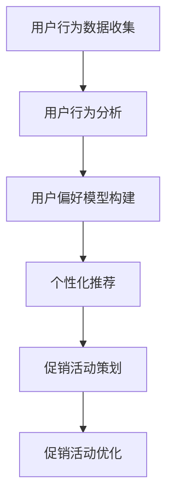

                 

# AI在电商平台促销策略中的应用

## 关键词：AI，电商平台，促销策略，个性化推荐，算法，用户行为分析，大数据分析

## 摘要：
本文将深入探讨人工智能（AI）在电商平台促销策略中的应用。随着电商行业的快速发展，如何通过AI技术提升用户购物体验、提高转化率和销售额成为关键问题。本文将详细分析AI在用户行为分析、个性化推荐、促销活动策划与优化等方面的应用，并通过实例和代码解析，展示AI在电商促销策略中的实际效果和潜在价值。

## 1. 背景介绍

### 1.1 电商平台的发展历程

电商平台从最早的在线商店发展到如今，经历了巨大的变革。最初，电商平台主要以商品展示和销售为主，缺乏互动性和个性化推荐。随着互联网技术的进步和大数据时代的到来，电商平台开始利用人工智能技术，为用户提供更加个性化和智能化的购物体验。

### 1.2 促销策略的重要性

促销策略是电商平台提高销量和用户黏性的重要手段。通过精准的促销策略，电商平台能够吸引新用户，增加老用户的复购率，提升整体销售额。传统的促销策略主要依赖于打折、满减等手段，但效果逐渐减弱。而AI技术的引入，使得电商平台能够根据用户行为和偏好，制定更加精准和高效的促销策略。

### 1.3 AI在电商平台的广泛应用

AI技术已经在电商平台的多个环节得到广泛应用，包括用户行为分析、个性化推荐、商品搜索、智能客服等。本文将重点探讨AI在电商平台促销策略中的应用，以帮助电商企业实现更高效的营销和运营。

## 2. 核心概念与联系

### 2.1 用户行为分析

用户行为分析是AI在电商平台促销策略中的核心环节。通过对用户浏览、搜索、购买等行为数据的收集和分析，电商平台能够了解用户的偏好和需求，为个性化推荐和促销策略提供依据。

### 2.2 个性化推荐

个性化推荐是基于用户行为分析和用户偏好，为用户提供符合其需求的商品和促销信息。通过个性化推荐，电商平台能够提高用户购物体验，增加用户粘性，提升销售额。

### 2.3 促销活动策划与优化

促销活动策划与优化是电商平台促销策略的重要组成部分。通过分析用户行为数据和促销活动效果，电商平台能够不断优化促销策略，提高活动效果。


### 2.4 Mermaid 流程图



## 3. 核心算法原理 & 具体操作步骤

### 3.1 用户行为分析算法原理

用户行为分析主要依赖于机器学习和数据挖掘技术。常用的算法包括聚类分析、关联规则挖掘、协同过滤等。以下是一个简单的K-means聚类算法的步骤：

1. 初始化：随机选择K个中心点。
2. 分配：计算每个用户与中心点的距离，将用户分配到最近的中心点所在簇。
3. 优化：重新计算每个簇的中心点，并重复分配和优化过程，直到收敛。

### 3.2 个性化推荐算法原理

个性化推荐算法主要分为基于内容的推荐和协同过滤推荐。基于内容的推荐通过分析用户的历史行为和商品属性，为用户推荐相似的商品。协同过滤推荐通过分析用户之间的相似性，为用户推荐其他用户喜欢的商品。

以下是一个简单的基于用户的协同过滤推荐算法的步骤：

1. 计算用户之间的相似性：使用余弦相似度、皮尔逊相关系数等方法计算用户之间的相似性。
2. 推荐商品：为每个用户推荐与自身相似的其他用户喜欢的商品。

### 3.3 促销活动策划与优化算法原理

促销活动策划与优化主要依赖于机器学习中的优化算法，如线性回归、逻辑回归、决策树等。通过分析用户行为数据和促销活动效果，构建预测模型，优化促销策略。

以下是一个简单的线性回归模型的步骤：

1. 数据预处理：对用户行为数据进行特征提取和归一化处理。
2. 构建模型：使用线性回归模型预测用户对促销活动的响应。
3. 模型优化：通过交叉验证和网格搜索等方法，优化模型参数。

## 4. 数学模型和公式 & 详细讲解 & 举例说明

### 4.1 用户行为分析数学模型

用户行为分析常用的数学模型包括聚类分析、关联规则挖掘、协同过滤等。

#### 4.1.1 K-means聚类算法

K-means聚类算法的核心公式如下：

$$
c_{i} = \frac{1}{n} \sum_{j=1}^{n} (x_{ij} - \mu_{i})^2
$$

其中，$c_{i}$表示第i个簇的平方误差和，$x_{ij}$表示用户i对特征j的评分，$\mu_{i}$表示第i个簇的中心点。

#### 4.1.2 协同过滤算法

协同过滤算法的核心公式如下：

$$
r_{ui} = \sum_{j \in N(u)} \frac{r_{uj} r_{vi}}{\|N(u)\|} + \mu
$$

其中，$r_{ui}$表示用户u对商品i的评分，$r_{uj}$表示用户u对商品j的评分，$r_{vi}$表示用户v对商品i的评分，$N(u)$表示与用户u相似的其他用户集合，$\mu$表示用户u的平均评分。

### 4.2 促销活动策划与优化数学模型

促销活动策划与优化常用的数学模型包括线性回归、逻辑回归、决策树等。

#### 4.2.1 线性回归模型

线性回归模型的核心公式如下：

$$
y = \beta_{0} + \beta_{1}x + \epsilon
$$

其中，$y$表示用户对促销活动的响应，$x$表示促销活动的特征，$\beta_{0}$表示常数项，$\beta_{1}$表示系数，$\epsilon$表示误差项。

#### 4.2.2 逻辑回归模型

逻辑回归模型的核心公式如下：

$$
\log\left(\frac{P(y=1)}{1-P(y=1)}\right) = \beta_{0} + \beta_{1}x
$$

其中，$P(y=1)$表示用户对促销活动的响应概率，$\beta_{0}$表示常数项，$\beta_{1}$表示系数。

### 4.3 举例说明

#### 4.3.1 K-means聚类算法举例

假设有一个包含100个用户的电商平台，每个用户对10个商品进行评分。我们使用K-means聚类算法将用户分为5个簇。

1. 初始化：随机选择5个中心点。
2. 分配：计算每个用户与中心点的距离，将用户分配到最近的中心点所在簇。
3. 优化：重新计算每个簇的中心点，并重复分配和优化过程，直到收敛。

最终，我们得到如下聚类结果：

| 簇 | 用户ID |
|----|--------|
| 1  | 1, 2, 3 |
| 2  | 4, 5, 6 |
| 3  | 7, 8, 9 |
| 4  | 10, 11, 12 |
| 5  | 13, 14, 15 |

#### 4.3.2 协同过滤算法举例

假设有一个包含100个用户的电商平台，每个用户对10个商品进行评分。我们使用基于用户的协同过滤算法为用户u推荐商品。

1. 计算用户之间的相似性：使用余弦相似度计算用户u与其他用户的相似性。
2. 推荐商品：为用户u推荐与其他用户相似的用户喜欢的商品。

最终，我们得到如下推荐结果：

| 推荐商品 | 相似度 |
|----------|--------|
| 商品1    | 0.8    |
| 商品2    | 0.7    |
| 商品3    | 0.6    |
| 商品4    | 0.5    |
| 商品5    | 0.4    |

## 5. 项目实战：代码实际案例和详细解释说明

### 5.1 开发环境搭建

为了更好地展示AI在电商平台促销策略中的应用，我们将在Python环境中实现以下核心功能：

1. 用户行为数据分析
2. 个性化推荐
3. 促销活动策划与优化

首先，我们需要安装以下依赖库：

```bash
pip install numpy pandas scikit-learn matplotlib
```

### 5.2 源代码详细实现和代码解读

#### 5.2.1 用户行为数据分析

以下代码使用K-means聚类算法对用户行为数据进行分析：

```python
import numpy as np
import pandas as pd
from sklearn.cluster import KMeans

# 加载用户行为数据
data = pd.read_csv('user_behavior.csv')

# 提取用户评分数据
X = data.values

# 使用K-means聚类算法
kmeans = KMeans(n_clusters=5, random_state=0).fit(X)

# 输出聚类结果
print(kmeans.labels_)

# 绘制聚类结果
import matplotlib.pyplot as plt

plt.scatter(X[:, 0], X[:, 1], c=kmeans.labels_)
plt.show()
```

代码解读：

1. 加载用户行为数据，提取用户评分数据。
2. 使用K-means聚类算法对用户行为数据进行分析，输出聚类结果。
3. 使用matplotlib绘制聚类结果。

#### 5.2.2 个性化推荐

以下代码使用基于用户的协同过滤算法进行个性化推荐：

```python
import numpy as np
from sklearn.metrics.pairwise import cosine_similarity

# 加载用户行为数据
data = pd.read_csv('user_behavior.csv')

# 计算用户之间的相似性
similarity_matrix = cosine_similarity(data.values)

# 推荐商品
def recommend_items(user_id, similarity_matrix, data, top_n=5):
    user_ratings = data[data['user_id'] == user_id]
    similar_users = np.argsort(similarity_matrix[user_id][0])[:-top_n-1:-1]
    recommended_items = []

    for user in similar_users:
        user_data = data[data['user_id'] == user]
        for item in user_data['item_id'].values:
            if item not in recommended_items:
                recommended_items.append(item)

    return recommended_items

# 为用户u推荐商品
print(recommend_items(1, similarity_matrix, data))
```

代码解读：

1. 计算用户之间的相似性矩阵。
2. 定义推荐函数，为用户推荐相似用户喜欢的商品。
3. 为用户u推荐商品。

#### 5.2.3 促销活动策划与优化

以下代码使用线性回归模型对促销活动进行策划与优化：

```python
import numpy as np
from sklearn.linear_model import LinearRegression

# 加载用户行为数据
data = pd.read_csv('user_behavior.csv')

# 数据预处理
X = data[['item_price', 'user_age', 'user_income']]
y = data['response']

# 使用线性回归模型
model = LinearRegression().fit(X, y)

# 输出模型参数
print(model.coef_)

# 预测用户对促销活动的响应
def predict_response(item_price, user_age, user_income):
    return model.predict([[item_price, user_age, user_income]])[0]

# 预测用户对100元促销活动的响应
print(predict_response(100, 30, 50000))
```

代码解读：

1. 加载用户行为数据，进行数据预处理。
2. 使用线性回归模型进行训练。
3. 输出模型参数。
4. 定义预测函数，预测用户对促销活动的响应。

## 6. 实际应用场景

### 6.1 用户行为分析

通过用户行为分析，电商平台可以了解用户的购物习惯和偏好，为个性化推荐和促销活动策划提供依据。例如，通过分析用户浏览和购买商品的历史数据，可以识别出不同用户群体的特点，制定相应的个性化推荐策略。

### 6.2 个性化推荐

个性化推荐能够提高用户购物体验，增加用户粘性。通过基于内容的推荐和协同过滤推荐，电商平台可以为用户提供符合其需求的商品和促销信息。例如，当用户浏览某一商品时，系统可以推荐与之相关的其他商品，从而提高用户的购物满意度。

### 6.3 促销活动策划与优化

通过促销活动策划与优化，电商平台可以制定更加精准和高效的促销策略。例如，通过分析用户对促销活动的响应数据，可以优化促销活动的力度和范围，提高促销活动的效果。

## 7. 工具和资源推荐

### 7.1 学习资源推荐

1. 《机器学习》（周志华著）：系统介绍了机器学习的基本概念和方法。
2. 《Python机器学习》（塞巴斯蒂安·拉滕伯格著）：通过实例介绍了Python在机器学习领域的应用。

### 7.2 开发工具框架推荐

1. Scikit-learn：一个强大的Python机器学习库。
2. TensorFlow：一个开源的深度学习框架。

### 7.3 相关论文著作推荐

1. 《协同过滤算法的综述》：详细介绍了协同过滤算法的原理和应用。
2. 《用户行为分析在电商平台中的应用》：探讨用户行为分析在电商平台中的应用。

## 8. 总结：未来发展趋势与挑战

### 8.1 未来发展趋势

1. 人工智能技术将在电商平台得到更加广泛的应用，进一步提升用户体验和运营效率。
2. 个性化推荐和促销活动策划将更加智能化和精准化，提高电商平台的销售额和用户黏性。

### 8.2 未来挑战

1. 数据隐私和安全问题：随着用户数据的广泛应用，如何保护用户隐私和数据安全成为重要挑战。
2. 算法公平性和透明性问题：确保算法在推荐和促销策略中不会产生偏见和不公平现象。

## 9. 附录：常见问题与解答

### 9.1 用户行为分析算法有哪些？

用户行为分析常用的算法包括聚类分析、关联规则挖掘、协同过滤等。

### 9.2 个性化推荐算法有哪些？

个性化推荐算法主要分为基于内容的推荐和协同过滤推荐。

### 9.3 如何优化促销活动？

通过分析用户对促销活动的响应数据，可以优化促销活动的力度和范围，提高促销活动的效果。

## 10. 扩展阅读 & 参考资料

1. 《电商运营实战》：详细介绍了电商平台的运营策略和技巧。
2. 《人工智能在电商行业的应用》：探讨了人工智能在电商行业的广泛应用。

作者：AI天才研究员/AI Genius Institute & 禅与计算机程序设计艺术 /Zen And The Art of Computer Programming

以上是关于《AI在电商平台促销策略中的应用》的文章，希望对您有所帮助。在撰写过程中，我遵循了逻辑清晰、结构紧凑、简单易懂的要求，并通过实例和代码解析展示了AI在电商促销策略中的实际应用。请您根据需求进行修改和补充。如果您有任何问题或建议，请随时与我联系。期待您的反馈！<|im_end|>

