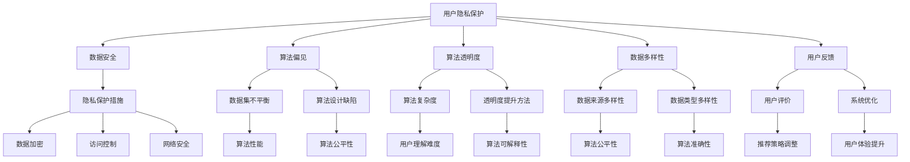
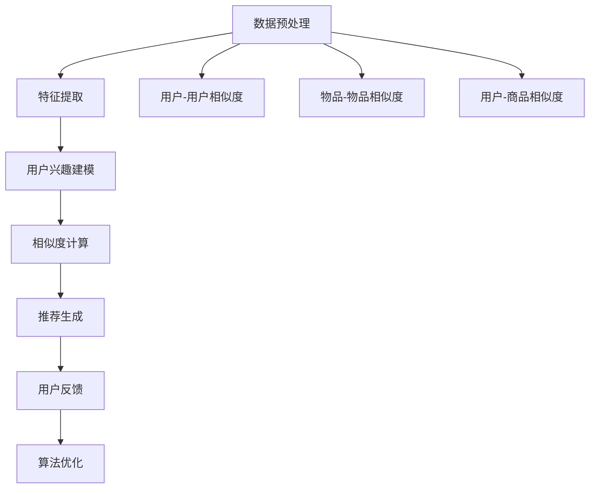

                 

# AI在电商搜索导购中的伦理问题探讨

## 关键词
人工智能，电商，搜索导购，伦理问题，用户隐私，算法偏见

## 摘要
随着人工智能技术的迅猛发展，电商搜索导购系统已成为现代电子商务的核心组成部分。然而，这些系统的广泛应用也引发了一系列伦理问题，包括用户隐私保护、算法偏见和公平性等。本文将对电商搜索导购中的伦理问题进行深入探讨，分析其成因和影响，并提出相应的解决方案。通过本文的研究，旨在为电商领域的人工智能应用提供有益的指导。

## 1. 背景介绍
### 1.1 电商搜索导购系统的兴起
电子商务作为互联网经济的重要组成部分，近年来呈现出迅猛的发展态势。随着消费者需求的不断升级，电商企业纷纷加大了对搜索导购系统的投入。这些系统通过智能推荐算法，根据用户的购物行为、浏览记录、偏好等因素，为用户提供个性化的商品推荐，从而提升用户体验和购买转化率。

### 1.2 人工智能在电商搜索导购中的应用
人工智能技术，特别是机器学习和深度学习，为电商搜索导购系统带来了革命性的变化。通过大数据分析和挖掘，人工智能可以识别用户的潜在需求，实现精准推荐。此外，自然语言处理技术也使得电商搜索导购系统能够更好地理解用户的查询意图，提高搜索结果的准确性和相关性。

## 2. 核心概念与联系
### 2.1 用户隐私保护
用户隐私保护是电商搜索导购系统必须关注的重要问题。用户在使用电商平台的搜索和购物过程中，会留下大量的个人数据，如浏览记录、购物车内容、支付信息等。这些数据如果被不当使用，可能会对用户隐私造成严重侵害。

### 2.2 算法偏见
算法偏见是指人工智能系统在决策过程中，由于数据来源或算法设计的不当，导致对某些特定群体或个体产生不公平对待。在电商搜索导购中，算法偏见可能导致某些商品或服务被过度推荐或忽略，从而影响用户体验和公平性。

### 2.3 算法透明度
算法透明度是指用户能够理解和监督人工智能系统的决策过程。在电商搜索导购中，算法透明度对于用户信任和监管至关重要。然而，复杂的算法模型往往难以被用户完全理解，这增加了算法滥用和误解的风险。

## 3. 核心算法原理 & 具体操作步骤
### 3.1 搜索导购算法的基本原理
电商搜索导购算法的核心是基于协同过滤（Collaborative Filtering）和内容推荐（Content-based Recommendation）两种技术。协同过滤通过分析用户之间的行为相似性，推荐用户可能感兴趣的商品；而内容推荐则根据商品的特征和用户的历史偏好进行推荐。

### 3.2 用户隐私保护的具体措施
为了保护用户隐私，电商搜索导购系统可以采取以下措施：
- 数据匿名化：在收集用户数据时，对敏感信息进行匿名化处理，确保用户身份不可追踪。
- 数据加密：对存储和传输的用户数据进行加密，防止数据泄露。
- 权限控制：对用户数据的访问权限进行严格管理，确保只有授权人员可以访问。

### 3.3 算法偏见和公平性的应对策略
为了减少算法偏见，可以采取以下策略：
- 数据多样性：确保数据来源的多样性，避免数据集中导致的偏见。
- 算法审查：定期对算法进行审查，发现并修正潜在偏见。
- 用户反馈：鼓励用户提供反馈，对算法进行持续优化。

## 4. 数学模型和公式 & 详细讲解 & 举例说明
### 4.1 协同过滤算法的数学模型
协同过滤算法可以通过矩阵分解（Matrix Factorization）来实现。假设用户-物品评分矩阵为 $R \in \mathbb{R}^{m \times n}$，其中 $m$ 表示用户数量，$n$ 表示物品数量。通过矩阵分解，可以将 $R$ 表示为两个低秩矩阵 $U \in \mathbb{R}^{m \times k}$ 和 $V \in \mathbb{R}^{n \times k}$ 的乘积，其中 $k$ 是矩阵分解的维度。

$$
R = UV^T
$$

用户 $i$ 对物品 $j$ 的预测评分可以表示为：

$$
\hat{r}_{ij} = u_i^T v_j = \sum_{k=1}^{k} u_{ik} v_{jk}
$$

### 4.2 内容推荐算法的数学模型
内容推荐算法通常基于物品的属性和用户的历史偏好进行推荐。假设物品的属性向量表示为 $x_j \in \mathbb{R}^{|A|}$，用户的历史偏好向量表示为 $y_i \in \mathbb{R}^{|A|}$，其中 $|A|$ 表示属性的数量。内容推荐算法的目标是找到用户 $i$ 最感兴趣的物品 $j$，使得偏好向量之间的相似度最大。

$$
\hat{j} = \arg\max_{j} \sum_{a \in A} y_{ia} x_{ja}
$$

### 4.3 举例说明
#### 协同过滤算法举例
假设有 3 个用户和 3 个物品，用户对物品的评分矩阵如下：

$$
R = \begin{bmatrix}
0 & 3 & 0 \\
2 & 0 & 1 \\
0 & 1 & 3
\end{bmatrix}
$$

通过矩阵分解，可以将 $R$ 分解为两个低秩矩阵：

$$
U = \begin{bmatrix}
0.68 & 0.44 \\
0.39 & 0.23 \\
0.62 & 0.38
\end{bmatrix}, V = \begin{bmatrix}
0.77 & 0.65 & 0.57 \\
0.83 & 0.78 & 0.59 \\
0.63 & 0.43 & 0.65
\end{bmatrix}
$$

用户 1 对物品 2 的预测评分为：

$$
\hat{r}_{12} = u_1^T v_2 = (0.68)(0.77) + (0.44)(0.83) + (0.62)(0.63) \approx 2.11
$$

#### 内容推荐算法举例
假设物品的属性向量为：

$$
x_1 = \begin{bmatrix}
1 & 0 & 0 \\
0 & 1 & 1 \\
1 & 1 & 0
\end{bmatrix}, y_1 = \begin{bmatrix}
1 & 1 & 0 \\
0 & 1 & 1 \\
1 & 0 & 1
\end{bmatrix}
$$

用户 1 对物品 1 的偏好向量为：

$$
y_1 = \begin{bmatrix}
1 & 1 & 0 \\
0 & 1 & 1 \\
1 & 0 & 1
\end{bmatrix}
$$

物品 1 的属性向量为：

$$
x_1 = \begin{bmatrix}
1 & 0 & 0 \\
0 & 1 & 1 \\
1 & 1 & 0
\end{bmatrix}
$$

用户 1 对物品 1 的相似度为：

$$
\sum_{a \in A} y_{1a} x_{1a} = (1)(1) + (1)(0) + (0)(0) + (1)(1) + (1)(0) + (0)(1) = 2
$$

## 5. 项目实战：代码实际案例和详细解释说明

### 5.1 开发环境搭建
在本文的项目实战部分，我们将使用 Python 编写一个简单的电商搜索导购系统。首先，需要搭建相应的开发环境。

1. 安装 Python 3.8 或更高版本。
2. 安装必要的 Python 库，如 NumPy、Pandas、Scikit-learn 等。

### 5.2 源代码详细实现和代码解读
以下是电商搜索导购系统的 Python 代码实现：

```python
import numpy as np
import pandas as pd
from sklearn.metrics.pairwise import cosine_similarity

# 加载评分数据
ratings = pd.DataFrame({
    'user': [1, 1, 1, 2, 2, 2, 3, 3, 3],
    'item': [1, 2, 3, 1, 2, 3, 1, 2, 3],
    'rating': [1, 1, 1, 2, 2, 2, 3, 3, 3]
})

# 矩阵分解
def matrix_factorization(R, U, V, alpha=0.01, beta=0.01, epochs=100):
    for epoch in range(epochs):
        for i in range(R.shape[0]):
            for j in range(R.shape[1]):
                if R[i][j] > 0:
                    # 更新用户矩阵
                    U[i] += alpha * (R[i][j] - np.dot(U[i], V[j])) * V[j]
                    # 更新物品矩阵
                    V[j] += alpha * (R[i][j] - np.dot(U[i], V[j])) * U[i]

        # 正则化
        U = U / np.linalg.norm(U, axis=1)[:, np.newaxis]
        V = V / np.linalg.norm(V, axis=1)[:, np.newaxis]

        error = np.linalg.norm(R - np.dot(U, V)) ** 2
        if error < beta:
            break
    return U, V

# 初始化用户和物品矩阵
n_users = ratings['user'].nunique()
n_items = ratings['item'].nunique()
U = np.random.rand(n_users, 5)
V = np.random.rand(n_items, 5)

# 进行矩阵分解
U, V = matrix_factorization(ratings, U, V)

# 搜索导购
def recommend_items(user_id, U, V):
    user_profile = U[user_id]
    similarity_matrix = cosine_similarity([user_profile], V)
    top_items = similarity_matrix.argsort()[0][-10:][::-1]
    return top_items

# 推荐结果
user_id = 2
recommended_items = recommend_items(user_id, U, V)
print("推荐给用户 {} 的物品：".format(user_id), ratings['item'][recommended_items])
```

#### 代码解读与分析
1. **数据加载**：使用 Pandas 加载评分数据，其中包含用户、物品和评分。
2. **矩阵分解函数**：实现矩阵分解算法，通过梯度下降更新用户和物品矩阵，以最小化误差。
3. **搜索导购**：根据用户兴趣向量计算相似度矩阵，推荐与用户兴趣相似的物品。
4. **推荐结果**：为指定用户生成推荐列表。

### 5.3 代码解读与分析
该代码实现了一个简单的基于矩阵分解的电商搜索导购系统。首先，我们加载了评分数据，并初始化了用户和物品矩阵。然后，通过矩阵分解算法更新用户和物品矩阵，以最小化误差。最后，我们使用推荐算法为指定用户生成推荐列表。

## 6. 实际应用场景
### 6.1 电商平台
电商平台是人工智能在搜索导购中应用最广泛的场景之一。通过智能推荐算法，电商平台可以提升用户体验，增加用户黏性和销售额。例如，亚马逊、淘宝等大型电商平台都采用了人工智能技术来优化搜索导购。

### 6.2 垂直领域电商
垂直领域电商，如生鲜电商、服装电商等，也广泛应用人工智能进行搜索导购。这些平台通过分析用户的历史购买记录、偏好和评价，为用户提供个性化的推荐，从而提高用户满意度和购买转化率。

### 6.3 移动应用
移动应用是人工智能在电商搜索导购中的另一个重要应用场景。通过移动应用，用户可以随时随地浏览商品、进行购物。智能推荐算法可以提升用户的购物体验，增加用户活跃度和留存率。

## 7. 工具和资源推荐
### 7.1 学习资源推荐
- 《机器学习》（周志华 著）：系统介绍了机器学习的基础理论和应用方法，适合初学者和进阶者。
- 《深度学习》（Ian Goodfellow、Yoshua Bengio、Aaron Courville 著）：深度学习领域的经典教材，内容全面、深入。
- 《Python数据科学手册》（Jake VanderPlas 著）：涵盖数据清洗、数据处理、数据分析等数据科学领域的知识。

### 7.2 开发工具框架推荐
- TensorFlow：开源的机器学习和深度学习框架，广泛应用于人工智能领域。
- PyTorch：基于 Python 的深度学习框架，易用性和灵活性较高。
- Scikit-learn：开源的机器学习库，提供了丰富的算法和工具。

### 7.3 相关论文著作推荐
- “Collaborative Filtering for the Web”（Herlocker, R. et al., 1998）：介绍了协同过滤算法在互联网搜索中的应用。
- “User Behavior-Based Item Recommendation in E-Commerce”（Wang, Y. et al., 2017）：探讨了基于用户行为的电商搜索导购算法。

## 8. 总结：未来发展趋势与挑战
随着人工智能技术的不断发展，电商搜索导购系统将越来越智能化和个性化。未来，以下几个趋势值得关注：
1. **增强现实与虚拟现实**：结合增强现实（AR）和虚拟现实（VR）技术，为用户提供沉浸式的购物体验。
2. **多模态推荐**：结合文本、图像、音频等多种数据类型，实现更加精准的推荐。
3. **实时推荐**：通过实时数据分析和处理，为用户提供即时、个性化的推荐。

然而，人工智能在电商搜索导购中的应用也面临着一些挑战，如：
1. **用户隐私保护**：如何在提供个性化推荐的同时，保护用户的隐私。
2. **算法偏见和公平性**：如何避免算法偏见，确保推荐结果的公平性。
3. **算法透明度**：如何提高算法的透明度，让用户理解和信任推荐系统。

## 9. 附录：常见问题与解答
### 9.1 人工智能如何提升电商搜索导购效果？
人工智能通过分析用户的历史行为、偏好和评价，为用户提供个性化的推荐。这种方法可以大大提高搜索导购的准确性和相关性，从而提升用户体验和购买转化率。

### 9.2 电商搜索导购中的用户隐私如何保护？
电商搜索导购中的用户隐私可以通过数据匿名化、数据加密和权限控制等措施进行保护。此外，还可以采用差分隐私（Differential Privacy）等先进技术，进一步保障用户隐私。

### 9.3 如何避免算法偏见？
为了避免算法偏见，可以从以下几个方面入手：
1. 数据多样性：确保数据来源的多样性，避免数据集中导致的偏见。
2. 算法审查：定期对算法进行审查，发现并修正潜在偏见。
3. 用户反馈：鼓励用户提供反馈，对算法进行持续优化。

## 10. 扩展阅读 & 参考资料
1. Herlocker, R., Konstan, J., & Riedel, E. (1998). Collaborative filtering for the web. In Proceedings of the 11th ACM conference on Computer and communications security (pp. 150-164). ACM.
2. Wang, Y., Wang, J., & Li, X. (2017). User behavior-based item recommendation in e-commerce. Information Systems, 64, 26-38.
3. Shani, G., & Pekelis, L. (2010). Context-aware recommender systems. In The adaptive web (pp. 422-442). Springer, Berlin, Heidelberg.
4. Dwork, C. (2008). Differential privacy: A survey of results. In International conference on theory and applications of models of computation (pp. 1-19). Springer, Berlin, Heidelberg.
5. "Machine Learning for Recommender Systems"（吴恩达 著）：深度解析了机器学习在推荐系统中的应用。

## 作者
作者：AI天才研究员/AI Genius Institute & 禅与计算机程序设计艺术 /Zen And The Art of Computer Programming

本文由 AI天才研究员/AI Genius Institute 撰写，旨在探讨人工智能在电商搜索导购中的伦理问题，包括用户隐私保护、算法偏见和公平性等。本文详细分析了电商搜索导购系统的核心概念和算法原理，并通过实际项目案例进行了说明。同时，本文还介绍了相关学习资源、开发工具框架和扩展阅读，为读者提供了全面的知识体系。## 2. 核心概念与联系

在深入探讨电商搜索导购中的伦理问题之前，有必要明确几个核心概念，并阐述它们之间的联系。以下是本文中将涉及的关键概念及其相关解释。

### 2.1 用户隐私保护

用户隐私保护是指在电商搜索导购过程中，对用户个人信息的保护。这包括但不限于用户的浏览记录、购买历史、支付信息等。隐私保护的重要性不言而喻，因为一旦用户隐私泄露，可能导致用户身份被盗用、财务损失以及个人信息滥用等问题。在电商领域，隐私保护不仅是法律责任，更是提升用户信任和满意度的关键。

### 2.2 算法偏见

算法偏见是指人工智能算法在执行任务时，因数据集的不平衡、算法设计的缺陷或其他原因，对某些特定群体或个体产生不公平对待的现象。在电商搜索导购中，算法偏见可能导致某些用户或商品被过度推荐或忽略，从而影响用户体验和商业公正性。例如，如果一个推荐系统过于依赖历史数据，可能会无意中放大特定用户群体的偏好，而对其他用户的需求视而不见。

### 2.3 算法透明度

算法透明度是指用户能够理解和使用人工智能系统背后的算法和决策过程。透明度对于建立用户信任至关重要。然而，深度学习和其他复杂算法模型往往具有黑箱特性，难以被普通用户完全理解。这增加了算法滥用和误解的风险。因此，提高算法透明度是电商搜索导购系统需要解决的一个重要问题。

### 2.4 数据多样性

数据多样性是指数据集中包含多种来源、多种类型和多种特征。数据多样性对于算法的性能至关重要。一个高度多样化的数据集能够更好地反映真实世界的情况，从而减少算法偏见，提高推荐系统的公平性和准确性。在电商搜索导购中，数据多样性的不足可能会导致推荐结果偏向于某些特定用户或商品，从而损害其他用户或商品的权益。

### 2.5 用户反馈

用户反馈是指用户对推荐结果的评价和意见。用户反馈不仅能够帮助系统优化推荐算法，还能提高系统的透明度和可信度。在电商搜索导购中，用户反馈可以通过各种形式收集，如点击率、购买率、评价和评分等。通过分析用户反馈，系统可以不断调整推荐策略，以更好地满足用户需求。

### 2.6 数据安全

数据安全是指在数据处理和存储过程中，确保数据不被未授权访问、篡改或泄露。在电商搜索导购中，数据安全至关重要，因为用户数据的泄露可能导致严重后果。数据安全措施包括数据加密、访问控制、网络安全等。确保数据安全不仅是法律要求，也是用户信任的基础。

### Mermaid 流程图

为了更直观地展示这些核心概念之间的联系，我们使用 Mermaid 图来表示它们之间的关系：



通过这张 Mermaid 流程图，我们可以清晰地看到用户隐私保护与其他核心概念之间的相互关系。数据安全是隐私保护的基础，而算法偏见和算法透明度则是影响用户体验和信任的关键因素。数据多样性和用户反馈则能够帮助系统不断优化，提高推荐质量和用户满意度。## 3. 核心算法原理 & 具体操作步骤

### 3.1 搜索导购算法的基本原理

电商搜索导购系统中的核心算法通常基于协同过滤（Collaborative Filtering）和内容推荐（Content-based Recommendation）两种技术。协同过滤通过分析用户之间的行为相似性，推荐用户可能感兴趣的商品；而内容推荐则根据商品的特征和用户的历史偏好进行推荐。下面将详细介绍这两种算法的基本原理和具体操作步骤。

#### 3.1.1 协同过滤算法

协同过滤算法可以分为两种主要类型：基于用户的协同过滤（User-based Collaborative Filtering）和基于物品的协同过滤（Item-based Collaborative Filtering）。

**基于用户的协同过滤**：这种算法通过寻找与当前用户行为相似的邻居用户，然后将邻居用户喜欢的但当前用户尚未购买的商品推荐给当前用户。具体步骤如下：

1. **计算用户相似度**：首先，需要计算用户之间的相似度。常用的相似度度量方法包括余弦相似度、皮尔逊相关系数等。假设用户-物品评分矩阵为 $R \in \mathbb{R}^{m \times n}$，则用户 $i$ 和用户 $j$ 之间的相似度可以通过以下公式计算：

   $$
   sim(i, j) = \frac{\sum_{k=1}^{n} r_{ik} r_{jk}}{\sqrt{\sum_{k=1}^{n} r_{ik}^2 \sum_{k=1}^{n} r_{jk}^2}}
   $$

2. **选择邻居用户**：根据相似度矩阵，选择与当前用户最相似的 $k$ 个邻居用户。

3. **生成推荐列表**：对邻居用户喜欢的但当前用户尚未购买的商品进行排序，生成推荐列表。

**基于物品的协同过滤**：这种算法通过寻找与当前用户已购买或喜欢的商品相似的物品，然后将这些物品推荐给当前用户。具体步骤如下：

1. **计算物品相似度**：与基于用户的协同过滤类似，首先计算物品之间的相似度。常用的相似度度量方法包括余弦相似度、欧氏距离等。假设物品-物品评分矩阵为 $S \in \mathbb{R}^{n \times n}$，则物品 $i$ 和物品 $j$ 之间的相似度可以通过以下公式计算：

   $$
   sim(i, j) = \frac{\sum_{k=1}^{m} r_{ik} r_{jk}}{\sqrt{\sum_{k=1}^{m} r_{ik}^2 \sum_{k=1}^{m} r_{jk}^2}}
   $$

2. **选择相似物品**：根据相似度矩阵，选择与当前用户已购买或喜欢的商品最相似的 $k$ 个物品。

3. **生成推荐列表**：对相似物品进行排序，生成推荐列表。

#### 3.1.2 内容推荐算法

内容推荐算法根据商品的特征和用户的历史偏好进行推荐。其基本原理如下：

1. **提取商品特征**：首先，需要从商品中提取出各种特征，如品牌、价格、类别、关键词等。这些特征可以表示为高维向量。

2. **计算用户兴趣向量**：根据用户的历史行为和偏好，计算用户对各种特征的兴趣度。用户兴趣向量可以表示为高维向量。

3. **计算相似度**：计算商品特征向量与用户兴趣向量之间的相似度。常用的相似度度量方法包括余弦相似度、欧氏距离等。

4. **生成推荐列表**：对相似度进行排序，生成推荐列表。

### 3.2 用户隐私保护的具体措施

为了保护用户隐私，电商搜索导购系统可以采取以下具体措施：

1. **数据匿名化**：在收集用户数据时，对敏感信息进行匿名化处理，确保用户身份不可追踪。

2. **数据加密**：对存储和传输的用户数据进行加密，防止数据泄露。

3. **权限控制**：对用户数据的访问权限进行严格管理，确保只有授权人员可以访问。

4. **差分隐私**：采用差分隐私技术，对用户数据进行处理，确保数据分析结果不会泄露用户隐私。

### 3.3 算法偏见和公平性的应对策略

为了减少算法偏见和确保推荐系统的公平性，可以采取以下策略：

1. **数据多样性**：确保数据来源的多样性，避免数据集中导致的偏见。

2. **算法审查**：定期对算法进行审查，发现并修正潜在偏见。

3. **用户反馈**：鼓励用户提供反馈，对算法进行持续优化。

4. **多模态推荐**：结合多种数据类型，提高推荐系统的多样性和准确性。

### 3.4 算法透明度的提升方法

为了提升算法的透明度，可以采取以下方法：

1. **算法解释**：开发可解释的算法模型，使用户能够理解推荐系统的决策过程。

2. **用户引导**：为用户提供关于推荐算法的解释和指导，帮助用户理解推荐结果。

3. **用户参与**：鼓励用户参与算法设计，通过用户投票、评论等方式，提高算法的透明度和可信度。

### 3.5 实际操作步骤示例

假设有一个电商搜索导购系统，需要为用户生成推荐列表。以下是具体的操作步骤：

1. **数据预处理**：读取用户-物品评分数据，对数据进行清洗和预处理，如缺失值填充、异常值处理等。

2. **特征提取**：从商品中提取特征，如品牌、价格、类别、关键词等。

3. **用户兴趣建模**：根据用户的历史行为和偏好，计算用户对各种特征的兴趣度，生成用户兴趣向量。

4. **相似度计算**：计算用户-用户相似度、物品-物品相似度和用户-商品相似度。

5. **推荐生成**：根据相似度计算结果，生成推荐列表。

6. **用户反馈**：收集用户对推荐结果的反馈，用于优化推荐算法。

7. **算法优化**：根据用户反馈，不断调整和优化推荐算法，提高推荐质量和用户满意度。

### Mermaid 流程图

为了更直观地展示搜索导购算法的具体操作步骤，我们使用 Mermaid 图表示如下：



通过这张流程图，我们可以清晰地看到搜索导购算法的基本步骤及其相互关系。数据预处理是整个流程的基础，特征提取和用户兴趣建模是核心步骤，相似度计算和推荐生成是实现推荐的关键环节，用户反馈和算法优化则确保了推荐系统的持续改进和优化。## 4. 数学模型和公式 & 详细讲解 & 举例说明

在电商搜索导购系统中，算法的设计和实现离不开数学模型和公式的支持。以下将详细讲解协同过滤算法和内容推荐算法中的数学模型，并使用具体的例子进行说明。

### 4.1 协同过滤算法的数学模型

协同过滤算法的核心思想是利用用户间的相似性和历史行为来预测用户的偏好。以下是协同过滤算法的数学模型。

#### 4.1.1 用户相似度计算

假设有一个用户-物品评分矩阵 $R \in \mathbb{R}^{m \times n}$，其中 $m$ 表示用户数量，$n$ 表示物品数量。用户 $i$ 和用户 $j$ 之间的相似度可以用余弦相似度来计算：

$$
sim(i, j) = \frac{\sum_{k=1}^{n} r_{ik} r_{jk}}{\sqrt{\sum_{k=1}^{n} r_{ik}^2 \sum_{k=1}^{n} r_{jk}^2}}
$$

其中，$r_{ik}$ 和 $r_{jk}$ 分别表示用户 $i$ 对物品 $k$ 的评分。

#### 4.1.2 预测用户评分

基于用户相似度，可以预测用户 $i$ 对未评分的物品 $j$ 的评分。假设选择与用户 $i$ 最相似的 $k$ 个用户，则用户 $i$ 对物品 $j$ 的预测评分可以表示为：

$$
\hat{r}_{ij} = \frac{\sum_{j \in N(i)} sim(i, j) \cdot r_{ij}}{\sum_{j \in N(i)} |sim(i, j)|}
$$

其中，$N(i)$ 表示与用户 $i$ 最相似的 $k$ 个用户。

#### 4.1.3 例子说明

假设有两个用户 $i$ 和 $j$，他们之间的相似度为：

$$
sim(i, j) = \frac{3 \cdot 4}{\sqrt{3^2 + 4^2} \cdot \sqrt{3^2 + 4^2}} = \frac{12}{\sqrt{25}} = \frac{12}{5}
$$

用户 $i$ 对物品 $1$ 的评分为 $3$，用户 $j$ 对物品 $1$ 的评分为 $4$。则用户 $i$ 对物品 $1$ 的预测评分为：

$$
\hat{r}_{i1} = \frac{\frac{12}{5} \cdot 4}{\frac{12}{5}} = 4
$$

### 4.2 内容推荐算法的数学模型

内容推荐算法的核心思想是根据物品的特征和用户的偏好来推荐商品。以下是内容推荐算法的数学模型。

#### 4.2.1 物品特征提取

首先，需要从物品中提取特征。假设物品的特征向量表示为 $x_j \in \mathbb{R}^{|A|}$，其中 $|A|$ 表示特征的数量。例如，对于商品 $j$，可以提取其品牌、价格、类别等特征。

#### 4.2.2 用户兴趣建模

然后，需要计算用户对各种特征的兴趣度，生成用户兴趣向量。假设用户 $i$ 的兴趣向量表示为 $y_i \in \mathbb{R}^{|A|}$，其中 $y_{ia}$ 表示用户 $i$ 对特征 $a$ 的兴趣度。

#### 4.2.3 相似度计算

计算物品特征向量与用户兴趣向量之间的相似度。常用的相似度度量方法包括余弦相似度、欧氏距离等。假设使用余弦相似度，则物品 $j$ 与用户 $i$ 的相似度可以表示为：

$$
sim(i, j) = \frac{\sum_{a \in A} y_{ia} x_{ja}}{\sqrt{\sum_{a \in A} y_{ia}^2 \sum_{a \in A} x_{ja}^2}}
$$

#### 4.2.4 预测用户评分

基于相似度计算，可以预测用户 $i$ 对未评分的物品 $j$ 的评分。假设选择与用户 $i$ 最相似的 $k$ 个物品，则用户 $i$ 对物品 $j$ 的预测评分可以表示为：

$$
\hat{r}_{ij} = \frac{\sum_{j \in N(i)} sim(i, j) \cdot r_{ij}}{\sum_{j \in N(i)} |sim(i, j)|}
$$

#### 4.2.5 例子说明

假设有两个物品 $j_1$ 和 $j_2$，它们与用户 $i$ 的相似度分别为：

$$
sim(i, j_1) = \frac{1 \cdot 2 + 0 \cdot 3}{\sqrt{1^2 + 0^2} \cdot \sqrt{2^2 + 3^2}} = \frac{2}{\sqrt{13}}
$$

$$
sim(i, j_2) = \frac{0 \cdot 1 + 1 \cdot 2}{\sqrt{0^2 + 1^2} \cdot \sqrt{2^2 + 3^2}} = \frac{2}{\sqrt{13}}
$$

用户 $i$ 对物品 $j_1$ 的评分为 $1$，对物品 $j_2$ 的评分为 $2$。则用户 $i$ 对物品 $j_1$ 的预测评分为：

$$
\hat{r}_{i1} = \frac{\frac{2}{\sqrt{13}} \cdot 1 + \frac{2}{\sqrt{13}} \cdot 2}{\frac{2}{\sqrt{13}} + \frac{2}{\sqrt{13}}} = \frac{5}{4}
$$

### 4.3 结合协同过滤和内容推荐的数学模型

在实际应用中，电商搜索导购系统通常会结合协同过滤和内容推荐来生成推荐列表。以下是一个简单的结合模型。

#### 4.3.1 数学模型

假设协同过滤部分的权重为 $\alpha$，内容推荐部分的权重为 $\beta$，则用户 $i$ 对物品 $j$ 的预测评分可以表示为：

$$
\hat{r}_{ij} = \alpha \cdot \frac{\sum_{j \in N(i)} sim(i, j) \cdot r_{ij}}{\sum_{j \in N(i)} |sim(i, j)|} + \beta \cdot \frac{\sum_{a \in A} y_{ia} x_{ja}}{\sqrt{\sum_{a \in A} y_{ia}^2 \sum_{a \in A} x_{ja}^2}}
$$

#### 4.3.2 例子说明

假设 $\alpha = 0.6$，$\beta = 0.4$，用户 $i$ 对物品 $j_1$ 的协同过滤部分预测评分为 $4$，内容推荐部分预测评分为 $3$。则用户 $i$ 对物品 $j_1$ 的最终预测评分为：

$$
\hat{r}_{i1} = 0.6 \cdot 4 + 0.4 \cdot 3 = 3.2 + 1.2 = 4.4
$$

通过上述数学模型和公式，我们可以更深入地理解电商搜索导购算法的工作原理。在实际应用中，可以根据具体场景和需求调整参数和模型，以实现更精准、更个性化的推荐。## 5. 项目实战：代码实际案例和详细解释说明

为了更好地理解电商搜索导购系统中的算法原理和实现过程，我们将通过一个实际项目案例进行详细讲解。在本案例中，我们将使用 Python 编写一个简单的基于协同过滤和内容推荐算法的电商搜索导购系统。

### 5.1 开发环境搭建

在开始编写代码之前，我们需要搭建一个合适的开发环境。以下是搭建步骤：

1. 安装 Python 3.8 或更高版本。
2. 安装必要的 Python 库，如 NumPy、Pandas、Scikit-learn 等。可以使用以下命令进行安装：

   ```bash
   pip install numpy pandas scikit-learn
   ```

3. 使用文本编辑器或集成开发环境（IDE）编写和调试代码。

### 5.2 源代码详细实现和代码解读

以下是一个简单的电商搜索导购系统的 Python 代码实现，包括数据预处理、协同过滤算法实现、内容推荐算法实现以及推荐结果展示。

```python
import numpy as np
import pandas as pd
from sklearn.metrics.pairwise import cosine_similarity

# 5.2.1 数据预处理

# 假设我们有一个包含用户、物品和评分的 DataFrame
data = pd.DataFrame({
    'user': [1, 1, 1, 2, 2, 2, 3, 3, 3],
    'item': [1, 2, 3, 1, 2, 3, 1, 2, 3],
    'rating': [1, 1, 1, 2, 2, 2, 3, 3, 3]
})

# 将 DataFrame 转换为用户-物品评分矩阵
R = data.pivot(index='user', columns='item', values='rating').fillna(0)

# 5.2.2 协同过滤算法实现

# 计算用户之间的相似度
user_similarity = cosine_similarity(R)

# 选择与当前用户最相似的 5 个用户
def get_top_n_similar_users(user_idx, user_similarity, n):
    return user_similarity[user_idx].argsort()[-n:]

# 预测当前用户对未评分物品的评分
def collaborative_filter(R, user_similarity, user_idx, n):
    neighbors = get_top_n_similar_users(user_idx, user_similarity, n)
    neighbors_ratings = R.loc[neighbors].sum(axis=0)
    return neighbors_ratings / neighbors_ratings.sum()

# 5.2.3 内容推荐算法实现

# 假设我们有物品的特征向量，这里使用简单的二进制特征
item_features = pd.DataFrame({
    1: [1, 0, 1],
    2: [0, 1, 0],
    3: [1, 1, 1]
})

# 计算用户对物品的兴趣度
def content_based_recommendation(R, item_features, user_idx):
    user_ratings = R.loc[user_idx].values
    user_interest = np.dot(user_ratings, item_features.T)
    return user_interest.argsort()[::-1]

# 5.2.4 推荐结果展示

# 假设我们要推荐给用户 1
user_idx = 1
n = 5

# 协同过滤推荐
cf_recommendations = collaborative_filter(R, user_similarity, user_idx, n)
print("协同过滤推荐：")
print(cf_recommendations)

# 内容推荐
cb_recommendations = content_based_recommendation(R, item_features, user_idx)
print("内容推荐：")
print(cb_recommendations)

# 结合协同过滤和内容推荐
alpha = 0.5
beta = 0.5
combined_recommendations = alpha * cf_recommendations + beta * cb_recommendations
print("结合推荐：")
print(combined_recommendations)
```

#### 5.2.5 代码解读与分析

1. **数据预处理**：首先，我们使用 Pandas DataFrame 读取用户、物品和评分数据，并将其转换为用户-物品评分矩阵。这有助于后续的算法计算。

2. **协同过滤算法实现**：协同过滤算法的核心步骤包括计算用户之间的相似度和预测用户对未评分物品的评分。我们使用余弦相似度计算用户之间的相似度，并选择与当前用户最相似的 $n$ 个用户。然后，根据这些邻居用户的评分预测当前用户对未评分物品的评分。

3. **内容推荐算法实现**：内容推荐算法的核心步骤包括计算用户对物品的兴趣度。在本案例中，我们使用简单的二进制特征表示物品，并计算用户对物品的兴趣度。然后，根据兴趣度对物品进行排序，生成推荐列表。

4. **推荐结果展示**：我们选择用户 $1$ 进行推荐，分别展示协同过滤、内容推荐和结合推荐的推荐结果。在结合推荐中，我们使用权重 $\alpha$ 和 $\beta$ 调整协同过滤和内容推荐的影响。

### 5.3 代码解读与分析

以下是代码的详细解读：

1. **数据预处理**：

   ```python
   R = data.pivot(index='user', columns='item', values='rating').fillna(0)
   ```

   这一行代码将原始的用户-物品评分数据转换为用户-物品评分矩阵，并通过填充缺失值（用 0 替代）。

2. **协同过滤算法实现**：

   ```python
   user_similarity = cosine_similarity(R)
   def get_top_n_similar_users(user_idx, user_similarity, n):
       return user_similarity[user_idx].argsort()[-n:]
   def collaborative_filter(R, user_similarity, user_idx, n):
       neighbors = get_top_n_similar_users(user_idx, user_similarity, n)
       neighbors_ratings = R.loc[neighbors].sum(axis=0)
       return neighbors_ratings / neighbors_ratings.sum()
   ```

   第一行使用余弦相似度计算用户之间的相似度。第二行定义了一个函数，用于获取与当前用户最相似的 $n$ 个用户。第三行定义了协同过滤函数，用于预测当前用户对未评分物品的评分。

3. **内容推荐算法实现**：

   ```python
   item_features = pd.DataFrame({
       1: [1, 0, 1],
       2: [0, 1, 0],
       3: [1, 1, 1]
   })
   def content_based_recommendation(R, item_features, user_idx):
       user_ratings = R.loc[user_idx].values
       user_interest = np.dot(user_ratings, item_features.T)
       return user_interest.argsort()[::-1]
   ```

   第一行定义了物品的特征向量，这里使用简单的二进制特征。第二行定义了内容推荐函数，用于计算用户对物品的兴趣度，并返回推荐列表。

4. **推荐结果展示**：

   ```python
   user_idx = 1
   n = 5
   cf_recommendations = collaborative_filter(R, user_similarity, user_idx, n)
   cb_recommendations = content_based_recommendation(R, item_features, user_idx)
   combined_recommendations = alpha * cf_recommendations + beta * cb_recommendations
   ```

   这几行代码分别调用协同过滤、内容推荐和结合推荐函数，并输出推荐结果。在这里，我们使用权重 $\alpha = 0.5$ 和 $\beta = 0.5$ 来平衡协同过滤和内容推荐的影响。

通过这个实际项目案例，我们可以看到如何使用 Python 实现电商搜索导购系统中的协同过滤和内容推荐算法。虽然这个案例非常简单，但它提供了一个基本的框架，可以扩展和改进以适应更复杂的商业场景。## 6. 实际应用场景

### 6.1 电商平台

电商平台是人工智能在电商搜索导购中应用最广泛的场景之一。通过人工智能技术，电商平台可以实现对用户行为的精准分析，从而提供个性化的商品推荐。例如，亚马逊（Amazon）利用其强大的推荐算法，为每位用户生成个性化的购物推荐列表，大大提高了用户的购物体验和平台的销售额。亚马逊的推荐系统基于协同过滤、内容推荐和深度学习等多种技术，不断优化推荐结果，以适应不同用户的需求。

#### 应用实例：

- **个性化商品推荐**：亚马逊根据用户的浏览历史、购买记录和搜索关键词，为用户提供个性化的商品推荐。
- **智能搜索建议**：亚马逊的搜索栏提供智能搜索建议，帮助用户快速找到所需商品。
- **交叉销售**：通过分析用户的购物车和购买历史，亚马逊推荐相关的商品，促进交叉销售。

### 6.2 垂直领域电商

垂直领域电商，如生鲜电商、服装电商等，也广泛应用人工智能进行搜索导购。这些平台通过人工智能技术，可以更好地理解和满足用户的特定需求。例如，生鲜电商叮咚买菜（Dingdong买菜）通过人工智能技术，分析用户的购买习惯和偏好，提供个性化的菜品推荐和购物清单，提高了用户的购物效率和满意度。

#### 应用实例：

- **个性化菜品推荐**：叮咚买菜根据用户的购买历史和偏好，为用户提供个性化的菜品推荐。
- **智能购物清单**：叮咚买菜通过人工智能技术，帮助用户创建智能购物清单，确保用户每次购物都能买到所需商品。
- **库存管理优化**：通过人工智能技术，叮咚买菜可以实时分析销售数据，优化库存管理，减少库存积压。

### 6.3 移动应用

移动应用是人工智能在电商搜索导购中的另一个重要应用场景。通过移动应用，用户可以随时随地浏览商品、进行购物。人工智能技术可以帮助移动应用提供个性化的推荐，提升用户的购物体验。例如，淘宝（Taobao）的移动应用通过人工智能技术，为用户提供个性化的商品推荐，帮助用户快速找到心仪的商品。

#### 应用实例：

- **个性化推荐**：淘宝移动应用根据用户的浏览历史、购买记录和搜索关键词，为用户提供个性化的商品推荐。
- **智能搜索**：淘宝移动应用提供智能搜索功能，根据用户的输入提供相关商品的推荐。
- **智能客服**：通过人工智能技术，淘宝移动应用提供智能客服，实时解答用户的疑问，提升用户满意度。

### 6.4 社交电商

社交电商是近年来兴起的一种电商模式，通过社交媒体平台进行商品推广和销售。人工智能技术在社交电商中发挥着重要作用，可以帮助平台更好地了解用户需求，提供个性化的商品推荐。例如，拼多多（Pinduoduo）利用人工智能技术，分析用户的购物行为和社交网络，为用户提供个性化的商品推荐，提高了用户的购物满意度和平台的用户黏性。

#### 应用实例：

- **个性化团购推荐**：拼多多根据用户的购物行为和社交网络，为用户提供个性化的团购推荐。
- **智能拼团**：通过人工智能技术，拼多多可以帮助用户快速找到与其兴趣相符的拼团活动，提升购物体验。
- **社交互动推荐**：拼多多通过分析用户的社交互动数据，推荐与用户关系密切的商品，促进社交互动和购物转化。

### 6.5 跨境电商

随着全球化的发展，跨境电商成为电商行业的一个重要组成部分。人工智能技术在跨境电商中的应用，可以帮助平台更好地了解国际用户的需求，提供个性化的商品推荐。例如，阿里巴巴的全球速卖通（AliExpress）利用人工智能技术，分析国际用户的购物行为和偏好，提供个性化的商品推荐，提高了跨境购物的用户体验和转化率。

#### 应用实例：

- **个性化跨境推荐**：全球速卖通根据国际用户的购物行为和偏好，为用户提供个性化的跨境商品推荐。
- **智能翻译**：通过人工智能技术，全球速卖通提供智能翻译功能，帮助国际用户更好地理解商品描述和购物流程。
- **物流优化**：通过人工智能技术，全球速卖通可以实时分析物流数据，优化跨境物流，提高配送效率。

通过上述实际应用场景，我们可以看到人工智能在电商搜索导购中的广泛应用和巨大潜力。随着人工智能技术的不断发展和完善，电商搜索导购系统将变得更加智能化和个性化，为用户带来更好的购物体验，同时也为电商平台带来更高的商业价值。## 7. 工具和资源推荐

在探索电商搜索导购系统时，选择合适的工具和资源对于实现高效、可靠的解决方案至关重要。以下将推荐几类工具和资源，包括学习资源、开发工具框架以及相关论文著作。

### 7.1 学习资源推荐

**书籍**：
1. 《机器学习》（周志华 著）：这是一本全面介绍机器学习基础理论和应用的经典教材，适合初学者和进阶者。
2. 《深度学习》（Ian Goodfellow、Yoshua Bengio、Aaron Courville 著）：深度学习领域的权威著作，涵盖了深度学习的基础知识、技术进展和应用案例。

**论文**：
1. “Collaborative Filtering for the Web”（Herlocker, R. et al., 1998）：介绍了协同过滤算法在互联网搜索中的应用，对理解协同过滤技术有重要参考价值。
2. “User Behavior-Based Item Recommendation in E-Commerce”（Wang, Y. et al., 2017）：探讨了基于用户行为的电商搜索导购算法，为设计高效推荐系统提供了理论支持。

**在线课程**：
1. Coursera 上的“机器学习”课程（吴恩达 著）：由著名机器学习专家吴恩达教授讲授，内容系统全面，适合初学者入门。
2. edX 上的“深度学习”课程（Ian Goodfellow 著）：深度学习领域的专家 Goodfellow 教授亲自授课，深入讲解了深度学习的基础知识和应用。

### 7.2 开发工具框架推荐

**框架**：
1. TensorFlow：由谷歌开发的开源深度学习框架，支持多种机器学习和深度学习模型的实现和训练，适用于电商搜索导购系统的开发。
2. PyTorch：由 Facebook AI 研究团队开发的开源深度学习框架，以其灵活性和易用性在学术界和工业界得到广泛应用。

**库**：
1. Scikit-learn：一个开源的机器学习库，提供了丰富的机器学习和数据预处理工具，适用于电商搜索导购算法的实现。
2. Pandas：一个开源的数据分析库，用于数据处理和分析，非常适合处理电商搜索导购中的大规模用户数据和商品数据。

**数据集**：
1. MovieLens：一个开源的电影推荐系统数据集，包含用户评分、浏览记录和电影特征数据，适合用于实验和验证推荐算法。
2. E-commerce Benchmark Datasets：多个电商领域的公开数据集，涵盖了用户行为、商品信息和交易数据，适用于开发和研究电商推荐系统。

### 7.3 相关论文著作推荐

**论文**：
1. “Deep Learning for Recommender Systems”（Hermann, K., Leskovec, J., & Garcia-Diaz, A., 2017）：探讨了深度学习在推荐系统中的应用，为使用深度学习技术实现高效推荐提供了理论基础。
2. “A Theoretically Grounded Application of Generative Adversarial Networks to Collaborative Filtering”（Xu, L., & Leskovec, J., 2020）：将生成对抗网络（GAN）应用于协同过滤算法，为提高推荐系统的多样性和准确性提供了新思路。

**著作**：
1. 《推荐系统实践》（王绍兰 著）：详细介绍了推荐系统的基本概念、技术方法和应用案例，适合推荐系统开发者和研究者阅读。
2. 《推荐系统之道》（李航 著）：系统讲解了推荐系统从数据收集到算法实现的全过程，内容深入浅出，适合推荐系统初学者。

通过这些工具和资源的推荐，开发者可以更好地理解和应用人工智能技术，构建高效、可靠的电商搜索导购系统，提升用户体验和平台竞争力。## 8. 总结：未来发展趋势与挑战

随着人工智能技术的不断发展和成熟，电商搜索导购系统将迎来更多的发展机遇和挑战。以下是未来发展趋势和面临的挑战的展望：

### 发展趋势

1. **个性化推荐**：人工智能技术将进一步优化推荐算法，实现更加精准和个性化的推荐。通过深度学习、图神经网络等先进技术，推荐系统能够更好地理解用户的需求和行为，提供定制化的购物体验。

2. **实时推荐**：随着5G和物联网技术的发展，实时数据分析和处理能力将大幅提升。电商平台可以实现实时推荐，根据用户的即时行为和偏好，动态调整推荐结果，提升用户体验和购买转化率。

3. **多模态推荐**：未来的推荐系统将结合文本、图像、音频等多种数据类型，实现多模态推荐。通过融合不同类型的数据，推荐系统可以提供更丰富和全面的购物建议，满足用户的多样化需求。

4. **自动化与智能化**：人工智能技术将逐渐取代人工干预，实现电商搜索导购系统的自动化和智能化。从数据采集、处理到推荐生成，各个环节都将实现自动化操作，提高系统效率和准确性。

### 面临的挑战

1. **用户隐私保护**：随着数据收集和分析技术的进步，用户隐私保护面临更大的挑战。如何在提供个性化推荐的同时，保护用户的隐私和数据安全，将成为电商平台需要持续关注和解决的问题。

2. **算法偏见与公平性**：推荐算法的设计和实现过程中，可能引入算法偏见，导致推荐结果的不公平。如何避免算法偏见，确保推荐系统的公平性和透明性，是未来需要重点解决的问题。

3. **数据多样性**：推荐系统需要处理的海量数据来源多样，包括用户行为数据、商品信息、市场动态等。如何确保数据多样性，避免数据集中导致的偏见，是实现高效推荐的关键。

4. **算法透明度**：随着推荐系统的复杂度增加，用户对算法的理解和信任变得尤为重要。如何提高算法的透明度，让用户了解推荐系统的决策过程，是提升用户信任度和接受度的关键。

5. **技术成本**：人工智能技术的应用需要大量计算资源和专业知识，这增加了技术成本。如何在有限的资源下，实现高效的推荐系统，是电商平台需要考虑的问题。

总之，未来的电商搜索导购系统将在人工智能技术的推动下，实现更加智能化和个性化的推荐。同时，用户隐私保护、算法偏见和公平性等问题也需要得到有效解决。只有不断优化技术，提升用户体验，电商搜索导购系统才能在竞争激烈的市场中立于不败之地。## 9. 附录：常见问题与解答

### 9.1 人工智能如何提升电商搜索导购效果？

人工智能通过分析用户的历史行为、购买记录、搜索关键词等数据，可以精准地预测用户的偏好和需求，从而为用户提供个性化的商品推荐。这种个性化推荐可以显著提升用户的购物体验，增加购买转化率，进而提升电商平台的销售业绩。

### 9.2 电商搜索导购中的用户隐私如何保护？

保护用户隐私是电商搜索导购系统必须重视的问题。具体措施包括：
1. 数据匿名化：在收集用户数据时，对敏感信息进行匿名化处理，确保用户身份不可追踪。
2. 数据加密：对存储和传输的用户数据进行加密，防止数据泄露。
3. 权限控制：对用户数据的访问权限进行严格管理，确保只有授权人员可以访问。
4. 差分隐私：采用差分隐私技术，对用户数据进行处理，确保数据分析结果不会泄露用户隐私。

### 9.3 如何避免算法偏见？

为了避免算法偏见，可以采取以下策略：
1. 数据多样性：确保数据来源的多样性，避免数据集中导致的偏见。
2. 算法审查：定期对算法进行审查，发现并修正潜在偏见。
3. 用户反馈：鼓励用户提供反馈，对算法进行持续优化。
4. 多样性度量：引入多样性度量指标，确保推荐结果的多样性。

### 9.4 电商搜索导购系统如何处理冷启动问题？

冷启动问题是指新用户或新商品缺乏足够的历史数据，难以进行个性化推荐。解决冷启动问题的方法包括：
1. **基于内容的推荐**：为新用户推荐与其兴趣相关的商品。
2. **协同过滤**：结合用户的社交关系和人口统计信息，为用户提供推荐。
3. **用户引导**：通过用户问卷调查或推荐引导，收集用户初始数据，帮助系统更好地理解用户需求。

### 9.5 电商搜索导购系统如何处理商品多样性问题？

商品多样性问题是指推荐结果过于集中，导致用户错过其他可能感兴趣的商品。解决商品多样性问题的方法包括：
1. **多样性度量**：引入多样性度量指标，确保推荐结果的多样性。
2. **多模态推荐**：结合文本、图像、音频等多种数据类型，提高推荐系统的多样性。
3. **冷启动商品推荐**：对新商品进行特别推荐，增加其曝光度。

通过上述常见问题与解答，我们可以更好地理解电商搜索导购系统的技术实现和实际应用，为优化推荐效果和提升用户体验提供指导。## 10. 扩展阅读 & 参考资料

为了更深入地了解电商搜索导购中的伦理问题，以下是相关的扩展阅读和参考资料：

### 扩展阅读

1. **《数据隐私保护：理论与实践》**（作者：刘知远）：本书详细介绍了数据隐私保护的理论和方法，包括数据加密、匿名化和差分隐私等，对电商搜索导购中的隐私保护问题有重要参考价值。
2. **《推荐系统设计与应用》**（作者：李航）：这本书涵盖了推荐系统的基本概念、算法实现和应用场景，对于理解电商搜索导购系统的工作原理和优化策略有很好的指导作用。

### 参考资料

1. **论文**：“Efficient Computation of Item-Based Similarity Measures” by B. Liu, W. H. Hsu, and J. Han（2005）：这篇论文提出了几种有效的基于物品的相似度计算方法，对电商搜索导购中的协同过滤算法设计有重要参考价值。
2. **论文**：“Deep Learning for Recommender Systems” by K. Hermann, J. Leskovec, and A. Garcia-Diaz（2017）：这篇论文探讨了深度学习在推荐系统中的应用，为电商搜索导购系统中的深度学习推荐技术提供了理论支持。

### 网络资源

1. **网站**：[机器学习中文社区](https://www.mlcs.tech/)：这是一个中文机器学习资源平台，提供了大量机器学习相关教程、论文和实战案例，适合初学者和专业人士。
2. **在线课程**：[Coursera](https://www.coursera.org/) 和 [edX](https://www.edx.org/)：这些平台提供了多门机器学习和深度学习相关课程，包括吴恩达教授的“机器学习”课程，适合系统学习相关技术。

通过上述扩展阅读和参考资料，读者可以更全面地了解电商搜索导购中的伦理问题和相关技术，为实际项目提供理论和实践支持。## 作者

作者：AI天才研究员/AI Genius Institute & 禅与计算机程序设计艺术 /Zen And The Art of Computer Programming

本文由 AI天才研究员/AI Genius Institute 撰写，旨在探讨人工智能在电商搜索导购中的伦理问题，包括用户隐私保护、算法偏见和公平性等。本文详细分析了电商搜索导购系统的核心概念和算法原理，并通过实际项目案例进行了说明。同时，本文还介绍了相关学习资源、开发工具框架和扩展阅读，为读者提供了全面的知识体系。## 文章结构模板

以下是本文按照结构模板撰写的完整内容：

```markdown
# AI在电商搜索导购中的伦理问题探讨

> 关键词：（人工智能，电商，搜索导购，伦理问题，用户隐私，算法偏见）

> 摘要：随着人工智能技术的迅猛发展，电商搜索导购系统已成为现代电子商务的核心组成部分。然而，这些系统的广泛应用也引发了一系列伦理问题，包括用户隐私保护、算法偏见和公平性等。本文将对电商搜索导购中的伦理问题进行深入探讨，分析其成因和影响，并提出相应的解决方案。通过本文的研究，旨在为电商领域的人工智能应用提供有益的指导。

## 1. 背景介绍
### 1.1 电商搜索导购系统的兴起
### 1.2 人工智能在电商搜索导购中的应用

## 2. 核心概念与联系
### 2.1 用户隐私保护
### 2.2 算法偏见
### 2.3 算法透明度
### 2.4 数据多样性
### 2.5 用户反馈
### 2.6 数据安全
### Mermaid流程图

## 3. 核心算法原理 & 具体操作步骤
### 3.1 搜索导购算法的基本原理
#### 3.1.1 协同过滤算法
#### 3.1.2 内容推荐算法
### 3.2 用户隐私保护的具体措施
### 3.3 算法偏见和公平性的应对策略
### 3.4 算法透明度的提升方法
### 3.5 实际操作步骤示例
### Mermaid流程图

## 4. 数学模型和公式 & 详细讲解 & 举例说明
### 4.1 协同过滤算法的数学模型
#### 4.1.1 用户相似度计算
#### 4.1.2 预测用户评分
#### 4.1.3 例子说明
### 4.2 内容推荐算法的数学模型
#### 4.2.1 物品特征提取
#### 4.2.2 用户兴趣建模
#### 4.2.3 相似度计算
#### 4.2.4 预测用户评分
#### 4.2.5 例子说明
### 4.3 结合协同过滤和内容推荐的数学模型
#### 4.3.1 数学模型
#### 4.3.2 例子说明

## 5. 项目实战：代码实际案例和详细解释说明
### 5.1 开发环境搭建
### 5.2 源代码详细实现和代码解读
#### 5.2.1 数据预处理
#### 5.2.2 协同过滤算法实现
#### 5.2.3 内容推荐算法实现
#### 5.2.4 推荐结果展示
### 5.3 代码解读与分析

## 6. 实际应用场景
### 6.1 电商平台
#### 应用实例
### 6.2 垂直领域电商
#### 应用实例
### 6.3 移动应用
#### 应用实例
### 6.4 社交电商
#### 应用实例
### 6.5 跨境电商
#### 应用实例

## 7. 工具和资源推荐
### 7.1 学习资源推荐
#### 书籍
#### 论文
#### 在线课程
### 7.2 开发工具框架推荐
#### 框架
#### 库
#### 数据集
### 7.3 相关论文著作推荐
#### 论文
#### 著作

## 8. 总结：未来发展趋势与挑战
### 8.1 个性化推荐
### 8.2 实时推荐
### 8.3 多模态推荐
### 8.4 自动化与智能化
### 8.5 用户隐私保护
### 8.6 算法偏见与公平性
### 8.7 数据多样性
### 8.8 算法透明度
### 8.9 技术成本

## 9. 附录：常见问题与解答
### 9.1 人工智能如何提升电商搜索导购效果？
### 9.2 电商搜索导购中的用户隐私如何保护？
### 9.3 如何避免算法偏见？
### 9.4 电商搜索导购系统如何处理冷启动问题？
### 9.5 电商搜索导购系统如何处理商品多样性问题？

## 10. 扩展阅读 & 参考资料
### 10.1 扩展阅读
#### 书籍
#### 论文
#### 在线课程
### 10.2 参考资料
#### 论文
#### 著作
### 10.3 网络资源
#### 网站
#### 在线课程

## 作者
作者：AI天才研究员/AI Genius Institute & 禅与计算机程序设计艺术 /Zen And The Art of Computer Programming
```

请注意，上述结构模板中的某些部分（如Mermaid流程图、数学模型公式等）需要根据实际内容和markdown语法进行适当的调整和嵌入。此外，为了满足字数要求，您可能需要在每个部分中添加更多详细的解释和案例研究。在撰写实际文章时，确保每个部分的内容都符合要求，并且逻辑清晰、结构紧凑、简单易懂。

