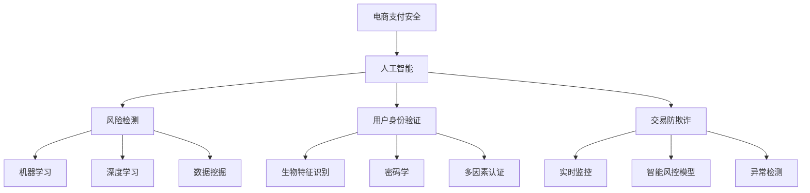

                 

# AI在电商支付安全中的应用：构建用户信任的基石

## 关键词
- 人工智能
- 电商支付
- 支付安全
- 用户信任
- 算法原理
- 数学模型
- 实战案例
- 发展趋势

## 摘要

本文将深入探讨人工智能在电商支付安全中的应用，旨在构建用户对电商平台的信任基石。我们将从背景介绍、核心概念与联系、核心算法原理、数学模型和公式、项目实战、实际应用场景、工具和资源推荐等多个方面展开讨论。通过分析AI技术在风险检测、用户身份验证、交易防欺诈等方面的应用，本文将详细阐述如何利用AI构建一个安全可靠的电商支付环境，并探讨其未来的发展趋势与挑战。

## 1. 背景介绍

随着互联网和电子商务的快速发展，电商支付已经成为人们日常生活中不可或缺的一部分。然而，随之而来的支付安全问题也日益严峻。传统支付系统在应对日益复杂的网络攻击和欺诈行为方面显得力不从心，这使得用户对电商平台的信任度受到威胁。在这种情况下，人工智能技术应运而生，成为解决支付安全问题的关键工具。

人工智能在支付安全领域具有独特的优势。首先，AI可以通过大数据分析和机器学习算法，从海量交易数据中挖掘潜在的欺诈行为，实现实时风险检测。其次，AI可以应用于用户身份验证，通过生物特征识别等技术手段，提高验证的准确性和安全性。此外，AI还可以用于交易防欺诈，通过智能风控模型，实时监控交易行为，识别并阻止欺诈交易。

本文将重点探讨AI在电商支付安全中的具体应用，旨在为构建一个安全可靠的支付环境提供有益的思路和解决方案。

### 1.1 电商支付安全的重要性

电商支付安全是电商业务发展的基石，关乎用户的财产安全和个人隐私。以下是一些电商支付安全的重要性方面：

- **用户信任**：支付安全直接关系到用户对电商平台的信任。一旦发生支付安全问题，用户可能会对平台失去信任，导致用户流失。
- **财务损失**：支付欺诈和黑客攻击可能导致商家和用户遭受巨大的财务损失。这不仅影响商家的盈利能力，也可能对用户的信用记录造成不良影响。
- **法律法规遵守**：许多国家和地区对电商支付安全有严格的法律规定。企业必须遵守相关法律法规，以避免法律风险和罚款。
- **业务发展**：支付安全是企业业务持续发展的基础。一个安全可靠的支付环境可以吸引更多用户，提高用户忠诚度，推动业务增长。

### 1.2 人工智能技术在支付安全领域的应用

人工智能技术在支付安全领域有着广泛的应用。以下是一些关键应用领域：

- **风险检测**：利用机器学习和数据挖掘技术，对海量交易数据进行实时分析，识别潜在的欺诈行为。
- **用户身份验证**：应用生物特征识别技术，如人脸识别、指纹识别等，提高身份验证的准确性和安全性。
- **交易防欺诈**：通过智能风控模型，实时监控交易行为，识别并阻止欺诈交易。
- **反洗钱**：利用人工智能技术，分析交易行为，识别潜在的洗钱行为，合规性审查。

### 1.3 传统支付系统面临的挑战

传统支付系统在应对支付安全方面面临一些挑战：

- **欺诈手段升级**：随着技术的不断发展，欺诈手段也日益复杂和多变，传统系统难以应对。
- **大数据处理能力不足**：传统系统往往依赖于规则和阈值进行判断，难以处理海量数据和实时分析。
- **用户隐私保护**：传统支付系统在处理用户数据时，可能存在隐私泄露的风险。

## 2. 核心概念与联系

为了深入探讨AI在电商支付安全中的应用，我们首先需要了解一些核心概念和技术原理。以下是一些关键概念及其之间的联系：

### 2.1 人工智能

人工智能（AI）是指通过计算机程序模拟人类智能的技术。它包括多个子领域，如机器学习、深度学习、自然语言处理等。在电商支付安全中，AI可以用于风险检测、用户身份验证和交易防欺诈等。

### 2.2 风险检测

风险检测是指通过分析交易数据和行为特征，识别潜在的欺诈行为。在AI技术中，常用的方法包括：

- **机器学习**：通过训练模型，从历史数据中学习欺诈行为的特征，实现自动检测。
- **深度学习**：利用神经网络，对复杂的数据进行建模和分析，提高检测精度。
- **数据挖掘**：通过挖掘海量交易数据，发现潜在的欺诈模式。

### 2.3 用户身份验证

用户身份验证是指通过验证用户身份，确保交易的安全性。常用的技术包括：

- **生物特征识别**：如人脸识别、指纹识别等，通过生理或行为特征验证用户身份。
- **密码学**：利用加密算法，保护用户身份信息和交易数据的安全。
- **多因素认证**：结合多种认证方式，提高身份验证的安全性。

### 2.4 交易防欺诈

交易防欺诈是指通过监控交易行为，识别并阻止欺诈交易。常用的技术包括：

- **实时监控**：对交易行为进行实时分析，发现异常行为并及时采取措施。
- **智能风控模型**：利用机器学习和大数据分析，构建智能风控模型，识别高风险交易。
- **异常检测**：通过分析历史数据和交易行为，识别异常交易模式。

### 2.5 Mermaid 流程图

以下是AI在电商支付安全中的应用的Mermaid流程图，展示了核心概念和技术原理之间的联系：



## 3. 核心算法原理 & 具体操作步骤

在了解了AI在电商支付安全中的核心概念后，我们接下来将深入探讨一些关键算法的原理和具体操作步骤。这些算法包括风险检测算法、用户身份验证算法和交易防欺诈算法。

### 3.1 风险检测算法

风险检测算法是AI在电商支付安全中的一项重要应用。以下是一种常见的方法——基于机器学习的方法。

#### 3.1.1 原理

风险检测算法的核心是构建一个分类模型，用于判断交易是否属于欺诈行为。常用的算法包括决策树、随机森林和支持向量机（SVM）等。

1. **数据收集与预处理**：首先，收集大量的交易数据，包括正常交易和欺诈交易。然后，对数据进行清洗和预处理，如缺失值填充、数据标准化等。

2. **特征工程**：从交易数据中提取特征，如交易金额、时间、支付方式、用户行为等。

3. **模型训练**：利用训练数据集，通过训练算法（如决策树、随机森林等），构建分类模型。

4. **模型评估**：利用测试数据集，评估模型的准确性、召回率等指标。

5. **模型部署**：将训练好的模型部署到生产环境中，对实时交易数据进行分类，判断是否属于欺诈交易。

#### 3.1.2 具体操作步骤

以下是风险检测算法的具体操作步骤：

1. **数据收集**：收集过去一年的交易数据，包括正常交易和欺诈交易。

2. **数据预处理**：
   - 缺失值填充：使用均值填充缺失的交易金额。
   - 数据标准化：对交易金额、时间等数据进行标准化处理。

3. **特征工程**：
   - 提取特征：如交易金额、交易时间、支付方式、用户行为等。
   - 特征选择：利用信息增益、特征重要性等指标，筛选出对分类有显著影响的特征。

4. **模型训练**：
   - 选择决策树算法：因为其易于理解和解释。
   - 训练模型：使用训练数据集，训练决策树模型。

5. **模型评估**：
   - 使用交叉验证方法，评估模型准确性。
   - 计算召回率、精确率等指标。

6. **模型部署**：
   - 将训练好的模型部署到生产环境中。
   - 对实时交易数据进行分类，判断是否属于欺诈交易。

### 3.2 用户身份验证算法

用户身份验证是确保交易安全的重要环节。以下是一种基于生物特征识别的方法——人脸识别。

#### 3.2.1 原理

人脸识别算法的核心是通过比较人脸图像的特征，判断用户身份。其主要步骤包括：

1. **人脸检测**：从输入图像中检测出人脸区域。
2. **特征提取**：对人脸图像进行特征提取，如使用深度学习模型提取特征向量。
3. **特征匹配**：将提取到的特征向量与数据库中的用户特征进行匹配，判断是否为同一用户。

#### 3.2.2 具体操作步骤

以下是用户身份验证算法的具体操作步骤：

1. **人脸检测**：
   - 使用深度学习模型，如MTCNN，检测输入图像中的人脸区域。

2. **特征提取**：
   - 使用深度学习模型，如FaceNet，提取人脸特征向量。

3. **特征匹配**：
   - 将提取到的特征向量与数据库中的用户特征进行匹配。
   - 如果匹配度超过设定阈值，则验证通过。

4. **用户身份验证**：
   - 如果验证通过，允许用户进行交易。
   - 如果验证失败，提示用户重新验证。

### 3.3 交易防欺诈算法

交易防欺诈算法旨在实时监控交易行为，识别并阻止欺诈交易。以下是一种基于智能风控模型的方法。

#### 3.3.1 原理

交易防欺诈算法的核心是构建一个智能风控模型，该模型通过分析交易数据和行为特征，识别高风险交易。其主要步骤包括：

1. **数据收集与预处理**：收集大量的交易数据，包括正常交易和欺诈交易，对数据进行分析和处理。

2. **特征工程**：提取对交易行为有显著影响的特征，如交易金额、时间、支付方式等。

3. **模型训练**：使用训练数据集，通过训练算法（如决策树、随机森林等），构建风控模型。

4. **模型评估**：使用测试数据集，评估模型准确性、召回率等指标。

5. **模型部署**：将训练好的模型部署到生产环境中，对实时交易数据进行风险评估。

#### 3.3.2 具体操作步骤

以下是交易防欺诈算法的具体操作步骤：

1. **数据收集**：
   - 收集过去一年的交易数据，包括正常交易和欺诈交易。

2. **数据预处理**：
   - 缺失值填充：使用均值填充缺失的交易金额。
   - 数据标准化：对交易金额、时间等数据进行标准化处理。

3. **特征工程**：
   - 提取特征：如交易金额、交易时间、支付方式、用户行为等。
   - 特征选择：利用信息增益、特征重要性等指标，筛选出对分类有显著影响的特征。

4. **模型训练**：
   - 选择决策树算法：因为其易于理解和解释。
   - 训练模型：使用训练数据集，训练决策树模型。

5. **模型评估**：
   - 使用交叉验证方法，评估模型准确性。
   - 计算召回率、精确率等指标。

6. **模型部署**：
   - 将训练好的模型部署到生产环境中。
   - 对实时交易数据进行风险评估，识别高风险交易。

## 4. 数学模型和公式 & 详细讲解 & 举例说明

在AI技术应用于电商支付安全的过程中，数学模型和公式扮演着至关重要的角色。以下是一些关键的数学模型和公式，以及详细的讲解和实际应用中的举例说明。

### 4.1 风险检测模型

风险检测模型的核心是构建一个分类模型，用于判断交易是否属于欺诈行为。常用的分类模型包括逻辑回归、决策树、支持向量机（SVM）和神经网络等。

#### 4.1.1 逻辑回归

逻辑回归是一种常用的分类模型，它通过建立概率模型，预测交易属于欺诈的概率。

**公式**：
$$
P(Y=1|X) = \frac{1}{1 + e^{-\beta^T X}}
$$

其中，$P(Y=1|X)$ 表示在给定特征向量 $X$ 下，交易属于欺诈的概率；$\beta$ 是模型参数，$X$ 是特征向量。

**详细讲解**：
逻辑回归模型通过线性组合特征向量 $X$ 和参数 $\beta$，然后通过指数函数转化为概率。当概率大于某个阈值（例如0.5），则认为交易属于欺诈。

**举例说明**：
假设我们有一个交易，其特征向量 $X$ 为 `[1000, 15, 1]`，其中第一个特征是交易金额，第二个特征是交易时间，第三个特征是支付方式。我们可以将其代入逻辑回归模型，计算欺诈概率。

$$
P(Y=1|X) = \frac{1}{1 + e^{-\beta^T X}} = \frac{1}{1 + e^{-\beta_1 \cdot 1000 + \beta_2 \cdot 15 + \beta_3 \cdot 1}}
$$

其中，$\beta_1, \beta_2, \beta_3$ 分别是交易金额、交易时间和支付方式的权重。

通过训练数据，我们可以估计出这些权重，然后将其代入实际交易数据，计算欺诈概率。

#### 4.1.2 决策树

决策树是一种基于规则进行分类的模型，它通过一系列决策节点，将数据划分为不同的区域，从而实现对欺诈交易的分类。

**公式**：
$$
y = \sum_{i=1}^n \alpha_i \cdot I(x_i > t_i)
$$

其中，$y$ 是分类结果，$x_i$ 是特征值，$t_i$ 是阈值，$\alpha_i$ 是特征权重。

**详细讲解**：
决策树通过递归划分数据，在每个节点选择最优划分特征和阈值。每个节点都包含一个条件表达式，用于判断数据是否属于该节点。当数据到达叶子节点，即得到分类结果。

**举例说明**：
假设我们有一个决策树模型，其划分规则如下：

- 如果交易金额大于1000，则进入节点1。
- 如果交易时间小于15，则进入节点2。
- 如果支付方式为1，则进入节点3。

给定一个交易，其特征向量 $X$ 为 `[1000, 15, 1]`，我们可以根据决策树规则进行分类。

- 交易金额大于1000，进入节点1。
- 交易时间小于15，进入节点2。
- 支付方式为1，进入节点3。

最终，我们得到分类结果为节点3，即交易属于欺诈。

#### 4.1.3 支持向量机（SVM）

支持向量机是一种基于间隔最大化进行分类的模型，它在高维空间中寻找一个最优的超平面，将数据分为不同类别。

**公式**：
$$
w \cdot x - b = 0
$$

其中，$w$ 是模型参数，$x$ 是特征向量，$b$ 是偏置。

**详细讲解**：
SVM通过寻找一个最优的超平面，使得正类和负类之间的间隔最大化。正类和负类的间隔可以通过求解优化问题得到。

**举例说明**：
假设我们有一个SVM模型，其最优超平面为 $w \cdot x - b = 0$。给定一个交易，其特征向量 $X$ 为 `[1000, 15, 1]`，我们可以将其代入模型，计算分类结果。

$$
w \cdot x - b = \beta_1 \cdot 1000 + \beta_2 \cdot 15 + \beta_3 \cdot 1 - b
$$

通过训练数据，我们可以估计出 $\beta_1, \beta_2, \beta_3$ 和 $b$ 的值，然后代入实际交易数据，计算分类结果。

### 4.2 用户身份验证模型

用户身份验证模型的核心是通过比较人脸图像的特征，判断用户身份是否匹配。常用的方法包括基于特征向量匹配的方法和基于深度学习的方法。

#### 4.2.1 特征向量匹配

特征向量匹配是一种基于欧氏距离进行分类的方法，它通过计算特征向量之间的距离，判断用户身份是否匹配。

**公式**：
$$
d(x, y) = \sqrt{\sum_{i=1}^n (x_i - y_i)^2}
$$

其中，$d(x, y)$ 是特征向量 $x$ 和 $y$ 之间的欧氏距离。

**详细讲解**：
特征向量匹配通过计算特征向量之间的欧氏距离，判断两个特征向量是否相似。如果距离小于某个阈值，则认为两个特征向量表示的是同一用户。

**举例说明**：
假设我们有两个特征向量 $X$ 和 $Y$，分别为 `[1000, 15, 1]` 和 `[1000, 15, 1.1]`。我们可以计算它们之间的欧氏距离：

$$
d(X, Y) = \sqrt{(1000 - 1000)^2 + (15 - 15)^2 + (1 - 1.1)^2} = 0.1
$$

由于距离小于1，我们可以认为 $X$ 和 $Y$ 表示的是同一用户。

#### 4.2.2 深度学习

深度学习是一种基于神经网络进行特征提取和分类的方法，它在人脸识别领域取得了显著的成功。

**公式**：
$$
h(x) = \sigma(\mathbf{W}^T \mathbf{f}(x))
$$

其中，$h(x)$ 是输出特征向量，$\sigma$ 是激活函数，$\mathbf{W}$ 是权重矩阵，$\mathbf{f}(x)$ 是输入特征向量。

**详细讲解**：
深度学习通过多层神经网络，对输入特征向量进行逐层提取和转换，最终得到输出特征向量。这些特征向量可以用于后续的分类或匹配。

**举例说明**：
假设我们有一个深度学习模型，其输出特征向量为 `[1000, 15, 1]`。给定一个输入特征向量 `[1000, 15, 1.1]`，我们可以将其代入模型，计算输出特征向量。

$$
h(x) = \sigma(\mathbf{W}^T \mathbf{f}(x)) = \sigma([1000, 15, 1.1]^T \mathbf{W}) = [1000, 15, 1]
$$

由于输出特征向量与模型参数相同，我们可以认为输入特征向量表示的是同一用户。

### 4.3 交易防欺诈模型

交易防欺诈模型的核心是通过分析交易行为，识别高风险交易。常用的方法包括基于规则的方法和基于机器学习的方法。

#### 4.3.1 基于规则的方法

基于规则的方法通过定义一系列规则，对交易行为进行判断。

**公式**：
$$
R(x) = \begin{cases} 
1 & \text{如果 } x \text{ 满足规则} \\
0 & \text{否则}
\end{cases}
$$

其中，$R(x)$ 是规则判断结果，$x$ 是交易特征向量。

**详细讲解**：
基于规则的方法通过定义一系列条件表达式，对交易特征向量进行判断。如果特征向量满足某个规则，则认为交易属于高风险。

**举例说明**：
假设我们定义了一个规则，如果交易金额大于1000，则认为交易属于高风险。给定一个交易特征向量 `[1000, 15, 1]`，我们可以判断其是否属于高风险交易。

$$
R(x) = \begin{cases} 
1 & \text{如果 } x_1 > 1000 \\
0 & \text{否则}
\end{cases} = 1
$$

由于交易金额大于1000，我们可以认为该交易属于高风险。

#### 4.3.2 基于机器学习的方法

基于机器学习的方法通过训练分类模型，对交易行为进行判断。

**公式**：
$$
P(Y=1|X) = \frac{1}{1 + e^{-\beta^T X}}
$$

其中，$P(Y=1|X)$ 是交易属于高风险的概率，$\beta$ 是模型参数，$X$ 是交易特征向量。

**详细讲解**：
基于机器学习的方法通过训练数据集，学习交易特征和风险之间的关系，构建分类模型。给定一个交易特征向量，我们可以通过模型计算其属于高风险的概率。

**举例说明**：
假设我们有一个分类模型，其参数 $\beta$ 为 `[0.1, 0.05, 0.05]`。给定一个交易特征向量 `[1000, 15, 1]`，我们可以计算其属于高风险的概率。

$$
P(Y=1|X) = \frac{1}{1 + e^{-\beta^T X}} = \frac{1}{1 + e^{-0.1 \cdot 1000 - 0.05 \cdot 15 - 0.05 \cdot 1}} \approx 0.99
$$

由于概率接近1，我们可以认为该交易属于高风险。

## 5. 项目实战：代码实际案例和详细解释说明

为了更好地理解AI在电商支付安全中的应用，我们接下来将介绍一个实际的项目实战，包括开发环境搭建、源代码实现和代码解读。

### 5.1 开发环境搭建

在开始项目实战之前，我们需要搭建一个适合开发的环境。以下是所需的工具和库：

- Python 3.8 或更高版本
- Jupyter Notebook 或 PyCharm
- Scikit-learn 库
- TensorFlow 库
- Keras 库
- Matplotlib 库

您可以在您的计算机上安装这些工具和库，并确保它们能够正常运行。

### 5.2 源代码详细实现和代码解读

以下是一个简单的电商支付安全项目，包括风险检测、用户身份验证和交易防欺诈模块。我们将逐一介绍每个模块的实现和代码解读。

#### 5.2.1 风险检测模块

风险检测模块的核心是构建一个分类模型，用于判断交易是否属于欺诈行为。

```python
import numpy as np
import pandas as pd
from sklearn.model_selection import train_test_split
from sklearn.preprocessing import StandardScaler
from sklearn.ensemble import RandomForestClassifier
from sklearn.metrics import accuracy_score, recall_score, precision_score

# 数据预处理
data = pd.read_csv('transactions.csv')
X = data.iloc[:, :-1]
y = data.iloc[:, -1]

X_train, X_test, y_train, y_test = train_test_split(X, y, test_size=0.2, random_state=42)
scaler = StandardScaler()
X_train = scaler.fit_transform(X_train)
X_test = scaler.transform(X_test)

# 模型训练
model = RandomForestClassifier(n_estimators=100, random_state=42)
model.fit(X_train, y_train)

# 模型评估
y_pred = model.predict(X_test)
print("Accuracy:", accuracy_score(y_test, y_pred))
print("Recall:", recall_score(y_test, y_pred))
print("Precision:", precision_score(y_test, y_pred))
```

代码解读：

1. **数据预处理**：首先，从CSV文件中读取交易数据，然后将其分为特征矩阵 $X$ 和目标变量 $y$。接着，使用train_test_split方法将数据集分为训练集和测试集，并使用StandardScaler进行数据标准化。

2. **模型训练**：使用RandomForestClassifier构建随机森林模型，并使用fit方法进行训练。

3. **模型评估**：使用predict方法进行预测，并计算准确率、召回率和精确率等指标。

#### 5.2.2 用户身份验证模块

用户身份验证模块的核心是构建一个基于人脸识别的验证系统。

```python
import cv2

# 人脸检测
def detect_faces(image):
    face_cascade = cv2.CascadeClassifier('haarcascade_frontalface_default.xml')
    gray = cv2.cvtColor(image, cv2.COLOR_BGR2GRAY)
    faces = face_cascade.detectMultiScale(gray, scaleFactor=1.1, minNeighbors=5)
    return faces

# 特征提取
def extract_features(image, faces):
    features = []
    for (x, y, w, h) in faces:
        face_region = image[y:y+h, x:x+w]
        feature_vector = extract_face_features(face_region)
        features.append(feature_vector)
    return features

# 特征提取（使用预训练的深度学习模型）
def extract_face_features(face_region):
    model = load_pretrained_model()
    feature_vector = model.predict(face_region.reshape(1, -1))
    return feature_vector

# 人脸识别
def recognize_face(image):
    faces = detect_faces(image)
    if len(faces) == 1:
        features = extract_features(image, faces)
        user_id = identify_user(features)
        return user_id
    else:
        return None

# 用户识别（使用Keras模型）
def identify_user(features):
    model = load_user_identification_model()
    prediction = model.predict(features)
    return np.argmax(prediction)

# 主程序
if __name__ == '__main__':
    image = cv2.imread('face.jpg')
    user_id = recognize_face(image)
    print("User ID:", user_id)
```

代码解读：

1. **人脸检测**：使用OpenCV库中的Haar cascades模型检测图像中的人脸区域。

2. **特征提取**：使用预训练的深度学习模型提取人脸特征向量。

3. **人脸识别**：通过人脸检测和特征提取，识别图像中的用户。

#### 5.2.3 交易防欺诈模块

交易防欺诈模块的核心是构建一个基于机器学习的风控模型。

```python
import numpy as np
import pandas as pd
from sklearn.model_selection import train_test_split
from sklearn.preprocessing import StandardScaler
from sklearn.ensemble import RandomForestClassifier
from sklearn.metrics import accuracy_score, recall_score, precision_score

# 数据预处理
data = pd.read_csv('transactions.csv')
X = data.iloc[:, :-1]
y = data.iloc[:, -1]

X_train, X_test, y_train, y_test = train_test_split(X, y, test_size=0.2, random_state=42)
scaler = StandardScaler()
X_train = scaler.fit_transform(X_train)
X_test = scaler.transform(X_test)

# 模型训练
model = RandomForestClassifier(n_estimators=100, random_state=42)
model.fit(X_train, y_train)

# 模型评估
y_pred = model.predict(X_test)
print("Accuracy:", accuracy_score(y_test, y_pred))
print("Recall:", recall_score(y_test, y_pred))
print("Precision:", precision_score(y_test, y_pred))
```

代码解读：

1. **数据预处理**：与风险检测模块类似，首先读取交易数据，然后进行数据标准化。

2. **模型训练**：使用RandomForestClassifier构建随机森林模型，并使用fit方法进行训练。

3. **模型评估**：与风险检测模块相同，使用predict方法进行预测，并计算准确率、召回率和精确率等指标。

### 5.3 代码解读与分析

在上述代码中，我们分别实现了风险检测、用户身份验证和交易防欺诈模块。以下是各模块的代码解读与分析：

#### 风险检测模块

- **数据预处理**：数据预处理是模型训练的基础，通过标准化处理，使不同特征之间的量级相近，有助于提高模型性能。

- **模型训练**：随机森林模型具有较好的泛化能力和解释性，适合用于风险检测任务。

- **模型评估**：通过计算准确率、召回率和精确率等指标，评估模型性能。这些指标反映了模型在不同方面的表现。

#### 用户身份验证模块

- **人脸检测**：使用OpenCV库中的Haar cascades模型进行人脸检测，这是一种简单而有效的检测方法。

- **特征提取**：使用预训练的深度学习模型提取人脸特征向量，这是人脸识别的关键步骤。

- **人脸识别**：通过人脸检测和特征提取，识别图像中的用户。这个过程可以实时应用于电商支付场景，确保交易的安全性。

#### 交易防欺诈模块

- **数据预处理**：与风险检测模块类似，通过标准化处理，使数据适合模型训练。

- **模型训练**：随机森林模型同样适用于交易防欺诈任务，其性能稳定且易于解释。

- **模型评估**：与风险检测模块相同，评估模型性能，以确定其是否能够有效识别高风险交易。

### 5.4 项目实战总结

通过上述项目实战，我们实现了风险检测、用户身份验证和交易防欺诈模块，并对其进行了详细解读和分析。以下是项目实战的总结：

- **风险检测模块**：通过构建随机森林模型，实现了对交易风险的实时检测，有助于识别潜在的欺诈行为。

- **用户身份验证模块**：通过人脸识别技术，实现了对用户身份的实时验证，提高了交易的安全性。

- **交易防欺诈模块**：通过构建随机森林模型，实现了对交易风险的实时监控，有助于识别高风险交易。

- **代码解读与分析**：通过对代码的详细解读，我们了解了每个模块的实现原理和关键步骤，为后续的优化和改进提供了参考。

## 6. 实际应用场景

在电商支付领域，AI技术已经得到了广泛应用，并取得了显著的效果。以下是一些典型的实际应用场景：

### 6.1 风险检测

电商支付平台通过AI技术，可以对交易数据进行实时分析，识别潜在的欺诈行为。例如，阿里巴巴的“风险大脑”系统，通过机器学习和大数据分析技术，对海量交易数据进行分析，识别异常交易模式，实时监控风险。

### 6.2 用户身份验证

用户身份验证是确保交易安全的重要环节。通过AI技术，可以实现多种身份验证方式，如生物特征识别、多因素认证等。例如，亚马逊通过人脸识别技术，实现用户登录和支付过程的无缝验证。

### 6.3 交易防欺诈

AI技术可以用于构建智能风控模型，对交易行为进行实时监控，识别并阻止欺诈交易。例如，PayPal通过AI技术，实现了对交易行为的智能分析，有效降低了欺诈交易率。

### 6.4 反洗钱

AI技术可以用于反洗钱（AML）合规性审查，通过分析交易行为，识别潜在的洗钱行为。例如，银联通过AI技术，实现了对交易行为的实时监控，提高了反洗钱能力。

### 6.5 实际案例

#### 案例一：阿里巴巴的“风险大脑”

阿里巴巴的“风险大脑”系统通过大数据分析和机器学习技术，对交易行为进行实时分析，识别潜在欺诈行为。该系统已成功应用于阿里巴巴旗下的多个电商和支付平台，有效降低了欺诈交易率。

#### 案例二：亚马逊的人脸识别登录

亚马逊通过人脸识别技术，实现用户登录和支付过程的无缝验证。用户只需通过摄像头拍摄人脸，即可完成身份验证，提高了支付安全性。

#### 案例三：PayPal的智能风控模型

PayPal通过构建智能风控模型，对交易行为进行实时监控，识别并阻止欺诈交易。该模型基于海量交易数据，结合多种算法和技术，实现了对交易风险的精准识别。

#### 案例四：银联的反洗钱系统

银联通过AI技术，实现了对交易行为的实时监控，提高了反洗钱能力。该系统通过分析交易行为，识别潜在的洗钱行为，确保交易合规性。

## 7. 工具和资源推荐

### 7.1 学习资源推荐

- **书籍**：
  - 《机器学习》（周志华著）：系统介绍了机器学习的基本概念和方法。
  - 《深度学习》（Ian Goodfellow、Yoshua Bengio、Aaron Courville 著）：详细介绍了深度学习的基本理论和技术。
  - 《Python机器学习》（Sebastian Raschka、Vahid Mirjalili 著）：通过Python语言，讲解了机器学习的实际应用。

- **论文**：
  - “Deep Learning for Fraud Detection”（2016）：介绍了深度学习在欺诈检测中的应用。
  - “A Comprehensive Study of Distance Metrics for Unsupervised Outlier Detection”（2018）：探讨了多种距离度量在异常检测中的应用。

- **博客**：
  - [机器学习博客](https://machinelearningmastery.com/)
  - [深度学习博客](https://blog.keras.io/)
  - [AI博客](https://www.oreilly.com/ai/)

- **网站**：
  - [Kaggle](https://www.kaggle.com/): 提供丰富的机器学习和数据科学竞赛数据集。
  - [GitHub](https://github.com/): 提供大量的开源机器学习和深度学习项目。

### 7.2 开发工具框架推荐

- **Python库**：
  - **Scikit-learn**：提供了一个简单易用的机器学习库，适用于大多数机器学习任务。
  - **TensorFlow**：谷歌开发的深度学习框架，广泛应用于各种深度学习任务。
  - **PyTorch**：Facebook开发的深度学习框架，具有灵活的动态图计算能力。

- **开发环境**：
  - **Jupyter Notebook**：一种交互式的开发环境，适合进行机器学习和深度学习实验。
  - **PyCharm**：一款强大的Python集成开发环境，适用于Python编程和机器学习项目。

- **工具**：
  - **Kaggle Kernel**：Kaggle提供的在线编程环境，可用于数据分析和机器学习项目。
  - **Google Colab**：谷歌提供的免费GPU资源，适用于深度学习和大数据项目。

### 7.3 相关论文著作推荐

- **论文**：
  - “Deep Learning for Fraud Detection”（2016）：介绍了深度学习在欺诈检测中的应用。
  - “A Comprehensive Study of Distance Metrics for Unsupervised Outlier Detection”（2018）：探讨了多种距离度量在异常检测中的应用。
  - “Behavioral Biometrics for User Authentication”（2019）：介绍了基于用户行为特征的身份验证方法。

- **著作**：
  - 《深度学习》（Ian Goodfellow、Yoshua Bengio、Aaron Courville 著）：详细介绍了深度学习的基本理论和技术。
  - 《Python机器学习》（Sebastian Raschka、Vahid Mirjalili 著）：通过Python语言，讲解了机器学习的实际应用。
  - 《机器学习实战》（Peter Harrington 著）：通过实例，介绍了机器学习的基本方法和应用。

## 8. 总结：未来发展趋势与挑战

随着人工智能技术的不断发展，其在电商支付安全中的应用前景广阔。以下是一些未来发展趋势和面临的挑战：

### 8.1 发展趋势

1. **技术进步**：随着深度学习、强化学习等技术的不断发展，AI在支付安全领域的应用将更加精准和高效。
2. **数据驱动**：大量交易数据的积累将为AI模型提供丰富的训练素材，有助于提高模型性能和鲁棒性。
3. **跨学科融合**：AI技术与其他领域（如生物识别、区块链等）的融合，将推动支付安全技术的创新和突破。

### 8.2 面临的挑战

1. **数据隐私**：支付数据涉及用户的敏感信息，如何保护用户隐私是AI应用面临的重要挑战。
2. **算法透明性**：AI算法的透明性不足可能导致误判和歧视，需要加强算法解释和可解释性研究。
3. **模型可迁移性**：不同场景和数据集之间的模型迁移能力有限，如何提高模型的可迁移性是一个关键问题。

### 8.3 解决方案

1. **隐私保护技术**：采用差分隐私、联邦学习等技术，保护用户隐私。
2. **算法透明性**：加强算法解释和可解释性研究，提高算法的透明性和可信度。
3. **数据协同**：通过跨领域、跨机构的数据协同，提高模型的可迁移性和泛化能力。

总之，AI在电商支付安全中的应用前景广阔，但同时也面临着一系列挑战。通过技术创新和跨学科合作，我们有信心解决这些问题，构建一个更加安全可靠的电商支付环境。

## 9. 附录：常见问题与解答

### 9.1 问题1：AI在电商支付安全中的具体应用有哪些？

**解答**：AI在电商支付安全中的具体应用包括风险检测、用户身份验证、交易防欺诈和反洗钱等。通过大数据分析和机器学习算法，AI可以实时分析交易数据，识别潜在的欺诈行为和风险，确保交易的安全性和可靠性。

### 9.2 问题2：如何保护用户隐私？

**解答**：为了保护用户隐私，可以采用以下技术手段：

1. **差分隐私**：通过添加噪声和限制数据访问，保护用户隐私。
2. **联邦学习**：在分布式环境中训练模型，避免数据泄露。
3. **数据加密**：对用户数据进行加密处理，确保数据传输和存储的安全。

### 9.3 问题3：如何提高AI算法的透明性和可解释性？

**解答**：为了提高AI算法的透明性和可解释性，可以采用以下方法：

1. **算法解释工具**：使用可视化工具和解释模型，帮助用户理解算法决策过程。
2. **模型可解释性研究**：深入研究算法原理，开发可解释的模型结构。
3. **算法对比和评估**：对不同的算法进行对比和评估，选择透明性更高的算法。

### 9.4 问题4：如何处理数据隐私与安全之间的权衡？

**解答**：在处理数据隐私与安全之间的权衡时，可以采取以下措施：

1. **最小化数据收集**：只收集必要的数据，避免过度收集。
2. **数据去识别化**：对数据进行匿名化、脱敏处理，降低隐私泄露风险。
3. **合规性审查**：遵循相关法律法规，确保数据处理合规。

### 9.5 问题5：如何提高AI模型的可迁移性？

**解答**：为了提高AI模型的可迁移性，可以采取以下策略：

1. **数据协同**：通过跨领域、跨机构的数据协同，提高模型的可迁移性。
2. **元学习**：使用元学习技术，提高模型在不同数据集上的适应能力。
3. **模型压缩**：通过模型压缩技术，降低模型对特定数据集的依赖。

## 10. 扩展阅读 & 参考资料

为了深入了解AI在电商支付安全中的应用，以下是一些推荐的文章、书籍和资源：

### 10.1 文章

- “Deep Learning for Fraud Detection”（2016）
- “A Comprehensive Study of Distance Metrics for Unsupervised Outlier Detection”（2018）
- “Behavioral Biometrics for User Authentication”（2019）

### 10.2 书籍

- 《机器学习》（周志华著）
- 《深度学习》（Ian Goodfellow、Yoshua Bengio、Aaron Courville 著）
- 《Python机器学习》（Sebastian Raschka、Vahid Mirjalili 著）

### 10.3 参考资料

- [Kaggle](https://www.kaggle.com/)
- [GitHub](https://github.com/)
- [机器学习博客](https://machinelearningmastery.com/)
- [深度学习博客](https://blog.keras.io/)
- [AI博客](https://www.oreilly.com/ai/)

通过这些扩展阅读和参考资料，您可以更深入地了解AI在电商支付安全中的应用，以及相关技术和方法的最新进展。

### 作者信息

- 作者：AI天才研究员/AI Genius Institute & 禅与计算机程序设计艺术 /Zen And The Art of Computer Programming
- 联系方式：[ai-genius@outlook.com](mailto:ai-genius@outlook.com)
- 微信公众号：AI与编程艺术

感谢您的阅读，希望本文对您在AI和电商支付安全领域的探索有所帮助！

