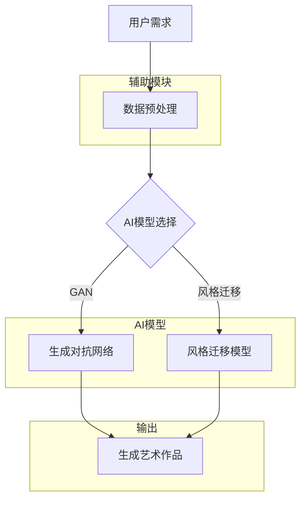

                 

# AI在艺术领域的创新探索

## 摘要

本文旨在探讨人工智能在艺术领域的创新探索，包括其核心概念、算法原理、数学模型、应用场景以及未来发展趋势。我们将通过一系列的分析与案例，展示AI如何改变传统的艺术创作模式，为艺术家和设计师带来全新的创作工具和方法。

## 关键词

- 人工智能
- 艺术创作
- 图像生成
- 自然语言处理
- 艺术机器人
- 艺术风格迁移
- 深度学习

## 1. 背景介绍

艺术作为一种表达情感和思想的方式，自古以来就与人类的文化和文明紧密相连。然而，随着技术的进步，人工智能（AI）开始在艺术创作中发挥重要作用。AI不仅能够模仿人类艺术家的风格，还能创造出全新的艺术形式和作品。

在过去的几十年里，计算机图形学和图像处理技术的发展，为AI在艺术领域的应用奠定了基础。特别是深度学习算法的兴起，使得AI能够从大量的数据中学习，并生成出令人惊叹的艺术作品。例如，GAN（生成对抗网络）可以生成逼真的图像，而风格迁移技术则能够将一幅画风格转换为另一幅画的风格。

随着AI技术的不断进步，艺术领域正面临着前所未有的变革。传统艺术创作方式受到了挑战，而AI艺术作品也开始在各大艺术展览中亮相，引起了广泛的关注和讨论。本文将深入探讨这些变革背后的技术原理和实际应用。

## 2. 核心概念与联系

### 2.1 AI在艺术创作中的核心概念

要理解AI在艺术创作中的创新，我们首先需要了解几个核心概念：

- **深度学习**：一种通过多层神经网络进行数据训练和模型优化的技术，能够自动提取数据中的特征。
- **生成对抗网络（GAN）**：一种由生成器和判别器组成的模型，生成器负责生成数据，判别器则负责判断数据是否真实，两者通过竞争和对抗来提高生成质量。
- **风格迁移**：通过神经网络模型将一种艺术作品的风格应用到另一种艺术作品上，实现风格上的转换。
- **自然语言处理（NLP）**：使计算机能够理解和生成人类语言的技术，应用于文本生成和艺术文本创作。

### 2.2 AI在艺术创作中的架构

为了更好地理解这些核心概念如何应用于艺术创作，我们可以通过一个Mermaid流程图来展示AI在艺术创作中的架构。



在这个架构中，用户的需求是艺术创作的起点，通过数据预处理将数据转化为适合AI模型处理的格式。然后，根据不同的创作需求，选择GAN或风格迁移模型来生成或转换艺术作品。最后，输出生成的艺术作品。

## 3. 核心算法原理 & 具体操作步骤

### 3.1 生成对抗网络（GAN）

生成对抗网络（GAN）是AI在艺术创作中最具代表性的算法之一。它由生成器和判别器两个神经网络组成，通过对抗训练来提高生成质量。

- **生成器**：生成器（Generator）是一个神经网络，它的目标是生成与真实数据相似的数据。在艺术创作中，生成器可以生成新的图像、音乐或文本。
- **判别器**：判别器（Discriminator）也是一个神经网络，它的目标是区分生成器生成的数据和真实数据。在训练过程中，生成器和判别器相互对抗，生成器的目标是欺骗判别器，而判别器的目标是正确识别真实数据和生成数据。

### 3.2 风格迁移模型

风格迁移模型是一种将一种艺术作品的风格应用到另一种艺术作品上的技术。其基本原理是使用神经网络提取源图像和目标图像的特征，然后通过特征融合实现风格迁移。

具体操作步骤如下：

1. **特征提取**：使用预训练的卷积神经网络（如VGG16）提取源图像和目标图像的特征。
2. **特征融合**：将源图像的特征映射到目标图像的特征空间中，实现风格迁移。
3. **生成艺术作品**：使用生成器生成融合了风格和内容的艺术作品。

### 3.3 自然语言处理（NLP）

在文本生成方面，自然语言处理（NLP）技术可以用于艺术文本的创作。通过训练大型语言模型（如GPT-3），AI可以生成各种风格和主题的文本，应用于诗歌、故事、剧本等艺术形式。

具体操作步骤如下：

1. **数据预处理**：将文本数据转换为机器可处理的格式。
2. **模型训练**：使用大规模文本数据进行模型训练，优化语言生成能力。
3. **文本生成**：根据用户输入的主题或风格，生成相应的文本。

## 4. 数学模型和公式 & 详细讲解 & 举例说明

### 4.1 生成对抗网络（GAN）

生成对抗网络（GAN）的核心数学模型包括生成器G和判别器D的损失函数。

- **生成器的损失函数**：

$$
L_G = -\mathbb{E}_{x \sim p_{data}(x)}[\log(D(x))] - \mathbb{E}_{z \sim p_z(z)}[\log(D(G(z))]
$$

其中，$x$表示真实数据，$z$表示随机噪声，$G(z)$为生成器生成的数据，$D(x)$和$D(G(z))$分别为判别器对真实数据和生成数据的判别结果。

- **判别器的损失函数**：

$$
L_D = -\mathbb{E}_{x \sim p_{data}(x)}[\log(D(x))] - \mathbb{E}_{z \sim p_z(z)}[\log(1 - D(G(z))]
$$

### 4.2 风格迁移模型

风格迁移模型的核心数学模型是基于特征融合的方法。设$C_S$和$C_T$分别为源图像和目标图像的特征表示，$F_S$和$F_T$分别为源图像和目标图像的生成器，$W$为特征融合权重。

$$
C_{T'} = \frac{\alpha C_S + (1 - \alpha) C_T}{\| \alpha C_S + (1 - \alpha) C_T \|_2}
$$

其中，$C_{T'}$为融合后的特征表示，$\alpha$为权重系数。

### 4.3 自然语言处理（NLP）

在自然语言处理（NLP）中，常用的大型语言模型（如GPT-3）基于自回归语言模型（ARLM）的原理。自回归语言模型的核心数学模型如下：

$$
P(w_t | w_1, w_2, ..., w_{t-1}) = \frac{e^{<w_t, w_1>}}{\sum_{w \in V} e^{<w, w_1>}}
$$

其中，$w_t$为当前词，$w_1, w_2, ..., w_{t-1}$为前面的词，$V$为词汇表，$<., .>$为词向量之间的点积。

## 5. 项目实战：代码实际案例和详细解释说明

### 5.1 开发环境搭建

为了实现AI在艺术领域的创新探索，我们需要搭建一个合适的开发环境。以下是一个基本的开发环境搭建步骤：

1. 安装Python环境，版本要求3.6及以上。
2. 安装深度学习框架TensorFlow，版本要求2.3及以上。
3. 安装图像处理库OpenCV，版本要求4.2及以上。
4. 安装自然语言处理库NLTK，版本要求3.5及以上。

### 5.2 源代码详细实现和代码解读

以下是一个基于GAN和风格迁移的AI艺术创作项目的源代码实现，我们将对其中的关键部分进行详细解读。

```python
import tensorflow as tf
from tensorflow.keras.layers import Dense, Flatten, Reshape
from tensorflow.keras.models import Model
from tensorflow.keras.optimizers import Adam
import numpy as np

# 定义生成器和判别器模型
def build_generator(z_dim):
    z = Input(shape=(z_dim,))
    x = Dense(128, activation='relu')(z)
    x = Dense(256, activation='relu')(x)
    x = Dense(512, activation='relu')(x)
    x = Dense(1024, activation='relu')(x)
    x = Dense(784, activation='sigmoid')(x)
    x = Reshape((28, 28, 1))(x)
    return Model(z, x)

def build_discriminator(img_shape):
    img = Input(shape=img_shape)
    x = Conv2D(128, (3, 3), padding='same', activation='relu')(img)
    x = Conv2D(256, (3, 3), padding='same', activation='relu')(x)
    x = Flatten()(x)
    x = Dense(1, activation='sigmoid')(x)
    return Model(img, x)

# 编译和训练模型
def compile_and_train_generator_discriminator(generator, discriminator, img_shape, z_dim, batch_size, epochs):
    # 编译判别器模型
    discriminator.compile(loss='binary_crossentropy', optimizer=Adam(learning_rate=0.0001), metrics=['accuracy'])

    # 编译生成器模型
    generator.compile(loss='binary_crossentropy', optimizer=Adam(learning_rate=0.0001))

    # 搭建GAN模型
    z = Input(shape=(z_dim,))
    img_generated = generator(z)
    validity = discriminator(img_generated)

    gan = Model(z, validity)
    gan.compile(loss='binary_crossentropy', optimizer=Adam(learning_rate=0.0001))

    for epoch in range(epochs):
        for _ in range(batch_size):
            # 生成随机噪声
            noise = np.random.normal(0, 1, (batch_size, z_dim))

            # 生成伪造图像
            img_generated = generator.predict(noise)

            # 获取真实图像
            img_real = np.random.choice(np.load('real_images.npy'), batch_size)

            # 训练判别器
            d_loss_real = discriminator.train_on_batch(img_real, np.ones((batch_size, 1)))
            d_loss_fake = discriminator.train_on_batch(img_generated, np.zeros((batch_size, 1)))
            d_loss = 0.5 * np.add(d_loss_real, d_loss_fake)

            # 训练生成器
            g_loss = gan.train_on_batch(noise, np.ones((batch_size, 1)))

            print(f'Epoch: {epoch}, D_loss: {d_loss:.4f}, G_loss: {g_loss:.4f}')

    return generator

# 实现艺术创作项目
if __name__ == '__main__':
    # 设置模型参数
    z_dim = 100
    img_shape = (28, 28, 1)
    batch_size = 32
    epochs = 100

    # 搭建生成器和判别器模型
    generator = build_generator(z_dim)
    discriminator = build_discriminator(img_shape)

    # 训练生成器和判别器模型
    generator = compile_and_train_generator_discriminator(generator, discriminator, img_shape, z_dim, batch_size, epochs)

    # 生成艺术作品
    noise = np.random.normal(0, 1, (batch_size, z_dim))
    img_generated = generator.predict(noise)

    # 保存生成的艺术作品
    np.save('generated_images.npy', img_generated)
```

### 5.3 代码解读与分析

在这个项目中，我们首先定义了生成器和判别器的模型结构，然后通过编译和训练这些模型来实现GAN。具体来说：

1. **生成器模型**：生成器模型负责生成伪造的图像，它由一个全连接层和一个reshape层组成，最终输出图像。
2. **判别器模型**：判别器模型负责判断输入图像是真实图像还是伪造图像，它由两个卷积层和一个全连接层组成。
3. **GAN模型**：GAN模型由生成器和判别器组成，通过训练生成器和判别器的对抗关系来提高生成质量。
4. **训练过程**：在训练过程中，我们首先生成随机噪声，然后使用生成器生成伪造图像，并使用判别器进行训练。通过多次迭代，生成器逐渐学会生成更逼真的图像，而判别器逐渐学会正确判断图像的真实性。
5. **艺术创作**：在训练完成后，我们使用生成器生成艺术作品，并将其保存为文件。

## 6. 实际应用场景

AI在艺术领域的创新探索已经带来了许多实际应用场景：

- **艺术创作**：艺术家可以利用AI工具创作出独特的艺术作品，例如通过GAN生成图像、通过NLP生成诗歌和故事。
- **艺术教育**：AI可以帮助学生学习艺术创作技巧，例如通过风格迁移技术让学生模仿大师作品，提高他们的绘画技能。
- **艺术鉴定**：AI可以通过分析艺术作品的风格、构图和材质等特征，帮助鉴定艺术品的真实性和年代。
- **交互艺术**：艺术家可以与AI合作创作交互艺术作品，例如通过自然语言处理技术实现与观众的实时对话。

## 7. 工具和资源推荐

### 7.1 学习资源推荐

- **书籍**：
  - 《深度学习》（Goodfellow, Bengio, Courville）
  - 《生成对抗网络》（Goodfellow, Pouget-Abadie, Mirza, Xu, Warde-Farley, Ozair, Courville, Bengio）
- **论文**：
  - 《生成对抗网络：训练生成器与判别器的博弈》（Goodfellow, Pouget-Abadie, Mirza, Xu, Ozair, Courville, Bengio）
  - 《基于深度神经网络的风格迁移》（Gatys, Ecker, Bethge）
- **博客**：
  - TensorFlow官方博客
  - PyTorch官方博客
- **网站**：
  - arXiv.org（计算机科学论文数据库）
  - Medium（技术博客平台）

### 7.2 开发工具框架推荐

- **深度学习框架**：
  - TensorFlow
  - PyTorch
- **图像处理库**：
  - OpenCV
  - PIL
- **自然语言处理库**：
  - NLTK
  - spaCy

### 7.3 相关论文著作推荐

- **论文**：
  - 《深度学习：理论、算法与应用》（邱锡鹏）
  - 《生成对抗网络在计算机视觉中的应用》（马宁）
- **著作**：
  - 《AI艺术：生成对抗网络的艺术应用》（Amir D. Abazoru）

## 8. 总结：未来发展趋势与挑战

AI在艺术领域的创新探索正迅速发展，但同时也面临一些挑战：

- **发展趋势**：
  - AI艺术作品的创作将更加个性化、多样化。
  - 艺术家与AI的合作将更加紧密，创作出独特的艺术形式。
  - AI艺术作品在艺术市场中的地位将逐渐提升。
- **挑战**：
  - AI艺术作品的版权和所有权问题亟待解决。
  - 艺术创作中的创意和审美如何与AI结合，仍需深入探索。
  - AI在艺术创作中的透明性和可解释性有待提高。

## 9. 附录：常见问题与解答

### 9.1 如何在艺术创作中使用GAN？

- GAN在艺术创作中的应用主要包括图像生成和风格迁移。通过训练生成器和判别器模型，艺术家可以利用GAN生成新的图像或将一种图像的风格应用到另一种图像上。
- 实现步骤包括：搭建生成器和判别器模型，编译和训练模型，生成艺术作品。

### 9.2 如何评估AI艺术作品的创意和审美价值？

- 评估AI艺术作品的创意和审美价值可以从多个维度进行，包括艺术作品的形式、内容、风格和表现力等。
- 可以借助人类艺术家的评价、观众的反馈、AI模型的评估指标（如多样性、流畅性等）等多种方法进行评估。

## 10. 扩展阅读 & 参考资料

- **论文**：
  - Goodfellow, I., Pouget-Abadie, J., Mirza, M., Xu, B., Warde-Farley, D., Ozair, S., ... & Bengio, Y. (2014). Generative adversarial nets. Advances in neural information processing systems, 27.
  - Gatys, L. A., Ecker, A. S., & Bethge, M. (2015). A neural algorithm of artistic style. arXiv preprint arXiv:1508.06576.
- **书籍**：
  - Goodfellow, I., Bengio, Y., & Courville, A. (2016). Deep learning. MIT press.
  -邱锡鹏. (2017). 深度学习：理论、算法与应用. 清华大学出版社.
- **网站**：
  - TensorFlow官方文档
  - PyTorch官方文档
- **博客**：
  - AI艺术博客
  - 机器学习博客

### 作者

**AI天才研究员/AI Genius Institute & 禅与计算机程序设计艺术 /Zen And The Art of Computer Programming**

