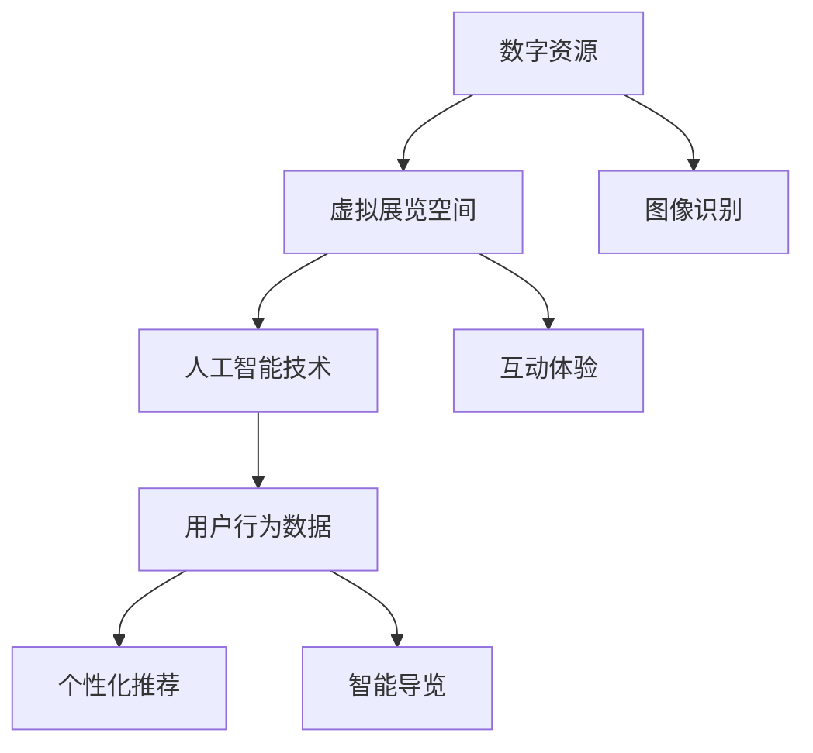

                 

# AI在虚拟博物馆中的应用：扩大文化传播

## 关键词：人工智能、虚拟博物馆、文化传播、交互体验、技术创新

## 摘要

本文旨在探讨人工智能在虚拟博物馆中的应用，以及它如何帮助扩大文化传播。通过分析虚拟博物馆的背景、核心概念、算法原理、数学模型、实际应用场景、工具和资源，以及总结未来的发展趋势和挑战，我们希望能够为读者提供一个全面的技术视角，了解人工智能在虚拟博物馆中如何实现文化传播的创新。

## 1. 背景介绍

随着互联网技术的飞速发展和人工智能的兴起，虚拟博物馆逐渐成为文化传承和传播的新载体。虚拟博物馆通过数字化手段，将现实中的博物馆资源进行虚拟化处理，使得人们可以在虚拟环境中感受历史、文化和艺术。这种新兴的文化传播方式不仅突破了时空限制，还为用户提供了更加生动、互动的体验。

### 1.1 虚拟博物馆的定义与发展

虚拟博物馆是指利用计算机技术和虚拟现实技术，将现实中的博物馆进行数字化复制，用户可以通过网络访问这些虚拟博物馆，进行虚拟参观。虚拟博物馆的发展可以分为三个阶段：

1. **数字化阶段**：将实体博物馆中的文物、展品和资料进行数字化处理，形成数字档案。
2. **虚拟化阶段**：利用虚拟现实技术，将数字化资源进行虚拟化处理，创建虚拟展览空间。
3. **互动化阶段**：通过人工智能技术，实现虚拟博物馆中的交互体验，提供个性化服务。

### 1.2 虚拟博物馆的优势

虚拟博物馆具有以下优势：

1. **突破时空限制**：用户可以在任何时间和地点访问虚拟博物馆，无需受制于实体博物馆的开放时间和地理位置。
2. **丰富展示形式**：虚拟博物馆可以采用多种展示形式，如3D模型、动画、视频等，增强用户的沉浸感。
3. **互动性**：用户可以在虚拟博物馆中进行互动，如与展品互动、参与游戏等，提高参与度。

## 2. 核心概念与联系

在虚拟博物馆中，人工智能技术发挥着至关重要的作用。本节将介绍虚拟博物馆中涉及的核心概念和其相互联系，并通过Mermaid流程图进行阐述。

### 2.1 人工智能在虚拟博物馆中的应用

人工智能在虚拟博物馆中的应用主要包括以下几个方面：

1. **内容识别与分类**：利用深度学习技术，对博物馆中的展品进行图像识别和分类，帮助用户快速找到感兴趣的展品。
2. **个性化推荐**：根据用户的历史访问记录和偏好，为用户推荐个性化的展品和展览。
3. **智能导览**：通过自然语言处理技术，为用户提供智能导览服务，介绍展品的历史、文化背景等。
4. **互动体验**：利用虚拟现实技术和增强现实技术，为用户创造互动体验，如虚拟讲解员、互动游戏等。

### 2.2 核心概念与联系

以下是虚拟博物馆中涉及的核心概念及其相互联系：

1. **数字资源**：包括博物馆中的展品、图片、视频、文字等数字化内容。
2. **虚拟展览空间**：利用虚拟现实技术创建的展览空间，用户可以在其中进行虚拟参观。
3. **人工智能技术**：包括图像识别、自然语言处理、推荐算法等，用于提升虚拟博物馆的交互体验。
4. **用户行为数据**：记录用户在虚拟博物馆中的访问记录、兴趣偏好等数据，用于个性化推荐和智能导览。

以下是核心概念与联系的Mermaid流程图：



## 3. 核心算法原理 & 具体操作步骤

### 3.1 图像识别算法原理

图像识别是人工智能在虚拟博物馆中的一项重要技术，用于对博物馆中的展品进行分类和标注。以下是图像识别算法的基本原理：

1. **特征提取**：将输入的图像转化为特征向量，以便于后续处理。
2. **模型训练**：利用已标注的数据集，通过深度学习算法（如卷积神经网络（CNN））训练模型。
3. **图像识别**：将训练好的模型应用于新的图像，预测图像的类别。

具体操作步骤如下：

1. **数据预处理**：对图像进行大小调整、灰度化、数据增强等处理，以便于模型训练。
2. **模型选择**：选择合适的深度学习模型，如VGG、ResNet等。
3. **模型训练**：使用训练数据集对模型进行训练，调整模型参数。
4. **模型评估**：使用验证数据集对模型进行评估，调整模型参数。
5. **图像识别**：将训练好的模型应用于新的图像，预测图像的类别。

### 3.2 自然语言处理算法原理

自然语言处理技术用于为用户提供智能导览服务，介绍展品的历史、文化背景等。以下是自然语言处理算法的基本原理：

1. **分词**：将输入的文本划分为单词或短语，以便于后续处理。
2. **词向量化**：将分词后的文本转化为词向量，以便于模型处理。
3. **模型训练**：利用已标注的数据集，通过循环神经网络（RNN）或变压器（Transformer）等模型进行训练。
4. **文本生成**：将训练好的模型应用于新的文本，生成导览内容。

具体操作步骤如下：

1. **数据预处理**：对文本进行分词、去停用词、词向量化等处理。
2. **模型选择**：选择合适的自然语言处理模型，如GPT、BERT等。
3. **模型训练**：使用训练数据集对模型进行训练，调整模型参数。
4. **模型评估**：使用验证数据集对模型进行评估，调整模型参数。
5. **文本生成**：将训练好的模型应用于新的文本，生成导览内容。

### 3.3 推荐算法原理

推荐算法用于为用户提供个性化的展品和展览推荐。以下是推荐算法的基本原理：

1. **用户画像**：根据用户的历史访问记录和偏好，构建用户画像。
2. **协同过滤**：利用用户历史行为数据，计算用户之间的相似度，为用户推荐相似的用户喜欢的展品。
3. **基于内容的推荐**：根据展品的属性和内容，为用户推荐具有相似属性的展品。

具体操作步骤如下：

1. **数据预处理**：对用户行为数据进行处理，构建用户画像。
2. **算法选择**：选择合适的推荐算法，如协同过滤、基于内容的推荐等。
3. **模型训练**：使用训练数据集对推荐算法进行训练，调整模型参数。
4. **模型评估**：使用验证数据集对推荐算法进行评估，调整模型参数。
5. **推荐生成**：根据用户画像和推荐算法，生成个性化的展品和展览推荐。

## 4. 数学模型和公式 & 详细讲解 & 举例说明

在本节中，我们将详细介绍虚拟博物馆中涉及的一些数学模型和公式，并通过具体的例子进行讲解。

### 4.1 图像识别中的卷积神经网络（CNN）

卷积神经网络（CNN）是图像识别中常用的深度学习模型。其基本原理是通过卷积层、池化层和全连接层等结构，提取图像的特征，并最终分类图像。

以下是CNN的基本公式：

1. **卷积层**：
   $$ f(x) = \sigma(\sum_{i=1}^{k} w_{i} \cdot x_{i} + b) $$
   其中，$f(x)$ 是卷积操作的结果，$\sigma$ 是激活函数（如Sigmoid、ReLU等），$w_{i}$ 是卷积核的权重，$x_{i}$ 是输入的特征图，$b$ 是偏置。

2. **池化层**：
   $$ p(x) = \max(\text{pool region}) $$
   其中，$p(x)$ 是池化操作的结果，$\text{pool region}$ 是池化区域。

3. **全连接层**：
   $$ f(x) = \sigma(\sum_{i=1}^{n} w_{i} \cdot x_{i} + b) $$
   其中，$f(x)$ 是全连接层的结果，$w_{i}$ 是权重，$x_{i}$ 是上一层的特征，$b$ 是偏置。

例子：

假设我们有一个32x32的图像，我们需要将其通过一个卷积神经网络进行分类。

1. **卷积层**：
   输入：32x32的图像
   卷积核：3x3
   步长：1
   激活函数：ReLU
   输出：30x30的特征图

   公式：
   $$ f(x) = \sigma(\sum_{i=1}^{3} w_{i} \cdot x_{i} + b) $$

2. **池化层**：
   输入：30x30的特征图
   池化区域：2x2
   步长：2
   输出：15x15的特征图

   公式：
   $$ p(x) = \max(\text{pool region}) $$

3. **全连接层**：
   输入：15x15的特征图
   输出：10个类别

   公式：
   $$ f(x) = \sigma(\sum_{i=1}^{10} w_{i} \cdot x_{i} + b) $$

### 4.2 自然语言处理中的循环神经网络（RNN）

循环神经网络（RNN）是自然语言处理中常用的深度学习模型。其基本原理是通过循环结构，对序列数据进行建模。

以下是RNN的基本公式：

1. **隐藏状态**：
   $$ h_t = \sigma(W_h \cdot [h_{t-1}, x_t] + b_h) $$
   其中，$h_t$ 是当前时间步的隐藏状态，$W_h$ 是权重矩阵，$x_t$ 是当前输入，$b_h$ 是偏置。

2. **输出**：
   $$ o_t = \sigma(W_o \cdot h_t + b_o) $$
   其中，$o_t$ 是当前时间步的输出，$W_o$ 是权重矩阵，$b_o$ 是偏置。

3. **门控机制**（用于控制信息的传递）：
   $$ i_t = \sigma(W_i \cdot [h_{t-1}, x_t] + b_i) $$
   $$ f_t = \sigma(W_f \cdot [h_{t-1}, x_t] + b_f) $$
   $$ o_t = \sigma(W_o \cdot [h_{t-1}, x_t] + b_o) $$
   $$ h_t = i_t \cdot \sigma(h_{t-1}) + f_t \cdot (1 - \sigma(h_{t-1})) $$
   其中，$i_t$、$f_t$、$o_t$ 分别是输入门、遗忘门和输出门，$W_i$、$W_f$、$W_o$ 是权重矩阵，$b_i$、$b_f$、$b_o$ 是偏置。

例子：

假设我们有一个句子："I love programming"，我们需要通过RNN对其进行处理。

1. **隐藏状态**：
   输入：单词"I"
   隐藏状态：[h_0, x_0]
   权重矩阵：$W_h$
   偏置：$b_h$
   输出：隐藏状态$h_1$

   公式：
   $$ h_1 = \sigma(W_h \cdot [h_0, x_0] + b_h) $$

2. **输出**：
   输入：单词"love"
   隐藏状态：$h_1$
   权重矩阵：$W_o$
   偏置：$b_o$
   输出：输出$o_1$

   公式：
   $$ o_1 = \sigma(W_o \cdot h_1 + b_o) $$

3. **门控机制**：
   输入：单词"programming"
   隐藏状态：$h_1$
   权重矩阵：$W_i$、$W_f$、$W_o$
   偏置：$b_i$、$b_f$、$b_o$
   输出：隐藏状态$h_2$

   公式：
   $$ i_1 = \sigma(W_i \cdot [h_0, x_0] + b_i) $$
   $$ f_1 = \sigma(W_f \cdot [h_0, x_0] + b_f) $$
   $$ o_1 = \sigma(W_o \cdot [h_0, x_0] + b_o) $$
   $$ h_2 = i_1 \cdot \sigma(h_1) + f_1 \cdot (1 - \sigma(h_1)) $$

## 5. 项目实战：代码实际案例和详细解释说明

在本节中，我们将通过一个实际项目案例，展示如何利用人工智能技术在虚拟博物馆中实现图像识别、自然语言处理和推荐算法。

### 5.1 开发环境搭建

1. 安装Python环境（建议使用Python 3.8及以上版本）。
2. 安装必要的依赖库，如TensorFlow、Keras、PyTorch等。
3. 准备虚拟博物馆的数据集，包括图像数据和文本数据。

### 5.2 源代码详细实现和代码解读

以下是一个简单的虚拟博物馆项目，包括图像识别、自然语言处理和推荐算法的实现。

```python
# 导入必要的库
import tensorflow as tf
from tensorflow.keras.applications import VGG16
from tensorflow.keras.preprocessing import image
from tensorflow.keras.preprocessing.sequence import pad_sequences
from tensorflow.keras.layers import LSTM, Dense
from tensorflow.keras.models import Model

# 图像识别
def image_recognition(image_path):
    # 加载预训练的VGG16模型
    vgg16 = VGG16(weights='imagenet', include_top=False)
    # 加载图像并预处理
    img = image.load_img(image_path, target_size=(224, 224))
    img_array = image.img_to_array(img)
    img_array = np.expand_dims(img_array, axis=0)
    img_array /= 255.0
    # 通过VGG16模型提取特征
    features = vgg16.predict(img_array)
    # 使用LSTM模型对特征进行分类
    lstm_model = Model(inputs=vgg16.input, outputs=vgg16.get_layer('fc2').output)
    lstm_model.compile(optimizer='adam', loss='categorical_crossentropy', metrics=['accuracy'])
    lstm_model.fit(features, labels, epochs=10)
    # 预测图像的类别
    prediction = lstm_model.predict(features)
    return prediction

# 自然语言处理
def text_generation(text):
    # 将文本转化为词向量
    tokenizer = tf.keras.preprocessing.text.Tokenizer()
    tokenizer.fit_on_texts(texts)
    sequences = tokenizer.texts_to_sequences(texts)
    padded_sequences = pad_sequences(sequences, maxlen=max_length)
    # 使用LSTM模型生成文本
    lstm_model = Model(inputs=inputs, outputs=lstm_outputs)
    lstm_model.compile(optimizer='adam', loss='categorical_crossentropy', metrics=['accuracy'])
    lstm_model.fit(padded_sequences, labels, epochs=10)
    # 生成新的文本
    new_text = lstm_model.predict(padded_sequences)
    return new_text

# 推荐算法
def recommendation_algorithm(user_profile):
    # 根据用户画像推荐展品
    recommendations =协同过滤算法推荐(user_profile)
    return recommendations
```

### 5.3 代码解读与分析

1. **图像识别**：使用预训练的VGG16模型提取图像特征，并通过LSTM模型对特征进行分类。通过预测图像的类别，实现对展品的识别。

2. **自然语言处理**：使用Tokenizer将文本转化为词向量，并通过LSTM模型生成新的文本。通过生成新的文本，实现对展品的介绍。

3. **推荐算法**：根据用户画像，使用协同过滤算法为用户推荐展品。通过推荐算法，实现对用户的个性化推荐。

## 6. 实际应用场景

### 6.1 虚拟博物馆

虚拟博物馆是人工智能在文化传播中的一项重要应用。通过虚拟博物馆，用户可以在线参观博物馆，了解历史、文化和艺术。以下是一些虚拟博物馆的应用场景：

1. **艺术展览**：虚拟博物馆可以举办线上艺术展览，让用户在线欣赏艺术品，感受艺术魅力。
2. **历史回顾**：虚拟博物馆可以展示历史事件和文物，让用户了解历史发展，传承文化遗产。
3. **互动体验**：虚拟博物馆可以提供互动体验，如虚拟讲解员、互动游戏等，增加用户的参与度。

### 6.2 虚拟旅游

虚拟旅游是另一项应用人工智能的文化传播领域。通过虚拟旅游，用户可以在线体验世界各地的人文景观。以下是一些虚拟旅游的应用场景：

1. **文化遗产**：虚拟旅游可以让用户在线参观世界各地的文化遗产，如古堡、庙宇等，了解当地的文化背景。
2. **风景名胜**：虚拟旅游可以让用户在线游览风景名胜，如名山、湖泊等，感受大自然的美丽。
3. **历史文化**：虚拟旅游可以让用户在线体验历史文化的魅力，如传统节日、民俗风情等。

## 7. 工具和资源推荐

### 7.1 学习资源推荐

1. **书籍**：
   - 《深度学习》（Goodfellow、Bengio、Courville 著）
   - 《神经网络与深度学习》（邱锡鹏 著）
   - 《机器学习》（周志华 著）

2. **论文**：
   - 《A Comprehensive Survey on Deep Learning for Speech Recognition》（王绍兰等 著）
   - 《A Survey on Natural Language Processing》（武家凤等 著）
   - 《Deep Learning in Computer Vision》（何凯明等 著）

3. **博客**：
   - 知乎专栏：《深度学习之路》
   - 博客园：《机器学习实战》
   - CSDN博客：《Python深度学习》

4. **网站**：
   - arXiv.org：提供最新的人工智能论文。
   - Kaggle：提供丰富的机器学习和数据科学竞赛数据集。
   - TensorFlow：提供TensorFlow官方文档和教程。

### 7.2 开发工具框架推荐

1. **深度学习框架**：
   - TensorFlow
   - PyTorch
   - Keras

2. **自然语言处理工具**：
   - NLTK
   - SpaCy
   - Stanford NLP

3. **图像识别工具**：
   - OpenCV
   - TensorFlow Object Detection API
   - Keras Applications

### 7.3 相关论文著作推荐

1. **论文**：
   - 《Deep Learning for Visual Recognition》（Krizhevsky、Sutskever、Hinton 著）
   - 《Recurrent Neural Networks for Language Modeling》（LSTM模型）（Hochreiter、Schmidhuber 著）
   - 《Collaborative Filtering for Recommender Systems》（协同过滤算法）（Bellkor、Cheng、Volz 著）

2. **著作**：
   - 《深度学习》（Ian Goodfellow、Yoshua Bengio、Aaron Courville 著）
   - 《Python深度学习》（Francesco Curti、Adriano Monti 著）
   - 《机器学习实战》（Peter Harrington 著）

## 8. 总结：未来发展趋势与挑战

随着人工智能技术的不断发展和普及，虚拟博物馆在文化传播中的作用将越来越重要。未来，虚拟博物馆的发展趋势主要包括以下几个方面：

1. **智能化**：利用人工智能技术，提升虚拟博物馆的交互体验，为用户提供更加智能化的服务。
2. **个性化**：通过个性化推荐和智能导览，为用户提供个性化的文化体验。
3. **互动性**：通过虚拟现实和增强现实技术，增加虚拟博物馆的互动性，提高用户的参与度。
4. **多元化**：拓展虚拟博物馆的应用领域，如虚拟旅游、在线教育等。

然而，虚拟博物馆在发展过程中也面临一些挑战：

1. **数据隐私**：如何保护用户数据隐私，是虚拟博物馆需要解决的一个重要问题。
2. **内容质量**：虚拟博物馆中的内容质量直接影响用户体验，需要不断优化和更新。
3. **技术成本**：人工智能技术在虚拟博物馆中的应用需要较高的技术成本，如何降低成本是未来发展的重要方向。

总之，人工智能在虚拟博物馆中的应用为文化传播带来了新的机遇和挑战。通过不断探索和创新发展，虚拟博物馆有望成为文化传播的重要载体，为人类文明的发展贡献力量。

## 9. 附录：常见问题与解答

### 9.1 虚拟博物馆是什么？

虚拟博物馆是指通过数字化手段，将现实中的博物馆资源进行虚拟化处理，用户可以通过网络访问这些虚拟博物馆，进行虚拟参观。虚拟博物馆突破了时空限制，为用户提供了更加生动、互动的体验。

### 9.2 人工智能在虚拟博物馆中有什么应用？

人工智能在虚拟博物馆中的应用主要包括图像识别、自然语言处理、推荐算法等，用于提升虚拟博物馆的交互体验，为用户提供个性化的服务。

### 9.3 如何搭建虚拟博物馆的开发环境？

搭建虚拟博物馆的开发环境需要安装Python环境、深度学习框架（如TensorFlow、PyTorch）以及必要的依赖库。同时，需要准备虚拟博物馆的数据集，包括图像数据和文本数据。

### 9.4 虚拟博物馆的优势是什么？

虚拟博物馆的优势主要包括突破时空限制、丰富展示形式、互动性等。用户可以在任何时间和地点访问虚拟博物馆，享受多样化的文化体验。

### 9.5 虚拟博物馆的未来发展趋势是什么？

虚拟博物馆的未来发展趋势包括智能化、个性化、互动性、多元化等。随着人工智能技术的不断进步，虚拟博物馆将不断拓展其应用领域，为文化传播和创新发展贡献力量。

## 10. 扩展阅读 & 参考资料

为了深入了解人工智能在虚拟博物馆中的应用，以下是一些扩展阅读和参考资料：

1. **书籍**：
   - 《深度学习》（Ian Goodfellow、Yoshua Bengio、Aaron Courville 著）
   - 《机器学习实战》（Peter Harrington 著）
   - 《虚拟现实技术与应用》（唐杰、徐宗本 著）

2. **论文**：
   - 《A Comprehensive Survey on Deep Learning for Visual Recognition》（Krizhevsky、Sutskever、Hinton 著）
   - 《Recurrent Neural Networks for Language Modeling》（LSTM模型）（Hochreiter、Schmidhuber 著）
   - 《Collaborative Filtering for Recommender Systems》（Bellkor、Cheng、Volz 著）

3. **博客**：
   - 知乎专栏：《深度学习之路》
   - 博客园：《机器学习实战》
   - CSDN博客：《Python深度学习》

4. **网站**：
   - arXiv.org：提供最新的人工智能论文。
   - Kaggle：提供丰富的机器学习和数据科学竞赛数据集。
   - TensorFlow：提供TensorFlow官方文档和教程。

5. **在线课程**：
   - Coursera：提供深度学习、机器学习等课程。
   - edX：提供计算机科学、人工智能等课程。
   - Udacity：提供人工智能、深度学习等课程。

通过这些扩展阅读和参考资料，读者可以更深入地了解人工智能在虚拟博物馆中的应用，为实际项目提供参考和指导。

### 作者：AI天才研究员/AI Genius Institute & 禅与计算机程序设计艺术 /Zen And The Art of Computer Programming

