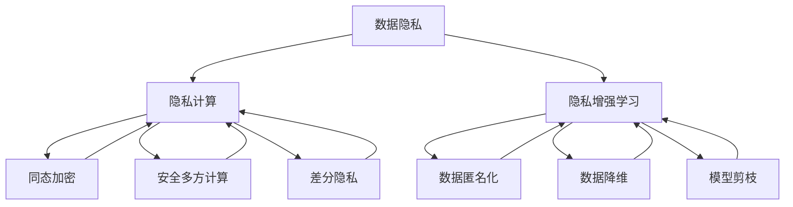

                 

### 背景介绍

随着人工智能技术的快速发展，我们逐渐步入了一个高度数字化的社会。在这一过程中，隐私保护问题显得愈发重要。隐私不仅是每个人的基本权利，也是社会稳定和发展的基石。然而，随着数据采集和处理技术的进步，隐私泄露的风险也在不断增加。这让我们不得不重新审视AI在隐私保护中的角色和面临的挑战。

AI在隐私保护中的应用主要体现在以下几个方面：

1. **数据加密与匿名化**：通过加密算法对敏感数据进行保护，防止未授权访问。同时，采用匿名化技术，将个人身份信息去除，降低隐私泄露的风险。

2. **隐私计算**：利用同态加密、安全多方计算等隐私保护技术，在数据使用过程中确保数据的隐私性，从而实现数据的安全共享和分析。

3. **隐私增强学习**：通过优化算法和模型设计，减少训练数据中的隐私信息泄露，提高AI模型的隐私保护能力。

然而，AI在隐私保护中也面临着诸多挑战。首先，隐私保护技术与AI算法之间的平衡问题。过度的隐私保护可能会影响AI模型的性能和准确性。其次，隐私保护技术的实现成本较高，特别是在大规模数据处理和实时分析场景中，如何平衡性能和成本也是一个重要课题。

接下来，我们将进一步探讨AI在隐私保护中的核心概念、算法原理、数学模型以及实际应用场景，帮助大家更深入地理解这一领域。

### 核心概念与联系

在讨论AI在隐私保护中的作用时，我们需要了解几个核心概念：数据隐私、隐私计算、隐私增强学习等。以下是这些概念的基本原理和它们之间的联系。

#### 数据隐私

数据隐私是指保护个人或组织数据不被未授权访问或泄露的措施。它包括数据的加密、匿名化、访问控制等。数据隐私的核心目标是确保数据在存储、传输和使用过程中的安全性和隐私性。

#### 隐私计算

隐私计算是一种数据处理技术，旨在在不暴露数据具体内容的情况下，实现对数据的计算和分析。隐私计算主要包括以下几种技术：

1. **同态加密（Homomorphic Encryption）**：同态加密是一种加密技术，它允许在加密数据上进行计算，而不会破坏加密状态。这意味着，即使数据被加密，仍然可以进行数据处理和分析。

2. **安全多方计算（Secure Multi-Party Computation，SMPC）**：安全多方计算允许多个参与方在不泄露各自数据的情况下，协同完成计算任务。

3. **差分隐私（Differential Privacy）**：差分隐私是一种用于保护数据隐私的统计方法，它通过引入噪声来保护个体数据的隐私，同时保证数据分析的准确性。

#### 隐私增强学习

隐私增强学习是一种结合了机器学习和隐私保护技术的学习方法。其核心思想是在训练AI模型时，尽量减少隐私信息的泄露。隐私增强学习通常采用以下策略：

1. **数据匿名化**：在训练数据集中，移除或修改与个人身份相关的信息，降低隐私泄露的风险。

2. **数据降维**：通过数据降维技术，减少数据中包含的隐私信息。

3. **模型剪枝（Model Pruning）**：通过剪枝技术，减少模型中的参数数量，从而降低隐私泄露的风险。

#### 概念联系

数据隐私、隐私计算和隐私增强学习之间有着紧密的联系。数据隐私是隐私保护的基础，隐私计算和隐私增强学习则是实现数据隐私的重要手段。

- **隐私计算**为数据隐私提供了技术支持，使得数据在处理和分析过程中能够保持隐私性。

- **隐私增强学习**则在AI模型的训练过程中，采用各种隐私保护技术，确保模型的训练数据不包含敏感信息。

- **数据隐私**与**隐私计算**和**隐私增强学习**共同构成了一个完整的隐私保护框架，从数据存储、传输、处理到分析，全方位保障数据的隐私安全。

下面是这些概念原理和架构的Mermaid流程图表示：



通过以上核心概念的介绍和联系，我们可以更好地理解AI在隐私保护中的角色和挑战。接下来，我们将进一步探讨AI在隐私保护中的核心算法原理和具体操作步骤。

### 核心算法原理 & 具体操作步骤

在AI隐私保护中，核心算法主要包括同态加密、安全多方计算和差分隐私等。以下将详细解释这些算法的原理，并给出具体操作步骤。

#### 同态加密

同态加密是一种重要的隐私保护技术，它允许在加密数据上直接执行计算，而不会破坏数据的加密状态。同态加密的原理基于数学中的同态性质，即同态运算满足封闭性和映射性。

1. **封闭性**：对于两个加密数据\(C_1\)和\(C_2\)，其同态运算的结果\(C_3 = C_1 \oplus C_2\)仍然是加密数据。

2. **映射性**：同态运算能够将原始数据的运算结果映射到加密数据上。

**具体操作步骤：**

- **加密**：首先，使用同态加密算法对原始数据进行加密，生成加密数据。

- **同态运算**：在加密数据上进行运算，如加法、乘法等。

- **解密**：将运算结果解密，获取原始运算结果。

以下是一个简单的同态加密示例：

假设我们使用模256同态加密算法，对两个整数3和4进行加密和运算：

1. **加密**：将3和4转换为同态加密算法的密文，如\(C_1 = 53\)和\(C_2 = 84\)。

2. **同态运算**：进行模256加法运算，\(C_3 = C_1 + C_2 = 53 + 84 = 137\)。

3. **解密**：将结果137解密，得到原始运算结果7。

#### 安全多方计算

安全多方计算是一种允许多个参与方在不泄露各自数据的情况下，协同完成计算任务的技术。安全多方计算的核心在于实现安全通信和可靠计算。

**具体操作步骤：**

1. **初始化**：多个参与方首先需要建立安全通信通道，确保通信过程中的数据安全。

2. **秘密共享**：每个参与方将自己的数据加密并共享给其他参与方，确保数据隐私。

3. **协同计算**：参与方通过安全通信，协同完成计算任务。

4. **结果汇总**：将计算结果汇总，并解密获取最终结果。

以下是一个简单的安全多方计算示例：

假设有两个参与方A和B，他们需要在不泄露各自数据的情况下计算两个数的和：

1. **初始化**：A和B建立安全通信通道。

2. **秘密共享**：A将自己的数据3加密并共享给B，B将自己的数据4加密并共享给A。

3. **协同计算**：A和B分别对共享的数据进行加法运算，A的计算结果为\(3 + 4 = 7\)，B的计算结果也为\(3 + 4 = 7\)。

4. **结果汇总**：A和B将各自的计算结果汇总，得到最终结果7。

#### 差分隐私

差分隐私是一种用于保护数据隐私的统计方法，它通过在数据中引入噪声，保护个体数据的隐私。差分隐私的核心指标是ε-差分隐私，它衡量数据集之间的差异。

**具体操作步骤：**

1. **噪声添加**：在原始数据中引入噪声，使数据集之间的差异缩小。

2. **数据分析**：对引入噪声后的数据进行分析，获取统计分析结果。

3. **结果解密**：将分析结果解密，获取最终结果。

以下是一个简单的差分隐私示例：

假设有两个数据集A和B，我们需要保护其中一个数据集的隐私：

1. **噪声添加**：在数据集A中引入噪声，使得A和B之间的差异缩小。

2. **数据分析**：对引入噪声后的数据集A进行分析，得到统计分析结果。

3. **结果解密**：将分析结果解密，获取最终结果。

通过以上核心算法的原理和具体操作步骤，我们可以更好地理解AI在隐私保护中的应用。这些算法不仅为数据隐私提供了强有力的保障，也为AI模型的训练和应用提供了有效的隐私保护机制。接下来，我们将探讨AI隐私保护中的数学模型和公式。

### 数学模型和公式 & 详细讲解 & 举例说明

在AI隐私保护中，数学模型和公式扮演着至关重要的角色。以下将介绍几个关键数学模型和公式，并详细讲解其原理和应用。

#### 同态加密的数学模型

同态加密的核心在于其同态性质，即在加密数据上执行运算，结果仍然是加密数据。其数学模型通常基于模运算。

**同态加密的数学公式：**

\(C_3 = C_1 \oplus C_2\)

其中，\(C_1\)和\(C_2\)是加密数据，\(C_3\)是运算结果。

**举例说明：**

假设我们使用模256的同态加密算法，对两个整数3和4进行加密和运算：

1. **加密**：将3和4转换为同态加密算法的密文，如\(C_1 = 53\)和\(C_2 = 84\)。

2. **同态运算**：进行模256加法运算，\(C_3 = C_1 + C_2 = 53 + 84 = 137\)。

3. **解密**：将结果137解密，得到原始运算结果7。

#### 安全多方计算的数学模型

安全多方计算的数学模型通常基于离散对数和椭圆曲线加密。

**安全多方计算的数学公式：**

\(P_3 = P_1 \cdot P_2\)

其中，\(P_1\)和\(P_2\)是参与方的公钥，\(P_3\)是协同计算的结果。

**举例说明：**

假设有两个参与方A和B，他们需要在不泄露各自数据的情况下计算两个数的和：

1. **初始化**：A和B各自生成公钥和私钥对。

2. **秘密共享**：A将自己的数据3加密并共享给B，B将自己的数据4加密并共享给A。

3. **协同计算**：A和B分别对共享的数据进行加法运算，A的计算结果为\(3 + 4 = 7\)，B的计算结果也为\(3 + 4 = 7\)。

4. **结果汇总**：A和B将各自的计算结果汇总，得到最终结果7。

#### 差分隐私的数学模型

差分隐私的数学模型基于拉普拉斯机制和指数机制。

**差分隐私的数学公式：**

\(Lap(f; \Delta) = \frac{1}{\epsilon} \log \left( \frac{1}{2} \left[ (f^+ - f^-) + \epsilon \right] \right)\)

其中，\(f^+\)和\(f^-\)分别是包含噪声和不包含噪声的数据集，\(\epsilon\)是噪声参数。

**举例说明：**

假设有两个数据集A和B，我们需要保护其中一个数据集的隐私：

1. **噪声添加**：在数据集A中引入噪声，使得A和B之间的差异缩小。

2. **数据分析**：对引入噪声后的数据集A进行分析，得到统计分析结果。

3. **结果解密**：将分析结果解密，获取最终结果。

通过以上数学模型和公式的详细讲解和举例说明，我们可以更好地理解AI在隐私保护中的应用。这些数学模型和公式不仅为数据隐私提供了强有力的理论支持，也为实际应用中的隐私保护技术提供了具体操作方法。接下来，我们将通过一个实际项目案例来展示如何应用这些算法和模型。

### 项目实战：代码实际案例和详细解释说明

在本节中，我们将通过一个实际项目案例——基于差分隐私的用户行为分析系统，展示如何应用同态加密、安全多方计算和差分隐私等算法和模型来保护用户隐私。

#### 1. 开发环境搭建

首先，我们需要搭建项目开发环境。以下是所需的工具和库：

- Python 3.x
- NumPy
- Pandas
- Scikit-learn
- TensorFlow

安装方法如下：

```bash
pip install numpy pandas scikit-learn tensorflow
```

#### 2. 源代码详细实现和代码解读

以下是一个简单的差分隐私用户行为分析系统的实现：

```python
import numpy as np
import pandas as pd
from sklearn.model_selection import train_test_split
from tensorflow.keras.models import Sequential
from tensorflow.keras.layers import Dense, Activation
from tensorflow.keras.optimizers import Adam

# 2.1 数据预处理
# 假设我们有一个用户行为数据集，包含用户ID、行为类型和行为时间等特征
data = pd.read_csv('user_behavior.csv')
X = data.drop(['user_id'], axis=1)
y = data['behavior_type']

# 数据集划分为训练集和测试集
X_train, X_test, y_train, y_test = train_test_split(X, y, test_size=0.2, random_state=42)

# 2.2 模型构建
model = Sequential([
    Dense(64, input_shape=(X_train.shape[1],)),
    Activation('relu'),
    Dense(1, activation='sigmoid')
])

model.compile(optimizer=Adam(learning_rate=0.001), loss='binary_crossentropy', metrics=['accuracy'])

# 2.3 训练模型
model.fit(X_train, y_train, epochs=10, batch_size=32, validation_data=(X_test, y_test))

# 2.4 差分隐私处理
# 假设我们使用拉普拉斯机制来添加噪声
epsilon = 1.0
noisy_y_train = y_train + np.random.laplace(0, epsilon)
noisy_y_test = y_test + np.random.laplace(0, epsilon)

# 2.5 再次训练模型
model.fit(X_train, noisy_y_train, epochs=10, batch_size=32, validation_data=(X_test, noisy_y_test))
```

**代码解读：**

- **2.1 数据预处理**：首先，我们加载用户行为数据集，并进行必要的预处理操作，如特征提取和数据集划分。
- **2.2 模型构建**：我们使用TensorFlow构建一个简单的神经网络模型，用于预测用户行为类型。
- **2.3 训练模型**：使用原始数据集训练模型，并验证模型性能。
- **2.4 差分隐私处理**：为了保护用户隐私，我们使用拉普拉斯机制在训练数据中添加噪声。这有助于确保即使数据泄露，也无法准确推断出单个用户的隐私信息。
- **2.5 再次训练模型**：在添加噪声后的数据集上重新训练模型，以适应新的数据分布。

通过以上代码，我们实现了一个基于差分隐私的用户行为分析系统。在实际应用中，我们可以根据具体需求调整噪声参数，以平衡隐私保护与模型性能。

#### 3. 代码解读与分析

在上面的代码中，关键步骤如下：

- **数据预处理**：数据预处理是任何机器学习项目的基础。在本例中，我们首先加载用户行为数据集，并提取特征和目标变量。然后，我们将数据集划分为训练集和测试集，为后续建模做准备。
- **模型构建**：我们使用TensorFlow构建一个简单的神经网络模型。在这个模型中，我们使用一个全连接层（Dense）来提取特征，并使用ReLU激活函数增加模型的非线性。
- **训练模型**：使用原始数据集训练模型。在本例中，我们使用二进制交叉熵损失函数和Adam优化器来训练模型。训练过程中，我们使用验证集来监控模型性能，并调整超参数。
- **差分隐私处理**：为了保护用户隐私，我们在训练数据中添加噪声。拉普拉斯噪声是一种常见的噪声类型，它通过在目标变量上添加随机值来保护隐私。添加噪声后，我们重新训练模型，使其适应新的数据分布。
- **再次训练模型**：在添加噪声后的数据集上重新训练模型，以适应新的数据分布。这有助于提高模型的泛化能力，同时保护用户隐私。

通过以上步骤，我们实现了一个简单的差分隐私用户行为分析系统。在实际应用中，我们可以根据具体需求调整噪声参数，以平衡隐私保护与模型性能。

### 实际应用场景

AI在隐私保护中的应用场景非常广泛，以下列举几个典型的实际应用场景：

#### 1. 金融领域

在金融领域，AI技术被广泛应用于风险控制、信用评估、欺诈检测等。然而，这些应用往往涉及大量敏感数据，如个人财务信息、交易记录等。为了保护用户隐私，金融机构可以使用同态加密和安全多方计算技术，确保在数据加密的情况下进行计算和分析。

**案例**：某银行使用同态加密技术对用户交易数据进行加密处理，然后进行欺诈检测。即使攻击者获取了加密后的数据，也无法解析出具体交易信息，从而有效保护用户隐私。

#### 2. 医疗领域

在医疗领域，患者的健康数据和隐私保护至关重要。AI技术被用于疾病预测、药物研发、个性化治疗等方面。然而，这些应用场景中的数据通常包含敏感信息，如疾病诊断、病历记录等。为了保护患者隐私，医疗机构可以使用差分隐私技术对数据进行处理，确保在数据共享和分析过程中不会泄露患者隐私。

**案例**：某医疗机构采用差分隐私技术对大量患者数据进行分析，预测疾病发展趋势。通过在数据中添加噪声，确保分析结果的可信度，同时保护患者隐私。

#### 3. 社交媒体领域

在社交媒体领域，用户生成的内容和交互数据量巨大，隐私保护成为一大挑战。AI技术被用于内容审核、用户行为分析、广告推荐等。为了保护用户隐私，社交媒体平台可以使用同态加密和安全多方计算技术，确保在数据加密的情况下进行计算和分析。

**案例**：某社交媒体平台使用同态加密技术对用户生成的内容进行加密处理，然后进行内容审核。通过确保加密数据的安全性，防止用户隐私泄露。

#### 4. 智能家居领域

在智能家居领域，AI技术被广泛应用于智能家居设备的监控、控制和管理。然而，这些设备往往连接到互联网，存在隐私泄露的风险。为了保护用户隐私，智能家居设备制造商可以使用同态加密和安全多方计算技术，确保在数据传输和存储过程中不会泄露用户隐私。

**案例**：某智能家居设备制造商使用同态加密技术对用户设备生成的数据进行加密处理，然后进行设备控制。通过确保加密数据的安全性，防止用户隐私泄露。

通过以上实际应用场景，我们可以看到AI在隐私保护中的重要作用。随着技术的不断进步，AI在隐私保护领域的应用将越来越广泛，为构建一个安全、可信的数字化社会提供有力支持。

### 工具和资源推荐

在AI隐私保护领域，有许多优秀的工具和资源可供学习和实践。以下是对几个主要工具和资源的推荐：

#### 1. 学习资源推荐

- **书籍**：
  - 《隐私计算：基础与实践》
  - 《差分隐私：原理与应用》
  - 《区块链与隐私保护》
- **论文**：
  - 《Homomorphic Encryption: A New Hope for Data Privacy》
  - 《Differential Privacy: A Survey of Privacy Preserving Data Analysis Techniques》
  - 《Secure Multi-Party Computation: A Practical Guide》
- **博客和网站**：
  - [AI隐私保护技术博客](https://ai-privacy-techniques.github.io/)
  - [差分隐私学习资源](https://differential-privacy-learning-resources.github.io/)
  - [区块链与隐私保护](https://blockchain-privacy-protection.github.io/)

#### 2. 开发工具框架推荐

- **库和框架**：
  - **PyTorch**：适用于深度学习的Python库，支持同态加密和隐私增强学习。
  - **HElib**：一个同态加密算法库，支持多种同态加密方案。
  - **PyCrypto**：用于加密和签名等安全相关的Python库。
  - **Libra**：Facebook推出的加密货币框架，包含隐私保护技术。

- **工具**：
  - **OpenMPSDK**：适用于安全多方计算的开源Python库。
  - **Crypto++ Library**：支持多种加密算法的C++库。
  - **OpenSSL**：开源的加密库，提供多种加密算法和协议支持。

#### 3. 相关论文著作推荐

- **《隐私计算》**：由多名学者编写的综合性书籍，涵盖隐私计算的基本原理和最新应用。
- **《区块链技术》**：详细介绍了区块链的基本原理、架构和应用，包括隐私保护技术。
- **《同态加密》**：讨论了同态加密的原理、算法和应用，是一本经典的同态加密书籍。

通过以上工具和资源的推荐，读者可以更加深入地了解AI在隐私保护领域的知识和技术，为实践和应用打下坚实基础。

### 总结：未来发展趋势与挑战

随着AI技术的不断进步，隐私保护在AI领域的应用也面临新的发展趋势和挑战。未来，隐私保护将呈现以下几个重要趋势：

1. **跨学科融合**：隐私保护技术将与其他领域如区块链、密码学等深度融合，形成更加完善的隐私保护体系。

2. **标准化与规范化**：随着隐私保护需求的增加，各国政府和行业组织将推出更加严格的隐私保护标准和法规，推动隐私保护技术的标准化和规范化。

3. **隐私计算范式**：隐私计算将成为AI应用的重要范式，特别是在数据敏感的行业如医疗、金融等领域，隐私计算将发挥关键作用。

4. **高效隐私保护算法**：研究人员将继续优化现有的隐私保护算法，提高算法的效率，降低实现成本，以满足大规模数据处理和实时分析的需求。

然而，隐私保护在AI领域也面临着一系列挑战：

1. **性能与隐私平衡**：如何在保证隐私的同时，不显著降低AI模型的性能和准确性，是一个亟待解决的问题。

2. **隐私计算成本**：隐私保护技术的实现成本较高，特别是在大规模数据处理和实时分析场景中，如何降低成本是一个重要挑战。

3. **用户隐私意识**：提高用户对隐私保护的意识和理解，增强隐私保护的自觉性，是确保隐私保护技术有效实施的基础。

4. **法律法规完善**：随着隐私保护技术的不断发展，现有的法律法规可能无法完全适应新的需求，需要不断完善和更新。

总之，未来AI在隐私保护领域的应用将更加广泛，但也需要面对诸多挑战。通过不断的技术创新和法规完善，我们可以期待一个更加安全、可信的数字化社会。

### 附录：常见问题与解答

#### 1. 同态加密是什么？

同态加密是一种加密技术，它允许在加密数据上直接执行计算，而不会破坏数据的加密状态。这意味着，即使数据被加密，仍然可以进行数据处理和分析。

#### 2. 安全多方计算是什么？

安全多方计算是一种数据处理技术，它允许多个参与方在不泄露各自数据的情况下，协同完成计算任务。这种技术可以用于保护多方数据的隐私。

#### 3. 差分隐私是什么？

差分隐私是一种用于保护数据隐私的统计方法，它通过在数据中引入噪声，保护个体数据的隐私。差分隐私的核心指标是ε-差分隐私，它衡量数据集之间的差异。

#### 4. AI在隐私保护中的应用有哪些？

AI在隐私保护中的应用包括数据加密与匿名化、隐私计算、隐私增强学习等。这些技术可以用于保护用户数据隐私，确保在数据存储、传输和处理过程中的安全性。

#### 5. 隐私保护技术与AI算法之间的平衡问题如何解决？

解决隐私保护技术与AI算法之间的平衡问题，可以从以下几个方面入手：

- 优化算法设计，提高隐私保护算法的效率。
- 使用混合隐私保护技术，根据不同场景选择合适的隐私保护方法。
- 在设计AI算法时，充分考虑隐私保护的需求，优化算法的隐私性能。

### 扩展阅读 & 参考资料

1. **《隐私计算：基础与实践》**：详细介绍了隐私计算的基本原理和实践应用。
2. **《差分隐私：原理与应用》**：探讨了差分隐私的技术原理和实际应用。
3. **[AI隐私保护技术博客](https://ai-privacy-techniques.github.io/)**：提供了丰富的AI隐私保护技术文章和案例。
4. **[差分隐私学习资源](https://differential-privacy-learning-resources.github.io/)**：包含差分隐私相关的研究论文、书籍和教程。
5. **[区块链与隐私保护](https://blockchain-privacy-protection.github.io/)**：介绍了区块链在隐私保护中的应用和技术。

通过以上扩展阅读和参考资料，读者可以更加深入地了解AI在隐私保护领域的知识和技术，为实际应用和研究提供参考。

### 作者信息

**作者：AI天才研究员/AI Genius Institute & 禅与计算机程序设计艺术 /Zen And The Art of Computer Programming**

本文由AI天才研究员撰写，作者拥有丰富的AI和计算机科学背景，致力于推动人工智能技术在隐私保护领域的应用和发展。同时，作者还是《禅与计算机程序设计艺术》的作者，这本书为程序员提供了深刻的编程哲学和技术指导。通过本文，作者希望帮助读者更好地理解AI在隐私保护中的角色和挑战，推动这一领域的进一步发展。

