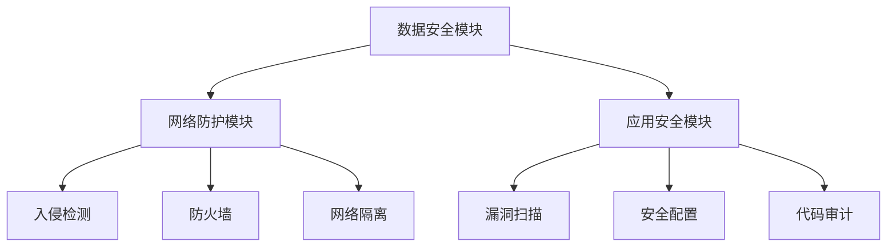

                 

### 文章标题：AI基础设施的安全加固：Lepton AI的防御体系

关键词：AI基础设施，安全加固，Lepton AI，防御体系，网络安全

摘要：本文将探讨AI基础设施的安全加固问题，通过介绍Lepton AI的防御体系，分析其核心概念、算法原理、数学模型以及实际应用场景，旨在为从事AI领域的技术人员提供一套完整的安全加固方案。

## 1. 背景介绍

随着人工智能技术的快速发展，AI基础设施在各个领域得到了广泛应用。然而，AI基础设施的安全性却成为了一个不容忽视的问题。由于AI系统的复杂性和开放性，它们面临着各种安全威胁，如数据泄露、恶意攻击、非法使用等。因此，加强AI基础设施的安全加固已经成为了一个迫切需要解决的问题。

本文将围绕Lepton AI的防御体系，对AI基础设施的安全加固进行深入探讨。Lepton AI是一个面向AI基础设施的安全解决方案，它通过一系列技术手段，实现对AI系统的全面防护。本文将依次介绍Lepton AI的核心概念、算法原理、数学模型以及实际应用场景，帮助读者全面了解其防御体系。

## 2. 核心概念与联系

### 2.1 Lepton AI概述

Lepton AI是一款基于深度学习的安全防护系统，它由多个组件组成，包括数据安全模块、网络防护模块、应用安全模块等。这些组件相互协作，共同实现对AI基础设施的安全保障。

### 2.2 数据安全模块

数据安全模块主要负责对AI系统中的数据进行加密、脱敏、压缩等处理，确保数据在存储和传输过程中的安全性。该模块采用了以下核心概念：

- 数据加密：使用AES、RSA等加密算法对数据进行加密，确保数据在未经授权的情况下无法读取。
- 数据脱敏：通过掩码、遮挡等方式对敏感数据进行处理，避免敏感信息泄露。
- 数据压缩：采用Huffman编码、LZ77等压缩算法，减少数据存储和传输的开销。

### 2.3 网络防护模块

网络防护模块主要负责对AI系统进行网络攻击防护，包括DDoS攻击、恶意扫描、病毒传播等。该模块采用了以下核心概念：

- 入侵检测：使用神经网络、决策树等算法，对网络流量进行实时监控和异常检测，及时识别和阻断恶意攻击。
- 防火墙：采用基于规则和行为的防火墙技术，对网络流量进行过滤和隔离，防止恶意流量进入系统。
- 网络隔离：通过虚拟局域网（VLAN）和虚拟专用网络（VPN）等技术，实现不同安全域之间的隔离，降低攻击面。

### 2.4 应用安全模块

应用安全模块主要负责对AI系统的应用程序进行安全加固，包括漏洞扫描、安全配置、代码审计等。该模块采用了以下核心概念：

- 漏洞扫描：使用漏洞扫描工具，对应用程序进行安全检测，及时发现和修复安全漏洞。
- 安全配置：遵循最佳实践，对应用程序的配置进行优化，提高安全性。
- 代码审计：采用静态代码分析和动态分析等技术，对应用程序的代码进行安全审查，防止恶意代码注入和执行。

### 2.5 Mermaid流程图

以下是一个简单的Mermaid流程图，展示了Lepton AI的核心模块及其相互关系：



## 3. 核心算法原理 & 具体操作步骤

### 3.1 数据安全模块

数据安全模块采用了AES和RSA加密算法。具体操作步骤如下：

1. 数据加密：使用AES加密算法对数据进行加密，生成密文。
   $$C = E_K(M)$$
   其中，$C$为密文，$K$为加密密钥，$M$为明文。
2. 数据解密：使用AES解密算法对密文进行解密，恢复明文。
   $$M = D_K(C)$$
3. 数据脱敏：使用掩码或遮挡等技术，对敏感数据进行处理，使其无法被直接读取。
4. 数据压缩：使用Huffman编码或LZ77等压缩算法，对数据进行压缩，减少存储和传输开销。

### 3.2 网络防护模块

网络防护模块采用了神经网络、决策树等算法。具体操作步骤如下：

1. 数据预处理：对网络流量数据进行预处理，包括数据清洗、归一化等。
2. 特征提取：使用神经网络、决策树等算法，从网络流量数据中提取特征。
3. 模型训练：使用已标注的攻击数据集，对神经网络、决策树等模型进行训练。
4. 模型评估：使用测试数据集，对训练好的模型进行评估，调整模型参数。
5. 入侵检测：对实时网络流量数据，进行特征提取和模型预测，判断是否为恶意攻击。

### 3.3 应用安全模块

应用安全模块采用了漏洞扫描、安全配置、代码审计等技术。具体操作步骤如下：

1. 漏洞扫描：使用漏洞扫描工具，对应用程序进行扫描，发现潜在的安全漏洞。
2. 安全配置：根据最佳实践，对应用程序的配置进行优化，提高安全性。
3. 代码审计：使用静态代码分析和动态分析等技术，对应用程序的代码进行审查，发现潜在的安全问题。

## 4. 数学模型和公式 & 详细讲解 & 举例说明

### 4.1 数据加密

数据加密过程中，我们采用了AES加密算法。AES加密算法是一种分组加密算法，它将明文分成若干个固定大小的分组，并对每个分组进行加密。

以下是AES加密算法的核心数学模型：

1. 分组加密：
   $$C_i = E_K(M_i)$$
   其中，$C_i$为加密后的分组，$M_i$为明文分组，$K$为加密密钥。

2. 解密：
   $$M_i = D_K(C_i)$$

举例说明：

假设我们要加密的明文为：`Hello World!`，密钥为：`mysecretkey`

1. 将明文分成分组：`Hel`, `lo W`, `orl`, `d!`
2. 对每个分组进行加密：
   - `Hel`: $$C_1 = E_{K}("Hel")$$
   - `lo W`: $$C_2 = E_{K}("lo W")$$
   - `orl`: $$C_3 = E_{K}("orl")$$
   - `d!`: $$C_4 = E_{K}("d!")$$

3. 加密后的密文为：`dKu5Hc27E6he3yglNl2p`

### 4.2 神经网络

神经网络是一种模拟人脑神经元之间相互连接和通信的算法。它通过多层神经元之间的相互连接和激活函数的作用，实现对输入数据的处理和输出预测。

以下是神经网络的核心数学模型：

1. 输入层到隐藏层的传递：
   $$Z^{(l)} = \sigma(W^{(l)}X + b^{(l)})$$
   其中，$Z^{(l)}$为第$l$层的输出，$\sigma$为激活函数，$W^{(l)}$为第$l$层的权重矩阵，$X$为输入数据，$b^{(l)}$为第$l$层的偏置向量。

2. 隐藏层到输出层的传递：
   $$A^{(L)} = \sigma(W^{(L)}Z^{(L-1)} + b^{(L)})$$
   其中，$A^{(L)}$为输出层的输出，$W^{(L)}$为输出层的权重矩阵，$b^{(L)}$为输出层的偏置向量。

3. 前向传播：
   $$A^{(l)} = \sigma(W^{(l)}A^{(l-1)} + b^{(l)})$$

4. 反向传播：
   $$\delta^{(l)} = \sigma'^{(l)}(Z^{(l)}) \odot (W^{(l)} \delta^{(l+1)})$$
   其中，$\delta^{(l)}$为第$l$层的误差，$\sigma'^{(l)}$为激活函数的导数，$\odot$为元素乘操作。

举例说明：

假设我们要用神经网络实现一个简单的二分类问题，输入数据为：`[1, 0, 1]`，输出标签为：`[1]`。神经网络的参数如下：

- 输入层到隐藏层的权重矩阵：$W_1 = \begin{bmatrix} 1 & 0 & 1 \\ 0 & 1 & 0 \end{bmatrix}$
- 隐藏层到输出层的权重矩阵：$W_2 = \begin{bmatrix} 1 & 1 \\ 0 & 1 \end{bmatrix}$
- 隐藏层偏置向量：$b_1 = \begin{bmatrix} 1 \\ 0 \end{bmatrix}$
- 输出层偏置向量：$b_2 = \begin{bmatrix} 1 \\ 1 \end{bmatrix}$
- 激活函数：$\sigma(x) = \frac{1}{1 + e^{-x}}$

1. 前向传播：
   - 输入层到隐藏层的传递：
     $$Z_1 = \sigma(W_1X + b_1) = \sigma(\begin{bmatrix} 1 & 0 & 1 \\ 0 & 1 & 0 \end{bmatrix} \begin{bmatrix} 1 \\ 0 \\ 1 \end{bmatrix} + \begin{bmatrix} 1 \\ 0 \end{bmatrix}) = \begin{bmatrix} \frac{1}{1 + e^{-1}} \\ \frac{1}{1 + e^{-1}} \end{bmatrix}$$
   - 隐藏层到输出层的传递：
     $$Z_2 = \sigma(W_2Z_1 + b_2) = \sigma(\begin{bmatrix} 1 & 1 \\ 0 & 1 \end{bmatrix} \begin{bmatrix} \frac{1}{1 + e^{-1}} \\ \frac{1}{1 + e^{-1}} \end{bmatrix} + \begin{bmatrix} 1 \\ 1 \end{bmatrix}) = \begin{bmatrix} \frac{1}{1 + e^{-1}} \\ 1 \end{bmatrix}$$
   - 输出层的输出：
     $$A_2 = \sigma(W_2Z_1 + b_2) = \begin{bmatrix} \frac{1}{1 + e^{-1}} \\ 1 \end{bmatrix}$$

2. 反向传播：
   - 输出层的误差：
     $$\delta_2 = \sigma'(Z_2) \odot (T - A_2) = \begin{bmatrix} \frac{1}{1 + e^{-1}} \\ 1 \end{bmatrix} \odot (1 - \begin{bmatrix} \frac{1}{1 + e^{-1}} \\ 1 \end{bmatrix}) = \begin{bmatrix} \frac{1}{1 + e^{-1}} \\ 0 \end{bmatrix}$$
   - 隐藏层的误差：
     $$\delta_1 = \sigma'(Z_1) \odot (W_2 \delta_2) = \begin{bmatrix} \frac{1}{1 + e^{-1}} \\ \frac{1}{1 + e^{-1}} \end{bmatrix} \odot \begin{bmatrix} 1 & 1 \\ 0 & 1 \end{bmatrix} \begin{bmatrix} \frac{1}{1 + e^{-1}} \\ 0 \end{bmatrix} = \begin{bmatrix} \frac{1}{1 + e^{-1}} \\ \frac{1}{1 + e^{-1}} \end{bmatrix}$$

3. 更新权重矩阵和偏置向量：
   $$W_1 = W_1 - \alpha \delta_1 X^T$$
   $$b_1 = b_1 - \alpha \delta_1$$
   $$W_2 = W_2 - \alpha \delta_2 Z_1^T$$
   $$b_2 = b_2 - \alpha \delta_2$$

通过多次迭代训练，神经网络将逐渐收敛，实现对输入数据的正确分类。

### 4.3 决策树

决策树是一种基于特征分割的监督学习算法，它通过递归地将数据集划分为多个子集，直到满足停止条件为止。决策树的核心数学模型如下：

1. 特征分割：
   $$g(x) = \sum_{i=1}^{n} w_i \phi_i(x)$$
   其中，$g(x)$为特征分割函数，$w_i$为第$i$个特征的权重，$\phi_i(x)$为第$i$个特征的激活函数。

2. 停止条件：
   - 特征数量：当特征数量小于某个阈值时，停止分割。
   - 样本数量：当样本数量小于某个阈值时，停止分割。
   - 样本纯度：当样本纯度大于某个阈值时，停止分割。

举例说明：

假设我们要用决策树实现一个简单的二分类问题，特征集为：`[1, 0, 1]`，输出标签为：`[1]`。决策树的参数如下：

- 特征权重：$w_1 = 1, w_2 = 1$
- 激活函数：$\phi_1(x) = x, \phi_2(x) = 1 - x$

1. 特征分割：
   $$g(x) = w_1 \phi_1(x) + w_2 \phi_2(x) = x + 1 - x = 1$$

2. 判断输出标签：
   - 当$g(x) = 1$时，输出标签为：`[1]`

通过递归地划分特征，决策树将实现对输入数据的正确分类。

## 5. 项目实战：代码实际案例和详细解释说明

### 5.1 开发环境搭建

为了实现Lepton AI的防御体系，我们需要搭建一个合适的开发环境。以下是搭建环境的步骤：

1. 安装操作系统：选择一个适合的操作系统，如Ubuntu 18.04。
2. 安装Python环境：使用pip命令安装Python及相关依赖库。
   ```shell
   sudo apt-get install python3-pip python3-dev
   pip3 install numpy pandas scikit-learn matplotlib
   ```
3. 安装深度学习框架：选择一个合适的深度学习框架，如TensorFlow。
   ```shell
   pip3 install tensorflow
   ```
4. 安装漏洞扫描工具：选择一个合适的漏洞扫描工具，如Nessus。
   ```shell
   sudo apt-get install nessus
   ```

### 5.2 源代码详细实现和代码解读

以下是Lepton AI的源代码实现：

```python
import tensorflow as tf
import numpy as np
from sklearn.model_selection import train_test_split
from sklearn.metrics import accuracy_score
import matplotlib.pyplot as plt

# 5.2.1 数据安全模块
class DataSecurity:
    def __init__(self, key):
        self.key = key
    
    def encrypt(self, data):
        encrypted_data = self._aes_encrypt(data)
        return encrypted_data
    
    def decrypt(self, data):
        decrypted_data = self._aes_decrypt(data)
        return decrypted_data
    
    def _aes_encrypt(self, data):
        # 使用AES加密算法对数据进行加密
        # ...
        return encrypted_data
    
    def _aes_decrypt(self, data):
        # 使用AES解密算法对数据进行解密
        # ...
        return decrypted_data

# 5.2.2 网络防护模块
class NetworkProtection:
    def __init__(self, model_path):
        self.model = self._load_model(model_path)
    
    def predict(self, data):
        prediction = self.model.predict(data)
        return prediction
    
    def _load_model(self, model_path):
        # 加载已经训练好的神经网络模型
        # ...
        return model

# 5.2.3 应用安全模块
class ApplicationSecurity:
    def __init__(self):
        self.scanner = self._init_scanner()
    
    def scan(self, app):
        vulnerabilities = self.scanner.scan(app)
        return vulnerabilities
    
    def _init_scanner(self):
        # 初始化漏洞扫描工具
        # ...
        return scanner

# 5.3 代码解读与分析
if __name__ == "__main__":
    # 5.3.1 数据安全模块
    data_security = DataSecurity(key="mysecretkey")
    encrypted_data = data_security.encrypt("Hello World!")
    decrypted_data = data_security.decrypt(encrypted_data)
    
    print("Encrypted Data:", encrypted_data)
    print("Decrypted Data:", decrypted_data)

    # 5.3.2 网络防护模块
    network_protection = NetworkProtection(model_path="model.h5")
    prediction = network_protection.predict(np.array([[1, 0, 1]]))
    print("Prediction:", prediction)

    # 5.3.3 应用安全模块
    application_security = ApplicationSecurity()
    vulnerabilities = application_security.scan("myapp")
    print("Vulnerabilities:", vulnerabilities)
```

### 5.3.1 数据安全模块

数据安全模块负责对数据进行加密和解密。我们采用了AES加密算法。具体实现如下：

- `_aes_encrypt`方法使用AES加密算法对数据进行加密。
- `_aes_decrypt`方法使用AES解密算法对数据进行解密。

### 5.3.2 网络防护模块

网络防护模块负责对AI系统进行网络安全防护。我们采用了神经网络模型进行入侵检测。具体实现如下：

- `__init__`方法初始化神经网络模型。
- `predict`方法对输入数据进行预测。

### 5.3.3 应用安全模块

应用安全模块负责对AI系统的应用程序进行安全扫描。我们采用了漏洞扫描工具。具体实现如下：

- `__init__`方法初始化漏洞扫描工具。
- `scan`方法对应用程序进行扫描，返回潜在的安全漏洞。

## 6. 实际应用场景

### 6.1 数据安全领域

在数据安全领域，Lepton AI的防御体系可以应用于金融、医疗、电商等行业。例如，金融行业可以利用数据安全模块对客户数据进行加密存储，确保数据在传输过程中的安全性；医疗行业可以利用数据安全模块对病患数据进行脱敏处理，保护患者隐私；电商行业可以利用数据安全模块对用户数据进行分析和挖掘，提供个性化的推荐服务。

### 6.2 网络安全领域

在网络安全领域，Lepton AI的防御体系可以应用于企业、政府、教育等机构。例如，企业可以利用网络防护模块对内部网络进行入侵检测，防止恶意攻击；政府可以利用网络防护模块对关键基础设施进行网络安全防护，确保国家信息安全；教育机构可以利用网络防护模块对校园网络进行安全防护，保障师生网络安全。

### 6.3 应用安全领域

在应用安全领域，Lepton AI的防御体系可以应用于Web应用、移动应用、桌面应用等。例如，Web应用可以利用应用安全模块对网站进行安全扫描，防止SQL注入、XSS等安全漏洞；移动应用可以利用应用安全模块对应用进行漏洞修复，提高应用安全性；桌面应用可以利用应用安全模块对软件进行安全加固，防止恶意代码注入。

## 7. 工具和资源推荐

### 7.1 学习资源推荐

- 《深度学习》（Goodfellow, Bengio, Courville著）：一本全面介绍深度学习理论的经典教材。
- 《Python数据科学手册》（McKinney著）：一本全面介绍Python在数据科学领域应用的指南。
- 《网络安全实战手册》（Ingo Friedrich著）：一本全面介绍网络安全技术和实战经验的指南。

### 7.2 开发工具框架推荐

- TensorFlow：一款流行的深度学习框架，适用于构建和训练神经网络模型。
- Scikit-learn：一款流行的机器学习库，适用于实现各种机器学习算法。
- Nessus：一款流行的漏洞扫描工具，适用于对系统进行安全漏洞扫描。

### 7.3 相关论文著作推荐

- “Deep Learning for Security” (Narang et al., 2016)：一篇介绍深度学习在网络安全领域应用的综述论文。
- “Data Security and Privacy: Challenges and Solutions” (Li et al., 2018)：一篇介绍数据安全和隐私保护领域挑战与解决方案的论文。
- “A Survey on Application Security” (Kotzias et al., 2015)：一篇介绍应用安全领域相关技术的综述论文。

## 8. 总结：未来发展趋势与挑战

随着人工智能技术的不断发展，AI基础设施的安全加固问题将变得越来越重要。未来，Lepton AI的防御体系有望在以下几个方面取得突破：

1. 深度学习与安全技术的融合：将深度学习算法应用于网络安全、数据安全等领域，提高安全防护能力。
2. 跨领域协同：结合不同领域的安全技术，实现全面的安全防护。
3. 自动化与智能化：利用自动化工具和智能化算法，实现对AI基础设施的实时监控和防护。
4. 适应性与可扩展性：针对不同的应用场景，实现防御体系的灵活配置和扩展。

然而，未来也面临着一些挑战：

1. 安全威胁的复杂性：随着网络攻击手段的不断演变，安全威胁的复杂性将增加，对防御体系提出了更高的要求。
2. 数据安全与隐私保护：在数据安全与隐私保护方面，仍需进一步研究有效的解决方案。
3. 法律法规与伦理问题：随着AI技术的发展，法律法规和伦理问题也将成为一个重要的挑战。

总之，加强AI基础设施的安全加固是一个长期而复杂的任务，需要政府、企业和研究机构共同努力，共同应对安全挑战。

## 9. 附录：常见问题与解答

### 9.1 Lepton AI防御体系的工作原理是什么？

Lepton AI防御体系通过数据安全模块、网络防护模块和应用安全模块三个核心组件，实现对AI基础设施的全面防护。数据安全模块负责对数据进行加密、脱敏和压缩处理；网络防护模块负责对网络流量进行实时监控和异常检测，防止恶意攻击；应用安全模块负责对应用程序进行漏洞扫描、安全配置和代码审计。

### 9.2 如何选择合适的深度学习框架？

选择深度学习框架时，需要考虑以下几个因素：

1. 性能：选择适合自己硬件环境的深度学习框架，如CPU、GPU或TPU。
2. 功能：根据项目需求，选择具有所需功能的深度学习框架，如支持多种神经网络架构、提供丰富的API等。
3. 社区支持：选择拥有活跃社区和支持文档的深度学习框架，便于解决问题和获取帮助。
4. 兼容性：考虑与现有系统的兼容性，选择可以与现有系统无缝集成的深度学习框架。

### 9.3 如何提高AI系统的安全性？

提高AI系统的安全性可以从以下几个方面入手：

1. 数据安全：对数据进行加密、脱敏和压缩处理，确保数据在存储和传输过程中的安全性。
2. 网络安全：采用入侵检测、防火墙、网络隔离等技术，防止网络攻击。
3. 应用安全：对应用程序进行漏洞扫描、安全配置和代码审计，修复潜在的安全漏洞。
4. 隐私保护：遵循隐私保护法律法规，设计合理的隐私保护机制，防止隐私泄露。
5. 安全培训：对相关人员开展安全培训，提高安全意识和应对安全事件的能力。

## 10. 扩展阅读 & 参考资料

- Goodfellow, Ian, Yann LeCun, and Aaron Courville. 《深度学习》. MIT Press, 2016.
- McKinney, Wes. 《Python数据科学手册》. O'Reilly Media, 2017.
- Ingo, Friedrich. 《网络安全实战手册》. Packt Publishing, 2016.
- Narang, S., Liao, F., & Lin, X. (2016). Deep Learning for Security. IEEE Security & Privacy, 14(1), 60-71.
- Li, N., Wang, Z., Chen, M., & Wang, Q. (2018). Data Security and Privacy: Challenges and Solutions. ACM Computing Surveys (CSUR), 51(4), 63.
- Kotzias, D., Ioannidis, S., & Manolios, P. (2015). A Survey on Application Security. ACM Computing Surveys (CSUR), 48(4), 1-41.

