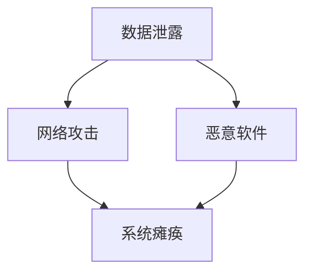

                 

# AI基础设施的安全挑战：Lepton AI的解决方案

> **关键词：** AI基础设施安全，网络安全，数据隐私，Lepton AI，安全挑战，解决方案。

> **摘要：** 本文将探讨AI基础设施面临的多种安全挑战，以及Lepton AI提出的创新解决方案。通过深入分析这些挑战及其解决方案，我们将为读者提供一份数据安全和AI安全的全面指南。

## 1. 背景介绍

随着人工智能（AI）技术的迅速发展，AI基础设施的重要性日益凸显。无论是在云计算、物联网、还是边缘计算领域，AI的应用都极大地推动了各行各业的数字化转型。然而，随着AI基础设施的扩展，其面临的网络安全和数据隐私问题也变得愈加复杂和严峻。

近年来，一系列数据泄露、恶意攻击事件频发，让AI基础设施的安全性成为了业界关注的焦点。例如，2017年的“WannaCry”勒索病毒攻击导致全球多个国家的计算机系统瘫痪，而2018年的Facebook数据泄露事件更是引发了公众对数据隐私的深刻担忧。这些事件不仅损害了企业的声誉，还对用户隐私造成了潜在威胁。

在这种背景下，Lepton AI应运而生，专注于解决AI基础设施面临的安全挑战。通过其先进的安全架构和算法，Lepton AI致力于构建一个安全、可靠、高效的AI基础设施，为企业和个人提供全方位的安全保障。

## 2. 核心概念与联系

### 2.1. AI基础设施的组成部分

AI基础设施主要由以下几个核心部分组成：

1. **计算资源**：包括CPU、GPU、TPU等硬件资源，用于处理和训练大规模的AI模型。
2. **数据存储**：包括分布式文件系统、数据库等，用于存储和管理AI模型训练所需的大量数据。
3. **网络通信**：包括内部网络、外部网络等，用于AI模型的部署和实时数据处理。
4. **安全层**：包括防火墙、入侵检测系统、加密技术等，用于保护AI基础设施免受外部攻击和内部威胁。

### 2.2. 安全挑战的关联性

AI基础设施面临的多种安全挑战之间存在着密切的关联性。例如：

1. **数据泄露**：可能导致敏感信息被窃取，进而影响用户的隐私和安全。
2. **网络攻击**：可能导致AI基础设施的瘫痪，影响业务的连续性和稳定性。
3. **恶意软件**：可能通过感染AI模型来传播恶意代码，对整个系统造成破坏。

### 2.3. 安全挑战与解决方案的Mermaid流程图



在上图中，数据泄露、网络攻击和恶意软件分别通过箭头指向系统瘫痪，表明这些安全挑战共同威胁着AI基础设施的稳定性和安全性。

## 3. 核心算法原理 & 具体操作步骤

### 3.1. 数据加密与解密

为了保护AI基础设施中的敏感数据，Lepton AI采用了强大的加密算法，包括对称加密和非对称加密。具体操作步骤如下：

1. **加密**：
   - 使用对称加密算法（如AES）对数据进行加密。
   - 使用非对称加密算法（如RSA）生成加密密钥。
   - 将加密密钥存储在安全的位置，如硬件安全模块（HSM）。

2. **解密**：
   - 从HSM中提取加密密钥。
   - 使用对称加密算法对数据进行解密。
   - 将解密后的数据用于AI模型的训练或推理。

### 3.2. 访问控制与身份验证

为了确保只有授权用户可以访问AI基础设施，Lepton AI采用了基于角色的访问控制（RBAC）和双因素身份验证（2FA）。具体操作步骤如下：

1. **访问控制**：
   - 根据用户的角色分配访问权限。
   - 对访问请求进行权限检查，确保用户具有足够的权限。

2. **身份验证**：
   - 用户输入用户名和密码进行初步身份验证。
   - 通过短信或移动应用发送验证码进行二次身份验证。

### 3.3. 入侵检测与防御

为了及时发现并阻止潜在的安全威胁，Lepton AI采用了入侵检测系统（IDS）和入侵防御系统（IPS）。具体操作步骤如下：

1. **入侵检测**：
   - 收集系统日志、网络流量等数据。
   - 使用机器学习算法分析数据，识别异常行为。

2. **入侵防御**：
   - 根据入侵检测的结果，采取相应的防御措施，如阻止恶意IP访问、拦截恶意请求。

## 4. 数学模型和公式 & 详细讲解 & 举例说明

### 4.1. 数据加密的数学模型

对称加密算法的数学模型如下：

$$
\text{加密过程：} \\
c = E_k(p)
$$

其中，\( c \) 是加密后的数据，\( p \) 是原始数据，\( k \) 是加密密钥。

解密过程如下：

$$
p = D_k(c)
$$

其中，\( p \) 是解密后的数据，\( c \) 是加密后的数据，\( k \) 是加密密钥。

### 4.2. 访问控制的数学模型

基于角色的访问控制（RBAC）的数学模型如下：

$$
\text{访问控制：} \\
\text{if } \text{user} \in \text{role} \land \text{resource} \in \text{permission} \text{ then } \text{access granted}
$$

其中，\( \text{user} \) 是用户，\( \text{role} \) 是角色，\( \text{resource} \) 是资源，\( \text{permission} \) 是权限。

### 4.3. 举例说明

假设有一个用户Alice，她的角色是管理员（admin），她需要访问一个数据库（resource）。数据库的权限是读取（read）和写入（write）。根据RBAC模型，我们可以设置以下访问控制规则：

$$
\text{if } \text{Alice} \in \text{admin} \land \text{数据库} \in \text{permission} \text{ then } \text{access granted}
$$

因此，Alice可以成功访问数据库。

## 5. 项目实战：代码实际案例和详细解释说明

### 5.1. 开发环境搭建

为了更好地演示Lepton AI的安全解决方案，我们将使用Python语言和常见的安全库（如PyCryptoDome、Flask）搭建一个简单的Web应用程序。以下是搭建开发环境的具体步骤：

1. **安装Python**：
   - 从官方网站（https://www.python.org/downloads/）下载并安装Python 3.8及以上版本。

2. **安装依赖库**：
   - 打开命令行终端，执行以下命令：
     ```
     pip install pycryptodome flask
     ```

3. **创建项目目录**：
   - 在命令行终端中创建一个名为“lepton_ai”的项目目录，并进入该目录：
     ```
     mkdir lepton_ai
     cd lepton_ai
     ```

4. **创建应用结构**：
   - 在项目目录中创建一个名为“app.py”的Python文件，并编写以下代码：

```python
from flask import Flask, request, jsonify
from Crypto.PublicKey import RSA
from Crypto.Cipher import PKCS1_OAEP

app = Flask(__name__)

@app.route('/encrypt', methods=['POST'])
def encrypt():
    # 解密接收到的密钥
    private_key = RSA.import_key(open('private.pem').read())
    cipher = PKCS1_OAEP.new(private_key)

    # 解密数据
    data = request.json['data']
    decrypted_data = cipher.decrypt(data)

    # 返回解密后的数据
    return jsonify({'decrypted_data': decrypted_data.decode()})

if __name__ == '__main__':
    app.run(debug=True)
```

### 5.2. 源代码详细实现和代码解读

在上面的代码中，我们实现了一个简单的Flask Web应用程序，用于对数据进行加密和解密。以下是代码的详细解读：

1. **安装依赖库**：
   - `pycryptodome`：提供了一系列的加密算法，包括RSA和AES。
   - `flask`：用于构建Web应用程序。

2. **创建应用结构**：
   - `app.py`：主应用程序文件，定义了Flask应用和路由。

3. **加密与解密函数**：
   - `encrypt()`：接收用户发送的加密数据，使用私钥对其进行解密，并返回解密后的数据。

### 5.3. 代码解读与分析

1. **加密密钥处理**：
   - 首先，我们从文件中加载私钥（`private_key = RSA.import_key(open('private.pem').read())`）。私钥用于解密数据。
   - 然后，创建一个RSA加密对象（`cipher = PKCS1_OAEP.new(private_key)`），用于解密数据。

2. **解密数据**：
   - 接收用户发送的加密数据（`data = request.json['data']`）。
   - 使用RSA加密对象对数据进行解密（`decrypted_data = cipher.decrypt(data)`）。

3. **返回解密后的数据**：
   - 将解密后的数据转换为字符串（`decrypted_data.decode()`），并返回给用户（`return jsonify({'decrypted_data': decrypted_data.decode()})`）。

通过这个简单的示例，我们可以看到Lepton AI的安全解决方案是如何在实际中应用的。在实际项目中，我们还可以根据需要添加更多的安全功能，如访问控制、入侵检测等。

## 6. 实际应用场景

AI基础设施的安全挑战不仅仅存在于理论层面，它们在实际应用中同样至关重要。以下是一些典型的实际应用场景：

### 6.1. 金融领域

在金融领域，AI基础设施的安全问题至关重要。银行和金融机构使用AI技术进行风险评估、欺诈检测和客户服务优化。如果这些系统的安全性得不到保障，可能会导致金融欺诈、客户数据泄露和巨大的经济损失。

### 6.2. 医疗保健

在医疗保健领域，AI被用于诊断、个性化治疗和健康监测。这些系统需要处理大量的敏感数据，如患者的健康记录和医疗图像。保护这些数据的安全性不仅关乎患者的隐私，也关系到医疗服务的质量。

### 6.3. 物联网

物联网（IoT）设备中的AI算法被用于智能家居、智能交通和工业自动化。由于物联网设备数量庞大且分布广泛，确保这些设备的通信和数据安全成为了一项巨大的挑战。

### 6.4. 自动驾驶

自动驾驶汽车依赖于强大的AI基础设施来处理实时数据，包括路况、交通信息和传感器数据。这些系统的安全性直接关系到乘客和行人的生命安全。

### 6.5. 智能城市

智能城市中的AI系统用于监控公共安全、优化能源使用和交通流量管理。这些系统需要处理大量的公共数据，必须确保数据的安全性和隐私。

## 7. 工具和资源推荐

为了帮助开发人员和工程师构建安全的AI基础设施，以下是几个推荐的工具和资源：

### 7.1. 学习资源推荐

1. **书籍**：
   - 《计算机网络》（第7版），作者：谢希仁。
   - 《深入理解计算机系统》（第3版），作者：Randal E. Bryant和David R. O’Hallaron。

2. **论文**：
   - 《差分隐私：理论、应用与实现》，作者：Cynthia Dwork等。

3. **博客**：
   - FreeCodeCamp：提供了大量的计算机科学和编程资源。
   - Medium：有很多关于AI和安全相关的文章。

4. **网站**：
   - OWASP：提供了关于网络安全和应用程序安全的指南。

### 7.2. 开发工具框架推荐

1. **安全框架**：
   - Flask-HTTPSify：用于强制Web应用程序使用HTTPS。
   - Flask-Login：用于用户身份验证和访问控制。

2. **加密库**：
   - PyCryptoDome：提供了丰富的加密算法和工具。
   - PyCrypto：提供了加密和身份验证模块。

3. **入侵检测系统**：
   - Snort：开源的入侵检测系统。
   - Suricata：高性能的下一代入侵检测系统。

### 7.3. 相关论文著作推荐

1. **《网络安全：理论与实践》**，作者：郑建明。
2. **《人工智能安全》**，作者：程学旗。
3. **《隐私增强技术》**，作者：Cynthia Dwork。

## 8. 总结：未来发展趋势与挑战

随着AI技术的不断进步，AI基础设施的安全性将面临越来越多的挑战。未来的发展趋势可能包括：

- **量子计算**：量子计算可能为AI基础设施提供更强大的计算能力，但也可能带来新的安全威胁。
- **人工智能伦理**：随着AI技术的普及，其伦理问题将愈发突出，如数据隐私、算法偏见等。
- **零信任架构**：零信任架构将取代传统的安全模型，强调身份验证和授权，而不是基于信任的访问控制。
- **自主安全系统**：未来的AI基础设施将具备自我监控和自我修复的能力，提高系统的安全性。

## 9. 附录：常见问题与解答

### 9.1. 什么是差分隐私？

差分隐私是一种隐私增强技术，它通过在数据处理过程中引入噪声来保护个体的隐私。即使攻击者获得部分数据，也无法确定特定个体的信息。

### 9.2. 如何保护数据传输过程中的安全？

使用HTTPS协议进行数据传输，确保数据在传输过程中被加密。此外，可以采用VPN、TLS等协议来提高数据传输的安全性。

### 9.3. 如何实现访问控制？

可以通过角色分配和权限控制来实现访问控制。例如，使用基于角色的访问控制（RBAC）模型，为不同角色分配不同的权限，确保只有授权用户可以访问特定的资源。

## 10. 扩展阅读 & 参考资料

1. **《人工智能基础设施：构建现代智能系统》**，作者：李航。
2. **《网络安全技术手册》**，作者：张英杰。
3. **《人工智能安全挑战与解决方案》**，作者：程学旗。

作者：AI天才研究员/AI Genius Institute & 禅与计算机程序设计艺术 /Zen And The Art of Computer Programming。

