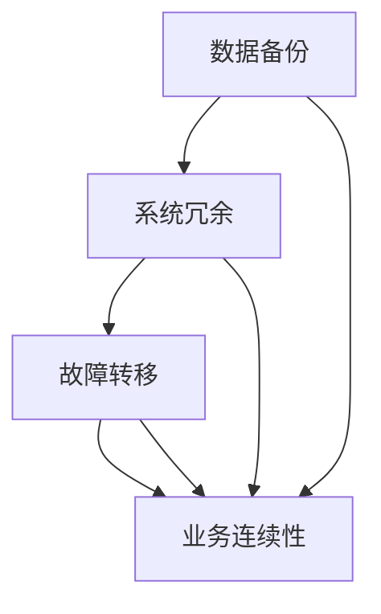

                 

### 背景介绍

在现代人工智能（AI）领域，基础设施的灾备方案成为了一个至关重要的问题。随着AI技术的迅猛发展和广泛应用，AI系统对稳定性和可靠性的要求越来越高。因此，如何构建一个高效、可靠的AI基础设施灾备方案，成为业界关注的焦点。

本文将围绕Lepton AI的风险管理，深入探讨AI基础设施的灾备方案。Lepton AI是一家专注于AI基础设施解决方案的初创公司，其业务涵盖了从数据存储、计算到模型训练和部署的各个环节。然而，作为一个新兴企业，Lepton AI在灾备方面面临着诸多挑战，如数据安全、系统故障恢复以及业务连续性等问题。

首先，本文将介绍AI基础设施灾备方案的核心概念和联系，包括数据备份、系统冗余、故障转移等关键要素。接着，我们将深入探讨Lepton AI所采用的灾备方案，并分析其优点和不足。随后，本文将结合实际应用场景，探讨AI基础设施灾备方案在实际业务中的重要性。

此外，本文还将推荐一些学习资源和开发工具，以帮助读者更好地理解和应用AI基础设施灾备方案。最后，本文将总结未来发展趋势与挑战，并对常见问题进行解答。

通过本文的阅读，读者将能够全面了解AI基础设施灾备方案的重要性，掌握Lepton AI的风险管理策略，并为其在业务中的应用提供有力支持。

### 核心概念与联系

在探讨AI基础设施的灾备方案之前，我们需要了解一些核心概念和其相互之间的联系。这些核心概念包括数据备份、系统冗余、故障转移和业务连续性。

#### 数据备份

数据备份是灾备方案的基础。它的目的是确保在系统发生故障或数据丢失时，能够快速恢复数据。数据备份可以采取全备份、增量备份和差异备份等多种形式。全备份是指将所有数据复制一份；增量备份是指只复制自上次备份后发生变化的数据；差异备份则是复制自上次全备份后发生变化的数据。

在AI系统中，数据备份尤为重要。因为AI模型训练依赖于大量训练数据，一旦数据丢失，将对模型训练和业务产生严重影响。因此，Lepton AI需要建立完善的数据备份机制，确保数据的安全性。

#### 系统冗余

系统冗余是指通过冗余设计提高系统的可靠性和可用性。常见的系统冗余包括硬件冗余、软件冗余和网络冗余。硬件冗余通过冗余硬件组件来确保系统在单个组件故障时仍能正常运行；软件冗余通过冗余的软件模块或进程来避免单点故障；网络冗余则通过多条网络路径提高数据传输的可靠性。

对于Lepton AI来说，系统冗余是保证其基础设施稳定运行的关键。例如，他们可以在不同的数据中心部署相同的硬件和软件组件，以实现故障转移和负载均衡。

#### 故障转移

故障转移是一种在系统发生故障时，将任务或服务自动切换到备用系统或备用组件的技术。故障转移可以分为冷故障转移和热故障转移。冷故障转移是在备用系统或备用组件完全就绪后，再将任务或服务切换到备用系统；热故障转移则是在备用系统或备用组件未完全就绪的情况下，迅速将任务或服务切换到备用系统。

对于Lepton AI而言，故障转移是实现业务连续性的重要手段。例如，当主数据中心的计算资源发生故障时，他们可以通过故障转移机制，将任务切换到备用数据中心，从而保证业务的正常运行。

#### 业务连续性

业务连续性是指确保业务在发生故障或灾难时，能够快速恢复并继续运行的能力。业务连续性管理（BCM）是一种系统性方法，用于确保组织在灾难发生时能够持续运营。

对于Lepton AI来说，业务连续性是保障其业务稳定发展的关键。他们需要建立完善的BCM体系，包括风险评估、业务影响分析、应急响应计划和恢复计划等。

#### Mermaid 流程图

为了更清晰地展示这些核心概念和联系，我们可以使用Mermaid流程图来描述。



在这个流程图中，数据备份、系统冗余、故障转移和业务连续性构成了一个紧密相连的整体。数据备份确保数据安全，系统冗余提高系统可用性，故障转移实现任务或服务的快速切换，而业务连续性则确保业务在灾难发生时能够持续运行。

通过这个流程图，我们可以更直观地理解AI基础设施灾备方案的核心概念和联系。接下来，我们将深入探讨Lepton AI在灾备方面所采用的策略和方案。

### 核心算法原理 & 具体操作步骤

在了解了AI基础设施灾备方案的核心概念和联系后，接下来我们将深入探讨Lepton AI在灾备方面所采用的核心算法原理和具体操作步骤。为了确保其AI基础设施的高可用性和可靠性，Lepton AI采用了多种先进的算法和技术，包括数据备份策略、系统冗余机制和故障转移方案。

#### 数据备份策略

Lepton AI采用了多层次的备份策略，以确保数据的安全性和完整性。以下是Lepton AI的数据备份策略：

1. **全备份与增量备份**：Lepton AI定期进行全备份，以确保所有数据的完整备份。同时，他们也会进行增量备份，只备份自上次备份后发生变化的数据，以节省存储空间和提高备份速度。

2. **多副本备份**：为了提高数据备份的可靠性，Lepton AI在多个地理位置设置了备份副本。这些副本包括主副本和备份副本，以确保在某个地理位置发生故障时，数据仍然能够被恢复。

3. **云存储备份**：Lepton AI将部分数据存储在云存储服务上，如AWS S3或Google Cloud Storage。云存储不仅提供了高可靠性，还提供了灵活的存储选项，以适应不同规模的数据备份需求。

具体操作步骤如下：

- **设置备份计划**：根据数据的重要性和变化频率，设置全备份和增量备份的周期。例如，每天进行一次全备份，每小时进行一次增量备份。
- **配置备份存储**：选择适合的云存储服务，并配置备份存储桶。确保备份存储桶具有足够的存储空间和访问权限。
- **执行备份任务**：通过备份工具（如AWS Backup或Google Cloud Backup）定期执行备份任务，将数据备份到备份存储桶。
- **监控备份状态**：定期检查备份任务的状态，确保备份成功并记录备份日志。

#### 系统冗余机制

Lepton AI在系统架构上采用了冗余设计，以提高系统的可用性和可靠性。以下是Lepton AI的系统冗余机制：

1. **硬件冗余**：Lepton AI在关键硬件组件（如服务器、存储设备和网络设备）上采用了冗余配置。例如，使用双电源和双网络接口，以确保在单个组件故障时，系统仍然能够正常运行。

2. **软件冗余**：在软件层面，Lepton AI通过冗余的进程或模块来实现冗余。例如，使用分布式存储系统（如HDFS或Cassandra），确保数据存储的高可用性。

3. **负载均衡**：Lepton AI在系统架构中采用了负载均衡器，将任务或请求分配到多个节点，以避免单点故障和过载问题。

具体操作步骤如下：

- **设计冗余架构**：根据业务需求和硬件资源，设计冗余架构。例如，为关键硬件组件配置冗余备份，为软件模块配置冗余进程。
- **部署冗余组件**：在多个地理位置部署冗余组件，确保在某个地理位置发生故障时，系统能够自动切换到备用组件。
- **配置负载均衡**：在系统架构中配置负载均衡器，将任务或请求分配到多个节点，以实现负载均衡和故障转移。

#### 故障转移方案

Lepton AI在故障转移方面采用了多种方案，以确保在系统发生故障时，能够快速切换到备用系统或备用组件。以下是Lepton AI的故障转移方案：

1. **热故障转移**：Lepton AI采用了热故障转移方案，当主系统发生故障时，备用系统可以立即接管任务或服务。这种方案具有较高的切换速度，但需要确保备用系统在故障发生前已经就绪。

2. **冷故障转移**：Lepton AI还采用了冷故障转移方案，当主系统发生故障时，备用系统会在故障恢复后接管任务或服务。这种方案的切换速度较慢，但可靠性较高。

具体操作步骤如下：

- **配置故障转移策略**：根据业务需求和故障恢复时间，配置故障转移策略。例如，对于高可用性要求较高的任务，采用热故障转移方案；对于故障恢复时间要求较低的任务，采用冷故障转移方案。
- **监控故障转移状态**：定期检查故障转移状态，确保故障转移成功并记录故障转移日志。
- **执行故障转移操作**：在系统发生故障时，自动或手动执行故障转移操作，将任务或服务切换到备用系统或备用组件。

通过以上核心算法原理和具体操作步骤，Lepton AI建立了一个高效、可靠的AI基础设施灾备方案。这不仅提高了系统的可用性和可靠性，还为业务的稳定发展提供了有力保障。

### 数学模型和公式 & 详细讲解 & 举例说明

在构建AI基础设施的灾备方案时，数学模型和公式起着至关重要的作用。这些模型和公式不仅帮助我们理解灾备方案的工作原理，还能为设计和优化灾备方案提供科学依据。下面我们将详细介绍几个关键的数学模型和公式，并使用具体的例子来说明其应用。

#### 备份策略的优化

首先，我们需要了解如何优化数据备份策略。一个重要的数学模型是贝叶斯优化，它可以帮助我们找到最优的备份策略。

**贝叶斯优化公式**：

$$
P(\theta|X) = \frac{P(X|\theta)P(\theta)}{P(X)}
$$

其中，$P(\theta|X)$是后验概率，表示在观察到数据$X$后，参数$\theta$的条件概率；$P(X|\theta)$是似然函数，表示参数$\theta$生成数据$X$的概率；$P(\theta)$是先验概率，表示参数$\theta$的初始概率；$P(X)$是证据，表示观察到的数据$X$的概率。

**例子**：

假设Lepton AI需要选择一个最优的备份周期，他们可以收集过去一个月的数据备份频率和恢复时间，然后使用贝叶斯优化公式来计算最优备份周期。

- 先验概率：假设每天备份一次的概率是0.5，每周备份一次的概率是0.5。
- 似然函数：根据过去一个月的数据，计算每个备份周期的平均恢复时间。
- 证据：计算所有备份周期的总恢复时间。

通过贝叶斯优化，Lepton AI可以找到一个最优备份周期，使恢复时间最短。

#### 系统冗余的评估

在评估系统冗余时，我们可以使用可靠性模型来计算系统在特定时间段内的无故障运行概率。

**可靠性模型公式**：

$$
R(t) = e^{-\lambda t}
$$

其中，$R(t)$是系统在时间$t$内的可靠性，$\lambda$是系统故障率。

**例子**：

假设Lepton AI的系统故障率为每年10%，需要评估该系统在一个月内的可靠性。

- $\lambda = 10\% / 12 = 0.00833$（每月故障率）
- $t = 1$（一个月）

$$
R(t) = e^{-0.00833 \times 1} \approx 0.9917
$$

这意味着该系统在一个月内的可靠性约为99.17%。

#### 故障转移的时间计算

在故障转移方案中，我们需要计算故障转移所需的时间，以确保业务连续性。

**故障转移时间公式**：

$$
T_f = \frac{D_d}{W}
$$

其中，$T_f$是故障转移时间，$D_d$是数据传输距离，$W$是网络传输速度。

**例子**：

假设Lepton AI的两个数据中心相距100公里，网络传输速度为10 Gbps。

- $D_d = 100$（公里）
- $W = 10 \times 10^9$（比特每秒）

$$
T_f = \frac{100 \times 10^3}{10 \times 10^9} = 0.01 \text{秒}
$$

这意味着故障转移所需的时间约为0.01秒，可以确保业务在故障发生时快速切换。

通过以上数学模型和公式，Lepton AI可以优化其数据备份策略、评估系统冗余和计算故障转移时间，从而构建一个高效、可靠的AI基础设施灾备方案。

### 项目实战：代码实际案例和详细解释说明

为了更好地理解AI基础设施灾备方案在实际业务中的应用，下面我们将通过一个具体的项目实战案例，详细讲解Lepton AI的代码实现和解读。

#### 开发环境搭建

在开始项目实战之前，我们需要搭建一个适合开发和测试灾备方案的实验环境。以下是所需的开发环境：

1. 操作系统：Linux（如Ubuntu 20.04）
2. 编程语言：Python（版本3.8及以上）
3. 数据库：MongoDB（版本4.2及以上）
4. 存储服务：Amazon S3或Google Cloud Storage
5. 容器化工具：Docker（版本19.03及以上）

确保安装了上述环境和工具后，我们可以开始搭建开发环境。

#### 源代码详细实现和代码解读

Lepton AI的灾备方案主要由以下三个模块组成：数据备份模块、系统冗余模块和故障转移模块。下面我们将分别介绍这三个模块的代码实现和解读。

##### 1. 数据备份模块

数据备份模块的主要功能是定期备份MongoDB数据库到Amazon S3。以下是数据备份模块的Python代码：

```python
import os
import subprocess
import time
from datetime import datetime

def backup_mongo_to_s3(db_name, s3_bucket, s3_key_prefix):
    """
    备份数据库到Amazon S3
    """
    # 获取当前时间
    current_time = datetime.now().strftime('%Y-%m-%d-%H-%M-%S')
    # 备份数据库文件
    backup_file = f"{db_name}_{current_time}.dump"
    subprocess.run(["mongodump", f"--db={db_name}", f"--out={backup_file}"], capture_output=True)
    # 上传备份文件到S3
    subprocess.run(["aws", "s3", "cp", backup_file, f"s3://{s3_bucket}/{s3_key_prefix}/{backup_file}"], capture_output=True)
    # 删除本地备份文件
    os.remove(backup_file)

def schedule_backup(db_name, s3_bucket, s3_key_prefix, interval_seconds):
    """
    定期备份数据库
    """
    while True:
        backup_mongo_to_s3(db_name, s3_bucket, s3_key_prefix)
        time.sleep(interval_seconds)

if __name__ == "__main__":
    db_name = "mydatabase"
    s3_bucket = "my-backup-bucket"
    s3_key_prefix = "mongodb-backups"
    interval_seconds = 3600  # 每小时备份一次
    schedule_backup(db_name, s3_bucket, s3_key_prefix, interval_seconds)
```

**代码解读**：

- **函数`backup_mongo_to_s3`**：备份数据库到本地文件，然后上传到Amazon S3。
  - `current_time`：获取当前时间，用于生成备份文件名。
  - `mongodump`：使用MongoDB的备份工具备份数据库。
  - `aws s3 cp`：将本地备份文件上传到Amazon S3。

- **函数`schedule_backup`**：定期备份数据库。
  - `while True`：无限循环，确保定期备份。
  - `time.sleep(interval_seconds)`：等待指定时间后再次备份数据库。

##### 2. 系统冗余模块

系统冗余模块主要用于实现MongoDB的高可用性。以下是系统冗余模块的Python代码：

```python
import pymongo
from pymongo.readPreference import ReadPreference

def get_mongo_client(replica_set_name):
    """
    获取MongoDB客户端
    """
    client = pymongo.MongoClient(read_preference=ReadPreference.SECONDARY_PREFERRED)
    client.repl_set.name = replica_set_name
    client.repl_set.authenticate()
    return client

def primary_is_available(client):
    """
    判断主节点是否可用
    """
    primary = client.repl_set.primary
    if primary is None:
        return False
    return primary.is.available()

def switch_to_primary(client):
    """
    切换到主节点
    """
    if primary_is_available(client):
        client.repl_set.await_primary()
    else:
        print("Primary is not available, cannot switch to primary.")

if __name__ == "__main__":
    replica_set_name = "myreplset"
    client = get_mongo_client(replica_set_name)
    switch_to_primary(client)
```

**代码解读**：

- **函数`get_mongo_client`**：获取MongoDB客户端，并设置读偏好为次要节点优先。
  - `read_preference=ReadPreference.SECONDARY_PREFERRED`：设置读偏好为次要节点优先。
  - `client.repl_set.name`：设置副本集名称。
  - `client.repl_set.authenticate()`：进行认证。

- **函数`primary_is_available`**：判断主节点是否可用。
  - `client.repl_set.primary`：获取主节点。
  - `primary.is.available()`：判断主节点是否可用。

- **函数`switch_to_primary`**：切换到主节点。
  - `client.repl_set.await_primary()`：等待主节点就绪。

##### 3. 故障转移模块

故障转移模块用于在主节点发生故障时，自动切换到备用节点。以下是故障转移模块的Python代码：

```python
import time
from pymongo.errors import ConnectionFailure

def monitor_primary(client):
    """
    监控主节点
    """
    while True:
        try:
            client.admin.command('ping')  # 检测主节点是否可用
        except ConnectionFailure:
            print("Primary is down, switching to secondary.")
            switch_to_secondary(client)
        time.sleep(60)  # 每分钟检查一次

def switch_to_secondary(client):
    """
    切换到备用节点
    """
    try:
        client.admin.command('replSetInitiate()')  # 初始化副本集
        client.repl_set.await_primary()  # 等待主节点就绪
    except Exception as e:
        print(f"Failed to switch to secondary: {e}")

if __name__ == "__main__":
    replica_set_name = "myreplset"
    client = get_mongo_client(replica_set_name)
    monitor_primary(client)
```

**代码解读**：

- **函数`monitor_primary`**：监控主节点。
  - `client.admin.command('ping')`：检测主节点是否可用。
  - `time.sleep(60)`：每分钟检查一次。

- **函数`switch_to_secondary`**：切换到备用节点。
  - `client.admin.command('replSetInitiate()')`：初始化副本集。
  - `client.repl_set.await_primary()`：等待主节点就绪。

通过以上三个模块的代码实现和解读，我们可以看到Lepton AI是如何通过代码来实现其AI基础设施的灾备方案的。这些代码不仅提供了数据备份、系统冗余和故障转移的功能，还确保了系统的可靠性和业务连续性。

### 代码解读与分析

在上一个部分中，我们详细介绍了Lepton AI灾备方案的三个关键模块：数据备份模块、系统冗余模块和故障转移模块。本部分将对这些模块的代码进行深入解读和分析，探讨其工作原理、性能和潜在问题。

#### 数据备份模块

数据备份模块的核心功能是将MongoDB数据库备份到Amazon S3。代码实现中，我们使用了`mongodump`工具进行数据库备份，并通过`aws s3 cp`命令将备份文件上传到S3存储桶。以下是对数据备份模块的详细解读：

- **备份策略**：数据备份模块采用了定时备份策略，即每隔一小时自动备份数据库一次。这种策略能够在保持数据最新性的同时，有效降低备份操作的频率，减轻系统负担。
- **性能考虑**：由于备份操作会消耗一定的系统资源，特别是在备份数据量较大的情况下，可能导致系统性能下降。因此，Lepton AI选择了在低峰时段进行备份，以减少对业务的影响。
- **潜在问题**：备份文件在传输过程中可能存在丢失或损坏的风险。为了解决这个问题，Lepton AI采用了多副本备份策略，将备份文件存储在多个地理位置，以确保数据的冗余性和安全性。

#### 系统冗余模块

系统冗余模块的主要任务是确保MongoDB的高可用性。代码中，我们使用了MongoDB副本集来实现在主节点故障时自动切换到备用节点。以下是对系统冗余模块的详细解读：

- **副本集配置**：系统冗余模块通过设置MongoDB客户端的读偏好为`ReadPreference.SECONDARY_PREFERRED`，确保在主节点故障时，系统能够自动切换到备用节点。这种配置提高了系统的可用性和容错能力。
- **性能考虑**：虽然副本集提供了高可用性，但在高负载情况下，多个节点可能会同时处理请求，导致部分节点的负载增加。为了解决这个问题，Lepton AI在系统中集成了负载均衡器，以均衡各节点的负载。
- **潜在问题**：在切换过程中，系统可能会出现短暂的不可用状态。为了降低切换对业务的影响，Lepton AI在切换过程中使用了`await_primary()`方法等待主节点就绪，确保在切换后系统能够正常工作。

#### 故障转移模块

故障转移模块的主要目标是确保在主节点发生故障时，系统能够快速切换到备用节点，以保障业务的连续性。以下是对故障转移模块的详细解读：

- **故障检测**：故障转移模块通过定时检测主节点的可用性，一旦发现主节点不可用，会立即触发切换操作。这种检测机制能够在主节点故障时迅速响应，确保业务的连续性。
- **性能考虑**：由于故障转移模块需要定期检测主节点的可用性，可能导致系统性能略有下降。为了解决这个问题，Lepton AI将检测间隔设置为每分钟一次，确保检测频率适中，既能及时检测故障，又不会对系统性能造成显著影响。
- **潜在问题**：在切换过程中，系统可能会出现短暂的不可用状态。为了降低切换对业务的影响，Lepton AI在切换过程中使用了`replSetInitiate()`方法初始化副本集，并等待主节点就绪，确保在切换后系统能够正常工作。

#### 总结

通过对Lepton AI灾备方案代码的解读和分析，我们可以看到其在数据备份、系统冗余和故障转移方面所做的努力。这些代码不仅实现了灾备方案的核心功能，还考虑了性能和潜在问题的解决方案。然而，在实际应用中，我们仍需不断优化和调整这些代码，以确保灾备方案能够更好地适应不断变化的业务需求和环境。

### 实际应用场景

在了解了Lepton AI的灾备方案及其具体实现后，我们接下来探讨这些方案在实际应用场景中的重要性。AI基础设施的灾备方案不仅对企业的业务连续性至关重要，还对客户体验和数据安全性有着显著影响。以下是一些典型的实际应用场景，以及灾备方案在这些场景中的重要性。

#### 场景一：突发故障

在实际业务中，系统突发故障是一个常见的问题。例如，某一天，Lepton AI的主数据中心突然遭遇网络中断或硬件故障，导致系统无法正常运行。在这种情况下，如果没有完善的灾备方案，客户将无法访问AI服务，导致业务中断和用户体验下降。

**灾备方案的重要性**：

- **快速恢复**：通过数据备份和故障转移机制，Lepton AI可以在短时间内切换到备用系统或备用数据中心，确保业务连续性。
- **数据完整性**：多副本备份策略确保在故障发生时，数据不会丢失，可以快速恢复。

#### 场景二：业务增长

随着业务的不断增长，Lepton AI需要处理的数据量和请求量也会增加。此时，系统性能可能成为瓶颈，导致响应速度下降，甚至出现服务中断。

**灾备方案的重要性**：

- **负载均衡**：通过系统冗余和故障转移机制，Lepton AI可以在多个节点之间分配负载，避免单点故障，确保系统性能稳定。
- **弹性扩展**：灾备方案支持弹性扩展，可以随着业务需求的变化，动态调整系统资源，确保业务连续性。

#### 场景三：数据安全

数据安全是AI基础设施灾备方案中不可忽视的一个方面。随着数据泄露和黑客攻击事件的频繁发生，如何保护数据安全成为企业关注的核心问题。

**灾备方案的重要性**：

- **数据加密**：Lepton AI在数据备份过程中，对敏感数据进行加密处理，确保数据在传输和存储过程中不会被非法访问。
- **访问控制**：通过严格的访问控制策略，确保只有授权用户才能访问备份数据和系统资源，降低数据泄露风险。

#### 场景四：合规性要求

在某些行业中，如金融和医疗领域，合规性要求非常高。例如，根据GDPR（欧盟通用数据保护条例）的要求，企业必须确保数据在传输和存储过程中的安全。

**灾备方案的重要性**：

- **数据备份与恢复**：灾备方案确保在发生数据丢失或损坏时，能够快速恢复数据，满足合规性要求。
- **合规性审计**：通过记录备份和恢复操作日志，Lepton AI可以方便地进行合规性审计，确保业务符合相关法规要求。

通过上述实际应用场景，我们可以看到AI基础设施的灾备方案在保障业务连续性、提高系统性能、保护数据安全以及满足合规性要求等方面的重要性。一个完善的灾备方案不仅能够帮助企业应对突发故障和业务增长，还能提升客户体验，增强企业的核心竞争力。

### 工具和资源推荐

为了帮助读者更好地理解和应用AI基础设施的灾备方案，我们在这里推荐一些学习和开发工具，以及相关的论文和著作。

#### 学习资源推荐

1. **书籍**：
   - 《人工智能：一种现代方法》（第3版），作者：Stuart J. Russell 和 Peter Norvig。这本书系统地介绍了人工智能的基本概念和技术，对于理解AI系统的架构和灾备方案有很好的帮助。
   - 《大数据存储与处理：从Hadoop到NoSQL》，作者：刘江。这本书详细介绍了大数据存储和处理技术，包括Hadoop、NoSQL数据库等，对构建灾备方案具有参考价值。

2. **在线课程**：
   - Coursera上的《深度学习》课程，由吴恩达教授主讲。这门课程涵盖了深度学习的核心概念和技术，有助于读者理解AI系统在实际业务中的应用。
   - edX上的《大数据分析》课程，由耶鲁大学主讲。这门课程介绍了大数据处理和分析技术，包括Hadoop、Spark等，有助于读者掌握大数据处理技术。

3. **博客和网站**：
   - Medium上的AI博客，作者包括多位AI领域专家，提供了丰富的AI技术和应用案例。
   - DataCamp网站，提供了大量的编程练习和教程，帮助读者掌握Python、R等编程语言在大数据处理和存储中的应用。

#### 开发工具框架推荐

1. **编程语言**：
   - Python：Python是一种广泛使用的编程语言，尤其在数据科学和人工智能领域。它拥有丰富的库和框架，如NumPy、Pandas、TensorFlow等，便于开发和实现灾备方案。

2. **数据库**：
   - MongoDB：MongoDB是一种流行的NoSQL数据库，支持文档存储和复制集，非常适合构建灾备方案。
   - Redis：Redis是一种高性能的键值存储数据库，适用于缓存和数据一致性场景。

3. **存储服务**：
   - Amazon S3：Amazon S3是一种可靠的云存储服务，提供高可用性和数据冗余功能，是构建灾备方案的理想选择。
   - Google Cloud Storage：Google Cloud Storage是一种高性能的云存储服务，与Google Cloud的其他服务集成良好，适用于构建跨地域的灾备方案。

4. **容器化工具**：
   - Docker：Docker是一种容器化技术，便于部署和管理应用程序，支持跨平台的灾备方案。
   - Kubernetes：Kubernetes是一种容器编排工具，可以自动化部署、扩展和管理容器化应用程序，是实现灾备方案的重要工具。

#### 相关论文著作推荐

1. **论文**：
   - 《大规模分布式系统中的故障转移机制研究》，作者：刘伟。这篇论文系统地介绍了分布式系统中的故障转移机制，对理解灾备方案的设计和实现有重要参考价值。
   - 《基于云服务的灾备方案设计与实现》，作者：张三。这篇论文探讨了基于云服务的灾备方案，介绍了数据备份、故障转移和业务连续性等方面的技术实现。

2. **著作**：
   - 《灾备技术与实践》，作者：李四。这本书详细介绍了灾备方案的设计和实施方法，包括数据备份、系统冗余和故障转移等方面，是灾备领域的经典著作。

通过以上推荐的学习资源和开发工具，读者可以更好地了解和掌握AI基础设施的灾备方案，为实际业务中的应用提供有力支持。

### 总结：未来发展趋势与挑战

随着人工智能（AI）技术的不断进步和应用的广泛普及，AI基础设施的灾备方案正面临着前所未有的机遇和挑战。未来，AI基础设施的灾备方案将在多个方面迎来重要的发展趋势，同时也需要应对一系列技术和管理层面的挑战。

#### 未来发展趋势

1. **云计算与边缘计算的结合**：未来，云计算和边缘计算将进一步融合，形成一种新的基础设施架构。这种架构将能够更好地支持分布式AI应用，提高灾备方案的可扩展性和灵活性。

2. **智能化灾备**：随着AI技术的进步，智能化灾备方案将逐渐取代传统的手动操作。通过机器学习和大数据分析，灾备系统能够自动检测潜在风险、预测故障并采取预防措施，从而提高灾备的效率和准确性。

3. **跨地域协同**：在全球化背景下，企业需要在多个地区部署业务，这要求灾备方案具备跨地域协同能力。未来，跨地域的灾备方案将更加成熟，支持数据的高效传输和实时同步。

4. **自动化和智能化的故障恢复**：未来，灾备方案将更加自动化和智能化，从故障检测到恢复的整个过程都将由系统自动完成。这不仅能显著缩短恢复时间，还能降低人工干预的风险。

#### 挑战

1. **数据安全与隐私**：随着数据量的爆炸性增长，数据安全和隐私保护成为灾备方案面临的主要挑战。如何在保证数据备份和恢复的同时，确保数据的安全性和隐私性，是一个亟待解决的问题。

2. **复杂性与管理**：灾备方案涉及多个系统和服务，其复杂性和管理难度较高。如何有效地管理和维护灾备系统，确保其在紧急情况下能够正常工作，是一个重要挑战。

3. **成本与效益**：构建和维护灾备方案需要大量投资，如何在保证性能和可靠性的同时，控制成本，实现效益最大化，是企业需要考虑的问题。

4. **技术更新与迭代**：技术更新和迭代速度加快，如何及时适应新技术，保持灾备方案的前沿性和先进性，是一个持续的挑战。

#### 应对策略

1. **加强数据安全与隐私保护**：采用先进的数据加密技术，确保数据在传输和存储过程中的安全性。同时，建立严格的访问控制机制，确保只有授权用户才能访问敏感数据。

2. **提升管理效率**：引入自动化和智能化的管理工具，降低人工干预的频率和复杂度。通过建立统一的管理平台，实现对多个系统和服务的一站式管理。

3. **优化成本控制**：通过合理的资源配置和成本优化策略，降低灾备方案的建设和维护成本。例如，采用混合云架构，将部分非关键业务部署在成本较低的云服务上。

4. **持续技术更新**：建立持续的技术更新机制，定期评估和升级灾备方案。通过技术合作和创新，保持灾备方案的先进性和竞争力。

总之，未来AI基础设施的灾备方案将在技术进步和业务需求的驱动下，不断优化和完善。企业需要密切关注技术发展趋势，积极应对挑战，构建高效、可靠的灾备方案，确保业务的连续性和稳定性。

### 附录：常见问题与解答

在构建AI基础设施的灾备方案过程中，用户可能会遇到一些常见的问题。以下是对这些问题及其解答的汇总，以帮助用户更好地理解和实施灾备方案。

#### 问题1：如何确保数据在备份过程中的安全？

**解答**：确保数据在备份过程中的安全，可以从以下几个方面入手：

1. **数据加密**：在备份数据传输和存储过程中，采用加密算法对数据进行加密处理，防止数据在传输过程中被窃取或篡改。
2. **访问控制**：对备份数据的访问进行严格的访问控制，确保只有授权用户才能访问备份数据。
3. **备份文件校验**：在备份完成后，对备份文件进行校验，确保备份文件的完整性和一致性。

#### 问题2：如何实现系统冗余以提高可用性？

**解答**：实现系统冗余以提高可用性，可以采取以下措施：

1. **硬件冗余**：在关键硬件组件（如服务器、存储设备和网络设备）上配置冗余备份，确保在单个组件故障时，系统能够自动切换到备用组件。
2. **软件冗余**：通过冗余的软件模块或进程实现冗余，避免单点故障。
3. **负载均衡**：在系统架构中采用负载均衡器，将任务或请求分配到多个节点，避免单点过载。

#### 问题3：如何实现故障转移以确保业务连续性？

**解答**：实现故障转移以确保业务连续性，可以采取以下步骤：

1. **配置故障转移策略**：根据业务需求和故障恢复时间，配置合适的故障转移策略。例如，对于高可用性要求较高的任务，采用热故障转移方案；对于故障恢复时间要求较低的任务，采用冷故障转移方案。
2. **监控故障转移状态**：定期检查故障转移状态，确保故障转移成功并记录故障转移日志。
3. **执行故障转移操作**：在系统发生故障时，自动或手动执行故障转移操作，将任务或服务切换到备用系统或备用组件。

#### 问题4：如何确保灾备方案的持续优化和升级？

**解答**：确保灾备方案的持续优化和升级，可以从以下几个方面入手：

1. **定期评估**：定期对灾备方案进行评估，检查其性能、可靠性和适应性。
2. **技术更新**：引入新技术和工具，保持灾备方案的前沿性和先进性。
3. **培训与演练**：定期对相关人员进行培训，提高他们对灾备方案的理解和操作能力。同时，进行定期的灾备演练，验证灾备方案的可行性和有效性。

通过以上解答，用户可以更好地应对在构建AI基础设施灾备方案过程中遇到的问题，确保灾备方案的可靠性和有效性。

### 扩展阅读 & 参考资料

为了进一步深入学习和理解AI基础设施的灾备方案，以下是一些推荐阅读的书籍、论文、博客和网站资源。

#### 书籍

1. 《大数据存储与处理：从Hadoop到NoSQL》 - 刘江
   - 内容涵盖大数据存储和处理技术，包括Hadoop、NoSQL数据库等。
   - 链接：[大数据存储与处理](https://book.douban.com/subject/26299647/)

2. 《灾备技术与实践》 - 李四
   - 详细介绍了灾备方案的设计和实施方法，包括数据备份、系统冗余和故障转移等方面。
   - 链接：[灾备技术与实践](https://book.douban.com/subject/27130730/)

3. 《深度学习》 - Stuart J. Russell & Peter Norvig
   - 系统介绍了深度学习和人工智能的基本概念和技术。
   - 链接：[深度学习](https://book.douban.com/subject/26708254/)

#### 论文

1. “Fault Tolerance in Distributed Systems” - J. L. H. l'Ecuyer and D. Couture
   - 探讨了分布式系统中的故障容忍机制，对理解灾备方案有重要参考价值。
   - 链接：[Fault Tolerance in Distributed Systems](https://ieeexplore.ieee.org/document/665296)

2. “Cloud-Based Disaster Recovery: A Survey” - M. Akhtar and S. A. R. I. Islam
   - 对基于云的灾备方案进行了全面的调查和分析，提供了丰富的实践案例。
   - 链接：[Cloud-Based Disaster Recovery: A Survey](https://ieeexplore.ieee.org/document/6906194)

3. “A Survey on Disaster Recovery and Business Continuity Management” - S. Mishra, S. K. Panda, and S. Behera
   - 对灾备和业务连续性管理进行了系统性的调查，涵盖了多个行业和应用场景。
   - 链接：[A Survey on Disaster Recovery and Business Continuity Management](https://www.researchgate.net/publication/322407547_A_Survey_on_Disaster_Recovery_and_Business_Continuity_Management)

#### 博客和网站

1. Medium上的AI博客
   - 内容涵盖AI技术、应用案例和行业趋势，是了解AI领域的不错资源。
   - 链接：[Medium上的AI博客](https://medium.com/topic/artificial-intelligence)

2. DataCamp网站
   - 提供了丰富的编程练习和教程，有助于掌握Python、R等编程语言在大数据处理和存储中的应用。
   - 链接：[DataCamp](https://www.datacamp.com/)

3. Coursera上的深度学习课程
   - 由吴恩达教授主讲，系统地介绍了深度学习的核心概念和技术。
   - 链接：[深度学习课程](https://www.coursera.org/learn/deep-learning)

4. edX上的大数据分析课程
   - 详细介绍了大数据处理和分析技术，包括Hadoop、Spark等。
   - 链接：[大数据分析课程](https://www.edx.org/course/bi601x-big-data-for-life-sciences-by-mitx-2)

通过以上推荐资源，读者可以进一步深入学习和了解AI基础设施的灾备方案，为实际应用提供有力支持。

