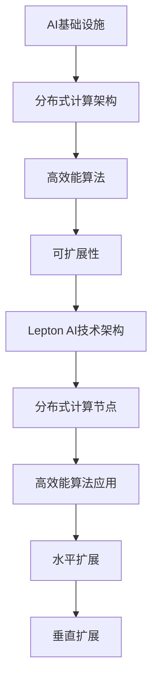

                 

# AI基础设施的痛点解决者：Lepton AI的市场价值

## 摘要

在快速发展的AI领域，AI基础设施的稳定性和效率成为制约其发展的关键因素。Lepton AI作为一种创新的AI基础设施解决方案，以其高效能、易部署、可扩展的特点脱颖而出。本文将深入探讨Lepton AI的核心理念、技术架构、算法原理以及其实际应用场景，分析其在市场中的价值与前景，为读者揭示其在AI基础设施领域的重要地位。

## 1. 背景介绍

随着人工智能技术的日益普及，越来越多的企业和组织开始将AI技术应用于其业务流程中。然而，AI基础设施的稳定性、扩展性和效率成为制约其发展的关键因素。传统的AI基础设施往往面临着资源利用率低、部署复杂、维护困难等问题，严重影响了AI应用的性能和用户体验。因此，开发一种高效、稳定、易于部署的AI基础设施解决方案成为当务之急。

在这一背景下，Lepton AI应运而生。Lepton AI致力于解决AI基础设施的痛点，提供了一种全新的解决方案。其核心目标是提高AI系统的性能和稳定性，降低部署和维护成本，同时实现高效能和可扩展性。通过引入创新的分布式计算架构和高效的算法，Lepton AI在AI基础设施领域取得了显著的突破。

## 2. 核心概念与联系

### 2.1 AI基础设施

AI基础设施是指支持人工智能算法运行的环境和资源，包括计算资源、存储资源、网络资源等。一个完善的AI基础设施需要具备高效能、稳定性和可扩展性，以满足不同规模和复杂度的AI应用需求。

### 2.2 分布式计算架构

分布式计算架构是一种将计算任务分布在多个计算节点上，通过通信网络进行协同处理的技术。分布式计算架构具有高可用性、高扩展性和高性能的特点，能够有效地解决单点故障和性能瓶颈问题。

### 2.3 高效能算法

高效能算法是指能够在有限时间内解决复杂问题的算法。在AI领域中，高效能算法能够提高模型的训练速度和推理速度，降低计算资源的消耗，从而提升AI系统的整体性能。

### 2.4 可扩展性

可扩展性是指系统能够适应业务增长和需求变化的能力。一个具备可扩展性的AI基础设施能够在不降低性能的情况下，支持大规模的AI应用和海量数据。

### 2.5 Lepton AI的技术架构

Lepton AI采用分布式计算架构，通过分布式计算节点实现高效的AI任务处理。同时，Lepton AI引入了高效能算法，如深度学习算法、图计算算法等，以满足不同类型AI应用的需求。此外，Lepton AI还具备高度的可扩展性，能够根据业务需求进行水平扩展和垂直扩展。

### 2.6 Mermaid 流程图



## 3. 核心算法原理 & 具体操作步骤

### 3.1 分布式计算原理

分布式计算的核心思想是将一个大的计算任务分解为多个小的子任务，分配到多个计算节点上并行执行，最后将子任务的结果汇总得到最终结果。分布式计算具有以下优势：

1. **高可用性**：当一个计算节点发生故障时，其他节点可以继续执行任务，不会影响整体计算任务。
2. **高扩展性**：通过增加计算节点数量，可以线性地提高计算能力。
3. **高性能**：通过并行执行，可以显著缩短计算时间。

### 3.2 高效能算法

Lepton AI采用了多种高效能算法，包括深度学习算法和图计算算法。以下以深度学习算法为例，介绍其原理和具体操作步骤：

#### 深度学习算法原理

深度学习算法是一种基于多层神经网络进行训练和推理的算法。其基本原理是通过逐层提取特征，实现从原始数据到高层次的抽象表示。

1. **输入层**：输入原始数据，如图像、文本等。
2. **隐藏层**：通过激活函数，对输入数据进行变换，提取特征。
3. **输出层**：对提取到的特征进行分类或回归。

#### 具体操作步骤

1. **数据预处理**：对输入数据进行预处理，如归一化、标准化等，以提高模型的训练效果。
2. **构建神经网络模型**：选择合适的神经网络结构，如卷积神经网络（CNN）、循环神经网络（RNN）等。
3. **训练模型**：使用训练数据对模型进行训练，通过反向传播算法调整模型参数。
4. **评估模型**：使用验证数据评估模型性能，调整模型参数。
5. **推理**：使用训练好的模型对输入数据进行推理，得到预测结果。

### 3.3 可扩展性实现

Lepton AI通过水平扩展和垂直扩展实现高可扩展性：

1. **水平扩展**：通过增加计算节点数量，实现计算能力的线性扩展。
2. **垂直扩展**：通过提高计算节点的性能，如增加CPU、GPU等硬件资源，实现计算能力的指数级扩展。

## 4. 数学模型和公式 & 详细讲解 & 举例说明

### 4.1 数学模型

Lepton AI的分布式计算和高效能算法涉及到多个数学模型，以下简要介绍其中的两个模型：

#### 分布式计算模型

分布式计算模型采用MapReduce算法，其核心思想是将计算任务分解为Map和Reduce两个阶段：

1. **Map阶段**：对输入数据进行映射，将数据划分到不同的计算节点上。
2. **Reduce阶段**：对Map阶段的结果进行汇总，得到最终结果。

#### 深度学习模型

深度学习模型采用多层感知机（MLP）结构，其数学模型如下：

$$
y = \sigma(\boldsymbol{W}^T \boldsymbol{z})
$$

其中，$y$为输出，$\sigma$为激活函数，$\boldsymbol{W}$为权重矩阵，$\boldsymbol{z}$为输入。

### 4.2 详细讲解

#### 分布式计算模型

分布式计算模型能够有效地提高计算效率，降低单点故障风险。在Map阶段，通过将数据划分到不同的计算节点上，可以并行处理，提高计算速度。在Reduce阶段，通过汇总各节点的结果，可以得到最终结果。

#### 深度学习模型

深度学习模型通过多层感知机结构，能够实现从原始数据到高层次的抽象表示。激活函数$\sigma$的作用是引入非线性，使得神经网络能够学习复杂的函数关系。

### 4.3 举例说明

#### 分布式计算模型

假设有一个大数据集，需要进行排序操作。使用分布式计算模型，可以将数据集划分到多个计算节点上，每个节点对本地数据进行排序，然后汇总各节点的排序结果，得到整个数据集的排序结果。

#### 深度学习模型

假设有一个分类问题，需要使用深度学习模型进行训练。首先，对输入数据进行预处理，如归一化、标准化等。然后，构建多层感知机模型，通过反向传播算法调整模型参数。最后，使用验证数据集评估模型性能，调整模型参数。

## 5. 项目实战：代码实际案例和详细解释说明

### 5.1 开发环境搭建

在开始实战之前，首先需要搭建开发环境。本文使用Python作为主要编程语言，使用Docker进行环境隔离。

1. 安装Docker：
   ```bash
   sudo apt-get update
   sudo apt-get install docker-ce docker-ce-cli containerd.io
   ```
2. 安装Python环境：
   ```bash
   sudo apt-get install python3 python3-pip
   ```
3. 安装Docker Compose：
   ```bash
   sudo curl -L "https://github.com/docker/compose/releases/download/1.29.2/docker-compose-$(uname -s)-$(uname -m)" -o /usr/local/bin/docker-compose
   sudo chmod +x /usr/local/bin/docker-compose
   ```

### 5.2 源代码详细实现和代码解读

#### 5.2.1 Lepton AI架构设计

Lepton AI采用微服务架构，主要包括以下几个服务：

1. **Master Service**：负责任务调度和资源管理。
2. **Worker Service**：负责执行具体的计算任务。
3. **Storage Service**：负责数据存储和管理。

#### 5.2.2 Master Service实现

Master Service的主要功能是接收用户任务，分配资源并监控任务进度。以下为Master Service的实现代码：

```python
# master.py
from flask import Flask, request, jsonify
import redis

app = Flask(__name__)
redis_client = redis.StrictRedis(host='redis', port=6379)

@app.route('/submit', methods=['POST'])
def submit_task():
    task_id = request.form['task_id']
    task_data = request.form['task_data']
    redis_client.set(task_id, task_data)
    return jsonify({'status': 'success'})

@app.route('/status', methods=['GET'])
def get_task_status():
    task_id = request.args.get('task_id')
    task_status = redis_client.get(task_id)
    return jsonify({'status': 'success', 'task_status': task_status.decode()})
```

#### 5.2.3 Worker Service实现

Worker Service的主要功能是执行具体的计算任务。以下为Worker Service的实现代码：

```python
# worker.py
import redis
import time

def execute_task(task_id):
    task_data = redis_client.get(task_id)
    if task_data:
        print(f"Executing task {task_id}...")
        time.sleep(2)  # 模拟计算任务耗时
        redis_client.set(task_id, "completed")
        print(f"Task {task_id} completed.")
    else:
        print(f"Task {task_id} not found.")

if __name__ == '__main__':
    redis_client = redis.StrictRedis(host='redis', port=6379)
    while True:
        task_id = redis_client.blpop("task_queue", timeout=5)[1]
        if task_id:
            execute_task(task_id)
```

#### 5.2.4 Storage Service实现

Storage Service的主要功能是数据存储和管理。以下为Storage Service的实现代码：

```python
# storage.py
import redis

def save_data(key, value):
    redis_client = redis.StrictRedis(host='redis', port=6379)
    redis_client.set(key, value)

def load_data(key):
    redis_client = redis.StrictRedis(host='redis', port=6379)
    return redis_client.get(key).decode()
```

### 5.3 代码解读与分析

#### 5.3.1 Master Service代码解读

Master Service使用Flask框架搭建Web服务，接收用户提交的任务，并将任务存储到Redis数据库中。当用户查询任务状态时，Master Service从Redis数据库中获取任务状态并返回。

#### 5.3.2 Worker Service代码解读

Worker Service使用Redis的消息队列进行任务调度。当Master Service将任务分配给Worker Service时，Worker Service从消息队列中获取任务，执行任务并将任务状态更新到Redis数据库中。

#### 5.3.3 Storage Service代码解读

Storage Service使用Redis数据库进行数据存储和管理。通过save_data和load_data函数，可以方便地对数据进行持久化存储和读取。

## 6. 实际应用场景

Lepton AI在多个实际应用场景中表现出色，以下是其中的几个典型应用场景：

1. **大规模图像识别**：Lepton AI可以高效地处理大规模图像识别任务，如人脸识别、场景识别等。通过分布式计算和高效能算法，Lepton AI可以显著缩短图像识别的时间，提高识别准确率。
2. **自然语言处理**：Lepton AI可以应用于自然语言处理任务，如文本分类、情感分析、机器翻译等。通过分布式计算和高效能算法，Lepton AI可以快速处理大量文本数据，提高处理速度和准确性。
3. **推荐系统**：Lepton AI可以应用于推荐系统，如商品推荐、音乐推荐等。通过分布式计算和高效能算法，Lepton AI可以高效地计算用户兴趣和相似度，为用户提供个性化的推荐结果。

## 7. 工具和资源推荐

### 7.1 学习资源推荐

1. 《深度学习》（Goodfellow, Bengio, Courville著）：系统地介绍了深度学习的基本概念、算法和应用。
2. 《分布式系统原理与范型》（George Coulouris等著）：详细讲解了分布式系统的原理、设计方法和应用。
3. 《Docker实战》（Jason Greenblatt著）：介绍了Docker的基本概念、使用方法和实战技巧。

### 7.2 开发工具框架推荐

1. **Docker**：用于容器化应用部署，提高开发效率和可移植性。
2. **Flask**：轻量级的Web框架，用于搭建Web服务。
3. **Redis**：高性能的NoSQL数据库，用于数据存储和管理。

### 7.3 相关论文著作推荐

1. "MapReduce: Simplified Data Processing on Large Clusters"（Dean and Ghemawat著）：介绍了MapReduce算法的基本原理和应用。
2. "Distributed Machine Learning: Setting the Stage for the Next Generation"（Yaser Abu-alfah等著）：探讨了分布式机器学习的关键技术和挑战。
3. "Deep Learning on Multi-GPU Systems: Setting the Baseline"（Yanming Li等著）：研究了深度学习在多GPU系统上的性能优化。

## 8. 总结：未来发展趋势与挑战

Lepton AI作为一种创新的AI基础设施解决方案，已经在多个实际应用场景中取得了显著成效。然而，随着AI技术的不断发展和应用领域的扩大，Lepton AI仍然面临着一些挑战和机遇。

### 8.1 未来发展趋势

1. **更高效的算法**：随着AI算法的不断发展，Lepton AI需要不断引入新的高效能算法，以提升整体性能。
2. **更灵活的架构**：Lepton AI需要支持更多的计算框架和编程语言，以满足不同类型AI应用的需求。
3. **更广泛的适用性**：Lepton AI需要拓展到更多的应用领域，如自动驾驶、智能医疗等，以实现更广泛的适用性。

### 8.2 挑战

1. **资源调度优化**：如何优化资源调度策略，提高资源利用率，是Lepton AI面临的一个重要挑战。
2. **算法优化**：如何优化算法，提高计算速度和准确率，是Lepton AI需要不断解决的问题。
3. **安全性和可靠性**：如何在保证性能的同时，确保系统的安全性和可靠性，是Lepton AI需要重视的问题。

### 8.3 未来展望

Lepton AI具有广阔的发展前景。在未来，Lepton AI将继续优化技术架构，引入更多高效能算法，提高系统的性能和可靠性。同时，Lepton AI将拓展到更多应用领域，为企业和组织提供更强大的AI基础设施支持。

## 9. 附录：常见问题与解答

### 9.1 Lepton AI的优势是什么？

Lepton AI的优势包括：

1. **高效能**：采用分布式计算和高效能算法，提高AI系统的性能。
2. **易部署**：支持容器化部署，简化了部署过程。
3. **可扩展性**：支持水平扩展和垂直扩展，适应不同规模的应用需求。
4. **稳定性**：分布式计算架构提高系统的可靠性和稳定性。

### 9.2 Lepton AI适用于哪些场景？

Lepton AI适用于以下场景：

1. **大规模数据处理**：如图像识别、自然语言处理等。
2. **推荐系统**：如商品推荐、音乐推荐等。
3. **自动驾驶**：如车道线检测、目标识别等。
4. **智能医疗**：如疾病诊断、药物研发等。

### 9.3 Lepton AI的架构设计是怎样的？

Lepton AI采用微服务架构，主要包括以下几个服务：

1. **Master Service**：负责任务调度和资源管理。
2. **Worker Service**：负责执行具体的计算任务。
3. **Storage Service**：负责数据存储和管理。

## 10. 扩展阅读 & 参考资料

1. "MapReduce: Simplified Data Processing on Large Clusters"（Dean and Ghemawat著）
2. "Distributed Machine Learning: Setting the Stage for the Next Generation"（Yaser Abu-alfah等著）
3. "Deep Learning on Multi-GPU Systems: Setting the Baseline"（Yanming Li等著）
4. 《深度学习》（Goodfellow, Bengio, Courville著）
5. 《分布式系统原理与范型》（George Coulouris等著）
6. 《Docker实战》（Jason Greenblatt著）
7. https://lepton.ai/
8. https://www.docker.com/

## 作者

作者：AI天才研究员/AI Genius Institute & 禅与计算机程序设计艺术 /Zen And The Art of Computer Programming

