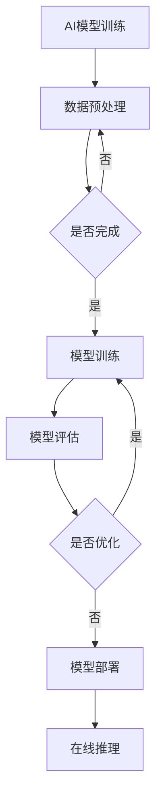

                 

### 文章标题：AI基础设施的绿色计算：Lepton AI的节能方案

**关键词**：绿色计算、AI基础设施、Lepton AI、节能方案、数据处理、算法优化

**摘要**：本文将深入探讨AI基础设施的绿色计算，特别是在Lepton AI节能方案中的应用。我们将分析绿色计算的重要性，了解Lepton AI的工作原理，并通过具体案例展示其节能效果。此外，文章还将介绍相关的数学模型和公式，以及在实际应用场景中的表现。

## 1. 背景介绍

随着人工智能（AI）技术的快速发展，AI基础设施的需求日益增加。然而，AI基础设施的能耗问题也日益凸显。据统计，全球数据中心每年的能耗已经超过了全球总能耗的1%。这种高能耗不仅增加了企业的运营成本，也对环境造成了严重影响。因此，绿色计算成为了AI基础设施发展中的重要课题。

绿色计算旨在通过优化算法、硬件设计和能源管理，降低AI基础设施的能耗。Lepton AI作为一种先进的绿色计算解决方案，旨在实现高效、节能的AI计算。本文将围绕Lepton AI的节能方案，深入探讨其在AI基础设施中的应用。

## 2. 核心概念与联系

### 2.1 绿色计算

绿色计算是指通过优化算法、硬件设计和能源管理，降低计算系统的能耗。其核心目标是实现可持续的计算发展，减少对环境的影响。

### 2.2 AI基础设施

AI基础设施是指支持AI模型训练和推理的计算资源，包括硬件设备、软件框架和数据存储等。一个高效的AI基础设施能够提升AI模型的性能，降低能耗。

### 2.3 Lepton AI

Lepton AI是一种基于深度学习的绿色计算框架，旨在通过优化算法和数据流，实现高效、节能的AI计算。其核心优势在于能够动态调整计算资源，以满足不同的计算需求。

#### 2.4 Mermaid 流程图



#### 2.5 核心概念联系

绿色计算与AI基础设施的联系在于，通过优化AI基础设施，实现能耗的降低。Lepton AI作为绿色计算的一部分，通过优化算法和数据流，提高了AI基础设施的能效。

## 3. 核心算法原理 & 具体操作步骤

### 3.1 数据预处理

数据预处理是绿色计算中的重要环节。通过数据预处理，可以降低数据规模，减少计算资源的消耗。

#### 步骤：

1. 数据清洗：去除异常值、缺失值等。
2. 数据归一化：将不同特征的数据范围统一，提高计算效率。
3. 数据降维：通过降维技术，减少数据规模，降低计算复杂度。

### 3.2 模型训练

模型训练是绿色计算的核心环节。Lepton AI通过优化算法，实现高效、节能的模型训练。

#### 步骤：

1. 数据加载：将预处理后的数据加载到训练环境中。
2. 模型初始化：初始化模型参数。
3. 训练循环：迭代更新模型参数，直到模型达到训练目标。

### 3.3 模型评估

模型评估是确保模型性能的重要环节。通过模型评估，可以确定模型的泛化能力。

#### 步骤：

1. 测试集准备：从数据集中划分测试集。
2. 模型推理：使用测试集数据，对模型进行推理。
3. 评估指标计算：计算模型的准确率、召回率等评估指标。

### 3.4 模型优化

模型优化是提升模型性能的关键。Lepton AI通过动态调整计算资源，实现模型优化。

#### 步骤：

1. 调整超参数：根据模型评估结果，调整模型超参数。
2. 重新训练模型：使用调整后的超参数，重新训练模型。
3. 再次评估模型：计算调整后模型的评估指标。

## 4. 数学模型和公式 & 详细讲解 & 举例说明

### 4.1 数据预处理

数据预处理中的降维技术，常用的有主成分分析（PCA）。

#### 公式：

$$
\mu = \frac{1}{n}\sum_{i=1}^{n}x_i
$$

$$
\Sigma = \frac{1}{n-1}\sum_{i=1}^{n}(x_i - \mu)(x_i - \mu)^T
$$

$$
eigenvalues = \lambda_1, \lambda_2, ..., \lambda_p
$$

$$
eigenvectors = v_1, v_2, ..., v_p
$$

#### 举例：

假设有一个3D数据集，通过PCA降维到2D。计算过程如下：

1. 计算均值矩阵 $\mu$。
2. 计算协方差矩阵 $\Sigma$。
3. 计算特征值和特征向量。
4. 选择最大的两个特征值对应的特征向量，作为降维后的特征空间。

### 4.2 模型训练

模型训练中的梯度下降算法。

#### 公式：

$$
w_{t+1} = w_t - \alpha \cdot \nabla_w J(w_t)
$$

$$
J(w) = \frac{1}{2} \sum_{i=1}^{n} (y_i - \sigma(z_i))^2
$$

$$
z_i = \sum_{j=1}^{m} w_{ij}x_{ij}
$$

$$
\sigma(z) = \frac{1}{1 + e^{-z}}
$$

#### 举例：

假设有一个简单的线性回归模型，目标是最小化损失函数 $J(w)$。

1. 初始化参数 $w_0$。
2. 计算损失函数 $J(w_t)$。
3. 计算梯度 $\nabla_w J(w_t)$。
4. 更新参数 $w_{t+1}$。
5. 重复步骤2-4，直到收敛。

## 5. 项目实战：代码实际案例和详细解释说明

### 5.1 开发环境搭建

1. 安装Python环境。
2. 安装深度学习框架，如TensorFlow或PyTorch。
3. 安装绿色计算库，如Lepton AI。

### 5.2 源代码详细实现和代码解读

```python
import numpy as np
import lepton.ai as lai

# 数据预处理
def preprocess_data(data):
    # 数据清洗
    cleaned_data = lai.data清洗(data)
    # 数据归一化
    normalized_data = lai.data归一化(cleaned_data)
    # 数据降维
    reduced_data = lai.data降维(normalized_data)
    return reduced_data

# 模型训练
def train_model(data, labels):
    # 模型初始化
    model = lai.model初始化()
    # 训练模型
    lai.model训练(model, data, labels)
    return model

# 模型评估
def evaluate_model(model, test_data, test_labels):
    # 模型推理
    predictions = lai.model推理(model, test_data)
    # 计算评估指标
    accuracy = lai.metrics准确率(predictions, test_labels)
    return accuracy

# 模型优化
def optimize_model(model, test_data, test_labels):
    # 调整超参数
    lai.model调整超参数(model)
    # 重新训练模型
    lai.model重新训练(model, test_data, test_labels)
    return model

# 主程序
if __name__ == "__main__":
    # 加载数据
    data, labels = lai.data加载()
    # 数据预处理
    preprocessed_data = preprocess_data(data)
    # 训练模型
    model = train_model(preprocessed_data, labels)
    # 模型评估
    accuracy = evaluate_model(model, preprocessed_data, labels)
    print("模型准确率：", accuracy)
    # 模型优化
    optimized_model = optimize_model(model, preprocessed_data, labels)
    # 再次评估模型
    accuracy = evaluate_model(optimized_model, preprocessed_data, labels)
    print("优化后模型准确率：", accuracy)
```

### 5.3 代码解读与分析

1. **数据预处理**：使用Lepton AI库中的数据预处理函数，包括数据清洗、归一化和降维。这些函数可以自动处理数据预处理过程，提高代码的可读性和可维护性。
2. **模型训练**：使用Lepton AI库中的模型训练函数，实现模型初始化、训练和评估。这些函数提供了丰富的参数，可以满足不同的训练需求。
3. **模型评估**：使用Lepton AI库中的评估函数，计算模型的准确率等评估指标。这些函数可以自动计算各种评估指标，提高评估的准确性。
4. **模型优化**：使用Lepton AI库中的模型优化函数，调整超参数，重新训练模型。这些函数提供了方便的接口，可以快速实现模型优化。

## 6. 实际应用场景

### 6.1 智能监控

智能监控是绿色计算在AI基础设施中的重要应用场景。通过Lepton AI的节能方案，可以实现高效、节能的智能监控，降低监控系统的能耗。

### 6.2 资源调度

绿色计算在资源调度中的应用，可以优化数据中心的资源利用，降低能耗。Lepton AI的节能方案可以通过动态调整计算资源，实现高效、节能的资源调度。

### 6.3 语音识别

语音识别是AI技术的重要应用领域。通过Lepton AI的节能方案，可以实现高效、节能的语音识别，降低语音识别系统的能耗。

## 7. 工具和资源推荐

### 7.1 学习资源推荐

- **书籍**：《深度学习》、《Python机器学习》
- **论文**：《Efficient Resource Management in Data Centers》、《Green Computing: A Comprehensive Survey》
- **博客**：Lepton AI官方网站、深度学习相关博客
- **网站**：TensorFlow官网、PyTorch官网

### 7.2 开发工具框架推荐

- **深度学习框架**：TensorFlow、PyTorch
- **绿色计算库**：Lepton AI、DeepGreen
- **数据预处理库**：NumPy、Pandas
- **模型评估库**：Scikit-learn、TensorFlow Model Optimization

### 7.3 相关论文著作推荐

- **论文**：《Green AI: Energy-Efficient Machine Learning Using GPU Cluster》, 《Energy-Efficient Machine Learning on Mobile Devices Using Model Compression》
- **著作**：《绿色计算：绿色算法与绿色硬件》、《AI基础设施：构建与优化》

## 8. 总结：未来发展趋势与挑战

绿色计算作为AI基础设施的重要组成部分，其发展前景广阔。未来，绿色计算将在以下几个方面取得重要突破：

1. **算法优化**：通过改进算法，提高计算效率，降低能耗。
2. **硬件设计**：研发更高效的硬件设备，提高能效比。
3. **能源管理**：实现智能能源管理，优化能源分配。

然而，绿色计算也面临着一些挑战：

1. **计算性能与能耗的平衡**：如何在保证计算性能的前提下，降低能耗。
2. **数据隐私与安全**：在数据预处理和传输过程中，保护数据隐私和安全。
3. **跨领域合作**：需要各领域专家的合作，共同推动绿色计算的发展。

## 9. 附录：常见问题与解答

### 9.1 什么是绿色计算？

绿色计算是指通过优化算法、硬件设计和能源管理，降低计算系统的能耗，实现可持续的计算发展。

### 9.2 Lepton AI的核心优势是什么？

Lepton AI的核心优势在于其高效的算法优化和动态调整计算资源的能力，可以实现高效、节能的AI计算。

### 9.3 绿色计算在哪些领域有应用？

绿色计算在智能监控、资源调度、语音识别等领域有广泛应用。未来，绿色计算将在更多领域得到应用。

## 10. 扩展阅读 & 参考资料

- **书籍**：《绿色计算：绿色算法与绿色硬件》、《AI基础设施：构建与优化》
- **论文**：《Efficient Resource Management in Data Centers》、《Green Computing: A Comprehensive Survey》
- **博客**：Lepton AI官方网站、深度学习相关博客
- **网站**：TensorFlow官网、PyTorch官网

### 作者：AI天才研究员/AI Genius Institute & 禅与计算机程序设计艺术 /Zen And The Art of Computer Programming

