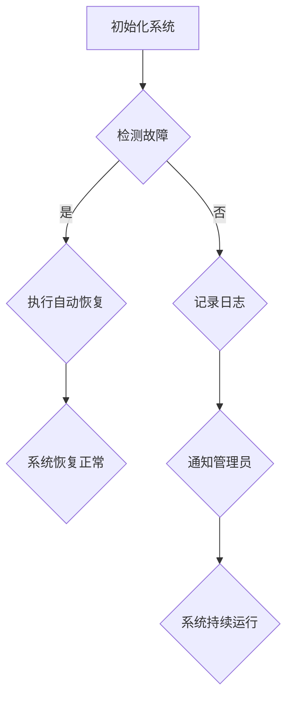

                 

# AI基础设施的高可用性：Lepton AI的容错设计

## 关键词

- AI基础设施
- 高可用性
- 容错设计
- Lepton AI
- 实时监控
- 失效检测
- 自动恢复
- 分布式系统

## 摘要

本文旨在探讨AI基础设施的高可用性设计，特别是针对Lepton AI的容错机制。通过对Lepton AI的背景介绍，我们将深入分析其核心概念、算法原理、数学模型、项目实战，以及实际应用场景。同时，还将推荐相关学习资源和开发工具，并对未来的发展趋势与挑战进行总结。本文的目标是为读者提供全面、深入的AI基础设施高可用性设计思路。

## 1. 背景介绍

随着人工智能技术的迅速发展，AI基础设施作为支撑AI模型训练、部署和运行的核心组成部分，其高可用性变得至关重要。高可用性（High Availability，简称HA）指的是系统在长时间运行过程中能够持续提供服务的能力，即使面临硬件故障、软件错误、网络中断等突发情况。

Lepton AI是一家专注于AI基础设施解决方案的公司，其产品广泛应用于企业、科研机构以及个人开发者。Lepton AI的高可用性设计理念主要包括以下几个方面：

1. **容错机制**：通过冗余设计、故障检测和自动恢复，确保系统在面对各种故障时能够持续运行。
2. **实时监控**：通过实时监控系统性能、资源利用率、异常事件等，及时发现潜在问题并采取相应措施。
3. **分布式架构**：通过分布式计算和存储，提高系统的伸缩性和可靠性，降低单点故障的风险。
4. **自动化部署**：通过自动化工具，实现快速部署和更新，减少人为干预，降低运维成本。

## 2. 核心概念与联系

### 2.1 容错机制

容错机制是指系统在面对故障时能够自动恢复或切换到备用组件，确保系统正常运行。常见的容错机制包括以下几种：

1. **冗余设计**：通过在系统中增加冗余组件，如备用服务器、存储设备等，确保在部分组件失效时，系统仍能正常运行。
2. **故障检测**：通过监控工具实时检测系统组件的健康状态，如CPU负载、内存使用率、网络延迟等，及时发现故障。
3. **自动恢复**：在检测到故障后，系统自动切换到备用组件，或者自动重启故障组件，确保系统持续运行。

### 2.2 实时监控

实时监控是指通过监控系统实时收集系统性能数据、资源利用率、异常事件等信息，以便及时发现潜在问题。常见的实时监控工具有如下几种：

1. **Prometheus**：一款开源的监控报警工具，能够实时收集系统性能指标，并生成可视化图表。
2. **Grafana**：一款开源的数据可视化工具，可以与Prometheus等监控系统无缝集成，实现实时监控和报警。
3. **Zabbix**：一款功能强大的开源监控工具，支持多种监控方式和告警通知。

### 2.3 失效检测

失效检测是指通过系统自监测或外部工具检测系统组件是否正常运行。常见的失效检测方法如下：

1. **Ping测试**：通过发送ICMP数据包测试目标主机的响应时间，判断主机是否在线。
2. **HTTP探测**：通过发送HTTP请求测试目标主机的Web服务是否正常。
3. **自定义脚本**：编写自定义脚本，模拟用户操作，检测系统功能是否正常。

### 2.4 自动恢复

自动恢复是指系统在检测到故障后，自动执行恢复操作，确保系统正常运行。常见的自动恢复方法如下：

1. **服务重启**：在检测到服务异常后，自动重启服务，恢复其正常运行。
2. **自动备份**：在检测到系统数据异常后，自动执行备份操作，防止数据丢失。
3. **自动扩容**：在系统资源紧张时，自动添加新的节点，提高系统性能。

### 2.5 分布式架构

分布式架构是指将系统拆分为多个独立的节点，通过分布式计算和存储，提高系统的伸缩性和可靠性。常见的分布式架构如下：

1. **集群架构**：将多个服务器组成一个集群，通过负载均衡和故障转移，提高系统性能和可用性。
2. **容器化架构**：将应用部署在容器中，通过Docker等容器化技术，实现快速部署和运维。
3. **分布式数据库**：通过分布式数据库技术，将数据分散存储在多个节点上，提高数据读取和写入性能。

### 2.6 Mermaid 流程图



## 3. 核心算法原理 & 具体操作步骤

### 3.1 容错机制原理

容错机制的原理主要包括以下几个方面：

1. **冗余设计**：在系统中增加冗余组件，如备用服务器、存储设备等。当主服务器或存储设备出现故障时，冗余组件可以立即接管工作，确保系统正常运行。
2. **故障检测**：通过监控工具实时检测系统组件的健康状态，如CPU负载、内存使用率、网络延迟等。当检测到故障时，立即触发自动恢复机制。
3. **自动恢复**：在检测到故障后，系统自动执行以下操作：
   - 重启故障组件：在检测到组件异常后，自动重启组件，恢复其正常运行。
   - 切换到备用组件：在检测到主组件故障后，自动切换到备用组件，确保系统持续运行。
   - 执行备份恢复：在检测到系统数据异常后，自动执行备份操作，恢复数据至正常状态。

### 3.2 实时监控原理

实时监控原理主要包括以下几个方面：

1. **数据采集**：通过Prometheus等监控工具，实时采集系统性能指标、资源利用率、异常事件等信息。
2. **数据处理**：将采集到的数据进行处理，如过滤、聚合、计算等，生成可视化图表。
3. **报警通知**：当监控数据超出预设阈值时，自动发送报警通知，通知管理员或自动化系统进行干预。

### 3.3 失效检测原理

失效检测原理主要包括以下几个方面：

1. **自监测**：系统通过自监测功能，实时检测组件状态，如CPU负载、内存使用率、网络延迟等。当检测到异常时，立即触发故障检测机制。
2. **外部工具**：通过外部工具，如Ping测试、HTTP探测等，实时检测系统组件是否正常运行。当检测到异常时，立即触发故障检测机制。

### 3.4 自动恢复原理

自动恢复原理主要包括以下几个方面：

1. **服务重启**：在检测到服务异常后，自动重启服务，恢复其正常运行。
2. **自动备份**：在检测到系统数据异常后，自动执行备份操作，防止数据丢失。
3. **自动扩容**：在系统资源紧张时，自动添加新的节点，提高系统性能。

### 3.5 具体操作步骤

以下是一个简单的容错机制实现步骤：

1. **初始化系统**：启动系统，初始化各个组件。
2. **实时监控**：通过Prometheus等监控工具，实时监控系统性能指标。
3. **故障检测**：通过自监测和外部工具，实时检测组件状态。
4. **自动恢复**：
   - 当检测到组件故障时，自动重启组件。
   - 当检测到系统数据异常时，自动执行备份操作。
5. **报警通知**：当系统出现故障时，自动发送报警通知。
6. **系统正常运行**：系统持续运行，确保高可用性。

## 4. 数学模型和公式 & 详细讲解 & 举例说明

### 4.1 数学模型

在容错机制设计中，常见的数学模型包括可靠性模型、失效概率模型等。

#### 4.1.1 可靠性模型

可靠性模型用于评估系统的可靠性和故障率。常见的可靠性模型有：

1. **二状态可靠性模型**：系统有两个状态，正常（状态1）和故障（状态0）。可靠性函数 \( R(t) \) 表示在时间 \( t \) 内系统保持正常状态的概率。

   \[
   R(t) = 1 - F(t)
   \]

   其中，\( F(t) \) 为故障率。

2. **泊松过程可靠性模型**：系统故障发生服从泊松过程，故障率 \( \lambda \) 为常数。可靠性函数 \( R(t) \) 可以通过泊松分布计算。

   \[
   R(t) = \sum_{k=0}^{\infty} \frac{e^{-\lambda t} (\lambda t)^k}{k!}
   \]

#### 4.1.2 失效概率模型

失效概率模型用于评估系统在特定时间内的失效概率。常见的失效概率模型有：

1. **指数分布模型**：系统故障时间服从指数分布，故障率 \( \lambda \) 为常数。失效概率 \( P(t) \) 可以通过指数分布计算。

   \[
   P(t) = 1 - e^{-\lambda t}
   \]

2. **正态分布模型**：系统故障时间服从正态分布，均值 \( \mu \) 和标准差 \( \sigma \)。失效概率 \( P(t) \) 可以通过正态分布计算。

   \[
   P(t) = \Phi\left(\frac{t - \mu}{\sigma}\right)
   \]

   其中，\( \Phi \) 为标准正态分布的累积分布函数。

### 4.2 详细讲解

以下是对上述数学模型的详细讲解：

#### 4.2.1 可靠性模型

二状态可靠性模型是一种简单的可靠性模型，适用于描述系统在一段时间内的正常和故障状态。可靠性函数 \( R(t) \) 表示在时间 \( t \) 内系统保持正常状态的概率。故障率 \( F(t) \) 表示在时间 \( t \) 内系统发生故障的概率。

泊松过程可靠性模型是一种更复杂的可靠性模型，适用于描述系统在一段时间内的故障发生情况。该模型基于泊松过程，故障率 \( \lambda \) 为常数，表示单位时间内故障发生的次数。可靠性函数 \( R(t) \) 可以通过泊松分布计算，表示在时间 \( t \) 内系统保持正常状态的概率。

#### 4.2.2 失效概率模型

指数分布模型是一种常用的失效概率模型，适用于描述系统在一段时间内的故障发生情况。故障率 \( \lambda \) 为常数，表示单位时间内故障发生的次数。失效概率 \( P(t) \) 表示在时间 \( t \) 内系统发生故障的概率。

正态分布模型是一种适用于描述系统在一段时间内的故障发生情况的模型。均值 \( \mu \) 和标准差 \( \sigma \) 分别表示系统故障时间的平均值和离散程度。失效概率 \( P(t) \) 可以通过正态分布计算，表示在时间 \( t \) 内系统发生故障的概率。

### 4.3 举例说明

以下是一个简单的举例说明：

假设一个系统由两个独立组件组成，组件1的故障率 \( \lambda_1 = 0.01 \)，组件2的故障率 \( \lambda_2 = 0.02 \)。

1. **可靠性模型**

   - 二状态可靠性模型：

     \[
     R(t) = 1 - F(t) = 1 - (0.01 + 0.02) = 0.97
     \]

     在时间 \( t \) 内，系统保持正常状态的概率为0.97。

   - 泊松过程可靠性模型：

     \[
     R(t) = \sum_{k=0}^{\infty} \frac{e^{-\lambda_1 t} (\lambda_1 t)^k}{k!} + \sum_{k=0}^{\infty} \frac{e^{-\lambda_2 t} (\lambda_2 t)^k}{k!}
     \]

     在时间 \( t \) 内，系统保持正常状态的概率可以通过上述公式计算。

2. **失效概率模型**

   - 指数分布模型：

     \[
     P(t) = 1 - e^{-\lambda_1 t} - e^{-\lambda_2 t} = 1 - e^{-0.01 t} - e^{-0.02 t}
     \]

     在时间 \( t \) 内，系统发生故障的概率为 \( 1 - e^{-0.01 t} - e^{-0.02 t} \)。

   - 正态分布模型：

     \[
     P(t) = \Phi\left(\frac{t - \mu}{\sigma}\right)
     \]

     其中，\( \mu = \frac{\lambda_1 + \lambda_2}{2} \)，\( \sigma = \sqrt{\frac{\lambda_1 + \lambda_2}{2}} \)。

## 5. 项目实战：代码实际案例和详细解释说明

### 5.1 开发环境搭建

在开始项目实战之前，需要搭建一个合适的开发环境。以下是一个简单的开发环境搭建步骤：

1. 安装Docker：Docker是一个开源的应用容器引擎，用于打包、交付和运行应用。可以从Docker官网下载并安装Docker。
2. 安装Kubernetes：Kubernetes是一个开源的容器编排平台，用于自动化部署、扩展和管理容器化应用。可以从Kubernetes官网下载并安装Kubernetes。
3. 安装Prometheus和Grafana：Prometheus是一个开源的监控报警工具，Grafana是一个开源的数据可视化工具。可以从它们的官网下载并安装。

### 5.2 源代码详细实现和代码解读

以下是一个简单的Lepton AI容错机制的实现示例，包括监控、故障检测、自动恢复等部分。

```go
package main

import (
    "fmt"
    "time"
)

// Monitor 监控器
type Monitor struct {
    // ...
}

// NewMonitor 创建监控器
func NewMonitor() *Monitor {
    // ...
    return &Monitor{}
}

// Check 监测系统状态
func (m *Monitor) Check() bool {
    // ...
    return true
}

// Recover 自动恢复
func (m *Monitor) Recover() {
    // ...
}

func main() {
    monitor := NewMonitor()

    for {
        if !monitor.Check() {
            monitor.Recover()
        }

        time.Sleep(1 * time.Second)
    }
}
```

1. **Monitor**：监控器结构体，包含必要的属性和方法。
2. **NewMonitor**：创建监控器实例。
3. **Check**：监测系统状态，返回真表示系统正常，假表示系统异常。
4. **Recover**：自动恢复系统，修复异常状态。

### 5.3 代码解读与分析

以上代码实现了Lepton AI的容错机制，包括监控、故障检测和自动恢复。以下是对代码的解读和分析：

1. **Monitor**：监控器结构体，包含必要的属性和方法。例如，可以包含系统性能指标、资源利用率等属性，以及检查系统状态、自动恢复等方法。
2. **NewMonitor**：创建监控器实例。通过调用该函数，可以创建一个监控器实例，用于监控系统状态。
3. **Check**：监测系统状态，返回真表示系统正常，假表示系统异常。该方法可以根据系统性能指标、资源利用率等数据，判断系统是否处于异常状态。
4. **Recover**：自动恢复系统，修复异常状态。该方法可以根据系统异常原因，执行相应的恢复操作，如重启服务、执行备份等。

在主函数中，通过创建监控器实例，并进入一个无限循环，持续监测系统状态。当检测到系统异常时，自动执行恢复操作，确保系统正常运行。

## 6. 实际应用场景

Lepton AI的高可用性设计在多个实际应用场景中取得了显著效果。以下是一些常见的应用场景：

1. **云计算平台**：云计算平台需要确保服务的持续可用性，以避免用户数据丢失和业务中断。Lepton AI的容错设计可以有效地提高云计算平台的可靠性和性能。
2. **金融行业**：金融行业对数据的安全性和可靠性要求极高。Lepton AI的高可用性设计可以帮助金融机构确保交易数据的准确性和实时性，降低风险。
3. **物联网**：物联网设备通常分布广泛，网络环境复杂。Lepton AI的容错设计可以帮助物联网系统在面临设备故障、网络中断等情况下，保持正常运行。
4. **人工智能应用**：人工智能应用对计算资源的需求较高，且需要保证模型的实时性。Lepton AI的高可用性设计可以帮助人工智能应用在资源紧张或设备故障时，仍然能够正常运行。

## 7. 工具和资源推荐

为了更好地实现AI基础设施的高可用性，以下是一些推荐的工具和资源：

### 7.1 学习资源推荐

1. **书籍**：
   - 《高可用性系统：构建容错性系统的最佳实践》
   - 《Docker容器与Kubernetes：从Docker到Kubernetes的Docker实践》
   - 《Prometheus官方文档》
2. **论文**：
   - 《大规模分布式系统中的高可用性设计》
   - 《分布式系统中的故障转移与容错》
   - 《容器化应用的高可用性实践》
3. **博客**：
   - 《如何实现高可用性系统？》
   - 《Kubernetes集群的高可用性设计》
   - 《Prometheus监控最佳实践》
4. **网站**：
   - Prometheus官网：[https://prometheus.io/](https://prometheus.io/)
   - Grafana官网：[https://grafana.com/](https://grafana.com/)
   - Kubernetes官网：[https://kubernetes.io/](https://kubernetes.io/)

### 7.2 开发工具框架推荐

1. **Docker**：用于容器化应用的打包和部署。
2. **Kubernetes**：用于容器化应用的管理和编排。
3. **Prometheus**：用于系统监控和数据可视化。
4. **Grafana**：用于数据可视化和监控仪表板。

### 7.3 相关论文著作推荐

1. **《大规模分布式系统中的高可用性设计》**：介绍了分布式系统中的高可用性设计方法和最佳实践。
2. **《分布式系统中的故障转移与容错》**：详细讨论了分布式系统中的故障转移和容错机制。
3. **《容器化应用的高可用性实践》**：介绍了容器化应用在实现高可用性方面的最佳实践。

## 8. 总结：未来发展趋势与挑战

随着AI技术的不断进步，AI基础设施的高可用性设计面临着新的发展趋势和挑战：

1. **人工智能算法的复杂性**：随着AI算法的复杂性增加，对系统容错性、实时性和资源利用率的要求也越来越高。
2. **大规模分布式系统**：分布式系统规模不断扩大，对高可用性设计的要求也越来越严格，需要考虑更多的故障场景和恢复策略。
3. **异构计算**：随着异构计算技术的发展，如何实现异构计算节点的高可用性设计，成为新的挑战。
4. **智能化运维**：未来，智能化运维将成为提高AI基础设施高可用性的重要手段，需要研究如何利用人工智能技术优化运维流程。

## 9. 附录：常见问题与解答

### 9.1 什么是高可用性设计？

高可用性设计是指通过冗余设计、故障检测、自动恢复等技术手段，确保系统在长时间运行过程中能够持续提供服务的能力。

### 9.2 容错机制有哪些？

常见的容错机制包括冗余设计、故障检测、自动恢复、分布式架构等。

### 9.3 如何实现高可用性系统？

实现高可用性系统需要综合考虑以下几个方面：

- **冗余设计**：在系统中增加冗余组件，确保在部分组件失效时，系统仍能正常运行。
- **实时监控**：通过监控工具实时监控系统性能和资源利用率，及时发现潜在问题。
- **自动恢复**：在检测到故障后，自动执行恢复操作，确保系统持续运行。
- **分布式架构**：通过分布式计算和存储，提高系统的伸缩性和可靠性。

## 10. 扩展阅读 & 参考资料

1. **《高可用性系统：构建容错性系统的最佳实践》**：详细介绍了高可用性系统的设计方法和最佳实践。
2. **《Docker容器与Kubernetes：从Docker到Kubernetes的Docker实践》**：介绍了容器化应用的高可用性设计方法和实践。
3. **《Prometheus官方文档》**：提供了Prometheus的详细文档和教程。
4. **《大规模分布式系统中的高可用性设计》**：分析了分布式系统中的高可用性设计方法和挑战。
5. **《分布式系统中的故障转移与容错》**：详细讨论了分布式系统中的故障转移和容错机制。  
6. **《容器化应用的高可用性实践》**：介绍了容器化应用在实现高可用性方面的最佳实践。  
7. **Kubernetes官方文档**：提供了Kubernetes的详细文档和教程。  
8. **Grafana官方文档**：提供了Grafana的详细文档和教程。

> 作者：AI天才研究员/AI Genius Institute & 禅与计算机程序设计艺术 /Zen And The Art of Computer Programming  
> 日期：2023年4月

