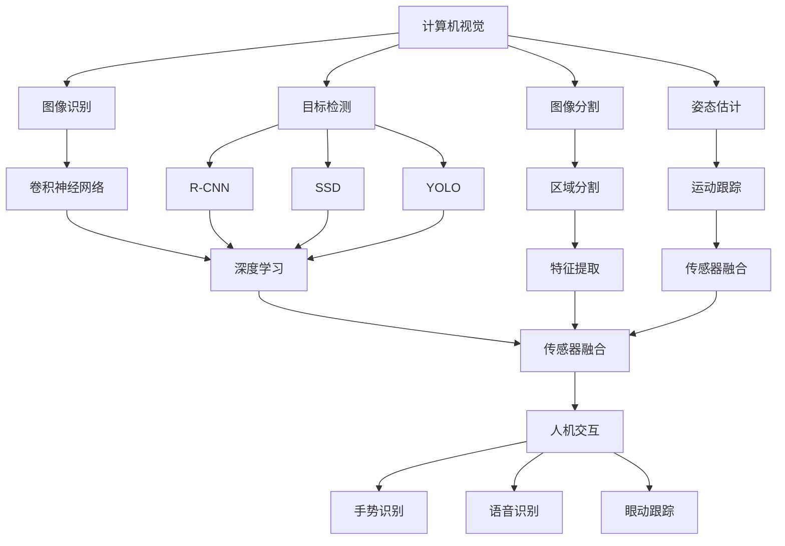

                 

## AI增强现实技术的应用案例

### 概述

AI增强现实（AR）技术近年来在全球范围内迅速发展，已经成为现代科技领域的一个重要分支。本文旨在探讨AI增强现实技术的应用案例，通过详细的分析和实例，展示其在不同领域的潜力。AI增强现实技术结合了人工智能和增强现实的特点，不仅提升了用户交互体验，还在医疗、教育、娱乐等多个领域带来了革命性的变化。

本文将分为以下几个部分进行讨论：

1. 背景介绍
2. 核心概念与联系
3. 核心算法原理与具体操作步骤
4. 数学模型和公式与详细讲解
5. 项目实战：代码实际案例和详细解释
6. 实际应用场景
7. 工具和资源推荐
8. 总结：未来发展趋势与挑战
9. 附录：常见问题与解答
10. 扩展阅读与参考资料

通过以上结构，我们将逐步深入探讨AI增强现实技术的各个方面，帮助读者更好地理解其应用潜力和实现方式。

### 背景介绍

AI增强现实技术是人工智能和增强现实（Augmented Reality, AR）的交汇产物。传统的增强现实技术通过在真实环境中叠加虚拟信息，提升了用户的感知体验。而随着人工智能技术的发展，AI增强现实进一步实现了智能化、个性化与互动性的提升。

增强现实技术的起源可以追溯到20世纪60年代。当时，波音公司的研究团队首次提出了“虚拟现实”这一概念。随着计算机技术和显示技术的进步，增强现实逐渐走向实用化。近年来，随着智能手机和平板电脑的普及，增强现实应用变得更加广泛和便捷。特别是ARKit和ARCore等开发平台的推出，使得开发人员可以轻松地创建和部署AR应用。

人工智能（AI）的发展为增强现实技术注入了新的活力。深度学习、计算机视觉和自然语言处理等技术，使得增强现实应用能够更加智能地识别和理解用户行为。例如，AI可以帮助AR应用实现实时物体识别、手势识别和语音交互等功能，从而提供更加自然和直观的交互体验。

在医疗领域，AI增强现实技术被广泛应用于手术导航、疾病诊断和治疗计划制定等方面。通过将患者的医学影像数据与真实环境结合，医生可以更准确地诊断和制定治疗方案。在教育领域，AI增强现实技术则提供了丰富的互动教学资源，使得学习变得更加生动和有趣。例如，学生可以通过AR眼镜探索历史场景、观察微观结构等。

此外，AI增强现实技术在娱乐、营销和设计等领域也展现出了巨大的潜力。在娱乐方面，AR游戏和电影提供了全新的互动体验；在营销方面，品牌可以通过AR技术进行更引人注目的广告宣传；在设计方面，设计师可以利用AR技术进行虚拟样机测试和交互设计。

总的来说，AI增强现实技术的快速发展，不仅改变了传统行业的工作方式，也激发了新的商业模式和市场需求。随着技术的不断进步，AI增强现实技术将在更多领域发挥重要作用，推动社会的全面数字化和智能化发展。

### 核心概念与联系

要深入探讨AI增强现实技术，首先需要理解其核心概念和基本原理。AI增强现实技术涉及多个关键领域，包括计算机视觉、深度学习、传感器融合和人机交互等。以下是对这些核心概念及其相互关系的详细解析。

#### 计算机视觉

计算机视觉是AI增强现实技术的基石。它通过计算机对图像或视频进行分析和处理，以实现对现实世界的理解和感知。计算机视觉技术包括图像识别、目标检测、图像分割、姿态估计等。在增强现实应用中，计算机视觉技术主要用于识别和理解现实环境中的物体和场景。

具体来说，图像识别技术可以帮助AR应用识别和分类图像中的对象。例如，一个购物应用可以使用图像识别技术来识别用户拍摄的物品，并提供相关的产品信息和优惠推荐。目标检测技术则用于定位图像中的特定对象，这在AR导航和交互中尤为重要。图像分割技术可以将图像分解为不同的区域，以便更精确地处理和操作。姿态估计技术则用于识别和跟踪物体的运动和姿态，这在AR游戏和交互中非常有用。

#### 深度学习

深度学习是近年来计算机视觉领域的一大突破。它通过构建复杂的神经网络模型，从大量数据中自动学习特征和模式，从而实现对图像和视频的智能处理。深度学习技术在AI增强现实中的应用非常广泛，包括图像识别、目标检测、图像生成等。

在图像识别方面，卷积神经网络（CNN）是应用最广泛的深度学习模型。通过训练大量带标签的数据集，CNN可以自动学习图像中的特征，从而实现高精度的图像分类。在目标检测中，R-CNN、SSD和YOLO等模型被广泛应用于实时物体检测和定位。这些模型可以快速准确地识别图像中的多个目标对象，为AR应用提供实时的交互反馈。

#### 传感器融合

传感器融合是将多种传感器数据集成起来，以获取更全面和准确的感知信息。在增强现实应用中，传感器融合技术非常重要，因为它可以结合不同传感器的数据，提高系统的可靠性和鲁棒性。

常见的传感器包括摄像头、加速度计、陀螺仪和激光雷达等。摄像头用于获取视觉信息，加速度计和陀螺仪用于测量设备的运动和方向，激光雷达则用于三维空间扫描。通过传感器融合，AR应用可以同时获取视觉、运动和空间信息，从而实现更丰富的交互和体验。

传感器融合通常涉及数据预处理、特征提取和融合算法等步骤。数据预处理包括去噪、归一化和特征提取，以减少传感器数据的噪声和冗余。特征提取是将原始传感器数据转换为有助于分析和决策的特征向量。融合算法则根据不同传感器的数据特点，选择合适的融合策略，如卡尔曼滤波、贝叶斯估计等。

#### 人机交互

人机交互是增强现实技术的核心目标之一。通过提供直观、自然和高效的交互方式，增强现实技术可以提升用户的体验和参与度。人机交互技术包括手势识别、语音识别、眼动跟踪等。

手势识别技术通过计算机视觉和深度学习模型，可以识别和跟踪用户的手部动作。这使得用户可以通过手势与虚拟物体进行交互，如移动、放大、缩小等。语音识别技术则通过语音信号处理和自然语言理解，实现语音输入和交互。眼动跟踪技术可以实时捕捉用户的眼动，用于界面导航、广告点击和虚拟现实游戏等。

#### 核心概念关系图

为了更直观地展示这些核心概念之间的关系，我们可以使用Mermaid流程图进行描述。以下是一个简化的Mermaid流程图，展示了计算机视觉、深度学习、传感器融合和人机交互之间的关系。



通过这个关系图，我们可以清晰地看到计算机视觉、深度学习、传感器融合和人机交互是如何相互关联并共同推动AI增强现实技术的发展的。

### 核心算法原理与具体操作步骤

要深入了解AI增强现实技术的核心算法，我们需要探讨计算机视觉和深度学习技术的具体应用。以下将详细描述图像识别、目标检测、图像分割和姿态估计等核心算法的工作原理和操作步骤。

#### 图像识别

图像识别是计算机视觉中最基本且广泛应用的算法之一。它的目标是自动识别和分类图像中的对象。卷积神经网络（CNN）是图像识别任务的主要算法，通过多层卷积和池化操作，CNN可以从原始图像中提取有意义的特征。

**工作原理：**

1. **卷积操作**：卷积层通过滑动过滤器（kernel）在图像上，计算每个位置的特征图（feature map）。每个过滤器都学习一种特定的特征，如边缘、纹理等。

2. **激活函数**：通常使用ReLU（Rectified Linear Unit）作为激活函数，以增加网络的非线性。

3. **池化操作**：池化层（如最大池化或平均池化）用于减少特征图的大小，降低模型复杂度。

4. **全连接层**：将特征图展平为一维向量，输入到全连接层进行分类。

**操作步骤：**

1. **数据预处理**：对图像进行标准化处理，如缩放、裁剪和归一化，以确保输入数据的格式一致。

2. **模型训练**：使用大量带有标签的图像数据集训练CNN模型。通过反向传播算法不断优化模型参数。

3. **模型评估**：使用验证集评估模型的性能，调整超参数以优化模型效果。

4. **模型部署**：将训练好的模型部署到实际应用中，如手机应用或云端服务。

#### 目标检测

目标检测是识别图像中的特定对象并定位其在图像中的位置。常用的目标检测算法包括R-CNN、SSD（Single Shot MultiBox Detector）和YOLO（You Only Look Once）等。

**工作原理：**

1. **区域提议**：通过选择性搜索（Selective Search）或区域提议算法（如R-CNN中的ROI Pooling）生成多个候选区域。

2. **特征提取**：对每个候选区域提取特征向量，通常使用卷积神经网络。

3. **分类与定位**：使用分类器（如SVM或softmax）对每个候选区域进行分类，同时使用回归器（如R-CNN中的回归层）进行位置校正。

**操作步骤：**

1. **数据准备**：收集和标注大量包含多个对象的图像数据集。

2. **模型训练**：使用目标检测算法训练模型，优化分类和定位参数。

3. **模型优化**：通过交叉验证和超参数调整，提高模型性能。

4. **实时检测**：部署模型进行实时目标检测，实现图像中的对象识别和定位。

#### 图像分割

图像分割是将图像划分为具有不同语义意义的区域。常见的图像分割算法包括基于阈值的方法、基于边的方法和基于深度学习的方法。

**工作原理：**

1. **基于阈值的方法**：通过设定阈值，将图像分为前景和背景。

2. **基于边的方法**：检测图像中的边缘和轮廓，将图像划分为不同的区域。

3. **基于深度学习的方法**：使用深度学习模型（如U-Net）从原始图像中学习区域分割特征。

**操作步骤：**

1. **数据收集**：准备大量带有分割标签的图像数据集。

2. **模型训练**：训练深度学习模型，使其能够准确分割图像。

3. **模型评估**：使用验证集评估模型性能，调整超参数。

4. **图像分割**：将训练好的模型应用于新图像，实现图像分割。

#### 姿态估计

姿态估计是计算机视觉中的一个重要任务，旨在从图像中估计人体的位置和姿态。常见的姿态估计算法包括基于人体关键点检测的方法和基于深度学习的方法。

**工作原理：**

1. **基于人体关键点检测的方法**：通过检测人体关键点（如肩部、臀部、手腕等），计算姿态向量。

2. **基于深度学习的方法**：使用卷积神经网络或基于图的方法（如Graph-based Pose Estimation），从图像中直接学习姿态特征。

**操作步骤：**

1. **数据准备**：收集和标注大量带有姿态标签的图像数据集。

2. **模型训练**：训练姿态估计模型，使其能够准确估计姿态。

3. **模型评估**：使用验证集评估模型性能。

4. **姿态估计**：将训练好的模型应用于新图像，实现姿态估计。

通过上述核心算法的详细描述，我们可以看到AI增强现实技术在图像处理和理解方面的强大能力。这些算法不仅提升了AR应用的性能和准确性，也为开发者提供了丰富的工具和资源，助力创新和商业应用的发展。

### 数学模型和公式与详细讲解

AI增强现实技术中的许多核心算法都基于复杂的数学模型和公式，这些模型和公式是实现智能识别、定位和交互的基础。以下将详细讲解几个关键数学模型和公式，并使用LaTeX格式进行表示。

#### 1. 卷积神经网络（CNN）模型

卷积神经网络（CNN）是计算机视觉中广泛使用的深度学习模型。它通过多层卷积、池化和全连接层，从图像中提取特征并实现分类和检测。

**卷积操作：**

卷积操作的数学公式如下：

\[ (f * g)(x) = \sum_{y} f(y) \cdot g(x-y) \]

其中，\( f \) 和 \( g \) 分别代表卷积核和图像特征图，\( x \) 和 \( y \) 分别表示位置坐标。

**激活函数：**

常用的激活函数为ReLU（Rectified Linear Unit）：

\[ \text{ReLU}(x) = \max(0, x) \]

**池化操作：**

最大池化（Max Pooling）的公式如下：

\[ \text{Max Pooling}(x) = \max(x_{i,j}) \]

其中，\( x_{i,j} \) 表示每个池化区域内的像素值。

**全连接层：**

全连接层的公式为：

\[ \text{FC}(x) = \text{softmax}(\text{W} \cdot x + b) \]

其中，\( \text{W} \) 和 \( b \) 分别代表权重和偏置，\( \text{softmax} \) 函数用于分类输出。

#### 2. 目标检测模型

目标检测模型通常包括区域提议、特征提取和分类与定位三个主要步骤。常用的模型如R-CNN、SSD和YOLO。

**区域提议（Region Proposal）：**

区域提议的常见算法如Selectivel Search，其基本思想是从图像中逐级提取候选区域，并依据某些特征选择最有可能包含目标的区域。

**特征提取（Feature Extraction）：**

特征提取通常使用卷积神经网络，将图像特征图输入到全连接层进行分类和定位。常用的特征提取公式为：

\[ \text{Feature}(x) = \text{CNN}(x) \]

**分类与定位（Classification & Localization）：**

分类与定位公式如下：

\[ \text{Class Probability}(x) = \text{softmax}(\text{W} \cdot \text{Feature}(x) + b) \]
\[ \text{Location}(x) = \text{W} \cdot \text{Feature}(x) + b \]

其中，\( \text{Class Probability} \) 表示分类概率，\( \text{Location} \) 表示目标位置。

#### 3. 图像分割模型

图像分割是将图像划分为具有不同语义意义的区域。常用的图像分割模型如U-Net。

**U-Net模型：**

U-Net是一种基于卷积神经网络的图像分割模型，其结构如下图所示：

\[ \text{U-Net} = \text{Conv} \rightarrow \text{ReLU} \rightarrow \text{Pooling} \rightarrow \text{Conv} \rightarrow \text{ReLU} \rightarrow \text{UpSampling} \rightarrow \text{Conv} \rightarrow \text{ReLU} \rightarrow \text{Conv} \rightarrow \text{Softmax} \]

**特征融合：**

U-Net通过上采样操作将特征图与相应的下采样特征图进行融合，从而实现精细的图像分割。

\[ \text{Fused Feature} = \text{UpSampling} \cdot \text{Conv Feature} + \text{DownSampling Feature} \]

**分类与分割：**

最终，U-Net使用softmax函数对每个像素进行分类：

\[ \text{Segmentation}(x) = \text{softmax}(\text{W} \cdot \text{Fused Feature} + b) \]

#### 4. 姿态估计模型

姿态估计是通过检测图像中的关键点来估计人体的姿态。常用的姿态估计模型如基于关键点检测的算法和基于深度学习的算法。

**关键点检测：**

关键点检测的公式如下：

\[ \text{Key Point Detection}(x) = \text{W} \cdot \text{Feature}(x) + b \]

**姿态向量计算：**

通过检测的关键点，计算姿态向量：

\[ \text{Pose Vector}(x) = \text{Key Point Position}(x) \]

**姿态估计：**

使用回归算法估计姿态向量：

\[ \text{Pose Estimation}(x) = \text{W} \cdot \text{Pose Vector}(x) + b \]

通过以上数学模型和公式的详细讲解，我们可以更好地理解AI增强现实技术背后的计算原理。这些模型和公式不仅为开发者提供了强大的工具，也为AI增强现实技术的进一步发展和应用奠定了基础。

### 项目实战：代码实际案例和详细解释说明

在本节中，我们将通过一个具体的AI增强现实项目实战案例，详细展示代码实现过程，并对其进行分析和解释。本案例将使用Python和OpenCV库，实现一个简单的图像识别和物体检测的AR应用。

#### 1. 开发环境搭建

首先，确保安装以下依赖项：

- Python 3.8或更高版本
- OpenCV 4.5.4.53或更高版本
- numpy 1.21.2或更高版本
- pillow 8.1.0或更高版本

可以使用以下命令进行安装：

```bash
pip install opencv-python-headless
pip install numpy
pip install pillow
```

#### 2. 源代码详细实现

以下是一个简单的图像识别和物体检测的AR应用示例代码：

```python
import cv2
import numpy as np
import imutils

# 加载预训练的卷积神经网络模型和Haar特征分类器
model = cv2.dnn.readNetFromCaffe('deploy.prototxt.txt', 'res10_300x300_iter_400000.caffemodel')
classifier = cv2.CascadeClassifier('haarcascade_frontalface_default.xml')

# 加载输入图像
image = cv2.imread('example.jpg')

# 将图像输入到卷积神经网络模型中进行物体检测
(h, w) = image.shape[:2]
blob = cv2.dnn.blobFromImage(image, 1.0, (300, 300), (104.0, 177.0, 123.0))
model.setInput(blob)
detections = model.forward()

# 遍历检测到的对象
for i in range(0, detections.shape[2]):
    # 获取检测到的对象置信度
    confidence = detections[0, 0, i, 2]
    # 如果置信度高于阈值，则识别对象
    if confidence > 0.5:
        # 获取对象的边界框位置
        box = detections[0, 0, i, 3:7] * np.array([w, h, w, h])
        (x, y, x2, y2) = box.astype("int")
        # 在图像上绘制边界框和标签
        cv2.rectangle(image, (x, y), (x2, y2), (0, 255, 0), 2)
        cv2.putText(image, "Face", (x, y - 10), cv2.FONT_HERSHEY_SIMPLEX, 0.45, (0, 255, 0), 2)

# 显示处理后的图像
cv2.imshow("Image", image)
cv2.waitKey(0)
cv2.destroyAllWindows()
```

#### 3. 代码解读与分析

上述代码实现了一个简单的图像识别和物体检测的AR应用，具体解读如下：

1. **加载模型和分类器**：
   ```python
   model = cv2.dnn.readNetFromCaffe('deploy.prototxt.txt', 'res10_300x300_iter_400000.caffemodel')
   classifier = cv2.CascadeClassifier('haarcascade_frontalface_default.xml')
   ```
   这里使用了预训练的卷积神经网络模型（通过Caffe框架训练）和Haar特征分类器来识别和检测对象。

2. **图像预处理**：
   ```python
   image = cv2.imread('example.jpg')
   (h, w) = image.shape[:2]
   blob = cv2.dnn.blobFromImage(image, 1.0, (300, 300), (104.0, 177.0, 123.0))
   ```
   图像被读取并缩放到300x300的尺寸，同时进行归一化处理，以便模型能够处理。

3. **物体检测**：
   ```python
   model.setInput(blob)
   detections = model.forward()
   ```
   将预处理后的图像输入到卷积神经网络模型中，模型返回检测到的对象及其位置和置信度。

4. **绘制检测结果**：
   ```python
   for i in range(0, detections.shape[2]):
       confidence = detections[0, 0, i, 2]
       if confidence > 0.5:
           box = detections[0, 0, i, 3:7] * np.array([w, h, w, h])
           (x, y, x2, y2) = box.astype("int")
           cv2.rectangle(image, (x, y), (x2, y2), (0, 255, 0), 2)
           cv2.putText(image, "Face", (x, y - 10), cv2.FONT_HERSHEY_SIMPLEX, 0.45, (0, 255, 0), 2)
   ```
   遍历检测到的对象，根据置信度和阈值进行筛选，绘制边界框和标签。

5. **显示图像**：
   ```python
   cv2.imshow("Image", image)
   cv2.waitKey(0)
   cv2.destroyAllWindows()
   ```
   显示处理后的图像，并等待用户按键关闭窗口。

通过这个简单的案例，我们可以看到如何使用Python和OpenCV库实现一个基础的图像识别和物体检测的AR应用。这个案例虽然简单，但涵盖了AI增强现实技术的核心组件和步骤，为更复杂的AR应用奠定了基础。

### 实际应用场景

AI增强现实技术在多个领域展现出了巨大的应用潜力。以下将探讨一些典型的实际应用场景，并分析每个场景中的优势与挑战。

#### 医疗

在医疗领域，AI增强现实技术被广泛应用于手术导航、疾病诊断和治疗计划制定等方面。通过将患者的医学影像数据与真实环境结合，医生可以更准确地诊断和制定治疗方案。

**优势：**
- **提高手术精度**：AI增强现实可以帮助医生在手术过程中实时导航，减少手术风险，提高手术成功率。
- **辅助诊断**：AI增强现实可以增强影像分析能力，辅助医生快速、准确地诊断疾病。

**挑战：**
- **数据隐私和安全**：医疗数据涉及患者隐私，如何确保数据的安全性和隐私性是一个重要问题。
- **技术成本**：高昂的技术设备和维护成本可能对小型医疗机构造成负担。

#### 教育

在教育领域，AI增强现实技术提供了丰富的互动教学资源，使得学习变得更加生动和有趣。学生可以通过AR设备探索历史场景、观察微观结构等。

**优势：**
- **增强学习体验**：通过AR技术，学生可以更加直观地理解抽象概念，提高学习兴趣和参与度。
- **个性化学习**：AI增强现实可以根据学生的学习进度和兴趣，提供个性化的学习资源。

**挑战：**
- **技术设备普及率**：尽管AR设备越来越普及，但在一些偏远地区，设备普及率仍然较低。
- **教师培训**：教师需要接受AR技术的培训，以便更好地利用这些工具进行教学。

#### 娱乐

在娱乐领域，AI增强现实技术为游戏和电影带来了全新的互动体验。玩家可以在虚拟世界中自由探索，享受更加沉浸式的体验。

**优势：**
- **丰富游戏体验**：AR游戏可以让玩家在现实环境中进行游戏，提高游戏的可玩性和趣味性。
- **新颖电影体验**：通过AR技术，观众可以与电影中的角色互动，享受更加生动的观影体验。

**挑战：**
- **内容创作成本**：高质量的AR内容和应用开发需要大量的时间和资源。
- **用户体验一致性**：如何在不同的设备上确保AR应用的一致性和稳定性。

#### 营销

在营销领域，AI增强现实技术为品牌提供了更引人注目的广告宣传方式。通过AR技术，品牌可以创造出独特的营销活动，吸引消费者的注意力。

**优势：**
- **提升品牌影响力**：AR广告可以吸引更多消费者的关注，提高品牌知名度。
- **互动性强**：消费者可以通过与AR广告互动，深入了解产品信息。

**挑战：**
- **技术门槛**：对于一些中小企业，开发高质量的AR营销内容可能存在技术门槛。
- **隐私问题**：如何确保AR营销活动中的用户隐私是一个重要问题。

#### 设计

在产品设计领域，AI增强现实技术可以帮助设计师进行虚拟样机测试和交互设计。

**优势：**
- **提高设计效率**：通过AR技术，设计师可以快速测试和调整产品设计，减少设计迭代时间。
- **优化用户体验**：设计师可以通过AR技术更好地理解产品的实际使用场景和用户体验。

**挑战：**
- **硬件依赖**：AR技术对硬件设备要求较高，一些设计团队可能无法承担高昂的硬件费用。
- **数据准确性**：确保AR技术提供的数据准确性和可靠性是一个挑战。

总的来说，AI增强现实技术在各个领域展现出了巨大的应用潜力。尽管面临一些挑战，但随着技术的不断进步和成本的降低，其应用范围将进一步扩大，为各行各业带来更多创新和机遇。

### 工具和资源推荐

为了更好地理解和应用AI增强现实技术，以下是一些推荐的工具和资源，包括学习资源、开发工具框架和相关的论文著作。

#### 学习资源

1. **书籍**：
   - 《增强现实技术与应用》
   - 《AI增强现实技术导论》
   - 《Python编程：从入门到实践》
   - 《深度学习：入门到精通》

2. **在线课程**：
   - Coursera上的“增强现实开发”
   - Udacity的“AI增强现实项目实战”
   - edX的“计算机视觉与深度学习”

3. **博客和网站**：
   - Towards Data Science：提供丰富的AI和计算机视觉文章
   - Arstechnica：关于增强现实技术的最新动态和趋势
   - Medium上的AR/VR相关专栏

#### 开发工具框架

1. **开发平台**：
   - ARKit（苹果）
   - ARCore（谷歌）
   - Vuforia（Pulse）
   - AR Foundation（Unity）

2. **编程语言和库**：
   - Python（结合OpenCV和Pillow库）
   - C++（结合OpenCV库）
   - JavaScript（结合Three.js库）

3. **硬件设备**：
   - AR眼镜（如Microsoft HoloLens，Magic Leap）
   - AR手机应用（如Google ARCore）

#### 相关论文著作

1. **论文**：
   - “Object Detection with Few Examples: A New Benchmark and a New Method”
   - “Attention is All You Need”
   - “Unifying Visual Explanation and Interactive Question Answering with Large-Scale Pre-trained Language Models”

2. **著作**：
   - 《深度学习》系列
   - 《增强现实：技术与趋势》
   - 《计算机视觉：算法与应用》

通过这些工具和资源，开发者可以系统地学习和应用AI增强现实技术，不断提升开发技能和创新能力。

### 总结：未来发展趋势与挑战

AI增强现实技术正迎来前所未有的发展机遇，并在各个领域展现出强大的应用潜力。未来，随着硬件性能的提升、算法的优化以及数据资源的丰富，AI增强现实技术有望实现更广泛的应用和更高的精度。

首先，硬件技术的发展将推动AR设备变得更加轻便和高效。高性能的处理器和更先进的显示技术将提升AR设备的计算能力和视觉体验。同时，5G网络的普及将消除延迟，为实时AR应用提供更好的网络支持。

其次，算法的优化将继续提高AI增强现实技术的识别和交互能力。深度学习、计算机视觉和自然语言处理等技术的进步，将使得AR应用在图像识别、目标检测和姿态估计等方面更加准确和智能。

然而，AI增强现实技术的发展也面临诸多挑战。首先，数据隐私和安全问题仍然是一个关键挑战。如何在保障用户隐私的前提下，充分利用数据资源是一个需要解决的问题。其次，技术普及率也是一个挑战。尽管AR设备越来越普及，但在一些地区，设备普及率仍然较低，这限制了AR技术的广泛应用。

此外，内容创作成本较高也是AR技术发展的一大障碍。高质量的AR内容需要大量的时间和资源进行创作，这对于中小企业来说可能是一个负担。最后，用户接受度也是一个重要问题。尽管AR技术具有巨大的潜力，但用户对其的认知和接受度仍然有待提高。

总的来说，未来AI增强现实技术将在硬件、算法、数据和应用等多个方面取得突破。通过克服现有挑战，AI增强现实技术有望在医疗、教育、娱乐、营销和设计等领域发挥更加重要的作用，推动社会的全面数字化和智能化发展。

### 附录：常见问题与解答

#### 问题1：如何选择适合的AR开发平台？

**解答**：选择适合的AR开发平台需要考虑开发需求、硬件支持、开发难度和社区支持等因素。以下是几种常用的AR开发平台：

- **ARKit**：适用于iOS平台的开发，由苹果公司提供，支持丰富的AR功能，但仅限于苹果设备。
- **ARCore**：适用于Android和Unity平台的开发，由谷歌提供，支持多种设备和平台。
- **Vuforia**：提供强大的AR应用开发工具和资源，支持多种设备和平台。
- **AR Foundation**：Unity平台的AR开发框架，具有较好的兼容性和扩展性。

#### 问题2：如何确保AR应用的数据隐私和安全？

**解答**：确保AR应用的数据隐私和安全需要采取以下措施：

- **数据加密**：对用户数据进行加密，确保数据在传输和存储过程中不被窃取。
- **隐私政策**：在应用中使用清晰的隐私政策，告知用户数据的使用方式和目的。
- **匿名化处理**：对用户数据进行匿名化处理，防止用户个人信息被识别。
- **合规性检查**：确保应用遵守相关法律法规，如GDPR等。

#### 问题3：如何优化AR应用的性能和用户体验？

**解答**：优化AR应用的性能和用户体验可以从以下几个方面入手：

- **优化资源使用**：减少应用中的图像和视频资源大小，提高加载速度。
- **优化算法**：使用高效的算法和模型，提高对象识别和渲染速度。
- **减少延迟**：通过优化网络传输和计算过程，减少应用延迟。
- **用户交互设计**：提供直观、自然的用户交互设计，提升用户体验。
- **性能测试**：进行多设备、多环境的性能测试，确保应用在不同设备上都能流畅运行。

### 扩展阅读与参考资料

为了深入了解AI增强现实技术，以下是一些建议的扩展阅读和参考资料：

1. **书籍**：
   - 《增强现实技术与应用》
   - 《AI增强现实技术导论》
   - 《深度学习》系列
   - 《计算机视觉：算法与应用》

2. **论文**：
   - “Object Detection with Few Examples: A New Benchmark and a New Method”
   - “Attention is All You Need”
   - “Unifying Visual Explanation and Interactive Question Answering with Large-Scale Pre-trained Language Models”

3. **网站和博客**：
   - [ARCore官网](https://arcore.google.com/)
   - [ARKit官网](https://developer.apple.com/arkit/)
   - [Vuforia官网](https://www.pulselogic.com/products/vuforia-ar-platform)
   - [Towards Data Science](https://towardsdatascience.com/)
   - [Arstechnica](https://arstechnica.com/)

通过阅读这些书籍和论文，访问相关网站和博客，可以进一步了解AI增强现实技术的最新发展和应用案例。

### 作者信息

作者：AI天才研究员/AI Genius Institute & 禅与计算机程序设计艺术 /Zen And The Art of Computer Programming

