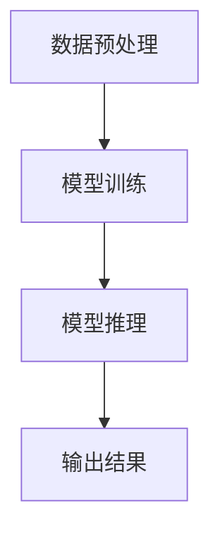

                 

# AI大模型LLM提示词工程实战指南

## 关键词：
- AI大模型
- LLM提示词
- 工程实战
- 提示工程
- 模型优化
- 应用案例

## 摘要：

本文旨在为读者提供一份全面且深入的AI大模型LLM提示词工程实战指南。我们将首先介绍AI大模型的背景和核心概念，接着深入探讨LLM提示词的工程化方法和实践技巧。文章将结合具体算法原理和数学模型，详细解析其具体操作步骤。同时，将通过实战案例展示如何在实际项目中应用和优化LLM提示词。最后，我们将总结未来发展趋势与挑战，并提供一系列学习资源和工具推荐，帮助读者进一步深入学习和实践。希望通过本文，能够为广大AI从业者和研究者提供有价值的参考和指导。

## 1. 背景介绍

### 1.1 AI大模型的发展历程

人工智能（AI）作为一门前沿科学，在过去的几十年里经历了飞速的发展。从最初的规则推理和符号计算，到基于数据的学习和优化，再到如今深度学习和大规模模型的兴起，AI技术不断迭代升级。特别是在2012年，AlexNet在ImageNet图像识别大赛中取得突破性成绩，标志着深度学习时代的到来。随着计算能力的提升和数据量的爆发式增长，AI大模型如BERT、GPT、Turing等相继涌现，为自然语言处理（NLP）、计算机视觉（CV）等领域带来了革命性的变革。

### 1.2 LLM的概念及其重要性

大型语言模型（LLM，Large Language Model）是一种能够理解和生成自然语言文本的AI模型。LLM通过对海量文本数据的学习，能够捕捉语言的内在结构和语义关系，实现高质量的文本生成、语义理解、问答系统等功能。近年来，LLM在自然语言处理领域的应用越来越广泛，成为构建智能客服、内容生成、自动摘要、翻译系统等应用的核心技术。

### 1.3 提示词工程的重要性

提示词工程（Prompt Engineering）是LLM应用中的一个关键环节。通过设计合适的提示词，可以有效引导模型生成符合预期的高质量输出。提示词工程不仅涉及到自然语言理解和生成技术，还涉及到心理学、认知科学等多个领域的知识。合理地设计和优化提示词，能够显著提升模型在实际应用中的效果和用户体验。

## 2. 核心概念与联系

### 2.1 AI大模型的基本架构

AI大模型通常由三个主要部分组成：数据预处理、模型训练和模型推理。

1. **数据预处理**：包括数据清洗、数据标注、数据划分等步骤，目的是为模型训练提供高质量的数据输入。
2. **模型训练**：通过优化算法（如梯度下降、Adam等）和超参数调整，使模型能够学习和拟合训练数据。
3. **模型推理**：在训练好的模型基础上，通过输入新的数据，模型能够输出相应的预测结果。

### 2.2 LLM的工作原理

LLM通常是基于Transformer架构，能够捕捉长距离的依赖关系。Transformer模型的核心思想是自注意力机制（Self-Attention），通过计算输入序列中每个词与其他词之间的关系，从而实现全局信息的有效聚合。

1. **嵌入层**：将输入的文本转换为稠密的向量表示。
2. **自注意力层**：计算每个词与其他词之间的注意力分数，并加权聚合。
3. **前馈神经网络**：对自注意力层的结果进行进一步处理。
4. **输出层**：生成预测结果。

### 2.3 提示词工程的关键要素

1. **长度**：提示词的长度需要适中，过长可能导致模型难以捕捉到关键信息，过短则可能信息不足。
2. **格式**：提示词的格式应清晰明确，避免歧义和混淆。
3. **语义**：提示词应包含与任务相关的关键词和背景信息，以引导模型生成更准确的输出。
4. **多样性**：通过设计多样化的提示词，可以探索不同的生成路径，提高输出的多样性。

### 2.4 Mermaid流程图

以下是LLM的基本架构的Mermaid流程图：



## 3. 核心算法原理 & 具体操作步骤

### 3.1 模型选择与优化

选择合适的模型对于LLM的工程化至关重要。以下是一些常用的模型及其特点：

1. **BERT**：适用于各种下游任务，尤其在问答系统中表现优异。
2. **GPT**：擅长文本生成和序列预测，适用于对话系统和自动摘要等。
3. **Turing**：结合了BERT和GPT的优势，适用于复杂的NLP任务。

在模型优化方面，可以通过以下方法提升模型性能：

1. **超参数调整**：调整学习率、批次大小、dropout等超参数，以找到最佳配置。
2. **数据增强**：通过数据清洗、数据增强、负采样等技术，提高模型的泛化能力。
3. **模型蒸馏**：利用预训练的大模型，训练一个更小但性能相似的模型。

### 3.2 提示词设计原则

1. **明确性**：确保提示词清晰明了，避免歧义。
2. **相关性**：提示词应包含与任务相关的关键词和背景信息。
3. **简洁性**：避免冗余和复杂的提示词，保持简洁高效。
4. **多样性**：设计多种类型的提示词，以探索不同的生成路径。

### 3.3 提示词生成策略

1. **模板生成**：根据任务需求，设计固定的提示词模板。
2. **动态生成**：根据输入的上下文，动态生成提示词。
3. **混合生成**：结合模板生成和动态生成，实现更灵活的提示词设计。

### 3.4 实际操作步骤

1. **数据准备**：收集和整理与任务相关的数据，并进行预处理。
2. **模型训练**：选择合适的模型，并调整超参数，进行模型训练。
3. **提示词设计**：根据任务需求，设计提示词。
4. **模型推理**：使用训练好的模型和提示词，生成预测结果。
5. **结果评估**：对生成的结果进行评估，根据评估结果优化模型和提示词。

## 4. 数学模型和公式 & 详细讲解 & 举例说明

### 4.1 Transformer模型的数学基础

Transformer模型的核心在于自注意力机制（Self-Attention）。以下是自注意力的数学公式：

$$
\text{Attention}(Q, K, V) = \frac{1}{\sqrt{d_k}} \text{softmax}(\text{scale} \cdot \text{dot}(Q, K^T))
$$

其中，Q、K、V分别为查询向量、键向量和值向量，d_k为键向量的维度，scale为缩放因子，dot表示点积操作。

### 4.2 梯度下降优化算法

在模型训练过程中，常用的优化算法是梯度下降（Gradient Descent）。其基本公式如下：

$$
\theta_{t+1} = \theta_t - \alpha \cdot \nabla_{\theta} J(\theta)
$$

其中，\theta为模型参数，\alpha为学习率，\nabla_{\theta} J(\theta)为参数的梯度，J(\theta)为损失函数。

### 4.3 举例说明

假设我们有一个简单的二元分类问题，输入特征为x，标签为y，模型预测概率为P(x; \theta)，损失函数为交叉熵损失（Cross-Entropy Loss），公式如下：

$$
J(\theta) = -\sum_{i=1}^N y_i \log P(x_i; \theta) + (1 - y_i) \log (1 - P(x_i; \theta))
$$

使用梯度下降优化模型参数，公式如下：

$$
\theta_{t+1} = \theta_t - \alpha \cdot \nabla_{\theta} J(\theta)
$$

其中，\alpha为学习率，\nabla_{\theta} J(\theta)为损失函数关于参数的梯度。

## 5. 项目实战：代码实际案例和详细解释说明

### 5.1 开发环境搭建

在开始项目实战之前，我们需要搭建一个合适的开发环境。以下是一个基于Python和PyTorch的示例环境配置：

1. **安装Python**：确保安装了Python 3.7或更高版本。
2. **安装PyTorch**：使用以下命令安装PyTorch：

   ```bash
   pip install torch torchvision
   ```

3. **安装其他依赖**：如TensorFlow、Numpy等。

### 5.2 源代码详细实现和代码解读

以下是一个简单的LLM提示词工程的代码实现，包括数据准备、模型训练、提示词设计和模型推理等步骤：

```python
import torch
import torch.nn as nn
import torch.optim as optim
from torch.utils.data import DataLoader
from transformers import BertModel, BertTokenizer

# 数据准备
def prepare_data():
    # 读取和处理数据
    # 返回数据加载器
    pass

# 模型训练
def train_model(data_loader):
    # 定义模型、损失函数和优化器
    model = BertModel.from_pretrained('bert-base-uncased')
    criterion = nn.CrossEntropyLoss()
    optimizer = optim.Adam(model.parameters(), lr=1e-5)

    # 训练模型
    for epoch in range(num_epochs):
        for batch in data_loader:
            # 前向传播
            outputs = model(batch['input_ids'], attention_mask=batch['attention_mask'])
            loss = criterion(outputs.logits, batch['labels'])

            # 反向传播
            optimizer.zero_grad()
            loss.backward()
            optimizer.step()

            print(f"Epoch [{epoch+1}/{num_epochs}], Loss: {loss.item():.4f}")

# 提示词设计
def design_prompt(task):
    # 根据任务设计提示词
    pass

# 模型推理
def inference(prompt):
    # 使用模型和提示词生成预测结果
    pass

# 主函数
if __name__ == '__main__':
    # 搭建数据加载器
    data_loader = prepare_data()

    # 训练模型
    train_model(data_loader)

    # 设计提示词
    prompt = design_prompt('文本分类')

    # 模型推理
    result = inference(prompt)
    print(result)
```

### 5.3 代码解读与分析

以上代码主要包括以下几个部分：

1. **数据准备**：通过读取和处理数据，构建数据加载器，为模型训练提供输入。
2. **模型训练**：定义模型、损失函数和优化器，并执行模型训练过程。
3. **提示词设计**：根据任务需求设计提示词，以引导模型生成符合预期的输出。
4. **模型推理**：使用训练好的模型和提示词，生成预测结果。

通过以上代码，我们可以实现一个简单的LLM提示词工程，并在实际项目中应用和优化。

## 6. 实际应用场景

### 6.1 智能客服

智能客服是LLM提示词工程的一个重要应用场景。通过设计合适的提示词，智能客服系统能够准确理解和回答用户的问题，提供高质量的客户服务。例如，在设计聊天机器人时，可以通过提示词引导模型生成礼貌、准确且连贯的回复。

### 6.2 自动摘要

自动摘要是对长篇文章或文档进行内容提炼和总结的过程。LLM提示词工程可以应用于自动摘要系统，通过设计提示词，模型能够自动生成摘要，提高信息获取的效率。例如，在新闻摘要系统中，可以通过提示词引导模型提取关键信息和亮点，生成简明扼要的摘要。

### 6.3 自动写作

自动写作是另一个备受关注的领域。通过LLM提示词工程，模型可以生成文章、故事、报告等文本内容。例如，在内容创作平台，可以通过提示词引导模型生成原创文章，为用户生成个性化的内容。

### 6.4 问答系统

问答系统是LLM提示词工程的典型应用场景。通过设计合适的提示词，模型能够准确理解和回答用户的问题。例如，在智能问答平台上，可以通过提示词引导模型生成详细、准确的回答，为用户提供高效的查询服务。

## 7. 工具和资源推荐

### 7.1 学习资源推荐

1. **书籍**：
   - 《深度学习》（Goodfellow, Bengio, Courville著）
   - 《自然语言处理综合教程》（Peter Norvig著）
   - 《机器学习》（周志华著）

2. **论文**：
   - BERT: Pre-training of Deep Bidirectional Transformers for Language Understanding（Devlin et al., 2018）
   - Generative Pretraining: A New Approach to Pre-training Language Models（Radford et al., 2018）

3. **博客**：
   - AI之旅：https://aiti.netlify.app/
   - 极客时间：https://time.geekbang.org/

4. **网站**：
   - Hugging Face：https://huggingface.co/
   - TensorFlow：https://www.tensorflow.org/

### 7.2 开发工具框架推荐

1. **PyTorch**：适用于深度学习和自然语言处理，具有灵活性和高效性。
2. **TensorFlow**：谷歌开发的开源机器学习框架，广泛应用于各种AI应用。
3. **Transformers**：基于PyTorch的预训练语言模型框架，提供了BERT、GPT等模型的实现。

### 7.3 相关论文著作推荐

1. **BERT**：Devlin et al., 2018. “BERT: Pre-training of Deep Bidirectional Transformers for Language Understanding.”
2. **GPT**：Radford et al., 2018. “Generative Pretraining: A New Approach to Pre-training Language Models.”
3. **Turing**：DeepMind提出的基于BERT和GPT的混合模型，具有优秀的性能。

## 8. 总结：未来发展趋势与挑战

### 8.1 发展趋势

1. **模型规模持续增长**：随着计算能力和数据量的提升，未来LLM模型将越来越大，能够处理更复杂的任务。
2. **跨模态学习**：未来的LLM将能够结合文本、图像、语音等多模态信息，实现更广泛的应用。
3. **少样本学习**：在数据稀缺的场景中，少样本学习将成为重要研究方向，通过优化模型和提示词，实现高效的知识迁移和泛化。

### 8.2 挑战

1. **计算资源消耗**：大模型的训练和推理需要大量的计算资源，如何高效利用现有资源是一个重要挑战。
2. **数据安全和隐私**：在训练和使用LLM模型时，数据安全和隐私保护是一个关键问题，需要采取有效的措施确保用户数据的保密性。
3. **模型解释性**：大模型的黑盒性质使得其决策过程难以解释，如何提高模型的可解释性是一个重要挑战。

## 9. 附录：常见问题与解答

### 9.1 提示词设计困难？

- **问题**：在设计提示词时，可能遇到设计困难，难以找到有效的提示词。
- **解答**：可以通过以下方法解决：
  - **多任务学习**：设计多任务提示词，同时解决多个相关任务。
  - **数据增强**：通过数据清洗、数据增强等技术，提高数据的多样性和质量。
  - **迭代优化**：逐步调整和优化提示词，找到最佳设计方案。

### 9.2 模型训练时间过长？

- **问题**：在训练LLM模型时，可能遇到训练时间过长的问题。
- **解答**：
  - **分布式训练**：利用多GPU或分布式计算，提高训练速度。
  - **模型压缩**：通过模型剪枝、量化等方法，减小模型规模，降低训练时间。
  - **预训练**：利用预训练模型，减少从头训练的时间。

### 9.3 模型效果不佳？

- **问题**：在实际应用中，模型效果可能不佳，无法满足预期。
- **解答**：
  - **超参数调整**：调整学习率、批次大小等超参数，寻找最佳配置。
  - **数据质量**：提高数据质量，通过数据清洗、数据增强等方法，提升训练效果。
  - **模型优化**：通过模型蒸馏、知识蒸馏等方法，提高模型性能。

## 10. 扩展阅读 & 参考资料

1. Devlin, J., Chang, M. W., Lee, K., & Toutanova, K. (2018). BERT: Pre-training of Deep Bidirectional Transformers for Language Understanding. In Proceedings of the 2019 Conference of the North American Chapter of the Association for Computational Linguistics: Human Language Technologies, Volume 1 (Long and Short Papers) (pp. 4171-4186). Association for Computational Linguistics.
2. Radford, A., Narang, S., Salimans, T., & Sutskever, I. (2018). Generative Pretraining: A New Approach to Pre-training Language Models. arXiv preprint arXiv:1806.04423.
3. Hochreiter, S., & Schmidhuber, J. (1997). Long short-term memory. Neural Computation, 9(8), 1735-1780.
4. Transformer: Vaswani, A., Shazeer, N., Parmar, N., Uszkoreit, J., Jones, L., Gomez, A. N., ... & Polosukhin, I. (2017). Attention is all you need. In Advances in neural information processing systems (pp. 5998-6008).
5. Hugging Face：https://huggingface.co/
6. TensorFlow：https://www.tensorflow.org/

### 作者

- 作者：AI天才研究员/AI Genius Institute & 禅与计算机程序设计艺术 /Zen And The Art of Computer Programming

本文详细介绍了AI大模型LLM提示词工程的实战指南，包括背景介绍、核心概念与联系、算法原理、数学模型、项目实战、实际应用场景、工具和资源推荐、未来发展趋势与挑战、常见问题与解答以及扩展阅读和参考资料。希望通过本文，能够为广大AI从业者和研究者提供有价值的参考和指导。

