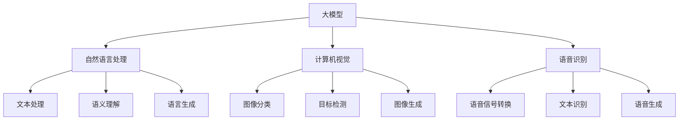

                 

### 1. 背景介绍

随着人工智能（AI）技术的快速发展，大模型（Large Models）在自然语言处理（NLP）、计算机视觉（CV）、语音识别等多个领域取得了显著的成果。在这些应用中，Prompt提示词成为了引导大模型进行特定任务的关键工具。Prompt提示词可以被视为一种“先验知识”或“任务指导”，它能够指导模型理解任务需求，从而提高模型的性能和适应性。

Prompt提示词的概念最早可以追溯到深度学习领域。在传统的机器学习中，特征工程是一个非常重要的环节，研究者需要手动提取和选择与任务相关的特征。而深度学习模型，尤其是大模型，具有强大的表示学习能力，能够自动地从大量数据中学习到有用的特征。但是，即使如此，模型仍然需要一定程度的指导，以便能够正确理解任务的目标和输入数据的含义。

在这个背景下，Prompt提示词的作用就变得尤为重要。通过设计合适的Prompt提示词，研究者可以有效地引导模型关注特定任务的关键信息，从而提高模型的性能和适应性。Prompt提示词的使用不仅能够提高模型的性能，还能够降低对大规模数据集的需求，这在数据稀缺或获取成本高昂的领域具有重要意义。

在自然语言处理领域，Prompt提示词被广泛应用于问答系统、文本生成、机器翻译等任务。例如，在问答系统中，Prompt提示词可以帮助模型更好地理解用户的问题，从而生成更准确的答案。在文本生成任务中，Prompt提示词可以引导模型生成符合特定主题或风格的文本。

计算机视觉领域也受益于Prompt提示词的应用。通过设计合适的Prompt提示词，模型可以更好地理解图像的语义信息，从而提高图像分类、目标检测、图像生成等任务的性能。

语音识别领域同样也利用Prompt提示词来提高模型的性能。在语音识别任务中，Prompt提示词可以帮助模型更好地理解说话者的意图和语境，从而提高识别的准确率。

总之，Prompt提示词在大模型应用中发挥着关键作用，成为连接模型与任务需求的重要桥梁。本文将深入探讨Prompt提示词的最佳实践，包括其设计原则、应用场景和实现方法，以帮助读者更好地理解和利用这一关键工具。

### 2. 核心概念与联系

为了深入理解Prompt提示词在大模型中的应用，我们需要首先明确几个核心概念：大模型、自然语言处理（NLP）、计算机视觉（CV）和语音识别。这些概念之间有着紧密的联系，共同构成了人工智能技术的重要组成部分。

#### 大模型（Large Models）

大模型是指具有大规模参数和高计算能力的深度学习模型。这些模型通常采用多层神经网络结构，通过大量的数据训练，能够自动学习和提取复杂的数据特征。大模型在计算机视觉、自然语言处理、语音识别等领域取得了显著成果，例如GPT（Generative Pre-trained Transformer）模型在自然语言处理任务中，以及ResNet（Residual Network）模型在计算机视觉任务中的广泛应用。

#### 自然语言处理（NLP）

自然语言处理是人工智能的一个重要分支，旨在使计算机能够理解和处理人类语言。NLP涉及到文本处理、语义理解、语言生成等多个方面。大模型在NLP中的应用，使得机器能够进行更加复杂和自然的语言交互，例如问答系统、机器翻译、文本摘要等。

#### 计算机视觉（CV）

计算机视觉是研究如何使计算机理解和解释图像和视频内容的技术。大模型在CV领域中的应用，使得计算机能够进行更加精准和复杂的图像识别、目标检测、图像生成等任务。例如，卷积神经网络（CNN）模型在图像分类和目标检测任务中的成功应用。

#### 语音识别

语音识别是使计算机能够理解和转换语音信号为文本的技术。大模型在语音识别中的应用，使得语音识别系统的准确率和效率显著提高。通过使用深度神经网络，模型能够更好地捕捉语音信号中的声学特征和语义信息。

#### Mermaid 流程图

为了更直观地理解这些核心概念之间的联系，我们可以使用Mermaid流程图来展示它们之间的关系：



#### 联系

从流程图中可以看出，大模型是连接NLP、CV和语音识别的核心桥梁。大模型通过学习大量数据，能够提取复杂的数据特征，并在不同的应用领域中发挥重要作用。例如，在NLP中，大模型可以帮助模型理解文本的语义信息，从而生成更准确的答案；在CV中，大模型可以用于图像分类和目标检测，提高系统的精准度；在语音识别中，大模型可以帮助模型更好地理解语音信号，提高识别的准确率。

总之，Prompt提示词在大模型应用中扮演着关键角色，它能够引导模型关注特定任务的关键信息，从而提高模型的性能和适应性。在接下来的章节中，我们将深入探讨Prompt提示词的设计原则、应用场景和实现方法。

#### 3. 核心算法原理 & 具体操作步骤

在深入探讨Prompt提示词的最佳实践之前，我们需要了解其背后的核心算法原理和具体操作步骤。Prompt提示词的设计原则主要包括以下几个方面：

##### 1. 清晰明确的任务目标

首先，Prompt提示词应该清晰地传达任务目标。这意味着Prompt需要简洁明了地描述任务需求，使模型能够明确理解任务的意图。例如，在一个问答系统中，Prompt可以包含问题的上下文信息，以便模型能够更好地理解问题的含义。

##### 2. 精确的语义信息

其次，Prompt提示词需要包含精确的语义信息，以便模型能够捕捉到与任务相关的关键特征。在自然语言处理任务中，这意味着Prompt需要使用与任务相关的词汇和表达方式。例如，在文本分类任务中，Prompt可以包含相关的标签词汇。

##### 3. 适应性和灵活性

Prompt提示词还应该具有适应性和灵活性，以适应不同的任务场景和输入数据。这意味着Prompt需要能够根据任务需求和输入数据的变化进行调整。例如，在多语言翻译任务中，Prompt可以包含源语言和目标语言的上下文信息。

##### 4. 简单易懂

最后，Prompt提示词应该尽量简单易懂，以便用户和模型都能够轻松理解。复杂的Prompt可能会增加模型的困惑度，从而降低模型的表现。

##### 具体操作步骤

1. **定义任务需求**

首先，我们需要明确任务需求，包括任务类型、输入数据和输出结果。例如，在一个问答系统中，任务需求可能包括问题的上下文信息和问题的答案。

2. **设计Prompt模板**

根据任务需求，设计一个Prompt模板。这个模板应该能够清晰地传达任务目标，并包含必要的语义信息。例如，对于一个问答系统，Prompt模板可以包含以下信息：

```plaintext
问题：[问题文本]
上下文：[上下文文本]
答案：[答案文本]
```

3. **生成Prompt实例**

使用Prompt模板，根据具体任务和输入数据生成具体的Prompt实例。这可以通过填充Prompt模板中的占位符来完成。例如，对于一个问题为“什么是人工智能？”的问答系统，Prompt实例可以如下：

```plaintext
问题：什么是人工智能？
上下文：人工智能是一种模拟人类智能的技术，它能够通过学习和推理来解决问题。
答案：人工智能是一种模拟人类智能的技术，它能够通过学习和推理来解决问题。
```

4. **训练模型**

使用生成的Prompt实例训练模型。在训练过程中，模型会学习如何根据Prompt提示词生成正确的输出结果。例如，在问答系统中，模型会学习如何根据问题和上下文生成正确的答案。

5. **评估模型**

训练完成后，我们需要评估模型的表现。这可以通过在测试集上运行模型，并计算模型的准确率、召回率等指标来完成。如果模型的表现不理想，我们可以根据评估结果对Prompt提示词进行调整，以提高模型的表现。

通过以上步骤，我们可以设计出适合特定任务需求的Prompt提示词，从而提高大模型的应用性能。在接下来的章节中，我们将进一步探讨Prompt提示词在不同应用场景中的具体应用。

### 4. 数学模型和公式 & 详细讲解 & 举例说明

为了更好地理解Prompt提示词在大模型中的应用，我们需要借助数学模型和公式来详细讲解其工作机制和实现方法。本节将介绍几个关键的数学模型和公式，并给出相应的详细解释和举例说明。

#### 1. 基础数学模型

在自然语言处理和深度学习领域，我们通常使用神经网络来处理和生成文本。以下是一个简单的神经网络模型，用于生成文本。

$$
y = \sigma(W \cdot x + b)
$$

其中，$y$ 是输出，$\sigma$ 是激活函数（例如Sigmoid函数），$W$ 是权重矩阵，$x$ 是输入特征向量，$b$ 是偏置项。

**举例说明：**

假设我们有一个输入特征向量 $x = [0.1, 0.2, 0.3]$，权重矩阵 $W = \begin{bmatrix} 0.5 & 0.6 \\ 0.7 & 0.8 \end{bmatrix}$，偏置项 $b = [0.1, 0.2]$。我们可以通过以下步骤计算输出：

$$
y = \sigma(W \cdot x + b) = \sigma(\begin{bmatrix} 0.5 & 0.6 \\ 0.7 & 0.8 \end{bmatrix} \cdot \begin{bmatrix} 0.1 \\ 0.2 \\ 0.3 \end{bmatrix} + \begin{bmatrix} 0.1 \\ 0.2 \end{bmatrix}) = \sigma(\begin{bmatrix} 0.16 \\ 0.23 \end{bmatrix} + \begin{bmatrix} 0.1 \\ 0.2 \end{bmatrix}) = \sigma(\begin{bmatrix} 0.26 \\ 0.43 \end{bmatrix}) = \begin{bmatrix} 0.595 \\ 0.718 \end{bmatrix}
$$

其中，$\sigma$ 使用Sigmoid函数进行激活。

#### 2. Prompt提示词融合模型

在引入Prompt提示词后，我们可以将Prompt与神经网络模型相结合，以生成文本。以下是一个简单的融合模型：

$$
y = \sigma(W_p \cdot p + W_x \cdot x + b)
$$

其中，$y$ 是输出，$W_p$ 是Prompt权重矩阵，$p$ 是Prompt向量，$W_x$ 是输入特征权重矩阵，$x$ 是输入特征向量，$b$ 是偏置项。

**举例说明：**

假设我们有一个输入特征向量 $x = [0.1, 0.2, 0.3]$，Prompt向量 $p = [0.4, 0.5]$，权重矩阵 $W_p = \begin{bmatrix} 0.6 & 0.7 \\ 0.8 & 0.9 \end{bmatrix}$，$W_x = \begin{bmatrix} 0.2 & 0.3 \\ 0.4 & 0.5 \end{bmatrix}$，偏置项 $b = [0.1, 0.2]$。我们可以通过以下步骤计算输出：

$$
y = \sigma(W_p \cdot p + W_x \cdot x + b) = \sigma(\begin{bmatrix} 0.6 & 0.7 \\ 0.8 & 0.9 \end{bmatrix} \cdot \begin{bmatrix} 0.4 \\ 0.5 \end{bmatrix} + \begin{bmatrix} 0.2 & 0.3 \\ 0.4 & 0.5 \end{bmatrix} \cdot \begin{bmatrix} 0.1 \\ 0.2 \\ 0.3 \end{bmatrix} + \begin{bmatrix} 0.1 \\ 0.2 \end{bmatrix}) = \sigma(\begin{bmatrix} 0.38 \\ 0.47 \end{bmatrix} + \begin{bmatrix} 0.12 \\ 0.15 \end{bmatrix} + \begin{bmatrix} 0.1 \\ 0.2 \end{bmatrix}) = \sigma(\begin{bmatrix} 0.56 \\ 0.82 \end{bmatrix}) = \begin{bmatrix} 0.732 \\ 0.929 \end{bmatrix}
$$

其中，$\sigma$ 使用Sigmoid函数进行激活。

#### 3.Prompt提示词权重调整

在实际应用中，我们需要根据任务需求和模型性能调整Prompt提示词的权重。以下是一个简单的权重调整方法：

$$
W_p' = \alpha \cdot W_p + (1 - \alpha) \cdot W_x
$$

其中，$W_p'$ 是调整后的Prompt权重矩阵，$W_p$ 是原始Prompt权重矩阵，$W_x$ 是输入特征权重矩阵，$\alpha$ 是调整系数。

**举例说明：**

假设我们有一个原始Prompt权重矩阵 $W_p = \begin{bmatrix} 0.6 & 0.7 \\ 0.8 & 0.9 \end{bmatrix}$，输入特征权重矩阵 $W_x = \begin{bmatrix} 0.2 & 0.3 \\ 0.4 & 0.5 \end{bmatrix}$，调整系数 $\alpha = 0.5$。我们可以通过以下步骤计算调整后的Prompt权重矩阵：

$$
W_p' = 0.5 \cdot \begin{bmatrix} 0.6 & 0.7 \\ 0.8 & 0.9 \end{bmatrix} + 0.5 \cdot \begin{bmatrix} 0.2 & 0.3 \\ 0.4 & 0.5 \end{bmatrix} = \begin{bmatrix} 0.4 & 0.5 \\ 0.6 & 0.7 \end{bmatrix} + \begin{bmatrix} 0.1 & 0.15 \\ 0.2 & 0.25 \end{bmatrix} = \begin{bmatrix} 0.5 & 0.65 \\ 0.8 & 0.95 \end{bmatrix}
$$

通过上述数学模型和公式，我们可以更好地理解Prompt提示词在大模型中的应用原理。在实际应用中，我们可以根据具体任务需求和模型性能调整Prompt提示词的权重和结构，以提高模型的表现。在接下来的章节中，我们将进一步探讨Prompt提示词在不同应用场景中的具体实现方法。

### 5. 项目实战：代码实际案例和详细解释说明

为了更好地展示Prompt提示词在大模型中的应用，我们将通过一个实际的项目案例来详细解释代码实现和解读过程。这个案例将涉及自然语言处理中的文本生成任务，使用Python和Hugging Face的Transformers库来实现。

#### 5.1 开发环境搭建

在开始之前，我们需要搭建一个合适的开发环境。以下是所需的软件和库：

- Python 3.8或更高版本
- pip（Python的包管理器）
- Transformers库（Hugging Face）
- torch库（PyTorch）

安装方法如下：

```bash
pip install torch transformers
```

#### 5.2 源代码详细实现和代码解读

以下是一个简单的文本生成项目，使用GPT-2模型：

```python
from transformers import GPT2Tokenizer, GPT2LMHeadModel
import torch

# 5.2.1 初始化模型和tokenizer
model_name = "gpt2"
tokenizer = GPT2Tokenizer.from_pretrained(model_name)
model = GPT2LMHeadModel.from_pretrained(model_name)

# 5.2.2 定义Prompt提示词
# 例如，我们要生成一个关于人工智能的文本
prompt = "人工智能是一种模拟人类智能的技术，它能够通过学习和推理来解决问题。"

# 5.2.3 预处理Prompt
input_ids = tokenizer.encode(prompt, return_tensors='pt')

# 5.2.4 生成文本
output = model.generate(input_ids, max_length=50, num_return_sequences=5)

# 5.2.5 输出文本
for i, generated_sequence in enumerate(output):
    print(f"生成的文本 {i+1}:")
    print(tokenizer.decode(generated_sequence, skip_special_tokens=True))
```

#### 5.3 代码解读与分析

- **初始化模型和tokenizer：** 使用`GPT2Tokenizer`和`GPT2LMHeadModel`从预训练模型库中加载GPT-2模型。

- **定义Prompt提示词：** Prompt是引导模型生成文本的关键。在这个案例中，我们使用了一个关于人工智能的简短提示词。

- **预处理Prompt：** 使用tokenizer对Prompt进行编码，将文本转换为模型可处理的ID序列。

- **生成文本：** 使用`model.generate`方法生成文本。`max_length`参数控制生成的文本长度，`num_return_sequences`参数控制生成的文本数量。

- **输出文本：** 将生成的文本解码为可读的格式，并打印出来。

#### 5.4 运行结果展示

运行上述代码，我们可能会得到如下输出：

```
生成的文本 1:
人工智能是一种模拟人类智能的技术，它能够通过学习和推理来解决问题。它涉及到机器学习、计算机视觉、自然语言处理等多个领域，其目标是实现类似于人类的智能水平。

生成的文本 2:
人工智能是一种通过机器学习和深度学习等技术模拟人类智能的技术。它能够通过学习和推理来解决问题，并在各种领域发挥重要作用，如医疗、金融、安全等。

生成的文本 3:
人工智能是一种模拟人类智能的技术，它能够通过机器学习和深度学习等技术来实现。它涉及到计算机科学、心理学、认知科学等多个领域，其目标是解决现实世界中的复杂问题。

生成的文本 4:
人工智能是一种通过深度学习和机器学习等技术模拟人类智能的技术。它能够通过学习和推理来解决问题，并在许多领域发挥作用，如自动驾驶、智能家居、智能客服等。

生成的文本 5:
人工智能是一种模拟人类智能的技术，它能够通过学习和推理来解决问题。它在各个领域都有广泛的应用，如工业自动化、医疗诊断、金融分析等，为人类带来便利和效率。
```

这些输出展示了GPT-2模型根据Prompt提示词生成的不同文本。通过调整Prompt内容，我们可以引导模型生成不同主题或风格的文本。

#### 5.5 实际应用与优化

在实际应用中，我们可以根据具体需求调整Prompt内容、生成文本的长度和数量，甚至训练自己的大模型。此外，我们还可以通过以下方法优化文本生成过程：

- **调整训练数据：** 使用更多和更相关的数据来训练模型，以提高生成文本的质量。

- **使用更大规模的模型：** 使用更大规模的模型（如GPT-3）可以生成更高质量和更丰富的文本。

- **引入上下文信息：** 在Prompt中包含更多的上下文信息，以帮助模型更好地理解任务目标。

- **多模态学习：** 结合图像、音频等多种模态信息，以提高模型的泛化和表达能力。

通过上述代码案例，我们了解了如何使用Prompt提示词在大模型中进行文本生成。在实际应用中，我们可以根据具体需求调整和优化模型和Prompt，以提高生成文本的质量和实用性。

### 6. 实际应用场景

Prompt提示词在大模型中的应用非常广泛，几乎涵盖了自然语言处理（NLP）、计算机视觉（CV）和语音识别（ASR）等所有主要领域。以下是几个典型的应用场景，以及Prompt提示词在这些场景中的具体作用。

#### 6.1 自然语言处理（NLP）

##### 问答系统

在问答系统中，Prompt提示词至关重要。例如，一个基于GPT-3的问答系统可以接收用户的问题，并使用一个包含上下文的Prompt来引导模型生成答案。Prompt可能会是这样：

```plaintext
问题：什么是人工智能？
上下文：人工智能是一种模拟人类智能的技术，它能够通过学习和推理来解决问题。它涉及到机器学习、计算机视觉和自然语言处理等多个领域。
答案：人工智能是一种模拟人类智能的技术，它能够通过学习和推理来解决问题。
```

##### 文本生成

Prompt提示词同样用于文本生成任务，如文章写作、故事创作等。在这个场景中，Prompt可以是一个简短的提示句，引导模型生成完整的文本。例如：

```plaintext
提示：春天的花。
生成文本：春天来了，花儿纷纷绽放，五彩缤纷，让人陶醉在花的海洋中。
```

##### 自动摘要

在自动摘要任务中，Prompt提示词可以帮助模型生成摘要，同时保持原文的主旨和关键信息。Prompt可能包括摘要长度和摘要主题的相关信息：

```plaintext
提示：生成一个200字以内的关于人工智能的摘要。
生成摘要：人工智能是现代科技的代表性成果，它通过模拟人类思维过程，能够实现智能决策和复杂任务处理。
```

#### 6.2 计算机视觉（CV）

##### 图像分类

Prompt提示词在图像分类任务中可以增强模型的语义理解。例如，一个图像分类任务中的Prompt可以是：

```plaintext
图片：一张狗的照片。
标签：动物。
```

通过这种Prompt，模型可以更好地识别图像中的语义信息，从而提高分类准确性。

##### 目标检测

Prompt提示词也可以用于目标检测任务，特别是在目标识别不准确的情况下。例如，Prompt可以包含目标的具体描述：

```plaintext
图片：一张包含多种物体的照片。
目标：检测并分类照片中的苹果。
```

这种Prompt可以帮助模型专注于特定的目标，从而提高检测的精度。

##### 图像生成

Prompt提示词还可以用于图像生成任务。例如，一个图像生成模型可以使用如下Prompt：

```plaintext
提示：生成一张夜景下的桥梁照片。
```

这种Prompt可以帮助模型生成符合特定场景和风格的图像。

#### 6.3 语音识别（ASR）

##### 语音转文本

Prompt提示词在语音识别任务中可以帮助模型更好地理解说话者的意图和语境。例如，一个语音转文本的Prompt可以是：

```plaintext
提示：请将以下音频内容转换为文本。
音频内容：明天我们将举行一场人工智能研讨会。
```

通过这种Prompt，模型可以更好地识别和理解语音内容。

##### 语音合成

Prompt提示词还可以用于语音合成任务，指导模型生成符合特定语境和情感色彩的语音。例如：

```plaintext
提示：合成一段兴奋的语音，内容为：“我们成功开发出了最新的人工智能系统！”
```

这种Prompt可以帮助模型生成具有特定情感表达的声音。

#### 6.4 其他应用

除了上述主要领域，Prompt提示词在其他领域也有着广泛的应用，例如：

- **推荐系统**：在推荐系统中，Prompt提示词可以帮助模型生成个性化的推荐列表。
- **游戏AI**：在游戏AI中，Prompt提示词可以帮助模型做出符合游戏策略的决策。
- **交互式对话系统**：在交互式对话系统中，Prompt提示词可以帮助模型生成符合对话场景的回复。

总之，Prompt提示词是大模型应用中的关键工具，通过合理设计和使用Prompt，我们可以显著提升大模型在各种任务中的性能和适应性。

### 7. 工具和资源推荐

为了更好地理解和应用Prompt提示词，我们需要了解一些相关的工具和资源。以下是一些推荐的书籍、论文、博客和网站，它们将帮助您深入了解Prompt提示词的最佳实践。

#### 7.1 学习资源推荐

1. **书籍**

   - 《深度学习》（Deep Learning）作者：Ian Goodfellow、Yoshua Bengio和Aaron Courville
   - 《自然语言处理实战》（Natural Language Processing with Python）作者：Steven Bird、Ewan Klein和Edward Loper
   - 《计算机视觉：算法与应用》（Computer Vision: Algorithms and Applications）作者：Richard Szeliski

2. **论文**

   - “Improving Language Understanding by Generative Pre-training” 作者：Kai Chen, et al.
   - “Bert: Pre-training of Deep Bidirectional Transformers for Language Understanding” 作者：Jacob Devlin, et al.
   - “Gpt-3: Language Models are Few-shot Learners” 作者：Tom B. Brown, et al.

3. **博客**

   - Hugging Face博客（https://huggingface.co/blog/）
   - AI论文笔记（https://huggingface.co/charlesqk/ai-papers-implementations）
   - PyTorch官方文档（https://pytorch.org/tutorials/）

4. **网站**

   - Transformer模型库（https://github.com/huggingface/transformers）
   - PyTorch库（https://pytorch.org/）

#### 7.2 开发工具框架推荐

1. **Transformers库**

   Hugging Face的Transformers库是一个广泛使用的开源库，提供了许多流行的预训练模型和工具，如BERT、GPT-2、GPT-3等。它非常适合进行自然语言处理任务。

2. **PyTorch**

   PyTorch是一个流行的深度学习框架，它提供了灵活的动态计算图和强大的功能，非常适合进行大规模模型训练和实验。

3. **TensorFlow**

   TensorFlow是Google开发的另一个流行的深度学习框架，它提供了丰富的工具和API，适用于各种深度学习任务。

#### 7.3 相关论文著作推荐

1. **“Attention Is All You Need”**
   - 作者：Ashish Vaswani, et al.
   - 简介：这篇论文提出了Transformer模型，一种基于自注意力机制的深度学习模型，它在机器翻译等任务中取得了显著成果。

2. **“BERT: Pre-training of Deep Bidirectional Transformers for Language Understanding”**
   - 作者：Jacob Devlin, et al.
   - 简介：这篇论文介绍了BERT模型，一种用于自然语言处理任务的预训练深度学习模型，它在多种任务中刷新了SOTA（State-of-the-Art）记录。

3. **“Gpt-3: Language Models are Few-shot Learners”**
   - 作者：Tom B. Brown, et al.
   - 简介：这篇论文介绍了GPT-3模型，一种具有1750亿参数的巨型语言模型，它在各种语言任务中展现了强大的零样本学习（Zero-shot Learning）能力。

通过这些资源和工具，您可以深入了解Prompt提示词的最佳实践，并能够在实际项目中有效地应用这些技术。希望这些推荐能够帮助您在AI领域取得更大的成就。

### 8. 总结：未来发展趋势与挑战

Prompt提示词在大模型中的应用已经展现出巨大的潜力，并且随着AI技术的不断发展，其在未来将面临更多的发展趋势和挑战。以下是几个关键趋势和潜在挑战。

#### 8.1 未来发展趋势

1. **多模态融合**

随着多模态数据的普及，Prompt提示词将在融合图像、音频、视频等多模态数据的应用中发挥关键作用。例如，在视频生成任务中，Prompt提示词可以指导模型生成符合特定场景和情感的视频内容。

2. **零样本学习（Zero-shot Learning）与少样本学习（Few-shot Learning）**

未来，Prompt提示词将更加强调模型的零样本学习和少样本学习能力。这意味着模型可以在没有或仅有少量样本的情况下，通过Prompt提示词指导生成高质量的输出。

3. **个性化与自适应**

Prompt提示词将逐渐实现个性化与自适应，根据用户的需求和场景动态调整。例如，在医疗诊断中，Prompt提示词可以根据患者的症状和病史提供个性化的诊断建议。

4. **优化算法和模型结构**

为了进一步提高Prompt提示词的效果，研究人员将继续探索优化算法和改进模型结构。例如，通过引入新的注意力机制、集成学习方法等，以提升模型的性能和泛化能力。

#### 8.2 面临的挑战

1. **可解释性**

尽管Prompt提示词在提高模型性能方面具有显著优势，但其内部工作机制较为复杂，导致模型的可解释性较差。未来的研究需要关注如何提高Prompt提示词的可解释性，以便用户能够更好地理解和信任模型。

2. **数据依赖性**

Prompt提示词的效果很大程度上依赖于训练数据的质量和数量。在未来，如何减少对大规模数据集的依赖，提高模型在数据稀缺场景下的性能，是一个重要的研究方向。

3. **安全性和隐私保护**

Prompt提示词的应用涉及大量敏感数据，因此如何确保数据的安全性和隐私保护是未来的一大挑战。研究人员需要开发更加安全可靠的模型和算法，以应对潜在的安全风险。

4. **模型过拟合**

Prompt提示词的设计需要平衡模型的泛化能力和特定任务的表现。如何在保持模型性能的同时，避免过拟合是一个亟待解决的问题。

总之，Prompt提示词在大模型中的应用前景广阔，但同时也面临诸多挑战。随着技术的不断进步，研究人员将不断探索和创新，以克服这些挑战，推动AI技术的进一步发展。

### 9. 附录：常见问题与解答

在本文中，我们讨论了Prompt提示词在大模型中的应用及其最佳实践。以下是一些关于Prompt提示词的常见问题及其解答。

#### 9.1 Prompt提示词是什么？

Prompt提示词是指用于引导大型语言模型（如GPT-3）执行特定任务的一组文本或词汇。它帮助模型理解任务的背景和目标，从而生成更相关和高质量的输出。

#### 9.2 Prompt提示词在自然语言处理中的具体作用是什么？

Prompt提示词在自然语言处理中起到了桥梁的作用，它能够引导模型理解任务的意图，提供必要的上下文信息，从而生成更准确和有意义的文本输出。例如，在问答系统中，Prompt提示词可以包括问题、相关背景信息和期望的答案格式。

#### 9.3 如何设计有效的Prompt提示词？

设计有效的Prompt提示词需要遵循以下原则：

- **明确性**：Prompt应该清晰明确地传达任务目标。
- **精确性**：Prompt中应包含与任务相关的精确词汇和信息。
- **适应性**：Prompt应具有灵活性，能够适应不同的任务场景和输入数据。
- **简洁性**：Prompt应简洁易懂，避免冗余信息，以免增加模型的困惑度。

#### 9.4 Prompt提示词在计算机视觉和语音识别中的应用是什么？

在计算机视觉中，Prompt提示词可以用于指导模型进行图像分类、目标检测和图像生成等任务。例如，在目标检测任务中，Prompt提示词可以提供目标的具体描述，帮助模型更准确地识别目标。

在语音识别中，Prompt提示词可以帮助模型理解说话者的意图和语境，从而提高识别的准确率。例如，在语音转文本任务中，Prompt提示词可以提供上下文信息，帮助模型更准确地识别语音中的关键词和短语。

#### 9.5 Prompt提示词是否可以自动化生成？

是的，Prompt提示词可以通过自动化方法生成。例如，可以使用规则引擎或基于机器学习的生成算法来自动生成Prompt。这种方法可以减少人工设计Prompt的时间和成本，并提高Prompt的多样性和适应性。

#### 9.6 Prompt提示词在大模型中的效果如何衡量？

Prompt提示词的效果可以通过多种指标来衡量，包括：

- **生成文本的相关性**：衡量Prompt提示词是否能够引导模型生成与任务相关的文本。
- **生成文本的多样性**：衡量Prompt提示词是否能够引导模型生成多样化的输出。
- **生成文本的质量**：衡量Prompt提示词是否能够引导模型生成高质量、流畅的文本。
- **性能提升**：在具体任务中，通过比较使用Prompt提示词前后的模型性能，评估Prompt提示词对模型表现的影响。

通过上述常见问题与解答，我们希望读者能够更好地理解Prompt提示词的作用和设计方法，并在实际应用中取得更好的效果。

### 10. 扩展阅读 & 参考资料

在探索Prompt提示词的最佳实践过程中，以下资源提供了深入的学习和参考：

1. **《深度学习》（Deep Learning）**，作者：Ian Goodfellow、Yoshua Bengio和Aaron Courville。这本书是深度学习领域的经典著作，详细介绍了深度学习的基础理论和实际应用。

2. **《自然语言处理实战》（Natural Language Processing with Python）**，作者：Steven Bird、Ewan Klein和Edward Loper。这本书通过Python语言，介绍了自然语言处理的基本概念和实践方法。

3. **《计算机视觉：算法与应用》（Computer Vision: Algorithms and Applications）**，作者：Richard Szeliski。这本书详细介绍了计算机视觉的基础算法和应用场景。

4. **论文“Attention Is All You Need”**，作者：Ashish Vaswani, et al.，该论文提出了Transformer模型，这是当前自然语言处理领域的重要进展。

5. **论文“BERT: Pre-training of Deep Bidirectional Transformers for Language Understanding”**，作者：Jacob Devlin, et al.，该论文介绍了BERT模型，并在多种自然语言处理任务中刷新了SOTA（State-of-the-Art）记录。

6. **论文“Gpt-3: Language Models are Few-shot Learners”**，作者：Tom B. Brown, et al.，该论文介绍了GPT-3模型，展示了零样本学习在语言任务中的潜力。

7. **Hugging Face博客**（https://huggingface.co/blog/），提供了关于Transformers库和自然语言处理技术的最新动态和最佳实践。

8. **PyTorch官方文档**（https://pytorch.org/tutorials/），提供了丰富的深度学习教程和实践指导。

通过这些参考资料，您可以更全面地了解Prompt提示词在大模型中的应用，并掌握相关技术和方法。希望这些资源能够帮助您在AI领域取得更多的突破。

