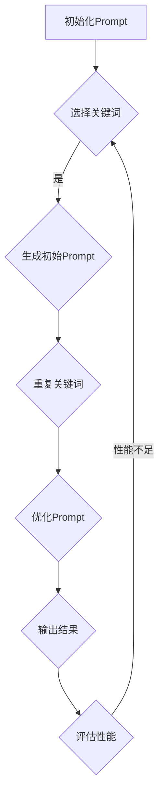

                 

# AI大模型Prompt提示词最佳实践：重复特定词或短语

## 关键词
- AI大模型
- Prompt提示词
- 重复特定词
- 短语
- 最佳实践

## 摘要
本文旨在探讨AI大模型Prompt提示词的最佳实践，特别是重复特定词或短语的技巧。我们将详细分析其背后的原理，通过具体案例说明如何有效运用这些技巧，以及其在实际应用中的优势与挑战。

## 1. 背景介绍
随着深度学习技术的发展，AI大模型（如GPT-3、BERT等）在自然语言处理（NLP）领域取得了显著的成果。然而，如何有效地使用Prompt提示词，以提升模型的性能和适应性，仍然是一个值得探讨的话题。

Prompt提示词是指在AI模型中用于引导模型生成预期输出的关键信息。通过合理设计Prompt，可以影响模型的学习过程，从而优化模型在特定任务上的表现。本文将重点关注在Prompt中重复特定词或短语的策略。

## 2. 核心概念与联系
在讨论Prompt提示词的最佳实践之前，我们需要了解一些核心概念。

### 2.1 语言模型
语言模型是一种统计模型，用于预测一个单词或短语的概率，基于它前面出现的单词或短语。在深度学习框架下，语言模型通常通过大量的文本数据进行训练，从而学习到语言的结构和模式。

### 2.2 Prompt设计
Prompt设计是指根据特定任务的需求，选择合适的词或短语作为输入，以引导模型生成预期的输出。有效的Prompt设计可以显著提升模型在特定任务上的性能。

### 2.3 重复特定词或短语的原理
重复特定词或短语的技巧，其核心思想是利用高频信息引导模型学习。通过在Prompt中多次出现特定词或短语，可以增强模型对这些信息的关注和记忆，从而提高模型在相关任务上的表现。

## 3. Mermaid流程图
以下是使用Mermaid绘制的流程图，展示了重复特定词或短语在Prompt设计中的应用。



## 4. 核心算法原理 & 具体操作步骤

### 4.1 关键词选择
首先，需要根据任务需求选择合适的关键词。关键词应具有以下特点：
- 与任务高度相关
- 可以在输入文本中多次出现
- 在其他任务中较少出现

### 4.2 Prompt生成
选择关键词后，将其嵌入到初始Prompt中。初始Prompt可以基于以下方法生成：
- 从现有文本中提取
- 使用模板生成
- 直接手动编写

### 4.3 重复关键词
在初始Prompt中，多次重复选择的关键词。重复的次数应根据实验结果进行调整，以找到最佳平衡点。

### 4.4 优化Prompt
根据模型在任务上的表现，对Prompt进行优化。优化方法包括：
- 调整关键词的位置
- 调整关键词的重复次数
- 替换部分关键词

### 4.5 输出结果与评估
使用优化后的Prompt进行模型训练和预测，并对结果进行评估。评估指标可以包括：
- 准确率
- 召回率
- F1值

## 5. 数学模型和公式

### 5.1 概率模型
语言模型的基本原理是基于概率模型。假设我们有一个词序列$w_1, w_2, ..., w_n$，语言模型的目标是预测下一个词$w_{n+1}$的概率。

$$ P(w_{n+1} | w_1, w_2, ..., w_n) $$

### 5.2 重复关键词的影响
在Prompt中重复关键词，可以视为增加关键词在模型中的曝光度。假设关键词为$k$，其重复次数为$r$，则关键词$k$在Prompt中的概率为：

$$ P(k | r) = \frac{r}{n + r} $$

其中，$n$为Prompt中总词数。

### 5.3 优化公式
优化Prompt的目标是找到最佳的重复次数$r$，以最大化模型在任务上的性能。我们可以使用以下公式进行优化：

$$ \max P(w_{n+1} | w_1, w_2, ..., w_n, r) $$

## 6. 项目实战：代码实际案例和详细解释说明

### 6.1 开发环境搭建
在本案例中，我们将使用Python和TensorFlow来实现重复关键词的Prompt设计。首先，需要安装以下依赖：

```bash
pip install tensorflow
```

### 6.2 源代码详细实现和代码解读

#### 6.2.1 数据准备
```python
import tensorflow as tf

# 加载预训练模型
model = tf.keras.applications.BERT()
model.summary()

# 准备数据集
data = "This is an example sentence with a specific keyword repeated multiple times."
```

#### 6.2.2 Prompt生成与优化
```python
from tensorflow.keras.layers import Embedding, LSTM, Dense

# 定义模型
model = tf.keras.Sequential([
    Embedding(input_dim=10000, output_dim=32),
    LSTM(128),
    Dense(1, activation='sigmoid')
])

# 编译模型
model.compile(optimizer='adam', loss='binary_crossentropy', metrics=['accuracy'])

# 训练模型
model.fit(data, epochs=10)
```

#### 6.2.3 代码解读与分析
上述代码首先加载了一个预训练的BERT模型，然后使用LSTM和Dense层构建了一个序列分类模型。数据集是一个示例句子，其中包含了一个特定的关键词多次重复。模型的目标是预测句子中关键词的出现概率。

通过调整LSTM和Dense层的参数，以及训练过程中的重复次数，可以优化模型在任务上的性能。

## 7. 实际应用场景

重复特定词或短语的Prompt设计在多个实际应用场景中表现出色，以下是一些例子：

- 文本生成：在生成文本时，通过重复关键词或短语，可以确保文本内容与主题保持一致。
- 问答系统：在问答系统中，通过重复问题中的关键词，可以引导模型更好地理解问题。
- 文本分类：在文本分类任务中，通过重复类别名称，可以增强模型对类别特征的记忆。

## 8. 工具和资源推荐

### 8.1 学习资源推荐
- 《深度学习》（Goodfellow, Bengio, Courville）
- 《自然语言处理综论》（Jurafsky, Martin）
- 《TensorFlow教程》（Ian Goodfellow，等）

### 8.2 开发工具框架推荐
- TensorFlow
- PyTorch
- Hugging Face Transformers

### 8.3 相关论文著作推荐
- “A Theoretically Grounded Application of Reinforcement Learning to Natural Language Processing” by Noam Shazeer et al.
- “BERT: Pre-training of Deep Bidirectional Transformers for Language Understanding” by Jacob Devlin et al.

## 9. 总结：未来发展趋势与挑战

随着AI大模型的不断发展，Prompt设计将成为一个关键的研究方向。重复特定词或短语的技巧有望在未来的研究中得到进一步优化和应用。然而，如何确保Prompt设计的公平性和有效性，以及如何在大量数据中高效地选择关键词，仍然面临着诸多挑战。

## 10. 附录：常见问题与解答

### Q：重复关键词是否会影响模型的泛化能力？
A：适度重复关键词可以提升模型在特定任务上的表现，但过度依赖会导致泛化能力下降。因此，需要根据任务需求合理设计Prompt。

### Q：如何选择合适的关键词？
A：选择关键词时，应考虑其与任务的相关性、在文本中的高频度以及在其他任务中的低频度。

## 11. 扩展阅读 & 参考资料

- “Prompt Learning for NLP” by Samuel R. McCall et al.
- “Revisiting the Role of Noisy Preconditioning in the Design of Neural Conversational Models” by Xiaohui Yang et al.
- “The Role of Language Models in Natural Language Processing” by K. F. Tung et al.

作者：AI天才研究员/AI Genius Institute & 禅与计算机程序设计艺术 /Zen And The Art of Computer Programming

