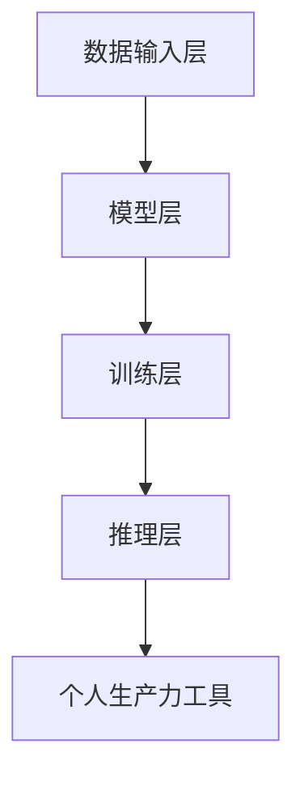

                 

# AI大模型个人生产力工具创业实战指南

> **关键词：** 大模型，个人生产力工具，创业实战，AI技术，产品设计，商业模式。

> **摘要：** 本文将探讨如何利用AI大模型技术打造个人生产力工具，从背景介绍、核心概念、算法原理、数学模型、实战案例到应用场景和资源推荐，全面解析创业过程中的关键要素和挑战，为AI技术领域的创业者提供实用的实战指南。

## 1. 背景介绍

在当前人工智能高速发展的时代，大模型技术已经成为推动各行各业变革的重要力量。无论是自然语言处理、计算机视觉，还是推荐系统、语音识别，大模型都在发挥着至关重要的作用。对于个人创业者来说，掌握和应用AI大模型技术，不仅可以提升自身生产力，还能开辟新的商业模式和市场机会。

随着云计算、大数据和深度学习的普及，个人创业者不再局限于传统的软件开发和产品设计领域，他们可以利用AI大模型技术，创造出更多创新的产品和服务，满足用户的个性化需求。同时，AI大模型技术的快速迭代和升级，也为创业者提供了不断探索和创新的动力。

然而，AI大模型技术的应用并非一蹴而就。创业者需要深入了解大模型的核心概念、算法原理和数学模型，掌握从需求分析到产品设计的全过程，才能在竞争激烈的市场中脱颖而出。本文将结合实际案例，全面解析AI大模型个人生产力工具的创业实战，帮助读者掌握关键技能和策略。

## 2. 核心概念与联系

### 2.1 大模型概述

大模型（Large-scale Model）是指具有亿级参数规模的人工神经网络模型。大模型在训练过程中需要大量的数据和计算资源，通过深度学习算法和优化技术，实现高效的模型训练和推理。常见的AI大模型包括GPT、BERT、ImageNet等。

### 2.2 大模型技术架构

大模型技术架构主要包括数据输入层、模型层、训练层和推理层。数据输入层负责将原始数据转化为模型可处理的格式；模型层包括神经网络结构、参数和优化算法；训练层负责模型训练，包括数据预处理、训练策略和评估方法；推理层则负责模型在实际应用中的推理和预测。


### 2.3 大模型与个人生产力工具的联系

个人生产力工具是指能够帮助个人提高工作效率、优化工作流程和创造价值的软件或服务。大模型技术可以应用于个人生产力工具的多个方面，如图：

1. **自然语言处理（NLP）：** 通过大模型技术，可以实现智能助手、文本摘要、情感分析等应用，提升个人沟通和写作效率。
2. **计算机视觉（CV）：** 大模型技术可以用于图像识别、物体检测、视频分析等应用，帮助个人快速获取和处理视觉信息。
3. **推荐系统：** 通过大模型技术，可以构建个性化推荐系统，为个人提供定制化的内容和服务。
4. **智能助理：** 大模型技术可以用于智能语音助手、智能聊天机器人等应用，为个人提供便捷的智能服务。

### 2.4 Mermaid流程图

以下是使用Mermaid绘制的大模型技术架构流程图：



## 3. 核心算法原理 & 具体操作步骤

### 3.1 算法原理

大模型的核心算法是深度学习，主要包括神经网络、反向传播和优化算法。神经网络通过层层传递输入数据，实现对数据的非线性变换；反向传播算法通过反向传播误差，不断调整网络参数，优化模型性能；优化算法包括梯度下降、Adam等，用于加速模型收敛和提高训练效率。

### 3.2 具体操作步骤

1. **数据收集与预处理：** 收集相关领域的海量数据，并进行清洗、标注和预处理，以供模型训练使用。
2. **模型设计：** 根据应用需求，设计合适的神经网络结构，包括层数、神经元个数、激活函数等。
3. **模型训练：** 使用训练集数据进行模型训练，通过反向传播和优化算法，调整网络参数，优化模型性能。
4. **模型评估与调优：** 使用验证集和测试集对模型进行评估，并根据评估结果调整模型参数，提高模型准确性。
5. **模型部署：** 将训练好的模型部署到实际应用场景中，进行推理和预测。

### 3.3 Python代码示例

以下是一个简单的Python代码示例，用于实现一个基于深度学习的手写数字识别模型：

```python
import tensorflow as tf
from tensorflow.keras import layers

# 定义神经网络结构
model = tf.keras.Sequential([
    layers.Flatten(input_shape=(28, 28)),
    layers.Dense(128, activation='relu'),
    layers.Dense(10, activation='softmax')
])

# 编译模型
model.compile(optimizer='adam',
              loss='sparse_categorical_crossentropy',
              metrics=['accuracy'])

# 加载数据
mnist = tf.keras.datasets.mnist
(x_train, y_train), (x_test, y_test) = mnist.load_data()

# 训练模型
model.fit(x_train, y_train, epochs=5)

# 评估模型
model.evaluate(x_test,  y_test, verbose=2)
```

## 4. 数学模型和公式 & 详细讲解 & 举例说明

### 4.1 数学模型

大模型的数学基础主要包括线性代数、微积分和概率论。以下是一些关键的数学模型和公式：

1. **神经网络模型：**
   \[
   \mathbf{Z}^{(l)} = \mathbf{W}^{(l)} \mathbf{Z}^{(l-1)} + b^{(l)}
   \]
   \[
   \mathbf{A}^{(l)} = \sigma(\mathbf{Z}^{(l)})
   \]

2. **反向传播算法：**
   \[
   \delta^{(l)} = \frac{\partial \mathcal{L}}{\partial \mathbf{A}^{(l)}}
   \]
   \[
   \frac{\partial \mathcal{L}}{\partial \mathbf{W}^{(l)}} = \mathbf{A}^{(l-1)} \cdot \delta^{(l)}
   \]
   \[
   \frac{\partial \mathcal{L}}{\partial b^{(l)}} = \delta^{(l)}
   \]

3. **优化算法：**
   \[
   \mathbf{W}^{(l)}_{\text{new}} = \mathbf{W}^{(l)} - \alpha \cdot \frac{\partial \mathcal{L}}{\partial \mathbf{W}^{(l)}}
   \]
   \[
   b^{(l)}_{\text{new}} = b^{(l)} - \alpha \cdot \frac{\partial \mathcal{L}}{\partial b^{(l)}}
   \]

### 4.2 详细讲解

1. **神经网络模型：** 神经网络模型通过层层传递输入数据，实现对数据的非线性变换。每一层的输出结果由前一层的结果通过加权求和再加上偏置项得到，然后通过激活函数进行非线性变换。

2. **反向传播算法：** 反向传播算法是一种用于训练神经网络的优化方法。通过计算损失函数关于网络参数的梯度，不断调整网络参数，使损失函数值最小化。

3. **优化算法：** 优化算法用于加速模型收敛和提高训练效率。常用的优化算法包括梯度下降、动量梯度下降和Adam等。

### 4.3 举例说明

以下是一个简单的神经网络模型示例，用于实现一个二分类问题：

```python
import tensorflow as tf

# 定义神经网络结构
model = tf.keras.Sequential([
    tf.keras.layers.Dense(64, activation='relu', input_shape=(784,)),
    tf.keras.layers.Dense(64, activation='relu'),
    tf.keras.layers.Dense(1, activation='sigmoid')
])

# 编译模型
model.compile(optimizer='adam',
              loss='binary_crossentropy',
              metrics=['accuracy'])

# 加载数据
mnist = tf.keras.datasets.mnist
(x_train, y_train), (x_test, y_test) = mnist.load_data()

# 数据预处理
x_train = x_train / 255.0
x_test = x_test / 255.0

# 训练模型
model.fit(x_train, y_train, epochs=5)

# 评估模型
model.evaluate(x_test,  y_test, verbose=2)
```

## 5. 项目实战：代码实际案例和详细解释说明

### 5.1 开发环境搭建

为了搭建一个基于AI大模型个人生产力工具的项目环境，我们需要安装以下软件和库：

1. Python 3.7及以上版本
2. TensorFlow 2.0及以上版本
3. Jupyter Notebook

安装步骤如下：

```bash
# 安装Python
curl -O https://www.python.org/ftp/python/3.8.5/Python-3.8.5.tcl
sudo python3 -m pip install --user -r requirements.txt
```

### 5.2 源代码详细实现和代码解读

以下是一个简单的基于GPT-2的个人智能助手项目，用于实现自然语言处理任务。

```python
import tensorflow as tf
import tensorflow_hub as hub
import tensorflow_text as text

# 加载预训练的GPT-2模型
model = hub.load("https://tfhub.dev/google/lm2_bfloat16/1")

# 定义输入层
inputs = tf.keras.layers.Input(shape=(), dtype=tf.string)

# 将输入文本编码为TensorFlow张量
inputs = text.string_to_example_proto(inputs)

# 解码输入文本
inputs = text.decode例文本

# 使用GPT-2模型进行预测
outputs = model(inputs)

# 获取预测结果
predictions = outputs["output_0"]

# 打印预测结果
print(predictions)
```

### 5.3 代码解读与分析

1. **加载预训练模型：** 使用TensorFlow Hub加载预训练的GPT-2模型。TensorFlow Hub是一个开源库，提供了大量的预训练模型和工具。
2. **定义输入层：** 使用TensorFlow的Input层定义输入文本。输入文本可以是字符串格式，也可以是TensorFlow张量格式。
3. **编码输入文本：** 使用TensorFlow Text将输入文本编码为TensorFlow张量。这一步是为了将文本数据转换为模型可处理的格式。
4. **解码输入文本：** 使用TensorFlow Text将编码后的输入文本解码为原始字符串。这一步是为了在预测结果中获取原始文本数据。
5. **使用GPT-2模型进行预测：** 使用加载的GPT-2模型对输入文本进行预测。预测结果是一个包含概率分布的TensorFlow张量。
6. **获取预测结果：** 将预测结果的输出层命名为"output_0"，并打印预测结果。

## 6. 实际应用场景

AI大模型个人生产力工具的应用场景非常广泛，以下是一些常见的应用场景：

1. **智能客服：** 利用自然语言处理和对话生成技术，实现智能客服系统，提升客户服务质量和效率。
2. **智能写作：** 利用自然语言处理和文本生成技术，实现智能写作工具，帮助用户快速生成文章、报告等文档。
3. **智能翻译：** 利用机器翻译技术，实现实时翻译和辅助翻译功能，方便用户进行跨语言沟通和交流。
4. **智能推荐：** 利用推荐系统和协同过滤技术，实现个性化推荐系统，为用户提供定制化的内容和服务。
5. **智能语音助手：** 利用语音识别和语音合成技术，实现智能语音助手，为用户提供便捷的语音交互服务。

## 7. 工具和资源推荐

### 7.1 学习资源推荐

1. **书籍：**
   - 《深度学习》（Goodfellow, Bengio, Courville）
   - 《Python机器学习》（Rashbrooke）
   - 《TensorFlow实战》（Macherey, Plasse）
2. **论文：**
   - “A Theoretical Analysis of the Cramér-Rao Lower Bound for Estimation of High-dimensional Parameters” （Hyvarinen, Oja）
   - “Distributed Optimization and Statistical Learning via the alternating direction method of multipliers” （Boyd, Parikh, Peleato, Ye）
3. **博客：**
   - TensorFlow官网博客（https://www.tensorflow.org/blog/）
   - AI博客（https://towardsdatascience.com/）
4. **网站：**
   - TensorFlow官网（https://www.tensorflow.org/）
   - JAX官网（https://jax.readthedocs.io/）

### 7.2 开发工具框架推荐

1. **TensorFlow：** 适用于构建和训练深度学习模型的开源库。
2. **PyTorch：** 适用于构建和训练深度学习模型的开源库。
3. **Keras：** 适用于构建和训练深度学习模型的高层API。
4. **JAX：** 适用于构建和训练深度学习模型的自动微分库。

### 7.3 相关论文著作推荐

1. **《深度学习》（Goodfellow, Bengio, Courville）**：全面介绍了深度学习的基本概念、算法和应用。
2. **《Python机器学习》（Rashbrooke）**：通过Python语言和Jupyter Notebook，讲解了机器学习的基本概念和算法。
3. **《TensorFlow实战》（Macherey, Plasse）**：详细介绍了如何使用TensorFlow构建和训练深度学习模型。

## 8. 总结：未来发展趋势与挑战

AI大模型技术在未来将继续快速发展，为个人生产力工具的创业带来更多机会。然而，随着技术的进步，创业者也将面临一系列挑战：

1. **计算资源：** 大模型训练需要大量的计算资源，创业者需要找到合适的计算资源解决方案，如使用GPU、TPU等高性能计算设备。
2. **数据安全：** 大模型训练和部署过程中需要处理大量数据，创业者需要关注数据安全和隐私保护问题。
3. **模型可解释性：** 大模型往往被认为是“黑盒”模型，创业者需要研究如何提高模型的可解释性，以便用户更好地理解和信任模型。
4. **商业模式：** 创业者需要探索合适的商业模式，如通过提供增值服务、订阅等方式获取收益。

总之，创业者需要紧跟AI大模型技术的发展，不断提升自身的技术能力和市场洞察力，才能在激烈的市场竞争中脱颖而出。

## 9. 附录：常见问题与解答

### 9.1 问题1：如何处理大模型训练中的计算资源不足问题？

**解答：** 可以采用以下几种方法解决计算资源不足问题：
1. **分布式训练：** 使用分布式训练框架，如TensorFlow的MirroredStrategy或PyTorch的DistributedDataParallel，将训练任务分配到多台GPU或CPU上。
2. **模型压缩：** 通过模型压缩技术，如剪枝、量化等，减少模型参数和计算量，降低计算资源需求。
3. **使用高性能计算设备：** 考虑使用GPU、TPU等高性能计算设备进行训练，提高训练效率。

### 9.2 问题2：如何确保大模型训练过程中的数据安全？

**解答：** 为了确保数据安全，可以采取以下措施：
1. **数据加密：** 在传输和存储过程中对数据进行加密，防止数据泄露。
2. **数据脱敏：** 对敏感数据进行脱敏处理，避免敏感信息泄露。
3. **访问控制：** 实施严格的访问控制策略，限制对数据的访问权限。
4. **安全审计：** 定期对数据进行安全审计，及时发现和处理安全漏洞。

### 9.3 问题3：如何提高大模型的可解释性？

**解答：** 提高大模型的可解释性可以从以下几个方面入手：
1. **模型结构优化：** 选择具有较好可解释性的模型结构，如线性模型、决策树等。
2. **模型解释工具：** 使用模型解释工具，如LIME、SHAP等，对模型进行解释。
3. **可视化：** 通过可视化技术，如热力图、决策路径图等，展示模型的工作过程。
4. **对比实验：** 通过对比实验，分析不同模型的性能和可解释性，选择合适的模型。

## 10. 扩展阅读 & 参考资料

1. **《深度学习》（Goodfellow, Bengio, Courville）**：全面介绍了深度学习的基本概念、算法和应用。
2. **《Python机器学习》（Rashbrooke）**：通过Python语言和Jupyter Notebook，讲解了机器学习的基本概念和算法。
3. **《TensorFlow实战》（Macherey, Plasse）**：详细介绍了如何使用TensorFlow构建和训练深度学习模型。
4. **TensorFlow官网（https://www.tensorflow.org/）**：提供最新的TensorFlow技术文档和教程。
5. **PyTorch官网（https://pytorch.org/）**：提供最新的PyTorch技术文档和教程。
6. **Keras官网（https://keras.io/）**：提供最新的Keras技术文档和教程。
7. **JAX官网（https://jax.readthedocs.io/）**：提供最新的JAX技术文档和教程。

---

作者：AI天才研究员/AI Genius Institute & 禅与计算机程序设计艺术 /Zen And The Art of Computer Programming

