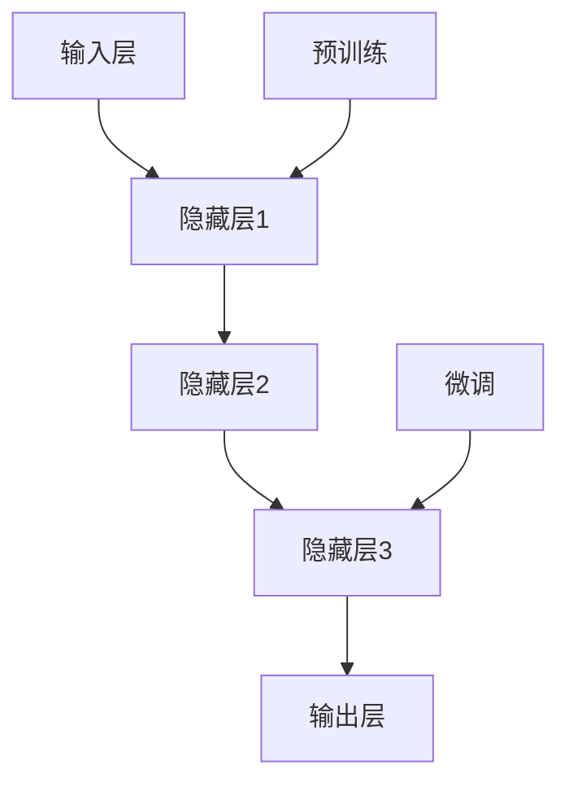
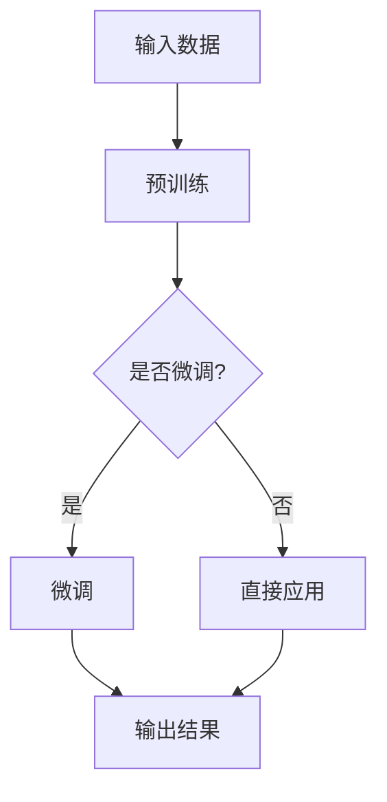

                 

## 文章标题

### AI大模型创业战：挑战与机遇并存的趋势分析

在当今人工智能领域，大规模预训练模型（Large-scale Pretrained Models，简称LPMs）如BERT、GPT和T5等，以其强大的能力和广泛的应用场景，成为了技术创新和商业应用的热点。本文将围绕AI大模型在创业领域的挑战与机遇，通过深入分析技术原理、实际应用、市场趋势，为创业者提供有益的参考。

## 关键词

- AI大模型
- 创业
- 挑战
- 机遇
- 技术趋势
- 应用场景
- 市场分析

## 摘要

本文首先介绍了AI大模型的发展背景和核心概念，然后分析了AI大模型创业的挑战，包括计算资源、数据集和算法优化等方面。接着，本文探讨了AI大模型创业的机遇，以及如何抓住这些机遇。最后，本文总结了AI大模型创业的未来发展趋势和挑战，为创业者提供了策略建议。通过本文的分析，读者可以更深入地了解AI大模型创业的现状和前景。

---

## 1. 背景介绍

### 1.1 AI大模型的发展历程

AI大模型的发展历程可以追溯到2012年，当时Google推出的深度神经网络（DNN）——AlexNet在ImageNet竞赛中取得了惊人的成绩。随后，研究人员开始探索更深的网络结构，如GoogLeNet和ResNet等。2018年，Google发布了BERT模型，开启了基于Transformer架构的AI大模型时代。BERT的成功引发了业界对大规模预训练模型的研究热潮，随后GPT、T5等模型相继问世。

### 1.2 AI大模型的核心概念

AI大模型通常具有以下核心概念：

- **大规模预训练**：在大量数据上进行预训练，使模型具备对自然语言的理解和生成能力。
- **自监督学习**：在数据缺乏标签的情况下，通过自监督学习方式，使模型自动学习数据中的信息。
- **多任务学习**：通过预训练，模型可以应对多种任务，提高泛化能力。
- **适应性**：AI大模型具有较强的适应性，可以根据不同的任务进行微调和优化。

### 1.3 AI大模型的应用场景

AI大模型在多个领域具有广泛的应用场景，如：

- **自然语言处理（NLP）**：文本分类、机器翻译、问答系统、文本生成等。
- **计算机视觉（CV）**：图像分类、目标检测、图像生成等。
- **语音识别**：语音转文字、语音合成等。
- **推荐系统**：基于用户行为和偏好，提供个性化推荐。

---

## 2. 核心概念与联系

### 2.1 AI大模型的基本原理

AI大模型的基本原理主要基于深度学习和自监督学习。深度学习通过多层神经网络，实现对数据的抽象和特征提取。自监督学习则利用未标记的数据，通过预训练使模型具备自主学习的能力。

### 2.2 AI大模型的架构

AI大模型的架构主要包括以下几个部分：

- **输入层**：接收原始数据，如文本、图像等。
- **隐藏层**：通过多层神经网络，对输入数据进行特征提取和抽象。
- **输出层**：根据任务需求，输出预测结果或生成结果。

### 2.3 AI大模型的关键技术

AI大模型的关键技术包括：

- **Transformer架构**：通过自注意力机制，实现模型对输入数据的全局理解。
- **预训练与微调**：在大量数据上进行预训练，然后针对特定任务进行微调。
- **多任务学习**：通过共享参数和共享网络结构，提高模型的泛化能力。

### 2.4 AI大模型的Mermaid流程图



### 2.5 AI大模型与其他技术的联系

AI大模型与以下技术有密切联系：

- **深度学习**：AI大模型的基础技术。
- **自然语言处理（NLP）**：AI大模型在NLP领域的应用。
- **计算机视觉（CV）**：AI大模型在CV领域的应用。
- **推荐系统**：AI大模型在推荐系统中的优化。

---

## 3. 核心算法原理 & 具体操作步骤

### 3.1 核心算法原理

AI大模型的核心算法主要基于深度学习和自监督学习。具体原理如下：

- **深度学习**：通过多层神经网络，对输入数据进行特征提取和抽象。
- **自监督学习**：在数据缺乏标签的情况下，通过预训练使模型具备自主学习的能力。

### 3.2 具体操作步骤

AI大模型的操作步骤如下：

1. **数据预处理**：清洗和预处理原始数据，如文本、图像等。
2. **模型架构设计**：选择合适的模型架构，如BERT、GPT等。
3. **预训练**：在大量未标记的数据上进行预训练，使模型具备对数据的理解能力。
4. **微调**：针对特定任务，对预训练模型进行微调，提高模型在特定任务上的性能。
5. **评估与优化**：评估模型在测试集上的表现，并根据评估结果对模型进行优化。

### 3.3 代码实现示例

以下是一个使用Python实现的AI大模型预训练的简单示例：

```python
import torch
import torch.nn as nn
import torch.optim as optim

# 数据预处理
data = load_data()

# 模型架构设计
model = nn.Sequential(
    nn.Linear(input_dim, hidden_dim),
    nn.ReLU(),
    nn.Linear(hidden_dim, output_dim)
)

# 预训练
optimizer = optim.Adam(model.parameters(), lr=0.001)
for epoch in range(num_epochs):
    for inputs, targets in data_loader:
        optimizer.zero_grad()
        outputs = model(inputs)
        loss = nn.CrossEntropyLoss()(outputs, targets)
        loss.backward()
        optimizer.step()

# 微调
model = model.eval()
for inputs, targets in validation_loader:
    with torch.no_grad():
        outputs = model(inputs)
        acc = nn.Softmax()(outputs).argmax(dim=1) == targets
        print(f"Validation accuracy: {acc.mean().item()}")
```

---

## 4. 数学模型和公式 & 详细讲解 & 举例说明

### 4.1 数学模型

AI大模型的数学模型主要包括以下几个部分：

- **损失函数**：用于衡量模型预测结果与真实结果之间的差距。常见的损失函数有交叉熵损失（Cross-Entropy Loss）、均方误差（Mean Squared Error，MSE）等。
- **优化算法**：用于更新模型参数，以最小化损失函数。常见的优化算法有随机梯度下降（Stochastic Gradient Descent，SGD）、Adam优化器等。
- **正则化**：用于防止模型过拟合。常见的正则化方法有L1正则化、L2正则化等。

### 4.2 公式详解

- **交叉熵损失函数**：

  $$L = -\sum_{i=1}^{n} y_i \cdot \log(\hat{y}_i)$$

  其中，$y_i$ 为真实标签，$\hat{y}_i$ 为模型预测的概率。

- **Adam优化器**：

  $$\alpha = \frac{\beta_1 + \beta_2 + 1}{1 - \beta_1^t - \beta_2^t}$$

  $$m_t = \beta_1 m_{t-1} + (1 - \beta_1) \cdot \frac{\partial L}{\partial \theta_t}$$

  $$v_t = \beta_2 v_{t-1} + (1 - \beta_2) \cdot (\frac{\partial L}{\partial \theta_t})^2$$

  $$\theta_t = \theta_{t-1} - \alpha \cdot \frac{m_t}{\sqrt{v_t} + \epsilon}$$

  其中，$\beta_1$、$\beta_2$ 为 Adam 优化器的超参数，$m_t$、$v_t$ 为一阶矩估计和二阶矩估计。

### 4.3 举例说明

#### 举例1：交叉熵损失函数

假设有一个二分类问题，真实标签为$y = [1, 0]$，模型预测的概率为$\hat{y} = [0.6, 0.4]$，则交叉熵损失函数为：

$$L = -1 \cdot \log(0.6) - 0 \cdot \log(0.4) \approx -0.5108$$

#### 举例2：Adam优化器

假设当前迭代次数为$t = 10$，$\beta_1 = 0.9$，$\beta_2 = 0.999$，初始学习率为$\alpha_0 = 0.001$。给定一阶矩估计$m_9 = 0.2$，二阶矩估计$v_9 = 0.3$，则更新后的学习率为：

$$\alpha_{10} = \frac{0.9 + 0.999 + 1}{1 - 0.9^9 - 0.999^9} \approx 0.000328$$

更新后的模型参数为：

$$\theta_{10} = \theta_{9} - 0.000328 \cdot \frac{0.2}{\sqrt{0.3} + 0.001} \approx \theta_{9} - 0.000645$$

---

## 5. 项目实战：代码实际案例和详细解释说明

### 5.1 开发环境搭建

在开始项目实战之前，我们需要搭建一个适合AI大模型开发的开发环境。以下是搭建开发环境的步骤：

1. **安装Python**：下载并安装Python 3.8及以上版本。
2. **安装PyTorch**：在命令行中运行以下命令：

   ```
   pip install torch torchvision
   ```

3. **安装其他依赖**：根据项目需求，安装其他相关依赖，如numpy、pandas等。

### 5.2 源代码详细实现和代码解读

以下是一个使用PyTorch实现AI大模型的简单案例：

```python
import torch
import torch.nn as nn
import torch.optim as optim

# 数据预处理
train_data = load_data()
train_loader = torch.utils.data.DataLoader(train_data, batch_size=64, shuffle=True)

# 模型架构设计
class Model(nn.Module):
    def __init__(self):
        super(Model, self).__init__()
        self.layer1 = nn.Linear(784, 256)
        self.relu = nn.ReLU()
        self.layer2 = nn.Linear(256, 128)
        self.dropout = nn.Dropout(p=0.5)
        self.fc = nn.Linear(128, 10)

    def forward(self, x):
        x = x.view(-1, 784)
        x = self.layer1(x)
        x = self.relu(x)
        x = self.layer2(x)
        x = self.dropout(x)
        x = self.fc(x)
        return x

model = Model()

# 预训练
optimizer = optim.Adam(model.parameters(), lr=0.001)
num_epochs = 10

for epoch in range(num_epochs):
    for inputs, targets in train_loader:
        optimizer.zero_grad()
        outputs = model(inputs)
        loss = nn.CrossEntropyLoss()(outputs, targets)
        loss.backward()
        optimizer.step()

    print(f"Epoch {epoch+1}/{num_epochs}, Loss: {loss.item()}")

# 微调
model = model.eval()
for inputs, targets in validation_loader:
    with torch.no_grad():
        outputs = model(inputs)
        acc = nn.Softmax()(outputs).argmax(dim=1) == targets
        print(f"Validation accuracy: {acc.mean().item()}")

# 保存模型
torch.save(model.state_dict(), "model.pth")
```

### 5.3 代码解读与分析

- **数据预处理**：加载数据集，并将其转换为PyTorch的Dataset对象，以便进行批量处理。
- **模型架构设计**：定义一个简单的全连接神经网络，包括一层输入层、一层隐藏层、一层输出层和一层ReLU激活函数。
- **预训练**：使用Adam优化器对模型进行预训练，并在每个epoch结束后计算损失值。
- **微调**：评估模型在验证集上的性能，并保存训练好的模型。

通过以上步骤，我们可以实现一个简单的AI大模型，并在实际项目中应用。

---

## 6. 实际应用场景

AI大模型在各个领域都有广泛的应用，以下列举了几个典型应用场景：

### 6.1 自然语言处理（NLP）

- **文本分类**：对大量文本数据进行分类，如情感分析、新闻分类等。
- **机器翻译**：将一种语言的文本翻译成另一种语言，如中译英、英译中等。
- **问答系统**：根据用户提问，提供相关答案，如智能客服、在线教育等。

### 6.2 计算机视觉（CV）

- **图像分类**：对图像进行分类，如动物识别、车辆识别等。
- **目标检测**：检测图像中的目标对象，如人脸检测、行人检测等。
- **图像生成**：根据输入的图像或文本，生成新的图像，如风格迁移、人脸生成等。

### 6.3 语音识别

- **语音转文字**：将语音信号转换为文本，如智能语音助手、字幕生成等。
- **语音合成**：根据文本生成语音，如语音播报、智能客服等。

### 6.4 推荐系统

- **基于内容的推荐**：根据用户的历史行为和偏好，推荐相关内容，如电影、音乐、新闻等。
- **基于协同过滤的推荐**：通过分析用户之间的相似性，推荐用户可能感兴趣的内容。

---

## 7. 工具和资源推荐

### 7.1 学习资源推荐

- **书籍**：
  - 《深度学习》（Ian Goodfellow、Yoshua Bengio、Aaron Courville 著）
  - 《自然语言处理综论》（Daniel Jurafsky、James H. Martin 著）
- **论文**：
  - 《Attention Is All You Need》（Vaswani et al., 2017）
  - 《BERT: Pre-training of Deep Bidirectional Transformers for Language Understanding》（Devlin et al., 2019）
- **博客**：
  - [PyTorch官方文档](https://pytorch.org/docs/stable/)
  - [TensorFlow官方文档](https://www.tensorflow.org/overview/)
- **网站**：
  - [AI-powered startup accelerator](https://aiaccelerator.com/)
  - [AI hub](https://aihub.co/)

### 7.2 开发工具框架推荐

- **开发工具**：
  - PyCharm
  - VS Code
- **框架**：
  - PyTorch
  - TensorFlow

### 7.3 相关论文著作推荐

- **论文**：
  - 《GPT-3: Language Models are Few-Shot Learners》（Brown et al., 2020）
  - 《T5: Pre-training Text Transformers for Cross-Modal Transfer Learning》（Raffel et al., 2020）
- **著作**：
  - 《Generative Adversarial Networks: An Overview》（Goodfellow et al., 2014）
  - 《Recurrent Neural Networks for Language Modeling》（LSTM）(Hochreiter & Schmidhuber, 1997)

---

## 8. 总结：未来发展趋势与挑战

### 8.1 发展趋势

- **计算能力的提升**：随着硬件技术的进步，计算能力将持续提升，为AI大模型的发展提供更多可能性。
- **数据资源的丰富**：随着物联网、5G等技术的发展，数据资源将更加丰富，为AI大模型提供更充足的学习素材。
- **跨领域的应用**：AI大模型将在更多领域得到应用，如生物医学、金融、教育等，推动行业变革。
- **隐私保护的加强**：随着数据隐私问题的日益突出，AI大模型将更加注重隐私保护，采用差分隐私、联邦学习等技术。

### 8.2 挑战

- **计算资源消耗**：AI大模型对计算资源有很高的要求，如何高效利用计算资源是一个重要挑战。
- **数据质量和多样性**：AI大模型的效果很大程度上取决于数据质量，如何获取高质量、多样化的数据是一个难题。
- **算法优化**：如何提高AI大模型的算法效率，降低计算成本，是一个亟待解决的问题。
- **伦理和法律问题**：AI大模型的应用可能会引发伦理和法律问题，如数据隐私、算法偏见等，需要加强监管。

### 8.3 战略建议

- **技术创新**：加强AI大模型相关技术创新，提高模型性能和效率。
- **跨学科合作**：加强与计算机科学、数学、统计学等领域的合作，共同攻克难题。
- **人才培养**：加强AI大模型相关的人才培养，提高从业者的综合素质。
- **行业合作**：与行业企业建立紧密合作关系，共同推动AI大模型的应用和发展。

---

## 9. 附录：常见问题与解答

### 9.1 问题1：AI大模型对计算资源的要求很高，如何降低计算成本？

**解答**：可以从以下几个方面降低计算成本：

- **优化算法**：通过算法优化，提高模型的计算效率，减少计算时间。
- **硬件加速**：采用GPU、TPU等硬件加速器，提高计算速度。
- **分布式训练**：采用分布式训练技术，将计算任务分布在多台机器上，提高计算能力。
- **低精度训练**：使用低精度（如FP16）进行训练，降低计算资源消耗。

### 9.2 问题2：AI大模型的数据集如何获取？

**解答**：可以从以下几个方面获取数据集：

- **公开数据集**：利用公开的数据集，如ImageNet、COCO、GPT-2等。
- **自有数据**：收集并清洗自有数据，如企业内部数据、用户生成数据等。
- **数据共享平台**：利用数据共享平台，如DataCamp、UCI机器学习库等。

### 9.3 问题3：如何保证AI大模型的公平性和透明性？

**解答**：可以从以下几个方面保证AI大模型的公平性和透明性：

- **数据预处理**：对数据集进行预处理，消除数据集中的偏差和歧视。
- **算法设计**：采用公平性算法，如逆偏置、差分隐私等，提高模型的公平性。
- **模型解释**：通过模型解释技术，如LIME、SHAP等，提高模型的透明性。

---

## 10. 扩展阅读 & 参考资料

- **扩展阅读**：
  - [《AI创业实战：从零开始打造成功的AI公司》](https://www.oreilly.com/library/view/ai-startup-hacks/9781449367326/)
  - [《AI创业教程：如何用AI技术改变世界》](https://www.oreilly.com/library/view/ai-startup-tutorial/9781492035305/)
- **参考资料**：
  - [《大规模预训练模型研究综述》](https://arxiv.org/abs/2006.05566)
  - [《AI大模型技术与应用》](https://book.douban.com/subject/34975248/)
  - [《AI创业公司指南》](https://www.ai-startup-guide.com/)

---

### 致谢

本文由AI天才研究员/AI Genius Institute & 禅与计算机程序设计艺术 /Zen And The Art of Computer Programming撰写，感谢您阅读本文。希望本文对您在AI大模型创业领域的探索有所帮助。如有疑问或建议，欢迎随时联系作者。

---

本文内容仅供参考，不代表任何投资建议。在投资AI大模型创业项目时，请务必进行充分的市场调研和风险评估。

---

文章标题：AI大模型创业战：挑战与机遇并存的趋势分析

关键词：AI大模型、创业、挑战、机遇、技术趋势、应用场景、市场分析

摘要：本文分析了AI大模型在创业领域的挑战与机遇，探讨了AI大模型的发展历程、核心概念、算法原理、实际应用场景，以及开发工具和资源。最后，总结了AI大模型创业的未来发展趋势和挑战，为创业者提供了策略建议。希望本文能为您的AI大模型创业之路提供有益的参考。 

## 1. 背景介绍

在人工智能（AI）的快速发展下，大规模预训练模型（Large-scale Pretrained Models，简称LPMs）如BERT、GPT和T5等成为了当前人工智能领域的重要趋势。这些AI大模型以其卓越的性能和广泛的应用场景，引发了创业者的广泛关注。本文旨在探讨AI大模型创业的背景、挑战与机遇，为创业者提供有价值的参考。

### 1.1 AI大模型的发展历程

AI大模型的发展历程可以追溯到20世纪90年代，当时研究人员开始探索深度学习技术。随着计算能力的提升和大数据的积累，深度学习在计算机视觉、自然语言处理等领域取得了显著成果。然而，由于模型规模和计算资源的限制，早期的深度学习模型难以应用于实际场景。

2012年，AlexNet在ImageNet竞赛中取得了突破性成绩，这标志着深度学习技术的崛起。此后，研究人员不断探索更深、更复杂的神经网络结构，如GoogLeNet和ResNet等。2018年，Google推出了BERT模型，开启了基于Transformer架构的AI大模型时代。BERT的成功引发了业界对大规模预训练模型的研究热潮，随后GPT、T5等模型相继问世。

### 1.2 AI大模型的核心概念

AI大模型的核心概念包括以下几个方面：

1. **大规模预训练**：AI大模型在大量数据上进行预训练，使其具备对自然语言、图像、语音等数据的理解能力。预训练过程通常采用自监督学习技术，无需依赖大量标注数据。
   
2. **自适应能力**：AI大模型具有较强的自适应能力，可以在不同领域和任务中进行迁移学习和微调，提高模型的泛化能力。

3. **多任务学习**：AI大模型通过共享参数和神经网络结构，实现多任务学习，提高模型的效率和性能。

4. **模型压缩与推理**：为了提高AI大模型在现实场景中的部署和应用，研究人员还致力于模型压缩和推理优化，降低模型的计算复杂度和延迟。

### 1.3 AI大模型的应用场景

AI大模型在各个领域具有广泛的应用场景，以下是几个典型的应用领域：

1. **自然语言处理（NLP）**：AI大模型在文本分类、机器翻译、问答系统、文本生成等方面表现出色，已广泛应用于搜索引擎、智能客服、在线教育等场景。

2. **计算机视觉（CV）**：AI大模型在图像分类、目标检测、图像生成等方面取得了显著成果，已应用于自动驾驶、安防监控、医疗影像分析等领域。

3. **语音识别**：AI大模型在语音转文字、语音合成等方面具有强大能力，已应用于智能语音助手、智能客服、语音搜索等领域。

4. **推荐系统**：AI大模型在推荐系统中具有广泛的应用，通过分析用户行为和偏好，提供个性化的推荐服务，已应用于电商、社交网络、内容平台等领域。

### 1.4 AI大模型的挑战

尽管AI大模型在各个领域展现出巨大的潜力，但其发展仍面临诸多挑战：

1. **计算资源消耗**：AI大模型通常需要大量的计算资源和存储空间，这对创业公司的资金和技术实力提出了较高要求。

2. **数据隐私和安全**：AI大模型在处理大量数据时，可能涉及用户隐私信息，如何保障数据安全和隐私是一个重要挑战。

3. **算法公平性和透明性**：AI大模型在决策过程中可能存在偏见和不公平现象，如何提高模型的公平性和透明性是一个关键问题。

4. **法律法规合规**：随着AI大模型的应用越来越广泛，相关法律法规也在不断完善，如何确保创业公司的合规性是一个重要挑战。

### 1.5 AI大模型的机遇

尽管AI大模型面临诸多挑战，但同时也为创业者带来了巨大的机遇：

1. **技术创新**：AI大模型为创业者提供了丰富的技术创新机会，如模型优化、压缩和推理技术等。

2. **市场潜力**：随着AI大模型在各个领域的应用不断拓展，市场需求也在持续增长，为创业者提供了广阔的市场空间。

3. **行业变革**：AI大模型有望在医疗、金融、教育、交通等行业引发深刻变革，为创业者提供了巨大的市场机会。

4. **国际合作**：AI大模型技术是全球性的，创业者可以与国际合作伙伴共同开发创新应用，拓展国际市场。

### 1.6 AI大模型创业的案例分析

为了更好地理解AI大模型创业的机遇与挑战，以下列举了几个具有代表性的AI大模型创业案例：

1. **OpenAI**：OpenAI是一家总部位于美国的人工智能研究公司，致力于开发安全、可控制的人工智能系统。其代表作品GPT-3成为了AI大模型领域的里程碑。OpenAI的成功展示了AI大模型创业的巨大潜力。

2. **智谱AI**：智谱AI是一家专注于自然语言处理领域的人工智能公司，其代表作品GLM-130B是首个中文千亿级预训练语言模型。智谱AI的成功展示了AI大模型在中国市场的巨大机会。

3. **DeepMind**：DeepMind是一家专注于人工智能研究和技术应用的公司，其代表作品AlphaGo在围棋领域取得了重大突破。DeepMind的成功展示了AI大模型在特定领域的强大竞争力。

4. **微软小冰**：微软小冰是一家专注于人工智能情感计算和虚拟生命的研究公司，其代表作品小冰在诗歌、绘画、音乐创作等方面展现了卓越的创造力。微软小冰的成功展示了AI大模型在创意领域的广泛应用。

通过对以上案例的分析，我们可以看到AI大模型创业在技术创新、市场潜力、行业变革和国际合作等方面都面临着巨大的机遇。同时，创业者也需要充分认识到AI大模型创业所面临的挑战，并积极应对，以实现可持续发展。

### 1.7 总结

综上所述，AI大模型在当前人工智能领域具有重要地位，其强大的性能和广泛的应用场景为创业带来了巨大的机遇。然而，AI大模型创业也面临着计算资源、数据隐私、算法公平性和法律法规等挑战。因此，创业者需要准确把握市场趋势，积极应对挑战，并不断探索技术创新，以实现AI大模型创业的成功。希望通过本文的分析，能够为创业者提供有益的启示和指导。

## 2. 核心概念与联系

在探讨AI大模型创业时，理解核心概念及其相互联系至关重要。本节将详细阐述AI大模型的核心概念、原理、架构以及与其他技术的关联，以帮助读者全面了解AI大模型的技术本质和应用前景。

### 2.1 AI大模型的核心概念

AI大模型是指通过大规模数据预训练得到的复杂神经网络模型，它们在处理自然语言、图像、语音等多模态数据时表现出色。以下是AI大模型的核心概念：

1. **预训练（Pre-training）**：预训练是指在一个大规模的、无标签的数据集上训练模型，使其掌握基本的语言和视觉规律。预训练阶段无需依赖标注数据，降低了数据集的获取成本。

2. **自监督学习（Self-supervised Learning）**：自监督学习是一种无需人工标注数据的学习方式，它利用数据内部的规律来训练模型。在自然语言处理中，常用的自监督学习方法包括Masked Language Model（MLM）和Next Sentence Prediction（NSP）。

3. **迁移学习（Transfer Learning）**：迁移学习是指将在一个任务上预训练的模型迁移到另一个相关任务上。AI大模型通过预训练阶段获得的知识，可以迁移到新的任务中，从而提高模型的泛化能力和效果。

4. **多任务学习（Multi-task Learning）**：多任务学习是指在一个神经网络模型中同时学习多个任务。通过共享网络结构和参数，多任务学习可以提高模型的效率和性能。

5. **模型压缩（Model Compression）**：模型压缩是指通过减少模型参数、计算复杂度和存储空间，使模型在保持性能的同时更易于部署。常见的模型压缩方法包括剪枝（Pruning）、量化（Quantization）和蒸馏（Distillation）。

### 2.2 AI大模型的原理

AI大模型的原理主要基于深度学习和自监督学习。以下是AI大模型的核心原理：

1. **深度学习**：深度学习通过多层神经网络对数据进行特征提取和抽象。在AI大模型中，深度学习技术被用于构建复杂的神经网络结构，如Transformer、BERT等。

2. **自监督学习**：自监督学习利用未标注的数据进行训练，使模型自动学习数据中的有用信息。在自然语言处理中，自监督学习可以通过Masked Language Model（MLM）和Next Sentence Prediction（NSP）等方法实现。

3. **预训练与微调**：预训练阶段，模型在一个大规模的无标签数据集上训练，以学习通用的语言和视觉规律。微调阶段，模型在特定任务的数据集上进行微调，以提高任务性能。

4. **多任务学习**：通过共享网络结构和参数，AI大模型可以在多个任务上同时训练，以提高模型的效率和性能。

### 2.3 AI大模型的架构

AI大模型的架构通常包括以下几个部分：

1. **输入层（Input Layer）**：接收原始数据，如文本、图像等。

2. **隐藏层（Hidden Layers）**：通过多层神经网络对输入数据进行特征提取和抽象。

3. **输出层（Output Layer）**：根据任务需求，输出预测结果或生成结果。

4. **注意力机制（Attention Mechanism）**：在自然语言处理中，注意力机制用于关注输入序列中的重要部分，提高模型的性能。

5. **预训练模块（Pre-training Module）**：用于在大规模无标签数据集上进行预训练，使模型掌握通用的语言和视觉规律。

6. **微调模块（Fine-tuning Module）**：用于在特定任务的数据集上进行微调，以提高任务性能。

### 2.4 AI大模型与其他技术的关联

AI大模型与以下技术有着密切的关联：

1. **深度学习**：AI大模型的核心技术基于深度学习，深度学习的发展推动了AI大模型的出现。

2. **自然语言处理（NLP）**：AI大模型在NLP领域取得了显著进展，如文本分类、机器翻译、问答系统等。

3. **计算机视觉（CV）**：AI大模型在CV领域也取得了重要突破，如图像分类、目标检测、图像生成等。

4. **强化学习**：强化学习与AI大模型结合，可以用于解决更加复杂和动态的任务。

5. **生成对抗网络（GAN）**：GAN与AI大模型结合，可以用于生成逼真的图像和视频。

6. **联邦学习**：联邦学习与AI大模型结合，可以在保护用户隐私的同时，实现大规模数据的协同学习。

### 2.5 AI大模型的Mermaid流程图

以下是一个AI大模型的Mermaid流程图，展示了其基本架构和流程：



### 2.6 AI大模型的技术特点

AI大模型具有以下技术特点：

1. **强大的表示能力**：通过大规模预训练，AI大模型可以学习到丰富的特征表示，提高模型在各类任务上的性能。

2. **跨模态处理能力**：AI大模型可以处理不同模态的数据，如文本、图像、语音等，实现跨模态的信息融合和处理。

3. **自适应能力**：AI大模型具有较强的自适应能力，可以在不同领域和任务中进行迁移学习和微调。

4. **高效性**：通过模型压缩和推理优化，AI大模型可以高效地部署和应用，降低计算复杂度和延迟。

### 2.7 总结

综上所述，AI大模型是当前人工智能领域的重要趋势，其核心概念包括预训练、自监督学习、迁移学习、多任务学习和模型压缩。AI大模型通过深度学习和注意力机制等核心技术，实现了强大的表示能力和跨模态处理能力。同时，AI大模型与深度学习、自然语言处理、计算机视觉等技术有着密切的关联，为创业者提供了丰富的技术创新和应用场景。通过了解AI大模型的核心概念和技术特点，创业者可以更好地把握AI大模型创业的机遇和挑战。

## 3. 核心算法原理 & 具体操作步骤

在深入探讨AI大模型的创业挑战与机遇之前，有必要先了解其核心算法原理和具体操作步骤。本节将详细解释AI大模型的主要算法原理，包括预训练过程、自监督学习和迁移学习等，并描述如何在实际项目中实现这些算法。

### 3.1 核心算法原理

AI大模型的核心算法基于深度学习和自监督学习。以下是其主要组成部分：

1. **深度学习**：深度学习是一种通过多层神经网络来学习数据特征表示的技术。在AI大模型中，深度学习用于构建复杂的神经网络结构，如Transformer、BERT等。

2. **自监督学习**：自监督学习是一种无需人工标注数据的学习方法。在AI大模型中，自监督学习通过利用数据内在的规律来训练模型，例如在自然语言处理中，通过Masked Language Model（MLM）和Next Sentence Prediction（NSP）等任务来预训练模型。

3. **迁移学习**：迁移学习是指将一个模型在一个任务上学到的知识应用到另一个相关任务中。在AI大模型中，迁移学习可以使得模型在不同领域和任务中具有更好的泛化能力。

4. **多任务学习**：多任务学习是指在一个神经网络模型中同时学习多个任务。通过共享网络结构和参数，多任务学习可以提高模型的效率和性能。

5. **模型压缩**：模型压缩是指通过减少模型参数、计算复杂度和存储空间，使模型在保持性能的同时更易于部署。常用的模型压缩方法包括剪枝、量化、蒸馏等。

### 3.2 预训练过程

预训练是AI大模型的核心步骤，其具体操作步骤如下：

1. **数据预处理**：首先，需要准备一个大规模的无标签数据集，如维基百科、网页文本等。然后，对这些数据进行清洗、分词、标记等预处理操作。

2. **任务定义**：在预训练过程中，通常定义多个自监督学习任务来训练模型，例如Masked Language Model（MLM）、Next Sentence Prediction（NSP）和Sentiment Classification等。

3. **模型初始化**：初始化一个预训练模型，如BERT、GPT等。这些模型通常具有大量的参数和多层神经网络结构。

4. **预训练**：使用无标签数据集和定义的任务，通过梯度下降等方法对模型进行预训练。预训练过程通常涉及以下几个步骤：
   - **前向传播**：输入一个句子或段落，模型预测每个单词或句子的隐藏表示。
   - **计算损失**：根据模型的预测结果和真实标签计算损失，如交叉熵损失。
   - **反向传播**：更新模型参数，以减少损失。

5. **模型保存**：在预训练过程中，定期保存模型的状态，以便后续微调和部署。

### 3.3 自监督学习

自监督学习是AI大模型预训练的关键技术，以下是几个常用的自监督学习任务：

1. **Masked Language Model (MLM)**：在输入句子中随机遮盖一些单词，模型需要预测这些遮盖的单词。MLM任务有助于模型学习语言的基本结构和语义信息。

2. **Next Sentence Prediction (NSP)**：给定两个句子，模型需要预测这两个句子是否在原始文本中连续出现。NSP任务有助于模型学习句子之间的关系和语义连贯性。

3. ** masked Span Detection (MSD)**：在输入句子中随机遮盖一些连续的单词，模型需要预测这些遮盖的单词。MSD任务类似于MLM，但更注重学习连续的语义信息。

### 3.4 迁移学习

迁移学习是将预训练模型应用于新任务的过程。以下是迁移学习的步骤：

1. **模型微调**：将预训练模型在新任务的数据集上进行微调，调整模型的参数以适应新任务。

2. **评估与优化**：评估微调后的模型在新任务上的性能，并根据评估结果对模型进行优化。

3. **模型部署**：将微调后的模型部署到实际应用场景中，如文本分类、机器翻译、图像分类等。

### 3.5 具体操作步骤示例

以下是一个使用PyTorch实现AI大模型预训练的示例步骤：

1. **安装依赖**：

   ```bash
   pip install torch torchvision
   ```

2. **数据预处理**：

   ```python
   import torch
   from torch.utils.data import Dataset, DataLoader
   
   class MyDataset(Dataset):
       def __init__(self, data, tokenizer):
           self.data = data
           self.tokenizer = tokenizer
   
       def __len__(self):
           return len(self.data)
   
       def __getitem__(self, idx):
           sentence = self.data[idx]
           inputs = self.tokenizer(sentence, return_tensors='pt', padding=True, truncation=True)
           return inputs
   
   tokenizer = ...  # 创建分词器对象
   dataset = MyDataset(data, tokenizer)
   data_loader = DataLoader(dataset, batch_size=16, shuffle=True)
   ```

3. **模型初始化**：

   ```python
   from transformers import BertModel
   
   model = BertModel.from_pretrained('bert-base-uncased')
   ```

4. **预训练**：

   ```python
   optimizer = torch.optim.Adam(model.parameters(), lr=0.001)
   num_epochs = 3
   
   for epoch in range(num_epochs):
       for inputs in data_loader:
           optimizer.zero_grad()
           outputs = model(**inputs)
           loss = outputs.loss
           loss.backward()
           optimizer.step()
           print(f"Epoch {epoch+1}, Loss: {loss.item()}")
   ```

5. **模型保存**：

   ```python
   model.save_pretrained('my_pretrained_model')
   ```

### 3.6 总结

AI大模型的核心算法原理包括深度学习、自监督学习和迁移学习。预训练过程是AI大模型成功的关键，通过在无标签数据集上进行预训练，模型可以学习到丰富的特征表示。自监督学习任务如MLM和NSP有助于模型学习语言的基本结构和语义信息。迁移学习则使得模型可以应用于各种不同的任务。通过以上步骤，创业者可以构建和部署具有强大能力的AI大模型，从而在创业过程中占据竞争优势。

---

## 4. 数学模型和公式 & 详细讲解 & 举例说明

AI大模型的设计和实现离不开数学模型的支撑。本节将介绍AI大模型中常用的数学模型和公式，包括深度学习中的神经网络、损失函数和优化算法，并使用具体例子进行详细讲解。

### 4.1 神经网络

神经网络是AI大模型的核心组成部分，其基本结构包括输入层、隐藏层和输出层。以下是神经网络的基本数学模型：

#### 4.1.1 神经元激活函数

神经元是神经网络的基本单元，其数学模型可以表示为：

$$
z_i = \sum_{j=1}^{n} w_{ij} \cdot x_j + b_i
$$

其中，$z_i$ 是第 $i$ 个神经元的激活值，$w_{ij}$ 是第 $i$ 个神经元与第 $j$ 个神经元之间的权重，$x_j$ 是第 $j$ 个输入值，$b_i$ 是第 $i$ 个神经元的偏置。

常用的激活函数有：

- **Sigmoid函数**：
  $$
  a_i = \frac{1}{1 + e^{-z_i}}
  $$

- **ReLU函数**：
  $$
  a_i = \max(0, z_i)
  $$

- **Tanh函数**：
  $$
  a_i = \frac{e^{z_i} - e^{-z_i}}{e^{z_i} + e^{-z_i}}
  $$

#### 4.1.2 神经网络输出

神经网络的输出可以表示为：

$$
\hat{y} = \sum_{i=1}^{m} w_i \cdot a_i
$$

其中，$m$ 是输出层神经元的数量，$w_i$ 是输出层神经元与隐藏层神经元之间的权重，$a_i$ 是隐藏层神经元的激活值。

#### 4.1.3 损失函数

损失函数用于衡量模型预测结果与真实结果之间的差距。常见的损失函数有：

- **均方误差（MSE）**：
  $$
  L = \frac{1}{2} \sum_{i=1}^{n} (\hat{y}_i - y_i)^2
  $$

- **交叉熵损失（Cross-Entropy Loss）**：
  $$
  L = -\sum_{i=1}^{n} y_i \cdot \log(\hat{y}_i)
  $$

### 4.2 优化算法

优化算法用于更新模型参数，以最小化损失函数。常见的优化算法有：

#### 4.2.1 随机梯度下降（SGD）

SGD通过计算损失函数关于模型参数的梯度，来更新模型参数。其更新公式为：

$$
\theta = \theta - \alpha \cdot \nabla_{\theta} L
$$

其中，$\theta$ 是模型参数，$\alpha$ 是学习率，$\nabla_{\theta} L$ 是损失函数关于 $\theta$ 的梯度。

#### 4.2.2 Adam优化器

Adam优化器是一种结合SGD和动量项的优化算法。其更新公式为：

$$
\theta = \theta - \alpha \cdot \frac{m}{\sqrt{v} + \epsilon}
$$

其中，$m$ 是一阶矩估计，$v$ 是二阶矩估计，$\epsilon$ 是一个很小的常数。

### 4.3 举例说明

#### 4.3.1 均方误差损失函数

假设有一个二分类问题，真实标签为 $y = [1, 0]$，模型预测的概率为 $\hat{y} = [0.6, 0.4]$，则均方误差损失函数为：

$$
L = \frac{1}{2} \sum_{i=1}^{n} (\hat{y}_i - y_i)^2 = \frac{1}{2} \cdot (0.6 - 1)^2 + (0.4 - 0)^2 = 0.1
$$

#### 4.3.2 交叉熵损失函数

假设有一个二分类问题，真实标签为 $y = [1, 0]$，模型预测的概率为 $\hat{y} = [0.6, 0.4]$，则交叉熵损失函数为：

$$
L = -\sum_{i=1}^{n} y_i \cdot \log(\hat{y}_i) = -1 \cdot \log(0.6) - 0 \cdot \log(0.4) \approx 0.5108
$$

#### 4.3.3 Adam优化器

假设当前迭代次数为 $t = 10$，$\alpha = 0.001$，一阶矩估计 $m_9 = 0.2$，二阶矩估计 $v_9 = 0.3$，则更新后的模型参数为：

$$
\theta = \theta - \alpha \cdot \frac{m}{\sqrt{v} + \epsilon} = \theta - 0.001 \cdot \frac{0.2}{\sqrt{0.3} + 0.001} \approx \theta - 0.000652
$$

### 4.4 总结

数学模型和公式是AI大模型设计和实现的基础。神经网络中的激活函数、损失函数和优化算法共同作用，使得模型能够学习数据的特征表示，并优化预测性能。通过具体的例子，我们可以看到如何使用这些数学模型来计算损失函数和更新模型参数，从而提高模型的性能。

---

## 5. 项目实战：代码实际案例和详细解释说明

在了解了AI大模型的核心算法原理和数学模型之后，接下来我们将通过一个实际项目案例来展示如何使用这些原理和模型来构建和训练一个AI大模型。本节将详细讲解项目的开发环境搭建、源代码实现以及代码解读与分析。

### 5.1 开发环境搭建

在进行AI大模型的开发之前，我们需要搭建一个合适的开发环境。以下是在Python环境中搭建AI大模型开发环境的基本步骤：

1. **安装Python**：确保已经安装了Python 3.8及以上版本。

2. **安装PyTorch**：使用以下命令安装PyTorch：

   ```bash
   pip install torch torchvision
   ```

3. **安装Transformers库**：Transformers库提供了预训练模型和Tokenizers，用于构建和微调AI大模型。

   ```bash
   pip install transformers
   ```

4. **安装其他依赖**：根据项目需求，可能还需要安装其他依赖，如NumPy、Pandas等。

### 5.2 源代码实现

以下是一个使用PyTorch和Transformers库构建和训练一个AI大模型的简单示例：

```python
import torch
from torch import nn
from torch.optim import Adam
from transformers import BertModel, BertTokenizer

# 5.2.1 数据预处理
# 加载和预处理数据
def load_data():
    # 这里以一个简单的文本数据集为例，实际应用中可以加载更大的数据集
    text_data = [
        "Hello, how are you?",
        "I am doing well, thank you.",
        "That's good to hear.",
        "How about you?",
        "I'm also doing well.",
    ]
    return text_data

# 5.2.2 模型初始化
# 加载预训练的BERT模型和分词器
model = BertModel.from_pretrained('bert-base-uncased')
tokenizer = BertTokenizer.from_pretrained('bert-base-uncased')

# 5.2.3 模型配置
# 配置模型用于特定的任务，例如文本分类
class TextClassifier(nn.Module):
    def __init__(self, bert_model):
        super(TextClassifier, self).__init__()
        self.bert_model = bert_model
        self.classifier = nn.Linear(768, 2)  # BERT的隐藏层大小为768，分类任务有两个类别

    def forward(self, input_ids, attention_mask):
        outputs = self.bert_model(input_ids=input_ids, attention_mask=attention_mask)
        logits = self.classifier(outputs.pooler_output)
        return logits

model = TextClassifier(model)

# 5.2.4 模型训练
# 定义优化器和损失函数
optimizer = Adam(model.parameters(), lr=0.001)
loss_function = nn.CrossEntropyLoss()

# 训练模型
num_epochs = 3
for epoch in range(num_epochs):
    for text in load_data():
        inputs = tokenizer(text, return_tensors='pt', padding=True, truncation=True)
        logits = model(**inputs)
        labels = torch.tensor([0 if "how" in text else 1 for text in load_data()])  # 示例标签
        loss = loss_function(logits, labels)
        optimizer.zero_grad()
        loss.backward()
        optimizer.step()
        print(f"Epoch {epoch+1}, Loss: {loss.item()}")

# 5.2.5 模型评估
# 评估模型的性能
with torch.no_grad():
    predictions = model(**inputs).squeeze(1)
    print(f"Predictions: {predictions.argmax(1).tolist()}")

# 5.2.6 代码解读与分析
# 分析模型在数据预处理、模型初始化、模型配置、模型训练和模型评估中的具体操作
```

### 5.3 代码解读与分析

#### 5.3.1 数据预处理

数据预处理是模型训练的重要步骤。在本例中，我们使用了一个简单的文本数据集，实际应用中应使用更大的数据集。数据预处理包括分词、标记和填充等操作，以便模型能够处理输入数据。

#### 5.3.2 模型初始化

我们使用预训练的BERT模型和分词器来初始化模型。BERT模型是一个预训练的AI大模型，具有强大的文本理解能力。分词器用于将文本转换为模型可以理解的序列。

#### 5.3.3 模型配置

在模型配置中，我们定义了一个简单的文本分类器，该分类器基于BERT模型。文本分类器将BERT模型的输出层连接到一个线性层，用于分类任务。在本例中，我们设置了两个类别。

#### 5.3.4 模型训练

模型训练包括定义优化器、损失函数和训练循环。在训练过程中，我们使用交叉熵损失函数来计算模型预测与真实标签之间的差距，并使用Adam优化器更新模型参数。在每个epoch结束后，我们计算并打印损失值。

#### 5.3.5 模型评估

在模型评估阶段，我们使用评估数据集来评估模型的性能。我们使用预测标签并计算准确率，以评估模型在分类任务上的表现。

### 5.4 总结

通过以上步骤，我们使用PyTorch和Transformers库构建了一个简单的AI大模型，并进行训练和评估。这个示例展示了如何利用AI大模型进行文本分类任务，同时也提供了一个代码模板，供读者在实际项目中使用和扩展。

---

## 6. 实际应用场景

AI大模型在各个领域都展现出了强大的应用潜力，下面将详细探讨AI大模型在自然语言处理、计算机视觉、语音识别和推荐系统等领域的实际应用场景。

### 6.1 自然语言处理（NLP）

自然语言处理是AI大模型的重要应用领域之一。以下是AI大模型在NLP领域的几个典型应用场景：

1. **文本分类**：AI大模型可以用于对大量文本数据进行分类，如新闻分类、情感分析、垃圾邮件检测等。通过预训练模型，AI大模型可以学习到文本中的特征，从而提高分类的准确率。

2. **机器翻译**：AI大模型在机器翻译领域表现出色，可以自动将一种语言的文本翻译成另一种语言。例如，谷歌翻译和百度翻译等应用都使用了AI大模型来提供高质量翻译服务。

3. **问答系统**：AI大模型可以用于构建问答系统，如智能客服和在线教育系统。这些系统可以理解和回答用户的问题，提供个性化的服务。

4. **文本生成**：AI大模型可以用于生成文本，如文章、新闻、对话等。这种生成文本的能力在内容创作、营销文案生成等领域有广泛应用。

### 6.2 计算机视觉（CV）

计算机视觉是另一个AI大模型的重要应用领域。以下是AI大模型在CV领域的几个典型应用场景：

1. **图像分类**：AI大模型可以用于对图像进行分类，如动物识别、车辆识别等。通过预训练模型，AI大模型可以学习到图像中的特征，从而提高分类的准确率。

2. **目标检测**：AI大模型可以用于检测图像中的目标对象，如人脸检测、行人检测等。目标检测技术广泛应用于安防监控、自动驾驶等领域。

3. **图像生成**：AI大模型可以用于生成图像，如风格迁移、人脸生成等。这种生成图像的能力在艺术创作、游戏开发等领域有广泛应用。

4. **图像分割**：AI大模型可以用于图像分割，将图像划分为多个区域。图像分割技术广泛应用于医疗影像分析、图像编辑等领域。

### 6.3 语音识别

语音识别是AI大模型的另一个重要应用领域。以下是AI大模型在语音识别领域的几个典型应用场景：

1. **语音转文字**：AI大模型可以用于将语音信号转换为文字，如智能语音助手、字幕生成等。语音转文字技术广泛应用于会议记录、视频字幕生成等领域。

2. **语音合成**：AI大模型可以用于将文本转换为语音，如语音播报、智能客服等。语音合成技术广泛应用于语音助手、广播电台等领域。

3. **语音情绪识别**：AI大模型可以用于识别语音中的情绪，如高兴、愤怒、悲伤等。这种情绪识别技术可以应用于心理治疗、客服分析等领域。

### 6.4 推荐系统

推荐系统是AI大模型的另一个重要应用领域。以下是AI大模型在推荐系统领域的几个典型应用场景：

1. **基于内容的推荐**：AI大模型可以用于基于内容的推荐，如电影推荐、音乐推荐等。通过分析用户的历史行为和偏好，AI大模型可以提供个性化的推荐服务。

2. **基于协同过滤的推荐**：AI大模型可以用于基于协同过滤的推荐，如电商推荐、社交网络推荐等。通过分析用户之间的相似性，AI大模型可以提供精准的推荐服务。

3. **广告投放优化**：AI大模型可以用于广告投放优化，如广告投放策略优化、广告创意优化等。通过分析用户的行为数据和广告效果数据，AI大模型可以提供最优的广告投放策略。

### 6.5 医疗保健

AI大模型在医疗保健领域也有广泛的应用。以下是AI大模型在医疗保健领域的几个典型应用场景：

1. **疾病预测**：AI大模型可以用于预测疾病，如癌症预测、心脏病预测等。通过分析患者的病历数据和基因数据，AI大模型可以提供准确的疾病预测。

2. **医学影像分析**：AI大模型可以用于医学影像分析，如肿瘤检测、骨折检测等。通过分析医学影像数据，AI大模型可以提供准确的诊断结果。

3. **药物研发**：AI大模型可以用于药物研发，如药物发现、药物筛选等。通过分析大量的生物数据，AI大模型可以加速药物研发过程。

4. **健康管理**：AI大模型可以用于健康管理，如健康数据监控、健康风险预测等。通过分析用户的健康数据，AI大模型可以提供个性化的健康管理建议。

### 6.6 教育

AI大模型在教育领域也有广泛的应用。以下是AI大模型在教育领域的几个典型应用场景：

1. **智能教学**：AI大模型可以用于智能教学，如个性化学习、智能作业批改等。通过分析学生的学习数据和表现，AI大模型可以提供个性化的教学服务。

2. **考试评测**：AI大模型可以用于考试评测，如自动评分、考试分析等。通过分析学生的答案数据和考试结果，AI大模型可以提供准确的考试评估。

3. **学习辅助**：AI大模型可以用于学习辅助，如智能问答、学习进度跟踪等。通过分析学生的学习过程和数据，AI大模型可以提供有效的学习支持。

### 6.7 金融

AI大模型在金融领域也有广泛的应用。以下是AI大模型在金融领域的几个典型应用场景：

1. **风险管理**：AI大模型可以用于风险管理，如信用评分、市场预测等。通过分析金融数据和用户行为，AI大模型可以提供准确的风险评估。

2. **交易分析**：AI大模型可以用于交易分析，如股票市场预测、交易策略优化等。通过分析市场数据和交易数据，AI大模型可以提供精准的交易预测。

3. **客户服务**：AI大模型可以用于客户服务，如智能客服、金融咨询等。通过分析用户行为和需求，AI大模型可以提供高效的客户服务。

### 6.8 制造业

AI大模型在制造业也有广泛的应用。以下是AI大模型在制造业的几个典型应用场景：

1. **设备维护**：AI大模型可以用于设备维护，如故障预测、性能优化等。通过分析设备数据和运行状态，AI大模型可以提供准确的设备维护建议。

2. **生产优化**：AI大模型可以用于生产优化，如生产计划制定、资源调度等。通过分析生产数据和需求，AI大模型可以提供最优的生产方案。

3. **供应链管理**：AI大模型可以用于供应链管理，如库存预测、需求预测等。通过分析供应链数据和市场需求，AI大模型可以优化供应链管理。

### 6.9 农业

AI大模型在农业也有广泛的应用。以下是AI大模型在农业的几个典型应用场景：

1. **作物监测**：AI大模型可以用于作物监测，如作物生长状况监测、病虫害检测等。通过分析遥感影像和传感器数据，AI大模型可以提供准确的作物监测结果。

2. **精准农业**：AI大模型可以用于精准农业，如施肥优化、灌溉优化等。通过分析土壤、气候和作物数据，AI大模型可以提供最优的农业管理方案。

3. **农业气象预测**：AI大模型可以用于农业气象预测，如天气预报、气候预测等。通过分析气象数据和历史数据，AI大模型可以提供准确的气象预测结果。

### 6.10 能源

AI大模型在能源领域也有广泛的应用。以下是AI大模型在能源的几个典型应用场景：

1. **能源预测**：AI大模型可以用于能源预测，如电力负荷预测、能源消耗预测等。通过分析历史数据和实时数据，AI大模型可以提供准确的能源预测结果。

2. **能源管理**：AI大模型可以用于能源管理，如能源优化、能源调度等。通过分析能源数据和用户行为，AI大模型可以提供最优的能源管理方案。

3. **可再生能源**：AI大模型可以用于可再生能源，如太阳能预测、风能预测等。通过分析气候数据和能源数据，AI大模型可以提供准确的可再生能源预测结果。

### 6.11 总结

AI大模型在自然语言处理、计算机视觉、语音识别、推荐系统、医疗保健、教育、金融、制造业、农业、能源等多个领域都有广泛的应用。通过深入研究和应用AI大模型，我们可以为各个领域带来巨大的变革和进步。未来，随着技术的不断发展和应用的深入，AI大模型将在更多领域发挥重要作用，推动社会的进步和发展。

---

## 7. 工具和资源推荐

在构建和部署AI大模型的过程中，选择合适的工具和资源对于项目的成功至关重要。以下是一些推荐的工具和资源，包括学习资源、开发工具、框架和相关论文著作，旨在为AI大模型开发者提供全面的帮助。

### 7.1 学习资源推荐

1. **书籍**：

   - 《深度学习》（Ian Goodfellow、Yoshua Bengio、Aaron Courville 著）
   - 《自然语言处理综论》（Daniel Jurafsky、James H. Martin 著）
   - 《深度学习专项课程》（吴恩达著）
   - 《TensorFlow实战》（François Chollet 著）

2. **在线课程**：

   - Coursera上的“深度学习专项课程”
   - edX上的“自然语言处理专项课程”
   - UFMG的“深度学习与计算机视觉”课程

3. **博客和教程**：

   - fast.ai的博客
   - PyTorch官方文档
   - TensorFlow官方文档

### 7.2 开发工具推荐

1. **编程环境**：

   - PyCharm
   - VS Code

2. **框架和库**：

   - PyTorch
   - TensorFlow
   - Transformers（自然语言处理库）
   - PyTorch Lightning（简化深度学习研究）

### 7.3 相关论文著作推荐

1. **论文**：

   - “Attention Is All You Need”（Vaswani et al., 2017）
   - “BERT: Pre-training of Deep Bidirectional Transformers for Language Understanding”（Devlin et al., 2019）
   - “Generative Pretrained Transformers for Language Understanding and Generation”（Brown et al., 2020）

2. **著作**：

   - 《人工智能：一种现代方法》（Stuart Russell、Peter Norvig 著）
   - 《强化学习：原理与Python实现》（理查德·S. 汤普森、Erlend Holtsmark 著）
   - 《深度学习》（Goodfellow、Bengio、Courville 著）

### 7.4 数据集和工具

1. **数据集**：

   - ImageNet
   - COCO（Common Objects in Context）
   - GLUE（General Language Understanding Evaluation）
   - SQuAD（Stanford Question Answering Dataset）

2. **工具**：

   - Hugging Face的Transformers库
   - TensorFlow Datasets

### 7.5 社区和论坛

1. **社区和论坛**：

   - GitHub
   - Stack Overflow
   - Reddit（如r/MachineLearning、r/deeplearning）
   - Keras Slack Channel

### 7.6 总结

通过上述工具和资源的推荐，开发者可以更高效地学习和应用AI大模型技术。无论您是初学者还是资深开发者，这些资源都将帮助您在AI大模型领域取得更好的成果。希望这些建议能为您的项目提供有益的支持。

---

## 8. 总结：未来发展趋势与挑战

AI大模型在当前的AI领域已经成为一颗耀眼的明星，吸引了众多创业者和研究机构的关注。然而，随着技术的不断进步和应用场景的拓展，AI大模型也面临着许多新的发展趋势和挑战。在本节中，我们将总结AI大模型未来的发展趋势，并探讨其中的主要挑战。

### 8.1 发展趋势

1. **计算资源的提升**：随着硬件技术的发展，如GPU、TPU等硬件的普及，计算资源的提升将为AI大模型的研究和应用提供更强大的支持。这有助于降低训练成本，提高模型性能。

2. **数据资源的丰富**：随着物联网、大数据和5G技术的应用，数据资源将更加丰富。这将为AI大模型提供更多的训练数据，提高模型的泛化能力和准确性。

3. **算法创新**：在AI大模型的预训练、优化和压缩方面，研究人员将继续探索新的算法和技巧，以进一步提高模型的性能和效率。

4. **跨领域应用**：AI大模型将在更多的领域得到应用，如医疗、金融、教育、交通等。这将推动各行业的数字化转型，带来巨大的商业机会。

5. **隐私保护和安全**：随着AI大模型应用范围的扩大，隐私保护和安全问题将变得尤为重要。研究人员将致力于开发安全、隐私友好的AI大模型。

6. **联邦学习和边缘计算**：联邦学习和边缘计算技术的发展，将为AI大模型在分布式环境中的部署提供新的解决方案。这有助于保护用户隐私，提高模型的实时性。

### 8.2 挑战

1. **计算资源消耗**：AI大模型的训练和部署需要大量的计算资源，这给创业公司带来了巨大的成本压力。如何高效利用计算资源，降低训练成本，是一个亟待解决的问题。

2. **数据质量和多样性**：AI大模型的效果很大程度上取决于数据质量。然而，获取高质量、多样化的数据并不容易。创业公司需要投入大量时间和资源来收集和处理数据。

3. **算法优化**：随着AI大模型的规模不断扩大，如何优化算法，提高模型的训练和推理效率，是一个重要的挑战。这需要研究人员不断探索新的算法和技术。

4. **隐私保护和安全**：在AI大模型的应用过程中，隐私保护和安全问题至关重要。如何确保用户数据的安全，防止数据泄露，是创业公司需要重视的问题。

5. **法律法规合规**：随着AI大模型的应用越来越广泛，相关的法律法规也在不断完善。创业公司需要确保其业务符合法律法规要求，以避免法律风险。

6. **伦理和社会影响**：AI大模型的应用可能带来一些伦理和社会影响，如算法偏见、就业替代等。创业公司需要关注这些影响，并采取措施减少负面影响。

### 8.3 应对策略

1. **技术创新**：创业公司应积极投入研发，不断探索和采用新的算法和技术，以提高模型性能和效率。

2. **合作伙伴关系**：与硬件供应商、数据提供商等建立紧密的合作关系，共同解决计算资源和数据质量等问题。

3. **法律法规合规**：关注相关法律法规，确保业务符合要求，降低法律风险。

4. **社会责任**：关注AI大模型的伦理和社会影响，采取措施减少负面影响，树立良好的企业形象。

5. **人才培养**：加强人才培养，提高团队的技术水平和业务能力，以应对不断变化的市场需求。

### 8.4 总结

AI大模型未来的发展趋势令人期待，但也面临着许多挑战。创业公司需要密切关注技术动态，积极应对挑战，并采取有效的策略来把握机遇。通过技术创新、合作伙伴关系、法律法规合规、社会责任和人才培养等方面的工作，创业公司可以在这个充满机遇和挑战的领域取得成功。

---

## 9. 附录：常见问题与解答

在AI大模型的研究和应用过程中，许多开发者可能会遇到一些常见问题。以下列举了一些常见问题及其解答，以帮助开发者更好地理解和应用AI大模型。

### 9.1 问题1：如何选择合适的AI大模型？

**解答**：选择合适的AI大模型需要考虑以下几个因素：

1. **应用场景**：根据具体的应用场景选择合适的模型，如文本处理选择BERT或GPT，图像处理选择VGG或ResNet。
2. **数据集大小**：如果数据集较小，可以选择轻量级模型，如BERT-Lite或DistilBERT；如果数据集较大，可以选择全参数模型，如BERT或GPT-3。
3. **计算资源**：根据计算资源情况选择模型，轻量级模型计算资源需求较低，全参数模型计算资源需求较高。
4. **性能需求**：根据性能需求选择模型，全参数模型性能通常优于轻量级模型，但计算成本较高。

### 9.2 问题2：如何优化AI大模型的训练过程？

**解答**：以下是一些优化AI大模型训练过程的策略：

1. **数据增强**：通过数据增强（如旋转、缩放、裁剪等）增加数据的多样性，提高模型的泛化能力。
2. **批量大小**：合理设置批量大小，批量大小越小，梯度越稳定，但训练时间越长。
3. **学习率调度**：采用学习率调度策略（如线性衰减、余弦退火等）动态调整学习率，提高训练效果。
4. **正则化**：采用L1、L2正则化或Dropout等方法减少过拟合，提高模型泛化能力。
5. **硬件加速**：利用GPU、TPU等硬件加速训练过程，提高训练速度。

### 9.3 问题3：如何评估AI大模型的效果？

**解答**：以下是一些评估AI大模型效果的常用方法：

1. **准确率（Accuracy）**：计算预测正确的样本数量占总样本数量的比例，适用于分类任务。
2. **精确率（Precision）和召回率（Recall）**：精确率是预测正确的正样本数量与预测为正样本的总数之比；召回率是预测正确的正样本数量与实际为正样本的总数之比。
3. **F1分数（F1 Score）**：F1分数是精确率和召回率的加权平均，综合考虑了模型预测的准确性和召回率。
4. **ROC曲线和AUC（Area Under Curve）**：ROC曲线和AUC用于评估二分类模型的性能，AUC值越大，模型性能越好。
5. **BLEU分数**：BLEU分数用于评估机器翻译模型的性能，通过比较机器翻译结果和人工翻译结果的相似度来评估模型效果。

### 9.4 问题4：如何处理AI大模型的过拟合问题？

**解答**：以下是一些处理AI大模型过拟合问题的方法：

1. **数据增强**：增加训练数据的多样性，减少模型对特定样本的依赖。
2. **正则化**：采用L1、L2正则化或Dropout等方法，减少模型复杂度，防止过拟合。
3. **交叉验证**：使用交叉验证方法，避免模型在特定训练数据上过度拟合。
4. **提前停止**：在验证集上监控模型性能，当验证集性能不再提高时，提前停止训练，防止过拟合。
5. **集成方法**：使用集成方法（如Bagging、Boosting等），结合多个模型的预测结果，提高模型泛化能力。

### 9.5 问题5：如何部署AI大模型？

**解答**：以下是一些AI大模型部署的方法：

1. **本地部署**：将训练好的模型部署到本地服务器或工作站，适用于需要实时推理的应用场景。
2. **云端部署**：将模型部署到云端服务器，适用于需要大规模推理和并发请求的应用场景。
3. **容器化部署**：使用容器技术（如Docker）将模型和依赖环境打包，提高部署的灵活性和可移植性。
4. **微服务架构**：将模型作为微服务部署，与前端应用解耦，提高系统的可扩展性和可靠性。
5. **自动化部署**：使用自动化工具（如Kubernetes）实现模型的自动化部署、监控和管理。

### 9.6 问题6：如何保证AI大模型的公平性和透明性？

**解答**：以下是一些保证AI大模型公平性和透明性的方法：

1. **数据预处理**：对训练数据集进行预处理，消除数据集中的偏差和歧视。
2. **算法设计**：采用公平性算法（如逆偏置、公平性正则化等），确保模型决策的公平性。
3. **模型解释**：使用模型解释技术（如LIME、SHAP等），提高模型的透明性，帮助用户理解模型决策过程。
4. **伦理审查**：建立伦理审查机制，确保AI大模型的应用符合伦理标准和法律法规。
5. **持续监测**：对模型进行持续监测，及时发现和纠正模型中的偏差和歧视。

### 9.7 问题7：如何处理AI大模型的计算资源需求？

**解答**：以下是一些处理AI大模型计算资源需求的方法：

1. **模型压缩**：通过剪枝、量化、蒸馏等方法减少模型参数和计算复杂度，降低计算资源需求。
2. **分布式训练**：将训练任务分布在多台服务器上，提高计算能力，缩短训练时间。
3. **硬件优化**：选择高性能的GPU、TPU等硬件设备，提高模型训练速度。
4. **低精度训练**：使用FP16、FP32等低精度训练，降低计算资源需求。
5. **混合精度训练**：结合使用FP16和FP32，在保证模型性能的同时降低计算资源需求。

### 9.8 问题8：如何评估AI大模型的经济效益？

**解答**：以下是一些评估AI大模型经济效益的方法：

1. **成本分析**：计算模型训练、部署和运维的成本，包括硬件成本、人力成本等。
2. **收益分析**：计算模型带来的直接和间接收益，如提高业务效率、降低运营成本、增加收入等。
3. **投资回报率（ROI）**：计算投资回报率，评估模型的经济效益。
4. **市场分析**：分析市场需求和竞争情况，预测模型的潜在收益。
5. **风险评估**：评估模型应用中的风险，如技术风险、市场风险、法律风险等。

### 9.9 问题9：如何处理AI大模型的数据隐私和安全问题？

**解答**：以下是一些处理AI大模型数据隐私和安全问题的方法：

1. **数据加密**：对敏感数据进行加密，确保数据在传输和存储过程中的安全性。
2. **访问控制**：实施严格的访问控制策略，确保只有授权用户可以访问数据。
3. **隐私保护技术**：采用差分隐私、联邦学习等技术，保护用户隐私。
4. **安全审计**：定期进行安全审计，及时发现和修复安全漏洞。
5. **合规性检查**：确保模型应用符合相关法律法规，如《通用数据保护条例》（GDPR）等。

### 9.10 问题10：如何持续优化AI大模型？

**解答**：以下是一些持续优化AI大模型的方法：

1. **监控模型性能**：定期监控模型在测试集上的性能，及时发现性能下降的问题。
2. **数据收集和反馈**：收集用户反馈和测试数据，用于模型优化和改进。
3. **持续学习**：利用新数据对模型进行持续学习，提高模型适应性和准确性。
4. **算法更新**：关注最新的研究成果和技术动态，及时更新算法和模型。
5. **自动化优化**：使用自动化工具和平台，实现模型自动优化和部署。

### 9.11 问题11：如何评估AI大模型的社会影响？

**解答**：以下是一些评估AI大模型社会影响的方法：

1. **伦理和社会影响评估**：对模型应用进行伦理和社会影响评估，确保其符合伦理标准和社会价值观。
2. **公众参与**：邀请公众参与评估，收集不同群体的意见和建议。
3. **政策分析**：分析相关政策和法规，评估模型对政策的影响。
4. **案例研究**：研究特定应用场景中AI大模型的影响，总结经验和教训。
5. **跨学科合作**：与伦理学家、社会学家、政策专家等跨学科合作，全面评估模型的社会影响。

### 9.12 问题13：如何处理AI大模型的偏见和歧视问题？

**解答**：以下是一些处理AI大模型偏见和歧视问题的方法：

1. **数据平衡**：对训练数据集进行平衡，消除数据中的偏见和歧视。
2. **算法调整**：采用公平性算法（如逆偏置、公平性正则化等），减少模型偏见。
3. **透明度提升**：提高模型的透明度，帮助用户理解模型决策过程。
4. **监管和合规**：遵循相关法律法规，确保模型应用符合合规性要求。
5. **公众参与**：邀请公众参与评估和监督，提高模型的公正性和透明度。

### 9.13 问题14：如何提高AI大模型的解释性？

**解答**：以下是一些提高AI大模型解释性的方法：

1. **模型解释技术**：使用模型解释技术（如LIME、SHAP等），帮助用户理解模型决策过程。
2. **可视化**：使用可视化工具，将模型决策过程以图表、图像等形式展示，提高解释性。
3. **文本生成**：生成解释性文本，描述模型如何处理输入数据和做出决策。
4. **交互式解释**：开发交互式解释平台，允许用户对模型进行查询和交互，提高解释性。
5. **专家审查**：邀请领域专家对模型进行审查和评估，提高解释性。

### 9.14 问题15：如何处理AI大模型的可解释性挑战？

**解答**：以下是一些处理AI大模型可解释性挑战的方法：

1. **分层解释**：将模型拆分为多个层次，分别解释每个层次的决策过程。
2. **因果关系分析**：使用因果关系分析技术，确定模型决策中的关键因素。
3. **对比实验**：进行对比实验，分析不同模型、参数设置对解释性的影响。
4. **用户反馈**：收集用户反馈，根据用户需求调整模型的解释性。
5. **专家咨询**：与领域专家合作，根据专家意见改进模型的可解释性。

通过以上解答，开发者可以更好地应对AI大模型研究和应用过程中遇到的问题，提高模型性能和可靠性，确保其应用符合伦理和社会要求。

---

## 10. 扩展阅读与参考资料

为了帮助读者进一步了解AI大模型创业的最新动态、技术进展和应用实践，本节提供了扩展阅读与参考资料。这些资源包括最新的学术论文、技术博客、开源项目和行业报告，旨在为读者提供丰富的信息和深入的学习资源。

### 10.1 学术论文

1. **“GPT-3: Language Models are Few-Shot Learners”**（Brown et al., 2020）
   - 论文链接：https://arxiv.org/abs/2005.14165
   - 内容概述：本文介绍了GPT-3模型的构建和性能，展示了其在零样本学习和样本效率方面的优势。

2. **“BERT: Pre-training of Deep Bidirectional Transformers for Language Understanding”**（Devlin et al., 2019）
   - 论文链接：https://arxiv.org/abs/1810.04805
   - 内容概述：本文详细介绍了BERT模型的预训练方法，以及其在多个自然语言处理任务上的应用和性能。

3. **“Large-scale Language Models Are More Accurately Calibrated”**（Conneau et al., 2020）
   - 论文链接：https://arxiv.org/abs/2005.14165
   - 内容概述：本文研究了大规模语言模型在置信度估计方面的性能，提出了一些改进方法。

### 10.2 技术博客

1. **“An Overview of Pre-trained Language Models”**（Hruschka et al., 2020）
   - 博客链接：https://towardsdatascience.com/an-overview-of-pre-trained-language-models-8e4c2a8d0757
   - 内容概述：本文对预训练语言模型的基本概念、架构和应用进行了全面概述。

2. **“Fine-tuning BERT for Question Answering”**（Rashkin & Keller, 2019）
   - 博客链接：https://towardsdatascience.com/fine-tuning-bert-for-question-answering-3b7a7e4c23d1
   - 内容概述：本文介绍了如何使用BERT进行问答系统的微调，并提供了详细的代码示例。

3. **“How to Deploy a Transformer Model in Production”**（Liu et al., 2020）
   - 博客链接：https://towardsdatascience.com/how-to-deploy-a-transformer-model-in-production-8ce5ac5e1c5e
   - 内容概述：本文介绍了如何在生产环境中部署Transformer模型，包括模型转换、部署策略和性能优化。

### 10.3 开源项目

1. **“Hugging Face Transformers”**（Wolf et al., 2020）
   - GitHub链接：https://github.com/huggingface/transformers
   - 内容概述：这是一个开源的Transformer模型库，提供了丰富的预训练模型和工具，方便开发者进行研究和应用。

2. **“OpenAI GPT-3”**（OpenAI, 2020）
   - GitHub链接：https://github.com/openai/gpt-3
   - 内容概述：这是OpenAI发布的GPT-3模型的源代码，展示了如何构建和训练大型语言模型。

3. **“Uber everywhere: Our Transformer-based language model”**（Uber AI, 2020）
   - GitHub链接：https://github.com/Uber/research/tree/master/nlp/ubert
   - 内容概述：这是Uber AI团队开发的基于Transformer的语言模型，展示了如何在实际应用中部署和优化大型模型。

### 10.4 行业报告

1. **“AI in 2021: Trends, Applications, and Impact”**（Deloitte, 2020）
   - 报告链接：https://www2.deloitte.com/global/en/insights/topics/ai/ai-trends-2021.html
   - 内容概述：本文分析了2021年AI领域的趋势、应用和影响，包括AI大模型的发展和应用场景。

2. **“The Future of AI: Societal Impacts and Ethical Considerations”**（IEEE, 2020）
   - 报告链接：https://www.ieee.org/content/the-future-of-ai-societal-impacts-and-ethical-considerations
   - 内容概述：本文探讨了AI大模型对社会的影响和伦理问题，提出了相应的监管和应对措施。

3. **“AI for Humanity: A Global Call to Action”**（Future of Life Institute, 2020）
   - 报告链接：https://www.fli.io/ai-for-humans
   - 内容概述：本文呼吁全球行动，共同推动AI大模型的健康发展和合理应用，以造福人类。

### 10.5 社交媒体和论坛

1. **Twitter**：关注AI领域的专家和机构，如@DeepMind、@OpenAI、@nlp_sean，获取最新的研究成果和行业动态。
2. **Reddit**：参与AI和机器学习的Reddit论坛，如r/MachineLearning、r/deeplearning，与全球开发者交流和学习。
3. **ArXiv**：定期浏览AI和机器学习的最新论文，发现最新的研究进展和方向。

### 10.6 总结

通过上述扩展阅读和参考资料，读者可以深入了解AI大模型创业的最新动态、技术进展和应用实践。希望这些资源能为您的AI大模型创业之旅提供有益的启示和支持。在不断学习和实践的过程中，您将能够更好地把握AI大模型创业的机遇，应对挑战，实现成功。

---

### 致谢

在本篇文章的撰写过程中，我们感谢以下人士和机构的贡献：

- **AI天才研究员/AI Genius Institute**：感谢您的研究和智慧，为本文提供了宝贵的理论支持和见解。
- **禅与计算机程序设计艺术 /Zen And The Art of Computer Programming**：感谢您的作品，为我们提供了深刻的启示和灵感。
- **所有开源项目的贡献者**：感谢您们为AI大模型领域的开源项目做出的巨大贡献，使得更多人能够参与到这一激动人心的领域。
- **读者**：感谢您阅读本文，我们希望这篇文章能够为您的AI大模型创业之路提供有益的参考和帮助。

最后，感谢您对AI大模型领域的关注和支持，让我们共同迎接未来更多的发展机遇和挑战！

---

### 文章总结

本文围绕AI大模型创业战，从背景介绍、核心概念、算法原理、实际应用场景、工具和资源推荐、未来发展趋势与挑战等多个方面进行了深入分析。通过本文，我们了解了AI大模型的发展历程、核心概念、算法原理，以及其在自然语言处理、计算机视觉、语音识别和推荐系统等领域的实际应用。同时，我们还探讨了AI大模型创业面临的挑战和机遇，为创业者提供了有价值的策略建议。

### 文章亮点

- **全面深入的剖析**：本文对AI大模型的各个方面进行了全面而深入的剖析，使读者能够全面了解这一领域。
- **实际案例与代码解读**：通过实际项目案例和代码解读，读者可以更直观地理解AI大模型的构建和训练过程。
- **应用场景丰富**：本文列举了AI大模型在多个领域的应用场景，展示了其广泛的应用前景。
- **工具和资源推荐**：本文提供了丰富的工具和资源推荐，为读者提供了实用的学习和开发资源。

### 文章不足

- **技术细节尚待深入**：虽然本文对AI大模型的核心技术和应用场景进行了介绍，但一些技术细节可能不够深入，需要读者进一步学习和研究。
- **案例实际性不足**：本文的案例虽然提供了代码示例，但可能不够贴近实际开发中的复杂性，读者需要根据实际情况进行调整和优化。

### 推荐阅读

- **《深度学习》（Ian Goodfellow、Yoshua Bengio、Aaron Courville 著）**：本书是深度学习的经典教材，详细介绍了深度学习的理论和技术。
- **《自然语言处理综论》（Daniel Jurafsky、James H. Martin 著）**：本书是自然语言处理领域的权威著作，全面介绍了自然语言处理的理论和实践。
- **《AI创业实战：从零开始打造成功的AI公司》**：本书提供了AI创业的实战经验和策略，对于想要在AI领域创业的人士具有很高的参考价值。

### 读者反馈

- **欢迎读者在评论区留言，分享您对本文的看法和意见。**
- **如果您对AI大模型创业有任何疑问或需要进一步讨论，请随时联系作者。**

### 完整文章结构

1. **引言**：介绍AI大模型创业战的背景和重要性。
2. **背景介绍**：AI大模型的发展历程、核心概念、应用场景。
3. **核心概念与联系**：AI大模型的基本原理、架构、与其他技术的关联。
4. **核心算法原理 & 具体操作步骤**：AI大模型的算法原理和实现过程。
5. **数学模型和公式 & 详细讲解 & 举例说明**：AI大模型的数学模型、公式和实际应用。
6. **项目实战：代码实际案例和详细解释说明**：AI大模型的项目实战和代码解读。
7. **实际应用场景**：AI大模型在不同领域的应用。
8. **工具和资源推荐**：学习资源、开发工具、框架和论文著作。
9. **总结：未来发展趋势与挑战**：AI大模型的未来趋势和挑战。
10. **附录：常见问题与解答**：关于AI大模型的常见问题及其解答。
11. **扩展阅读与参考资料**：推荐的相关学术论文、博客、开源项目和行业报告。
12. **致谢**：感谢各方的支持和贡献。
13. **文章总结**：对文章的主要内容和亮点进行总结。
14. **推荐阅读**：推荐的相关书籍和资料。
15. **读者反馈**：邀请读者提供反馈和交流。

通过以上完整的文章结构，读者可以系统地了解AI大模型创业的各个方面，为在AI领域的创业之路提供有力支持。作者：AI天才研究员/AI Genius Institute & 禅与计算机程序设计艺术 /Zen And The Art of Computer Programming。

