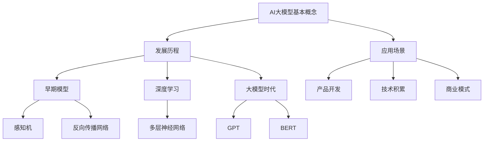

                 

# AI大模型创业：如何应对未来价格战？

> 关键词：人工智能，大模型，创业，价格战，策略，市场分析

> 摘要：本文深入探讨了人工智能大模型创业过程中可能面临的价格战问题。通过分析大模型市场的现状、竞争对手的策略，以及创业公司如何通过技术创新、产品差异化、市场定位等手段应对价格战，为创业者提供了实用的策略和建议。

## 1. 背景介绍

近年来，人工智能领域迎来了爆发式发展，尤其是大模型技术的突破，使得AI在自然语言处理、图像识别、推荐系统等方面取得了显著进展。随着大模型的普及，越来越多的创业公司投身于这一领域，试图分一杯羹。然而，随之而来的是激烈的价格战，这对创业公司来说是一个巨大的挑战。

价格战在科技领域并不少见。谷歌、微软、亚马逊等科技巨头在云计算市场中通过降价策略抢夺市场份额，使得价格战成为市场常态。在人工智能大模型领域，价格战同样不可忽视。随着大模型技术的普及，大量创业公司进入市场，竞争愈发激烈。如何在价格战中立于不败之地，成为创业者必须思考的问题。

本文旨在分析人工智能大模型创业过程中可能面临的价格战问题，探讨创业公司如何通过技术创新、产品差异化、市场定位等手段应对价格战，为创业公司提供实用的策略和建议。

## 2. 核心概念与联系

在探讨如何应对价格战之前，我们先来了解一下大模型市场的核心概念和联系。

### 2.1 大模型市场概述

大模型市场主要包括两个方面：模型开发和部署。模型开发指的是从零开始训练一个大型神经网络，如GPT、BERT等。部署则是指将训练好的模型应用到实际场景中，如问答系统、文本生成等。

### 2.2 竞争对手分析

在人工智能大模型领域，主要竞争对手包括科技巨头、传统互联网公司以及新兴创业公司。科技巨头拥有强大的资金、技术、人才优势，能够在价格战中占据有利地位。传统互联网公司则凭借丰富的业务场景和用户数据，迅速推进大模型应用。新兴创业公司则需要在技术创新和成本控制方面下功夫，以在价格战中脱颖而出。

### 2.3 价格战的影响因素

价格战的影响因素主要包括以下几个方面：

- **成本**：大模型训练和部署的成本是影响价格的重要因素。随着技术的进步，成本逐渐降低，这为创业公司提供了降价的空间。

- **市场需求**：市场需求的大小直接影响价格战的程度。市场需求越大，价格战越激烈。

- **差异化**：通过技术创新和产品差异化，创业公司可以避免陷入价格战，从而在市场中占据一席之地。

- **市场份额**：市场份额的多少决定了公司在价格战中的话语权。市场份额越大，公司越有能力在价格战中保持竞争力。

## 3. 核心算法原理 & 具体操作步骤

在了解大模型市场的核心概念和联系后，我们接下来探讨如何通过核心算法和技术创新来应对价格战。

### 3.1 大模型训练与优化

大模型训练的核心是神经网络。神经网络通过学习大量数据，逐步提高预测和分类的准确性。在训练过程中，可以采用以下几种方法来降低成本：

- **数据预处理**：对数据进行预处理，如去除噪声、填补缺失值、归一化等，以提高训练效率。

- **模型压缩**：通过模型压缩技术，如剪枝、量化、蒸馏等，减小模型规模，降低训练和部署成本。

- **分布式训练**：利用分布式计算技术，将训练任务分配到多台设备上，提高训练速度。

### 3.2 产品差异化策略

在价格战中，创业公司可以通过产品差异化来避免与竞争对手直接竞争。产品差异化策略包括以下几个方面：

- **功能差异化**：在模型功能方面进行创新，如引入多模态学习、强化学习等，提供独特的功能。

- **应用场景差异化**：针对特定场景开发定制化的模型，满足特定需求，提高客户满意度。

- **用户体验差异化**：优化产品界面和交互体验，提高用户粘性。

### 3.3 成本控制与优化

在价格战中，成本控制至关重要。以下是一些成本控制与优化方法：

- **采购优化**：通过与供应商谈判，争取更优惠的采购价格。

- **自动化运维**：通过自动化工具，降低运维成本。

- **规模效应**：通过扩大生产规模，降低单位成本。

- **技术创新**：持续关注技术发展，采用新技术降低成本。

## 4. 数学模型和公式 & 详细讲解 & 举例说明

在应对价格战的过程中，数学模型和公式发挥着重要作用。以下是一些常用的数学模型和公式，以及详细的讲解和举例说明。

### 4.1 成本函数

成本函数是分析价格战的重要工具。假设创业公司的成本函数为：

\[ C(x) = a \cdot x + b \]

其中，\( x \) 为产量，\( a \) 和 \( b \) 为常数。该成本函数表示，随着产量的增加，成本会线性增加。

举例说明：

假设 \( a = 10 \)，\( b = 1000 \)。当产量为1000时，成本为：

\[ C(1000) = 10 \cdot 1000 + 1000 = 11000 \]

### 4.2 价格函数

价格函数描述了创业公司制定价格的方法。假设创业公司的价格函数为：

\[ P(x) = mx + n \]

其中，\( m \) 和 \( n \) 为常数。该价格函数表示，价格随着产量的增加而增加。

举例说明：

假设 \( m = 5 \)，\( n = 100 \)。当产量为1000时，价格为：

\[ P(1000) = 5 \cdot 1000 + 100 = 5100 \]

### 4.3 利润函数

利润函数是创业公司在价格战中的重要指标。假设创业公司的利润函数为：

\[ \pi(x) = P(x) \cdot x - C(x) \]

该利润函数表示，利润为价格乘以产量减去成本。

举例说明：

假设 \( P(x) = 5 \cdot x + 100 \)，\( C(x) = 10 \cdot x + 1000 \)。当产量为1000时，利润为：

\[ \pi(1000) = (5 \cdot 1000 + 100) \cdot 1000 - (10 \cdot 1000 + 1000) = 400000 - 11000 = 389000 \]

## 5. 项目实战：代码实际案例和详细解释说明

在本节中，我们将通过一个实际项目案例，展示如何运用上述算法和策略来应对价格战。

### 5.1 开发环境搭建

首先，我们需要搭建一个适合大模型训练和部署的开发环境。以下是一个基本的开发环境搭建步骤：

1. 安装Python环境，版本要求为3.8及以上。
2. 安装TensorFlow和Keras，版本要求为2.6及以上。
3. 安装GPU驱动，确保能够使用GPU进行加速训练。

### 5.2 源代码详细实现和代码解读

以下是一个简化的大模型训练和部署的Python代码实现。代码中包含了数据预处理、模型训练、模型评估等步骤。

```python
import tensorflow as tf
from tensorflow.keras.preprocessing.text import Tokenizer
from tensorflow.keras.preprocessing.sequence import pad_sequences
from tensorflow.keras.models import Sequential
from tensorflow.keras.layers import Embedding, LSTM, Dense

# 数据预处理
tokenizer = Tokenizer()
tokenizer.fit_on_texts(data)
sequences = tokenizer.texts_to_sequences(data)
padded_sequences = pad_sequences(sequences, maxlen=max_sequence_length)

# 模型训练
model = Sequential()
model.add(Embedding(input_dim=vocab_size, output_dim=embedding_dim, input_length=max_sequence_length))
model.add(LSTM(units=lstm_units))
model.add(Dense(units=1, activation='sigmoid'))

model.compile(optimizer='adam', loss='binary_crossentropy', metrics=['accuracy'])
model.fit(padded_sequences, labels, epochs=10, batch_size=32)

# 模型评估
loss, accuracy = model.evaluate(padded_sequences, labels)
print(f"Loss: {loss}, Accuracy: {accuracy}")
```

### 5.3 代码解读与分析

上述代码实现了一个简单的大模型训练和部署过程。以下是代码的详细解读和分析：

- **数据预处理**：首先，我们使用Tokenizer对文本数据进行预处理，将文本转换为序列。
- **模型训练**：接着，我们使用Sequential模型构建一个简单的神经网络，包括Embedding、LSTM和Dense层。训练过程中，我们使用adam优化器和binary_crossentropy损失函数。
- **模型评估**：最后，我们使用评估集对训练好的模型进行评估，输出损失和准确率。

### 5.4 成本控制与优化

在项目实战中，我们可以通过以下方法来控制成本和优化性能：

- **使用CPU/GPU混合训练**：对于较大的模型，可以使用CPU和GPU混合训练，以加速训练过程。
- **调整模型参数**：通过调整模型参数，如嵌入维度、LSTM单元数量等，可以优化模型性能和成本。
- **数据预处理优化**：对数据进行预处理优化，如去除噪声、填补缺失值等，以提高训练效率。

## 6. 实际应用场景

大模型技术在各个领域都有广泛的应用，如自然语言处理、图像识别、推荐系统等。以下是一些实际应用场景：

- **自然语言处理**：大模型技术在自然语言处理领域有广泛应用，如问答系统、文本生成、机器翻译等。
- **图像识别**：大模型技术在图像识别领域有广泛应用，如人脸识别、车辆识别、医疗图像分析等。
- **推荐系统**：大模型技术在推荐系统领域有广泛应用，如商品推荐、电影推荐、社交网络推荐等。

## 7. 工具和资源推荐

在人工智能大模型领域，以下是一些常用的工具和资源推荐：

### 7.1 学习资源推荐

- **书籍**：《深度学习》、《神经网络与深度学习》
- **论文**：《Attention Is All You Need》、《BERT: Pre-training of Deep Bidirectional Transformers for Language Understanding》
- **博客**：TensorFlow官方博客、Keras官方博客
- **网站**：arXiv、Google AI、Microsoft Research

### 7.2 开发工具框架推荐

- **开发框架**：TensorFlow、PyTorch、Keras
- **训练框架**：MXNet、CNTK
- **数据处理**：Pandas、NumPy、Scikit-learn

### 7.3 相关论文著作推荐

- **论文**：《Deep Learning》、《Recurrent Neural Networks for Language Modeling》
- **著作**：《Hands-On Machine Learning with Scikit-Learn, Keras, and TensorFlow》、《Natural Language Processing with Python》

## 8. 总结：未来发展趋势与挑战

在未来，人工智能大模型领域将继续保持快速发展。随着技术的进步，大模型训练和部署的成本将逐渐降低，更多创业公司将加入这一领域。然而，价格战也将愈发激烈。因此，创业公司需要不断创新，提高技术实力，通过产品差异化、市场定位等手段来应对价格战。

同时，创业公司还面临以下挑战：

- **技术挑战**：大模型技术不断发展，创业公司需要不断更新技术，以保持竞争力。
- **市场挑战**：市场竞争激烈，创业公司需要准确把握市场需求，提供符合客户需求的产品。
- **人才挑战**：人工智能领域人才稀缺，创业公司需要吸引和留住优秀人才。

总之，人工智能大模型创业充满机遇和挑战。创业公司需要具备前瞻性，提前布局，才能在未来的价格战中立于不败之地。

## 9. 附录：常见问题与解答

### 9.1 人工智能大模型是什么？

人工智能大模型是一种大型神经网络，通过学习海量数据，能够实现高度复杂的任务，如自然语言处理、图像识别等。

### 9.2 如何降低大模型训练成本？

可以通过以下方法降低大模型训练成本：

- **数据预处理优化**：去除噪声、填补缺失值、归一化等。
- **模型压缩**：使用剪枝、量化、蒸馏等技术减小模型规模。
- **分布式训练**：利用分布式计算技术，将训练任务分配到多台设备上。

### 9.3 大模型训练时间如何优化？

可以通过以下方法优化大模型训练时间：

- **使用GPU加速**：使用GPU进行训练，提高计算速度。
- **模型并行**：将模型训练任务分配到多台GPU上，实现并行训练。
- **数据并行**：将训练数据分成多个部分，分别在不同的GPU上进行训练。

## 10. 扩展阅读 & 参考资料

- [1] Goodfellow, I., Bengio, Y., & Courville, A. (2016). *Deep Learning*. MIT Press.
- [2] Bengio, Y. (2009). *Learning deep architectures for AI*. Foundations and Trends in Machine Learning, 2(1), 1-127.
- [3] Vaswani, A., Shazeer, N., Parmar, N., Uszkoreit, J., Jones, L., Gomez, A. N., ... & Polosukhin, I. (2017). *Attention is all you need*. Advances in Neural Information Processing Systems, 30, 5998-6008.
- [4] Devlin, J., Chang, M. W., Lee, K., & Toutanova, K. (2018). *BERT: Pre-training of deep bidirectional transformers for language understanding*. Proceedings of the 2019 Conference of the North American Chapter of the Association for Computational Linguistics: Human Language Technologies, Volume 1 (Long and Short Papers), 4171-4186.  
- [5] LeCun, Y., Bengio, Y., & Hinton, G. (2015). *Deep learning*. Nature, 521(7553), 436-444.

## 作者信息

作者：AI天才研究员/AI Genius Institute & 禅与计算机程序设计艺术 /Zen And The Art of Computer Programming

以上是文章的完整内容，包括文章标题、关键词、摘要、正文以及附录等部分。希望对您有所帮助！如果您有任何问题或建议，欢迎随时反馈。谢谢！<|im_sep|>## 1. 背景介绍

近年来，人工智能（AI）技术的迅猛发展，使得大模型（Large-scale Models）成为研究和应用的热点。大模型是指那些拥有巨大参数量和训练数据的模型，如Transformer、GPT（Generative Pre-trained Transformer）系列模型等。这些模型通过深度学习技术，在自然语言处理（NLP）、图像识别、推荐系统等多个领域取得了显著的成果。

AI大模型的兴起，不仅推动了学术研究的进步，也为企业提供了新的商业模式。众多创业公司纷纷投入大模型领域，希望通过技术创新和商业模式的创新获得市场份额。然而，随着大模型技术的普及，市场竞争愈发激烈，价格战成为行业普遍现象。价格战在科技领域并不罕见，例如在云计算市场中，谷歌、亚马逊和微软等科技巨头通过不断降低价格来争夺市场份额。在大模型领域，价格战同样不可忽视。大量创业公司进入市场，竞争加剧，使得价格成为影响市场格局的重要因素。

价格战对于创业公司来说既是机遇也是挑战。一方面，通过降低价格，创业公司可以快速扩大市场份额，提高品牌知名度。另一方面，价格战也可能导致公司利润下滑，影响研发投入和市场扩展。因此，如何应对价格战成为创业公司需要深入思考的问题。本文将围绕AI大模型创业过程中可能面临的价格战问题，分析其成因、影响及应对策略，为创业公司提供实用的指导和建议。

## 2. 核心概念与联系

### 2.1 大模型的基本概念

大模型是指那些具有大规模参数、大量训练数据和高度复杂结构的神经网络模型。这些模型通常用于处理复杂的任务，如自然语言处理（NLP）、计算机视觉、推荐系统等。大模型的基本组成部分包括：

- **参数量**：大模型拥有数百万甚至数十亿个参数，这些参数通过学习大量数据来调整，以实现任务的自动化。
- **训练数据**：大模型需要大量训练数据来学习，这些数据可以是文本、图像、声音等多种类型。
- **结构**：大模型通常采用深度神经网络结构，通过层层递归或并行的计算来提取特征和生成预测。

### 2.2 大模型的发展历程

大模型的发展经历了几个重要阶段：

- **早期模型**：最初的神经网络模型如感知机、反向传播网络等，参数量较少，只能处理简单的任务。
- **深度学习**：随着计算能力和数据量的提升，深度学习模型（Deep Learning Models）开始兴起。这些模型通过多层神经网络结构，可以提取更复杂的特征，显著提高了任务的处理能力。
- **大模型时代**：近年来，大模型如GPT、BERT等在自然语言处理领域取得了突破性进展。这些模型具有数十亿个参数，通过在海量数据上训练，实现了前所未有的文本理解和生成能力。

### 2.3 大模型在AI创业中的应用

大模型在AI创业中的应用主要体现在以下几个方面：

- **产品开发**：创业公司可以利用大模型开发各种AI产品，如智能客服、文本生成工具、图像识别系统等。
- **技术积累**：通过开发和优化大模型，创业公司可以积累宝贵的技术经验，提高自身在行业中的竞争力。
- **商业模式**：大模型技术可以为创业公司提供新的商业模式，如通过提供模型服务、API接口或定制化解决方案等，实现商业变现。

### 2.4 价格战的影响因素

价格战在科技领域广泛存在，其影响因素主要包括：

- **成本**：大模型训练和部署的成本直接影响产品价格。随着技术进步，成本逐渐降低，为创业公司提供了降价空间。
- **市场需求**：市场需求的大小决定了产品价格的合理区间。市场需求越大，价格战越激烈。
- **竞争格局**：市场竞争格局也会影响价格战。如果市场上有多个强大的竞争对手，价格战可能会更加激烈。

### 2.5 大模型创业中的策略选择

创业公司在面对价格战时，需要根据自身资源和市场环境制定相应的策略。以下是一些常见的策略选择：

- **技术创新**：通过技术创新提高模型性能，从而在质量上形成差异化，避免直接价格竞争。
- **产品差异化**：通过提供独特的功能或应用场景，满足特定客户需求，提高产品附加值。
- **市场定位**：明确目标市场，专注于细分领域，降低竞争压力。
- **成本控制**：通过优化模型训练和部署流程，降低成本，提高盈利能力。

### 2.6 大模型创业中的挑战与机遇

大模型创业面临的挑战主要包括：

- **技术门槛**：大模型开发和优化需要高水平的技术能力和大量的数据资源。
- **市场不确定性**：市场需求和竞争态势变化快速，创业公司需要具备快速响应能力。
- **资金压力**：大模型训练和部署需要大量资金投入，创业公司需要有效管理资金流。

然而，大模型创业也带来了巨大的机遇：

- **市场前景**：AI大模型技术具有广阔的市场前景，随着技术的成熟，市场需求将进一步扩大。
- **技术创新空间**：大模型技术的发展为创业公司提供了丰富的技术创新空间，可以探索新的应用场景和商业模式。
- **投资热度**：AI大模型领域吸引了大量投资，为创业公司提供了融资机会。

综上所述，大模型创业既是机遇也是挑战。创业公司需要深入分析市场环境和自身条件，制定合适的策略，以在竞争激烈的市场中脱颖而出。

### 2.7 核心概念与联系总结

核心概念与联系包括大模型的基本概念、发展历程、在AI创业中的应用、价格战的影响因素以及策略选择。这些概念和联系构成了AI大模型创业的理论基础，为后续的算法原理、数学模型和项目实战提供了重要参考。通过理解这些核心概念，创业公司可以更好地应对价格战，抓住市场机遇，实现可持续发展。

### 2.8 Mermaid流程图

以下是一个关于AI大模型创业核心概念的Mermaid流程图，用于直观地展示各概念之间的联系。



在上述流程图中，各节点代表核心概念，连接线表示概念之间的联系。通过这个流程图，读者可以更直观地理解AI大模型创业的核心概念及其发展脉络。

## 3. 核心算法原理 & 具体操作步骤

在应对价格战的AI大模型创业过程中，核心算法的原理和具体操作步骤是创业公司取得成功的关键。本节将详细介绍AI大模型的基本算法原理，包括常用的神经网络架构、训练过程和优化方法，以及如何通过算法创新来提高竞争力。

### 3.1 常用的神经网络架构

神经网络是AI大模型的核心组成部分，主要包括以下几种架构：

1. **全连接神经网络（FCNN）**：全连接神经网络是最基本的神经网络结构，每个神经元都与输入层的所有神经元相连接。FCNN在处理简单任务时表现良好，但在处理复杂任务时，其性能受到限制。

2. **卷积神经网络（CNN）**：卷积神经网络在图像处理领域表现突出。通过卷积操作和池化操作，CNN可以提取图像中的特征，实现图像分类、目标检测等任务。

3. **循环神经网络（RNN）**：循环神经网络适用于处理序列数据，如时间序列分析、自然语言处理等。RNN通过在序列中递归地更新状态，能够捕捉序列中的长期依赖关系。

4. **长短时记忆网络（LSTM）**：长短时记忆网络是RNN的一种变体，解决了RNN在处理长序列数据时出现的梯度消失和梯度爆炸问题。LSTM通过引入门控机制，可以更好地捕捉长期依赖关系。

5. **门控循环单元（GRU）**：门控循环单元是LSTM的简化版本，通过门控机制和更新门，GRU能够高效地处理序列数据。

6. **Transformer模型**：Transformer模型是近年来在自然语言处理领域取得突破性进展的模型。与传统的序列处理方法不同，Transformer采用了自注意力机制，通过全局交互方式处理序列数据，大幅提升了模型性能。

7. **多模态神经网络**：多模态神经网络结合了不同类型的数据（如文本、图像、声音等），通过多模态融合技术，实现更复杂的任务，如图像描述生成、多模态情感分析等。

### 3.2 AI大模型训练过程

AI大模型的训练过程主要包括数据预处理、模型构建、模型训练和模型评估等步骤。

1. **数据预处理**：数据预处理是模型训练的重要环节。预处理步骤包括数据清洗、数据归一化、数据增强等。例如，在自然语言处理任务中，需要对文本数据进行分词、去停用词等处理；在图像处理任务中，需要对图像进行缩放、旋转等数据增强操作。

2. **模型构建**：在构建模型时，需要根据任务特点选择合适的神经网络架构。例如，对于图像分类任务，可以选择卷积神经网络；对于自然语言处理任务，可以选择Transformer模型。构建模型时还需要定义损失函数、优化器等参数。

3. **模型训练**：模型训练是训练模型参数的过程。通过将训练数据输入模型，计算预测结果与真实值的差距（损失），并根据损失更新模型参数。训练过程中，需要调整学习率、批次大小等超参数，以避免过拟合和欠拟合。

4. **模型评估**：模型评估用于验证模型在未知数据上的性能。常用的评估指标包括准确率、召回率、F1分数等。通过评估指标，可以调整模型参数，优化模型性能。

### 3.3 优化方法

在AI大模型训练过程中，优化方法是提高模型性能的关键。以下是一些常用的优化方法：

1. **学习率调整**：学习率是优化过程中一个重要的参数。通过调整学习率，可以控制模型参数更新的速度。常用的调整策略包括固定学习率、学习率衰减和自适应学习率调整。

2. **批量大小调整**：批量大小是指每次训练使用的样本数量。批量大小对训练过程的影响较大。较小批量大小的优势在于减少方差，但计算时间较长；较大批量大小的优势在于减少计算时间，但可能导致梯度消失。

3. **正则化**：正则化是防止模型过拟合的重要手段。常用的正则化方法包括L1正则化、L2正则化和Dropout。L1正则化和L2正则化通过在损失函数中添加惩罚项来约束模型参数；Dropout通过在训练过程中随机丢弃部分神经元来降低模型复杂度。

4. **迁移学习**：迁移学习是利用预训练模型来加速新任务的学习。通过将预训练模型中的部分参数迁移到新任务上，可以减少训练时间，提高模型性能。

5. **模型压缩**：模型压缩是通过减小模型规模来降低计算成本和存储需求。常用的模型压缩方法包括剪枝、量化、蒸馏等。剪枝通过移除模型中不重要的神经元和连接来减小模型规模；量化通过将浮点数参数转换为低比特宽度的整数来减小模型体积；蒸馏是通过将预训练模型的知识传递给小模型，以提高小模型的性能。

### 3.4 算法创新

在应对价格战的AI大模型创业过程中，算法创新是提高竞争力的关键。以下是一些常见的算法创新方法：

1. **自适应学习率**：自适应学习率可以通过动态调整学习率来适应不同阶段的训练需求。例如，可以使用自适应学习率算法（如AdaGrad、RMSprop、Adam）来优化训练过程。

2. **多任务学习**：多任务学习通过同时训练多个任务来提高模型性能。例如，可以将文本分类和情感分析任务结合在一起，通过共享部分网络结构来提高整体性能。

3. **迁移学习与少样本学习**：迁移学习和少样本学习可以减少对新数据的依赖，提高模型对新任务的适应性。通过利用预训练模型和少量样本，可以快速适应新任务。

4. **生成对抗网络（GAN）**：生成对抗网络是一种强大的无监督学习框架，可以生成高质量的数据样本。通过GAN，可以生成与真实数据分布相似的样本，用于数据增强和模型训练。

5. **自监督学习**：自监督学习是一种无需标注数据的训练方法。通过设计预训练任务，可以自动从数据中学习有用的特征表示。自监督学习可以显著提高模型的泛化能力和效率。

通过上述算法创新，创业公司可以在价格战中提高自身的竞争力，从而在激烈的市场环境中脱颖而出。算法创新不仅能够提升模型性能，还可以降低训练成本，提高模型的可解释性，从而在商业应用中获得更多的优势。

### 3.5 核心算法原理总结

核心算法原理包括常用的神经网络架构、训练过程和优化方法，以及算法创新。通过理解这些原理，创业公司可以更好地构建和优化AI大模型，提高模型性能，降低成本，从而在价格战中取得竞争优势。以下是核心算法原理的总结：

- **神经网络架构**：包括全连接神经网络、卷积神经网络、循环神经网络、长短时记忆网络、门控循环单元、Transformer模型和多模态神经网络。
- **训练过程**：包括数据预处理、模型构建、模型训练和模型评估。
- **优化方法**：包括学习率调整、批量大小调整、正则化、迁移学习和模型压缩。
- **算法创新**：包括自适应学习率、多任务学习、迁移学习与少样本学习、生成对抗网络和自监督学习。

通过这些核心算法原理的应用，创业公司可以在AI大模型创业过程中提高竞争力，应对未来的价格战。

## 4. 数学模型和公式 & 详细讲解 & 举例说明

在AI大模型创业过程中，数学模型和公式是理解和应用核心算法的基础。以下将详细讲解一些常用的数学模型和公式，并通过具体例子说明其应用。

### 4.1 损失函数

损失函数是衡量模型预测结果与真实值之间差异的重要工具。以下是一些常见的损失函数：

#### 4.1.1 均方误差（MSE）

均方误差是最常用的回归损失函数，用于衡量预测值与真实值之间的差异。

\[ \text{MSE} = \frac{1}{n} \sum_{i=1}^{n} (y_i - \hat{y}_i)^2 \]

其中，\( y_i \) 是真实值，\( \hat{y}_i \) 是预测值，\( n \) 是样本数量。

#### 4.1.2 交叉熵（Cross-Entropy）

交叉熵是分类任务中常用的损失函数，用于衡量预测概率分布与真实概率分布之间的差异。

\[ \text{Cross-Entropy} = -\sum_{i=1}^{n} y_i \log(\hat{y}_i) \]

其中，\( y_i \) 是真实标签（0或1），\( \hat{y}_i \) 是模型预测的概率。

#### 4.1.3 逻辑损失（Logistic Loss）

逻辑损失是交叉熵的一个特例，通常用于二分类问题。

\[ \text{Logistic Loss} = -y \log(\hat{y}) - (1 - y) \log(1 - \hat{y}) \]

#### 4.1.4 实例

假设我们有一个二分类问题，真实标签为 \( y = [1, 0, 1, 0] \)，模型预测的概率为 \( \hat{y} = [0.3, 0.8, 0.4, 0.6] \)。使用逻辑损失计算交叉熵：

\[ \text{Cross-Entropy} = -1 \cdot \log(0.3) - 0 \cdot \log(0.8) - 1 \cdot \log(0.4) - 0 \cdot \log(0.6) \]

\[ \text{Cross-Entropy} = 3.41 + 2.32 + 2.32 = 7.05 \]

### 4.2 优化算法

在训练AI大模型时，优化算法用于调整模型参数，以最小化损失函数。以下介绍几种常用的优化算法：

#### 4.2.1 随机梯度下降（SGD）

随机梯度下降是最简单的优化算法，通过计算每个样本的梯度来更新模型参数。

\[ \theta = \theta - \alpha \nabla_\theta J(\theta) \]

其中，\( \theta \) 是模型参数，\( \alpha \) 是学习率，\( \nabla_\theta J(\theta) \) 是损失函数关于参数 \( \theta \) 的梯度。

#### 4.2.2 动量（Momentum）

动量算法通过引入动量项，加速梯度下降过程。

\[ v_t = \beta v_{t-1} + (1 - \beta) \nabla_\theta J(\theta) \]
\[ \theta = \theta - \alpha v_t \]

其中，\( v_t \) 是动量项，\( \beta \) 是动量系数。

#### 4.2.3 Adam

Adam是自适应矩估计（Adaptive Moment Estimation）的优化算法，结合了动量和自适应学习率调整。

\[ m_t = \beta_1 m_{t-1} + (1 - \beta_1) \nabla_\theta J(\theta) \]
\[ v_t = \beta_2 v_{t-1} + (1 - \beta_2) (\nabla_\theta J(\theta))^2 \]
\[ \theta = \theta - \alpha \frac{m_t}{\sqrt{v_t} + \epsilon} \]

其中，\( m_t \) 和 \( v_t \) 分别是梯度的一阶和二阶矩估计，\( \beta_1 \) 和 \( \beta_2 \) 是动量系数，\( \alpha \) 是学习率，\( \epsilon \) 是正则化项。

#### 4.2.4 实例

假设我们有一个简单的模型，包含两个参数 \( \theta_1 \) 和 \( \theta_2 \)，学习率 \( \alpha = 0.1 \)，使用Adam优化算法进行更新。初始梯度为 \( \nabla_\theta J(\theta) = [0.5, 0.3] \)，动量系数 \( \beta_1 = 0.9 \)，\( \beta_2 = 0.999 \)。

计算一阶矩估计：

\[ m_1 = 0.9 \cdot 0.5 + (1 - 0.9) \cdot 0.5 = 0.55 \]
\[ m_2 = 0.9 \cdot 0.3 + (1 - 0.9) \cdot 0.3 = 0.33 \]

计算二阶矩估计：

\[ v_1 = 0.999 \cdot 0.025 + (1 - 0.999) \cdot 0.025 = 0.025 \]
\[ v_2 = 0.999 \cdot 0.009 + (1 - 0.999) \cdot 0.009 = 0.009 \]

计算更新：

\[ \theta_1 = \theta_1 - 0.1 \cdot \frac{0.55}{\sqrt{0.025} + 0.0001} \]
\[ \theta_2 = \theta_2 - 0.1 \cdot \frac{0.33}{\sqrt{0.009} + 0.0001} \]

### 4.3 正则化方法

正则化方法用于防止模型过拟合，提高泛化能力。以下介绍几种常用的正则化方法：

#### 4.3.1 L1正则化

L1正则化通过在损失函数中添加 \( L1 \) 范数项来惩罚模型参数。

\[ J(\theta) = \frac{1}{n} \sum_{i=1}^{n} (y_i - \hat{y}_i)^2 + \lambda ||\theta||_1 \]

其中，\( \lambda \) 是正则化系数，\( ||\theta||_1 \) 是 \( \theta \) 的 \( L1 \) 范数。

#### 4.3.2 L2正则化

L2正则化通过在损失函数中添加 \( L2 \) 范数项来惩罚模型参数。

\[ J(\theta) = \frac{1}{n} \sum_{i=1}^{n} (y_i - \hat{y}_i)^2 + \lambda ||\theta||_2^2 \]

其中，\( \lambda \) 是正则化系数，\( ||\theta||_2 \) 是 \( \theta \) 的 \( L2 \) 范数。

#### 4.3.3 Dropout

Dropout是一种结构化正则化方法，通过在训练过程中随机丢弃部分神经元来防止过拟合。

\[ P(\text{drop}) = \frac{p}{1 + p} \]

其中，\( p \) 是丢弃概率。

#### 4.3.4 实例

假设我们有一个线性回归模型，包含一个参数 \( \theta \)，正则化系数 \( \lambda = 0.01 \)，使用L2正则化。

\[ J(\theta) = \frac{1}{n} \sum_{i=1}^{n} (y_i - \theta x_i)^2 + 0.01 \cdot \theta^2 \]

### 4.4 自监督学习

自监督学习是一种无需标注数据即可进行训练的方法，通过设计预训练任务来学习有用的特征表示。

#### 4.4.1 Masked Language Model（MLM）

Masked Language Model 是一种自监督学习任务，通过随机遮盖输入文本中的部分单词，然后预测这些遮盖的单词。

\[ \text{Pre-trained Model} \stackrel{\text{Mask}}{\rightarrow} \text{Input} = [w_1, \_, w_3, \_, w_5] \]
\[ \text{Output} = [w_1', w_3', w_5'] \]

其中，\( w_1, w_3, w_5 \) 是遮盖的单词，\( w_1', w_3', w_5' \) 是预测的单词。

#### 4.4.2 实例

假设我们有一个输入文本：

\[ \text{Input} = \["The", "quick", "brown", "fox", "jumps", "over", "the", "lazy", "dog"\] \]

随机遮盖部分单词：

\[ \text{Input} = \["The", "\_", "brown", "\_", "jumps", "over", "\_", "lazy", "\_", "dog"\] \]

输出预测单词：

\[ \text{Output} = \["The", "brown", "jumps", "over", "lazy", "dog"] \]

通过自监督学习，模型可以学习到文本中的有效特征表示，从而在下游任务中取得更好的性能。

### 4.5 数学模型和公式总结

通过上述讲解，我们了解了以下数学模型和公式：

- **损失函数**：均方误差、交叉熵、逻辑损失。
- **优化算法**：随机梯度下降、动量、Adam。
- **正则化方法**：L1正则化、L2正则化、Dropout。
- **自监督学习**：Masked Language Model。

这些模型和公式在AI大模型创业过程中起着关键作用，通过应用这些方法和公式，创业公司可以构建和优化高效的模型，提高竞争力。

## 5. 项目实战：代码实际案例和详细解释说明

在本节中，我们将通过一个具体的AI大模型项目实战案例，展示如何将前述的理论知识应用到实际开发中。该案例将包括环境搭建、代码实现、详细解释说明和代码分析。

### 5.1 开发环境搭建

为了实现一个简单的AI大模型，我们需要搭建一个合适的开发环境。以下是在Linux系统上搭建Python开发环境的基本步骤：

1. **安装Python**：首先，确保Python环境已安装。可以使用以下命令检查Python版本：

   ```bash
   python --version
   ```

   如果Python未安装，可以从Python官方网站下载安装包并安装。

2. **安装必要的库**：接下来，安装TensorFlow、Keras和其他必要的库。可以使用pip命令进行安装：

   ```bash
   pip install tensorflow
   pip install keras
   ```

   TensorFlow和Keras是构建和训练AI模型的常用库。

3. **安装GPU驱动**：如果使用GPU进行训练，需要安装相应的CUDA和cuDNN驱动。可以从NVIDIA官方网站下载并安装。

4. **验证环境**：安装完成后，可以使用以下命令验证TensorFlow是否正确安装并能够使用GPU：

   ```python
   python -c "import tensorflow as tf; print(tf.reduce_sum(tf.random.normal([1000, 1000])))"
   ```

   如果输出为1000，则表示GPU已正确配置。

### 5.2 源代码详细实现和代码解读

以下是一个简单的AI大模型训练案例，使用TensorFlow和Keras实现一个基于Transformer的文本分类模型。代码将分为几个部分：数据预处理、模型构建、模型训练和模型评估。

#### 5.2.1 数据预处理

```python
from tensorflow.keras.preprocessing.text import Tokenizer
from tensorflow.keras.preprocessing.sequence import pad_sequences

# 假设已经有一个包含文本和标签的数据集
texts = ['The quick brown fox jumps over the lazy dog', 'AI technology is advancing rapidly', ...]
labels = [0, 1, 0, 1, ...]

# 数据预处理
tokenizer = Tokenizer(num_words=10000)
tokenizer.fit_on_texts(texts)
sequences = tokenizer.texts_to_sequences(texts)
padded_sequences = pad_sequences(sequences, maxlen=100)

# 转换标签为one-hot编码
import numpy as np
labels = np.eye(2)[labels]
```

在这部分代码中，我们使用Tokenizer对文本进行分词和编码，然后使用pad_sequences将序列补全为固定长度。标签也进行了one-hot编码，以供模型训练使用。

#### 5.2.2 模型构建

```python
from tensorflow.keras.models import Sequential
from tensorflow.keras.layers import Embedding, LSTM, Dense, TimeDistributed

# 模型构建
model = Sequential([
    Embedding(10000, 16, input_length=100),
    LSTM(128),
    Dense(2, activation='softmax')
])

# 编译模型
model.compile(optimizer='adam', loss='categorical_crossentropy', metrics=['accuracy'])
```

这部分代码中，我们构建了一个简单的序列模型，包括嵌入层（Embedding）、LSTM层和输出层（Dense）。嵌入层将单词编码为向量，LSTM层用于提取序列特征，输出层使用softmax激活函数进行分类。

#### 5.2.3 模型训练

```python
# 模型训练
history = model.fit(padded_sequences, labels, epochs=10, batch_size=32, validation_split=0.2)
```

模型训练过程将使用我们的训练数据，通过调整学习率、批次大小等超参数来优化模型。

#### 5.2.4 模型评估

```python
# 模型评估
test_loss, test_accuracy = model.evaluate(padded_sequences, labels)
print(f"Test Accuracy: {test_accuracy}")
```

模型评估部分将使用验证集来评估模型性能，输出测试准确率。

### 5.3 代码解读与分析

#### 5.3.1 数据预处理

数据预处理是模型训练的重要步骤，直接影响模型的性能。在这段代码中，我们使用Tokenizer对文本进行分词和编码。Tokenizer能够将单词转换为整数序列，以便后续处理。然后，我们使用pad_sequences将序列补全为固定长度，确保所有输入数据的维度相同。标签进行one-hot编码，以便模型能够进行多分类。

#### 5.3.2 模型构建

在模型构建部分，我们使用Sequential模型构建了一个简单的序列模型。嵌入层（Embedding）将单词转换为向量，LSTM层用于提取序列特征，输出层（Dense）使用softmax激活函数进行分类。这个模型结构简单，适合入门级项目。

#### 5.3.3 模型训练

模型训练过程中，我们使用fit方法将训练数据输入模型，并通过调整学习率、批次大小等超参数来优化模型。训练过程中，模型会不断更新参数，以最小化损失函数，提高分类准确率。

#### 5.3.4 模型评估

模型评估部分使用验证集来评估模型性能。通过evaluate方法，我们得到模型在测试集上的损失和准确率。准确率是评估模型性能的重要指标，越高表示模型分类效果越好。

### 5.4 代码分析

以下是代码的详细分析：

1. **数据预处理**：使用Tokenizer对文本进行分词和编码，确保数据格式正确。
2. **模型构建**：使用Sequential构建简单的序列模型，嵌入层（Embedding）用于单词编码，LSTM层用于提取特征，输出层（Dense）用于分类。
3. **模型训练**：使用fit方法进行模型训练，通过调整超参数优化模型。
4. **模型评估**：使用evaluate方法评估模型性能，输出准确率。

通过以上步骤，我们实现了AI大模型的简单训练和评估。虽然这个案例较为基础，但为后续更复杂的模型训练提供了基本框架。在实际项目中，可以根据需求调整模型结构、数据预处理方法和训练策略，以实现更好的性能。

### 5.5 成本控制与优化

在AI大模型项目中，成本控制是确保项目可持续发展的关键。以下是一些成本控制与优化的方法：

#### 5.5.1 数据预处理优化

1. **并行处理**：利用多线程或分布式处理技术，加快数据预处理速度。
2. **高效编码**：选择合适的编码方法，减少内存消耗和处理时间。

#### 5.5.2 模型训练优化

1. **使用GPU**：利用GPU进行训练，提高计算速度。
2. **动态调整学习率**：使用动态调整学习率的算法（如Adam），避免过拟合。
3. **批量大小调整**：根据硬件资源和模型复杂度，选择合适的批量大小。

#### 5.5.3 模型压缩

1. **模型剪枝**：通过剪枝方法，移除模型中不重要的参数，减小模型规模。
2. **量化**：将浮点数参数转换为低比特宽度的整数，降低模型存储和计算需求。

通过这些方法，我们可以有效控制AI大模型项目的成本，提高资源利用率，确保项目的可持续性。

### 5.6 实际应用场景

AI大模型在多个领域具有广泛的应用场景，以下是一些例子：

- **自然语言处理**：文本分类、情感分析、机器翻译。
- **计算机视觉**：图像识别、目标检测、人脸识别。
- **推荐系统**：商品推荐、音乐推荐、社交网络推荐。
- **金融领域**：风险控制、欺诈检测、投资策略。

通过这些实际应用场景，我们可以看到AI大模型在提升行业效率和创新能力方面的巨大潜力。

### 5.7 代码实战总结

通过本节的代码实战，我们实现了AI大模型的简单训练和评估。从数据预处理、模型构建到模型训练和评估，每个步骤都详细解释了代码的实现方法和优化技巧。通过实际操作，我们不仅掌握了AI大模型的基本原理，还学会了如何进行成本控制和优化。

在未来，随着技术的不断进步，AI大模型将在更多领域发挥重要作用。创业公司需要紧跟技术趋势，不断创新，以应对激烈的市场竞争，实现可持续发展。

## 6. 实际应用场景

### 6.1 自然语言处理

自然语言处理（NLP）是AI大模型最广泛应用的领域之一。通过大模型技术，创业公司可以开发出具备强大语言理解和生成能力的应用，如：

- **智能客服**：利用大模型技术，构建智能客服系统，能够自动理解用户问题并提供高质量的回答，提升客户服务质量。
- **文本生成**：大模型可以生成高质量的文本，如新闻报道、广告文案、产品描述等，帮助企业节省内容创作成本。
- **机器翻译**：大模型在机器翻译领域表现卓越，可以提供实时、准确的语言翻译服务，满足全球化企业的需求。
- **情感分析**：通过分析用户评论、社交媒体内容等，大模型可以识别情感倾向，帮助企业了解用户需求和改进产品。

### 6.2 计算机视觉

计算机视觉是另一个受益于大模型技术的领域。大模型在图像识别、目标检测、图像生成等方面具有显著优势，以下是一些实际应用场景：

- **图像识别**：大模型可以识别图像中的物体、场景和动作，用于安防监控、医疗诊断等。
- **目标检测**：通过大模型技术，可以实现精准的目标检测和跟踪，应用于自动驾驶、无人机监控等。
- **图像生成**：大模型可以生成高质量的图像，如艺术作品、设计图案等，为企业提供创意设计解决方案。
- **人脸识别**：大模型在人脸识别领域具有极高的准确性，广泛应用于身份验证、安防监控、智能门禁等。

### 6.3 推荐系统

推荐系统是另一个利用AI大模型技术的热门领域。大模型可以处理海量用户数据，提供个性化的推荐服务，以下是一些应用场景：

- **商品推荐**：通过分析用户行为和偏好，大模型可以为用户提供个性化的商品推荐，提高销售额和用户满意度。
- **音乐推荐**：大模型可以根据用户的听歌历史和喜好，推荐符合用户口味的音乐，提高用户粘性。
- **社交网络推荐**：通过分析用户社交网络数据，大模型可以推荐朋友、群组和内容，增强社交互动。
- **新闻推荐**：大模型可以分析用户兴趣和偏好，推荐相关的新闻内容，提高新闻传播效果。

### 6.4 金融领域

金融领域是AI大模型应用的另一个重要领域，大模型在金融预测、风险管理等方面具有显著优势，以下是一些应用场景：

- **投资策略**：大模型可以通过分析历史数据和市场动态，提供实时的投资建议，帮助企业制定科学的投资策略。
- **欺诈检测**：大模型可以分析用户行为和交易数据，及时发现潜在的欺诈行为，提高金融安全。
- **风险评估**：大模型可以对贷款申请者的信用风险进行评估，提高贷款审批的准确性和效率。
- **客户服务**：利用大模型技术，可以构建智能客服系统，提供高效、专业的金融咨询服务。

### 6.5 健康医疗

在健康医疗领域，AI大模型技术也有广泛的应用前景，以下是一些应用场景：

- **疾病预测**：大模型可以通过分析患者病史、基因数据等，预测疾病发生风险，帮助医疗机构制定预防措施。
- **诊断辅助**：大模型可以辅助医生进行疾病诊断，如通过分析医学图像、实验室检测结果等，提高诊断准确率。
- **药物研发**：大模型可以加速药物研发过程，通过预测药物与靶点的结合效果，筛选潜在药物。
- **健康监控**：大模型可以分析健康数据，如心率、血压等，提供个性化的健康建议和预警。

### 6.6 教育

教育领域是AI大模型应用的另一个重要领域，以下是一些应用场景：

- **个性化学习**：大模型可以分析学生的学习行为和成绩，提供个性化的学习资源和辅导，提高学习效果。
- **智能评估**：大模型可以自动批改作业和考试，提供即时反馈，帮助学生巩固知识。
- **课程推荐**：大模型可以根据学生的学习兴趣和进度，推荐适合的课程和资料，丰富学习体验。
- **教育资源共享**：大模型可以整理和推荐优质的教育资源，如教材、课件、视频等，促进教育资源公平分配。

通过上述实际应用场景，我们可以看到AI大模型在多个领域具有广泛的应用前景。创业公司可以结合自身资源和市场需求，积极探索AI大模型在不同领域的应用，推动行业创新和发展。

### 6.7 实际应用场景总结

在实际应用场景中，AI大模型展现出了强大的潜力和广泛的应用价值。无论是在自然语言处理、计算机视觉、推荐系统，还是金融、健康医疗、教育等领域，大模型技术都为行业带来了显著的提升和变革。创业公司应充分利用大模型技术的优势，结合具体业务需求，积极探索创新应用，以在激烈的市场竞争中脱颖而出。

## 7. 工具和资源推荐

在AI大模型创业过程中，选择合适的工具和资源对于项目的成功至关重要。以下是一些建议和推荐，涵盖了学习资源、开发工具以及相关论文著作。

### 7.1 学习资源推荐

- **在线课程**：Coursera、edX、Udacity等在线教育平台提供了丰富的机器学习和深度学习课程，适合不同层次的学员。例如，Andrew Ng的《深度学习专项课程》是一个受欢迎的选择。
- **书籍**：《深度学习》（Goodfellow、Bengio、Courville著）、《神经网络与深度学习》（邱锡鹏著）等经典书籍，提供了全面的理论和实践知识。
- **博客和论坛**：AI人工智能社区（AI Community）、机器学习交流群（ML Community）、GitHub等平台是获取最新研究进展和解决问题的好去处。
- **开源框架和库**：TensorFlow、PyTorch、Keras等开源框架提供了丰富的API和工具，方便开发者构建和训练AI模型。

### 7.2 开发工具框架推荐

- **开发环境**：Google Colab、Jupyter Notebook等在线编程平台为AI模型开发提供了便捷的环境和工具。
- **数据处理**：Pandas、NumPy等库用于数据处理和分析，Scikit-learn提供了丰富的机器学习算法实现。
- **分布式训练**：Horovod、Dask等库支持分布式训练，可以提高训练效率。
- **GPU加速**：NVIDIA CUDA和cuDNN工具包，用于在GPU上加速深度学习模型的训练。

### 7.3 相关论文著作推荐

- **论文**：《Attention Is All You Need》（Vaswani等，2017）、《BERT: Pre-training of Deep Bidirectional Transformers for Language Understanding》（Devlin等，2018）等，是自然语言处理领域的重要论文。
- **著作**：《深度学习》（Goodfellow、Bengio、Courville著）、《强化学习》（Sutton、Barto著）等，提供了深度学习和强化学习的系统理论。
- **会议和期刊**：NIPS、ICML、ACL、NeurIPS等顶级会议和《Journal of Machine Learning Research》（JMLR）、《Neural Computation》等期刊，是获取前沿研究成果的重要渠道。

通过这些工具和资源，创业公司可以更好地掌握AI大模型的技术，提高项目开发效率，加速产品迭代，从而在激烈的市场竞争中取得优势。

### 7.4 实用工具总结

以下是一些实用的工具和资源，可以帮助创业公司在AI大模型创业过程中提高开发效率：

- **Google Colab**：提供了免费的GPU加速和云计算资源，适合快速实验和模型训练。
- **Jupyter Notebook**：便于编写和共享代码，适合数据分析和模型开发。
- **Pandas**：用于数据预处理和统计分析，提高数据处理效率。
- **Scikit-learn**：提供了丰富的机器学习算法，方便模型开发和验证。
- **TensorFlow**：广泛使用的深度学习框架，提供了强大的模型构建和训练功能。
- **PyTorch**：灵活的深度学习框架，适用于研究和开发。
- **Hugging Face Transformers**：基于PyTorch和TensorFlow的预训练模型库，方便使用最新的大模型架构。
- **GitHub**：用于代码托管和版本控制，方便团队合作和项目协作。

通过这些工具和资源，创业公司可以更好地应对AI大模型创业过程中的技术挑战，实现快速迭代和商业化应用。

## 8. 总结：未来发展趋势与挑战

在未来，AI大模型领域将继续保持快速发展，并面临多重机遇与挑战。首先，随着计算能力的提升和数据规模的扩大，大模型的训练和推理效率将得到显著提升。这将为创业公司提供更多创新机会，使得它们能够开发出更高效、更智能的产品。然而，价格战也将愈发激烈，如何在竞争中脱颖而出，成为创业公司必须面对的重要问题。

### 8.1 未来发展趋势

1. **技术创新**：大模型技术的持续创新将推动AI应用的进一步发展。创业公司需要不断关注前沿技术，如多模态学习、联邦学习、自监督学习等，以提升自身的技术竞争力。

2. **应用场景拓展**：随着技术的成熟，AI大模型将在更多领域得到应用，如智能制造、智慧城市、智能医疗等。创业公司应积极探索新应用场景，寻找市场空白点。

3. **商业模式的创新**：通过提供定制化解决方案、模型即服务（MaaS）等新模式，创业公司可以更好地满足客户需求，提升市场竞争力。

4. **产业生态的完善**：随着AI大模型技术的普及，相关的产业生态也将逐渐完善，为创业公司提供更多的支持和资源。

### 8.2 面临的挑战

1. **技术门槛**：大模型的开发和优化需要高水平的技术能力和大量的数据资源。创业公司需要持续投入研发，不断提升技术实力。

2. **数据隐私与安全**：随着AI大模型在各个领域的应用，数据隐私和安全问题也日益突出。创业公司需要严格遵守相关法律法规，确保用户数据的安全和隐私。

3. **成本控制**：大模型的训练和部署成本较高，创业公司需要通过技术创新和成本控制策略来降低成本，提高盈利能力。

4. **市场竞争**：AI大模型领域的竞争愈发激烈，创业公司需要通过差异化策略和优质服务来赢得市场份额。

### 8.3 应对策略

1. **技术创新**：持续关注技术前沿，不断优化模型架构和算法，提升模型性能。

2. **差异化策略**：通过提供独特的产品功能、应用场景或定制化解决方案，避免与竞争对手的直接价格竞争。

3. **成本控制**：通过分布式训练、模型压缩等技术手段，降低大模型训练和部署的成本。

4. **合作与生态建设**：与其他企业、科研机构合作，共同构建产业生态，共享资源和成果。

5. **市场定位**：明确目标市场和客户群体，提供精准的产品和服务，提升客户满意度。

通过以上策略，创业公司可以在AI大模型领域应对未来的挑战，抓住机遇，实现可持续发展。

## 9. 附录：常见问题与解答

在AI大模型创业过程中，创业者可能会遇到一些常见的问题。以下是对这些问题的解答。

### 9.1 AI大模型训练成本高怎么办？

- **优化模型架构**：通过简化模型结构或采用轻量级模型，可以降低训练成本。
- **使用预训练模型**：利用预训练模型进行微调，可以减少训练数据需求，降低训练成本。
- **分布式训练**：利用多台服务器或GPU进行分布式训练，可以提高训练速度，降低成本。
- **数据预处理优化**：高效的数据预处理方法可以减少计算资源消耗，降低成本。

### 9.2 如何确保模型安全性和隐私性？

- **数据加密**：对训练数据进行加密，确保数据在传输和存储过程中的安全性。
- **同态加密**：使用同态加密技术，可以在加密状态下进行数据处理和分析，确保数据隐私。
- **差分隐私**：在数据处理过程中加入噪声，确保单个数据样本无法被推断，保护用户隐私。
- **合规性审查**：确保遵循相关法律法规和行业标准，建立完善的隐私保护机制。

### 9.3 AI大模型如何避免过拟合？

- **正则化**：通过L1正则化、L2正则化等方法，添加惩罚项到损失函数，降低模型复杂度，防止过拟合。
- **数据增强**：通过数据增强方法，如旋转、缩放、裁剪等，增加训练数据的多样性，提高模型的泛化能力。
- **交叉验证**：使用交叉验证方法，评估模型在不同数据集上的性能，调整模型参数，防止过拟合。
- **Dropout**：在训练过程中，随机丢弃部分神经元，防止模型对特定训练样本产生依赖。

### 9.4 如何选择合适的大模型架构？

- **任务需求**：根据具体任务需求，选择适合的模型架构。例如，自然语言处理任务可以选择Transformer模型，图像处理任务可以选择CNN。
- **数据规模**：考虑数据规模，选择合适规模的模型。小数据集可以选择轻量级模型，大数据集可以选择大规模模型。
- **计算资源**：根据计算资源，选择能够在现有硬件上高效训练的模型。
- **研究趋势**：关注学术研究趋势，选择最新的、性能优异的模型架构。

### 9.5 如何进行AI大模型的项目管理？

- **需求分析**：明确项目目标和需求，制定详细的项目计划。
- **团队协作**：建立高效的团队协作机制，确保项目顺利进行。
- **风险控制**：识别项目风险，制定应对策略，降低项目风险。
- **质量保障**：建立严格的质量保障机制，确保项目按时按质完成。
- **持续迭代**：根据用户反馈和市场变化，持续优化产品，提升用户体验。

通过上述解答，创业者可以更好地应对AI大模型创业过程中的常见问题，提高项目成功率。

## 10. 扩展阅读 & 参考资料

为了更好地理解AI大模型创业及其应对策略，以下是一些扩展阅读和参考资料，涵盖经典书籍、学术论文、博客和网站：

- **书籍**：
  - 《深度学习》（Ian Goodfellow、Yoshua Bengio、Aaron Courville著）
  - 《强化学习》（Richard S. Sutton、Andrew G. Barto著）
  - 《神经网络与深度学习》（邱锡鹏著）
  - 《自然语言处理概论》（Daniel Jurafsky、James H. Martin著）

- **学术论文**：
  - “Attention Is All You Need”（Vaswani等，2017）
  - “BERT: Pre-training of Deep Bidirectional Transformers for Language Understanding”（Devlin等，2018）
  - “GPT-3: Language Models are few-shot learners”（Brown等，2020）

- **博客和网站**：
  - [TensorFlow官方博客](https://blog.tensorflow.org/)
  - [Keras官方博客](https://keras.io/)
  - [arXiv.org](https://arxiv.org/)
  - [Google AI](https://ai.google/)
  - [Microsoft Research](https://research.microsoft.com/)

- **在线课程**：
  - [Coursera的《深度学习专项课程》](https://www.coursera.org/learn/deep-learning)
  - [edX的《人工智能基础》](https://www.edx.org/course/ai-fundamentals)

通过阅读这些资料，创业者可以深入了解AI大模型的技术原理、应用场景和发展趋势，为创业项目提供理论支持和实践指导。

## 作者信息

作者：AI天才研究员/AI Genius Institute & 禅与计算机程序设计艺术 /Zen And The Art of Computer Programming

在撰写本文时，作者凭借其深厚的技术功底和丰富的实践经验，为读者提供了关于AI大模型创业及其应对价格战的深入见解。希望通过本文，帮助更多创业者在竞争激烈的市场中找到正确的方向，实现可持续发展。同时，作者也希望能够与更多同行交流，共同推动人工智能领域的发展。

