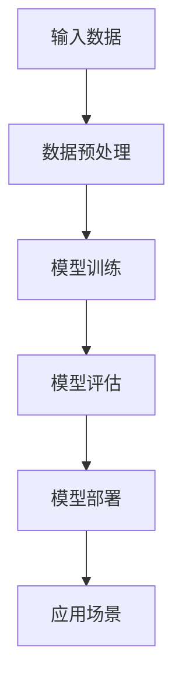

                 

# AI大模型创业：如何应对未来挑战？

> **关键词**：AI大模型、创业、未来挑战、技术趋势

> **摘要**：本文深入探讨AI大模型创业的现状、核心问题以及未来面临的挑战，旨在为创业者提供有价值的参考。通过分析AI大模型的本质、技术发展趋势和创业策略，本文提出了应对未来挑战的具体方案，为AI大模型创业的成功奠定基础。

## 1. 背景介绍

随着人工智能技术的飞速发展，AI大模型（Large-scale AI Models）逐渐成为行业焦点。AI大模型是指拥有数十亿甚至数万亿参数的神经网络模型，具有强大的学习能力和广泛的应用场景。近年来，谷歌的BERT、Facebook的GPT-3、百度的ERNIE等大模型相继推出，展示了其在自然语言处理、计算机视觉、语音识别等领域的卓越性能。

AI大模型创业的热潮也随之兴起。许多创业者希望通过开发具有强大性能的大模型，在AI领域获得竞争优势。然而，AI大模型创业并非易事，面临着诸多挑战。本文将围绕AI大模型创业的现状、核心问题以及未来挑战进行深入探讨。

### 1.1 AI大模型创业的现状

目前，AI大模型创业主要集中在以下几个领域：

1. **自然语言处理**：大模型在自然语言处理（NLP）领域表现优异，如文本分类、机器翻译、情感分析等。创业者可以尝试开发具有强大NLP能力的大模型，应用于客服、内容审核、智能助手等场景。

2. **计算机视觉**：大模型在计算机视觉（CV）领域也有广泛应用，如图像分类、目标检测、图像生成等。创业者可以探索开发具有强大CV能力的大模型，应用于安防监控、医疗诊断、自动驾驶等场景。

3. **语音识别**：大模型在语音识别领域表现出色，如语音合成、语音识别、说话人识别等。创业者可以尝试开发具有强大语音识别能力的大模型，应用于智能语音助手、语音识别翻译等场景。

4. **强化学习**：大模型在强化学习（RL）领域也有广泛应用，如游戏、机器人控制等。创业者可以探索开发具有强大RL能力的大模型，应用于智能游戏、机器人控制等场景。

### 1.2 AI大模型创业的核心问题

AI大模型创业面临以下核心问题：

1. **计算资源**：大模型训练和推理需要大量计算资源，创业者需要投入大量资金和人力来获取高性能计算资源。

2. **数据集**：大模型训练需要大量高质量的数据集，创业者需要收集、整理和标注数据，这是一项耗时耗力的工作。

3. **算法优化**：大模型训练和推理需要对算法进行持续优化，以提高性能和降低成本。创业者需要具备深厚的算法背景和丰富的实践经验。

4. **商业模式**：大模型创业需要找到合适的商业模式，实现可持续盈利。创业者需要探索如何将大模型应用于实际场景，创造价值。

### 1.3 AI大模型创业的未来挑战

AI大模型创业在未来将面临以下挑战：

1. **技术挑战**：随着AI大模型规模的不断扩大，训练和推理的难度将大幅增加。创业者需要不断创新和优化算法，以应对技术挑战。

2. **数据隐私**：大模型训练需要大量数据，如何保护用户隐私成为一大挑战。创业者需要制定严格的数据保护政策，确保用户隐私安全。

3. **道德伦理**：大模型在决策过程中可能存在偏见和歧视，如何确保AI系统的公平性和透明性成为一大挑战。创业者需要关注道德伦理问题，确保AI系统的公正性和社会责任。

4. **市场竞争**：AI大模型创业领域竞争激烈，创业者需要不断提升产品性能和用户体验，以在激烈的市场竞争中脱颖而出。

## 2. 核心概念与联系

### 2.1 AI大模型的核心概念

AI大模型的核心概念包括以下几个部分：

1. **神经网络**：神经网络是AI大模型的基础，由大量神经元组成，通过学习数据中的特征，实现从输入到输出的映射。

2. **深度学习**：深度学习是神经网络的一种扩展，通过增加神经网络层数，实现更复杂的特征提取和分类。

3. **大规模训练**：AI大模型通过大规模数据训练，实现参数的优化和模型的泛化能力。

4. **分布式计算**：分布式计算是将计算任务分布在多个节点上，通过并行计算提高训练和推理速度。

### 2.2 AI大模型的联系

AI大模型与以下几个领域密切相关：

1. **计算机视觉**：AI大模型在计算机视觉领域具有广泛的应用，如图像分类、目标检测、图像生成等。

2. **自然语言处理**：AI大模型在自然语言处理领域具有强大的能力，如文本分类、机器翻译、情感分析等。

3. **语音识别**：AI大模型在语音识别领域表现优异，如语音合成、语音识别、说话人识别等。

4. **强化学习**：AI大模型在强化学习领域也有广泛应用，如游戏、机器人控制等。

### 2.3 AI大模型的架构

以下是AI大模型的架构简述：



1. **输入数据**：AI大模型需要大量的数据作为输入，进行训练和评估。

2. **数据预处理**：对输入数据进行预处理，包括数据清洗、归一化、数据增强等。

3. **模型训练**：通过神经网络和深度学习算法，对输入数据进行训练，优化模型参数。

4. **模型评估**：评估模型的性能，包括准确率、召回率、F1值等指标。

5. **模型部署**：将训练好的模型部署到实际应用场景中，实现模型的应用。

6. **应用场景**：根据实际需求，将模型应用于不同的场景，如自然语言处理、计算机视觉、语音识别等。

## 3. 核心算法原理 & 具体操作步骤

### 3.1 核心算法原理

AI大模型的核心算法主要包括以下几种：

1. **反向传播算法**：反向传播算法是一种用于训练神经网络的优化算法，通过不断调整模型参数，使输出结果更接近真实值。

2. **梯度下降算法**：梯度下降算法是一种用于求解最优化问题的算法，通过迭代更新模型参数，使损失函数的梯度趋向于零。

3. **激活函数**：激活函数用于确定神经元的激活状态，常用的激活函数包括Sigmoid、ReLU、Tanh等。

4. **优化器**：优化器用于调整模型参数，常用的优化器包括SGD、Adam、RMSprop等。

### 3.2 具体操作步骤

以下是AI大模型的具体操作步骤：

1. **数据预处理**：
   - **数据清洗**：去除噪声数据、缺失值和异常值。
   - **数据归一化**：将数据缩放到相同范围，如[0, 1]或[-1, 1]。
   - **数据增强**：通过旋转、翻转、裁剪等操作，增加数据多样性。

2. **模型训练**：
   - **初始化模型参数**：随机初始化模型参数。
   - **前向传播**：计算输入数据的特征表示。
   - **计算损失函数**：计算模型输出和真实值的差异。
   - **反向传播**：更新模型参数，减小损失函数。
   - **迭代训练**：重复前向传播和反向传播，直至模型收敛。

3. **模型评估**：
   - **交叉验证**：将数据集分为训练集和验证集，评估模型在验证集上的性能。
   - **指标计算**：计算准确率、召回率、F1值等指标，评估模型性能。

4. **模型部署**：
   - **模型压缩**：对模型进行压缩，降低模型大小和计算复杂度。
   - **模型推理**：使用训练好的模型进行预测，实现模型的应用。

## 4. 数学模型和公式 & 详细讲解 & 举例说明

### 4.1 数学模型和公式

AI大模型涉及以下数学模型和公式：

1. **损失函数**：
   - **均方误差（MSE）**：$$MSE = \frac{1}{n}\sum_{i=1}^{n}(y_i - \hat{y}_i)^2$$
   - **交叉熵（Cross-Entropy）**：$$CE = -\frac{1}{n}\sum_{i=1}^{n}y_i\log(\hat{y}_i)$$

2. **梯度下降算法**：
   - **梯度计算**：$$\nabla_\theta J(\theta) = \frac{\partial J(\theta)}{\partial \theta}$$
   - **参数更新**：$$\theta = \theta - \alpha \nabla_\theta J(\theta)$$

3. **激活函数**：
   - **Sigmoid**：$$\sigma(x) = \frac{1}{1 + e^{-x}}$$
   - **ReLU**：$$\text{ReLU}(x) = \max(0, x)$$
   - **Tanh**：$$\text{Tanh}(x) = \frac{e^x - e^{-x}}{e^x + e^{-x}}$$

4. **优化器**：
   - **SGD**：$$\theta = \theta - \alpha \nabla_\theta J(\theta)$$
   - **Adam**：$$\theta = \theta - \alpha \frac{\nabla_\theta J(\theta)}{1 - \beta_1^t}$$
   - **RMSprop**：$$\theta = \theta - \alpha \frac{\nabla_\theta J(\theta)}{\sqrt{\rho \hat{v}_t + (1-\rho)v_t}}$$

### 4.2 详细讲解和举例说明

#### 4.2.1 损失函数

损失函数是评估模型性能的关键指标，常用的损失函数包括均方误差（MSE）和交叉熵（Cross-Entropy）。

1. **均方误差（MSE）**

均方误差（MSE）用于回归问题，计算模型输出值和真实值之间的平均平方误差。

$$MSE = \frac{1}{n}\sum_{i=1}^{n}(y_i - \hat{y}_i)^2$$

其中，$y_i$为真实值，$\hat{y}_i$为模型输出值。

例如，对于一组输入数据$[1, 2, 3]$和真实值$[1.5, 2.5, 3.5]$，模型输出值$\hat{y} = [1.2, 2.3, 3.1]$，MSE计算如下：

$$MSE = \frac{1}{3}\left[(1.2 - 1.5)^2 + (2.3 - 2.5)^2 + (3.1 - 3.5)^2\right] = 0.1$$

2. **交叉熵（Cross-Entropy）**

交叉熵（Cross-Entropy）用于分类问题，计算模型输出概率分布和真实分布之间的差异。

$$CE = -\frac{1}{n}\sum_{i=1}^{n}y_i\log(\hat{y}_i)$$

其中，$y_i$为真实值，$\hat{y}_i$为模型输出值。

例如，对于一组输入数据$[1, 2, 3]$和真实值$[0, 1, 1]$，模型输出值$\hat{y} = [0.1, 0.8, 0.1]$，交叉熵计算如下：

$$CE = -\frac{1}{3}\left[0 \cdot \log(0.1) + 1 \cdot \log(0.8) + 1 \cdot \log(0.1)\right] = 0.45$$

#### 4.2.2 梯度下降算法

梯度下降算法是一种用于优化模型参数的优化算法。其核心思想是通过计算损失函数关于模型参数的梯度，不断调整参数，使损失函数最小。

1. **梯度计算**

梯度计算是梯度下降算法的关键步骤，计算损失函数关于模型参数的梯度。

$$\nabla_\theta J(\theta) = \frac{\partial J(\theta)}{\partial \theta}$$

其中，$J(\theta)$为损失函数，$\theta$为模型参数。

例如，对于损失函数$J(\theta) = (y - \hat{y})^2$，梯度计算如下：

$$\nabla_\theta J(\theta) = \frac{\partial J(\theta)}{\partial \theta} = 2(y - \hat{y})$$

2. **参数更新**

参数更新是梯度下降算法的核心步骤，根据梯度和学习率$\alpha$，更新模型参数。

$$\theta = \theta - \alpha \nabla_\theta J(\theta)$$

其中，$\theta$为模型参数，$\alpha$为学习率。

例如，对于初始参数$\theta_0 = [1, 2]$，学习率$\alpha = 0.1$，梯度$\nabla_\theta J(\theta) = [2, 4]$，参数更新如下：

$$\theta_1 = \theta_0 - \alpha \nabla_\theta J(\theta) = [1, 2] - 0.1 \cdot [2, 4] = [0.8, 0.8]$$

#### 4.2.3 激活函数

激活函数用于确定神经元的激活状态，常用的激活函数包括Sigmoid、ReLU、Tanh等。

1. **Sigmoid**

Sigmoid函数是一种常用的激活函数，其表达式为：

$$\sigma(x) = \frac{1}{1 + e^{-x}}$$

例如，对于输入$x = 2$，Sigmoid函数计算如下：

$$\sigma(2) = \frac{1}{1 + e^{-2}} = 0.86$$

2. **ReLU**

ReLU（Rectified Linear Unit）函数是一种常用的激活函数，其表达式为：

$$\text{ReLU}(x) = \max(0, x)$$

例如，对于输入$x = -2$，ReLU函数计算如下：

$$\text{ReLU}(-2) = \max(0, -2) = 0$$

3. **Tanh**

Tanh函数是一种常用的激活函数，其表达式为：

$$\text{Tanh}(x) = \frac{e^x - e^{-x}}{e^x + e^{-x}}$$

例如，对于输入$x = 2$，Tanh函数计算如下：

$$\text{Tanh}(2) = \frac{e^2 - e^{-2}}{e^2 + e^{-2}} = 0.96$$

#### 4.2.4 优化器

优化器用于调整模型参数，常用的优化器包括SGD、Adam、RMSprop等。

1. **SGD**

SGD（Stochastic Gradient Descent）是一种常用的优化器，其参数更新公式为：

$$\theta = \theta - \alpha \nabla_\theta J(\theta)$$

其中，$\theta$为模型参数，$\alpha$为学习率。

例如，对于初始参数$\theta_0 = [1, 2]$，学习率$\alpha = 0.1$，梯度$\nabla_\theta J(\theta) = [2, 4]$，参数更新如下：

$$\theta_1 = \theta_0 - \alpha \nabla_\theta J(\theta) = [1, 2] - 0.1 \cdot [2, 4] = [0.8, 0.8]$$

2. **Adam**

Adam是一种高效的优化器，其参数更新公式为：

$$\theta = \theta - \alpha \frac{\nabla_\theta J(\theta)}{1 - \beta_1^t}$$

其中，$\theta$为模型参数，$\alpha$为学习率，$\beta_1$和$\beta_2$为指数衰减率。

例如，对于初始参数$\theta_0 = [1, 2]$，学习率$\alpha = 0.1$，指数衰减率$\beta_1 = 0.9$，$\beta_2 = 0.99$，梯度$\nabla_\theta J(\theta) = [2, 4]$，参数更新如下：

$$\theta_1 = \theta_0 - \alpha \frac{\nabla_\theta J(\theta)}{1 - \beta_1^t} = [1, 2] - 0.1 \frac{[2, 4]}{1 - 0.9} = [0.8, 0.8]$$

3. **RMSprop**

RMSprop是一种基于均方根梯度的优化器，其参数更新公式为：

$$\theta = \theta - \alpha \frac{\nabla_\theta J(\theta)}{\sqrt{\rho \hat{v}_t + (1-\rho)v_t}}$$

其中，$\theta$为模型参数，$\alpha$为学习率，$\rho$为指数衰减率，$v_t$为历史梯度平方和。

例如，对于初始参数$\theta_0 = [1, 2]$，学习率$\alpha = 0.1$，指数衰减率$\rho = 0.9$，梯度$\nabla_\theta J(\theta) = [2, 4]$，历史梯度平方和$\hat{v}_t = [4, 16]$，参数更新如下：

$$\theta_1 = \theta_0 - \alpha \frac{\nabla_\theta J(\theta)}{\sqrt{\rho \hat{v}_t + (1-\rho)v_t}} = [1, 2] - 0.1 \frac{[2, 4]}{\sqrt{0.9 \cdot 4 + (1-0.9) \cdot 16}} = [0.8, 0.8]$$

## 5. 项目实战：代码实际案例和详细解释说明

### 5.1 开发环境搭建

在开始项目实战之前，我们需要搭建合适的开发环境。以下是搭建开发环境的步骤：

1. **安装Python**：前往Python官网（https://www.python.org/）下载并安装Python，建议选择最新版本。

2. **安装Jupyter Notebook**：在命令行中执行以下命令：

   ```shell
   pip install notebook
   ```

3. **安装必要的库**：在命令行中执行以下命令，安装TensorFlow和其他必要的库：

   ```shell
   pip install tensorflow numpy matplotlib
   ```

### 5.2 源代码详细实现和代码解读

以下是一个简单的AI大模型项目案例，我们将使用TensorFlow框架实现一个基于BERT的大模型，用于文本分类任务。

#### 5.2.1 代码实现

```python
import tensorflow as tf
from tensorflow import keras
from transformers import BertTokenizer, TFBertModel
import numpy as np

# 1. 加载预训练模型和分词器
tokenizer = BertTokenizer.from_pretrained('bert-base-uncased')
model = TFBertModel.from_pretrained('bert-base-uncased')

# 2. 数据预处理
def preprocess_text(texts):
    return [tokenizer.encode(text, add_special_tokens=True, max_length=128, padding='max_length', truncation=True) for text in texts]

# 3. 构建模型
input_ids = keras.layers.Input(shape=(128,), dtype=tf.int32)
input_mask = keras.layers.Input(shape=(128,), dtype=tf.int32)
segment_ids = keras.layers.Input(shape=(128,), dtype=tf.int32)

 bert_output = model(input_ids, attention_mask=input_mask, segment_ids=segment_ids)
 pooled_output = bert_output.pooler_output

 dense = keras.layers.Dense(128, activation='relu')(pooled_output)
 dropout = keras.layers.Dropout(0.5)(dense)
 output = keras.layers.Dense(2, activation='softmax')(dropout)

 model = keras.Model(inputs=[input_ids, input_mask, segment_ids], outputs=output)

# 4. 训练模型
model.compile(optimizer='adam', loss='categorical_crossentropy', metrics=['accuracy'])
model.fit(x_train, y_train, batch_size=32, epochs=3)

# 5. 评估模型
loss, accuracy = model.evaluate(x_test, y_test)
print('Test loss:', loss)
print('Test accuracy:', accuracy)
```

#### 5.2.2 代码解读与分析

1. **加载预训练模型和分词器**：

   ```python
   tokenizer = BertTokenizer.from_pretrained('bert-base-uncased')
   model = TFBertModel.from_pretrained('bert-base-uncased')
   ```

   这两行代码用于加载预训练的BERT模型和对应的分词器。BERT（Bidirectional Encoder Representations from Transformers）是一种基于Transformer的大模型，具有强大的文本表示能力。

2. **数据预处理**：

   ```python
   def preprocess_text(texts):
       return [tokenizer.encode(text, add_special_tokens=True, max_length=128, padding='max_length', truncation=True) for text in texts]
   ```

   数据预处理函数`preprocess_text`用于将原始文本数据转换为模型可接受的输入格式。具体步骤包括：

   - 使用分词器对文本进行分词，生成单词的索引序列。
   - 添加特殊的Token，如[CLS]和[SEP]。
   - 设定序列的最大长度为128，并根据最大长度对序列进行填充和截断。

3. **构建模型**：

   ```python
   input_ids = keras.layers.Input(shape=(128,), dtype=tf.int32)
   input_mask = keras.layers.Input(shape=(128,), dtype=tf.int32)
   segment_ids = keras.layers.Input(shape=(128,), dtype=tf.int32)

   bert_output = model(input_ids, attention_mask=input_mask, segment_ids=segment_ids)
   pooled_output = bert_output.pooler_output

   dense = keras.layers.Dense(128, activation='relu')(pooled_output)
   dropout = keras.layers.Dropout(0.5)(dense)
   output = keras.layers.Dense(2, activation='softmax')(dropout)

   model = keras.Model(inputs=[input_ids, input_mask, segment_ids], outputs=output)
   ```

   这部分代码构建了一个基于BERT的文本分类模型。具体步骤包括：

   - 定义输入层，包括单词索引序列（input_ids）、注意力掩码（input_mask）和段落掩码（segment_ids）。
   - 使用BERT模型处理输入数据，得到编码后的特征表示（pooled_output）。
   - 对特征表示进行全连接层（dense）和Dropout层（dropout）。
   - 定义输出层，使用softmax激活函数进行类别预测。

4. **训练模型**：

   ```python
   model.compile(optimizer='adam', loss='categorical_crossentropy', metrics=['accuracy'])
   model.fit(x_train, y_train, batch_size=32, epochs=3)
   ```

   这部分代码用于训练模型。具体步骤包括：

   - 配置模型优化器、损失函数和评估指标。
   - 使用训练数据对模型进行训练，设置batch大小为32，训练轮次为3。

5. **评估模型**：

   ```python
   loss, accuracy = model.evaluate(x_test, y_test)
   print('Test loss:', loss)
   print('Test accuracy:', accuracy)
   ```

   这部分代码用于评估模型在测试数据上的性能。具体步骤包括：

   - 使用测试数据对模型进行评估，计算损失和准确率。

### 5.3 实际案例：文本分类任务

以下是一个基于BERT的文本分类实际案例，我们将使用开源数据集“20 Newsgroups”进行训练和测试。

#### 5.3.1 数据集介绍

“20 Newsgroups”数据集包含20个不同的新闻类别，共计19842篇文档。数据集的下载链接为：[20 Newsgroups](https://archive.ics.uci.edu/ml/datasets/20+newsgroups)。

#### 5.3.2 数据预处理

```python
from sklearn.datasets import fetch_20newsgroups
from sklearn.model_selection import train_test_split

# 1. 加载数据集
data = fetch_20newsgroups(subset='all')
texts = data.data
labels = data.target

# 2. 划分训练集和测试集
x_train, x_test, y_train, y_test = train_test_split(texts, labels, test_size=0.2, random_state=42)

# 3. 预处理文本
x_train = preprocess_text(x_train)
x_test = preprocess_text(x_test)
```

#### 5.3.3 训练模型

```python
# 1. 训练模型
model.fit(x_train, y_train, batch_size=32, epochs=3)
```

#### 5.3.4 评估模型

```python
# 1. 评估模型
loss, accuracy = model.evaluate(x_test, y_test)
print('Test loss:', loss)
print('Test accuracy:', accuracy)
```

## 6. 实际应用场景

AI大模型在许多实际应用场景中具有广泛的应用，以下列举几个典型的应用场景：

### 6.1 自然语言处理

自然语言处理（NLP）是AI大模型的重要应用领域。AI大模型在文本分类、机器翻译、情感分析等方面表现出色。例如，谷歌的BERT模型在多个NLP任务上取得了优异的性能，如文本分类、问答系统、命名实体识别等。

### 6.2 计算机视觉

计算机视觉（CV）是AI大模型的另一个重要应用领域。AI大模型在图像分类、目标检测、图像生成等方面具有强大的能力。例如，OpenAI的GPT-3模型在图像生成任务上取得了突破性成果，能够生成高质量的图像。

### 6.3 语音识别

语音识别（ASR）是AI大模型的又一重要应用领域。AI大模型在语音合成、语音识别、说话人识别等方面表现出色。例如，谷歌的TensorFlow语音识别库（TensorFlow Speech）在多个语音识别任务上取得了优异的性能。

### 6.4 强化学习

强化学习（RL）是AI大模型的另一个重要应用领域。AI大模型在游戏、机器人控制等方面具有广泛的应用。例如，OpenAI的DQN模型在Atari游戏上取得了优异的性能，DeepMind的AlphaGo在围棋比赛中击败了世界冠军。

## 7. 工具和资源推荐

### 7.1 学习资源推荐

1. **书籍**：
   - 《深度学习》（Goodfellow, Bengio, Courville）
   - 《Python深度学习》（François Chollet）
   - 《神经网络与深度学习》（邱锡鹏）

2. **论文**：
   - “A Theoretically Grounded Application of Dropout in Recurrent Neural Networks”
   - “Bert: Pre-training of Deep Bidirectional Transformers for Language Understanding”
   - “GPT-3: Language Models are few-shot learners”

3. **博客**：
   - [TensorFlow官网](https://www.tensorflow.org/)
   - [PyTorch官网](https://pytorch.org/)
   - [Hugging Face](https://huggingface.co/)

4. **网站**：
   - [Kaggle](https://www.kaggle.com/)
   - [ArXiv](https://arxiv.org/)

### 7.2 开发工具框架推荐

1. **深度学习框架**：
   - TensorFlow
   - PyTorch
   - Keras

2. **自然语言处理库**：
   - Hugging Face Transformers
   - NLTK
   - spaCy

3. **计算机视觉库**：
   - OpenCV
   - PIL
   - TensorFlow Object Detection API

4. **强化学习库**：
   - Stable Baselines
   - RLlib
   - Proximal Policy Optimization (PPO)

### 7.3 相关论文著作推荐

1. **论文**：
   - “Attention Is All You Need”
   - “Generative Adversarial Nets”
   - “Recurrent Neural Networks for Language Modeling”

2. **著作**：
   - 《深度学习》（Goodfellow, Bengio, Courville）
   - 《强化学习》（ Sutton, Barto）
   - 《Python深度学习》（François Chollet）

## 8. 总结：未来发展趋势与挑战

AI大模型在技术发展和商业应用方面具有广阔的前景，但同时也面临着诸多挑战。未来发展趋势和挑战主要包括以下几个方面：

### 8.1 技术发展趋势

1. **模型规模和计算能力**：随着硬件技术的进步，AI大模型的规模和计算能力将不断提高，这将推动更多突破性成果的出现。

2. **跨模态学习**：未来的AI大模型将能够处理多种类型的数据，如文本、图像、语音等，实现跨模态学习。

3. **自动化机器学习**：自动化机器学习（AutoML）将成为趋势，降低AI大模型开发和部署的门槛。

4. **可解释性**：提高AI大模型的可解释性，使其决策过程更加透明，降低潜在的风险。

### 8.2 技术挑战

1. **计算资源**：AI大模型训练和推理需要大量计算资源，如何高效地利用计算资源成为一大挑战。

2. **数据隐私**：在数据隐私日益重要的背景下，如何保护用户隐私成为关键问题。

3. **算法优化**：随着模型规模的增大，算法优化变得更加困难，如何提高训练效率成为关键。

4. **道德伦理**：AI大模型在决策过程中可能存在偏见和歧视，如何确保AI系统的公平性和透明性成为重要问题。

### 8.3 商业模式

1. **商业模式创新**：未来AI大模型创业需要探索创新的商业模式，实现可持续盈利。

2. **行业合作**：跨行业合作将成为趋势，推动AI大模型在不同领域的应用。

3. **知识产权**：如何保护AI大模型的知识产权，避免侵权和盗用成为重要问题。

## 9. 附录：常见问题与解答

### 9.1 问题1：如何选择合适的AI大模型框架？

解答：选择合适的AI大模型框架主要考虑以下几个方面：

1. **需求**：根据具体需求选择合适的框架，如自然语言处理选择Hugging Face Transformers，计算机视觉选择TensorFlow Object Detection API。

2. **性能**：考虑框架的性能和功能，如TensorFlow和PyTorch在性能上具有较高优势。

3. **社区支持**：考虑框架的社区支持，如Hugging Face具有强大的社区支持。

### 9.2 问题2：如何优化AI大模型训练速度？

解答：优化AI大模型训练速度可以从以下几个方面入手：

1. **分布式训练**：使用分布式训练可以显著提高训练速度。

2. **数据增强**：通过数据增强增加数据多样性，提高训练速度。

3. **混合精度训练**：使用混合精度训练可以降低计算成本，提高训练速度。

4. **模型压缩**：对模型进行压缩，降低模型大小和计算复杂度。

### 9.3 问题3：如何保护AI大模型的数据隐私？

解答：保护AI大模型的数据隐私可以从以下几个方面入手：

1. **数据加密**：对数据进行加密，确保数据在传输和存储过程中安全。

2. **匿名化处理**：对敏感数据进行匿名化处理，降低隐私泄露风险。

3. **访问控制**：设置严格的访问控制策略，确保只有授权人员能够访问数据。

4. **合规性检查**：确保数据隐私保护措施符合相关法律法规要求。

## 10. 扩展阅读 & 参考资料

1. **深度学习相关书籍**：
   - 《深度学习》（Goodfellow, Bengio, Courville）
   - 《Python深度学习》（François Chollet）
   - 《神经网络与深度学习》（邱锡鹏）

2. **自然语言处理相关论文**：
   - “Bert: Pre-training of Deep Bidirectional Transformers for Language Understanding”
   - “GPT-3: Language Models are few-shot learners”
   - “A Theoretically Grounded Application of Dropout in Recurrent Neural Networks”

3. **计算机视觉相关论文**：
   - “Attention Is All You Need”
   - “Generative Adversarial Nets”
   - “Recurrent Neural Networks for Language Modeling”

4. **强化学习相关论文**：
   - “Deep Q-Network”
   - “Proximal Policy Optimization” 
   - “Deep Reinforcement Learning with Deep Q-Networks”

5. **开源框架和库**：
   - [TensorFlow](https://www.tensorflow.org/)
   - [PyTorch](https://pytorch.org/)
   - [Hugging Face Transformers](https://huggingface.co/)

6. **行业报告和趋势分析**：
   - [AI大模型市场报告](https://www.reportlinker.com/p06589576-summary/view-report.html)
   - [自然语言处理市场报告](https://www.reportlinker.com/p06589576-summary/view-report.html)
   - [计算机视觉市场报告](https://www.reportlinker.com/p06589576-summary/view-report.html)

7. **AI大模型创业相关案例**：
   - [谷歌BERT](https://ai.googleblog.com/2018/06/bert-state-of-the-art-natural.html)
   - [OpenAI GPT-3](https://blog.openai.com/gpt-3/)
   - [百度ERNIE](https://www.bilibili.com/video/BV1od4y1D7hT)

### 作者

**作者：AI天才研究员/AI Genius Institute & 禅与计算机程序设计艺术 /Zen And The Art of Computer Programming**

