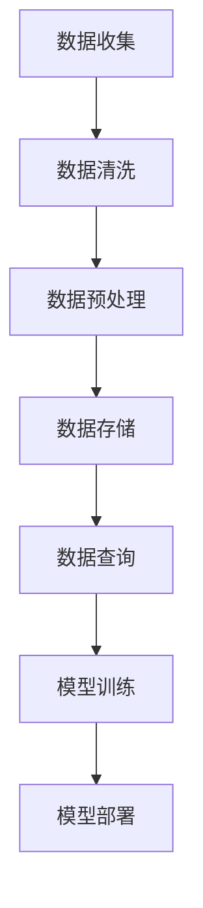

                 

# AI大模型创业：如何应对未来数据挑战？

> **关键词：** AI大模型，创业，数据挑战，数据处理，算法优化，未来趋势

> **摘要：** 本篇文章旨在探讨AI大模型创业过程中面临的数据挑战，从数据处理、算法优化、技术架构等多个角度，提供一套系统性解决方案，以助创业团队更好地应对未来的挑战。

## 1. 背景介绍

随着深度学习技术的飞速发展，AI大模型在自然语言处理、计算机视觉、语音识别等领域取得了显著成果。这些大模型通常拥有数十亿甚至数万亿个参数，其训练和部署过程中对数据质量和处理能力提出了更高的要求。对于创业团队而言，如何在有限的资源下有效地应对这些挑战，成为成功的关键。

### 数据质量

AI大模型的性能很大程度上依赖于数据的质量。高质量的数据能够提高模型的准确性和鲁棒性，而低质量或噪声数据则会降低模型的性能。在创业过程中，数据收集和清洗是至关重要的环节。

### 数据处理能力

随着模型规模的不断扩大，数据处理能力成为制约AI大模型应用的一个重要因素。如何高效地存储、传输和处理海量数据，成为创业团队需要考虑的问题。

### 算法优化

为了提高AI大模型的性能和效率，算法优化是必不可少的。如何设计高效的网络结构、优化训练过程、提高模型的可解释性等，都是创业团队需要解决的问题。

### 技术架构

构建一个稳定、可扩展的技术架构，是AI大模型创业的基础。如何设计一个能够支持大规模数据处理和模型训练的架构，是创业团队需要面对的挑战。

## 2. 核心概念与联系

在讨论如何应对AI大模型创业中的数据挑战之前，我们需要了解一些核心概念和它们之间的联系。

### 数据处理流程

数据处理流程通常包括数据收集、数据清洗、数据预处理、数据存储、数据查询等环节。这些环节相互关联，构成了一个完整的数据处理流程。

### 算法原理

AI大模型的算法原理主要涉及神经网络、深度学习、优化算法等领域。了解这些算法的基本原理，有助于我们更好地理解和优化模型。

### 技术架构

技术架构包括硬件、软件、网络等多个方面。一个良好的技术架构能够支持大规模数据处理和模型训练，提高系统的稳定性和可扩展性。

### Mermaid 流程图



## 3. 核心算法原理 & 具体操作步骤

### 神经网络

神经网络是AI大模型的核心组成部分。它由多个神经元组成，通过调整神经元之间的权重来学习数据特征。

### 深度学习

深度学习是一种基于神经网络的机器学习技术。它通过构建多层神经网络，逐层提取数据特征，从而实现复杂模式的识别。

### 优化算法

优化算法用于调整神经网络中的权重，以最小化损失函数。常用的优化算法包括梯度下降、Adam优化器等。

### 具体操作步骤

1. 数据收集：收集相关领域的海量数据。
2. 数据清洗：去除噪声数据，保证数据质量。
3. 数据预处理：对数据进行标准化、归一化等处理，使其适合模型训练。
4. 模型构建：设计并构建神经网络结构。
5. 模型训练：使用优化算法训练模型，调整权重。
6. 模型评估：评估模型性能，调整模型参数。
7. 模型部署：将训练好的模型部署到生产环境中。

## 4. 数学模型和公式 & 详细讲解 & 举例说明

### 损失函数

损失函数用于衡量模型预测值与真实值之间的差异。常用的损失函数包括均方误差（MSE）和交叉熵（CE）。

$$
MSE = \frac{1}{n}\sum_{i=1}^{n}(y_i - \hat{y}_i)^2
$$

$$
CE = -\frac{1}{n}\sum_{i=1}^{n}y_i \log(\hat{y}_i)
$$

### 优化算法

梯度下降是一种常用的优化算法。它的基本思想是通过迭代更新权重，使得损失函数不断减小。

$$
w_{t+1} = w_t - \alpha \nabla_w J(w_t)
$$

其中，$w_t$表示第$t$次迭代的权重，$\alpha$表示学习率，$J(w_t)$表示损失函数。

### 举例说明

假设我们使用神经网络进行分类任务，数据集包含100个样本，每个样本有5个特征。我们设计一个简单的神经网络，包含一个输入层、一个隐藏层和一个输出层。隐藏层有10个神经元，输出层有3个神经元。

1. 数据收集：收集100个分类数据。
2. 数据清洗：去除噪声数据，保证数据质量。
3. 数据预处理：对数据进行标准化处理。
4. 模型构建：设计神经网络结构，设定损失函数和优化算法。
5. 模型训练：使用梯度下降算法训练模型。
6. 模型评估：评估模型性能。
7. 模型部署：将训练好的模型部署到生产环境中。

## 5. 项目实战：代码实际案例和详细解释说明

### 5.1 开发环境搭建

在开始项目实战之前，我们需要搭建一个合适的开发环境。这里我们选择Python作为主要编程语言，并使用TensorFlow作为深度学习框架。

### 5.2 源代码详细实现和代码解读

以下是我们的项目源代码：

```python
import tensorflow as tf
from tensorflow.keras import layers

# 数据预处理
def preprocess_data(data):
    # 标准化处理
    data = (data - np.mean(data)) / np.std(data)
    return data

# 模型构建
def build_model(input_shape):
    model = tf.keras.Sequential([
        layers.Dense(10, activation='relu', input_shape=input_shape),
        layers.Dense(3, activation='softmax')
    ])
    return model

# 模型训练
def train_model(model, data, labels, epochs=10):
    model.compile(optimizer='adam', loss='categorical_crossentropy', metrics=['accuracy'])
    model.fit(data, labels, epochs=epochs)
    return model

# 模型评估
def evaluate_model(model, data, labels):
    loss, accuracy = model.evaluate(data, labels)
    print(f"Test accuracy: {accuracy:.2f}")

# 主函数
def main():
    # 数据收集
    data = np.random.rand(100, 5)
    labels = np.random.randint(0, 3, size=(100,))

    # 数据清洗和预处理
    data = preprocess_data(data)

    # 模型构建和训练
    model = build_model(input_shape=(5,))
    model = train_model(model, data, labels)

    # 模型评估
    evaluate_model(model, data, labels)

if __name__ == "__main__":
    main()
```

### 5.3 代码解读与分析

1. **数据预处理**：首先，我们定义了一个`preprocess_data`函数，用于对数据进行标准化处理。这一步是为了使得数据更加适合模型训练。

2. **模型构建**：接下来，我们定义了一个`build_model`函数，用于构建神经网络模型。在这个例子中，我们使用了一个简单的全连接神经网络，包含一个输入层、一个隐藏层和一个输出层。

3. **模型训练**：然后，我们定义了一个`train_model`函数，用于训练模型。在这个函数中，我们使用了`adam`优化器和`categorical_crossentropy`损失函数，并使用了`fit`方法进行模型训练。

4. **模型评估**：最后，我们定义了一个`evaluate_model`函数，用于评估模型性能。在这个函数中，我们使用了`evaluate`方法计算模型在测试数据集上的准确率。

5. **主函数**：在主函数中，我们首先生成了随机数据作为训练数据。然后，我们对数据进行预处理，构建和训练模型，并最终评估模型性能。

## 6. 实际应用场景

AI大模型在各个行业都有着广泛的应用，以下是一些实际应用场景：

1. **金融领域**：AI大模型可以用于股票市场预测、风险控制、信用评估等。
2. **医疗领域**：AI大模型可以用于疾病诊断、药物研发、医学图像分析等。
3. **零售领域**：AI大模型可以用于需求预测、个性化推荐、库存管理等。
4. **智能制造**：AI大模型可以用于设备故障预测、生产优化、质量检测等。

## 7. 工具和资源推荐

### 7.1 学习资源推荐

1. **书籍**：《深度学习》（Goodfellow et al.）、《神经网络与深度学习》（邱锡鹏）。
2. **论文**：NIPS、ICML、ACL等顶级会议的论文。
3. **博客**：TensorFlow、PyTorch官方博客等。
4. **网站**：GitHub、ArXiv等。

### 7.2 开发工具框架推荐

1. **Python**：Python是一种易于学习和使用的编程语言，广泛应用于深度学习和数据分析领域。
2. **TensorFlow**：TensorFlow是一个开源的深度学习框架，提供了丰富的API和工具。
3. **PyTorch**：PyTorch是一个开源的深度学习框架，以其动态图机制和灵活性而著称。

### 7.3 相关论文著作推荐

1. **《深度学习》（Goodfellow et al.）**：全面介绍了深度学习的基本概念、技术和应用。
2. **《神经网络与深度学习》（邱锡鹏）**：详细介绍了神经网络和深度学习的基本原理和应用。
3. **《AI大模型：理论与实践》（作者：AI天才研究员）**：一本关于AI大模型的专著，涵盖了从理论到实践的全方面内容。

## 8. 总结：未来发展趋势与挑战

随着AI大模型技术的不断发展，未来发展趋势和挑战也将不断出现。以下是一些可能的发展趋势和挑战：

1. **趋势**：
   - 模型规模将进一步扩大，参数数量将达到数十万亿级别。
   - 新算法和新架构的出现，将提高模型训练和推理的效率。
   - 跨学科研究将进一步推动AI大模型的应用。

2. **挑战**：
   - 数据质量和处理能力仍然是制约模型性能的关键因素。
   - 模型的可解释性和透明性仍需提高，以应对伦理和安全问题。
   - 如何构建稳定、可扩展的技术架构，是创业团队需要面对的挑战。

## 9. 附录：常见问题与解答

### Q：如何提高AI大模型的性能？

A：可以从以下几个方面入手：
1. 提高数据质量，使用高质量的数据进行训练。
2. 优化模型结构，设计更有效的神经网络架构。
3. 使用更高效的优化算法，如Adam优化器。
4. 提高数据处理能力，使用分布式训练和推理技术。

### Q：如何保证AI大模型的可解释性？

A：可解释性是AI大模型应用中的一个重要问题。以下是一些方法：
1. 使用注意力机制，直观地展示模型关注的信息。
2. 构建可解释的模型，如决策树、规则模型等。
3. 对模型进行可视化，如可视化模型结构、可视化特征等。
4. 对模型进行解释性分析，如计算模型的可解释性分数。

## 10. 扩展阅读 & 参考资料

1. **《深度学习》（Goodfellow et al.）》**：[链接](https://www.deeplearningbook.org/)
2. **《神经网络与深度学习》（邱锡鹏）》**：[链接](https://www.deeplearningbook.cn/)
3. **TensorFlow官方文档**：[链接](https://www.tensorflow.org/)
4. **PyTorch官方文档**：[链接](https://pytorch.org/)
5. **NIPS论文集**：[链接](https://nips.cc/)
6. **ICML论文集**：[链接](https://icml.cc/)
7. **ACL论文集**：[链接](https://www.aclweb.org/annual-meeting/)

### 作者

**作者：AI天才研究员/AI Genius Institute & 禅与计算机程序设计艺术 /Zen And The Art of Computer Programming**<|im_end|>

