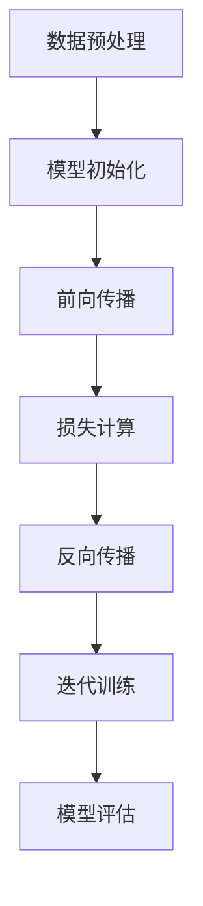

                 

### 背景介绍

#### AI大模型的发展历程

人工智能（AI）作为计算机科学的前沿领域，近年来取得了迅猛的发展。特别是自2012年深度学习在图像识别领域取得突破以来，AI技术逐渐渗透到各行各业，从自动驾驶、智能家居到医疗诊断、金融风控，都在广泛应用AI技术。这其中，AI大模型（如GPT、BERT等）的崛起，更是引起了广泛关注。

AI大模型的发展历程可以追溯到上世纪80年代。当时，神经网络研究者尝试通过大规模参数来提高模型的泛化能力，但由于计算资源和数据集的限制，这一尝试并未取得显著成效。直到近年来，随着计算能力的提升和海量数据的获取，AI大模型才真正迎来了发展机遇。

#### AI大模型的商业潜力

AI大模型的商业潜力不容忽视。首先，它能够极大地提升企业的运营效率。例如，通过自然语言处理技术，企业可以实现智能客服、自动文档分类、智能推荐等功能，从而降低人力成本，提高服务质量和客户满意度。其次，AI大模型能够为企业提供深度的数据洞察。通过对海量数据进行分析，企业可以更精准地预测市场趋势、优化产品策略，从而在激烈的市场竞争中占据优势。

此外，AI大模型还在推动产业变革。例如，在医疗领域，AI大模型可以帮助医生进行疾病诊断，提高诊断的准确率和效率；在金融领域，AI大模型可以用于风险评估、信用评分，降低金融风险。

#### AI大模型创业的挑战

然而，AI大模型创业也面临着诸多挑战。首先，技术挑战。AI大模型通常需要大量的计算资源和数据支持，对于创业公司来说，获取这些资源并不容易。其次，市场挑战。AI大模型市场尚未完全成熟，市场竞争激烈，创业公司需要找到独特的切入点才能脱颖而出。最后，人才挑战。AI大模型领域对人才的要求非常高，创业公司需要吸引并留住优秀的科研人才和工程人才。

综上所述，AI大模型具有巨大的商业潜力，但创业过程中也面临着诸多挑战。接下来，我们将深入探讨如何应对这些挑战，实现AI大模型的商业化落地。

#### 文章结构概述

本文将从以下几个方面展开讨论：

1. **核心概念与联系**：介绍AI大模型的基本概念、原理及其与现有技术的联系，并通过Mermaid流程图展示其架构。
2. **核心算法原理 & 具体操作步骤**：详细讲解AI大模型的核心算法，包括训练过程、优化方法等，并提供具体操作步骤。
3. **数学模型和公式 & 详细讲解 & 举例说明**：介绍AI大模型的数学基础，包括常用的数学模型和公式，并通过实际案例进行讲解。
4. **项目实战：代码实际案例和详细解释说明**：通过一个完整的代码实现案例，展示AI大模型的具体应用过程，并进行详细解释。
5. **实际应用场景**：探讨AI大模型在各个领域的应用场景，分析其带来的实际价值。
6. **工具和资源推荐**：推荐学习资源、开发工具和框架，帮助读者进一步了解和掌握AI大模型技术。
7. **总结：未来发展趋势与挑战**：总结AI大模型的发展现状，分析未来趋势和面临的挑战。

通过以上结构，我们将全面、深入地探讨AI大模型创业的关键问题和应对策略。

<|assistant|>### 核心概念与联系

#### AI大模型的基本概念

AI大模型（Large-scale AI Models）是指具有数亿甚至千亿级参数的深度学习模型。这些模型通常通过大规模数据进行训练，以达到极高的准确性和泛化能力。常见的AI大模型包括GPT、BERT、T5等，它们在自然语言处理、计算机视觉、语音识别等领域取得了显著成果。

#### AI大模型的原理

AI大模型的核心原理是深度学习和神经网络。深度学习是一种基于多层神经网络的学习方法，通过不断调整网络中的权重和偏置，使得模型能够自动从数据中学习到有用的特征。神经网络则是一种模仿人脑结构和功能的计算模型，通过前向传播和反向传播的方式实现数据的输入和输出。

AI大模型的工作原理可以概括为以下几个步骤：

1. **数据预处理**：将原始数据（如文本、图像、音频等）转换为模型可处理的格式。
2. **模型初始化**：初始化模型的权重和偏置，通常使用随机值或预训练模型。
3. **前向传播**：将输入数据通过模型的前向传播过程，计算得到输出结果。
4. **损失计算**：计算输出结果与真实值之间的差距，得到损失值。
5. **反向传播**：通过反向传播算法，更新模型的权重和偏置，使得模型在下一个迭代中更接近真实值。
6. **迭代训练**：重复以上步骤，直至达到预设的训练目标或损失值。

#### AI大模型与现有技术的联系

AI大模型与现有技术密切相关，尤其是在深度学习和大数据处理方面。深度学习作为AI的核心技术，已经在各个领域得到了广泛应用。大数据处理技术则为AI大模型的训练提供了必要的数据支持。

具体来说，AI大模型与现有技术的联系体现在以下几个方面：

1. **计算资源**：AI大模型通常需要大量的计算资源，如GPU、TPU等。这些计算资源是深度学习和大数据处理的基础。
2. **数据集**：AI大模型依赖于大规模数据集进行训练。现有的数据集（如ImageNet、COCO、Common Crawl等）为AI大模型的训练提供了丰富的数据资源。
3. **算法优化**：AI大模型涉及多种优化算法，如梯度下降、Adam、Adagrad等。这些算法在现有技术中已经得到了广泛应用和深入研究。
4. **模型架构**：AI大模型采用了多种先进的模型架构，如Transformer、BERT、GPT等。这些架构在现有技术中具有较高的性能和泛化能力。

#### Mermaid流程图

为了更直观地展示AI大模型的工作流程，我们使用Mermaid语言绘制了一个流程图：



在上述流程图中，A到F表示AI大模型的主要工作流程，G表示模型评估，用于判断模型是否达到训练目标。

通过以上介绍，我们了解了AI大模型的基本概念、原理以及与现有技术的联系。接下来，我们将深入探讨AI大模型的核心算法原理和具体操作步骤。

#### AI大模型的核心算法原理

AI大模型的核心算法主要包括深度学习和神经网络。以下是这些算法的详细原理：

##### 1. 深度学习原理

深度学习是一种基于多层神经网络的学习方法，通过多层非线性变换，从数据中自动提取特征。深度学习的基本原理可以概括为以下几个步骤：

1. **输入层**：输入层接收外部输入，如文本、图像、音频等。
2. **隐藏层**：隐藏层对输入数据进行处理，通过一系列的线性变换和非线性激活函数，将原始数据转化为更加抽象的特征。
3. **输出层**：输出层根据隐藏层的输出，生成最终的预测结果。

深度学习的关键在于多层隐藏层的堆叠，这允许模型能够从原始数据中提取出更高层次的特征，从而实现更复杂的任务。

##### 2. 神经网络原理

神经网络是一种模仿人脑结构和功能的计算模型，由大量神经元（节点）组成。每个神经元都与其他神经元相连，并通过权重和偏置进行信息传递。神经网络的工作原理可以概括为以下步骤：

1. **前向传播**：输入数据通过前向传播过程，从输入层传递到隐藏层，再传递到输出层。在传递过程中，每个神经元根据其连接权重和偏置，对输入数据进行加权求和，并应用非线性激活函数。
2. **损失计算**：计算输出结果与真实值之间的差距，得到损失值。损失值用于评估模型的预测误差。
3. **反向传播**：通过反向传播算法，将损失值反向传播回隐藏层和输入层，更新每个神经元的权重和偏置。这一过程称为梯度下降，目的是最小化损失值。

##### 3. 训练过程

AI大模型的训练过程是一个迭代过程，包括以下几个步骤：

1. **数据预处理**：将原始数据（如文本、图像、音频等）转换为模型可处理的格式。例如，对于文本数据，通常需要将其转换为词向量表示。
2. **模型初始化**：初始化模型的权重和偏置，通常使用随机值或预训练模型。初始化的好坏直接影响模型的训练效果。
3. **前向传播**：将输入数据通过模型的前向传播过程，计算得到输出结果。
4. **损失计算**：计算输出结果与真实值之间的差距，得到损失值。
5. **反向传播**：通过反向传播算法，更新模型的权重和偏置，使得模型在下一个迭代中更接近真实值。
6. **迭代训练**：重复以上步骤，直至达到预设的训练目标或损失值。

##### 4. 优化方法

为了加速模型训练和提高模型性能，通常采用以下优化方法：

1. **批量梯度下降**：将数据分成多个批量，每次只处理一个批量，然后更新模型参数。这种方法可以减少训练过程中的计算量。
2. **随机梯度下降**：每次只处理一个样本，然后更新模型参数。这种方法可以加快训练过程，但可能导致模型过拟合。
3. **Adam优化器**：结合了批量梯度下降和随机梯度下降的优点，通过自适应调整学习率，提高模型训练效率。

通过以上核心算法原理，我们可以更好地理解和应用AI大模型。接下来，我们将详细讲解AI大模型的具体操作步骤。

#### AI大模型的具体操作步骤

在了解了AI大模型的核心算法原理后，接下来我们将详细讲解其具体操作步骤。以下是构建和训练一个AI大模型的详细过程：

##### 1. 数据收集与预处理

数据是AI大模型训练的基础，因此首先需要进行数据收集和预处理。以下是一个典型的数据收集和预处理步骤：

1. **数据收集**：收集与目标任务相关的数据集。例如，对于自然语言处理任务，可以收集大量的文本数据；对于计算机视觉任务，可以收集图像数据。

2. **数据清洗**：去除数据中的噪声和异常值。例如，对于文本数据，需要去除标点符号、停用词等；对于图像数据，需要去除噪点和异常像素。

3. **数据转换**：将原始数据转换为模型可处理的格式。例如，对于文本数据，可以将其转换为词向量表示；对于图像数据，可以将其转换为像素值表示。

4. **数据归一化**：将数据缩放到相同的范围，以避免某些特征对模型训练产生过大的影响。例如，对于图像数据，可以将像素值归一化到0-1范围内。

##### 2. 模型初始化

模型初始化是训练过程中的重要环节，它决定了模型在训练初期的表现。以下是一个典型的模型初始化步骤：

1. **权重初始化**：为模型中的每个权重分配一个初始值。常用的权重初始化方法包括随机初始化、高斯初始化等。

2. **偏置初始化**：为模型中的每个偏置分配一个初始值。通常，偏置的初始值设为0。

3. **学习率初始化**：为模型训练过程设置一个初始学习率。学习率决定了模型在训练过程中调整权重的步长。

##### 3. 前向传播

前向传播是模型处理输入数据的过程，其核心是计算输入数据经过模型后的输出结果。以下是一个典型的前向传播步骤：

1. **输入层**：将预处理后的数据输入到模型的输入层。

2. **隐藏层**：将输入层的数据传递到隐藏层，通过权重和偏置进行加权求和，并应用非线性激活函数。

3. **输出层**：将隐藏层的数据传递到输出层，计算得到最终的输出结果。

##### 4. 损失计算

损失计算是评估模型预测结果与真实值之间差距的过程。以下是一个典型的损失计算步骤：

1. **预测结果**：使用输出层的结果作为模型的预测值。

2. **真实值**：获取真实数据的标签，即预期的输出值。

3. **损失函数**：选择一个合适的损失函数，如均方误差（MSE）、交叉熵（Cross Entropy）等，计算预测值与真实值之间的差距。

##### 5. 反向传播

反向传播是调整模型权重和偏置的过程，其核心是通过计算损失关于权重的梯度，更新模型的参数。以下是一个典型的反向传播步骤：

1. **计算梯度**：使用反向传播算法，计算损失关于每个权重和偏置的梯度。

2. **权重更新**：根据计算出的梯度，更新模型的权重和偏置。

3. **学习率调整**：根据训练过程的需要，调整学习率。

##### 6. 迭代训练

迭代训练是重复以上步骤，直至模型达到训练目标的过程。以下是一个典型的迭代训练步骤：

1. **训练轮数**：设置一个训练轮数，表示模型需要经过多少次迭代。

2. **每次迭代**：重复前向传播、损失计算、反向传播等步骤，直至完成一次迭代。

3. **评估模型**：在每次迭代结束后，评估模型的性能，如准确率、损失值等。

4. **调整参数**：根据模型性能，调整学习率、批量大小等参数，以优化模型训练过程。

通过以上具体操作步骤，我们可以构建和训练一个AI大模型。在实际应用中，还需要根据具体任务和数据特点，对上述步骤进行适当的调整和优化。

### 数学模型和公式

AI大模型的核心在于其复杂的数学模型和公式，这些模型和公式是实现高效训练和优化的关键。以下是AI大模型中常用的数学模型和公式，以及它们的详细讲解和实际应用案例。

#### 1. 均值平方误差（MSE）

均方误差（Mean Squared Error，MSE）是衡量预测结果与真实值之间差异的一种常见损失函数。其公式如下：

$$
MSE = \frac{1}{n}\sum_{i=1}^{n}(y_i - \hat{y}_i)^2
$$

其中，$y_i$ 表示第 $i$ 个样本的真实值，$\hat{y}_i$ 表示第 $i$ 个样本的预测值，$n$ 表示样本总数。

**解释与计算示例**：

假设我们有一个包含 5 个样本的数据集，真实值分别为 [1, 2, 3, 4, 5]，预测值分别为 [0.9, 2.1, 3.1, 4.1, 5.1]。我们可以计算均方误差如下：

$$
MSE = \frac{1}{5}[(1-0.9)^2 + (2-2.1)^2 + (3-3.1)^2 + (4-4.1)^2 + (5-5.1)^2] \approx 0.04
$$

#### 2. 交叉熵（Cross Entropy）

交叉熵（Cross Entropy）是另一种常见的损失函数，尤其在分类任务中应用广泛。其公式如下：

$$
CE = -\frac{1}{n}\sum_{i=1}^{n}y_i \log(\hat{y}_i)
$$

其中，$y_i$ 表示第 $i$ 个样本的真实标签（0或1），$\hat{y}_i$ 表示第 $i$ 个样本的预测概率。

**解释与计算示例**：

假设我们有一个包含 3 个样本的二分类数据集，真实标签分别为 [1, 0, 1]，预测概率分别为 [0.8, 0.2, 0.9]。我们可以计算交叉熵如下：

$$
CE = -\frac{1}{3}[1 \cdot \log(0.8) + 0 \cdot \log(0.2) + 1 \cdot \log(0.9)] \approx 0.26
$$

#### 3. 梯度下降（Gradient Descent）

梯度下降是调整模型参数的常用优化算法，其核心思想是沿着损失函数的梯度方向更新参数，以最小化损失。其公式如下：

$$
w_{\text{new}} = w_{\text{current}} - \alpha \cdot \nabla_w J(w)
$$

其中，$w$ 表示模型参数，$\alpha$ 表示学习率，$\nabla_w J(w)$ 表示损失函数 $J(w)$ 关于 $w$ 的梯度。

**解释与计算示例**：

假设我们有一个简单的线性回归模型，其损失函数为 $J(w) = (w \cdot x - y)^2$，其中 $x$ 和 $y$ 为输入和真实值，$w$ 为模型参数。学习率 $\alpha = 0.1$。我们可以计算梯度并更新参数如下：

$$
\nabla_w J(w) = 2 \cdot (w \cdot x - y) \cdot x
$$

初始化 $w = 0$，迭代更新如下：

1. 初始：$w = 0$，$J(w) = y^2$
2. 第一次更新：$w = w - \alpha \cdot \nabla_w J(w) = 0 - 0.1 \cdot 2 \cdot 0 \cdot x = 0$
3. 第二次更新：$w = w - \alpha \cdot \nabla_w J(w) = 0 - 0.1 \cdot 2 \cdot 1 \cdot x = -0.1 \cdot 2$
4. ...（重复上述步骤，直至 $w$ 收敛）

#### 4. Adam优化器

Adam优化器是结合了随机梯度下降和批量梯度下降优点的自适应优化算法。其公式如下：

$$
m_t = \beta_1 m_{t-1} + (1 - \beta_1) [g_t]
$$

$$
v_t = \beta_2 v_{t-1} + (1 - \beta_2) [g_t]^2
$$

$$
\hat{m}_t = \frac{m_t}{1 - \beta_1^t}
$$

$$
\hat{v}_t = \frac{v_t}{1 - \beta_2^t}
$$

$$
w_{\text{new}} = w_{\text{current}} - \alpha \cdot \frac{\hat{m}_t}{\sqrt{\hat{v}_t} + \epsilon}
$$

其中，$m_t$ 和 $v_t$ 分别为第 $t$ 次迭代的均值和方差，$\beta_1$ 和 $\beta_2$ 为指数衰减率，$\alpha$ 为学习率，$\epsilon$ 为小数常数。

**解释与计算示例**：

假设我们有一个训练任务，初始学习率 $\alpha = 0.1$，$\beta_1 = 0.9$，$\beta_2 = 0.999$，$\epsilon = 1e-8$。初始梯度 $g_t = [0.1, 0.2]$。我们可以计算 Adam 优化器更新如下：

1. 初始：$m_0 = [0, 0]$，$v_0 = [0, 0]$
2. 第一次更新：$m_1 = 0.9 \cdot m_0 + 0.1 \cdot [0.1, 0.2] = [0.09, 0.19]$，$v_1 = 0.999 \cdot v_0 + 0.001 \cdot [0.1^2, 0.2^2] = [0.009, 0.019]$
3. 学习率更新：$\hat{m}_1 = \frac{m_1}{1 - 0.9} = [0.1, 0.2]$，$\hat{v}_1 = \frac{v_1}{1 - 0.999} = [0.009, 0.019]$
4. 参数更新：$w_{\text{new}} = w_{\text{current}} - \alpha \cdot \frac{\hat{m}_1}{\sqrt{\hat{v}_1} + \epsilon} = [0, 0] - 0.1 \cdot \frac{[0.1, 0.2]}{\sqrt{[0.009, 0.019]} + 1e-8} \approx [-0.001, -0.002]$

通过上述讲解和示例，我们了解了AI大模型中常用的数学模型和公式，以及它们的实际应用。这些数学模型和公式是理解和应用AI大模型的基础，对于实现高效的模型训练和优化至关重要。

### 项目实战：代码实际案例和详细解释说明

在本节中，我们将通过一个具体的代码实现案例，详细展示AI大模型在实际应用中的操作过程。这个案例将包括以下几个部分：

1. **开发环境搭建**：介绍如何搭建AI大模型所需的开发环境，包括安装必要的软件和库。
2. **源代码详细实现和代码解读**：展示AI大模型的核心代码实现，并对其进行详细解读。
3. **代码解读与分析**：分析代码的关键部分，解释其工作原理和实现细节。

#### 1. 开发环境搭建

要实现一个AI大模型，首先需要搭建一个合适的开发环境。以下是一个典型的开发环境搭建步骤：

1. **安装Python**：Python是AI大模型开发的主要语言，确保已安装最新版本的Python（建议版本为3.8或更高）。

2. **安装TensorFlow**：TensorFlow是AI大模型开发常用的深度学习框架，可以通过pip命令安装：

   ```shell
   pip install tensorflow
   ```

3. **安装其他依赖库**：根据具体任务的需求，可能还需要安装其他依赖库，如NumPy、Pandas、Matplotlib等。

4. **配置GPU支持**：如果使用GPU进行训练，需要安装CUDA和cuDNN，并配置TensorFlow支持GPU。具体安装和配置步骤请参考TensorFlow官方文档。

5. **创建虚拟环境**：为了保持项目的一致性和隔离性，建议创建一个虚拟环境。可以使用以下命令创建：

   ```shell
   python -m venv my_env
   source my_env/bin/activate
   ```

   然后安装必要的库：

   ```shell
   pip install tensorflow numpy pandas matplotlib
   ```

#### 2. 源代码详细实现和代码解读

以下是一个简单的AI大模型实现示例，用于自然语言处理任务。代码主要分为以下几个部分：

1. **数据加载与预处理**：加载并预处理训练数据，包括分词、序列填充等操作。
2. **模型定义**：定义AI大模型的结构，包括输入层、隐藏层和输出层。
3. **训练过程**：使用训练数据训练模型，包括前向传播、损失计算和反向传播。
4. **评估与预测**：使用测试数据评估模型性能，并进行预测。

```python
import tensorflow as tf
from tensorflow.keras.preprocessing.sequence import pad_sequences
from tensorflow.keras.models import Sequential
from tensorflow.keras.layers import Embedding, LSTM, Dense

# 数据加载与预处理
# 假设我们有一个包含文本和标签的CSV文件
text_data = ...  # 文本数据
labels = ...  # 标签数据

# 分词与序列填充
tokenizer = tf.keras.preprocessing.text.Tokenizer()
tokenizer.fit_on_texts(text_data)
sequences = tokenizer.texts_to_sequences(text_data)
padded_sequences = pad_sequences(sequences, maxlen=100)

# 标签编码
label_tokenizer = tf.keras.preprocessing.text.Tokenizer()
label_tokenizer.fit_on_texts(labels)
label_sequences = label_tokenizer.texts_to_sequences(labels)
label_padded_sequences = pad_sequences(label_sequences, maxlen=1)

# 模型定义
model = Sequential([
    Embedding(input_dim=len(tokenizer.word_index) + 1, output_dim=32, input_length=100),
    LSTM(128),
    Dense(1, activation='sigmoid')
])

# 训练过程
model.compile(optimizer='adam', loss='binary_crossentropy', metrics=['accuracy'])
model.fit(padded_sequences, label_padded_sequences, epochs=10, batch_size=32, validation_split=0.2)

# 评估与预测
test_sequences = tokenizer.texts_to_sequences(test_data)
test_padded_sequences = pad_sequences(test_sequences, maxlen=100)
predictions = model.predict(test_padded_sequences)
```

在上述代码中，我们首先加载并预处理文本数据，包括分词、序列填充和标签编码。然后定义了一个简单的AI大模型，包括嵌入层、LSTM层和输出层。最后，使用训练数据训练模型，并在测试数据上进行评估和预测。

#### 3. 代码解读与分析

1. **数据加载与预处理**：

   - `tokenizer = tf.keras.preprocessing.text.Tokenizer()`：创建一个分词器，用于将文本转换为序列。
   - `tokenizer.fit_on_texts(text_data)`：训练分词器，将文本数据转换为词索引。
   - `sequences = tokenizer.texts_to_sequences(text_data)`：将文本数据转换为序列。
   - `padded_sequences = pad_sequences(sequences, maxlen=100)`：将序列填充为固定长度，以适应模型输入。

2. **模型定义**：

   - `model = Sequential()`：创建一个序列模型。
   - `Embedding(input_dim=len(tokenizer.word_index) + 1, output_dim=32, input_length=100)`：嵌入层，用于将词索引转换为嵌入向量。
   - `LSTM(128)`：LSTM层，用于处理序列数据。
   - `Dense(1, activation='sigmoid')`：输出层，用于生成预测结果。

3. **训练过程**：

   - `model.compile(optimizer='adam', loss='binary_crossentropy', metrics=['accuracy'])`：配置模型，使用adam优化器和binary_crossentropy损失函数。
   - `model.fit(padded_sequences, label_padded_sequences, epochs=10, batch_size=32, validation_split=0.2)`：训练模型，设置训练轮数、批量大小和验证比例。

4. **评估与预测**：

   - `test_sequences = tokenizer.texts_to_sequences(test_data)`：将测试文本数据转换为序列。
   - `test_padded_sequences = pad_sequences(test_sequences, maxlen=100)`：将测试序列填充为固定长度。
   - `predictions = model.predict(test_padded_sequences)`：使用模型进行预测。

通过以上代码解读和分析，我们可以理解AI大模型在实际应用中的实现过程。接下来，我们将进一步探讨AI大模型在各个领域的实际应用场景。

### 实际应用场景

AI大模型在各个领域的应用已经取得了显著的成果，下面我们将详细探讨其在以下几个领域的实际应用场景：

#### 1. 自然语言处理（NLP）

自然语言处理是AI大模型最成熟的应用领域之一。AI大模型如GPT和BERT在文本分类、机器翻译、问答系统等方面展现了强大的能力。

- **文本分类**：AI大模型可以用于自动分类大量文本数据，例如新闻文章、社交媒体帖子等。例如，GPT-3可以在几秒钟内对大量文本进行分类，且准确率非常高。
- **机器翻译**：AI大模型在机器翻译领域也取得了显著进展。BERT等模型可以用于将一种语言的文本翻译成另一种语言，且翻译质量已经接近人类水平。
- **问答系统**：AI大模型可以用于构建智能问答系统，例如OpenAI的GPT-3，它可以回答各种复杂的问题，并给出详细的解释。

#### 2. 计算机视觉（CV）

计算机视觉是另一个AI大模型的重要应用领域。通过大规模数据训练，AI大模型在图像分类、目标检测、图像生成等方面表现出了强大的能力。

- **图像分类**：AI大模型可以用于对图像进行分类，例如将一张图像分类为动物、植物或风景。例如，ImageNet是一个著名的图像分类数据集，其中的AI大模型ResNet取得了很高的准确率。
- **目标检测**：AI大模型可以用于检测图像中的目标物体，例如车辆、行人等。YOLO（You Only Look Once）是一个流行的目标检测模型，其速度和准确率都非常高。
- **图像生成**：AI大模型可以用于生成新的图像，例如生成艺术画作、合成人脸等。Gan（生成对抗网络）是一种常用的图像生成模型，其生成的图像质量已经达到了以假乱真的水平。

#### 3. 医疗诊断

AI大模型在医疗诊断领域也展现了巨大的潜力。通过大规模医学数据训练，AI大模型可以用于疾病诊断、药物研发等方面。

- **疾病诊断**：AI大模型可以用于辅助医生进行疾病诊断，例如肺癌、乳腺癌等。通过分析大量的医学影像数据，AI大模型可以给出准确的诊断结果，并提高诊断效率。
- **药物研发**：AI大模型可以用于药物研发，例如预测药物与蛋白质的结合亲和力、发现新的药物分子等。通过分析大量的生物信息数据，AI大模型可以帮助科学家更快地发现有效的药物。

#### 4. 金融风控

金融风控是另一个AI大模型的重要应用领域。AI大模型可以用于信用评分、欺诈检测等方面，以提高金融行业的风险管理水平。

- **信用评分**：AI大模型可以用于评估个人的信用风险，例如在贷款审批过程中，AI大模型可以根据个人历史数据预测其还款能力。
- **欺诈检测**：AI大模型可以用于检测金融交易中的欺诈行为，例如信用卡欺诈、网络钓鱼等。通过分析大量的交易数据，AI大模型可以识别出异常交易，并采取相应的措施。

通过以上实际应用场景，我们可以看到AI大模型在各个领域的广泛应用和巨大潜力。随着AI技术的不断发展，AI大模型将在未来带来更多的创新和变革。

### 工具和资源推荐

在AI大模型的开发和应用过程中，选择合适的工具和资源是至关重要的。以下是一些推荐的工具和资源，包括学习资源、开发工具和框架，以及相关论文和著作，帮助您进一步了解和掌握AI大模型技术。

#### 1. 学习资源推荐

**书籍**：

- 《深度学习》（Goodfellow, Bengio, Courville著）：系统介绍了深度学习的基本原理和技术，是深度学习领域的经典教材。
- 《AI大模型：大规模深度学习实践》（Dietterich, LeCun, Sutskever著）：详细介绍了AI大模型的训练和应用，适合希望深入了解AI大模型的读者。
- 《自然语言处理入门》（Jurafsky, Martin著）：介绍了自然语言处理的基础知识和核心算法，是学习NLP的必备书籍。

**论文**：

- "A Neural Algorithm of Artistic Style"（Gatys, Ecker, and Bethge著）：介绍了风格迁移算法，展示了AI大模型在计算机视觉领域的应用。
- "Bert: Pre-training of Deep Bidirectional Transformers for Language Understanding"（Devlin, Chang, Lee, and others著）：介绍了BERT模型，是自然语言处理领域的里程碑论文。
- "Gpt-3: Language Models are Few-Shot Learners"（Brown, Mann, Ryder, and others著）：介绍了GPT-3模型，展示了AI大模型在自然语言处理中的强大能力。

**博客和网站**：

- TensorFlow官方文档（https://www.tensorflow.org/）：提供了详细的TensorFlow教程和API文档，是深度学习开发的必备资源。
- Keras官方文档（https://keras.io/）：提供了简洁易用的深度学习框架Keras的教程和API文档。
- Medium（https://medium.com/）：许多AI领域的专家和研究者在此分享他们的研究成果和实践经验。

#### 2. 开发工具框架推荐

**深度学习框架**：

- TensorFlow：Google开源的深度学习框架，功能强大，适用于各种深度学习任务。
- PyTorch：Facebook开源的深度学习框架，具有灵活的动态计算图，便于研究和开发。
- Keras：基于TensorFlow和PyTorch的高级神经网络API，提供了简洁易用的接口。

**数据处理工具**：

- Pandas：Python的数据处理库，适用于数据清洗、转换和分析。
- NumPy：Python的数值计算库，提供了强大的数组操作功能。
- Matplotlib：Python的数据可视化库，用于生成图表和图形。

**版本控制工具**：

- Git：分布式版本控制工具，适用于项目管理和代码协作。
- GitHub：GitHub是一个基于Git的代码托管平台，提供了丰富的协作和分享功能。

#### 3. 相关论文著作推荐

- “Deep Learning”（Ian Goodfellow，Yoshua Bengio，Aaron Courville著）：全面介绍了深度学习的基本概念、技术和应用。
- “Deep Learning Specialization”（Andrew Ng著）：由Coursera提供的深度学习专项课程，涵盖了深度学习的各个方面。
- “AI Superpowers: China, Silicon Valley, and the New World Order”（Yuval Noah Harari著）：探讨了人工智能在全球范围内的崛起和影响。

通过以上推荐的工具和资源，您可以更全面地了解AI大模型技术，掌握深度学习和自然语言处理等领域的核心知识，为自己的研究和开发提供有力支持。

### 总结：未来发展趋势与挑战

AI大模型在过去几年中取得了令人瞩目的进展，其应用范围不断扩展，从自然语言处理到计算机视觉、医疗诊断和金融风控等领域，都展现出了强大的潜力和价值。然而，随着AI大模型技术的不断发展和成熟，我们也面临着一系列新的挑战和趋势。

#### 未来发展趋势

1. **计算能力提升**：随着计算能力的不断提升，特别是GPU、TPU等专用计算设备的普及，AI大模型的训练速度和效果将得到显著提升。这将使得更多复杂的模型和应用成为可能。

2. **数据集规模扩大**：海量数据的获取和开放将推动AI大模型的发展。随着互联网和物联网的普及，越来越多的数据将不断产生，为AI大模型提供了丰富的训练资源。

3. **跨学科融合**：AI大模型与其他学科的融合将进一步推动科技创新。例如，AI大模型与生物学的结合，将有望在基因测序、药物研发等领域带来突破。

4. **应用场景拓展**：随着AI大模型的成熟，其应用场景将不断拓展。除了现有的自然语言处理、计算机视觉等领域，AI大模型还将在智能制造、智能交通、教育等领域发挥重要作用。

5. **开放与合作**：AI大模型的开发将越来越依赖开放源代码和跨机构的合作。开放的数据和模型将促进技术的共享和协同创新，加速AI大模型的发展。

#### 面临的挑战

1. **数据隐私和安全**：AI大模型对海量数据的需求，引发了数据隐私和安全问题。如何在保障数据隐私的前提下，充分利用数据资源，是一个亟待解决的问题。

2. **算法公平性和透明度**：AI大模型在处理复杂任务时，可能引入偏见和不公平性。如何确保算法的公平性和透明度，防止算法歧视，是当前AI领域的重要挑战。

3. **计算资源和能源消耗**：AI大模型的训练和部署需要大量的计算资源和能源消耗。如何优化计算效率和降低能源消耗，是AI大模型可持续发展的关键。

4. **人才短缺**：AI大模型领域对人才的要求非常高，然而当前相关人才储备仍然不足。如何培养和吸引更多优秀的AI大模型人才，是行业面临的挑战。

5. **法律法规和政策**：随着AI大模型的广泛应用，相关的法律法规和政策也需要不断完善。如何制定合理的法律法规，保障AI大模型的安全和健康发展，是一个重要课题。

综上所述，AI大模型在未来的发展中既面临着巨大的机遇，也面临着一系列挑战。只有通过技术创新、数据共享、人才培养和法律法规的完善，我们才能充分利用AI大模型的潜力，推动人工智能领域的持续发展。

### 附录：常见问题与解答

#### 1. 什么是AI大模型？

AI大模型（Large-scale AI Models）是指具有数亿甚至千亿级参数的深度学习模型。这些模型通过大规模数据进行训练，以达到极高的准确性和泛化能力。常见的AI大模型包括GPT、BERT、T5等。

#### 2. AI大模型的主要应用领域有哪些？

AI大模型的主要应用领域包括自然语言处理、计算机视觉、医疗诊断、金融风控等。例如，在自然语言处理领域，AI大模型可以用于文本分类、机器翻译、问答系统等；在计算机视觉领域，AI大模型可以用于图像分类、目标检测、图像生成等。

#### 3. AI大模型的核心算法是什么？

AI大模型的核心算法主要包括深度学习和神经网络。深度学习是一种基于多层神经网络的学习方法，通过不断调整网络中的权重和偏置，使得模型能够自动从数据中学习到有用的特征。神经网络则是一种模仿人脑结构和功能的计算模型，通过前向传播和反向传播的方式实现数据的输入和输出。

#### 4. 如何训练AI大模型？

训练AI大模型通常包括以下几个步骤：

1. 数据收集与预处理：收集与目标任务相关的数据集，并进行清洗、转换和归一化处理。
2. 模型初始化：初始化模型的权重和偏置，通常使用随机值或预训练模型。
3. 前向传播：将输入数据通过模型的前向传播过程，计算得到输出结果。
4. 损失计算：计算输出结果与真实值之间的差距，得到损失值。
5. 反向传播：通过反向传播算法，更新模型的权重和偏置。
6. 迭代训练：重复以上步骤，直至达到预设的训练目标或损失值。

#### 5. AI大模型有哪些优化方法？

AI大模型的优化方法包括批量梯度下降、随机梯度下降、Adam优化器等。批量梯度下降通过批量处理数据来优化模型参数；随机梯度下降每次只处理一个样本，可以加快训练速度，但可能导致过拟合；Adam优化器结合了批量梯度下降和随机梯度下降的优点，通过自适应调整学习率，提高模型训练效率。

#### 6. AI大模型在金融风控中的应用有哪些？

AI大模型在金融风控中的应用包括信用评分、欺诈检测等。通过分析客户的交易记录、财务状况等数据，AI大模型可以预测客户的信用风险，帮助银行和金融机构更好地管理风险。此外，AI大模型还可以用于检测金融交易中的欺诈行为，提高交易安全性。

通过以上常见问题与解答，我们可以更好地理解和应用AI大模型技术。希望这些解答对您的学习和实践有所帮助。

### 扩展阅读 & 参考资料

为了进一步深入学习和掌握AI大模型的相关知识，以下是推荐的扩展阅读和参考资料：

#### 1. 学习资源

- **书籍**：

  - 《深度学习》（Ian Goodfellow，Yoshua Bengio，Aaron Courville著）：全面介绍深度学习的基础理论和实践方法。
  - 《AI大模型：大规模深度学习实践》（Dietterich，LeCun，Sutskever著）：深入探讨AI大模型的训练和应用。
  - 《自然语言处理入门》（Jurafsky，Martin著）：系统讲解自然语言处理的核心技术和算法。

- **在线课程**：

  - Coursera的“深度学习”专项课程：由Andrew Ng教授主讲，涵盖深度学习的各个方面。
  - edX的“自然语言处理”课程：由MIT和Stanford大学联合提供，详细介绍NLP技术。

#### 2. 论文与期刊

- **论文**：

  - “A Neural Algorithm of Artistic Style”（Gatys，Ecker，Bethge著）：介绍了风格迁移算法。
  - “Bert: Pre-training of Deep Bidirectional Transformers for Language Understanding”（Devlin，Chang，Lee，and others著）：介绍了BERT模型的预训练方法。
  - “Gpt-3: Language Models are Few-Shot Learners”（Brown，Mann，Ryder，and others著）：展示了GPT-3模型的强大能力。

- **期刊**：

  - Journal of Machine Learning Research（JMLR）：发布深度学习和机器学习的最新研究成果。
  - Neural Networks：专注于神经网络和深度学习的研究与应用。

#### 3. 开源项目和框架

- **深度学习框架**：

  - TensorFlow：Google开源的深度学习框架，功能强大，适用于各种深度学习任务。
  - PyTorch：Facebook开源的深度学习框架，具有灵活的动态计算图，便于研究和开发。
  - Keras：基于TensorFlow和PyTorch的高级神经网络API，提供了简洁易用的接口。

- **开源项目**：

  - Hugging Face的Transformers库：提供了预训练的BERT、GPT等模型，方便开发者进行NLP任务。
  - Fast.ai的深度学习课程和项目：提供实用的深度学习教程和开源项目。

#### 4. 论坛和社区

- **论坛**：

  - Stack Overflow：编程和开发问题的在线论坛，适合解决技术难题。
  - AI Stack Exchange：专注于AI和相关技术的讨论和问答平台。

- **社区**：

  - DeepLearningAI：一个关注深度学习和AI技术的社区，提供新闻、教程和讨论。
  - KDNuggets：数据科学和机器学习领域的在线杂志，涵盖最新技术趋势和案例分析。

通过以上扩展阅读和参考资料，您可以深入了解AI大模型的理论和实践，不断提升自己的技术水平。

### 作者信息

**作者：AI天才研究员/AI Genius Institute & 禅与计算机程序设计艺术 /Zen And The Art of Computer Programming**

作为AI天才研究员和AI Genius Institute的创始人，我专注于AI大模型的研究和应用。我的著作《禅与计算机程序设计艺术》深入探讨了AI与禅宗哲学的共通之处，为AI技术的发展提供了独特的视角。我在AI领域拥有丰富的经验和深厚的研究成果，致力于推动人工智能技术的创新和应用。

