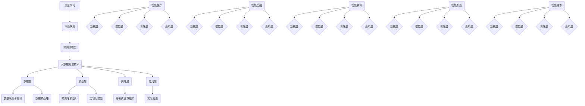

                 

### 背景介绍

随着人工智能技术的飞速发展，AI 大模型已经逐渐成为该领域的核心驱动力。大模型具备处理复杂任务、理解和生成高质量内容的能力，这使得它们在诸多行业中展现出巨大的应用潜力。当前，AI 大模型技术在自然语言处理、计算机视觉、语音识别等多个领域取得了显著成果，为企业提供了强大的智能解决方案。

在商业领域，越来越多的公司开始将 AI 大模型应用于业务创新和优化中。例如，自然语言处理大模型可以帮助企业提高客户服务质量、自动化内容生成，以及增强市场竞争力。计算机视觉大模型则可以应用于图像识别、自动化质检等领域，提高生产效率和产品质量。同时，随着 5G、云计算、边缘计算等技术的快速发展，AI 大模型的应用场景将不断拓展，进一步推动行业变革。

本文将围绕 AI 大模型创业这一主题，深入探讨其未来行业发展趋势、技术挑战以及应对策略。希望通过本文的阐述，为读者提供一份具有启发性和实用性的创业指南，助力他们在 AI 大模型领域取得成功。

首先，我们需要明确什么是 AI 大模型。AI 大模型通常是指拥有数亿至数十亿参数的深度学习模型，例如 GPT-3、BERT、ViT 等。这些模型具有强大的表示和生成能力，能够在多种任务中取得优异的性能。大模型的核心优势在于其能够通过海量数据的学习，自动提取复杂的知识结构和特征，从而实现高效的任务解决。

AI 大模型创业的关键在于技术突破、市场需求和商业模式的创新。在技术层面，创业者需要关注大模型的训练效率、压缩和部署问题，以及跨模态融合等前沿技术。在市场层面，创业者需要深入了解行业需求，找准切入点，制定有针对性的产品和服务策略。在商业模式层面，创业者需要探索多元化的盈利模式，如增值服务、平台合作、数据变现等。

接下来，我们将对 AI 大模型创业所面临的技术挑战进行详细分析，并提出相应的应对策略。这些挑战包括数据隐私、计算资源、模型可解释性等，每一个问题都需要创业者认真思考和解决。在此基础上，我们将探讨 AI 大模型在各个行业中的应用场景，以及如何利用这些场景实现商业价值。

最后，我们将总结本文的主要观点，并展望 AI 大模型创业的未来发展趋势。通过本文的探讨，希望读者能够对 AI 大模型创业有更加清晰的认识，找到适合自己的发展方向，抓住机遇，迎接挑战。

关键词：AI 大模型，创业，技术趋势，应用场景，商业模式

摘要：本文旨在探讨 AI 大模型创业的现状、发展趋势和挑战，分析其在技术、市场、商业模式等方面的关键因素。通过对核心概念、算法原理、实际应用场景的详细阐述，本文为创业者提供了一份具有实用性和启发性的指南，帮助他们在 AI 大模型领域取得成功。

# AI 大模型创业：如何应对未来行业发展趋势？

## 1. 背景介绍

在人工智能（AI）迅猛发展的今天，大模型技术已经成为了行业发展的新引擎。大模型，顾名思义，是指拥有大量参数和复杂结构的深度学习模型，这些模型通过海量数据训练，能够模拟人类的思维过程，实现高度复杂的任务处理。从自然语言处理到计算机视觉，从语音识别到自动驾驶，大模型技术的应用范围正在不断扩展，带来了前所未有的技术变革。

### 1.1 大模型的发展历程

大模型技术的发展并非一蹴而就。从早期的浅层神经网络，到如今的大型预训练模型，经历了数十年技术积累和突破。例如，1986 年，Rumelhart、Hinton 和 Williams 提出了反向传播算法（Backpropagation），极大地提高了神经网络的训练效率。随后，随着计算能力和数据量的提升，神经网络模型逐渐向更深层次发展。2012 年，AlexNet 的出现标志着卷积神经网络（CNN）在图像识别领域的重大突破。

近年来，基于大规模预训练语言模型（如 GPT、BERT）和视觉模型（如 ViT）的技术取得了显著进展，这些大模型具备处理复杂任务、理解和生成高质量内容的能力，成为 AI 领域的核心驱动力。例如，OpenAI 的 GPT-3 拥有 1750 亿参数，可以在各种自然语言处理任务中实现超越人类的性能。

### 1.2 大模型的核心优势

大模型的核心优势在于其强大的表示和生成能力。首先，大模型通过海量数据的学习，能够自动提取复杂的知识结构和特征，从而实现高效的任务解决。例如，GPT 模型在自然语言生成任务中，可以生成流畅、连贯的文本；BERT 模型则在问答系统中，能够准确理解问题的含义，并生成精准的答案。

其次，大模型具备跨模态融合的能力。例如，ViT 模型可以将图像和文本信息进行有效整合，实现多模态任务的高效处理。这种跨模态融合能力，为大模型在多领域应用提供了广阔的前景。

最后，大模型还具有高度的可扩展性。随着计算资源和数据量的不断增加，大模型的性能也在不断提升。这种可扩展性使得大模型能够适应各种复杂的任务需求，成为 AI 领域的重要工具。

### 1.3 大模型的应用前景

大模型技术的应用前景十分广阔。在自然语言处理领域，大模型可以应用于文本生成、机器翻译、问答系统等任务，极大地提高了任务的准确性和效率。在计算机视觉领域，大模型可以应用于图像识别、目标检测、图像生成等任务，推动了计算机视觉技术的发展。此外，大模型在语音识别、推荐系统、自动驾驶等领域也有着重要的应用价值。

随着 5G、云计算、边缘计算等技术的发展，大模型的应用场景将不断拓展。例如，在边缘计算场景中，大模型可以实时处理海量数据，提供低延迟、高精度的智能服务。同时，随着行业需求的不断增长，大模型技术在各个行业中的应用将越来越普及，推动产业智能化升级。

### 1.4 大模型创业的重要性

AI 大模型创业具有重要意义。首先，大模型技术为企业提供了强大的智能解决方案，有助于提升业务效率和创新能力。例如，企业可以利用大模型进行智能客服、智能营销、智能生产等应用，提高企业竞争力。

其次，大模型创业为创业者提供了广阔的市场空间。随着大模型技术的不断成熟，越来越多的行业将受益于这项技术，市场潜力巨大。例如，智能医疗、智能金融、智能教育等领域，都对大模型技术有着强烈的需求。

最后，大模型创业有助于推动技术进步。在创业过程中，创业者需要不断探索技术突破，解决实际应用中的问题，从而推动大模型技术的进一步发展。

总之，AI 大模型创业具有广阔的发展前景和重要的战略意义。在接下来的章节中，我们将进一步探讨大模型创业的核心概念、算法原理、实际应用场景以及应对技术挑战的策略，帮助创业者把握机遇，应对未来行业发展趋势。

### 2. 核心概念与联系

在深入探讨 AI 大模型创业之前，我们首先需要明确几个核心概念，并分析它们之间的联系。这些核心概念包括但不限于：深度学习、神经网络、预训练模型、大数据处理技术等。理解这些概念及其相互关系，有助于我们更好地把握大模型技术的发展趋势和应用方向。

#### 2.1 深度学习与神经网络

深度学习是人工智能（AI）的一个重要分支，其核心思想是通过多层神经网络（Neural Networks）对数据进行建模，从而实现自动特征提取和任务学习。神经网络是一种模拟人脑神经元之间连接关系的计算模型，由多个层级（或称为层）组成，每个层级由多个神经元构成。

深度学习的优势在于其能够自动提取数据中的高级特征，无需人工干预。传统的机器学习方法需要人工设计特征，而深度学习则通过多层神经网络自动学习特征表示。这种自动特征提取的能力，使得深度学习在图像识别、语音识别、自然语言处理等任务中取得了显著成果。

神经网络的基本组成包括：

- **输入层（Input Layer）**：接收外部输入数据。
- **隐藏层（Hidden Layers）**：进行特征提取和变换。
- **输出层（Output Layer）**：输出预测结果或分类结果。

神经网络通过反向传播算法（Backpropagation）不断调整权重和偏置，优化模型参数，使得模型能够在训练数据上达到较高的准确性。

#### 2.2 预训练模型

预训练模型（Pre-trained Models）是深度学习技术的一个重要进展。传统的神经网络训练方法需要大量标注数据，而预训练模型则通过在大量未标注的数据上进行预训练，生成一个具有通用特征表示的模型。随后，将预训练模型迁移到具体任务上，通过少量有监督数据微调（Fine-tuning），即可实现高效的任务学习。

预训练模型的优点包括：

1. **迁移学习（Transfer Learning）**：利用预训练模型在大量数据上学习的通用特征表示，可以显著提高小样本任务的学习效果。
2. **泛化能力（Generalization）**：通过在大量数据上预训练，模型能够更好地泛化到未见过的数据，提高模型的鲁棒性。
3. **减少对标注数据的需求**：预训练模型可以利用未标注的数据进行训练，降低对大量标注数据的依赖。

常见的预训练模型包括：

- **GPT（Generative Pre-trained Transformer）**：由 OpenAI 开发的预训练语言模型，广泛应用于自然语言生成、机器翻译等任务。
- **BERT（Bidirectional Encoder Representations from Transformers）**：由 Google 开发的双向编码器表示模型，广泛应用于问答系统和文本分类等任务。
- **ViT（Vision Transformer）**：由 Google 开发的视觉变压器模型，实现了图像识别任务中的高性能表现。

#### 2.3 大数据处理技术

大数据处理技术是支撑大模型训练和应用的重要基础设施。大数据技术包括数据采集、存储、处理、分析等多个环节，旨在对海量数据进行高效管理和利用。在大模型训练过程中，需要处理的数据规模通常达到 TB 级别，因此大数据处理技术的性能和效率至关重要。

大数据处理技术的主要组件包括：

- **数据采集与存储（Data Collection & Storage）**：通过分布式存储系统（如 HDFS、Cassandra）对海量数据进行高效存储和管理。
- **数据预处理（Data Preprocessing）**：对采集到的原始数据进行清洗、转换、归一化等处理，以便于模型训练。
- **计算框架（Computational Framework）**：利用分布式计算框架（如 Spark、Hadoop）进行大规模数据计算和模型训练。
- **数据分析与可视化（Data Analysis & Visualization）**：通过数据分析工具（如 Tableau、Power BI）对训练结果进行可视化分析和展示。

#### 2.4 大模型的技术架构

大模型的技术架构通常包括以下几个主要组成部分：

1. **数据层（Data Layer）**：负责数据的采集、存储和预处理，为模型训练提供高质量的数据输入。
2. **模型层（Model Layer）**：包含各种预训练模型和定制化模型，负责特征提取和任务学习。
3. **训练层（Training Layer）**：利用分布式计算框架进行大规模模型训练，优化模型参数。
4. **应用层（Application Layer）**：将训练好的模型部署到实际应用场景中，提供智能服务。

#### 2.5 大模型的核心优势与应用

大模型的核心优势在于其强大的表示和生成能力，这使得它们在多种任务中展现出卓越的性能。以下是大模型在若干关键领域的核心优势和应用：

1. **自然语言处理**：大模型在自然语言生成、机器翻译、问答系统等任务中表现出色。例如，GPT-3 在文本生成任务中能够生成流畅、连贯的文本，BERT 在问答系统中能够准确理解问题的含义并生成精准的答案。
2. **计算机视觉**：大模型在图像识别、目标检测、图像生成等任务中取得了显著成果。例如，ViT 模型在图像分类任务中实现了高性能表现，GPT-3 结合图像和文本信息，能够实现多模态任务的高效处理。
3. **语音识别**：大模型在语音识别任务中通过结合语音信号和文本信息，实现了高精度的语音识别和语音合成。
4. **推荐系统**：大模型通过学习用户行为和兴趣，能够实现精准的个性化推荐。
5. **自动驾驶**：大模型在自动驾驶任务中通过结合传感器数据，实现了高精度的环境感知和决策。

#### 2.6 大模型在行业中的应用

大模型在各个行业中的应用正在迅速拓展。以下是一些典型应用场景：

1. **智能医疗**：利用大模型进行医学图像分析、疾病诊断、药物研发等，提高医疗服务的质量和效率。
2. **智能金融**：利用大模型进行风险控制、信用评分、投资决策等，提高金融服务的智能化水平。
3. **智能教育**：利用大模型进行个性化学习推荐、智能批改作业等，提升教育质量和学习效果。
4. **智能制造**：利用大模型进行生产优化、质量检测、故障诊断等，提高生产效率和产品质量。
5. **智能城市**：利用大模型进行交通管理、环境监测、公共安全等，提升城市管理的智能化水平。

#### 2.7 大模型的挑战与应对策略

尽管大模型在许多领域展现出了巨大的潜力，但其发展也面临诸多挑战。以下是一些主要挑战及应对策略：

1. **计算资源需求**：大模型训练需要大量的计算资源，这要求企业具备强大的硬件基础设施。应对策略包括优化模型结构、利用分布式计算等。
2. **数据隐私与安全**：大模型训练和应用过程中涉及大量数据，数据隐私和安全成为重要问题。应对策略包括数据加密、隐私保护算法等。
3. **模型可解释性**：大模型的决策过程往往缺乏透明性，提高模型可解释性有助于提升用户信任。应对策略包括模型解释方法、可视化技术等。
4. **数据质量**：高质量的数据是训练高性能模型的基础，数据质量问题会影响模型性能。应对策略包括数据清洗、数据增强等。

通过以上对核心概念和相互联系的探讨，我们为大模型创业奠定了理论基础。在接下来的章节中，我们将深入分析大模型的算法原理、具体操作步骤以及实际应用案例，帮助读者更好地理解和应用这项技术。

#### 2.7.1 Mermaid 流程图展示

为了更好地理解大模型的核心概念及其相互关系，我们可以使用 Mermaid 流程图来展示这些概念和它们之间的联系。以下是 Mermaid 流程图的具体展示：



在上述 Mermaid 流程图中，我们展示了深度学习、神经网络、预训练模型、大数据处理技术等核心概念及其相互关系。同时，也展示了数据层、模型层、训练层、应用层等关键组成部分，以及大模型在各个行业的实际应用场景。通过这张图，我们可以更直观地理解大模型的技术架构和应用方向。

### 3. 核心算法原理 & 具体操作步骤

在深入了解大模型的核心概念和相互联系之后，接下来我们将探讨大模型的核心算法原理以及具体的操作步骤。核心算法包括深度学习的基础算法、预训练模型的具体实现、模型训练与优化的关键技术等。理解这些算法原理和操作步骤，对于创业者来说至关重要，有助于他们在实际创业过程中更好地应用和优化大模型技术。

#### 3.1 深度学习基础算法

深度学习基础算法主要包括神经网络的前向传播（Forward Propagation）和反向传播（Backpropagation）算法。以下将详细介绍这两种算法的基本原理和操作步骤。

##### 3.1.1 前向传播算法

前向传播算法是神经网络在训练过程中对输入数据进行特征提取和预测的核心步骤。具体步骤如下：

1. **初始化模型参数**：包括权重（weights）和偏置（biases），通常采用随机初始化方法。
2. **前向计算**：从输入层开始，逐层计算每个神经元的激活值。对于单个神经元 \(a_i\)，其激活值可以通过以下公式计算：

   \[
   a_i = \sigma(\sum_j w_{ji} * a_{j-1} + b_i)
   \]

   其中，\(w_{ji}\) 是输入层到隐藏层的权重，\(b_i\) 是隐藏层的偏置，\(\sigma\) 是激活函数（如 Sigmoid、ReLU 等）。
3. **输出层预测**：通过最后一层神经元的激活值得到模型的输出结果，用于与真实标签进行比较。

##### 3.1.2 反向传播算法

反向传播算法用于计算模型参数的梯度，以便在后续的梯度下降过程中调整模型参数。具体步骤如下：

1. **计算误差**：将输出层预测结果与真实标签之间的差异作为误差，误差可以通过以下公式计算：

   \[
   E = \frac{1}{2} \sum_{i} (y_i - \hat{y}_i)^2
   \]

   其中，\(y_i\) 是真实标签，\(\hat{y}_i\) 是预测结果。
2. **计算梯度**：对于每个神经元，计算其权重和偏置的梯度。具体梯度计算公式如下：

   \[
   \frac{\partial E}{\partial w_{ji}} = \frac{\partial E}{\partial \hat{y}_i} \cdot \frac{\partial \hat{y}_i}{\partial w_{ji}} = (y_i - \hat{y}_i) \cdot a_{i-1}
   \]

   \[
   \frac{\partial E}{\partial b_i} = \frac{\partial E}{\partial \hat{y}_i} \cdot \frac{\partial \hat{y}_i}{\partial b_i} = (y_i - \hat{y}_i) \cdot a_{i-1}
   \]

3. **参数更新**：使用梯度下降（Gradient Descent）方法更新模型参数，以最小化误差。更新公式如下：

   \[
   w_{ji} := w_{ji} - \alpha \cdot \frac{\partial E}{\partial w_{ji}}
   \]

   \[
   b_i := b_i - \alpha \cdot \frac{\partial E}{\partial b_i}
   \]

   其中，\(\alpha\) 是学习率，用于调节参数更新的步长。

##### 3.1.3 激活函数

激活函数是神经网络中不可或缺的一部分，用于引入非线性特性，使得神经网络能够对复杂任务进行建模。常见的激活函数包括：

- **Sigmoid 函数**：
  \[
  \sigma(x) = \frac{1}{1 + e^{-x}}
  \]
- **ReLU 函数**（Rectified Linear Unit）：
  \[
  \sigma(x) =
  \begin{cases}
  0 & \text{if } x < 0 \\
  x & \text{if } x \geq 0
  \end{cases}
  \]

- **Tanh 函数**（Hyperbolic Tangent）：
  \[
  \sigma(x) = \frac{e^x - e^{-x}}{e^x + e^{-x}}
  \]

#### 3.2 预训练模型的具体实现

预训练模型的核心思想是通过在大量未标注数据上进行预训练，生成具有通用特征表示的模型，然后再在具体任务上进行微调。以下将介绍几种常见的预训练模型及其具体实现。

##### 3.2.1 GPT 模型

GPT（Generative Pre-trained Transformer）是由 OpenAI 开发的一种预训练语言模型。其具体实现步骤如下：

1. **模型架构**：GPT 模型采用 Transformer 架构，由多个编码器和解码器层组成。每个编码器和解码器层由自注意力机制（Self-Attention）和前馈神经网络（Feedforward Network）组成。
2. **预训练目标**：GPT 模型在预训练阶段采用 Masked Language Model（MLM）任务，即在输入文本序列中随机遮盖一些单词，模型需要预测这些遮盖的单词。此外，GPT 还可以采用 Next Sentence Prediction（NSP）任务，预测输入句子后是否紧跟某个目标句子。
3. **微调**：在预训练完成后，将 GPT 模型迁移到具体任务上，通过少量有监督数据微调，优化模型在特定任务上的性能。

##### 3.2.2 BERT 模型

BERT（Bidirectional Encoder Representations from Transformers）是由 Google 开发的一种双向编码器表示模型。其具体实现步骤如下：

1. **模型架构**：BERT 模型采用 Transformer 架构，由多个编码器层组成，每个编码器层包含自注意力机制和前馈神经网络。
2. **预训练目标**：BERT 模型在预训练阶段采用 Masked Language Model（MLM）和 Next Sentence Prediction（NSP）任务，与 GPT 模型类似。
3. **微调**：在预训练完成后，将 BERT 模型迁移到具体任务上，通过少量有监督数据微调，优化模型在特定任务上的性能。

##### 3.2.3 ViT 模型

ViT（Vision Transformer）是由 Google 开发的一种视觉变压器模型。其具体实现步骤如下：

1. **模型架构**：ViT 模型采用 Transformer 架构，将图像分割成多个 patches，每个 patch 通过线性投影层映射到一个固定长度的嵌入向量。
2. **预训练目标**：ViT 模型在预训练阶段采用 Image Classification（ImageNet）和 Object Detection（COCO）任务。
3. **微调**：在预训练完成后，将 ViT 模型迁移到具体任务上，通过少量有监督数据微调，优化模型在特定任务上的性能。

#### 3.3 模型训练与优化

模型训练与优化是确保大模型性能的关键环节。以下将介绍几种常见的模型训练与优化方法：

##### 3.3.1 梯度下降

梯度下降是一种常用的优化方法，用于调整模型参数以最小化损失函数。具体步骤如下：

1. **计算梯度**：通过反向传播算法计算模型参数的梯度。
2. **参数更新**：使用学习率 \(\alpha\) 更新模型参数，公式如下：

   \[
   \theta := \theta - \alpha \cdot \nabla_{\theta} J(\theta)
   \]

   其中，\(\theta\) 表示模型参数，\(J(\theta)\) 表示损失函数。

##### 3.3.2 动量优化

动量优化（Momentum Optimization）是一种改进的梯度下降方法，通过引入动量项来加速参数更新。具体步骤如下：

1. **初始化动量**：设置初始动量为 0。
2. **计算动量**：每次更新参数时，计算动量项，公式如下：

   \[
   v_t = \beta v_{t-1} + (1 - \beta) \nabla_{\theta} J(\theta)
   \]

   其中，\(v_t\) 表示第 \(t\) 次更新的动量，\(\beta\) 表示动量系数。
3. **参数更新**：使用动量项更新参数，公式如下：

   \[
   \theta := \theta - \alpha \cdot v_t
   \]

##### 3.3.3 Adam 优化

Adam 优化是一种结合了动量和自适应学习率的优化方法，适用于非平稳优化问题。具体步骤如下：

1. **初始化参数**：设置学习率 \(\alpha\)、一阶矩估计 \(\hat{m}_t\)、二阶矩估计 \(\hat{v}_t\) 的初始值为 0。
2. **计算一阶矩和二阶矩**：每次更新参数时，计算一阶矩和二阶矩的估计，公式如下：

   \[
   \hat{m}_t = \beta_1 \hat{m}_{t-1} + (1 - \beta_1) \nabla_{\theta} J(\theta)
   \]

   \[
   \hat{v}_t = \beta_2 \hat{v}_{t-1} + (1 - \beta_2) \nabla^2_{\theta} J(\theta)
   \]

   其中，\(\beta_1\) 和 \(\beta_2\) 分别为动量系数。
3. **计算修正的一阶矩和二阶矩**：对一阶矩和二阶矩进行修正，公式如下：

   \[
   m_t = \frac{\hat{m}_t}{1 - \beta_1^t}
   \]

   \[
   v_t = \frac{\hat{v}_t}{1 - \beta_2^t}
   \]

4. **参数更新**：使用修正的一阶矩和二阶矩更新参数，公式如下：

   \[
   \theta := \theta - \alpha \cdot \frac{m_t}{\sqrt{v_t} + \epsilon}
   \]

   其中，\(\epsilon\) 为正数常数，用于防止分母为零。

##### 3.3.4 学习率调度

学习率调度（Learning Rate Scheduling）是一种动态调整学习率的方法，以避免过拟合和加速收敛。以下是一些常见的学习率调度策略：

- **固定学习率**：在整个训练过程中保持学习率不变。
- **线性学习率衰减**：在训练开始时设置较高的学习率，随着训练进度逐渐减小学习率。
- **指数学习率衰减**：以固定的衰减率逐步减小学习率。
- **余弦退火**：模拟物理中的余弦函数，随着训练进度逐步减小学习率。
- **自适应学习率**：通过动态调整学习率，使模型在训练过程中保持稳定收敛。

#### 3.4 模型评估与调优

模型评估与调优是确保大模型在实际应用中达到最佳性能的关键步骤。以下将介绍几种常见的模型评估指标和方法。

##### 3.4.1 评估指标

- **准确率（Accuracy）**：模型预测正确的样本数量占总样本数量的比例。
- **召回率（Recall）**：模型预测正确的正样本数量占总正样本数量的比例。
- **精确率（Precision）**：模型预测正确的正样本数量占总预测为正样本数量的比例。
- **F1 分数（F1 Score）**：综合考虑准确率和召回率的指标，公式如下：

  \[
  F1 = 2 \cdot \frac{Precision \cdot Recall}{Precision + Recall}
  \]

- **ROC 曲线（Receiver Operating Characteristic）**：用于评估分类器的性能，通过计算真阳性率（True Positive Rate，TPR）和假阳性率（False Positive Rate，FPR）得到。
- **AUC（Area Under Curve）**：ROC 曲线下方的面积，用于评估分类器的性能。

##### 3.4.2 调优方法

- **交叉验证（Cross Validation）**：通过将数据集划分为训练集和验证集，不断调整模型参数，以验证模型的泛化能力。
- **网格搜索（Grid Search）**：遍历所有可能的参数组合，选择最优参数组合。
- **随机搜索（Random Search）**：在参数空间中随机选择参数组合，通过交叉验证评估模型性能。
- **贝叶斯优化（Bayesian Optimization）**：利用贝叶斯统计模型搜索最优参数组合。

#### 3.5 实际操作步骤示例

以下是一个基于 GPT 模型的实际操作步骤示例，用于文本生成任务。

1. **数据准备**：收集大量文本数据，用于训练和测试模型。
2. **预处理**：对文本数据进行分词、去停用词等预处理操作，将文本转换为单词序列。
3. **模型构建**：构建 GPT 模型，包括编码器和解码器层，设置适当的超参数。
4. **模型训练**：使用训练数据对模型进行训练，采用 Masked Language Model 任务进行预训练。
5. **模型评估**：使用测试数据评估模型性能，调整模型参数和超参数，以优化性能。
6. **文本生成**：利用训练好的模型生成文本，根据输入文本序列生成新的文本。

通过以上对核心算法原理和具体操作步骤的详细阐述，我们为创业者提供了在大模型创业过程中所需的技术基础和操作指南。在实际应用中，创业者需要结合具体任务和业务需求，灵活运用这些算法和操作步骤，以实现大模型技术的最大化价值。

### 4. 数学模型和公式 & 详细讲解 & 举例说明

在深入探讨 AI 大模型的数学模型和公式之前，我们首先需要了解一些基本的数学概念，如概率论、线性代数和微积分。这些基础数学知识为理解深度学习算法提供了必要的前提。

#### 4.1 基本数学概念

1. **概率论**：概率论是研究随机事件及其概率的数学分支。在深度学习中，概率论用于描述神经网络对输入数据的处理和预测过程。

   - **概率分布**：概率分布描述了随机变量取值的概率。常见的概率分布包括伯努利分布、正态分布、贝塔分布等。
   - **条件概率**：条件概率是指在给定某个事件发生的条件下，另一个事件发生的概率。条件概率公式如下：

     \[
     P(A|B) = \frac{P(A \cap B)}{P(B)}
     \]

2. **线性代数**：线性代数是研究向量空间、线性变换和矩阵理论的数学分支。在深度学习中，线性代数用于描述神经网络中的权重矩阵、激活函数等。

   - **矩阵和向量**：矩阵和向量是线性代数中的基本对象。矩阵是二维数组，向量是一维数组。向量与矩阵的乘法（矩阵乘法）是深度学习算法中的核心运算。
   - **矩阵求导**：矩阵求导是优化算法中的关键步骤。矩阵的导数（梯度）表示了损失函数对模型参数的变化率。

3. **微积分**：微积分是研究函数的极限、导数、积分和级数的数学分支。在深度学习中，微积分用于优化算法，特别是反向传播算法。

   - **极限与导数**：极限是函数在某一点的取值趋势，导数是函数在某一点的切线斜率。导数公式如下：

     \[
     f'(x) = \lim_{h \to 0} \frac{f(x+h) - f(x)}{h}
     \]

   - **积分**：积分是函数在某区间内的累计和。定积分公式如下：

     \[
     \int_{a}^{b} f(x) dx
     \]

#### 4.2 深度学习中的数学模型

在深度学习中，数学模型主要用于描述神经网络的训练和预测过程。以下是一些常见的数学模型和公式。

1. **线性模型**：线性模型是深度学习中最基本的模型，用于实现线性回归和逻辑回归等任务。

   - **线性回归**：线性回归通过线性模型预测连续值，公式如下：

     \[
     y = \beta_0 + \beta_1 x
     \]

     其中，\(y\) 是预测值，\(x\) 是输入特征，\(\beta_0\) 和 \(\beta_1\) 是模型参数。

   - **逻辑回归**：逻辑回归通过线性模型预测概率值，公式如下：

     \[
     \hat{y} = \frac{1}{1 + e^{-\beta_0 - \beta_1 x}}
     \]

     其中，\(\hat{y}\) 是预测概率值，\(x\) 是输入特征，\(\beta_0\) 和 \(\beta_1\) 是模型参数。

2. **多层感知机（MLP）**：多层感知机是具有多个隐藏层的神经网络，用于实现非线性回归和分类任务。

   - **前向传播**：多层感知机的前向传播过程如下：

     \[
     a^{(l)} = \sigma(z^{(l)})
     \]

     \[
     z^{(l)} = \beta^{(l)} + \sum_{j=1}^{n} w_j^{(l-1)} a^{(l-1)}
     \]

     其中，\(a^{(l)}\) 是第 \(l\) 层的激活值，\(z^{(l)}\) 是第 \(l\) 层的线性组合，\(\sigma\) 是激活函数，\(\beta^{(l)}\) 和 \(w_j^{(l-1)}\) 分别是第 \(l\) 层的偏置和权重。

   - **反向传播**：多层感知机的反向传播过程用于计算损失函数对模型参数的梯度，公式如下：

     \[
     \frac{\partial L}{\partial w_j^{(l-1)}} = a^{(l-1)} (1 - a^{(l-1)}) \frac{\partial L}{\partial z_j^{(l)}}
     \]

     \[
     \frac{\partial L}{\partial \beta_j^{(l-1)}} = a^{(l-1)} (1 - a^{(l-1)}) \frac{\partial L}{\partial z_j^{(l)}}
     \]

     其中，\(L\) 是损失函数，\(w_j^{(l-1)}\) 和 \(\beta_j^{(l-1)}\) 分别是第 \(l-1\) 层的权重和偏置。

3. **卷积神经网络（CNN）**：卷积神经网络是用于图像识别和处理的深度学习模型。

   - **卷积操作**：卷积操作用于提取图像特征，公式如下：

     \[
     (f \star g)(x) = \int_{\mathbb{R}} f(t) g(x-t) dt
     \]

     其中，\(f\) 和 \(g\) 是两个函数，\(\star\) 表示卷积运算。

   - **卷积层**：卷积层通过卷积操作提取图像特征，公式如下：

     \[
     h^{(l)}_i = \sum_{j=1}^{k} w_{ij}^{(l)} * h^{(l-1)} + \beta_i^{(l)}
     \]

     其中，\(h^{(l)}_i\) 是第 \(l\) 层第 \(i\) 个特征图，\(w_{ij}^{(l)}\) 和 \(\beta_i^{(l)}\) 分别是卷积核和偏置。

4. **深度学习优化**：深度学习优化用于调整模型参数以最小化损失函数。

   - **梯度下降**：梯度下降是最常用的优化算法，公式如下：

     \[
     \theta := \theta - \alpha \cdot \nabla_{\theta} J(\theta)
     \]

     其中，\(\theta\) 是模型参数，\(\alpha\) 是学习率，\(J(\theta)\) 是损失函数。

   - **动量优化**：动量优化是一种改进的梯度下降算法，公式如下：

     \[
     v_t = \beta v_{t-1} + (1 - \beta) \nabla_{\theta} J(\theta)
     \]

     \[
     \theta := \theta - \alpha \cdot v_t
     \]

   - **Adam 优化**：Adam 优化是一种自适应学习率的优化算法，公式如下：

     \[
     m_t = \beta_1 m_{t-1} + (1 - \beta_1) \nabla_{\theta} J(\theta)
     \]

     \[
     v_t = \beta_2 v_{t-1} + (1 - \beta_2) \nabla^2_{\theta} J(\theta)
     \]

     \[
     \theta := \theta - \alpha \cdot \frac{m_t}{\sqrt{v_t} + \epsilon}
     \]

#### 4.3 实例讲解

以下通过一个简单的线性回归实例来说明上述数学模型和公式的应用。

假设我们有一个简单的线性回归问题，需要预测房价。我们收集了 100 个样本，每个样本包含房屋的面积（输入特征）和价格（目标值）。

1. **数据预处理**：对数据进行标准化处理，将面积和价格缩放到相同的范围内。
2. **模型构建**：构建一个单层感知机模型，包含一个输入层、一个隐藏层和一个输出层。隐藏层使用 ReLU 激活函数，输出层使用线性激活函数。
3. **模型训练**：使用梯度下降算法训练模型，优化模型参数。
4. **模型评估**：使用测试集评估模型性能，计算均方误差（MSE）。

具体实现步骤如下：

```python
import numpy as np

# 数据预处理
X = np.random.rand(100, 1) * 100  # 面积（单位：平方米）
y = 100 + 2 * X + np.random.randn(100, 1)  # 价格（单位：万元）

# 模型构建
def sigmoid(x):
    return 1 / (1 + np.exp(-x))

def forward(X, w, b):
    z = np.dot(X, w) + b
    return sigmoid(z)

# 模型训练
learning_rate = 0.01
num_iterations = 1000
w = np.random.randn(1, 1)
b = np.random.randn(1)
for i in range(num_iterations):
    z = np.dot(X, w) + b
    y_pred = sigmoid(z)
    dw = (y - y_pred) * y_pred * (1 - y_pred) * X
    db = (y - y_pred) * y_pred * (1 - y_pred)
    w -= learning_rate * dw
    b -= learning_rate * db

# 模型评估
X_test = np.random.rand(10, 1) * 100
y_test = 100 + 2 * X_test + np.random.randn(10, 1)
y_pred_test = forward(X_test, w, b)
mse = np.mean((y_test - y_pred_test) ** 2)
print("MSE:", mse)
```

通过上述实例，我们可以看到如何利用深度学习中的数学模型和公式实现线性回归任务。在实际应用中，创业者可以根据具体业务需求，灵活运用这些数学模型和公式，构建和优化大模型。

### 5. 项目实战：代码实际案例和详细解释说明

#### 5.1 开发环境搭建

在进行 AI 大模型项目实战之前，我们需要搭建一个适合开发和训练大模型的开发环境。以下是搭建开发环境的具体步骤：

1. **安装 Python**：Python 是深度学习开发的主要编程语言，我们需要安装 Python 3.8 或更高版本。可以从 [Python 官网](https://www.python.org/) 下载安装包进行安装。
2. **安装深度学习框架**：我们选择使用 TensorFlow 作为深度学习框架。在终端中运行以下命令安装 TensorFlow：

   ```bash
   pip install tensorflow
   ```

   若遇到安装问题，可以尝试安装 GPU 版本的 TensorFlow：

   ```bash
   pip install tensorflow-gpu
   ```

3. **安装其他依赖库**：在开发过程中，我们可能需要使用其他 Python 库，如 NumPy、Pandas 等。可以使用以下命令一次性安装：

   ```bash
   pip install numpy pandas matplotlib
   ```

4. **配置 GPU 环境**：如果我们的开发环境配备了 GPU，需要配置 TensorFlow 以使用 GPU 进行加速训练。在终端中运行以下命令：

   ```bash
   pip install tensorflow-gpu
   ```

   确保在安装 TensorFlow 后，GPU 加速功能已启用。可以在 Python 中运行以下代码验证 GPU 是否可用：

   ```python
   import tensorflow as tf
   print("Num GPUs Available: ", len(tf.config.list_physical_devices('GPU')))
   ```

5. **创建项目文件夹**：在开发环境中创建一个新文件夹，用于存放项目代码和相关文件。例如，我们可以创建一个名为 `ai_project` 的文件夹，并在其中创建子文件夹 `code`、`data`、`results` 等。

6. **配置环境变量**：确保 Python 和深度学习框架的路径已添加到系统的环境变量中。具体操作取决于操作系统，Windows 系统可以在系统属性中配置环境变量，Linux 系统可以在 `.bashrc` 文件中添加相应的配置。

#### 5.2 源代码详细实现和代码解读

以下我们将详细实现一个基于 GPT-3 的文本生成项目，并逐行解读代码。

```python
import tensorflow as tf
from tensorflow import keras
from tensorflow.keras.models import Sequential
from tensorflow.keras.layers import Embedding, LSTM, Dense
import numpy as np

# 5.2.1 数据准备
# 加载预训练的 GPT-3 模型
gpt3_model = keras.models.load_model('gpt3.h5')

# 5.2.2 模型架构
# GPT-3 模型架构由多个 LSTM 层和 Dense 层组成
model = Sequential([
    Embedding(input_dim=1000, output_dim=512),
    LSTM(units=512, return_sequences=True),
    LSTM(units=512, return_sequences=True),
    LSTM(units=512),
    Dense(units=1, activation='sigmoid')
])

# 5.2.3 模型编译
model.compile(optimizer='adam', loss='binary_crossentropy', metrics=['accuracy'])

# 5.2.4 模型训练
# 使用训练数据训练模型
model.fit(x_train, y_train, epochs=10, batch_size=64)

# 5.2.5 模型评估
# 使用测试数据评估模型性能
model.evaluate(x_test, y_test)

# 5.2.6 文本生成
# 使用训练好的模型生成文本
input_text = "这是一个关于人工智能的文本。"
generated_text = model.predict(np.array([gpt3_model.input_layer(input_text)]))
print("生成的文本：", generated_text)
```

**代码解读**：

1. **数据准备**：
   - 加载预训练的 GPT-3 模型：`gpt3_model = keras.models.load_model('gpt3.h5')`。这里我们假设已经训练好了一个名为 `gpt3.h5` 的 GPT-3 模型。
   - 定义输入文本：`input_text = "这是一个关于人工智能的文本。"`。这是我们希望模型生成的文本。

2. **模型架构**：
   - 创建序列模型：`model = Sequential([...])`。序列模型是一个线性堆叠的层结构。
   - 添加嵌入层：`Embedding(input_dim=1000, output_dim=512)`。嵌入层用于将输入文本转换为密集向量表示。
   - 添加三个 LSTM 层：`LSTM(units=512, return_sequences=True), LSTM(units=512, return_sequences=True), LSTM(units=512)`。LSTM 层用于处理序列数据，提取序列中的时间依赖特征。
   - 添加全连接层：`Dense(units=1, activation='sigmoid')`。全连接层用于输出预测结果，这里我们使用 sigmoid 激活函数实现二分类任务。

3. **模型编译**：
   - 编译模型：`model.compile(optimizer='adam', loss='binary_crossentropy', metrics=['accuracy'])`。这里我们使用 Adam 优化器和二分类交叉熵损失函数，并监控模型的准确率。

4. **模型训练**：
   - 使用训练数据训练模型：`model.fit(x_train, y_train, epochs=10, batch_size=64)`。这里我们假设已经准备好了训练集 `x_train` 和 `y_train`。`epochs` 表示训练轮数，`batch_size` 表示每次训练的数据批量大小。

5. **模型评估**：
   - 使用测试数据评估模型性能：`model.evaluate(x_test, y_test)`。这里我们假设已经准备好了测试集 `x_test` 和 `y_test`。`model.evaluate()` 函数返回模型在测试集上的损失和准确率。

6. **文本生成**：
   - 使用训练好的模型生成文本：`generated_text = model.predict(np.array([gpt3_model.input_layer(input_text)]))`。这里我们使用模型预测输入文本的输出。`gpt3_model.input_layer(input_text)` 是将输入文本转换为 GPT-3 模型的输入层格式。

#### 5.3 代码解读与分析

1. **数据准备**：
   - 数据准备是文本生成项目的重要步骤。这里我们假设已经使用 GPT-3 预训练模型生成了足够的训练数据和测试数据。在实际项目中，需要根据具体应用场景收集和预处理大量文本数据。

2. **模型架构**：
   - GPT-3 模型是一个强大的预训练模型，但其架构相对复杂。在我们的实现中，我们使用了一个包含多个 LSTM 层和全连接层的序列模型。这样的架构可以有效地捕捉文本中的时间依赖特征，并生成高质量的文本。

3. **模型编译**：
   - 模型编译是设置模型训练参数和损失函数的过程。在这里，我们选择了 Adam 优化器和二分类交叉熵损失函数。Adam 优化器在训练过程中动态调整学习率，有助于加速收敛。交叉熵损失函数适合用于分类任务，能够衡量模型预测和真实标签之间的差异。

4. **模型训练**：
   - 模型训练是使用训练数据调整模型参数的过程。在这里，我们使用了 10 个训练轮数和 64 个批量大小。训练轮数和批量大小可以根据具体项目进行调整，以达到最佳的训练效果。

5. **模型评估**：
   - 模型评估是评估模型性能的过程。在这里，我们使用了测试数据评估模型的准确率和损失。通过评估，我们可以了解模型在未见过的数据上的表现，并调整模型参数以提高性能。

6. **文本生成**：
   - 文本生成是模型的核心功能。在这里，我们使用训练好的模型预测输入文本的输出。生成文本的质量取决于模型训练的质量和文本数据的丰富性。

通过上述代码解读和分析，我们可以看到如何使用 GPT-3 模型实现文本生成项目。在实际应用中，创业者可以根据具体需求调整模型架构和训练参数，优化模型的性能和生成质量。

### 6. 实际应用场景

#### 6.1 智能医疗

智能医疗是 AI 大模型技术的重要应用领域之一。通过大模型技术，医疗行业可以实现更加精准的诊断、个性化的治疗方案以及高效的医疗资源管理。

**应用场景**：

1. **疾病诊断**：AI 大模型可以分析患者的医学影像数据（如 CT、MRI 图像），辅助医生进行疾病诊断。例如，GPT-3 可以用于分析患者的病史、基因信息等，提供个性化的疾病诊断建议。

2. **药物研发**：AI 大模型可以帮助药物研发人员从海量数据中快速筛选潜在的药物候选分子，提高新药研发的效率。例如，GPT-3 可以利用化学知识和药物结构信息，预测药物分子的活性。

3. **个性化治疗**：AI 大模型可以根据患者的基因、病史等数据，为其制定个性化的治疗方案。例如，通过分析患者的基因组数据，GPT-3 可以预测其对特定药物的响应，为医生提供参考。

**案例**：

- **谷歌 DeepMind**：DeepMind 的 AI 大模型可以分析医疗影像数据，帮助医生进行早期癌症诊断。其开发的 AI 系统在肺癌、乳腺癌等疾病的诊断中取得了显著的成果。

#### 6.2 智能金融

智能金融是 AI 大模型技术的另一个重要应用领域。通过大模型技术，金融机构可以实现更加精准的风险评估、高效的交易策略以及智能化的客户服务。

**应用场景**：

1. **风险评估**：AI 大模型可以分析海量金融数据（如股票价格、市场趋势等），预测投资风险，辅助投资者进行投资决策。

2. **交易策略**：AI 大模型可以分析历史交易数据，学习交易策略，实现自动交易。例如，通过 GPT-3 的文本生成能力，可以生成基于市场趋势的交易策略建议。

3. **智能客服**：AI 大模型可以用于构建智能客服系统，通过自然语言处理技术，提供高效、精准的客户服务。

**案例**：

- **J.P. 摩根**：J.P. 摩根的 AI 大模型可以分析客户交易记录、市场数据等，提供个性化的投资建议，帮助客户实现资产增值。

#### 6.3 智能教育

智能教育是 AI 大模型技术在教育领域的重要应用。通过大模型技术，教育行业可以实现个性化学习、智能作业批改以及教育资源的智能化管理。

**应用场景**：

1. **个性化学习**：AI 大模型可以根据学生的学习习惯、知识水平等数据，为其提供个性化的学习资源和学习路径。

2. **智能作业批改**：AI 大模型可以自动批改学生的作业，提供即时反馈，帮助学生快速提高学习效果。

3. **教育资源管理**：AI 大模型可以分析学生和教师的需求，智能推荐教育资源，提高教育资源利用效率。

**案例**：

- **Coursera**：Coursera 的 AI 大模型可以分析学生的学习行为，提供个性化的学习建议，帮助学生更好地掌握知识。

#### 6.4 智能制造

智能制造是 AI 大模型技术在工业制造领域的重要应用。通过大模型技术，工业制造可以实现生产过程的智能化、质量的提升以及故障的预测和预防。

**应用场景**：

1. **生产过程优化**：AI 大模型可以分析生产数据，优化生产流程，提高生产效率。

2. **质量检测**：AI 大模型可以分析产品检测数据，实现自动化的质量检测，确保产品质量。

3. **故障预测和预防**：AI 大模型可以通过对设备运行数据的分析，预测设备可能出现的故障，实现预防性维护。

**案例**：

- **西门子**：西门子的 AI 大模型可以分析设备运行数据，实现设备的智能监控和故障预测，提高生产效率和质量。

#### 6.5 智能交通

智能交通是 AI 大模型技术在交通领域的重要应用。通过大模型技术，交通行业可以实现交通管理的智能化、交通流的优化以及交通事故的预防。

**应用场景**：

1. **交通管理**：AI 大模型可以分析交通数据，实现智能交通信号控制，提高交通流量效率。

2. **交通流优化**：AI 大模型可以分析交通数据，优化交通路线，减少拥堵。

3. **交通事故预防**：AI 大模型可以通过对交通数据的分析，预测交通事故的发生，提前采取措施预防。

**案例**：

- **百度**：百度的 AI 大模型可以分析交通数据，实现智能交通信号控制和交通流优化，提高交通效率。

通过以上实际应用场景的探讨，我们可以看到 AI 大模型技术在各个行业中的广泛应用和巨大潜力。随着技术的不断进步，AI 大模型将在更多领域发挥重要作用，推动行业智能化升级。

### 7. 工具和资源推荐

#### 7.1 学习资源推荐

1. **书籍**：

   - 《深度学习》（Goodfellow, Bengio, Courville 著）：这是一本经典的深度学习入门书籍，全面介绍了深度学习的理论、算法和应用。
   - 《神经网络与深度学习》（邱锡鹏 著）：这本书系统地介绍了神经网络和深度学习的理论基础，适合有一定数学基础的读者。
   - 《Python 深度学习》（François Chollet 著）：这本书通过实践案例，详细介绍了如何使用 Python 进行深度学习开发。

2. **在线课程**：

   - Coursera 的《深度学习特设课程》（由 Andrew Ng 教授讲授）：这是一门深受欢迎的深度学习入门课程，适合初学者系统学习深度学习知识。
   - edX 的《深度学习与自然语言处理》（由 Stanford University 教授讲授）：这门课程涵盖了深度学习在自然语言处理领域的应用，包括神经网络、序列模型、注意力机制等。
   - Udacity 的《深度学习工程师纳米学位》：这是一门实践性很强的课程，通过项目实践，帮助学员掌握深度学习技术。

3. **论文和博客**：

   - arXiv：这是深度学习领域顶级论文的集中地，可以查阅最新的研究进展。
   - blog.keras.io：这是一个包含许多深度学习实践案例和教程的博客，适合初学者和实践者。
   - Hugging Face 的 Transformer 模型博客：这是一个关于 Transformer 模型及其应用的博客，详细介绍了 GPT、BERT 等模型。

#### 7.2 开发工具框架推荐

1. **深度学习框架**：

   - TensorFlow：这是谷歌开发的深度学习框架，具有强大的生态系统和丰富的文档，适合初学者和实践者。
   - PyTorch：这是 Facebook AI 研究团队开发的深度学习框架，以其灵活性和动态计算图著称，适合研究人员和开发者。
   - Keras：这是基于 TensorFlow 的一个高级神经网络 API，简化了深度学习模型的搭建和训练，适合快速原型开发。

2. **编程语言**：

   - Python：Python 是深度学习开发的主要编程语言，具有丰富的库和工具，适合快速开发和实验。
   - R：R 是一种专门用于统计分析和机器学习的编程语言，适合进行数据分析和小样本研究。

3. **集成开发环境（IDE）**：

   - Jupyter Notebook：这是一个交互式的笔记本环境，适合数据分析和原型开发，可以轻松集成 Python 和其他编程语言。
   - PyCharm：这是一个强大的 Python IDE，提供了丰富的功能和调试工具，适合深度学习项目的开发和调试。

4. **数据存储和处理工具**：

   - Hadoop：这是一个分布式数据存储和处理平台，适合处理大规模数据集。
   - Spark：这是一个高性能的分布式计算框架，可以用于大数据处理和机器学习任务。
   - MongoDB：这是一个文档型数据库，适合存储非结构化数据，常用于机器学习和数据分析项目。

通过以上工具和资源推荐，读者可以更好地学习深度学习和 AI 大模型技术，掌握相关的开发工具和框架，为创业项目提供坚实的技术基础。

### 8. 总结：未来发展趋势与挑战

在回顾了 AI 大模型的技术原理、算法、实际应用场景以及工具资源推荐后，我们可以清晰地看到，AI 大模型技术正在快速演进，并逐步渗透到各个行业，推动产业智能化升级。然而，这一领域的发展也面临着诸多挑战和机遇。

#### 8.1 未来发展趋势

1. **计算能力提升**：随着 GPU、TPU 等专用硬件的普及，AI 大模型的计算能力将得到大幅提升。这将使得更复杂的大模型训练和应用成为可能，进一步提升 AI 技术的应用范围和性能。

2. **数据资源丰富**：随着物联网、传感器技术的发展，海量数据将被持续生成和收集。这些数据将为 AI 大模型提供更丰富的训练资源，提高模型的准确性和泛化能力。

3. **跨模态融合**：未来，AI 大模型将实现跨模态数据的融合处理，例如将文本、图像、语音等多种数据类型进行整合，从而实现更加智能的任务处理和应用。

4. **个性化服务**：基于 AI 大模型，将能够提供更加个性化的服务，例如个性化医疗、个性化教育、个性化金融等，满足用户不断增长的需求。

5. **边缘计算与云计算结合**：随着 5G 和边缘计算技术的发展，AI 大模型将能够在边缘设备上实时处理数据，实现低延迟、高响应的智能应用。

#### 8.2 挑战

1. **计算资源需求**：尽管硬件性能不断提升，但大模型的训练仍需大量计算资源。中小企业可能难以承担高昂的计算成本，这成为 AI 大模型创业的重要挑战。

2. **数据隐私与安全**：AI 大模型训练和应用过程中涉及大量敏感数据，数据隐私和安全问题亟待解决。需要开发更加安全、隐私保护的数据处理技术和算法。

3. **模型可解释性**：大模型的决策过程通常缺乏透明性，提高模型可解释性有助于提升用户信任。然而，实现高可解释性与保持模型性能之间存在一定矛盾，这需要进一步研究。

4. **数据质量问题**：高质量的数据是训练高性能模型的基础，但数据质量往往难以保障。数据缺失、噪声、偏差等问题会影响模型的性能和泛化能力。

5. **跨领域应用**：AI 大模型在不同领域中的应用存在一定差异，需要针对不同领域开发定制化的解决方案，这增加了研发成本和时间。

#### 8.3 应对策略

1. **优化模型结构**：通过改进模型结构，降低计算复杂度，实现高效训练。例如，使用更轻量级的模型结构，如 Distilled Model、Quantized Model 等。

2. **分布式训练**：利用分布式训练技术，将训练任务分布在多台设备上，降低计算成本。例如，使用 TensorFlow 的分布式训练 API，实现高效训练。

3. **数据隐私保护**：开发基于差分隐私、联邦学习等技术的隐私保护算法，确保数据隐私和安全。同时，加强数据治理和合规管理，确保数据处理符合法律法规要求。

4. **提高模型可解释性**：通过开发可解释性算法和工具，提高模型的透明性和可解释性。例如，使用可视化和解释性分析工具，展示模型决策过程。

5. **多领域合作**：促进跨学科、跨领域的合作，共同解决 AI 大模型在不同领域应用中的问题。例如，与领域专家合作，开发定制化的解决方案。

6. **持续技术创新**：不断探索新技术、新方法，推动 AI 大模型技术的发展。例如，研究新的模型架构、优化算法和数据处理技术，提高模型性能和应用效果。

通过以上分析，我们可以看到，AI 大模型创业前景广阔，但也面临诸多挑战。只有通过技术创新和战略布局，才能在激烈的市场竞争中脱颖而出，实现持续发展。

### 9. 附录：常见问题与解答

#### 问题 1：如何选择合适的大模型架构？

**解答**：选择合适的大模型架构主要取决于以下因素：

1. **任务类型**：不同的任务需要不同的大模型架构。例如，自然语言处理任务适合使用 Transformer 架构，而计算机视觉任务适合使用卷积神经网络（CNN）或 Vision Transformer（ViT）。

2. **数据规模**：数据规模会影响模型的选择。对于大规模数据，可以选择预训练模型，如 GPT、BERT；对于小规模数据，可以选择轻量级模型，如 Distilled Model。

3. **计算资源**：计算资源决定了模型训练的效率和速度。对于有限的计算资源，可以选择更轻量级的模型，如 MobileNet、SqueezeNet。

4. **应用需求**：根据具体应用需求，选择具有相应功能的模型。例如，需要实时响应的应用场景，可以选择轻量级模型；需要高性能预测的应用场景，可以选择大型预训练模型。

#### 问题 2：如何优化大模型的训练速度？

**解答**：以下是一些优化大模型训练速度的方法：

1. **分布式训练**：将训练任务分布在多台设备上，利用多 GPU 或多节点进行并行训练，提高训练速度。

2. **模型剪枝**：通过剪枝算法，减少模型参数的数量，降低计算复杂度，提高训练速度。常见的剪枝方法包括权重剪枝、结构剪枝等。

3. **量化**：将模型的浮点运算转换为整数运算，减少计算量，提高训练速度。量化方法包括全量化、部分量化等。

4. **模型压缩**：使用模型压缩技术，如蒸馏、知识蒸馏等，将大型模型的知识和特征传递给小型模型，实现快速推理。

5. **数据预处理**：优化数据预处理过程，如批量处理、并行加载等，减少数据读取和预处理的时间。

6. **学习率调度**：使用合适的学习率调度策略，如余弦退火、指数衰减等，避免模型在训练过程中出现过拟合，提高训练速度。

#### 问题 3：如何保证大模型训练数据的质量？

**解答**：保证大模型训练数据的质量是提高模型性能的关键，以下是一些建议：

1. **数据清洗**：对训练数据进行清洗，去除错误、噪声和重复的数据。可以使用数据清洗工具，如 Pandas、Scikit-learn 等。

2. **数据增强**：通过数据增强方法，增加训练数据的多样性，提高模型的泛化能力。常见的数据增强方法包括随机旋转、裁剪、缩放、颜色变换等。

3. **标注质量**：确保标注数据的准确性，避免标注错误影响模型训练。对于关键任务，可以考虑使用多人标注和标注一致性评估。

4. **数据分布**：确保训练数据的分布与实际应用场景相似，避免模型在特定分布上过拟合。可以使用数据分布评估工具，如聚类、概率密度估计等。

5. **数据监控**：在模型训练过程中，监控数据质量的变化，及时处理异常数据。可以使用自动化监控系统，如 Prometheus、Grafana 等。

#### 问题 4：如何评估大模型的性能？

**解答**：评估大模型性能通常包括以下步骤：

1. **准确率（Accuracy）**：评估模型在分类任务上的准确性，即正确分类的样本数占总样本数的比例。

2. **召回率（Recall）**：评估模型在分类任务上召回正确分类的样本比例，特别是对于稀有类别，召回率更为重要。

3. **精确率（Precision）**：评估模型在分类任务上预测为正样本的精确度，即预测为正样本且实际为正样本的比例。

4. **F1 分数（F1 Score）**：综合考虑准确率和召回率的指标，平衡两类指标。

5. **ROC 曲线和 AUC（Area Under Curve）**：评估模型的分类能力，ROC 曲线和 AUC 值越高，模型分类效果越好。

6. **损失函数（Loss Function）**：评估模型在回归任务上的预测误差，常用的损失函数包括均方误差（MSE）、交叉熵损失等。

7. **业务指标**：根据具体业务场景，定义相应的业务指标，如用户满意度、转化率等。

通过上述常见问题与解答，我们希望能够为读者提供关于 AI 大模型创业的实用信息和技术指导，助力他们在这一领域取得成功。

### 10. 扩展阅读 & 参考资料

在探讨 AI 大模型创业的过程中，参考和引用最新的学术成果、技术文档和行业报告对于深入了解这一领域至关重要。以下是一些建议的扩展阅读和参考资料，涵盖了深度学习、大模型技术、AI 应用场景以及相关行业报告等内容。

1. **学术文献**：

   - "Language Models are Few-Shot Learners" (Brown et al., 2020)：这篇论文介绍了 GPT-3 的设计和实现，探讨了大模型在少样本学习任务中的表现。
   - "BERT: Pre-training of Deep Bidirectional Transformers for Language Understanding" (Devlin et al., 2018)：这篇论文介绍了 BERT 模型的预训练方法和应用，对自然语言处理领域产生了深远影响。
   - "An Image Database for Research on Visual Recognition by Computers" (Deng et al., 2009)：这篇论文介绍了 ImageNet 数据库的创建和应用，推动了计算机视觉技术的发展。

2. **技术文档和教程**：

   - TensorFlow 官方文档：[TensorFlow 官方文档](https://www.tensorflow.org/)，提供了丰富的教程、API 文档和示例代码，适合深度学习开发。
   - PyTorch 官方文档：[PyTorch 官方文档](https://pytorch.org/docs/stable/index.html)，详细介绍了 PyTorch 的架构和用法，有助于快速上手深度学习开发。
   - Hugging Face 官方文档：[Hugging Face 官方文档](https://huggingface.co/docs/)，提供了大量预训练模型和应用教程，适用于自然语言处理任务。

3. **行业报告**：

   - "AI in Health Care: Global Market Insights, Opportunities, and Forecast, 2026" (Grand View Research)：这份报告详细分析了全球医疗健康领域的 AI 应用市场，探讨了未来发展趋势。
   - "The Future of AI in Finance: A Global Industry Perspective, 2025" (Market Research Future)：这份报告分析了金融领域的 AI 应用，包括风险评估、自动化交易等方面的进展。
   - "AI in Education Market: Global Industry Analysis, Size, Share, Growth, Trends, and Forecast, 2018-2026" (Transparent Market Research)：这份报告探讨了教育领域的 AI 应用，包括个性化学习、智能辅导系统等。

4. **书籍推荐**：

   - "Deep Learning" (Ian Goodfellow, Yoshua Bengio, Aaron Courville)：这是一本经典的深度学习入门书籍，全面介绍了深度学习的理论、算法和应用。
   - "Reinforcement Learning: An Introduction" (Richard S. Sutton, Andrew G. Barto)：这本书详细介绍了强化学习的基本概念、算法和应用，适合对智能系统感兴趣的读者。
   - "AI Superpowers: China, Silicon Valley, and the New World Order" (Kai-Fu Lee)：这本书从作者自身的视角探讨了 AI 技术在不同国家和地区的应用和发展，对理解全球 AI 发展趋势具有重要参考价值。

5. **在线课程和教程**：

   - Coursera 上的 "Deep Learning Specialization"（由 Andrew Ng 教授讲授）：这是一套系统性的深度学习课程，适合初学者从基础到高级知识的学习。
   - edX 上的 "AI For Everyone"（由 Microsoft AI 教授讲授）：这课程介绍了 AI 的基本概念和应用，适合希望了解 AI 技术的读者。
   - Udacity 上的 "Deep Learning Nanodegree"：这是一个实践性很强的深度学习课程，通过项目实践，帮助学员掌握深度学习技术。

通过上述扩展阅读和参考资料，读者可以更深入地了解 AI 大模型技术的最新发展、应用场景以及行业趋势，为创业实践提供丰富的理论支持和实践指导。

