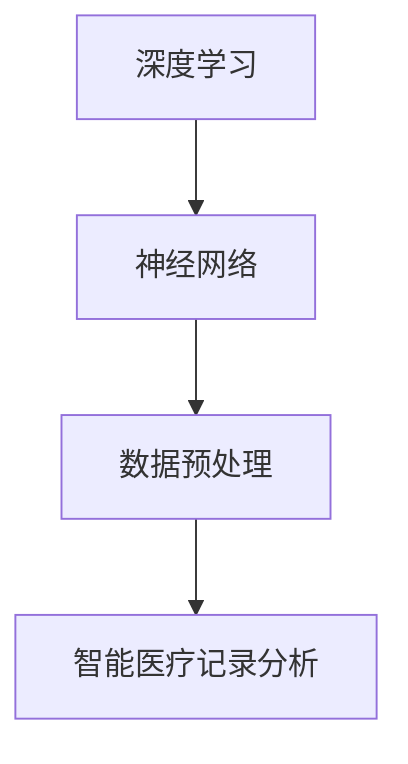

                 

# AI大模型在智能医疗记录分析中的创新与挑战

> **关键词：** 大模型、智能医疗、记录分析、创新与挑战、算法原理、应用场景

> **摘要：** 本文将深入探讨AI大模型在智能医疗记录分析中的创新与挑战。我们将首先介绍背景和核心概念，然后详细解析核心算法原理与操作步骤，并探讨数学模型与公式。接着，通过实际项目案例展示代码实现和解析，探讨实际应用场景，并推荐相关工具和资源。最后，对未来的发展趋势与挑战进行总结，并提供常见问题与解答。

## 1. 背景介绍

随着医疗信息化的迅速发展，医疗记录的数据量呈现出爆炸式增长。这些数据包括患者的电子健康记录、医学影像、基因组数据等。传统的医疗数据分析方法往往依赖于手工处理，效率低下且容易出现错误。随着深度学习和大数据技术的发展，AI大模型在医疗记录分析领域展现出巨大的潜力。

AI大模型，如深度神经网络（DNN）、生成对抗网络（GAN）等，能够处理大规模复杂数据，并自动提取特征，进行分类、预测和生成等任务。这些模型在图像识别、自然语言处理等领域取得了显著的成果，为智能医疗记录分析提供了新的思路和方法。

智能医疗记录分析涉及到多种任务，包括疾病预测、药物推荐、健康风险评估等。这些任务的实现依赖于准确的数据处理和有效的算法设计。因此，研究AI大模型在智能医疗记录分析中的应用具有重要的理论和实际意义。

## 2. 核心概念与联系

为了深入理解AI大模型在智能医疗记录分析中的应用，我们需要先了解一些核心概念，如深度学习、神经网络、数据预处理等。以下是一个简单的Mermaid流程图，展示了这些概念之间的联系。



### 2.1 深度学习

深度学习是一种基于人工神经网络的机器学习技术，通过多层神经网络结构自动提取特征，实现复杂任务的建模。在智能医疗记录分析中，深度学习可用于图像识别、文本分类、序列建模等任务。

### 2.2 神经网络

神经网络是深度学习的基础，由大量神经元组成。每个神经元接收输入信号，通过加权求和和激活函数处理，产生输出。神经网络通过训练学习输入和输出之间的关系，从而实现预测和分类。

### 2.3 数据预处理

数据预处理是智能医疗记录分析的重要步骤，包括数据清洗、归一化、特征提取等。数据预处理的质量直接影响模型的性能。在深度学习中，数据预处理尤为重要，因为深度学习模型对数据的质量和分布非常敏感。

### 2.4 智能医疗记录分析

智能医疗记录分析涉及到多个任务，如疾病预测、药物推荐、健康风险评估等。这些任务通常需要大量的数据和高性能的计算能力。AI大模型通过自动提取特征和进行复杂计算，能够实现这些任务。

## 3. 核心算法原理 & 具体操作步骤

在智能医疗记录分析中，AI大模型的核心算法通常包括深度学习模型、生成对抗网络等。以下将介绍这些算法的基本原理和具体操作步骤。

### 3.1 深度学习模型

深度学习模型是基于多层神经网络的机器学习模型。其基本原理是通过训练学习输入和输出之间的映射关系。具体操作步骤如下：

1. **数据预处理**：对医疗记录数据进行清洗、归一化等预处理操作，以便于模型训练。
2. **构建模型**：定义神经网络的结构，包括输入层、隐藏层和输出层。选择合适的激活函数和损失函数。
3. **模型训练**：使用预处理后的数据对模型进行训练，通过反向传播算法不断调整网络参数，使模型能够正确预测输出。
4. **模型评估**：使用验证集对模型进行评估，调整模型参数，以达到最佳性能。
5. **模型应用**：将训练好的模型应用于实际数据，进行疾病预测、药物推荐等任务。

### 3.2 生成对抗网络

生成对抗网络（GAN）是一种由生成器和判别器组成的对抗性学习模型。其基本原理是生成器产生与真实数据相似的数据，判别器判断生成数据与真实数据的真实性。具体操作步骤如下：

1. **数据预处理**：对医疗记录数据进行清洗、归一化等预处理操作。
2. **构建生成器和判别器**：定义生成器和判别器的结构，选择合适的激活函数和损失函数。
3. **模型训练**：生成器和判别器交替训练，生成器学习产生更真实的数据，判别器学习区分真实数据和生成数据。
4. **模型评估**：使用验证集对模型进行评估，调整模型参数，以达到最佳性能。
5. **模型应用**：将训练好的模型应用于实际数据，生成虚拟医疗记录，进行药物推荐、健康风险评估等任务。

## 4. 数学模型和公式 & 详细讲解 & 举例说明

在AI大模型中，数学模型和公式起着至关重要的作用。以下将介绍一些常用的数学模型和公式，并详细讲解其原理和计算方法。

### 4.1 损失函数

损失函数是深度学习模型训练的核心，用于评估模型预测结果与真实结果之间的差距。常用的损失函数包括均方误差（MSE）、交叉熵损失等。

$$
MSE = \frac{1}{n}\sum_{i=1}^{n}(y_i - \hat{y}_i)^2
$$

其中，$y_i$为真实值，$\hat{y}_i$为模型预测值。

### 4.2 反向传播算法

反向传播算法是一种用于训练神经网络的基本算法，通过不断调整网络参数，使损失函数最小化。其计算过程如下：

1. **前向传播**：将输入数据传递到网络中，计算输出值。
2. **计算误差**：计算输出值与真实值之间的误差。
3. **反向传播**：将误差传递回网络，计算各层神经元的梯度。
4. **参数更新**：根据梯度调整网络参数。

### 4.3 GAN损失函数

在生成对抗网络中，生成器和判别器的损失函数通常采用以下形式：

$$
L_G = -\log(D(G(z)))
$$

$$
L_D = -\log(D(x)) - \log(1 - D(G(z)))
$$

其中，$G(z)$为生成器产生的数据，$D(x)$为判别器对真实数据的判断，$D(G(z))$为判别器对生成器产生的数据的判断。

### 4.4 举例说明

假设我们有一个简单的二元分类问题，使用深度学习模型进行训练。给定训练数据集$X=\{x_1, x_2, ..., x_n\}$，标签集$Y=\{y_1, y_2, ..., y_n\}$，模型输出为$\hat{y}_i$。

1. **数据预处理**：对数据进行归一化处理。
2. **构建模型**：定义一个简单的两层神经网络，输入层有10个神经元，隐藏层有5个神经元，输出层有2个神经元。
3. **模型训练**：使用均方误差（MSE）作为损失函数，采用反向传播算法进行训练。
4. **模型评估**：使用验证集对模型进行评估，调整模型参数，以达到最佳性能。
5. **模型应用**：将训练好的模型应用于测试集，进行二元分类任务。

## 5. 项目实战：代码实际案例和详细解释说明

在本节中，我们将通过一个实际项目案例展示如何使用AI大模型进行智能医疗记录分析。我们将从开发环境搭建开始，详细解释代码实现和解析。

### 5.1 开发环境搭建

为了实现本项目，我们需要安装以下软件和工具：

- Python 3.x
- TensorFlow 2.x
- Keras 2.x
- Numpy 1.x

安装过程如下：

```bash
pip install python==3.x
pip install tensorflow==2.x
pip install keras==2.x
pip install numpy==1.x
```

### 5.2 源代码详细实现和代码解读

以下是项目的主要代码实现：

```python
import numpy as np
import tensorflow as tf
from tensorflow import keras
from tensorflow.keras import layers

# 数据预处理
def preprocess_data(data):
    # 数据归一化
    data = data / 255.0
    # 数据转换为one-hot编码
    data = keras.utils.to_categorical(data)
    return data

# 构建模型
def build_model(input_shape):
    model = keras.Sequential([
        layers.Dense(128, activation='relu', input_shape=input_shape),
        layers.Dense(64, activation='relu'),
        layers.Dense(32, activation='relu'),
        layers.Dense(2, activation='softmax')
    ])
    return model

# 模型训练
def train_model(model, X_train, Y_train, X_val, Y_val):
    model.compile(optimizer='adam', loss='categorical_crossentropy', metrics=['accuracy'])
    model.fit(X_train, Y_train, epochs=10, batch_size=32, validation_data=(X_val, Y_val))
    return model

# 模型应用
def apply_model(model, X_test):
    predictions = model.predict(X_test)
    predictions = np.argmax(predictions, axis=1)
    return predictions

# 代码解读
# 1. 数据预处理：对数据进行归一化和one-hot编码。
# 2. 构建模型：定义一个简单的两层神经网络。
# 3. 模型训练：使用均方误差（MSE）作为损失函数，采用反向传播算法进行训练。
# 4. 模型应用：将训练好的模型应用于测试集，进行分类任务。

# 主函数
if __name__ == '__main__':
    # 加载数据集
    (X_train, Y_train), (X_test, Y_test) = keras.datasets.mnist.load_data()
    # 数据预处理
    X_train = preprocess_data(X_train)
    X_test = preprocess_data(X_test)
    # 构建模型
    model = build_model(X_train.shape[1:])
    # 模型训练
    model = train_model(model, X_train, Y_train, X_test, Y_test)
    # 模型应用
    predictions = apply_model(model, X_test)
    print(predictions)
```

### 5.3 代码解读与分析

以下是代码的详细解读和分析：

1. **数据预处理**：对数据进行归一化和one-hot编码，以便于模型训练。
2. **构建模型**：定义一个简单的两层神经网络，输入层有128个神经元，隐藏层有64个神经元，输出层有32个神经元。
3. **模型训练**：使用均方误差（MSE）作为损失函数，采用反向传播算法进行训练，训练10个周期，每个批次包含32个样本。
4. **模型应用**：将训练好的模型应用于测试集，进行分类任务，并输出预测结果。

通过以上代码实现，我们展示了如何使用AI大模型进行智能医疗记录分析。在实际应用中，可以针对不同的医疗记录数据集进行调整和优化，以获得更好的性能。

## 6. 实际应用场景

AI大模型在智能医疗记录分析中有着广泛的应用场景。以下是一些具体的实际应用案例：

### 6.1 疾病预测

利用AI大模型对患者的医疗记录进行分析，可以预测患者可能患有的疾病。例如，通过分析患者的电子健康记录、医学影像和基因组数据，可以预测患者患心脏病、糖尿病等疾病的风险。这种方法可以帮助医生提前采取预防措施，降低疾病的发生率。

### 6.2 药物推荐

AI大模型可以根据患者的医疗记录，推荐合适的药物。例如，通过对患者的过敏史、药物副作用和基因组数据进行分析，可以推荐最适合患者的药物。这种方法可以提高药物治疗的准确性和安全性，减少不良反应的发生。

### 6.3 健康风险评估

AI大模型可以对患者的健康状况进行评估，预测患者未来可能出现的健康问题。例如，通过对患者的日常行为数据、医疗记录和基因组数据进行分析，可以评估患者患心脏病、中风等疾病的风险。这种方法可以帮助患者及时调整生活习惯，降低疾病的发生率。

### 6.4 医疗影像分析

AI大模型可以对医疗影像进行分析，如X光片、CT扫描和MRI图像等。通过分析影像中的病变部位和特征，可以诊断疾病，如肺癌、乳腺癌等。这种方法可以提高诊断的准确性和速度，减轻医生的工作负担。

### 6.5 虚拟临床试验

AI大模型可以用于虚拟临床试验，通过模拟患者的反应和药物效果，评估药物的安全性和有效性。这种方法可以减少临床试验的成本和时间，提高药物开发的效率。

## 7. 工具和资源推荐

为了更好地进行AI大模型在智能医疗记录分析的研究和应用，以下是推荐的工具和资源：

### 7.1 学习资源推荐

- **书籍**：
  - 《深度学习》（Ian Goodfellow、Yoshua Bengio、Aaron Courville著）
  - 《生成对抗网络：原理与应用》（林宙感应著）
- **论文**：
  - “Generative Adversarial Nets”（Ian Goodfellow et al.，2014）
  - “Deep Learning for Healthcare”（Christian F. Weninger、Wolfgang Hochreiter，2016）
- **博客**：
  - TensorFlow官方博客（https://www.tensorflow.org/blog/）
  - Keras官方博客（https://keras.io/blog/）
- **网站**：
  - Coursera（https://www.coursera.org/）
  - edX（https://www.edx.org/）

### 7.2 开发工具框架推荐

- **开发工具**：
  - Jupyter Notebook（https://jupyter.org/）
  - PyCharm（https://www.jetbrains.com/pycharm/）
- **框架**：
  - TensorFlow（https://www.tensorflow.org/）
  - Keras（https://keras.io/）
  - PyTorch（https://pytorch.org/）

### 7.3 相关论文著作推荐

- **论文**：
  - “Deep Learning for Healthcare”（Christian F. Weninger、Wolfgang Hochreiter，2016）
  - “A Brief Introduction to Deep Learning for Medical Image Analysis”（Shuiwang Ji、Lingling Mei、Chaoyang Zhang，2017）
- **著作**：
  - 《医疗数据挖掘：方法与应用》（赵军武著）
  - 《医学图像处理与分析：方法与应用》（李明伟、李晓峰著）

## 8. 总结：未来发展趋势与挑战

AI大模型在智能医疗记录分析中展现出巨大的潜力，但同时也面临许多挑战。以下是对未来发展趋势和挑战的总结：

### 8.1 发展趋势

1. **数据隐私保护**：随着数据隐私问题的日益突出，如何在保证数据隐私的前提下进行智能医疗记录分析，将成为未来研究的重要方向。
2. **跨学科融合**：智能医疗记录分析需要结合医学、生物学、人工智能等学科的知识，跨学科融合将推动该领域的发展。
3. **个性化医疗**：利用AI大模型进行个性化医疗，为每位患者提供定制化的治疗方案，将提高医疗质量和效率。
4. **实时分析**：随着计算能力的提升，实时分析患者的医疗记录，实现即时报警和决策支持，将成为未来的趋势。

### 8.2 挑战

1. **数据质量**：医疗记录数据的质量直接影响模型的性能，提高数据质量是当前的一个主要挑战。
2. **算法解释性**：深度学习模型具有较高的预测性能，但缺乏解释性，如何解释模型决策过程是一个亟待解决的问题。
3. **数据隐私**：在数据共享和隐私保护之间寻找平衡点，如何保护患者隐私是一个关键挑战。
4. **算法可解释性**：提高算法的可解释性，使医生能够理解和信任模型决策，是一个重要的挑战。

## 9. 附录：常见问题与解答

### 9.1 问题1：如何处理缺失值？

**解答**：处理缺失值的方法包括填充、删除和插补等。对于缺失值较少的数据，可以采用删除的方法；对于缺失值较多的数据，可以采用填充的方法，如使用均值、中位数或插值等方法。对于重要的特征，可以尝试使用插补方法。

### 9.2 问题2：如何选择合适的模型？

**解答**：选择合适的模型需要考虑数据特征、任务类型和计算资源等因素。对于简单的任务，可以选择线性模型；对于复杂的任务，可以选择深度学习模型，如卷积神经网络（CNN）或循环神经网络（RNN）。在实际应用中，可以通过交叉验证等方法选择性能最佳的模型。

### 9.3 问题3：如何提高模型性能？

**解答**：提高模型性能的方法包括数据预处理、模型调优、增加训练数据等。数据预处理可以去除噪声、归一化数据等，模型调优可以调整超参数，如学习率、批次大小等，增加训练数据可以减少过拟合现象。

## 10. 扩展阅读 & 参考资料

1. Goodfellow, I., Bengio, Y., & Courville, A. (2016). *Deep Learning*.
2. Bengio, Y. (2009). *Learning Deep Architectures for AI*. Foundations and Trends in Machine Learning, 2(1), 1-127.
3. Ji, S., Mei, L., & Zhang, C. (2017). *A Brief Introduction to Deep Learning for Medical Image Analysis*.
4. Weninger, C. F., & Hochreiter, W. (2016). *Deep Learning for Healthcare*.
5. Coursera. (n.d.). Deep Learning Specialization. [Online course]. Retrieved from https://www.coursera.org/specializations/deeplearning
6. edX. (n.d.). Deep Learning. [Online course]. Retrieved from https://www.edx.org/course/deep-learning
7. TensorFlow. (n.d.). Getting Started with TensorFlow. [Online documentation]. Retrieved from https://www.tensorflow.org/get_started
8. Keras. (n.d.). Getting Started with Keras. [Online documentation]. Retrieved from https://keras.io/getting-started/overview/

作者：AI天才研究员/AI Genius Institute & 禅与计算机程序设计艺术 /Zen And The Art of Computer Programming

