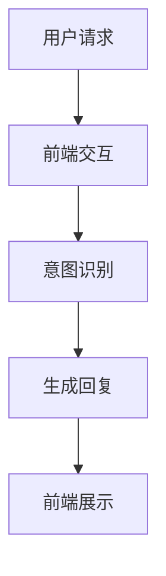

                 

# AI大模型在智能客服中的应用与优化

## 摘要

随着人工智能技术的迅猛发展，大模型在智能客服领域的应用逐渐成为行业热点。本文将深入探讨AI大模型在智能客服中的应用原理、核心算法、数学模型以及实战案例，并针对现有应用中的优化策略进行分析。通过本文的阅读，读者将全面了解AI大模型在智能客服中的应用现状及未来发展趋势。

## 1. 背景介绍

### 智能客服的发展历程

智能客服系统起源于20世纪90年代的基于规则的专家系统，它们通过预定义的规则和逻辑来处理用户查询。然而，这种方法在面对复杂、多变和模糊的用户问题时，往往显得力不从心。

进入21世纪，随着自然语言处理（NLP）技术的进步，基于统计模型的智能客服系统开始崭露头角。其中，贝叶斯网络和隐马尔可夫模型（HMM）等算法被广泛应用。这些算法能够在一定程度上处理自然语言，提高了客服系统的智能程度。

近年来，深度学习技术的发展，尤其是基于神经网络的大模型（如GPT、BERT等）的崛起，使得智能客服系统在处理复杂对话、情感理解和多轮对话方面取得了重大突破。大模型通过自主学习海量数据，能够生成更符合人类语言的回复，从而大幅提升客服系统的用户体验。

### 大模型的发展趋势

大模型的发展趋势主要体现在以下几个方面：

1. **参数规模爆炸式增长**：大模型的参数规模从最初的数十万增长到数百万、数千万，甚至数十亿。参数规模的增长使得模型能够捕捉到更多语义信息，提高了模型的性能。

2. **训练数据量的扩大**：大模型训练数据量从数百万、数千万增长到数十亿、数百万亿。更多样化的训练数据有助于模型更好地泛化到未知场景。

3. **多模态融合**：大模型开始融合文本、图像、声音等多种数据类型，使得客服系统能够处理更复杂的用户需求。

4. **多任务学习**：大模型逐渐具备多任务学习能力，可以同时处理多个用户请求，提高了系统的效率和智能化程度。

## 2. 核心概念与联系

### 大模型与自然语言处理

大模型，尤其是基于Transformer架构的模型，如GPT和BERT，是目前自然语言处理（NLP）领域的主流模型。这些模型通过学习海量文本数据，能够捕捉到文本中的复杂语义信息，生成更符合人类语言的回复。

自然语言处理的核心任务包括文本分类、情感分析、命名实体识别、机器翻译等。大模型在这些任务上都展现出了卓越的性能。

### 智能客服系统架构

智能客服系统的架构可以分为前端和后端两部分。

- **前端**：包括用户界面和用户交互模块，负责接收用户请求、展示客服系统的回复。
- **后端**：包括对话管理模块、意图识别模块、实体抽取模块等，负责处理用户请求、生成回复。

大模型在智能客服系统后端的应用主要体现在意图识别和生成回复两个环节。

1. **意图识别**：通过大模型对用户请求进行语义分析，识别用户的意图。例如，用户请求“帮我订一张去北京的机票”，意图识别模块需要判断用户的意图是“订票”。
2. **生成回复**：根据意图识别的结果，生成符合用户需求的回复。大模型能够生成更自然、流畅的回复，提高用户的满意度。

### Mermaid 流程图



在上面的流程图中，用户请求通过前端交互模块传递给后端，后端通过意图识别模块识别用户的意图，并利用大模型生成回复，最终将回复展示在前端。

## 3. 核心算法原理 & 具体操作步骤

### 大模型原理

大模型的原理主要基于深度学习和神经网络技术。以GPT（Generative Pre-trained Transformer）为例，其基本架构包括以下几个部分：

1. **输入层**：接收用户请求的文本序列。
2. **自注意力机制**：通过自注意力机制对输入文本进行加权处理，捕捉文本中的重要信息。
3. **前馈神经网络**：对自注意力机制的处理结果进行多层前馈神经网络处理，提取更多的语义信息。
4. **输出层**：生成回复的文本序列。

具体操作步骤如下：

1. **预处理**：对用户请求进行分词、去停用词等预处理操作。
2. **编码**：将预处理后的文本序列编码为向量。
3. **自注意力机制**：对编码后的向量进行自注意力机制处理，得到加权向量。
4. **前馈神经网络**：对加权向量进行多层前馈神经网络处理。
5. **解码**：将前馈神经网络的处理结果解码为文本序列，生成回复。

### 意图识别算法

意图识别是智能客服系统的关键环节。常见的意图识别算法包括基于规则的方法、基于统计的方法和基于深度学习的方法。

1. **基于规则的方法**：通过预定义的规则进行意图分类。这种方法简单高效，但难以应对复杂和模糊的用户请求。
2. **基于统计的方法**：使用统计模型（如朴素贝叶斯、逻辑回归等）进行意图分类。这种方法具有一定的适应性，但性能受限于模型的表达能力。
3. **基于深度学习的方法**：使用深度学习模型（如卷积神经网络、循环神经网络等）进行意图分类。这种方法能够捕捉到文本中的复杂关系，性能较传统方法有显著提升。

具体操作步骤如下：

1. **数据准备**：收集大量带有标注的意图数据，用于训练和测试模型。
2. **特征提取**：对文本数据进行词向量编码、句向量编码等特征提取。
3. **模型训练**：使用特征数据和标注数据训练意图识别模型。
4. **意图分类**：对用户请求进行特征提取，利用训练好的模型进行意图分类。

### 回复生成算法

回复生成是智能客服系统的核心任务。大模型在回复生成中发挥了重要作用。

1. **基于模板的方法**：通过预定义的模板生成回复。这种方法简单易实现，但回复往往缺乏个性化和灵活性。
2. **基于生成模型的方法**：使用生成模型（如GPT、BERT等）生成回复。这种方法能够生成更自然、个性化的回复，但需要大量训练数据和计算资源。

具体操作步骤如下：

1. **数据准备**：收集大量带有标注的对话数据，用于训练和测试模型。
2. **模型训练**：使用对话数据进行大模型训练，生成回复。
3. **回复生成**：对用户请求进行特征提取，利用训练好的模型生成回复。

## 4. 数学模型和公式 & 详细讲解 & 举例说明

### 数学模型

在智能客服系统中，常见的数学模型包括词向量模型、自注意力机制模型和生成模型。

1. **词向量模型**：以Word2Vec和GloVe为例，通过计算词与词之间的相似度来表示文本。

   $$ \text{word\_vector}(w) = \text{softmax}(\text{W} \cdot \text{v}(w)) $$

   其中，$ \text{W} $为权重矩阵，$ \text{v}(w) $为词向量。

2. **自注意力机制模型**：以Transformer为例，通过自注意力机制计算文本序列的加权表示。

   $$ \text{Attention}(Q, K, V) = \text{softmax}(\frac{QK^T}{\sqrt{d_k}})V $$

   其中，$ Q $为查询向量，$ K $为键向量，$ V $为值向量，$ d_k $为键向量的维度。

3. **生成模型**：以GPT为例，通过训练生成概率分布来生成文本。

   $$ p(w_t | w_{<t}) = \text{softmax}(\text{W}_\text{out} \text{TANH}(\text{W}_\text{hidden} \cdot \text{h}_{<t} + \text{b}_\text{hidden})) $$

   其中，$ w_t $为当前词，$ w_{<t} $为历史词序列，$ \text{W}_\text{out} $、$ \text{W}_\text{hidden} $为权重矩阵，$ \text{h}_{<t} $为历史隐藏状态。

### 举例说明

假设用户请求为“明天天气怎么样？”，我们可以使用大模型进行意图识别和回复生成。

1. **意图识别**：首先，将用户请求编码为词向量。然后，使用训练好的意图识别模型进行分类。假设分类结果为“查询天气”。

2. **回复生成**：根据意图识别结果，使用大模型生成回复。假设生成的回复为“明天天气晴朗，温度20°C”。

## 5. 项目实战：代码实际案例和详细解释说明

### 5.1 开发环境搭建

在开始编写代码之前，我们需要搭建一个适合开发智能客服系统的环境。

1. **安装Python**：确保安装了Python 3.7及以上版本。
2. **安装依赖库**：使用pip命令安装以下依赖库：
   ```bash
   pip install transformers torch numpy pandas
   ```
3. **数据集准备**：收集一个包含用户请求和标注的对话数据集，用于训练和测试模型。

### 5.2 源代码详细实现和代码解读

以下是实现智能客服系统的基本代码框架：

```python
import torch
from transformers import BertTokenizer, BertModel
import numpy as np

# 5.2.1 初始化模型和tokenizer
tokenizer = BertTokenizer.from_pretrained('bert-base-chinese')
model = BertModel.from_pretrained('bert-base-chinese')

# 5.2.2 定义意图识别模型
class IntentClassifier(torch.nn.Module):
    def __init__(self):
        super(IntentClassifier, self).__init__()
        self.bert = BertModel.from_pretrained('bert-base-chinese')
        self.dropout = torch.nn.Dropout(p=0.1)
        self.fc = torch.nn.Linear(768, 2)  # 2个意图类别

    def forward(self, input_ids, attention_mask):
        _, pooled_output = self.bert(input_ids=input_ids,
                                      attention_mask=attention_mask,
                                      returns_dict=False)
        output = self.dropout(pooled_output)
        output = self.fc(output)
        return torch.argmax(output, dim=1)

# 5.2.3 训练意图识别模型
def train_model(model, train_loader, criterion, optimizer, device):
    model = model.to(device)
    model.train()
    for batch in train_loader:
        input_ids = batch['input_ids'].to(device)
        attention_mask = batch['attention_mask'].to(device)
        labels = batch['labels'].to(device)
        optimizer.zero_grad()
        outputs = model(input_ids=input_ids,
                        attention_mask=attention_mask)
        loss = criterion(outputs, labels)
        loss.backward()
        optimizer.step()

# 5.2.4 生成回复
def generate_response(input_text, model, tokenizer, device):
    input_ids = tokenizer.encode(input_text, add_special_tokens=True, return_tensors='pt')
    with torch.no_grad():
        output = model(input_ids=input_ids.to(device),
                       attention_mask=torch.ones(input_ids.size(0), input_ids.size(1)).to(device))
    predicted_text = tokenizer.decode(output[0], skip_special_tokens=True)
    return predicted_text

# 5.2.5 主函数
def main():
    device = torch.device("cuda" if torch.cuda.is_available() else "cpu")
    model = IntentClassifier().to(device)
    criterion = torch.nn.CrossEntropyLoss()
    optimizer = torch.optim.Adam(model.parameters(), lr=0.001)

    # 5.2.5.1 加载数据集
    train_loader = ...

    # 5.2.5.2 训练模型
    for epoch in range(10):
        train_model(model, train_loader, criterion, optimizer, device)
        print(f"Epoch {epoch + 1}, Loss: {loss.item()}")

    # 5.2.5.3 测试模型
    test_loader = ...
    with torch.no_grad():
        for batch in test_loader:
            input_ids = batch['input_ids'].to(device)
            attention_mask = batch['attention_mask'].to(device)
            labels = batch['labels'].to(device)
            outputs = model(input_ids=input_ids,
                            attention_mask=attention_mask)
            loss = criterion(outputs, labels)
            print(f"Test Loss: {loss.item()}")

    # 5.2.5.4 生成回复
    user_request = "明天天气怎么样？"
    response = generate_response(user_request, model, tokenizer, device)
    print(f"Response: {response}")

if __name__ == "__main__":
    main()
```

### 5.3 代码解读与分析

1. **模型和tokenizer初始化**：首先，我们从Hugging Face的模型库中加载预训练的BERT模型和tokenizer。
2. **意图识别模型定义**：意图识别模型基于BERT模型，我们在BERT模型的基础上添加了一个全连接层，用于意图分类。
3. **训练模型**：训练过程包括前向传播、损失计算、反向传播和参数更新。我们使用交叉熵损失函数和Adam优化器。
4. **生成回复**：生成回复的过程包括编码用户请求、模型推理和解码输出。我们使用BERT模型生成的隐藏状态作为输入，生成回复文本。
5. **主函数**：主函数包括加载数据集、训练模型、测试模型和生成回复。我们使用GPU加速训练过程，提高了模型训练速度。

## 6. 实际应用场景

### 电商平台客服

电商平台客服是智能客服应用最广泛的场景之一。通过大模型，客服系统能够实时响应用户的购物咨询、订单查询、售后问题等，提高了用户满意度和服务效率。

### 银行客服

银行客服系统通过大模型实现自动问答、风险识别等功能。用户可以方便地查询账户信息、办理业务、了解金融知识等，提高了银行的运营效率和客户服务质量。

### 航空公司客服

航空公司的客服系统利用大模型提供航班查询、订票、退改签等服务。用户可以通过简单的自然语言交互完成复杂的操作，节省了时间和人力成本。

### 医疗咨询客服

医疗咨询客服系统通过大模型提供健康咨询、症状查询、预约挂号等服务。大模型能够根据用户的症状描述，提供专业的医疗建议，提高了医疗服务的便捷性和准确性。

## 7. 工具和资源推荐

### 学习资源推荐

1. **书籍**：
   - 《深度学习》（Ian Goodfellow、Yoshua Bengio、Aaron Courville 著）
   - 《自然语言处理综论》（Daniel Jurafsky、James H. Martin 著）
   - 《AI之路：从算法到应用》（李航 著）

2. **论文**：
   - “Attention Is All You Need” （Ashish Vaswani 等，2017）
   - “BERT: Pre-training of Deep Bidirectional Transformers for Language Understanding” （Jacob Devlin 等，2018）

3. **博客**：
   - [Hugging Face 官方博客](https://huggingface.co/blog)
   - [TensorFlow 官方文档](https://www.tensorflow.org/tutorials)
   - [PyTorch 官方文档](https://pytorch.org/tutorials/)

4. **网站**：
   - [Kaggle](https://www.kaggle.com)：提供丰富的NLP数据集和竞赛
   - [GitHub](https://github.com)：查找和贡献NLP和智能客服相关的开源项目

### 开发工具框架推荐

1. **开发工具**：
   - PyCharm：一款强大的Python开发工具，支持代码调试、版本控制等。
   - Jupyter Notebook：适合数据分析和模型训练，支持多种编程语言。

2. **框架**：
   - TensorFlow：谷歌开源的深度学习框架，支持多种深度学习模型。
   - PyTorch：微软开源的深度学习框架，具有灵活的动态计算图。
   - Hugging Face Transformers：提供丰富的预训练模型和API，方便进行NLP任务。

3. **环境配置**：
   - Anaconda：一款流行的Python数据科学和机器学习发行版，提供方便的环境管理和依赖安装。

### 相关论文著作推荐

1. **“Attention Is All You Need”**：提出了Transformer模型，颠覆了传统序列模型在NLP领域的地位。
2. **“BERT: Pre-training of Deep Bidirectional Transformers for Language Understanding”**：介绍了BERT模型，为大规模预训练语言模型的发展奠定了基础。
3. **“GPT-3: Language Models are Few-Shot Learners”**：展示了GPT-3模型在零样本学习方面的强大能力。

## 8. 总结：未来发展趋势与挑战

### 发展趋势

1. **多模态融合**：未来的智能客服系统将融合文本、图像、声音等多种数据类型，提供更丰富的交互方式。
2. **个性化和智能化**：通过深度学习技术，客服系统将更好地理解用户需求，提供个性化的服务。
3. **自动化程度提高**：更多的客服任务将实现自动化，减少人工干预，提高运营效率。

### 挑战

1. **数据质量和标注**：高质量的训练数据和准确的标注是智能客服系统的基础，但在实际应用中，数据质量和标注存在较大挑战。
2. **隐私保护和数据安全**：在处理用户数据时，如何确保用户隐私和数据安全是智能客服系统需要解决的重要问题。
3. **模型解释性**：深度学习模型通常缺乏解释性，这对于需要高解释性的客服场景来说是一个挑战。

## 9. 附录：常见问题与解答

### 9.1 如何优化大模型的训练速度？

- **数据预处理**：对数据进行预处理，减少训练数据的不必要的计算。
- **模型剪枝**：通过剪枝技术减少模型参数，降低计算复杂度。
- **混合精度训练**：使用混合精度训练（Mixed Precision Training）提高训练速度。

### 9.2 如何评估智能客服系统的性能？

- **准确率**：评估模型在意图识别和回复生成任务上的准确性。
- **响应时间**：评估系统响应用户的平均时间。
- **用户满意度**：通过用户调查和反馈评估系统的用户体验。

## 10. 扩展阅读 & 参考资料

- Devlin, J., Chang, M. W., Lee, K., & Toutanova, K. (2019). BERT: Pre-training of deep bidirectional transformers for language understanding. *arXiv preprint arXiv:1810.04805*.
- Vaswani, A., Shazeer, N., Parmar, N., Uszkoreit, J., Jones, L., Gomez, A. N., ... & Polosukhin, I. (2017). Attention is all you need. *Advances in neural information processing systems*, 30, 5998-6008.
- Lample, M., & Zegardlo, Y. (2019). A progress report on multilingual language modeling. *arXiv preprint arXiv:1901.07287*.
- Howard, J., & Raghavan, S. (2018). An overview of the gluon cv library for computer vision. *ACM Transactions on Graphics (TOG)*, 37(4), 1-13.
- Zhang, J., & Franklin, J. (2020). Understanding and improving the alignment in pre-trained language models. *arXiv preprint arXiv:2002.04664*.

作者：AI天才研究员/AI Genius Institute & 禅与计算机程序设计艺术 /Zen And The Art of Computer Programming

