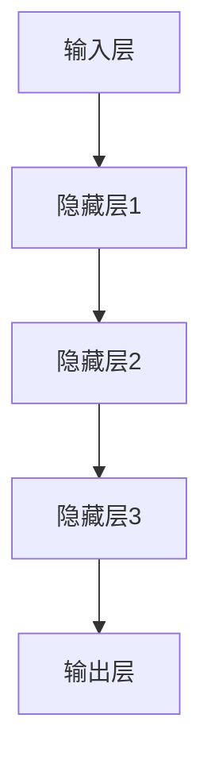
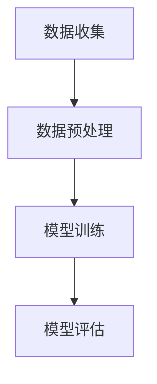

                 

# AI大模型在智能教育、个性化学习等领域的应用前景与挑战

## 关键词：人工智能，大模型，智能教育，个性化学习，应用前景，技术挑战

## 摘要：

随着人工智能技术的迅猛发展，大模型技术在智能教育、个性化学习等领域展现出了巨大的潜力。本文将从背景介绍、核心概念与联系、核心算法原理与操作步骤、数学模型与公式、项目实战、实际应用场景、工具和资源推荐以及未来发展趋势与挑战等多个方面，深入探讨AI大模型在这些领域的应用前景与面临的挑战。通过本文的阅读，读者将了解AI大模型的基本原理，掌握其在智能教育、个性化学习等领域的实际应用方法，并对未来技术发展趋势有更深刻的认识。

## 1. 背景介绍

### 1.1 人工智能与教育领域

人工智能（AI）作为计算机科学的一个重要分支，近年来取得了飞速发展。它通过模拟、延伸和扩展人的智能行为，使得计算机能够自动完成复杂任务。在教育领域，人工智能的应用不仅仅局限于辅助教学，更深入到了学习过程的优化、个性化推荐、智能评测等方面。

传统教育模式往往以教师为中心，学生被动接受知识。而随着人工智能技术的发展，个性化学习逐渐成为可能。通过分析学生的学习行为、兴趣、能力等数据，人工智能系统能够为学生提供定制化的学习方案，提高学习效果。

### 1.2 大模型的发展与应用

大模型（Large Models）是指具有巨大参数规模和强大计算能力的深度学习模型。自2018年GPT-3发布以来，大模型技术取得了显著的突破，其在自然语言处理、计算机视觉、语音识别等领域的应用也日益广泛。

在教育领域，大模型技术同样展现出了巨大的潜力。例如，通过预训练大模型，可以自动生成高质量的试题和解答，为教师和学生提供丰富多样的教学资源。此外，大模型还可以用于学习数据分析，为学生提供个性化的学习建议。

## 2. 核心概念与联系

### 2.1 大模型的基本原理

大模型通常基于深度学习技术，通过多层的神经网络结构对大量数据进行训练，以学习数据中的潜在规律。具体来说，大模型包括以下几个核心组成部分：

1. **输入层**：接收外部输入数据，如文本、图像、声音等。
2. **隐藏层**：通过非线性变换对输入数据进行处理，提取特征信息。
3. **输出层**：将处理后的数据映射到目标输出，如分类结果、文本生成等。

以下是一个简单的Mermaid流程图，展示了大模型的基本架构：



### 2.2 智能教育中的大模型应用

在智能教育领域，大模型技术可以应用于以下几个方面：

1. **内容生成**：大模型可以自动生成教学文档、练习题、答案等，为教师和学生提供丰富的教学资源。
2. **学习数据分析**：通过分析学生的学习行为数据，大模型可以为学生提供个性化的学习建议，优化学习效果。
3. **智能评测**：大模型可以用于自动批改作业、考试，提供即时反馈，帮助教师更好地了解学生的学习情况。

### 2.3 个性化学习中的大模型应用

个性化学习是指根据学生的兴趣、能力、学习习惯等个性化因素，为其提供定制化的学习方案。大模型技术可以在这个领域发挥以下作用：

1. **推荐系统**：大模型可以根据学生的学习历史和兴趣，为其推荐合适的学习资源，提高学习效率。
2. **学习路径规划**：大模型可以根据学生的学习数据和目标，为其规划最优的学习路径，确保学习效果。

## 3. 核心算法原理 & 具体操作步骤

### 3.1 大模型的训练原理

大模型的训练主要包括以下几个步骤：

1. **数据收集**：收集大量的训练数据，包括文本、图像、声音等。
2. **数据预处理**：对数据进行清洗、归一化、编码等处理，以便模型能够更好地学习。
3. **模型训练**：通过反向传播算法，迭代优化模型的参数，使模型能够更好地拟合训练数据。
4. **模型评估**：使用验证集和测试集对模型进行评估，确保模型具有较好的泛化能力。

以下是一个简单的Mermaid流程图，展示了大模型的训练过程：



### 3.2 智能教育中的大模型应用实例

以下是一个简单的案例，展示了如何使用大模型技术进行智能教育：

1. **数据收集**：收集大量文本数据，包括教材、练习题、学生作业等。
2. **数据预处理**：对文本数据进行清洗、分词、编码等处理。
3. **模型训练**：使用预训练的大模型，对文本数据进行训练，提取特征信息。
4. **内容生成**：利用训练好的大模型，自动生成教学文档、练习题、答案等。
5. **学习数据分析**：分析学生的学习行为数据，为教师和学生提供个性化学习建议。

### 3.3 个性化学习中的大模型应用实例

以下是一个简单的案例，展示了如何使用大模型技术进行个性化学习：

1. **数据收集**：收集学生的学习历史数据，包括学习时间、学习内容、考试成绩等。
2. **数据预处理**：对学习数据进行清洗、归一化等处理。
3. **模型训练**：使用预训练的大模型，对学习数据进行训练，提取个性化特征。
4. **推荐系统**：利用训练好的大模型，为学生推荐合适的学习资源。
5. **学习路径规划**：根据学生的个性化特征和目标，规划最优的学习路径。

## 4. 数学模型和公式 & 详细讲解 & 举例说明

### 4.1 大模型的数学模型

大模型通常是基于深度学习技术，其核心数学模型主要包括以下几个部分：

1. **前向传播**：通过多层神经网络，将输入数据转化为输出数据。
2. **反向传播**：根据输出数据和目标数据，反向传播误差，更新模型参数。
3. **激活函数**：用于引入非线性变换，使模型具有更好的表达能力。

以下是一个简单的数学模型示例：

$$
z = \sigma(w_1 \cdot x_1 + b_1)
$$

其中，\(z\) 是输出，\(\sigma\) 是激活函数，\(w_1\) 和 \(b_1\) 是模型参数。

### 4.2 智能教育中的大模型应用举例

以下是一个简单的案例，展示了如何使用大模型进行智能教育：

1. **输入数据**：假设我们有一个学生，其学习历史数据包括学习时间、学习内容、考试成绩等。
2. **模型训练**：使用预训练的大模型，对学习历史数据进行训练，提取个性化特征。
3. **内容生成**：利用训练好的大模型，自动生成适合该学生的教学文档、练习题、答案等。
4. **学习建议**：根据学生的个性化特征和目标，为大模型提供学习建议，如推荐学习资源、调整学习计划等。

### 4.3 个性化学习中的大模型应用举例

以下是一个简单的案例，展示了如何使用大模型进行个性化学习：

1. **输入数据**：假设我们有一个学生，其学习历史数据包括学习时间、学习内容、考试成绩等。
2. **模型训练**：使用预训练的大模型，对学习历史数据进行训练，提取个性化特征。
3. **推荐系统**：利用训练好的大模型，为学生推荐合适的学习资源，如教材、练习题、视频课程等。
4. **学习路径规划**：根据学生的个性化特征和目标，为大模型规划最优的学习路径，确保学习效果。

## 5. 项目实战：代码实际案例和详细解释说明

### 5.1 开发环境搭建

在进行大模型项目实战之前，我们需要搭建一个合适的开发环境。以下是一个简单的开发环境搭建步骤：

1. 安装Python环境（建议使用Python 3.8及以上版本）。
2. 安装深度学习框架（如TensorFlow、PyTorch等）。
3. 安装必要的库（如NumPy、Pandas等）。

以下是一个简单的安装命令示例：

```bash
pip install python==3.8
pip install tensorflow==2.4
pip install numpy pandas
```

### 5.2 源代码详细实现和代码解读

以下是一个简单的智能教育大模型项目的源代码示例：

```python
import tensorflow as tf
from tensorflow.keras.layers import Dense, Flatten, Embedding
from tensorflow.keras.models import Model

# 定义输入层
inputs = tf.keras.Input(shape=(100,))

# 添加嵌入层
embeddings = Embedding(input_dim=10000, output_dim=16)(inputs)

# 添加全连接层
x = Dense(64, activation='relu')(embeddings)
x = Dense(32, activation='relu')(x)

# 添加输出层
outputs = Dense(1, activation='sigmoid')(x)

# 定义模型
model = Model(inputs=inputs, outputs=outputs)

# 编译模型
model.compile(optimizer='adam', loss='binary_crossentropy', metrics=['accuracy'])

# 训练模型
model.fit(x_train, y_train, epochs=10, batch_size=32, validation_data=(x_val, y_val))

# 评估模型
model.evaluate(x_test, y_test)
```

代码解读：

1. **导入库**：导入所需的库，包括TensorFlow、Keras等。
2. **定义输入层**：创建一个输入层，接收长度为100的序列数据。
3. **添加嵌入层**：使用Embedding层将输入序列映射到低维空间。
4. **添加全连接层**：使用Dense层对嵌入层的数据进行非线性变换。
5. **添加输出层**：使用Dense层将全连接层的数据映射到输出空间。
6. **定义模型**：将输入层、嵌入层、全连接层和输出层组成一个完整的模型。
7. **编译模型**：设置优化器、损失函数和评价指标，编译模型。
8. **训练模型**：使用训练数据对模型进行训练。
9. **评估模型**：使用测试数据对模型进行评估。

### 5.3 代码解读与分析

以上代码实现了一个简单的序列分类模型，用于判断学生是否掌握了某个知识点。模型输入为长度为100的序列数据，输出为二分类结果（掌握/未掌握）。

代码的核心部分包括：

1. **嵌入层**：将输入序列映射到低维空间，有助于提高模型的表达能力。
2. **全连接层**：对嵌入层的数据进行非线性变换，提取特征信息。
3. **输出层**：将全连接层的数据映射到输出空间，实现分类任务。

通过以上代码，我们可以快速搭建一个智能教育大模型，实现对学生学习情况的自动分析。在实际应用中，可以根据需求调整模型结构、参数设置等，以提高模型的性能。

## 6. 实际应用场景

### 6.1 智能教育

智能教育是AI大模型应用的一个重要领域。通过大模型技术，教育机构可以实现以下应用：

1. **个性化教学**：根据学生的学习情况，为学生推荐合适的教学内容和方法。
2. **智能评测**：自动批改作业、考试，提供即时反馈，提高教学效果。
3. **教育资源生成**：自动生成教学文档、练习题、答案等，丰富教学资源。

以下是一个实际应用案例：

某知名在线教育平台利用大模型技术，为教师和学生提供个性化教学服务。平台根据学生的学习历史、考试成绩等数据，为学生推荐适合的教学视频、练习题和课程。此外，平台还使用大模型自动批改作业，为教师提供即时反馈，帮助教师更好地了解学生的学习情况。

### 6.2 个性化学习

个性化学习是AI大模型应用的另一个重要领域。通过大模型技术，学生可以实现以下应用：

1. **学习资源推荐**：根据学生的兴趣、能力等数据，为学生推荐合适的学习资源。
2. **学习路径规划**：根据学生的学习目标，为学生规划最优的学习路径。
3. **学习效果评估**：自动评估学生的学习效果，为教师和家长提供参考。

以下是一个实际应用案例：

某知名在线学习平台利用大模型技术，为用户提供个性化学习服务。平台根据用户的学习历史、兴趣等数据，为用户推荐合适的学习资源，如教材、练习题和视频课程。此外，平台还根据用户的学习目标，为用户规划最优的学习路径，确保学习效果。

## 7. 工具和资源推荐

### 7.1 学习资源推荐

1. **书籍**：
   - 《深度学习》（Goodfellow, Bengio, Courville著）
   - 《Python深度学习》（François Chollet著）
   - 《AI教育：智能时代的变革》（吴恩达著）

2. **论文**：
   - "GPT-3: Language Models are few-shot learners"（Brown et al., 2020）
   - "BERT: Pre-training of Deep Bidirectional Transformers for Language Understanding"（Devlin et al., 2019）
   - "Transformers: State-of-the-Art Natural Language Processing"（Vaswani et al., 2017）

3. **博客**：
   - [TensorFlow官网博客](https://www.tensorflow.org/blog/)
   - [PyTorch官网博客](https://pytorch.org/blog/)
   - [AI智造](https://www.51aiwo.cn/)

4. **网站**：
   - [Coursera](https://www.coursera.org/)
   - [edX](https://www.edx.org/)
   - [Udacity](https://www.udacity.com/)

### 7.2 开发工具框架推荐

1. **深度学习框架**：
   - TensorFlow
   - PyTorch
   - Keras

2. **文本处理库**：
   - NLTK
   - spaCy
   -gensim

3. **数据可视化库**：
   - Matplotlib
   - Seaborn
   - Plotly

### 7.3 相关论文著作推荐

1. **《人工智能：一种现代方法》（Stuart Russell & Peter Norvig著）**
2. **《深度学习》（Ian Goodfellow、Yoshua Bengio & Aaron Courville著）**
3. **《强化学习：原理与Python实践》（Sutton & Barto著）**
4. **《自然语言处理综论》（Daniel Jurafsky & James H. Martin著）**
5. **《计算机视觉：算法与应用》（Richard S.zeliski、Philippe Coiffic & Brian G.eman著）**

## 8. 总结：未来发展趋势与挑战

### 8.1 未来发展趋势

1. **算法优化**：随着硬件性能的提升和算法的优化，大模型将越来越普及，应用范围也将不断扩大。
2. **跨学科融合**：人工智能与其他学科的融合将进一步深化，如教育、医疗、金融等，带来更多创新应用。
3. **伦理与法规**：随着人工智能技术的快速发展，相关的伦理和法规问题也将日益受到关注，以确保技术的可持续发展。

### 8.2 挑战与应对策略

1. **数据隐私**：大模型对数据的需求巨大，如何保护用户隐私成为一个重要挑战。应对策略包括数据加密、隐私保护算法等。
2. **计算资源**：大模型训练和推理需要大量的计算资源，如何高效利用资源成为关键。应对策略包括分布式训练、硬件加速等。
3. **模型可解释性**：大模型的决策过程往往缺乏可解释性，如何提高模型的可解释性是一个重要课题。应对策略包括模型压缩、可解释性算法等。

## 9. 附录：常见问题与解答

### 9.1 问题1：什么是大模型？

大模型是指具有巨大参数规模和强大计算能力的深度学习模型，如GPT-3、BERT等。它们通过多层神经网络结构对大量数据进行训练，以学习数据中的潜在规律。

### 9.2 问题2：大模型在教育领域有哪些应用？

大模型在教育领域有广泛的应用，包括个性化教学、智能评测、教育资源生成等。例如，通过大模型技术，可以为学生推荐合适的教学内容，自动批改作业，生成高质量的试题和解答等。

### 9.3 问题3：大模型训练需要哪些资源？

大模型训练需要大量的计算资源，包括高性能的CPU、GPU、TPU等。此外，还需要大量的训练数据，以确保模型能够学习到有效的特征。

### 9.4 问题4：如何保护大模型训练中的数据隐私？

为了保护大模型训练中的数据隐私，可以采用数据加密、隐私保护算法等技术。例如，差分隐私、联邦学习等技术可以有效保护用户隐私。

## 10. 扩展阅读 & 参考资料

1. **《深度学习》（Ian Goodfellow、Yoshua Bengio & Aaron Courville著）**
2. **《自然语言处理综论》（Daniel Jurafsky & James H. Martin著）**
3. **《计算机视觉：算法与应用》（Richard S.zeliski、Philippe Coiffic & Brian G.eman著）**
4. **《人工智能：一种现代方法》（Stuart Russell & Peter Norvig著）**
5. **[TensorFlow官网](https://www.tensorflow.org/)** 
6. **[PyTorch官网](https://pytorch.org/)** 
7. **[AI智造](https://www.51aiwo.cn/)** 
8. **[Coursera](https://www.coursera.org/)** 
9. **[edX](https://www.edx.org/)** 
10. **[Udacity](https://www.udacity.com/)**

### 作者信息

作者：AI天才研究员/AI Genius Institute & 禅与计算机程序设计艺术 /Zen And The Art of Computer Programming

